# Sprawozdanie1

## Laboratorium 1
**1. Instalacja klienta Git:**

- Aby zainstalować klienta Git należy użyć polecenia `sudo dnf install git-all`

 
	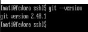

Powyższy zrzut ekranu przedstawia wynik uruchomienia polecenia `git --version`, w wyniku którego wyświetla się wersja zainstalowanego klienta Git. Stanowi to potwierdzenie poprawnego jego zainstalowania.

**2. Instalacja obsługi kluczy SSH**

- Aby włączyć obsługę kluczy SSH należy:
  - zainstalować pakiet OpenSSH przy użyciu polecenia `sudo dnf install openssh-server`
  - uruchomić usługę _**sshd**_ za pomocą polecenia `sudo systemctl enable sshd`, a następnie `sudo systemctl start sshd`

	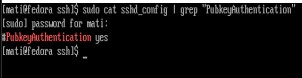

Powyższy zrzut ekranu pokazuje, że autentyfikacja za pomocą publicznego klucza SSH została poprawnie skonfigurowana.

**3. Sklonowanie repozytorium za pomocą HTTPS i personal access token**

- Aby sklonować repozytorium za pomocą HTTPS i PAT należy:
  - przejść do ustawień na swoim koncie GitHub, wybrać _**Developer settings**_, następnie _**Personal access tokens**_, wygenerować nowy token i go skopiować
  - w terminalu wpisać polecenie `git clone https://PAT@github.com/user/repo.git`, gdzie `PAT` to wygenerowany uprzednio token, a `user/repo.git` to ścieżka na GitHub do repozytorium, które chcemy sklonować
  - istnieje także możliwość zapamiętania tokena poprzez klient Git. W tym celu należy wpisać polecenie `git config --global credential.helper store`, a następnie sklonować repozytorium wpisując swój token. Po tym sklonowaniu token zostanie zapamiętany i nie będzie już potrzeby wpisywania go podczas klonowania, wystarczy wtedy polecenie `git clone https://github.com/user/repo.git'. Z racji że token jest w wyniku tego działania zapisywany w zwykłym pliku tekstowym bez zabezpieczeń, nie jest to optymalne rozwiązanie ze względów bezpieczeństwa.
 

 
	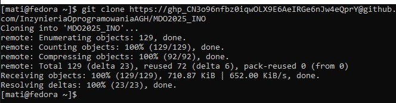

**4. Ustanowienie połączenia między klientem Git a kontem GitHub za pomocą SSH**

- Aby ustanowić połączenie między klientem Git a kontem GitHub należy:
  - wygenerować swój klucz SSH za pomocą wybranego algorytmu szyfrującego, używając polecenia `ssh-keygen -t ed25519 -C "adres.email@domena.com"` 
  - następnie należy wyświetlić klucz publiczny za pomocą polecenia `cat ~/.ssh/id_ed25519.pub` i go skopiować
  - potem w ustawieniach konta GitHub należy wybrać opcję kluczy SSH i dodać skopiowany wcześniej klucz do swojego konta.
- Aby sklonować repozytorium za pomocą SSH należy:
  - na stronie repozytorium na GitHub skopiować jego adres SSH
  - wpisać w terminalu polecenie `git clone git@github.com:user/repo.git`, gdzie _**git@github.com/user/repo.git**_ to skopiowany adres repozytorium

 
	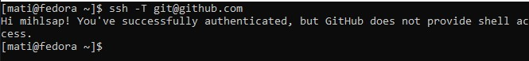

Powyższy zrzut ekranu pokazuje wynik wpisania komendy `ssh -T git@github.com` po poprawnym skonfigurowaniu połączenia SSH między klientem Git, a kontem na GitHub, w wyniku działania którego GitHub zostaje dodany do zaufanych hostów. 

**5. Przełączenie się na gałąź main oraz swojej grupy**

- Aby przełączyć się na gałąź main należy:
  - zmienić katalog w którym się znajdujemy w terminalu na katalog główny sklonowanego repozytorium
  - sprawdzić dostępne gałęzie za pomocą polecenia `git branch -a`
  - przełączyć się na gałąź _**main**_ za pomocą polecenia `git checkout main`, można także pobrać najnowsze zmiany w gałęzi za pomocą polecenia `git pull origin main`
- Aby przełączyć się na gałąź grupy należy:
  - wpisać polecenie `git checkout nazwa_grupy`, gdzie można także pobrać najnowsze zmiany w gałęzi za pomocą polecenia `git pull origin nazwa_grupy`

- Aby utworzyć swoją nową gałąź należy:
  - wpisać polecenie `git checkout -b IN123456`, gdzie _**IN123456**_ to inicjały oraz numer indeksu
  - wpisać polecenie `git branch`, aby upewnić się, czy gałąź została poprawnie utworzona i czy jesteśmy na nią przełączeni

 
	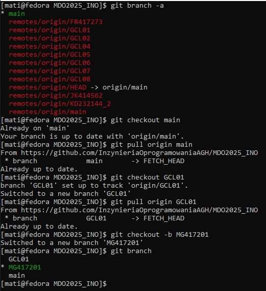

Powyższy zrzut ekranu obrazuje wykonanie wszystkich powyższych kroków z tego punktu.

**6. **

 
	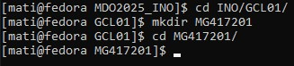

**7. **

 
	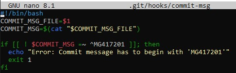

**8. **

 
	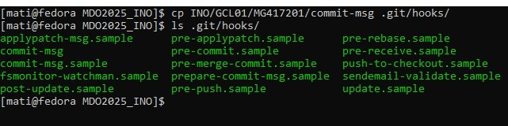

***
## Laboratorium 2
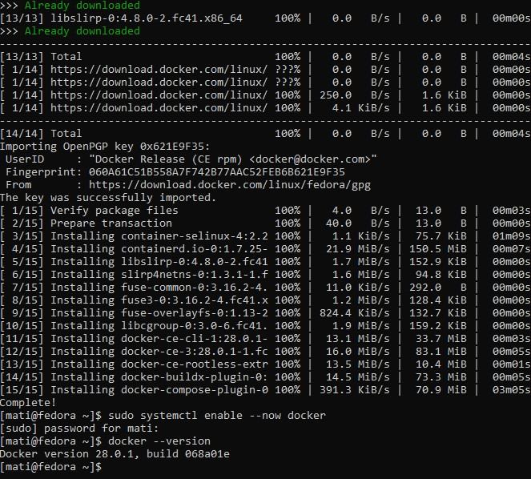

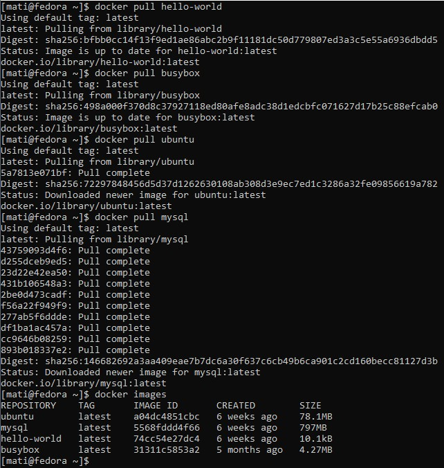

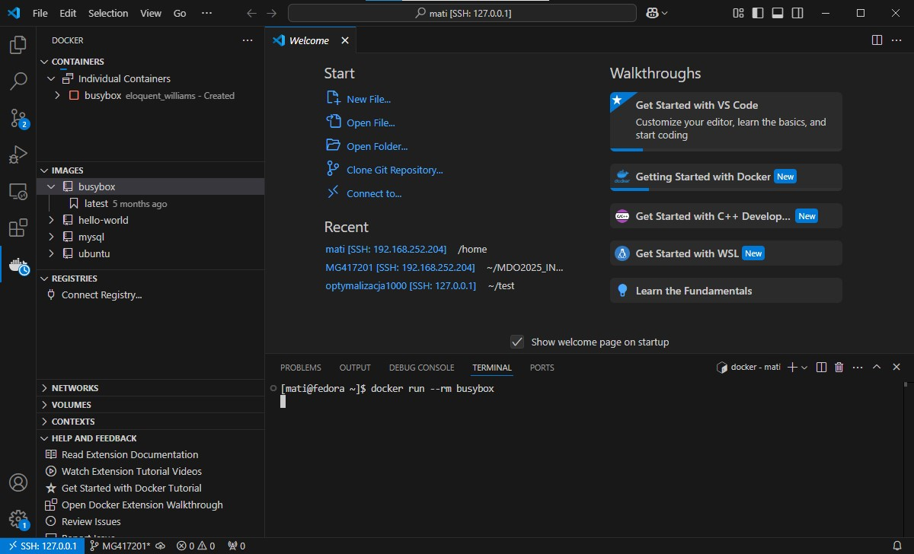

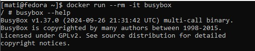

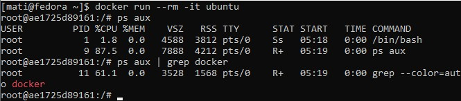

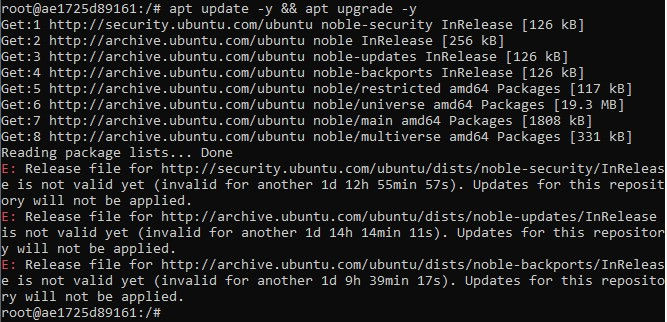

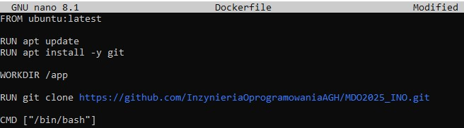

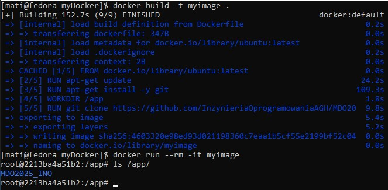

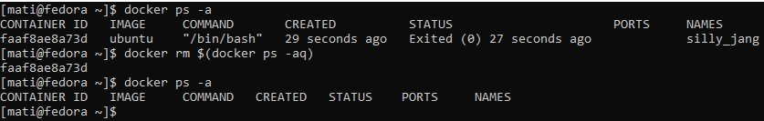

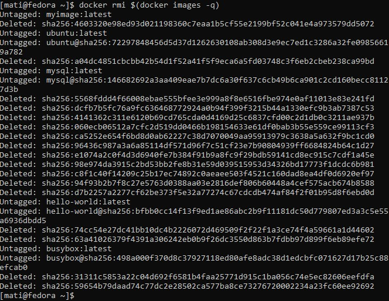

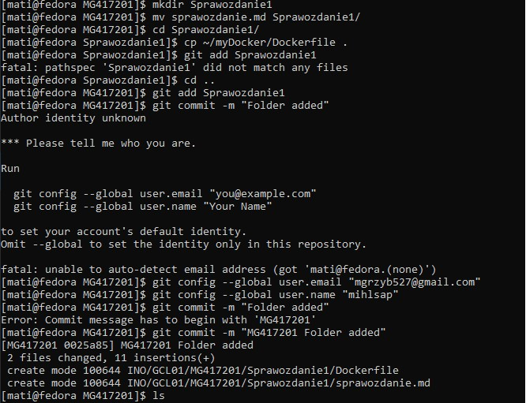

***
## Laboratorium 3

***
## Laboratorium 4
