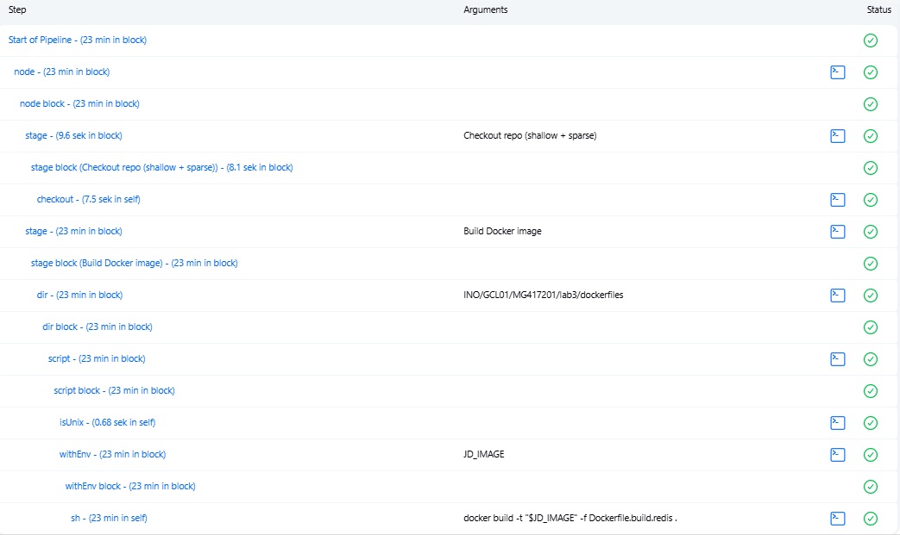

# Sprawozdanie2

## Laboratorium 5

### Utworzenie instancji Jenkins
- Utworzenie sieci dla Jenkinsa

<div align="center"> 
    
</div>

- Utworzenie kontenera `jenkins docker in docker`

<div align="center"> 
    
</div>

- Utworzenie i uruchomienie kontenera _**jenkins Blueocean**_ wraz z przekazywaniem portu

**_jenkins blueocean_** to obraz jenkinsa, który zawiera już preinstalowane i skonfigurowane wtyczki blueocean, oferujące:
    - Wizualne projektowanie i przeglądanie pipeline’ów
    - Zintegrowane zarządzanie pull requestami i zmianami w kodzie

<div align="center"> 
    
</div>

- Uzyskanie hasła do instancji jenkinsa

<div align="center"> 
    
</div>

- Zalogowanie się do jenkinsa po jego otworzeniu w przeglądarce na porcie 8080 (localhost:8080)

<div align="center"> 
    
</div>

- Konfiguracja jenkinsa:

    - Wybranie sugerowanej instalacji wtyczek

    <div align="center"> 
        
    </div>

    - Instalacja wtyczek

    <div align="center"> 
        
    </div>

    - Ponieważ zainstalowane wtyczki nie były kompatybilne z najnowszą wersją jenkinsa blueocean, postanowiłem własnoręcznie zbudować nowy kontener z najnowszą wersją jenkinsa i wtyczką blueocean:

        - Treść Dockerfile:
        ```Dockerfile
        FROM jenkins/jenkins:lts

        RUN jenkins-plugin-cli --plugins \
            blueocean \
            docker-workflow \
            git \
            pipeline-stage-view
        ```

        - Build:

        <div align="center"> 
            
        </div>

        - Uruchomienie kontenera:

        <div align="center"> 
            
        </div>

- Archiwizacja i zabezpieczenie logów:

    - Utworzenie katalogów przechowujących logi i zawartość wolumenu jenkins_home:

    <div align="center"> 
        
    </div>

    - Utworzenie skryptu backupu i zmiana jego uprawnień:

    <div align="center"> 
        
    </div>

    - Treść skryptu:

    ```bash
    #!/usr/bin/env bash
    set -euo pipefail

    TIMESTAMP=$(date +%F_%H%M)
    BACKUP_ROOT=/var/backups/jenkins

    # Archiwizacja logów kontenera
    docker logs jenkins-blueocean > "$BACKUP_ROOT/logs/jenkins-$TIMESTAMP.log"
    gzip -9 "$BACKUP_ROOT/logs/jenkins-$TIMESTAMP.log"

    # Archiwizacja wolumenu jenkins_home
    docker run --rm \
    -v jenkins_home:/volume \
    -v "$BACKUP_ROOT/home":/backup \
    alpine \
    tar czf "/backup/jenkins_home-$TIMESTAMP.tar.gz" -C /volume .
    ```

### Zadanie wstępne: uruchomienie

#### Utworzenie projektu wyświetlającego uname

- Utworzenie nowego projektu

<div align="center"> 
    
</div>

- Utworzenie nowego pipeline

<div align="center"> 
    
</div>

- Wybranie opcji `pipeline script` w sekcji pipeline

<div align="center"> 
    
</div>

```pipeline script
pipeline {
  agent any
  stages {
    stage('Show Uname') {
      steps {
        echo '=== System info ==='
        sh 'uname -a'
      }
    }
  }
}
```

- Uruchomienie pipeline'u

<div align="center"> 
    
</div>

- Output konsoli

>[Console logs](console_logs/uname/logs.log)

#### Utworzenie projektu zwracającego błąd, gdy godzina jest nieparzysta

- Aby utworzyć ten projekt należy powtórzyć wszystkie kroki z powyższego pipeline'u ze zmienioną treścią pipeline script:

```pipeline script
pipeline {
  agent any
  stages {
    stage('Check Hour Parity') {
      steps {
        script {
          def tz = TimeZone.getTimeZone('Europe/Warsaw')
          def hour = new Date().format('H', tz).toInteger()
          echo "Aktualna godzina w strefie ${tz.getID()}: ${hour}"
          if (hour % 2 == 1) {
            error "Godzina ${hour} jest nieparzysta – build przerwany."
          } else {
            echo "Godzina ${hour} jest parzysta – OK."
          }
        }
      }
    }
  }
}
```

- Output konsoli, gdy godzina jest nieparzysta:

>[Console logs](console_logs/uneven_hour/uneven_logs.log)

- Output konsoli, gdy godzina jest parzysta:

>[Console logs](console_logs/uneven_hour/even_logs.log)

#### Utworzenie projektu, w którym pobierany jest obraz kontenera `ubuntu`

- Aby utworzyć ten projekt należy powtórzyć wszystkie kroki z pierwszego pipeline'u ze zmienioną treścią pipeline script:

```pipeline script
pipeline {
  agent any
  stages {
    stage('Pull Ubuntu') {
      steps {
        script {
          docker.image('ubuntu:latest').pull()
          echo "Obraz ubuntu:latest został pobrany."
        }
      }
    }
  }
}
```

- Output konsoli:

>[Console logs](console_logs/ubuntu_pull/logs.log)


### Zadanie wstępne: obiekt typu pipeline

- Z racji korzystania z redisa oraz ograniczonych zasobów sprzętowych mojego komputera byłem zmuszony do zmniejszenia kampanii testowej oprogramowania. W tym celu zmodyfikowałem następująco plik `Dockerfile.test.redis`:

```Dockerfile
FROM redis_build AS redis_test

WORKDIR /redis

RUN ./runtest --single unit/type/string --single unit/type/list \
  --tags "-slow -needs:save -needs:repl -external:skip -latency-monitor -needs:latency"
```

- Utworzenie nowego obiektu typu pipeline

<div align="center"> 
    
</div>

- Treść pipeline'u

```pipeline script
pipeline {
  agent any
  stages {
    stage('Cloning repo') {
      steps {
                git branch: 'MG417201', 
                url: 'https://github.com/InzynieriaOprogramowaniaAGH/MDO2025_INO.git'
            }
    }

    stage('Build Docker image') {
      steps {
        dir('INO/GCL01/MG417201/lab3/dockerfiles') {
          script {
            docker.build('redis-builder-image', '-f Dockerfile.build.redis .')
          }
        }
      }
    }
  }
}
```

- Pierwsze uruchomienie pipeline'u (pierwsza część pipeline'u zakończona sukcesem)

<div align="center"> 
    
</div>

>[Console logs](console_logs/redis_build/1.log)

- Drugie uruchomienie pipeline'u (obie części pipeline'u zakończone sukcesem)

<div align="center"> 
    
</div>

>[Console logs](console_logs/redis_build/2.log)

- Trzecie uruchomienie pipeline'u (obie części pipeline'u zakończone sukcesem)

<div align="center"> 
    
</div>

>[Console logs](console_logs/redis_build/3.log)

Można zauważyć, że czasy kolejnych buildów są znacząco krótsze. Dzieje się tak dzięki systemom cache'owania jenkinsa, który:
* Zapisuje do pamięci cache warstwy Dockera:
  Podczas docker build każda instrukcja z Dockerfile (COPY, RUN, itp.) tworzy nową warstwę. Jeśli zawartość tej warstwy (ani żadna z wcześniejszych) nie uległa zmianie, Docker po prostu ją „odbiera” z cache’a i nie wykonuje jej na nowo. W praktyce oznacza to, że przy drobnych zmianach w kodzie większość kroków builda – np. instalacja zależności – zostaje pominięta, co bardzo przyspiesza kolejny build.

* Utrzymuje workspace na agencie
  Domyślnie Jenkins nie czyści katalogu roboczego między kolejnymi buildami (chyba że jawnie włączymy opcję „Wipe out workspace”). Dzięki temu wszystkie pliki pobrane w poprzedniej iteracji – np. zależności, skompilowane artefakty czy wyniki testów – są wciąż dostępne i nie trzeba ich pobierać/ponownie generować od zera.

 * Cache'uje wtyczki i narzędzia
  Jenkins oraz używane kontenery mogą dodatkowo cache’ować biblioteki, pluginy i paczki systemowe pomiędzy buildami. Dzięki temu kolejne uruchomienia pipeline’u omijają ich ponowną instalację.

### Opis celu

#### Wymagania wstępne środowiska

* Software: Jenkins, Docker, Git, narzędzia testowe (np. pytest)

* Hardware: maszyna hostująca Jenkins

* Uprawnienia: dostęp do repo, Docker socket, sieć do rejestru obrazów

#### Diagram aktywności

<div align="center"> 
    
</div>

#### Diagram wdrożeniowy

<div align="center"> 
    
</div>

### Pipeline: składnia

#### Utworzenie pliku Jenkinsfile

>[Treść pliku Jenkinsfile](../lab3/dockerfiles/Jenkinsfile)

>[Treść pliku Dockerfile.build.redis](../lab3/dockerfiles/Dockerfile.build.redis)

>[Treść pliku Dockerfile.test.redis](../lab3/dockerfiles/Dockerfile.test.redis)

#### Utworzenie nowego pipeline'a

- Proces tworzenia:

<div align="center"> 
    
</div>

<div align="center"> 
    
</div>

#### Uruchomienie pipeline'a

<div align="center"> 
    
</div>

>[Console logs](console_logs/redis_pipeline/logs.log)


### Kompletny pipeline: wymagane składniki