# Sprawozdanie 3

## Zajęcia 8

### Instalacja zarządcy Ansible

#### Utworzenie nowej maszyny wirtualnej

- Z racji, że VM z ansible miał być na tym samym systemie i wersji, co główny VM, pobrałem obraz Fedory server w wersji 41.

##### Instalacja VM

- Ustawienie nazwy hosta i włączenie interfejsu sieciowego

<div align="center"> 
    
</div>

- Utworzenie konta root

<div align="center"> 
    
</div>

- Utworzenie użytkownika ansible

<div align="center"> 
    
</div>

- Ustawnienie czasu systemowego

<div align="center"> 
    
</div>

- Wybór oprogramowania

<div align="center"> 
    
</div>

- Podsumowanie instalacji

<div align="center"> 
    
</div>

##### Setup nowej VM

- Uruchomienie sshd

<div align="center"> 
    
</div>

- Sprawdzenie, czy tar i sshd są zainstalowane

<div align="center"> 
    
</div>

- Zmiana nazwy hosta (pomyliłem się przy instalacji)

<div align="center"> 
    
</div>

#### Utworzenie migawki maszyny wirtualnej

<div align="center"> 
    
</div>

<div align="center"> 
    
</div>

<div align="center"> 
    
</div>

#### Instalacja Ansible na głównej maszynie

<div align="center"> 
    
</div>

<div align="center"> 
    
</div>

#### Utworzenie dwóch kopii `ansible-target` - `ansible-target2` i `ansible-target3`

<div align="center"> 
    
</div>

> Dla `ansible-target3` należy wykonać dokładnie te same kroki, zmieniając jedynie nazwę maszyny

#### Konfiguracja vm, żeby można się było między nimi łączyć

- Dodanie drugiego adaptera sieciowego w Virtual Boxie (dla wszystkich maszyn)

<div align="center"> 
    
</div>

- Sprawdzenie nazwy dodanego interfejsu (`enp0s8`)

<div align="center"> 
    
</div>

- Wyświetlenie listy połączeń

<div align="center"> 
    
</div>

- Modyfikacja połączenia 

    - Dla głównej vm

    <div align="center"> 
    
    </div>

    - Dla pozostałych vm należało użyć tych samych poleceń, zmieniając `ipv4.addresses` na odpowiednio:
        - `ansible-target` - 192.168.56.11
        - `ansible-target2` - 192.168.56.12
        - `ansible-target3` - 192.168.56.13

- Restart połączenia 

<div align="center"> 
    
</div>

- Sprawdzenie adresu IP interfejsu `enp0s8`

    - Dla głównej vm

    <div align="center"> 
    
    </div>

    - Dla `ansible-target`

    <div align="center"> 
    
    </div>

    - Dla `ansible-target`

    <div align="center"> 
    
    </div>

    - Dla `ansible-target`

    <div align="center"> 
    
    </div>

- Dodanie pozostałych maszyn do `/etc/hosts` na głównej vm

<div align="center"> 
    
</div>

- Utworzenie pliku `~/.shh/config`, aby ułatwić połączenie z pozostałymi vm 

<div align="center"> 
    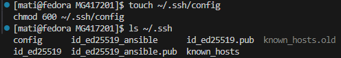
</div>

- Treść pliku `~/.shh/config`:
    ```
    Host ansible-target
        HostName 192.168.56.11
        User ansible
        IdentityFile ~/.ssh/id_ed25519_ansible

    Host ansible-target2
        HostName 192.168.56.12
        User ansible
        IdentityFile ~/.ssh/id_ed25519_ansible

    Host ansible-target3
        HostName 192.168.56.13
        User ansible
        IdentityFile ~/.ssh/id_ed25519_ansible
    ```
    - Dzięki temu plikowi podczas łączenia się z np. `ansible-target` za pomocą ssh wystarczy wpisać `ssh ansible-target`, pomijając nazwę użytkownika oraz plik z kluczem ssh.

#### Wymiana kluczy SSH

- Wygenerowanie klucza SSH na głównej maszynie

<div align="center"> 
    
</div>

- Skopiowanie klucza ssh na vm `ansible-target`

<div align="center"> 
    
</div>

> Aby skopiować klucz ssh na pozostałe vm należy użyć tego samego polecenia, zmieniając nazwę maszyny, do której się łączymy

- Połączenie się za pomocą ssh z `ansible-target`

<div align="center"> 
    
</div>

> Aby połączyć się za pomocą ssh z pozostałymi vm należy użyć tego samego polecenia, zmieniając nazwę maszyny, do której się łączymy

### Inwentaryzacja

#### Ustawienie nazw komputerów

- Na głównej vm

<div align="center"> 
    
</div>

- Na `ansible-target`

<div align="center"> 
    
</div>

> Na pozostałych dwóch vm należało zrobić to samo zmieniając nazwy na odpowiednio `endpoint2` i `endpoint3`, nazwa `ansible-target` także została zmieniona z `endpoint` na `endpoint1`

#### Wprowadzenie nazw DNS dla vm

##### Główna VM

- Dla głównej vm zostało to już wykonane wcześniej, zmodyfikowałem jedynie pliki `~/.ssh/config` oraz `/etc/hosts`, aby odzwierciedlały obecną nazwę hosta oraz reszty vm

    - `/etc/hosts`

    <div align="center"> 
    
    </div>

    - `~/.ssh/config`

    ```
    Host endpoint1
        HostName 192.168.56.11
        User ansible
        IdentityFile ~/.ssh/id_ed25519_ansible

    Host endpoint2
        HostName 192.168.56.12
        User ansible
        IdentityFile ~/.ssh/id_ed25519_ansible

    Host endpoint3
        HostName 192.168.56.13
        User ansible
        IdentityFile ~/.ssh/id_ed25519_ansible
    ```

##### Ansible-target

- Edycja pliku /etc/hosts

<div align="center"> 
    
</div>

> Plik `/etc/hosts` ma na każdej z czterech vm tą samą treść

- Utworzenie pliku `~/.shh/config`

<div align="center"> 
    
</div>

- Teść ogólna tego pliku, dla każdej maszyny pomijana jest ona sama:

```
Host orchestrator
	HostName 192.168.56.10
	User mati

Host endpoint1
    HostName 192.168.56.11
    User ansible
    IdentityFile ~/.ssh/id_ed25519_ansible

Host endpoint2
    HostName 192.168.56.12
    User ansible
    IdentityFile ~/.ssh/id_ed25519_ansible

Host endpoint3
    HostName 192.168.56.13
    User ansible
    IdentityFile ~/.ssh/id_ed25519_ansible
```

#### Test łączności

##### Główna vm (orchestrator)

<div align="center"> 
    
</div>

##### endpoint1

<div align="center"> 
    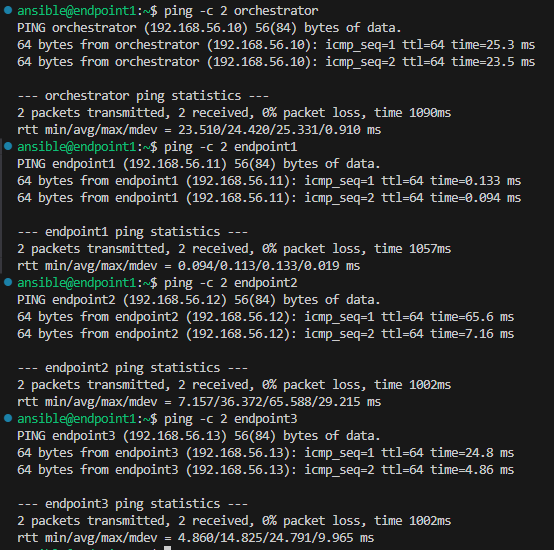
</div>

##### endpoint2

<div align="center"> 
    
</div>

##### endpoint3

<div align="center"> 
    
</div>

#### Utworzenie pliku inwentaryzacji

- Treść pliku:

```ini
[Orchestrators]
orchestrator ansible_connection=local

[Endpoints]
endpoint1
endpoint2
endpoint3
```

#### Wysłanie żądania `ping` do wszystkich maszyn 

<div align="center"> 
    
</div>

### Zdalne wywoływanie procedur

#### Instalacja `rngd`

- `sudo dnf install -y rng-tools`

- `sudo systemctl enable --now rngd`

#### Utworzenie playbooka

- Treść playbooka:

```yml
---
- name: 1. Ping wszystkich
  hosts: all
  gather_facts: false
  ignore_unreachable: true
  tasks:
    - name: "Ping → sprawdzenie dostępu SSH"
      ansible.builtin.ping:
    
    - name: "Usuń stan błędu hostów, by host offline znów był widoczny"
      meta: clear_host_errors

- name: 2. Kopiowanie pliku inventory na Endpoints (z diff)
  hosts: Endpoints:!offline
  gather_facts: true
  tasks:
    - name: "Kopiuj inventory.ini do {{ ansible_user_dir }}"
      ansible.builtin.copy:
        src: inventory.ini
        dest: "{{ ansible_env.HOME }}/inventory.ini"
        mode: '0644'
      diff: yes

- name: 3. Ponowny ping i debug wyników
  hosts: all
  gather_facts: false
  ignore_unreachable: true
  tasks:
    - name: "Ping ponownie"
      ansible.builtin.ping:
      register: ping_results

    - name: "Pokaż obiekt ping_results"
      ansible.builtin.debug:
        var: ping_results

    - name: "Usuń stan błędu hostów, by host offline znów był widoczny"
      meta: clear_host_errors

- name: 4. Aktualizacja pakietów i restart usług
  hosts: all
  become: true
  ignore_unreachable: true
  tasks:
    - name: "Aktualizuj wszystkie pakiety (package=generic)"
      ansible.builtin.package:
        name: "*"
        state: latest

    - name: "Restart sshd"
      ansible.builtin.service:
        name: sshd
        state: restarted
        enabled: true

    - name: "Restart rngd"
      ansible.builtin.service:
        name: rngd
        state: restarted
        enabled: true

    - name: "Usuń stan błędu hostów, by host offline znów był widoczny"
      meta: clear_host_errors

- name: 5. Próba działania na hoście offline
  hosts: offline
  gather_facts: false
  ignore_unreachable: true
  tasks:
    - name: "Ping offline host"
      ansible.builtin.ping:
      ignore_unreachable: true

```

#### Odłączenie interfejsu sieciowego i wyłączenie ssh dla endpoint3

<div align="center"> 
    
</div>

#### Modyfikacja `inventory.ini`

Treść pliku:

```ini
[Orchestrators]
orchestrator ansible_connection=local

[Endpoints]
endpoint1
endpoint2
endpoint3

[offline]
endpoint3
```

#### Uruchomienie playbooka

> Do uruchomienia playbooka użyłem polecenia: `ansible-playbook -i inventory.ini playbook1.yml --diff --ask-become-pass`

>[output](logs/1.log)

### Zarządzanie stworzonym artefaktem

#### Przygotowanie roli `ansible-galaxy`

##### Utworzenie szkieletu roli

<div align="center"> 
    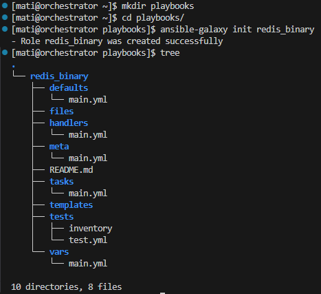
</div>

##### Konfiguracja zmiennych domyślnych (plik `redis_binary/defaults/main.yml`)

- Treść pliku:

```yml
---
artifact_zip: "redis-1.0.zip"
artifact_remote: "/tmp/{{ artifact_zip }}" 
unpack_dir:     "/opt/redis"
image_name:     "redis_binary"         
image_tag:      "1.0"
container_name: "redis_binary"
container_port: 6379
host_port:      6379
```

##### Skopiowanie artefaktów do katalogu `redis_binary/files`

> Użyte polecenie: `cp ~/MDO2025_INO/INO/GCL01/MG417201/redis-ci-cd/output/redis-1.0.zip redis_binary/files/`

##### Napisanie zadań (edycja pliku `redis_binary/tasks/main.yml`)

- Treść pliku:

```yml
---
- name: Install Docker
  package:
    name: docker
    state: present

- name: Start Docker service
  service:
    name: docker
    state: started
    enabled: true

- name: Copy Redis ZIP to remote
  copy:
    src: "{{ artifact_zip }}"
    dest: "{{ artifact_remote }}"
    mode: '0644'

- name: Ensure unpack directory exists
  file:
    path: "{{ unpack_dir }}"
    state: directory
    mode: '0755'

- name: Unpack Redis binaries
  unarchive:
    src: "{{ artifact_remote }}"
    dest: "{{ unpack_dir }}"
    remote_src: yes
    creates: "{{ unpack_dir }}/redis-server"

- name: Prepare Docker build context
  file:
    path: /tmp/redis-context
    state: directory

- name: Copy redis-server into build context
  copy:
    remote_src: yes
    src: "{{ unpack_dir }}/redis-server"
    dest: /tmp/redis-context/redis-server
    mode: '0755'

- name: Copy redis-cli into build context
  copy:
    remote_src: yes
    src: "{{ unpack_dir }}/redis-cli"
    dest: /tmp/redis-context/redis-cli
    mode: '0755'

- name: Create Dockerfile in build context
  copy:
    dest: /tmp/redis-context/Dockerfile.redis
    content: |
      FROM ubuntu:latest
      RUN apt-get update && \
          apt-get install -y --no-install-recommends ca-certificates && \
          rm -rf /var/lib/apt/lists/*
      COPY redis-server /usr/local/bin/redis-server
      COPY redis-cli    /usr/local/bin/redis-cli
      EXPOSE {{ container_port }}
      CMD ["redis-server"]
    mode: '0644'

- name: Pull base image ubuntu:latest
  community.docker.docker_image:
    name: ubuntu
    tag: latest
    source: pull

- name: Build Redis Docker image
  community.docker.docker_image:
    name: "{{ image_name }}"
    tag: "{{ image_tag }}"
    source: build
    build:
      path: /tmp/redis-context
      dockerfile: Dockerfile.redis


- name: Run Redis container
  community.docker.docker_container:
    name: "{{ container_name }}"
    image: "{{ image_name }}:{{ image_tag }}"
    state: started
    restart_policy: unless-stopped
    published_ports:
      - "{{ host_port }}:{{ container_port }}"

- name: Wait for Redis port
  wait_for:
    host: localhost
    port: "{{ host_port }}"
    timeout: 30

- name: Verify Redis PING
  command: docker exec {{ container_name }} redis-cli PING
  register: ping
  changed_when: false

- name: Assert PONG
  assert:
    that:
      - ping.stdout == "PONG"

- name: Remove Redis container
  community.docker.docker_container:
    name: "{{ container_name }}"
    state: absent

- name: Remove Redis image
  community.docker.docker_image:
    name: "{{ image_name }}"
    tag: "{{ image_tag }}"
    state: absent
```

##### Stworzenie inwentarza (`inventory.ini`)

- Treść pliku:

```ini
[deploy]
endpoint1
endpoint2
endpoint3
```

##### Stworzenie playbooka wywołującego role

- Treść pliku:

```yml
---
- name: Deploy Redis from binary artifact
  hosts: deploy
  become: true
  roles:
    - redis_binary
```

##### Struktura katalogów i plików po wykonaniu powyższych kroków

<div align="center"> 
    
</div>

#### Uruchomienie playbooka

- Użyte polecenie: 

`ansible-playbook -i inventory.ini deploy-binary.yml`

>[output](logs/2.log)

## Zajęcia 9

### Przygotowanie pliku odpowiedzi

#### Skopiowanie pliku odpowiedzi `/root/anaconda-ks.cfg`, tak aby był dostępny z GitHub'a

<div align="center"> 
    
</div>

#### Modyfikacja pliku odpowiedzi

- Zmodyfikowałem następujące rzeczy:

  - Dodanie mirrorlist:
  
  ```cfg
  repo --name=fedora --mirrorlist=http://mirrors.fedoraproject.org/mirrorlist?repo=fedora-41&arch=x86_64
  repo --name=updates --mirrorlist=http://mirrors.fedoraproject.org/mirrorlist?repo=updates-released-f41&arch=x86_64
  ```

  - Dodanie paczek `tar` oraz `openssh-server`

  ```cfg
  %packages
  @^server-product-environment
  openssh-server 
  tar 
  %end
  ```

  - Zapewnienie formatowania dysku

  ```cfg
  clearpart --all --initlabel
  ```

  - Ustawienie hostname innego niż `localhost`

  ```cfg
  network  --hostname=ansible
  ```

>[Plik odpowiedzi po modyfikacji](anaconda-ks.cfg)

>Plik odpowiedzi został umieszczony na mojej gałęzi w ścieżce `MG417201/Sprawozdanie3`, dzięki czemu po zrobieniu commita i pusha jest on widoczny na GitHubie.

### Instalacja systemu z pliku odpowiedzi

- Utworzenie nowej maszyny wirtualnej

<div align="center"> 
    
</div>

<div align="center"> 
    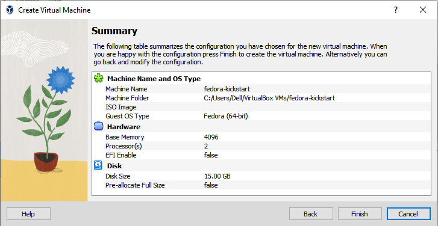
</div>

- Po utworzeniu vm należy zamontować iso systemu, dodałem też drugi adapter sieciowy `host-only`

<div align="center"> 
    
</div>

- Następnie uruchomiłem vm i wybierając opcję `Install Fedora 41`, nacisnąłem `e`, aby dokonać edycji opcji bootowania

<div align="center"> 
    
</div>

- Poniżej widoczne są opcje bootowania przed edycją

<div align="center"> 
    
</div>

- Poniżej widoczne są opcje bootowania po edycji

>Oprócz odniesienia do pliku kickstart, określiłem, z którego interfejsu sieciowego (NAT) system ma korzystać podczas instalacji

<div align="center"> 
    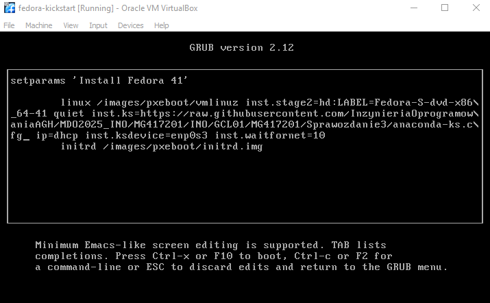
</div>

- Następnie wyświetlił się GUI do instalacji systemu, w którym były już wprowadzone wszystkie zmiany z pliku kickstart, dlatego nie należało nic tam edytować, a system po wykryciu źródła instalacji przeszedł samodzielnie do instalacji

- Screeny z progresu instalacji

<div align src="screens9/8.png">
</div>

<div align="center"> 
    
</div>

- System po uruchomieniu

<div align="center"> 
    
</div>

### Rozszerzenie pliku odpowiedzi o repozytoria i oprogramowanie potrzebne do uruchomienia programu zbudowanego podczas pipeline'u  (wraz z zakresem rozszerzonym)

>[Treść nowego pliku odpowiedzi](anaconda-ks1.cfg), opatrzyłem go komentarzami dotyczącymi dodanych rzeczy, w tym definicji redisa jako usługi systemowej

- Utworzyłem kolejną vm w dokładnie ten sam sposób, jak poprzednią, poniżej widać podsumowanie instalacji

<div align="center"> 
    
</div>

- Poniżej widoczne są opcje bootowania po edycji

<div align="center"> 
    
</div>

- Próbowałem wyświetlić działania z sekcji `%post` w trakcie instalacji, ale nie powiodło mi się to, nic nie wyświetlało się ani na głównym terminalu, ani na TTY2, a plik `ks-post.log` nie był dostępny

<div align="center"> 
    
</div>

- Podsumowanie instalacji

<div align="center"> 
    
</div>

- Logi z sekcji `%post`

<div align="center"> 
    
</div>

- Wykazanie działania oprogramowania i usługi

<div align="center"> 
    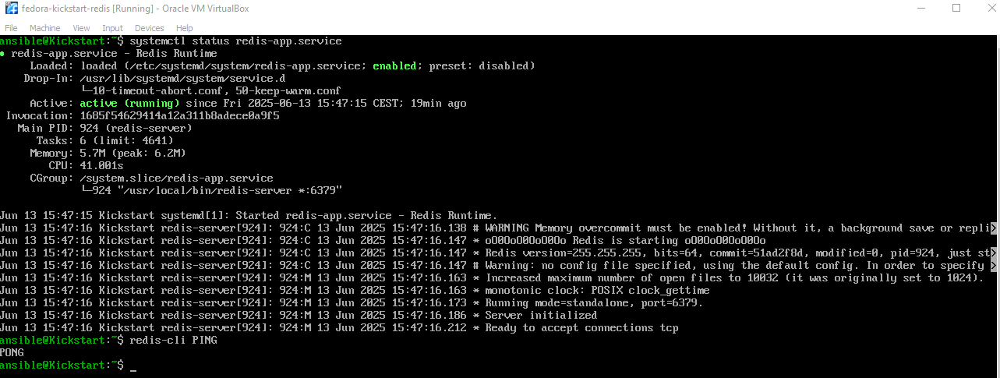
</div>

- Stworzenie skryptu automatyzującego tworzenie VM

```ps1
$vmName   = "FedoraKS"
$isoPath  = "C:\ISOs\fedora-ks.iso"
$vmFolder = "$env:USERPROFILE\VirtualBox VMs\$vmName"
$vdiPath  = Join-Path $vmFolder "$vmName.vdi"

VBoxManage.exe createvm --name $vmName --ostype Fedora_64 --register

VBoxManage.exe modifyvm $vmName --memory 2048 --vram 16 --nic1 nat

VBoxManage.exe createhd --filename $vdiPath --size 20000
VBoxManage.exe storagectl $vmName --name "SATA" --add sata --controller IntelAHCI
VBoxManage.exe storageattach $vmName --storagectl "SATA" --port 0 --device 0 `
  --type hdd --medium $vdiPath

VBoxManage.exe storageattach $vmName --storagectl "SATA" --port 1 --device 0 `
  --type dvddrive --medium $isoPath

VBoxManage.exe modifyvm $vmName --natpf1 "ssh,tcp,,2222,,22"

VBoxManage.exe startvm $vmName --type headless

Write-Host "VM $vmName should start now..." -ForegroundColor Green
```

- Uruchomienie skryptu

<div align="center"> 
    
</div>

<div align="center"> 
    
</div>

## Zajęcia 10

### Instalacja klastra Kubernetes

#### Instalacja minicube

<div align="center"> 
    
</div>

#### Wykazanie poziomu bezpieczeństwa instalacji (sprawdzenie certów i użytkowników)

<div align="center"> 
    
</div>

#### Instalacja `kubectl`

<div align="center"> 
    
</div>

#### Aliasowanie `kubectl`

<div align="center"> 
    
</div>

<div align="center"> 
    
</div>

#### Pokazanie statusu minikube oraz działających podów

<div align="center"> 
    
</div>

#### Mitygacja wymagań sprzętowych

>Mój system spełnia wszystkie minimalne wymagania systemowe kubernetes, dlatego nie konfigurowałem minikube w żaden sposób.

#### Uruchomienie dashboardu

<div align="center"> 
    
</div>

<div align="center"> 
    
</div>

### Analiza posiadanego kontenera

- W celu przygotowania obrazu Dockera z redisem, zmodyfikowałem używanego podczas poprzedniego sprawozdania pipeline'a.

>[Jenkinsfile](../redis-ci-cd/Jenkinsfile)

- Dockerfile's pozostały bez zmian względem poprzedniego sprawozdania

>[Dockerfile.build.redis](../redis-ci-cd/Dockerfile.build.redis)

>[Dockerfile.test.redis](../redis-ci-cd/Dockerfile.test.redis)

>[Dockerfile.runtime](../redis-ci-cd/Dockerfile.runtime)

- Stage view

<div align="center"> 
    
</div>

>[logi](../redis-ci-cd/output/logs1.log)

- Udowadnienie, że kontener pracuje i nie wyłącza się od razu:

  - Fragment logów

  ```log
  + docker run -d --name redis-runtime -p 6379:6379 mihlsap/redis_runtime1.0
  b3e9d946fa2bd9476e557bc89a21be461b463850e9850eabc44dccbaa8689724
  + sleep 3
  + docker exec redis-runtime redis-cli PING
  PONG
  ```

  - Screen

  <div align="center"> 
      
  </div>

### Uruchamianie oprogramowania

#### Uruchomienie oprogramowania na stosie k8s

<div align="center"> 
    
</div>

#### Sprawdzenie działania

<div align="center"> 
    
</div>

<div align="center"> 
    
</div>

- Sprawdzenie szczegółów

```bash
[mati@orchestrator home]$ minikube kubectl -- describe pod -l app=redis-single
Name:             redis-single
Namespace:        default
Priority:         0
Service Account:  default
Node:             minikube/192.168.58.2
Start Time:       Sat, 14 Jun 2025 14:57:28 +0200
Labels:           app=redis-single
Annotations:      <none>
Status:           Running
IP:               10.244.0.14
IPs:
  IP:  10.244.0.14
Containers:
  redis-single:
    Container ID:   docker://7e7d582af7bf4776bec637608f0a77203968b1e9b4369da1dac5582c125d1ef1
    Image:          mihlsap/redis_runtime1.0
    Image ID:       docker-pullable://mihlsap/redis_runtime1.0@sha256:58bf1f4ad6e9c9e22dd0c962974760e86573f1bc1bb0bf4af884c8537f70840b
    Port:           6379/TCP
    Host Port:      0/TCP
    State:          Running
      Started:      Sat, 14 Jun 2025 14:58:22 +0200
    Ready:          True
    Restart Count:  0
    Environment:    <none>
    Mounts:
      /var/run/secrets/kubernetes.io/serviceaccount from kube-api-access-sktnz (ro)
Conditions:
  Type                        Status
  PodReadyToStartContainers   True 
  Initialized                 True 
  Ready                       True 
  ContainersReady             True 
  PodScheduled                True 
Volumes:
  kube-api-access-sktnz:
    Type:                    Projected (a volume that contains injected data from multiple sources)
    TokenExpirationSeconds:  3607
    ConfigMapName:           kube-root-ca.crt
    ConfigMapOptional:       <nil>
    DownwardAPI:             true
QoS Class:                   BestEffort
Node-Selectors:              <none>
Tolerations:                 node.kubernetes.io/not-ready:NoExecute op=Exists for 300s
                             node.kubernetes.io/unreachable:NoExecute op=Exists for 300s
Events:
  Type    Reason     Age    From               Message
  ----    ------     ----   ----               -------
  Normal  Scheduled  3m3s   default-scheduler  Successfully assigned default/redis-single to minikube
  Normal  Pulling    2m58s  kubelet            Pulling image "mihlsap/redis_runtime1.0"
  Normal  Pulled     2m17s  kubelet            Successfully pulled image "mihlsap/redis_runtime1.0" in 41.313s (41.314s including waiting). Image size: 107579739 bytes.
  Normal  Created    2m10s  kubelet            Created container: redis-single
  Normal  Started    2m7s   kubelet            Started container redis-single
```

#### Wyprowadzene portu

<div align="center"> 
    
</div>

#### Komunikacja z eksponowaną funkcjonalnością

<div align="center"> 
    
</div>

#### Zatrzymanie przekierowywania portu

<div align="center"> 
    
</div>

#### Próba komunikacji z eksponowaną funkcjonalnością po zatrzyamniu przekierowywania portu

<div align="center"> 
    
</div>

### Przekucie wdrożenia manualnego w plik wdrożenia (wprowadzenie)

#### Wygenerowanie początkowego pliku deploymentu

<div align="center"> 
    
</div>

- Treść pliku:

```yaml
apiVersion: apps/v1
kind: Deployment
metadata:
  creationTimestamp: null
  labels:
    app: nginx-deploy
  name: nginx-deploy
spec:
  replicas: 1
  selector:
    matchLabels:
      app: nginx-deploy
  strategy: {}
  template:
    metadata:
      creationTimestamp: null
      labels:
        app: nginx-deploy
    spec:
      containers:
      - image: nginx:latest
        name: nginx
        ports:
        - containerPort: 80
        resources: {}
status: {}
```

#### Wdrożenie deploymentu

<div align="center"> 
    
</div>

<div align="center"> 
    
</div>

<div align="center"> 
    
</div>

#### Zwiększenie liczby replik

- Zmiana wartości replicas na 4 w pliku `nginx-deplou.yaml`

<div align="center"> 
    
</div>

- Rozpoczęcie wdrożenia

<div align="center"> 
    
</div>

- Zbadanie stanu

<div align="center"> 
    
</div>

<div align="center"> 
    
</div>

#### Wyeksponowanie wdrożenia jako serwis i przekierowanie portu

<div align="center"> 
    
</div>

<div align="center"> 
    
</div>

## Zajęcia 11

### Przygotowanie nowego obrazu

#### Zbudowanie drugiej wersji oprogramowania i wypchnięcie jej na DockerHub

<div align="center"> 
    
</div>

<div align="center"> 
    
</div>

#### Zbudowanie trzeciej niedziałającej wersji oprogramowania i wypchnięcie jej na DockerHub

- Utworzenie `Dockerfile.fail`

```Dockerfile
FROM mihlsap/redis_runtime1.0:1.0
CMD ["/bin/false"]
```

- Zbudowanie obrazu

<div align="center"> 
    
</div>

- Wypchnięcie

<div align="center"> 
    
</div>

- Weryfikacja jego działania

<div align="center"> 
    
</div>

#### Wersje obrazu na DockerHub 

<div align="center"> 
    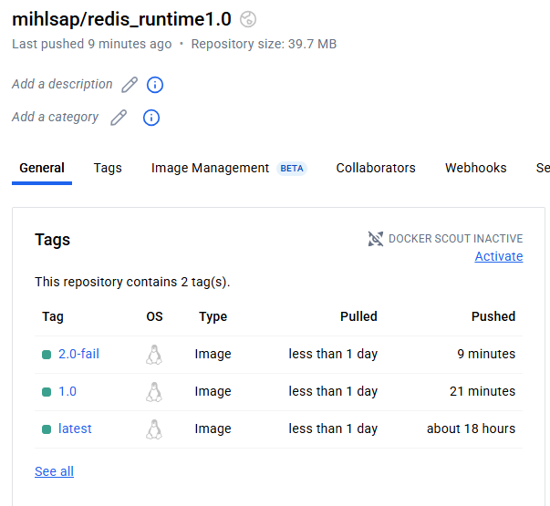
</div>

### Zmiany w deploymencie

#### Utworzenie pliku `redis-deploy.yaml`

```yaml
apiVersion: apps/v1
kind: Deployment
metadata:
  name: redis-deploy
  labels:
    app: redis
spec:
  replicas: 1
  selector:
    matchLabels:
      app: redis
  template:
    metadata:
      labels:
        app: redis
    spec:
      containers:
      - name: redis
        image: mihlsap/redis_runtime1.0:latest
        ports:
        - containerPort: 6379
```

#### Wdrożenie deploymentu

<div align="center"> 
    
</div>

#### Zwiększenie replik do 8

- Modyfikacja liczby replik w pliku `redis-deploy.yaml`: `replicas: 8`

- Zastosowanie zmiany

<div align="center"> 
    
</div>

#### Zmniejszenie liczby replik do 1

- Modyfikacja liczby replik w pliku `redis-deploy.yaml`: `replicas: 1`

- Zastosowanie zmiany

<div align="center"> 
    
</div>

#### Zmniejszenie liczby replik do 0

- Modyfikacja liczby replik w pliku `redis-deploy.yaml`: `replicas: 0`

- Zastosowanie zmiany

<div align="center"> 
    
</div>

#### Ponowne przeskalowanie w górę do 4 replik

- Modyfikacja liczby replik w pliku `redis-deploy.yaml`: `replicas: 4`

- Zastosowanie zmiany

<div align="center"> 
    
</div>

#### Zastosowanie nowej wersji obrazu

- Modyfikacja obrazu w pliku `redis-deploy.yaml`: `image: mihlsap/redis_runtime1.0:1.0`

- Zastosowanie zmiany

<div align="center"> 
    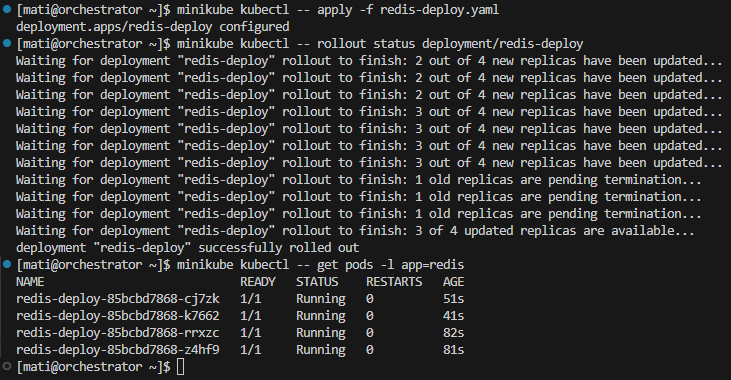
</div>

#### Zastosowanie starszej wersji obrazu

- Modyfikacja obrazu w pliku `redis-deploy.yaml`: `image: mihlsap/redis_runtime1.0:latest`

- Zastosowanie zmiany

<div align="center"> 
    
</div>

#### Zastosowanie "wadliwego" obrazu

- Modyfikacja obrazu w pliku `redis-deploy.yaml`: `image: mihlsap/redis_runtime1.0:2.0-fail`

- Zastosowanie zmiany

<div align="center"> 
    
</div>

<div align="center"> 
    
</div>

>Próba zastosowania wadliwego obrazu zakończyła się zawieszeniem przy poleceniu `minikube kubectl -- rollout status deployment/redis-deploy`, ponieważ żaden pod nigdy nie wejdzie w stan Ready. Jak widać na drugim screenie dwa pody miały status `CrashLoopBackOff`, co oznacza, że nie uruchomiły się prawidłowo.

#### Przywracanie poprzednich wersji wdrożeń

- Wyświetlenie historii rewizji

<div align="center"> 
    
</div>

- Cofnięcie do poprzedniej rewizji

<div align="center"> 
    
</div>

- Cofnięcie do konkretnej (drugiej) rewizji

<div align="center"> 
    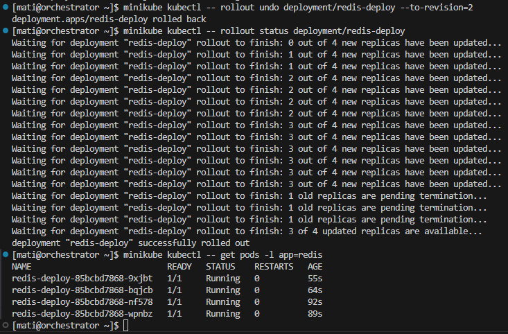
</div>

<div align="center"> 
    
</div>

### Kontrola wdrożenia

#### Weryfikacja historii wdrożeń

- `revision=4` - niedziałający obraz

<div align="center"> 
    
</div>

- `revision=5` - działający obraz

<div align="center"> 
    
</div>

- `revision=6` - działający obraz

<div align="center"> 
    
</div>

#### Utworzenie skryptu weryfikującego, czy wdrożenie "zdążyło" się wdrożyć (60 sekund)

- Treść skryptu

```sh
#!/usr/bin/env bash
# check-rollout.sh <deployment-name> [timeout-seconds]
set -euo pipefail

DEPLOY="${1:-}"
TIMEOUT="${2:-60}"

if [[ -z "$DEPLOY" ]]; then
  echo "Usage: $0 <deployment-name> [timeout-seconds]" >&2
  exit 2
fi

END=$(( SECONDS + TIMEOUT ))
echo "Waiting up to $TIMEOUT s for rollout of deployment/$DEPLOY ..."

while true; do
  DESIRED=$(kubectl get deploy "$DEPLOY" -o jsonpath='{.spec.replicas}')
  UPDATED=$(kubectl get deploy "$DEPLOY" -o jsonpath='{.status.updatedReplicas}')
  AVAILABLE=$(kubectl get deploy "$DEPLOY" -o jsonpath='{.status.availableReplicas}')

  if [[ "$UPDATED" == "$DESIRED" && "$AVAILABLE" == "$DESIRED" ]]; then
    echo "Rollout of $DEPLOY succeeded: $AVAILABLE/$DESIRED replicas available."
    exit 0
  fi

  if (( SECONDS >= END )); then
    echo "Timeout after $TIMEOUT s: only $AVAILABLE/$DESIRED replicas available."
    exit 1
  fi

  sleep 2
done
```

- Działanie skryptu dla poprawnego obrazu

<div align="center"> 
    
</div>

- Działanie skryptu dla wadliwego obrazu

<div align="center"> 
    
</div>

#### Zakres rozszerzony: Ujmij skrypt w pipeline Jenkins

- W celu wykonania zadania utworzyłem własny obraz Dockera zawierający wszystkie potrzebne zależności do poprawnego działania pipeline'a

```Dockerfile
FROM debian:bookworm-slim

RUN apt-get update && apt-get install -y \
  curl bash conntrack socat iptables iproute2 gnupg ca-certificates util-linux docker.io sudo && \
  update-alternatives --set iptables /usr/sbin/iptables-legacy && \
  update-alternatives --set ip6tables /usr/sbin/ip6tables-legacy

  RUN curl -LO https://dl.k8s.io/release/v1.32.0/bin/linux/amd64/kubectl && \
    install -o root -g root -m 0755 kubectl /usr/local/bin/kubectl && \
    rm kubectl
```

- Następnie zbudowałem obraz na jego podstawie:

<div align="center"> 
    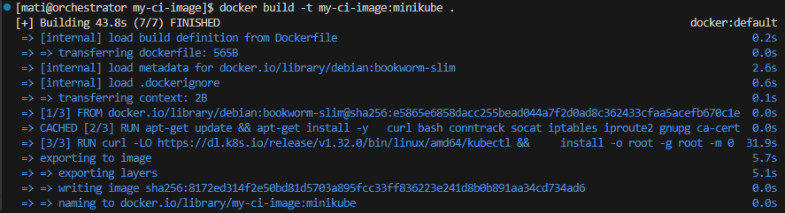
</div>

- Oraz wypchnąłem go na DockerHub:

<div align="center"> 
    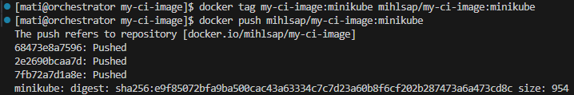
</div>

- Zmieniłem następująco Jenkinsfile:

>[Jenkinsfile](../redis-ci-cd/Jenkinsfile)

- Na końcu uruchomiłem pipeline'a

>[Logi](../redis-ci-cd/output/logs2.log)

<div align="center"> 
    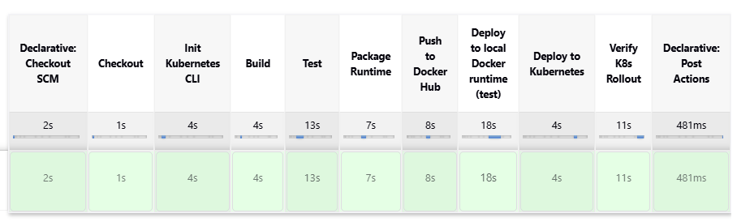
</div>

- W wyniku jego działania:

    - Na DockerHub został wypchnięty obraz `redis_runtime2.0`

<div align="center"> 
    
</div>

<div align="center"> 
    
</div>

### Strategie wdrożenia

#### Recreate

```yaml
apiVersion: apps/v1
kind: Deployment
metadata:
  name: redis-recreate
  labels:
    app: redis
    strategy: recreate
spec:
  replicas: 3
  selector:
    matchLabels:
      app: redis
      strategy: recreate
  strategy:
    type: Recreate
  template:
    metadata:
      labels:
        app: redis
        strategy: recreate
    spec:
      containers:
      - name: redis
        image: mihlsap/redis_runtime1.0:latest
        ports:
        - containerPort: 6379
```
- Wdrożenie i obserwacja

<div align="center"> 
    
</div>

<div align="center"> 
    
</div>

#### Rolling Upgrade

```yaml
apiVersion: apps/v1
kind: Deployment
metadata:
  name: redis-rolling
  labels:
    app: redis
    strategy: rolling
spec:
  replicas: 3
  selector:
    matchLabels:
      app: redis
      strategy: rolling
  strategy:
    type: RollingUpdate
    rollingUpdate:
      maxUnavailable: 2
      maxSurge: 25%
  template:
    metadata:
      labels:
        app: redis
        strategy: rolling
    spec:
      containers:
      - name: redis
        image: mihlsap/redis_runtime1.0:latest
        ports:
        - containerPort: 6379
```

- Wdrożenie i obserwacja

```bash
minikube kubectl -- apply -f redis-deploy-rolling.yaml
minikube kubectl -- rollout status deployment/redis-rolling
minikube kubectl -- get pods -l strategy=rolling
```

#### Canary Deployment Workload

##### Stable

```yaml
apiVersion: apps/v1
kind: Deployment
metadata:
  name: redis-stable
  labels:
    app: redis
    track: stable
spec:
  replicas: 3
  selector:
    matchLabels:
      app: redis
      track: stable
  template:
    metadata:
      labels:
        app: redis
        track: stable
    spec:
      containers:
      - name: redis
        image: mihlsap/redis_runtime1.0:latest
        ports:
        - containerPort: 6379
```

- Wdrożenie i obserwacja

##### Canary

```yaml
apiVersion: apps/v1
kind: Deployment
metadata:
  name: redis-canary
  labels:
    app: redis
    track: canary
spec:
  replicas: 1
  selector:
    matchLabels:
      app: redis
      track: canary
  template:
    metadata:
      labels:
        app: redis
        track: canary
    spec:
      containers:
      - name: redis
        image: mihlsap/redis_runtime1.0:2.0-fail
        ports:
        - containerPort: 6379
```

- Wdrożenie i obserwacja

##### Service

```yaml
apiVersion: v1
kind: Service
metadata:
  name: redis-svc
spec:
  selector:
    app: redis
    # na start tylko wskaż „stable”:
    track: stable
  ports:
  - port: 6379
    targetPort: 6379
  type: ClusterIP
```

- Wdrożenie i obserwacja

