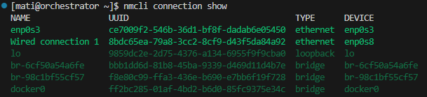
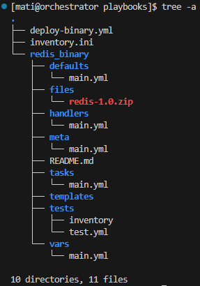

# Sprawozdanie 3

## Zajęcia 8

### Instalacja zarządcy Ansible

#### Utworzenie nowej maszyny wirtualnej

- Z racji, że VM z ansible miał być na tym samym systemie i wersji, co główny VM, pobrałem obraz Fedory server w wersji 41.

##### Instalacja VM

- Ustawienie nazwy hosta i włączenie interfejsu sieciowego

<div align="center"> 
    
</div>

- Utworzenie konta root

<div align="center"> 
    
</div>

- Utworzenie użytkownika ansible

<div align="center"> 
    
</div>

- Ustawnienie czasu systemowego

<div align="center"> 
    
</div>

- Wybór oprogramowania

<div align="center"> 
    
</div>

- Podsumowanie instalacji

<div align="center"> 
    
</div>

##### Setup nowej VM

- Uruchomienie sshd

<div align="center"> 
    
</div>

- Sprawdzenie, czy tar i sshd są zainstalowane

<div align="center"> 
    
</div>

- Zmiana nazwy hosta (pomyliłem się przy instalacji)

<div align="center"> 
    
</div>

#### Utworzenie migawki maszyny wirtualnej

<div align="center"> 
    
</div>

<div align="center"> 
    
</div>

<div align="center"> 
    
</div>

#### Instalacja Ansible na głównej maszynie

<div align="center"> 
    
</div>

<div align="center"> 
    
</div>

#### Utworzenie dwóch kopii `ansible-target` - `ansible-target2` i `ansible-target3`

<div align="center"> 
    
</div>

> Dla `ansible-target3` należy wykonać dokładnie te same kroki, zmieniając jedynie nazwę maszyny

#### Konfiguracja vm, żeby można się było między nimi łączyć

- Dodanie drugiego adaptera sieciowego w Virtual Boxie (dla wszystkich maszyn)

<div align="center"> 
    
</div>

- Sprawdzenie nazwy dodanego interfejsu (`enp0s8`)

<div align="center"> 
    
</div>

- Wyświetlenie listy połączeń

<div align="center"> 
    
</div>

- Modyfikacja połączenia 

    - Dla głównej vm

    <div align="center"> 
    
    </div>

    - Dla pozostałych vm należało użyć tych samych poleceń, zmieniając `ipv4.addresses` na odpowiednio:
        - `ansible-target` - 192.168.56.11
        - `ansible-target2` - 192.168.56.12
        - `ansible-target3` - 192.168.56.13

- Restart połączenia 

<div align="center"> 
    
</div>

- Sprawdzenie adresu IP interfejsu `enp0s8`

    - Dla głównej vm

    <div align="center"> 
    
    </div>

    - Dla `ansible-target`

    <div align="center"> 
    
    </div>

    - Dla `ansible-target`

    <div align="center"> 
    
    </div>

    - Dla `ansible-target`

    <div align="center"> 
    
    </div>

- Dodanie pozostałych maszyn do `/etc/hosts` na głównej vm

<div align="center"> 
    
</div>

- Utworzenie pliku `~/.shh/config`, aby ułatwić połączenie z pozostałymi vm 

<div align="center"> 
    
</div>

- Treść pliku `~/.shh/config`:
    ```
    Host ansible-target
        HostName 192.168.56.11
        User ansible
        IdentityFile ~/.ssh/id_ed25519_ansible

    Host ansible-target2
        HostName 192.168.56.12
        User ansible
        IdentityFile ~/.ssh/id_ed25519_ansible

    Host ansible-target3
        HostName 192.168.56.13
        User ansible
        IdentityFile ~/.ssh/id_ed25519_ansible
    ```
    - Dzięki temu plikowi podczas łączenia się z np. `ansible-target` za pomocą ssh wystarczy wpisać `ssh ansible-target`, pomijając nazwę użytkownika oraz plik z kluczem ssh.

#### Wymiana kluczy SSH

- Wygenerowanie klucza SSH na głównej maszynie

<div align="center"> 
    
</div>

- Skopiowanie klucza ssh na vm `ansible-target`

<div align="center"> 
    
</div>

> Aby skopiować klucz ssh na pozostałe vm należy użyć tego samego polecenia, zmieniając nazwę maszyny, do której się łączymy

- Połączenie się za pomocą ssh z `ansible-target`

<div align="center"> 
    
</div>

> Aby połączyć się za pomocą ssh z pozostałymi vm należy użyć tego samego polecenia, zmieniając nazwę maszyny, do której się łączymy

### Inwentaryzacja

#### Ustawienie nazw komputerów

- Na głównej vm

<div align="center"> 
    
</div>

- Na `ansible-target`

<div align="center"> 
    
</div>

> Na pozostałych dwóch vm należało zrobić to samo zmieniając nazwy na odpowiednio `endpoint2` i `endpoint3`, nazwa `ansible-target` także została zmieniona z `endpoint` na `endpoint1`

#### Wprowadzenie nazw DNS dla vm

##### Główna VM

- Dla głównej vm zostało to już wykonane wcześniej, zmodyfikowałem jedynie pliki `~/.ssh/config` oraz `/etc/hosts`, aby odzwierciedlały obecną nazwę hosta oraz reszty vm

    - `/etc/hosts`

    <div align="center"> 
    
    </div>

    - `~/.ssh/config`

    ```
    Host endpoint1
        HostName 192.168.56.11
        User ansible
        IdentityFile ~/.ssh/id_ed25519_ansible

    Host endpoint2
        HostName 192.168.56.12
        User ansible
        IdentityFile ~/.ssh/id_ed25519_ansible

    Host endpoint3
        HostName 192.168.56.13
        User ansible
        IdentityFile ~/.ssh/id_ed25519_ansible
    ```

##### Ansible-target

- Edycja pliku /etc/hosts

<div align="center"> 
    
</div>

> Plik `/etc/hosts` ma na każdej z czterech vm tą samą treść

- Utworzenie pliku `~/.shh/config`

<div align="center"> 
    
</div>

- Teść ogólna tego pliku, dla każdej maszyny pomijana jest ona sama:

```
Host orchestrator
	HostName 192.168.56.10
	User mati

Host endpoint1
    HostName 192.168.56.11
    User ansible
    IdentityFile ~/.ssh/id_ed25519_ansible

Host endpoint2
    HostName 192.168.56.12
    User ansible
    IdentityFile ~/.ssh/id_ed25519_ansible

Host endpoint3
    HostName 192.168.56.13
    User ansible
    IdentityFile ~/.ssh/id_ed25519_ansible
```

#### Test łączności

##### Główna vm (orchestrator)

<div align="center"> 
    
</div>

##### endpoint1

<div align="center"> 
    
</div>

##### endpoint2

<div align="center"> 
    
</div>

##### endpoint3

<div align="center"> 
    
</div>

#### Utworzenie pliku inwentaryzacji

- Treść pliku:

```ini
[Orchestrators]
orchestrator ansible_connection=local

[Endpoints]
endpoint1
endpoint2
endpoint3
```

#### Wysłanie żądania `ping` do wszystkich maszyn 

<div align="center"> 
    
</div>

### Zdalne wywoływanie procedur

#### Instalacja `rngd`

- `sudo dnf install -y rng-tools`

- `sudo systemctl enable --now rngd`

#### Utworzenie playbooka

- Treść playbooka:

```yml
---
- name: 1. Ping wszystkich
  hosts: all
  gather_facts: false
  ignore_unreachable: true
  tasks:
    - name: "Ping → sprawdzenie dostępu SSH"
      ansible.builtin.ping:
    
    - name: "Usuń stan błędu hostów, by host offline znów był widoczny"
      meta: clear_host_errors

- name: 2. Kopiowanie pliku inventory na Endpoints (z diff)
  hosts: Endpoints:!offline
  gather_facts: true
  tasks:
    - name: "Kopiuj inventory.ini do {{ ansible_user_dir }}"
      ansible.builtin.copy:
        src: inventory.ini
        dest: "{{ ansible_env.HOME }}/inventory.ini"
        mode: '0644'
      diff: yes

- name: 3. Ponowny ping i debug wyników
  hosts: all
  gather_facts: false
  ignore_unreachable: true
  tasks:
    - name: "Ping ponownie"
      ansible.builtin.ping:
      register: ping_results

    - name: "Pokaż obiekt ping_results"
      ansible.builtin.debug:
        var: ping_results

    - name: "Usuń stan błędu hostów, by host offline znów był widoczny"
      meta: clear_host_errors

- name: 4. Aktualizacja pakietów i restart usług
  hosts: all
  become: true
  ignore_unreachable: true
  tasks:
    - name: "Aktualizuj wszystkie pakiety (package=generic)"
      ansible.builtin.package:
        name: "*"
        state: latest

    - name: "Restart sshd"
      ansible.builtin.service:
        name: sshd
        state: restarted
        enabled: true

    - name: "Restart rngd"
      ansible.builtin.service:
        name: rngd
        state: restarted
        enabled: true

    - name: "Usuń stan błędu hostów, by host offline znów był widoczny"
      meta: clear_host_errors

- name: 5. Próba działania na hoście offline
  hosts: offline
  gather_facts: false
  ignore_unreachable: true
  tasks:
    - name: "Ping offline host"
      ansible.builtin.ping:
      ignore_unreachable: true

```

#### Odłączenie interfejsu sieciowego i wyłączenie ssh dla endpoint3

<div align="center"> 
    
</div>

#### Modyfikacja `inventory.ini`

Treść pliku:

```ini
[Orchestrators]
orchestrator ansible_connection=local

[Endpoints]
endpoint1
endpoint2
endpoint3

[offline]
endpoint3
```

#### Uruchomienie playbooka

> Do uruchomienia playbooka użyłem polecenia: `ansible-playbook -i inventory.ini playbook1.yml --diff --ask-become-pass`

>[output](logs/1.log)

### Zarządzanie stworzonym artefaktem

#### Przygotowanie roli `ansible-galaxy`

##### Utworzenie szkieletu roli

<div align="center"> 
    
</div>

##### Konfiguracja zmiennych domyślnych (plik `redis_binary/defaults/main.yml`)

- Treść pliku:

```yml
---
artifact_zip: "redis-1.0.zip"
artifact_remote: "/tmp/{{ artifact_zip }}" 
unpack_dir:     "/opt/redis"
image_name:     "redis_binary"         
image_tag:      "1.0"
container_name: "redis_binary"
container_port: 6379
host_port:      6379
```

##### Skopiowanie artefaktów do katalogu `redis_binary/files`

> Użyte polecenie: `cp ~/MDO2025_INO/INO/GCL01/MG417201/redis-ci-cd/output/redis-1.0.zip redis_binary/files/`

##### Napisanie zadań (edycja pliku `redis_binary/tasks/main.yml`)

- Treść pliku:

```yml
---
- name: Install Docker
  package:
    name: docker
    state: present

- name: Start Docker service
  service:
    name: docker
    state: started
    enabled: true

- name: Copy Redis ZIP to remote
  copy:
    src: "{{ artifact_zip }}"
    dest: "{{ artifact_remote }}"
    mode: '0644'

- name: Ensure unpack directory exists
  file:
    path: "{{ unpack_dir }}"
    state: directory
    mode: '0755'

- name: Unpack Redis binaries
  unarchive:
    src: "{{ artifact_remote }}"
    dest: "{{ unpack_dir }}"
    remote_src: yes
    creates: "{{ unpack_dir }}/redis-server"

- name: Prepare Docker build context
  file:
    path: /tmp/redis-context
    state: directory

- name: Copy redis-server into build context
  copy:
    remote_src: yes
    src: "{{ unpack_dir }}/redis-server"
    dest: /tmp/redis-context/redis-server
    mode: '0755'

- name: Copy redis-cli into build context
  copy:
    remote_src: yes
    src: "{{ unpack_dir }}/redis-cli"
    dest: /tmp/redis-context/redis-cli
    mode: '0755'

- name: Create Dockerfile in build context
  copy:
    dest: /tmp/redis-context/Dockerfile.redis
    content: |
      FROM ubuntu:latest
      RUN apt-get update && \
          apt-get install -y --no-install-recommends ca-certificates && \
          rm -rf /var/lib/apt/lists/*
      COPY redis-server /usr/local/bin/redis-server
      COPY redis-cli    /usr/local/bin/redis-cli
      EXPOSE {{ container_port }}
      CMD ["redis-server"]
    mode: '0644'

- name: Pull base image ubuntu:latest
  community.docker.docker_image:
    name: ubuntu
    tag: latest
    source: pull

- name: Build Redis Docker image
  community.docker.docker_image:
    name: "{{ image_name }}"
    tag: "{{ image_tag }}"
    source: build
    build:
      path: /tmp/redis-context
      dockerfile: Dockerfile.redis


- name: Run Redis container
  community.docker.docker_container:
    name: "{{ container_name }}"
    image: "{{ image_name }}:{{ image_tag }}"
    state: started
    restart_policy: unless-stopped
    published_ports:
      - "{{ host_port }}:{{ container_port }}"

- name: Wait for Redis port
  wait_for:
    host: localhost
    port: "{{ host_port }}"
    timeout: 30

- name: Verify Redis PING
  command: docker exec {{ container_name }} redis-cli PING
  register: ping
  changed_when: false

- name: Assert PONG
  assert:
    that:
      - ping.stdout == "PONG"

- name: Remove Redis container
  community.docker.docker_container:
    name: "{{ container_name }}"
    state: absent

- name: Remove Redis image
  community.docker.docker_image:
    name: "{{ image_name }}"
    tag: "{{ image_tag }}"
    state: absent
```

##### Stworzenie inwentarza (`inventory.ini`)

- Treść pliku:

```ini
[deploy]
endpoint1
endpoint2
endpoint3
```

##### Stworzenie playbooka wywołującego role

- Treść pliku:

```yml
---
- name: Deploy Redis from binary artifact
  hosts: deploy
  become: true
  roles:
    - redis_binary
```

##### Struktura katalogów i plików po wykonaniu powyższych kroków

<div align="center"> 
    
</div>

#### Uruchomienie playbooka

- Użyte polecenie: 

`ansible-playbook -i inventory.ini deploy-binary.yml`

>[output](logs/2.log)

## Zajęcia 9


## Zajęcia 10

### Instalacja klastra Kubernetes


### Analiza posiadanego kontenera


### Uruchamianie oprogramowania


### Przekucie wdrożenia manualnego w plik wdrożenia (wprowadzenie)


## Zajęcia 11
