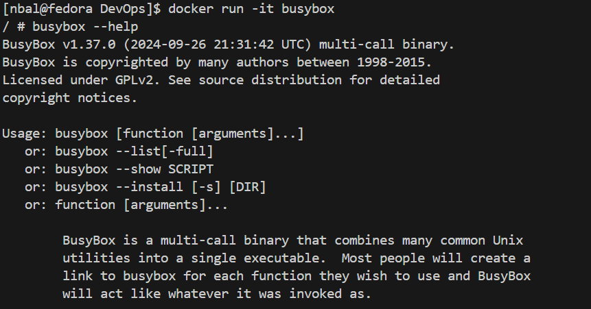
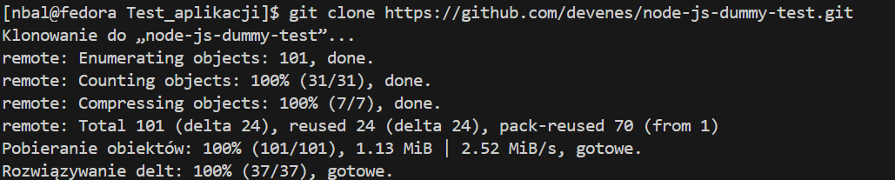

# Zajęcia 01 - Wprowadzenie, Git, Gałęzie, SSH

---

## Natalia Bal - NB406326

### Wstęp

Zajęcia przeprowadzono z wykorzystaniem Hyper-V do stworzenia wirtualnej maszyny z systemem Fedora w wersji 41. Do komunikacji z maszyną użyto połączenia SSH, a edycja plików odbywała się w Visual Studio Code (VSC) z rozszerzeniem `Remote Explorer`.

### 1. Zainstaluj klienta Git i obsługę kluczy SSH

Do zainstalowania git-a na maszynie wirtualnej należy użyć następującego polecenia:

```bash
dnf install git
```

### 2. Sklonuj repozytorium przedmiotowe za pomocą HTTPS i personal access token

Aby wygenerować Personal Access Token, należy przejść w GitHub do Settings > Developer settings > Personal access token > Tokens (classic).

Na tej stronie wybieramy odpowiednie opcje dla tokena, określając jego uprawnienia oraz czas ważności.


Po wygenerowaniu Personal Access Token zostaje on wyświetlony na stronie. Ważne jest, aby go zapisać, ponieważ później nie będzie możliwości ponownego podejrzenia.


Po wygenerowaniu i zapisaniu Personal Access Token możemy sklonować repozytorium przedmiotowe, używając następującego polecenia:

```bash
git clone https://<username>:<token>@github.com/<ścieżka-repozytorium> <ścieżka-docelowa-repozytorium>
```

W miejsce `username` wstawiamy nazwę swojego użytkownika, a `token` skopiowany Personal Access Token.


Jak można zauważyć, repozytorium zostało pomyślnie sklonowane.

### 3. Upewnij się w kwestii dostępu do repozytorium jako uczestnik i sklonuj je za pomocą utworzonego klucza SSH

Aby umożliwić klonowanie i korzystanie z repozytorium za pomocą GitHub przy użyciu SSH, należy skonfigurować nasze klucze SSH. W pierwszej kolejności musimy wygenerować parę kluczy (prywatny oraz publiczny). W tym celu używamy polecenia:

```bash
ssh-keygen
```

> Aby wygenerować klucz inny niż RSA, możemy użyć dodatkowych opcji polecenia ssh-keygen. Flaga -t określa algorytm, który ma zostać użyty do generowania klucza (np. ed25519), a flaga -N pozwala na zabezpieczenie klucza prywatnego hasłem.

Przykład wygenerowania klucza z algorytmem ed25519 oraz zabezpieczonego hasłem:
>
> ```bash
> ssh-keygen -t ed25519 -N 'haslo'
> ```

Po wykonaniu tego polecenia, klucz publiczny i prywatny zostaną wygenerowane i zapisane w domyślnej lokalizacji `/home/user/.ssh`

Następnie system zapyta nas dwukrotnie o passphrase, które pozostawiamy puste.


Po zakończeniu procesu generowania klucza, zostanie on zapisany w wskazanej wcześniej lokalizacji `/home/user/.ssh`

Kolejnym krokiem jest odczytanie naszego publicznego klucza SSH, który znajduje się w pliku `id_rsa.pub`. Aby wyświetlić jego zawartość, możemy użyć polecenia `cat`

```bash
cat /home/user/.ssh/id_rsa.pub
```

Zawartość naszego publicznego klucza SSH kopiujemy, a następnie przechodzimy do naszego konta na GitHubie. W sekcji Settings > SSH and GPG keys klikamy przycisk `New SSH key`. W formularzu, który się pojawi, podajemy nazwę dla naszego klucza oraz wklejamy wcześniej skopiowany klucz publiczny.


Następnie klikamy Add SSH key, aby dodać nasz klucz do konta i potwierdzamy operację podając hasło. Nasz klucz powinien pojawić się na liście wszystkich dodanych kluczy SSH w GitHubie.

Teraz, dzięki dodaniu klucza SSH, możemy sklonować repozytorium przy pomocy SSH, wykonując polecenie:

```bash
git clone git@github.com:InzynieriaOprogramowaniaAGH/MDO2025_INO.git <ścieżka-docelowa-repozytorium>
```

### 4. Przełącz się na gałąź main, a potem na gałąź swojej grupy

Aby przejść na gałąź grupy ćwiczeniowej, używamy polecenia:

```bash
git checkout GCL1
```

### 5. Utwórz gałąź o nazwie "inicjały & nr indeksu"

Aby utworzyć nową gałąź o nazwie "inicjały & nr indeksu", używamy polecenia git checkout -b. Opcja `-b` pozwala na jednoczesne utworzenie i przejście na nową gałąź. Polecenie będzie wyglądało następująco:

```bash
git checkout -b NB406326
```

### 6. Rozpocznij pracę na nowej gałęzi

> Przed rozpoczęciem pracy na gałęzi, używamy programu Visual Studio Code (VSC) z rozszerzeniem Remote Explorer, aby połączyć się z maszyną wirtualną i pracować z plikami. 

- W katalogu właściwym dla grupy utwórz nowy katalog, także o nazwie "inicjały & nr indeksu"

Dzięki użyciu programu VSC, zadanie to staje się łatwe – wystarczy utworzyć katalog bezpośrednio z poziomu eksploratora plików.


- Napisz Git hooka - skrypt weryfikujący, że każdy Twój "commit message" zaczyna się od "twoje inicjały & nr indexu".

Na podstawie przykładowych Git hooków znajdujących się w pliku `commit-msg.sample` w katalogu .git/hooks/, tworzymy nowy plik. Do sprawdzania zawartości commit message wykorzystujemy własny regex, który wymaga, aby wiadomość zaczynała się od `NB406326`.

```bash
#!/bin/bash

regex="^NB406326.*"

commit_msg=$(cat "$1")

if [[ ! $commit_msg =~ $regex ]]; then
    echo "Błąd: Commit message nie zaczyna się od NB406326!!!"
    exit 1
fi
```

Jak widać na poniższym zdjęciu, hook działa poprawnie.


Teraz możemy przenieść nasz utworzony plik do lokalizacji `.git/hooks/` za pomocą polecenia:

```bash
cp commit-msg ~/MDO2025_INO/.git/hooks
```

> Ścieżka docelowa może się różnić w zależności od tego, gdzie zapisane jest repozytorium.

- Spróbuj wciągnąć swoją gałąź do gałęzi grupowej

Po przeniesieniu się na gałąź roboczą grupy przy pomocy polecenia:

```bash
git checkout GCL1
```

Aby przenieść swoje zmiany z jednej gałęzi do gałęzi roboczej, możemy użyć polecenia:

```bash
git merge NB406326 -m "NB406326 merge"
```

> Polecenie wykonuje automatyczne dodanie wiadomości, ponieważ przy wykonaniu merga Git tworzy automatycznie commit, który wymaga podania wiadomości. W celu skrócenia commit messaga podaję własną wiadomość.

- Zaktualizuj sprawozdanie i wyślij aktualizację do zdalnego źródła

Przy pomocy polecenia:

```bash
git push
```

wszystkie nasze zacommitowane zmiany możemy przesłać do zdalnego repozytorium.

> Przed wykonaniem push'a warto zweryfikować, czy wszystkie zmiany zostały zacommitowane. Możemy to zrobić za pomocą polecenia:
>
> ```bash
> git status
> ```
>
> Jeśli jakieś zmiany nie zostały zacommitowane, należy je dodać, a następnie wykonać commit za pomocą poleceń:
>
> ```bash
> git add .
> git commit -m "<commit message>"
> ```
>
> Powyżesze kroki są wykonywane zawsze przed zrobieniem `git push`
>
> > Przy użyciu polecenia `git add` musimy określić, które zmiany mają zostać dodane. Będąc w głównym katalogu repozytorium, możemy użyć kropki (.), która doda wszystkie wprowadzone zmiany. Możemy także podać konkretne pliki, które chcemy dodać, wypisując je po spacji.

-------------------------

# Zajęcia 02 - Git, Docker

---

### 1. Zainstaluj Docker w systemie linuksowym

Aby pobrać Docker na systemie Fedora, wystarczy użyć polecenia:

```bash
sudo dnf install docker
```

Po pobraniu Dockera, możemy sprawdzić, czy został on poprawnie zainstalowany, używając polecenia:

```bash
docker --version
```


Aby dodać użytkownika do grupy docker i uniknąć konieczności używania sudo przed poleceniami Dockera, możemy użyć poniższych poleceń:

```bash
sudo groupadd docker
sudo usermod -aG docker $USER
newgrp docker
```

> Przed rozpoczęciem pracy z dockerem warto sprawdzić czy jest on uruchomiony i jeśli nie to uruchomić go.
> Sprawdzenie statusu dockera:
>
> ```bash
> sudo systemctl status docker
> ```
>
> Uruchomienie dockera w przypadku, gdy jest nieaktywny:
>
> ```bash
> sudo systemctl start docker
> ```
>
> Automatyczne uruchamianie dockera przy starcie systemu:
>
> ```bash
> sudo systemctl enable docker
> ```

### 2. Zarejestruj się w Docker Hub i zapoznaj z sugerowanymi obrazami

Teraz, gdy mamy zainstalowanego Dockera, możemy zarejestrować się na stronie Docker Hub, aby móc przeglądać dostępne obrazy oraz korzystać z nich. 


### 3. Pobierz obrazy hello-world, busybox, ubuntu lub fedora, mysql

Gdy Docker jest już aktywny, możemy pobrać obrazy, które będziemy później wykorzystywać. Aby pobrać obraz, używamy polecenia:

```bash
docker pull <nazwa_obrazu>
```

Gdy pobierzemy wszystkie obrazy, których potrzebujemy, możemy sprawdzić listę wszystkich dostępnych obrazów na naszej maszynie przy pomocy polecenia:

```bash
docker images
```


### 4. Uruchom kontener z obrazu busybox

- Pokaż efekt uruchomienia kontenera

Do uruchomienia kontenera wykorzystujemy polecenie:

```bash
docker run <nazwa_obrazu>
```

W przypadku obrazu busybox nie zobaczymy żadnego efektu w konsoli, ponieważ nie podaliśmy żadnej komendy do wykonania wewnątrz kontenera. Jednak, aby upewnić się, że kontener został uruchomiony, możemy wykorzystać polecenie:

```bash
docker ps -a
```

> `-a` wyświetli pełną listę koneretów, nawet tych, które zostały zamknięte niedawno.


Jak widać 30 s temu został utworzony oraz zamknięty kontener z obrazu BusyBox, co świadczy o tym, że kontener został uruchomiony.

- Podłącz się do kontenera interaktywnie i wywołaj numer wersji

Przy uruchamianiu obrazu możemy dodać opcję `-it`, która uruchomi kontener w trybie interaktywnym, umożliwiając nam korzystanie z terminala wewnątrz kontenera.

```bash
docker run -it <nazwa_obrazu>
```



Jak widać, zmienił się znak zachęty (prompt), co świadczy o tym, że nasz terminal przeszedł do trybu interaktywnego wewnątrz kontenera.

Dodatkowo dzięki poleceniu `busybox --help` możemy odczytać jaka jest to wersja obrazu, w tym przypadku posiadamy wersję 1.37.0.

> Po zakończeniu pracy w trybie interaktywnym możemy wyjść z kontenera przy pomocy polecenia `exit`

### 5. Uruchom "system w kontenerze"

Jak widać we wcześniejszym zrzucie ekranu jednym z obrazów, które pobrałem jest `Fedora`.

W celu zaprezentowania systemu w kontenerze oraz pracy na nim uruchamiamy go w trybie interaktywnym.

- Zaprezentuj PID1 w kontenerze i procesy dockera na hoście

Narzędzie ps nie zostało dodane do obrazu, więc trzeba je zainstalować ręcznie.

W tym celu używamy polecenia:

```bash
dnf install procps -y
```

Po zainstalowaniu możemy sprawdzić wszystkie procesy, a w tym przypadku sprawdzamy proces od ID 1


Aby wyświetlić procesy docker na hoście możemy wykorzystać polecenie:

```bash
docker top <container_ID>
```

W tym przypadku w miejsce container_ID wstawiamy ID kontenera, którego procesy chcemy wyświetlić.


- Zaktualizuj pakiety

Do zaktualizowania pakietów w systemie fedora wykorzystujemy polecenie:

```bash
sudo dnf update
```


### 6. Stwórz własnoręcznie, zbuduj i uruchom prosty plik Dockerfile bazujący na wybranym systemie i sklonuj nasze repo

Tworzymy plik Dockerfile.

Jako zawartość pliku wpisujemy:

```Dockerfile
FROM fedora:latest
WORKDIR /app
RUN dnf -y update && \
    dnf -y install git
RUN git clone https://github.com/InzynieriaOprogramowaniaAGH/MDO2025_INO.git
ENTRYPOINT ["/bin/bash"]
```

>`FROM` definiuje bazowy obraz, na którym będziemy budować nasz obraz Docker. Przez dodanie `:latest` będziemy zawsze pobierali najnowszą wersję obrazu.
>
>`WORKDIR` ustawia katalog roboczy dla wszystkich kolejnych instrukcji z Dockerfile
>
>`RUN` wykonuje dane polecenie, w tym przypadku najpierw robimy aktualizację pakietów, a następnie pobieramy git'a na nasz obraz. W dalszej części klonujemy repozytorium przedmiotu.
>
>`ENTRYPOINT` określa polecenie, które zostanie uruchomione jako punkt wejścia dla kontenera, w tym przypadku będzie to uruchomienie w trybie interaktwynym.

Po napisaniu naszego Dockerfila musimy zbudować obraz na jego podstawie, wykonujemy to przy pomocy polecenia:

```bash
docker build -t <nazwa_obrazu> .
```


Jak widać, wszystkie kroki wpisane w Dockerfile są wykonywane jeden po drugim podczas procesu budowania obrazu. Po zakończeniu budowy możemy sprawdzić, czy nasz obraz istnieje oraz zweryfikować jego zawartość.


Skoro nasz obraz pojawił się w spisie wszystkich obrazów, teraz możemy go uruchomić i sprawdzić jego zawartość.

Jak widać w obrazie został pobrany git oraz sklonowane zostało repozytorium przedmiotu (co widać na dole wiersza poleceń).

### 7. Pokaż uruchomione ( != "działające" ) kontenery, wyczyść je.

Aby sprawdzić, które kontenery zostały uruchomione, ale nie działają obecnie, możemy użyć polecenia:

```bash
docker ps -a -f status=exited
```

Do wyczyszczenia kontenerów możemy użyć polecenia:

```bash
docker rm
```

Jednak ważne jest określenie, które kontenery mają zostać usunięte, możemy to zrobić dodająć argument:

```bash
docker rm $(docker ps -a -f status=exited -q)
```

### 8. Wyczyść obrazy

Aby wyświetlić wszystkie obrazy dockera możemy wykonać polecenie:

```bash
docker images -a
```

Teraz, aby wyczyścić je użyjemy polecenia:

```bash
docker rmi $(docker images -a -q)
```


Jak widać wszystkie obrazy zostały usunięte z naszego dockera.


----------------------------------------------------------------------------

# Zajęcia 03 - Dockerfiles, kontener jako definicja etapu

---

### Wybór oprogramowania na zajęcia

Do realizacji tego zadania potrzebna jest aplikacja Open Source, która umożliwi uruchomienie w repozytorium poleceń przypominających `make build` oraz `make test`. W tym celu zostanie wykorzystane repozytorium:

- To Do Web App - link: https://github.com/devenes/node-js-dummy-test. Aplikacja została napisana z użyciem Node.js, dlatego zamiast poleceń make możemy posługiwać się komendami npm, takimi jak npm run build czy npm test.


- Do wcześniej przygotowanego katalogu testowego `~/Test_aplikacji` klonujemy repozytorium, aby móc pracować na lokalnej kopii projektu.

  

- Ponieważ aplikacja została napisana w technologii Node.js, konieczne jest pobranie odpowiednich paczek za pomocą menedżera npm, aby zapewnić działanie projektu.
  Do tego wykorzystamy polecenie:

  ```bash
    sudo dnf install nodejs
  ```

  

- Teraz, mając już wszystkie niezbędne narzędzia do uruchomienia aplikacji, przechodzimy do jej katalogu i przy pomocy polecenia `npm install` pobieramy wszystkie wymagane zależności. To polecenie pełni funkcję odpowiednika `make build`, którego szukaliśmy w kontekście tej aplikacji.

  

- Po zakończeniu instalacji wszystkich zależności pozostaje już tylko uruchomić testy za pomocą polecenia `npm test`, a następnie wystartować aplikację przy użyciu `npm start`.

  

> Aplikacja zawiera tylko jeden test i przechodzi on pomyślnie, bez żadnych błędów.


> Aplikacja została uruchomiona i pojawiła się informacja, że jest dostępna pod adresem http://localhost:3000.


### 2. Stwórz dwa pliki Dockerfile automatyzujące kroki powyżej, z uwzględnieniem następujących kwestii:

- Kontener pierwszy ma przeprowadzać wszystkie kroki aż do builda. W tym celu możemy skorzystać z już istniejącego obrazu Node, który zawiera wszystkie niezbędne narzędzia do zbudowania naszej aplikacji, w tym narzędzie git. Tworzymy plik o nazwie `build.Dockerfile`.


```Dockerfile
  FROM node
  RUN git clone https://github.com/devenes/node-js-dummy-test.git
  WORKDIR /node-js-dummy-test
  RUN npm install
```

- Kontener drugi ma bazować na pierwszym i wykonywać testy

Następnie tworzymy Dockerfile dla testów, opierając go na wcześniej zbudowanym obrazie. W tym pliku wykonamy polecenie npm test, aby przeprowadzić testy aplikacji.

```Dockerfile
  FROM nodeapp_build
  RUN npm test

```

### 3. Wykaż, że kontener wdraża się i pracuje poprawnie.

Do zbudowania naszych Dockerfile'ów użyjemy polecenia:

```bash
 docker build -t <nazwa_obrazu> -f ./<nazwa_pliku.Dockerfile> .
```

Zaczniemy od zbudowania obrazu `node_build`, w tym celu wykonamy polecenie

```bash
 docker build -t build -f ./build.Dockerfile .
```


Po zbudowaniu obrazu `node_build`, możemy stworzyć Dockerfile, który będzie zawierał polecenie do uruchomienia testów, a nazwany będzie `node_test`:

```bash
 docker build -t node_test -f ./test.Dockerfile .
```


Dla obu tych obrazów próba ich uruchomienia nie przyniesie żadnego rezultatu, ponieważ nie określiliśmy żadnej komendy, którą kontener ma wykonać po uruchomieniu.

--------------------------------

# Zajęcia 04 - Dodatkowa terminologia w konteneryzacji, instancja Jenkins
---

## Zachowywanie stanu

### Przygotuj woluminy wejściowy i wyjściowy, o dowolnych nazwach, i podłącz je do kontenera bazowego, z którego rozpoczynano poprzednio pracę

Aby utworzyć wolumin, możemy posłużyć się następującym poleceniem:

```bash
 docker volume create <nazwa_woluminu>
```

Tworzone są dwa woluminy o nazwach 'v_in' oraz 'v_out', z których pierwszy służy jako wejściowy, a drugi jako wyjściowy. Do sprawdzenia dostępnych woluminów można użyć polecenia:

```bash
  docker volume ls
```


### Uruchom kontener, zainstaluj niezbędne wymagania wstępne (jeżeli istnieją), ale bez gita

Do zainstalowania wymaganych zależności na kontenerze, bez użycia git’a, można wykorzystać pomocniczy kontener z zainstalowanym git’em oraz podłączonym woluminem wejściowym. Po podłączeniu woluminu instalujemy potrzebne pakiety, a następnie w głównym kontenerze budujemy projekt, korzystając z danych zapisanych w tym samym woluminie wejściowym.


Na początku uruchamiany jest kontener z systemem Fedora, do którego podpinany jest wolumin v_out jako katalog /tmp. Wykorzystujemy do tego następujące polecenie:

```bash
docker run -it -v <nazwa_woluminu>:/ścieżka/w/kontenerze --name nazwa_kontenera obraz_kontenera
```


### Sklonuj repozytorium na wolumin wejściowy (opisz dokładnie, jak zostało to zrobione)


Następnie przechodzimy do katalogu /tmp i instalujemy narzędzie git, co umożliwi dostęp do repozytorium.


### Uruchom build w kontenerze

Mając już dostęp do kodu źródłowego, możemy przystąpić do utworzenia kontenera do kompilacji. Podpinamy do niego dwa woluminy: v_in, zawierający kod aplikacji, oraz v_out, który posłuży do przechowywania efektów procesu budowania. Ponieważ aplikacja została napisana w Node.js, jako punkt montowania woluminu vout wybieramy katalog /node_modules.

Katalog z kodem aplikacji jest już obecny w kontenerze, co potwierdza, że wolumin został poprawnie zamontowany. Dodatkowo instalujemy Node.js, ponieważ nie jest on domyślnie dostępny w tym środowisku.


Pozostaje nam teraz tylko pobrać wszystkie zależności aplikacji, używając polecenia `npm install`.


Aplikacja została pomyślnie zbudowana, a wszystkie zainstalowane zależności znajdują się w katalogu node_modules.


Dzięki temu, po uruchomieniu nowego kontenera, doinstalowaniu Node.js (wciąż pracujemy na czystej Fedorze) oraz podłączeniu woluminów wejściowych i wyjściowych, możemy uruchomić aplikację.


## Eksponowanie portu

### Uruchom wewnątrz kontenera serwer iperf (iperf3)

Aby uruchomić serwer iperf, możemy skorzystać z dedykowanego obrazu `networkstatic/iperf3`. Kontener można utworzyć za pomocą następującego polecenia:

```bash
  docker run -d --name kontener-server -p 5201:5201 networkstatic/iperf3 -s
```

Jak widać, dodatkowo udostępniamy port 5201, który jest domyślnym portem dla iperf3. Dzięki temu inne kontenery będą mogły łączyć się z naszym kontenerem i korzystać z jego usług.


Następnie, aby sprawdzić adres IP naszego kontenera, użyjemy polecenia:

```bash
  docker inspect <nazwa_kontenera>
```


Kolejnym krokiem jest przejście do sekcji `NetworkSettings`, gdzie znajdziemy pole `IPAddress`. Zapisujemy ten adres na później, aby móc go wykorzystać.


Teraz, gdy mamy uruchomiony serwer, możemy uruchomić kontener dla klienta. Będzie to kontener z systemem Fedora, do którego doinstalujemy iperf3. Następnie spróbujemy połączyć się z serwerem, używając wcześniej zapisanego adresu IP.


Do połączenia się z serwerem wykorzystaliśmy polecenie:

```bash
  iperf3 -c 172.17.0.3 -p 5201
```

Jak widać, podaliśmy adres IP serwera oraz port, przez który ma się odbyć połączenie. W wyniku tego nawiązana została udana komunikacja między dwoma kontenerami. Dodatkowo, możemy sprawdzić komunikację w drugą stronę, czyli z serwera na klienta


### Ponów ten krok, ale wykorzystaj własną dedykowaną sieć mostkową

Do utworzenia sieci w Docker wykorzystujemy polecenie:

```bash
  docker network create <nazwa_sieci>
```


Sieci typu bridge są domyślnymi sieciami w Dockerze. Teraz, gdy mamy już naszą sieć, tworzymy ponownie dwa kontenery, tym razem określając, z jakiej sieci mają korzystać.

Serwer:

```bash
  docker run -d --name kontener-server --network siec_testowa networkstatic/iperf3 -s
```

Do uruchamiania kontenera dodajemy opcję --network, po której podajemy nazwę naszej sieci. Tak samo postępujemy w przypadku kontenera-klienta.


Po wykonaniu polecenia inspect na kontenerze serwera, w konfiguracji sieci pojawiła się nazwa naszej sieci:


Identyczna konfiguracja pojawia się także na kliencie. Teraz, po wykonaniu testu połączenia, otrzymamy pomyślną komunikację między kontenerami.

Klient -> Serwer


Serwer -> Klient


### Połącz się spoza kontenera (z hosta i spoza hosta)

W tym celu, na systemie Fedora, na którym uruchamiane są wszystkie kontenery, wykonam te same czynności co dla klienta — zainstaluję iperf3 i spróbuję połączyć się z serwerem


Jak widać, udało się połączyć przy użyciu adresu IP kontenera.

Teraz postaram się wykonać identyczny krok z poziomu systemu Windows.


## Instancja Jenkins

W pierwszej kolejności tworzymy sieć dla kontenerów, co jest niezbędne do zainstalowania skonteneryzowanej instancji Jenkinsa z pomocnikiem DIND.

```bash
  docker network create jenkins
```

Po tym możemy wykorzystać dostarczoną na oficjalnej stronie komendę docker run, która skonfiguruje nam instację Jenkins'a

```bash
docker run \
  --name jenkins-docker \
  --rm \
  --detach \
  --privileged \
  --network jenkins \
  --network-alias docker \
  --env DOCKER_TLS_CERTDIR=/certs \
  --volume jenkins-docker-certs:/certs/client \
  --volume jenkins-data:/var/jenkins_home \
  --publish 2376:2376 \
  docker:dind \
  --storage-driver overlay2
```


Kolejnym krokiem jest stworzenie pliku Dockerfile, który pozwoli na wprowadzenie zmian w oficjalnym obrazie Jenkinsa Docker.

```Dockerfile
FROM jenkins/jenkins:2.492.3-jdk17
USER root
RUN apt-get update && apt-get install -y lsb-release ca-certificates curl && \
    install -m 0755 -d /etc/apt/keyrings && \
    curl -fsSL https://download.docker.com/linux/debian/gpg -o /etc/apt/keyrings/docker.asc && \
    chmod a+r /etc/apt/keyrings/docker.asc && \
    echo "deb [arch=$(dpkg --print-architecture) signed-by=/etc/apt/keyrings/docker.asc] \
    https://download.docker.com/linux/debian $(. /etc/os-release && echo \"$VERSION_CODENAME\") stable" \
    | tee /etc/apt/sources.list.d/docker.list > /dev/null && \
    apt-get update && apt-get install -y docker-ce-cli && \
    apt-get clean && rm -rf /var/lib/apt/lists/*
USER jenkins
RUN jenkins-plugin-cli --plugins "blueocean docker-workflow"
```

Po czym uruchamiamy go przy pomocy polecenia:

```bash
    docker build -t myjenkins-blueocean:2.492.3-1 .
```


Ostatnim krokiem jest uruchomienie kontenera z instancją Jenkinsa. W tym celu ponownie wykorzystujemy komendę dostarczoną na oficjalnej stronie:

```bash
docker run \
  --name jenkins-blueocean \
  --restart=on-failure \
  --detach \
  --network jenkins \
  --env DOCKER_HOST=tcp://docker:2376 \
  --env DOCKER_CERT_PATH=/certs/client \
  --env DOCKER_TLS_VERIFY=1 \
  --publish 8080:8080 \
  --publish 50000:50000 \
  --volume jenkins-data:/var/jenkins_home \
  --volume jenkins-docker-certs:/certs/client:ro \
  myjenkins-blueocean:2.492.3-1
```


Jak widać, nasz kontener z instancją Jenkinsa jest uruchomiony. Teraz możemy przejść do przeglądarki i otworzyć adres http://localhost:8080, aby zakończyć cały proces konfiguracji.


Kolejnym krokiem jest znalezienie hasła administratorskiego. Na stronie wyświetlana jest dokładna ścieżka, w której się znajduje, więc przechodzimy do tej lokalizacji i wyświetlamy zawartość pliku, aby uzyskać hasło.

Po podaniu hasła uzyskujemy możliwość pobrania dodatkowych wtyczek. Wybieramy opcję sugerowanych wtyczek, aby kontynuować konfigurację Jenkinsa.

Po zakończeniu procesu instalacji i konfiguracji wtyczek, wyświetla się okno umożliwiające dodanie pierwszego administratora.


Po zakończeniu konfiguracji Jenkinsa, pojawia się ekran główny, który umożliwia rozpoczęcie pracy z naszymi pipeline'ami.

