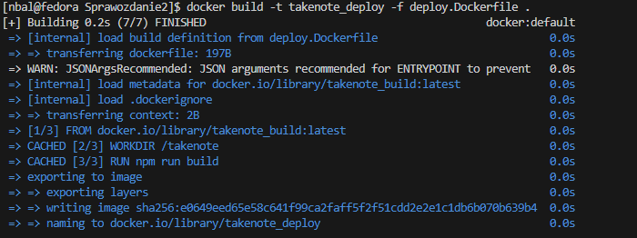
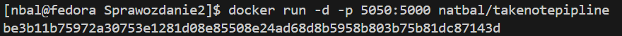

# Zajęcia 05, 06, 07

---

## Natalia Bal - NB406326

### Wybrana aplikacja

Do przygotowania pipeline’u zdecydowałam się wykorzystać aplikację TakeNote, stworzoną w Node.js. Służy ona użytkownikom do tworzenia i organizowania notatek.

Projekt ten dostępny jest na licencji MIT, co oznacza, że mogę swobodnie z niego korzystać i modyfikować go na potrzeby własnej pracy. Licencja ta jest szeroko rozpowszechniona w świecie open-source i uznawana za bardzo przyjazną dla deweloperów.

### Dockerfile

Na początek przygotowałam trzy pliki Dockerfile: budowanie, testowanie i deploy.

#### Budowanie

Kod aplikacji powstał kilka lat temu, dlatego do jej poprawnego zbudowania potrzebna jest odpowiednia wersja Node.js, w tym przypadku v12.

Aby przygotować obraz aplikacji, tworzymy poniższy plik Dockerfile:

```Dockerfile
FROM node:12-alpine

RUN apk update && \
    apk add --no-cache git && \
    git clone https://github.com/taniarascia/takenote.git  && \
    apk del git
WORKDIR /takenote
# Make sure dependencies exist for Webpack loaders
RUN apk add --no-cache \
    autoconf \
    automake \
    bash \
    g++ \
    libc6-compat \
    libjpeg-turbo-dev \
    libpng-dev \
    make \
    nasm
RUN npm install
```

Jak widać, obraz bazuje na node:12-alpine,celowo wybrałam tę wersję, ponieważ jest lekka i pozbawiona zbędnych dodatków, co pozwala zminimalizować rozmiar finalnego obrazu.

Ponieważ kod aplikacji pobieramy z repozytorium, musimy wcześniej zainstalować gita, by móc wykonać klonowanie. Po zakończeniu tego kroku git nie jest już potrzebny, więc usuwamy go, aby nie zajmował niepotrzebnie miejsca.

Powodzenie budowania obrazu możemy łatwo sprawdzić, uruchamiając jego budowanie lokalnie.

Dzięki temu szybko zweryfikujemy, czy wszystko działa poprawnie i czy nie brakuje żadnych zależności.


#### Testowanie

Gdy mamy już gotowy obraz z poprawnie zbudowaną aplikacją, możemy przejść do przygotowania obrazu do testowania.

W tym celu tworzymy kolejny Dockerfile o następującej zawartości:

```Dockerfile
FROM takenote_build

RUN npm test
```

Obraz bazuje na wcześniej zbudowanym obrazie z naszą aplikacją. Następnie, za pomocą komendy npm test, uruchamiamy testy w aplikacji, aby upewnić się, że wszystko działa poprawnie.


#### Deploy

Kiedy aplikacja jest już zbudowana, a wszystkie testy przeszły pomyślnie, czas przejść do przygotowania obrazu do deployu.

```Dockerfile
FROM takenote_build

WORKDIR /takenote
RUN npm run build

EXPOSE 5000

ENTRYPOINT npm run prod
```

Obraz bazuje ponownie na obrazie z wcześniej zbudowaną aplikacją. W aplikacji przygotowano skrypt o nazwie prod, który uruchamia aplikację po zbudowaniu (odpowiednik npm start). Wymaga to wcześniejszego uruchomienia npm run build. Dodatkowo, ujawniamy port 5000, ponieważ nasza aplikacja nasłuchuje na tym porcie.




Jak widać, nasz obraz deployowy został zbudowany, port 5000 został ujawniony, a aplikację sprawdziliśmy w przeglądarce, aby upewnić się, że działa poprawnie.

Teraz, gdy mamy wszystkie potrzebne pliki Dockerfile, możemy przejść do tworzenia pipelina wdrożeniowego.

### Koncepcja pipelinu


Powyższy diagram UML przedstawia ogólny zamysł tworzonego pipelinu, który składa się z kilku etapów: build, test, deploy, test deploy oraz publish.

Pipeline będzie uruchamiany ręcznie, a wersjonowanie będzie oparte na wprowadzonym ręcznie numerze wersji, którym zostanie otagowany obraz. Przed rozpoczęciem procesu budowania, numer wersji zostanie zwalidowany, aby upewnić się, że nie istnieje już taki tag. Dodatkowo, przy uruchamianiu pipelinu, będzie możliwość oznaczenia danej wersji jako Latest za pomocą checkboxa obok pola na wersję aplikacji.

Dzięki takiej konstrukcji pipelinu, jeśli któryś z etapów nie zostanie wykonany prawidłowo, proces zostanie przerwany, co pozwala uniknąć błędów. Przerwanie będzie miało miejsce głównie podczas walidacji numeru wersji oraz przy wykonywaniu smoke testu aplikacji.

Na koniec, po zakończeniu całego procesu, wszystkie utworzone obrazy zostaną wyczyszczone, aby nie zaśmiecały kontenera DIND.

Ostatecznie, po przejściu całego pipelinu, obraz zdeployowanej aplikacji zostanie udostępniony na DockerHub. Dzięki temu, aby uruchomić aplikację, wystarczy pobrać odpowiedni obraz z DockerHub i uruchomić kontener – aplikacja będzie już działała na tym obrazie.

### Tworzenie pipelinu

Na początek musimy zalogować się do Jenkins i utworzyć nowy pipeline. W tym celu wybieramy + Nowy projekt, nadajemy naszemu pipeline'owi nazwę, a następnie wybieramy opcję Pipeline. Po skonfigurowaniu tych ustawień akceptujemy je, klikając przycisk OK.

Następnie, w konfiguracji pipelinu, dodajemy krótki opis projektu. Zaznaczamy opcję To zadanie jest sparametryzowane, a następnie dodajemy dwie zmienne:

- Tekst o nazwie VERSION z domyślną wartością oraz krótkim opisem.

- Wartość logiczną o nazwie LATEST z odpowiednim krótkim opisem.


W zakładce "Pipeline" wybieramy opcję "Pipeline script from SCM". Następnie, w polu SCM, wybieramy GIT. Wypełniamy odpowiednie pola:

- URL do repozytorium – podajemy adres URL do naszego repozytorium Git.

- Nazwa brancha – określamy, z którego brancha ma korzystać Jenkins.

- Ścieżka do Jenkinsfile – podajemy ścieżkę, w której znajduje się nasz plik Jenkinsfile.

Po skonfigurowaniu tych opcji, zapisujemy zmiany.


#### Jenkinsfile

W ścieżce, którą podaliśmy w konfiguracji pipelinu, tworzymy plik Jenkinsfile.

```groovy
pipeline {
    agent any

    parameters {
        string(name: 'VERSION', defaultValue: 'x.x.x', description: 'Enter the version of the Docker image')
        booleanParam(name: 'LATEST', defaultValue: false, description: 'Check to set as latest')
    }

    stages {
        stage('Check Version') {
            steps {
                script {
                    def imageName = "natbal/takenotepipline"
                    def tag = params.VERSION
                    def url = "https://hub.docker.com/v2/repositories/${imageName}/tags/${tag}"

                    def httpResponseCode = sh(script: "curl -s -o /dev/null -w '%{http_code}' ${url}", returnStdout: true).trim()

                    if (httpResponseCode == '200') {
                        error "The version ${tag} already exists on Docker Hub. Please use a different version."
                    } else if (httpResponseCode == '404') {
                        echo "Tag ${tag} does not exist. Proceeding with the pipeline."
                    } else {
                        error "Unexpected response from Docker Hub: ${httpResponseCode}"
                    }
                }
            }
        }

        stage('Build') {
            steps {
                script {
                    // Budowa aplikacji z użyciem pliku Dockerfile builder.Dockerfile
                    docker.build('takenote_build', '-f INO/GCL01/NB406326/Sprawozdanie2/builder.Dockerfile .')
                }
            }
        }

        stage('Test') {
            steps {
                script {
                    // Testowanie aplikacji z użyciem pliku Dockerfile tester.Dockerfile
                    docker.build('takenote_test', '-f INO/GCL01/NB406326/Sprawozdanie2/tester.Dockerfile .')
                }
            }
        }

        stage('Deploy') {
            steps {
                script {
                    // Tworzomy sieć o nazwie deploy
                    sh 'docker network create deploy || true'
                    // Budowanie obrazu Docker
                    def appImage = docker.build('takenote_deploy', '-f INO/GCL01/NB406326/Sprawozdanie2/deploy.Dockerfile .')

                    // Uruchomienie kontenera w tle o nazwie 'app'
                    def container = appImage.run("-p 5000:5000 --network=deploy --name app")

                    // Sprawdzenie, czy aplikacja działa, wykonując żądanie HTTP
                    sh 'docker run --rm --network=deploy curlimages/curl:latest -L -v  http://app:5000'

                    // Zatrzymanie kontenera
                    sh 'docker stop app'

                    // Usunięcie kontenera
                    sh 'docker container rm app'

                    // Usunięcie sieci
                    sh 'docker network rm deploy'
                }
            }
        }
        stage('Publish') {
            steps {
                script {
                        // Logowanie do DockerHub
                        withCredentials([usernamePassword(credentialsId: 'natbal_id', usernameVariable: 'DOCKERHUB_USER', passwordVariable: 'DOCKERHUB_PASS')]) {
                            sh 'echo $DOCKERHUB_PASS | docker login -u $DOCKERHUB_USER --password-stdin'
                        }
                        sh "docker tag takenote_deploy natbal/takenotepipline:${env.VERSION}"
                        sh "docker push natbal/takenotepipline:${env.VERSION}"

                        if (params.LATEST) {
                            sh "docker tag takenote_deploy natbal/takenotepipline:latest"
                            sh "docker push natbal/takenotepipline:latest"
                        }

                }
            }
        }
    }
    post {
            always {
                // Czyszczenie po zakończeniu
                sh 'docker system prune -af'
            }
        }
}

```

Analiza pliku:

#### Parameters:

Deklaracja zmiennych utworzonych w konfiguracji pipelinu - VERSION oraz LATEST.

#### Check version:

Stage odpowiadający za walidację numeru wersji wysyła zapytanie CURL do Docker Hub, żeby sprawdzić, czy obraz o danym tagu już istnieje. Jeśli obraz jest dostępny, otrzymujemy kod 200, a jeśli go nie ma, dostajemy kod 404. Celem jest, żeby otrzymać kod 404, ponieważ to oznacza, że obraz jeszcze nie istnieje, a więc możemy go zbudować.

#### Build:

Ten krok buduje obraz, używając pliku builder.Dockerfile. 

#### Test:

Za pomocą tester.Dockerfile tworzony jest obraz, w którym uruchamiane są testy.

#### Deploy:

W tym kroku wykonywane jest kilka operacji. Najpierw tworzona jest nowa sieć o nazwie "deploy" za pomocą skryptu bashowego `docker network create deploy || true`. || true zapobiega przerwaniu pipelinu, gdy taka sieć już istnieje (pozostałość po poprzednim uruchomieniu).

Następnie, na podstawie pliku deploy.Dockerfile, tworzony jest obraz ze zdeployowaną aplikacją. Obraz ten jest uruchamiany w tle w kontenerze o nazwie "app", z otwartym portem 5000 i podłączony do sieci "deploy". Potem uruchamiany jest kontener z obrazem CURL, połączony z tą samą siecią "deploy". Jako entrypoint kontener CURL wysyła zapytanie do uruchomionej aplikacji.

Jeśli kontener z CURL zwróci błąd, oznacza to, że aplikacja nie działa, więc pipeline zostaje przerwany.

#### Publish:

Ostatni etap pipeline to publish. Logujemy się do Dockera za pomocą zapisanych w Jenkins credentiali, następnie tworzymy tag z wersją aplikacji i pushujemy obraz. Jeśli zaznaczona jest opcja Latest, dodajemy tag Latest i ponownie pushujemy obraz.

> Aby dodać Credentials, przechodzimy do Zarządzaj Jenkinsem > Credentials > (global) i klikamy + Add Credentials.
> 
> Podajemy nazwę użytkownika oraz hasło do Docker Hub.

> Aby prawidłowo skonfigurować pipeline, musimy utworzyć repozytorium na Docker Hub, do którego będzie wysyłana aplikacja. Logujemy się na Docker Hub, przechodzimy do zakładki "Repositories" i klikamy "Create repository". Następnie podajemy nazwę repozytorium oraz krótki opis.
> 

#### Post:

Etap końcowy zawsze jest wykonywany, niezależnie od tego, czy pipeline został przerwany, czy zakończył się sukcesem. Jego zadaniem jest wyczyszczenie kontenera DIND, w którym przechowywane są wszystkie obrazy tworzone podczas pipelinu. Ma to na celu oszczędzanie miejsca na dysku.

### Test pipelinu:

Podajmy numer wersji, której jeszcze nie ma, w tym przypadku będzie to 1.0.4 oraz zaznaczymy, że będzie to wersja LATEST.

Jak widać pojawiła się nowa wersja oraz nowa wersja LATEST, co świadczy o sukcesie działania naszego pipeliniu.


Ponownie podaję ten sam numer wersji. Pipeline zakończył działanie na `Check Version`, ponieważ taka wersja już istanieje.


Teraz możemy sprawdzić jak nasz obraz działa, gdy pobierzemy go z dockerhuba lokalnie i uruchomimy.
Przy pomocy poleceń:
```bash
docker pull natbal/takenotepipline
```
```bash
docker run -d -p 5050:5000 natbal/takenotepipline
```

Kontener z aplikacją zostanie uruchomiony w tle. Ponieważ obraz nie istnieje lokalnie, Docker automatycznie pobierze go z Docker Hub, korzystając z tagu Latest.





Jak widać, kontener został utworzony, a obraz pobrany z Docker Hub. Teraz możemy sprawdzić, czy aplikacja działa poprawnie, wchodząc na jej adres w przeglądarce.


Aplikacja działa prawidłowo.

### Podsumowanie

Jak widać, stworzony pipeline odpowiada założeniom przedstawionym na diagramie UML - pojawiły się jedynie dwa dodatkowe etapy: verify version i post, ale nie wpływają one na główny przebieg procesu. W rezultacie uzyskaliśmy gotowy pipeline do wdrażania aplikacji Node.js. Końcowym efektem jest obraz, który można uruchomić jednym poleceniem, bez dodatkowej konfiguracji poza wystawieniem portu.