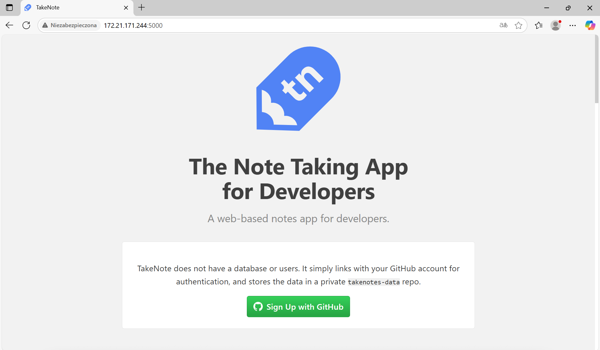
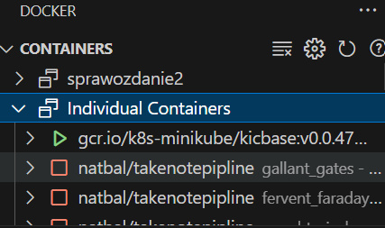

# Sprawozdanie 03

---

## Natalia Bal - NB406326

### Przygotowanie maszyn

Aby móc wykonać zdalne zadanie z użyciem narzędzia Ansible, konieczne jest przygotowanie drugiej maszyny wirtualnej z systemem Fedora w wersji 41, takiej samej jak moja maszyna główna. Już na etapie instalacji systemu zakładam osobnego użytkownika o nazwie "ansible", ponieważ będzie mi on potrzebna na dalszym etapie pracy.


Oprócz tego muszę zadbać o to, aby w systemie znajdowały się narzędzia tar oraz sshd. Aby upewnić się, że są one dostępne, mogę skorzystać z odpowiedniego polecenia sprawdzającego ich obecność.

```bash
tar --help
```

oraz

```bash
sshd --help
```

W sytuacji, gdy któregoś z programu brakuje wystarczy go doinstalować:

```bash
sudo dnf install tar

sudo dnf install openssh-server
```


Nazwę maszyny mogę ustawić już podczas instalacji systemu albo zmienić ją później, edytując plik /etc/hostname.

Na mojej głównej maszynie konieczne jest zainstalowanie Ansible — w tym celu posługuję się następującym poleceniem:

```bash
sudo dnf install ansible
```


Następnie tworzę nowy klucz SSH i przekazuję go do użytkownika na drugiej maszynie, dzięki czemu mogę nawiązywać połączenia bez potrzeby podawania hasła.

```bash
ssh-keygen -t rsa -b 4096 -f ~/.ssh/[key-name]
ssh-copy-id -i ~/.ssh/[keyname].pub [username]@[hostname]
```

Jak widać połączenie się przez ssh z drugą Jak można zauważyć, połączenie z drugą maszyną za pomocą SSH odbyło się bez konieczności podawania hasła, co świadczy o tym, że wcześniejsze polecenia zostały wykonane poprawnie. Zamiast adresu IP użyłam nazwy hosta.


Żeby uniknąć konieczności podawania adresu IP przy każdorazowym łączeniu się z maszyną, mogę na mojej głównej maszynie edytować plik /etc/hosts i dodać wpis odnoszący się do maszyny o nazwie "ansible-target". Dzięki temu będę mogła posługiwać się nazwą hosta zamiast zapamiętywać jej adres IP.


### Inwentaryzacja

Aby móc korzystać z Ansible, muszę utworzyć plik inventory.ini, w którym zdefiniuję hosty, z jakimi będę pracować. Plik ten pozwala Ansible na identyfikację maszyn docelowych do wykonywania zadań.

```ini
[Endpoints]
ansible-target

[Orchestrators]
127.0.0.1
fedora
```

Jak widać, w sekcji Endpoints znajduje się nazwa dodatkowej maszyny — to właśnie na niej będą realizowane wszystkie operacje określone w Ansible. W sekcji Orchestrators znajduje się moja maszyna, podana na dwa sposoby: przez adres loopback oraz przez nazwę hosta.

Aby przetestować konfigurację, mogę użyć pliku inwentaryzacji i wysłać polecenie ping do wszystkich hostów w sekcji Endpoints.

```bash
ansible Endpoints --module-name ping --inventory ./inventory.ini -u ansible
```

>Ważne jest, aby znajdować się w katalogu, w którym znajduje się plik inventory.ini, albo podać do niego właściwą ścieżkę!

>Na końcu polecenia dodaję opcję „-u ansible”, ponieważ domyślnie Ansible próbuje łączyć się z użytkownikiem o tej samej nazwie, z której uruchamiam polecenie.


### Playbook

Do realizacji większej liczby zadań mogę użyć playbooków, w których definiuję, jakie czynności mają zostać wykonane na maszynach docelowych. Na początek chcę wykonać następujące działania:

- Wysłać polecenie PING
- Skopiować plik inwentaryzacji na maszynę z sekcji Endpoints
- Zaktualizować pakiety systemowe
- Zrestartować usługę SSHD

W związku z tym tworzę plik o nazwie playbook.yml.

```yaml
- name: My playbook
  hosts: Endpoints
  remote_user: ansible
  become: yes

  tasks:
    - name: Ping my hosts
      ansible.builtin.ping:

    - name: Copy file with owner and permissions
      ansible.builtin.copy:
        src: ./inventory.ini
        dest: /home/ansible/inventory.ini
        owner: ansible
        group: ansible
        mode: u=rw,g=r,o=r

    - name: Upgrade all packages
      ansible.builtin.dnf:
        name: "*"
        state: latest

    - name: Zrestartuj usługę SSH
      ansible.builtin.service:
        name: sshd
        state: restarted
```

Jak widać, na początku podaję nazwę playbooku, określam hosty, na których mają zostać wykonane wszystkie zadania (czyli te zdefiniowane w pliku inventory), oraz użytkownika, pod którym będą realizowane. Dodatkowo ustawiam, aby wszystkie operacje były przeprowadzane z uprawnieniami administratora, używając become: yes.

W dalszej części definiuję taski — Ansible udostępnia specjalne moduły, które ułatwiają realizację poszczególnych czynności. Na przykład do wysłania żądania PING korzystam z modułu ansible.builtin.ping, do kopiowania pliku — z ansible.builtin.copy itd.

Podczas kopiowania pliku muszę wskazać źródło, miejsce docelowe, właścicielka pliku, grupę, do której ma należeć, oraz odpowiednie uprawnienia.

Do aktualizacji pakietów systemowych używam modułu ansible.builtin.dnf, który pobierze najnowsze dostępne wersje pakietów.

Aby zrestartować usługę SSHD, posługuję się modułem ansible.builtin.service, gdzie podaję nazwę usługi, akcję do wykonania (w parametrze state), a także informuję, że ma to być wykonane z uprawnieniami sudo.

Pora przetestować nasz playbook, wykonujemy to poleceniem:

```bash
ansible-playbook ./playbook.yaml --inventory ./inventory.ini
```


Jak widać, wykonano pięć zadań, a w podsumowaniu widzimy, że dla wszystkich pojawił się status OK, natomiast dla dwóch z nich dodatkowo pojawił się status changed. Gdy teraz uruchomię playbook ponownie, wynik będzie się nieco różnił:


Jak widać, tym razem tylko jedno zadanie ma status changed — różnica dotyczy zadania kopiowania pliku. Dzieje się tak, ponieważ Ansible wcześniej już wykonał to zadanie i nie powtarza go, jeśli nic się nie zmieniło. Podobnie jest z aktualizacją pakietów — wcześniej testowo uruchomiłam playbooka, dlatego teraz dla tego zadania widzę status OK.

Teraz sprawdźmy, co się stanie, gdy na maszynie docelowej wyłączymy usługę SSH (na przykład odłączając kartę sieciową).


Jak widać, pojawił się błąd informujący, że wystąpił problem z połączeniem przez SSH — połączenie z hostem ansible-target na porcie 22 nie powiodło się. Taki obrót spraw można było przewidzieć, ponieważ Ansible korzysta właśnie z SSH do komunikacji z maszynami.

Kolejnym celem jest sprawienie, aby mój playbook mógł uruchomić kontener Docker z aplikacją z poprzedniego sprawozdania. W tym celu playbook musi zadbać o to, by Docker był zainstalowany oraz aby pobrał i uruchomił obraz z aplikacją. Dlatego do playbooka dodaję następujące linijki:

```yaml
 - name: Pobierz Docker
      ansible.builtin.dnf:
        name: docker
        state: latest

    - name: Aktywuj docker
      ansible.builtin.service:
        name: docker
        state: started

    - name: Pull obraz
      command: docker pull natbal/takenotepipline

    - name: Run obraz
      command: docker run -d -p 5000:5000 --name=app natbal/takenotepipline
```

Teraz, po uruchomieniu playbooka, moja aplikacja będzie działała w tle na drugiej maszynie.


Sprawdźmy teraz, czy moja aplikacja działa w przeglądarce, spróbuję połączyć się, wpisując adres IP maszyny oraz odpowiedni port.


### Role

Teraz, gdy mam działający playbook, mogę go opakować w rolę. W tym celu tworzę nową rolę, korzystając z następującego polecenia:

```bash
ansible-galaxy init my_role
```

W efekcie w katalogu pojawiła się struktura folderów o nazwie my_role.

Teraz w pliku main.yml, który znajduje się w katalogu tasks, umieszczam wszystkie zadania, które wcześniej miałam w playbooku. Natomiast w samym playbooku zamiast definiować taski, odwołuję się do tej roli.

playbook.yml

```yaml
- name: My playbook
  hosts: Endpoints
  remote_user: ansible
  become: yes
  roles:
    - my_role
```

main.yml

```yml
---
- name: Ping my hosts
  ansible.builtin.ping:

- name: Copy file with owner and permissions
  ansible.builtin.copy:
    src: ./inventory.ini
    dest: /home/ansible/inventory.ini
    owner: ansible
    group: ansible
    mode: u=rw,g=r,o=r

- name: Upgrade all packages
  ansible.builtin.dnf:
    name: "*"
    state: latest

- name: Zrestartuj usługę SSH
  ansible.builtin.service:
    name: sshd
    state: restarted

- name: Pobierz Docker
  ansible.builtin.dnf:
    name: docker
    state: latest

- name: Aktywuj docker
  ansible.builtin.service:
    name: docker
    state: started

- name: Pull obraz
  command: docker pull natbal/takenotepipline

- name: Run obraz
  command: docker run -d -p 5000:5000 --name=app natbal/takenotepipline
```


Teraz, gdy uruchomię playbook, wynik będzie taki sam, jednak wszystkie taski będą zapisane w osobnej lokalizacji, w ramach roli. Dodatkowo, w strukturze katalogów roli pojawiły się inne foldery odpowiadające za różne aspekty playbooka, co ułatwia rozbudowę i utrzymanie projektu w przyszłości.

Ponadto, skoro wiem już, że aplikacja działa poprawnie, mogę dodać do playbooka fragment, który będzie zatrzymywał i usuwał kontener z aplikacją. W tym celu dodaję następujące linijki:

```yml
- name: Stop kontener
  command: docker stop app

- name: Del kontner
  command: docker rm app
```

## Instalacja nadzorowana oraz nienadzorowana

Kolejnym krokiem, który chcę wykonać, jest zautomatyzowanie procesu instalacji systemu. Najpierw jednak przeprowadzę ręczną instalację nadzorowaną, na podstawie której później opracuję automatyzację.

Systemem, na którym będę realizować automatyzację, jest Fedora w wersji 41. Moim zadaniem będzie najpierw utworzenie maszyny wirtualnej — w tym przypadku w Hyper-V.

#### Tworzenie wirtualnej maszyny

- Podajemy nazwę naszej maszyny.
- Wybieramy 2 generację.
- Określamy wielkość pamięci RAM, w tym przypadku hojnie 2GB.
- Podpinamy go do default switch.
- Określamy wielkość dysku.
- Możemy od razu podać plik ISO z jakiego ma nam uruchomić instalację.
- Dodatkowo musimy wyłączyć w ustawieniach "Włącz bezpieczny rozruch" ponieważ instalacja może się nawet nie odpalić.


#### Instalacja systemu

Po utworzeniu naszej maszyny uruchamiamy ją

- Wybieramy opcję install
- Określamy język
- Uzupełniamy informacje o instalacji, w tym przypadku wybieramy dysk na którym ma zostać zainstalowany system, włączamy użytkownika root oraz tworzymy dodatkowego użytkownika, po czym rozpoczynamy instalację
- Instalacja się zakończyła i uruchamiamy ponownie maszynę.


Teraz, po uruchomieniu systemu i zalogowaniu się na użytkownika, odczytuję zawartość pliku anaconda-ks.cfg, który znajduje się w lokalizacji:

```bash
/root/anaconda-ks.cfg
```


Zawartość tego pliku muszę zapisać, żeby móc ją później edytować i mieć do niej dostęp. W tym celu przechowuję ją w moim lokalnym repozytorium.

#### Zmiany w pliku anaconda-ks.cfg

Pierwszą rzeczą, którą muszę zmienić, jest podanie lokalizacji serwerów lustrzanych repozytorium Fedory oraz aktualizacji.

```
url --mirrorlist=http://mirrors.fedoraproject.org/mirrorlist?repo=fedora-41&arch=x86_64
repo --name=update --mirrorlist=http://mirrors.fedoraproject.org/mirrorlist?repo=updates-released-f41&arch=x86_64
```

Dodatkowo chcę wyczyścić partycję dyskową przed instalacją systemu, dlatego dopisuję polecenie clearpart --all.

Mój plik ma teraz następującą treść:

```kickstart
# Generated by Anaconda 41.35
# Generated by pykickstart v3.58
#version=DEVEL

# Keyboard layouts
keyboard --vckeymap=pl --xlayouts='pl'
# System language
lang pl_PL.UTF-8

# Repository
url --mirrorlist=http://mirrors.fedoraproject.org/mirrorlist?repo=fedora-41&arch=x86_64
repo --name=update --mirrorlist=http://mirrors.fedoraproject.org/mirrorlist?repo=updates-released-f41&arch=x86_64

%packages
@^custom-environment

%end

# Run the Setup Agent on first boot
firstboot --enable

# Generated using Blivet version 3.9.1
ignoredisk --only-use=sda
autopart

# Partition clearing information
clearpart --all

# System timezone
timezone Europe/Warsaw --utc

# Root password
rootpw --iscrypted $y$j9T$nHyIdenQwXILAkEecz0JspDn$TEwxQYi7szO5bQBNH3Si0Gl7ePvLGnXFsrD82YEvh8D
user --groups=wheel --name=user --password=$y$j9T$sJ9fLzkS18PBT2u5ywdHzf9O$UZ0Dt9s2mz.j8OxjlMwMYDPQHCgiUNR4ffrwML6rOf3 --iscrypted --gecos="user user"

reboot
```

Nowy plik umieszczam w repozytorium i sprawdzam, jak zrobić tak, żeby mieć do niego dostęp z zewnątrz.


### Instalacja z pliku kickstart

Tworzymy nową maszynę identycznie jak poprzednio.

Podczas pierwszego okna instalacji nie wybieram opcji Install, tylko przechodzę do opcji edycji, naciskając e.

Mamy podane źródło instalacji, czyli plik .iso. Teraz chcę dodać do tego plik anaconda-ks.cfg jako źródło konfiguracji instalacji, wykorzystując URL do mojego pliku w repozytorium.


Następnie akceptuję wszystko, używając ctrl + x, i czekam na przebieg instalacji.


W oknie wyboru konfiguracji nie muszę nic zmieniać — wszystkie opcje zostały pobrane z pliku konfiguracyjnego.

Po zakończeniu system jest gotowy, zainstalowany bez żadnej ingerencji i poprawnie skonfigurowany.


### Uruchomienie Docker Container z pliku kickstart

Kolejnym celem jest to, aby podczas instalacji pobrać obraz aplikacji z Docker Huba z poprzedniego sprawozdania i uruchomić go w kontenerze. W tym celu muszę wprowadzić kilka zmian w pliku .cfg.

Pierwszą rzeczą, którą muszę zmienić, jest sekcja packages, do uruchomienia Dockera będę potrzebować dwóch pakietów.

`@^server-product-environment`
`moby-engine`

```
%packages
@^minimal-environment
@container-management
@^server-product-environment
moby-engine

%end
```

Dodatkowo muszę dodać sekcję post, która będzie odpowiadała za utworzenie demona, który pobierze nasz obraz i uruchomi go w kontenerze:

```
%post --erroronfail --log=/root/ks-post.log

# Add root to docker group and enable docker service
usermod -aG docker root
systemctl enable docker

# Create systemd service for docker container
cat << 'EOF' > /etc/systemd/system/takenote-docker.service
[Unit]
Description=docker download and run
Requires=docker.service
After=docker.service

[Service]
Type=oneshot
RemainAfterExit=yes

ExecStart=/usr/bin/docker pull natbal/takenotepipline
ExecStart=/usr/bin/docker run -t -d --name app -p 5000:5000 natbal/takenotepipline

[Install]
WantedBy=multi-user.target
EOF

# Reload systemd and enable the new service
systemctl daemon-reload
systemctl enable takenote-docker.service
systemctl start takenote-docker.service

%end
```

Ten fragment tworzy demona o nazwie takenote-docker.service, który podczas instalacji skonfiguruje Dockera, pobierze obraz i uruchomi kontener.

Teraz, tak jak wcześniej, przetestuję instalację systemu ze skonfigurowanym Dockerem.

Po zainstalowaniu systemu sprawdzam działanie demona za pomocą polecenia:

```bash
systemctl status takenote-docker.service
```


Jak widać, mój daemon jest aktywny, więc teraz sprawdzę, czy kontener z aplikacją został uruchomiony.

Widać, że kontener działa. Dodatkowo w pliku .cfg przy uruchamianiu kontenera określiłam, jaki port ma być udostępniony, więc mogę teraz sprawdzić, czy aplikacja faktycznie działa. W tym celu muszę poznać adres IP maszyny i połączyć się z nim w przeglądarce, używając portu 5000.




## Wdrażanie na zarządzalne kontenery: Kubernetes

### Instalacja

Aby zainstalować Kubernetes, mogę posłużyć się stroną minikube, gdzie jest pokazane, jak poprawnie przeprowadzić instalację w zależności od systemu operacyjnego. W moim przypadku wybieram Linux z architekturą x86-64 oraz typ instalacji RPM package, ponieważ Kubernetes będzie działał na systemie Fedora.

Jak pokazuje strona, w terminalu muszę uruchomić następujące polecenia:

```bash
curl -LO https://storage.googleapis.com/minikube/releases/latest/minikube-latest.x86_64.rpm
sudo rpm -Uvh minikube-latest.x86_64.rpm
```


Po zainstalowaniu Kubernetesa mogę go uruchomić za pomocą polecenia:

```bash
minikube start
```


Jak widać, Kubernetes został uruchomiony. Dodatkowo widzę informację, że utworzył on kontener w Dockerze. Korzystając z wtyczki do VSCode, mogę zauważyć, że pojawił się nowy działający kontener o nazwie zaczynającej się od gcr.io/k8s....



Dodatkową, przydatną rzeczą opisaną w dokumentacji jest dodanie aliasu, który ułatwi pracę z Kubernetesem. W tym celu w terminalu wpisuję:

```bash
alias kubectl="minikube kubectl --"
```

Dodatkowo Kubernetes umożliwia podejrzenie swojego aktualnego stanu na stronie internetowej, dlatego muszę uruchomić tzw. dashboard:

```bash
minikube dashboard
```


Uruchomienie tego polecenia w VSCode automatycznie doda port 42595 do listy portów forwardowanych.

Strona z dashboardem powinna otworzyć się automatycznie w przeglądarce, ale jeśli tak się nie stanie, wystarczy ręcznie wpisać adres widoczny w konsoli.


Dzięki dashboardowi będziemy mieli wgląd na to co obecnie dzieje się z naszymi podami.

### Uruchomienie kontenera na stosie k8s

Teraz moim zadaniem będzie uruchomienie kontenera z aplikacją z poprzedniego sprawozdania przy pomocy Kubernetesa. W tym celu wykonuję poniższe polecenie:

```bash
minikube kubectl -- run <nazwa-wdrożenia> --image=<obraz-docker> --port=<wyprowadzany port> --labels app=<nazwa-wdrożenia>
```


Dodatkowo mogę sprawdzić, jak wygląda mój dashboard w tej chwili.


Jak widzimy pojawił się nam nowy pod o nazwie takenoteapp

Przy pomocy polecenia:

```bash
minikube kubectl -- get pods
```
Mogę dodatkowo sprawdzić status aktualnie działających podów. 

Niestety, jeszcze nie mogę połączyć się z moim podem, ponieważ porty nie są wyprowadzone. Aby to zrobić, muszę użyć polecenia:

```bash
minikube kubectl -- port-forward pod/<nazwa poda> <Numer portu>:<Numer portu>
```

Gdzie pierwszy port to ten, przez który będę się łączyć, a drugi to port, na którym działa mój pod (określony wcześniej). Poglądowo ustawiam, żeby łączenie z aplikacją odbywało się przez port 5000. W tym celu wykonuję polecenie:

```bash
minikube kubectl -- port-forward pod/takenoteapp 42595:5000
```

Teraz mogę sprawdzić, czy moja aplikacja otworzy się, gdy wpiszę w przeglądarce adres localhost:42595.


### Konwersja wdrożenia ręcznego na wdrożenie deklaratywne YAML

Moim kolejnym zadaniem będzie zautomatyzowanie poprzednich kroków, przygotuję plik YAML, który będzie opisywał moje wdrożenie i na jego podstawie wykonam apply w Kubernetesie.

W tym celu muszę stworzyć plik YAML:

```yaml
apiVersion: apps/v1
kind: Deployment
metadata:
  name: takenoteapp
  labels:
    app: takenoteapp
spec:
  replicas: 4
  selector:
    matchLabels:
      app: takenoteapp
  template:
    metadata:
      labels:
        app: takenoteapp
    spec:
      containers:
        - name: takenoteapp
          image: natbal/takenotepipline
          ports:
            - containerPort: 5000
```

Gdy mam już gotowy plik do wdrożenia, mogę go wykorzystać za pomocą polecenia:

```bash
minikube kubectl -- apply -f deployment.yaml
```


Jak widać, mój plik został użyty do wdrożenia aplikacji. Dodatkowo, za pomocą polecenia:

```bash
minikube kubectl -- rollout status deployment/takenoteapp
```

Możemy zauważyć status naszego deploymentu, teraz zobaczmy jak to wygląda w dashboardzie.


Pojawiło się wiele nowych elementów. Po pierwsze, można zauważyć aż 4 pody, to dlatego, że w pliku konfiguracyjnym deploymentu ustawiłam replicas na 4. Dodatkowo mogę zobaczyć status mojego deploymentu oraz poszczególnych podów, które aktualnie działają.
