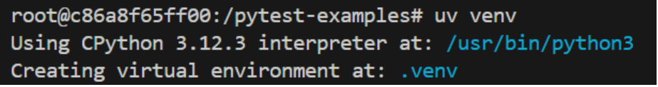

# Sprawozdanie z przedmiotu Metodyki DevOps z laboratorium nr 1-4
Sprawozdanie wykonała: Amelia Nalborczyk, nr grupy: 2.
Data wykonania: 30.03. 2025 r.
## Laboratorium 1  

1. Przygotowałam środowisko pracy  
   - Zainstalowałam maszynę wirtualną z systemem Linux Fedora na Oracle VirtualBox.  
   - Zalogowałam się do maszyny wirtualnej za pomocą SSH.  
   - Skonfigurowałam środowisko Visual Studio Code, korzystając z wtyczki Remote - SSH.  

2. Najpierw zainstalowałam klienta Git oraz skonfigurowałam obsługę kluczy SSH. SSH to sposób na bezpieczne łączenie się z GitHub bez potrzeby wpisywania loginu i hasła za każdym razem. Wykonanie tego zadania można sprawdzić w sekcji "SSH and GPG keys", jak poniżej:  
  

3. Za pomocą Personal Access Token sklonowałam repozytorium przedmiotowe MDO2025_INO, używając protokołu HTTPS.  
  

4. Wygenerowałam dwa klucze SSH, przy czym jeden z nich został zabezpieczony hasłem. Użyto polecenia: `ssh-keygen`.  

5. Skonfigurowałam klucz SSH jako metodę dostępu do GitHuba.  

6. Aby mieć dostęp do repozytorium jako uczestniczka, sklonowałam repozytorium za pomocą klucza SSH.  

7. Następnie przygotowałam swoją gałąź "AN416663". Od tej pory przełączam się na gałąź "main" za pomocą polecenia `git branch`. Do utworzenia gałęzi użyłam komendy `git checkout`. Dodany branch:  
  

8. W katalogu dla grupy utworzyłam nowy katalog "AN416663".  

9. Aby zapewnić, że każdy commit message zaczyna się od inicjałów i numeru indeksu, utworzyłam Git Hooka. Nadałam plikowi odpowiednie uprawnienia komendą `chmod`. Git Hook został zamieszczony w nowo powstałym katalogu. Treść Git Hooka znajduje się poniżej:  
  

10. W katalogu stworzyłam przykładowy plik `Sprawozdanie1.md`, dodałam przykładowy tekst oraz spróbowałam wysłać zmiany w następujący sposób:  
  

11. Plik został zapisany, jednak nie mógł zostać wypchnięty:  
  

13. Próba wypchnięcia mojej gałęzi okazała się niepowodzeniem ze względu na uprawnienia w repozytorium przedmiotowym:  
  

## Laboratorium 2  

1. Laboratorium 2 przebiega w oparciu o narzędzie Docker. Docker umożliwia pracę z aplikacjami w kontenerach, czyli izolowanych środowiskach. Pozwalają one na uruchamianie aplikacji w różnych środowiskach. Pierwszym krokiem jest przygotowanie środowiska pracy:  
   - Zainstalowałam oprogramowanie Docker za pomocą `dnf install`.  
   - Zarejestrowałam się na stronie https://hub.docker.com/, zapoznałam się z dostępnymi obrazami. Pobrałam obrazy: `hello-world`, `busybox`, `ubuntu`, `fedora`, `mysql`.  
  

2. Uruchomiłam kontener z obrazu hello-world. Poniżej zamieszczam efekt takiego uruchomienia:  
  

3. Ponownie uruchamiam kontener z obrazu busybox, tym razem interaktywnie (`-it`). Uruchomienie kontenera w trybie interaktywnym pozwala na bezpośrednią interakcję z terminalem kontenera. Poniżej przykład uruchomienia:  
  

4. Sprawdziłam wersję systemu w kontenerze, co jest możliwe dzięki trybowi interaktywnemu:  
  

5. Uruchomiłam obraz systemu Ubuntu w kontenerze:  
  

6. Sprawdziłam procesy Dockera i PID1 w kontenerze. Procesy w kontenerze, czyli tylko procesy uruchomione wewnątrz niego:  
  
Procesy Dockera na hoście. Widać uruchomiony kontener oraz inne procesy dockera działające na hoście:  
  

7. Zaaktualizowałam pakiety, a następnie wyszłam z kontenera polecenie `exit`:  
  

8. Następnie utworzyłam plik Dockerfile. Znajduje się on w folderze Sprawozdanie1. Dockerfile buduje system i klonuje repo.  

9. Zbudowałam i uruchomiłam Dockerfile, wobec czego został uruchomiony w trybie interaktywnym kontener z systemem Ubuntu:  
  
  

10. Sprawdziłam uruchomione kontenery (nie działające), za pomocą polecenia `docker ps -a`. Uruchomione kontenery to takie, które mogą być zarówno uruchomione, jak i zatrzymane. Oto efekt wywołania tego polecenia. W kolumnie STATUS można sprawdzić, które kontenery są zatrzymane (Exited).  
  

11. Po wykonaniu zadania należy pamiętać, by posprzątać po sobie:  
    - Usunęłam kontenery:  
  
    - Usunęłam obrazy:  
  
## Laboratorium 3  

1. Do wykonania tego laboratorium znalazłam kod oprogramowania: [https://github.com/pydantic/pytest-examples](https://github.com/pydantic/pytest-examples).  
   Sklonowałam to repozytorium. Wymagane było doinstalowanie następujących zależności:  

     
     
     

2. Następnie, według dokumentacji biblioteki, wykonałam build i uruchomiłam testy:  

     

3. Kolejny krok to przygotowanie do przeprowadzenia buildu i testów jednostkowych w kontenerze, dlatego zaczynam od stworzenia kontenera z obrazu Ubuntu:  

     

4. W kontenerze zaczynam od sklonowania repozytorium:  

     

5. Skonfigurowałam środowisko w kontenerze oraz wykonałam build.  

6. Uruchomiłam testy w kontenerze:  

     

7. Przygotowałam dwa **Dockerfile**, które zautomatyzują powyższe kroki.  
   - Pierwszy **Dockerfile** służy do przeprowadzania buildu,  
   - Drugi do wykonywania testów jednostkowych.  

   Dockerfile są dostępne w folderze **Sprawozdanie1**.  

8. Uruchomiłam najpierw Dockerfile budujący:  

     

9. Uruchomiłam Dockerfile do przeprowadzania testów:  

     

10. Oba kontenery pracowały poprawnie – kontener **builder** zbudował aplikację, a kontener **tester** wykonał testy.  
    Dowód, że kontener pracuje poprawnie – wewnątrz kontenera wykonano polecenie `ps aux`, efekt działania tego jest następujący:  

      

    Kontener został pomyślnie wdrożony z obrazu `test-image`. W tamtym momencie w kontenerze działały powłoka **Bash** oraz komenda `ps aux`.  

## Laboratorium 4
1. Utworzyłam dwa woluminy oraz podłączyłam je do kontenera bazowego, z którego rozpoczynano poprzednio pracę:

2. Zainstalowałam wymagania wstępne:

3. Repozytorium sklonowałam poza kontenerem i przeniosłam do woluminu wejściowego:
 
4. Wewnątrz kontenera skopiowałam repozytorium do katalogu roboczego:
 
5. Wykonuje build w kontenerze. Repozytorium sklonowałam poza kontenerem i przeniosłam do woluminu wejściowego
 
6. Tym razem uruchomiłam kontener z zainstalowanym Gitem. Powstałe pliki przeniosłam na wolumin wyjściowy:
 
7. W tym przypadku również istnieje możliwość by zautomatyzować cały proces, poprzez plik Dockerfile. Aby zoptymalizować budowanie obrazu można wykorzystać 'RUN --mount'. Opcja ta oszczędza zbędnego pobierania tych samych danych przy każdym buildzie.

## Użycie narzędzi GenAI
W ramach laboratorium korzystałam do wykonania ćwiczenia narzędzia ChatGPT - model 4o. 
Narzędzie zostało wykorzystane do 
- Korekty tekstu pisanego sprawozdania.
- Wytłumaczenia zagadnień poznawanych w ramach zajęć.
- Pomoc przy tworzeniu plików, znalezienia repozytorium do sklonowania
Odpowiedzi były weryfikowane osobiście przeze mnie  oraz doświadczalnie.

