# Metodyki DevOps – Sprawozdanie 2 – Amelia Nalborczyk

## Przygotowanie Jenkins

1. Do wykonania zadania wykorzystuję kontenery powstałe w ramach poprzednich laboratorii. W celu instalacji Jenkinsa pobieram oficjalny obraz:
   ```
   docker pull jenkins/jenkins:lts
   ```

2. Następnie tworzę kontener Jenkinsa z dostępem do Dockera, jak pokazano na screenie:  
   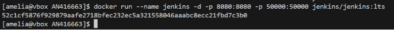

3. Uruchamiam kontener, aby sprawdzić poprawność instalacji Jenkinsa:  
   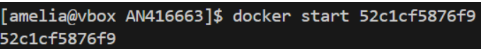

4. W efekcie widzę ekran rejestracji. Używam hasła z pliku `/var/jenkins_home/secrets/initialAdminPassword`, instaluję sugerowane wtyczki, a następnie widzę ekran logowania:
   
   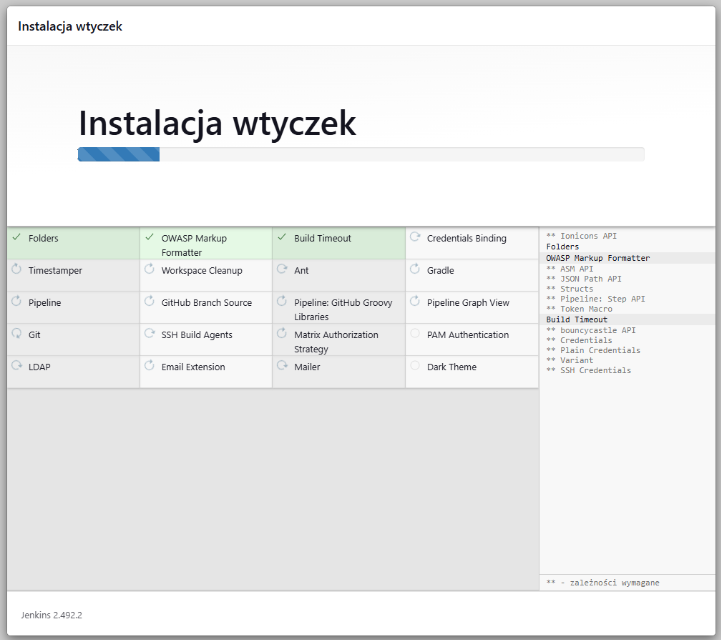
   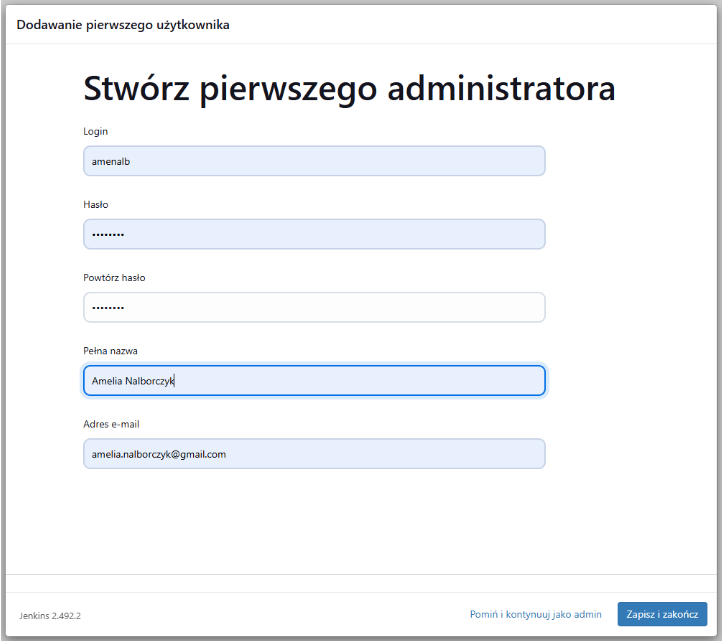
   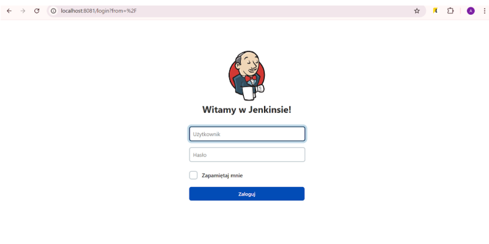

6. Przechodzę do przygotowania obrazu BlueOcean. Pobieram go za pomocą polecenia:
   ```
   docker pull jenkinsci/blueocean
   ```
   BlueOcean to nowoczesny interfejs użytkownika dla Jenkinsa, który upraszcza tworzenie i zarządzanie pipeline'ami CI/CD.

7. Uruchamiam kontener z BlueOcean:  
   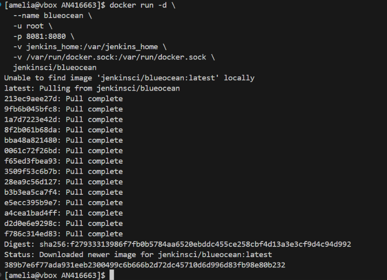

8. Przygotowuję projekty w celu sprawdzenia poprawności instalacji:

   - Projekt wyświetlający `uname`:  
     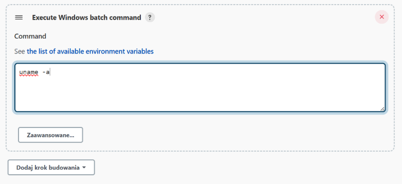  
     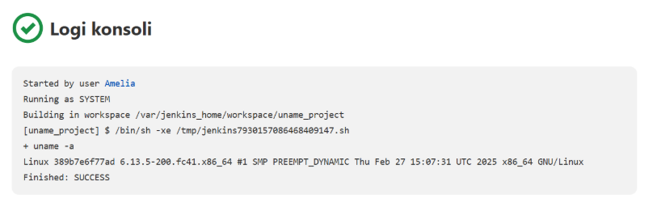

   - Projekt zwracający błąd, gdy godzina jest nieparzysta:  
     W sekcji `command` zamieszczam skrypt:
     ```bash
     HOUR=17
     LAST_DIGIT=$(echo "$HOUR" | sed 's/.*\(\.\)/\1/')
     if [ $((LAST_DIGIT % 2)) -ne 0 ]; then
         echo "Błąd: godzina ($HOUR) jest nieparzysta."
         exit 1
     else
         echo "OK: godzina ($HOUR) jest parzysta."
     fi
     ```
     Wynik działania skryptu dla odziny nieparzystej, a następnie dla parzystej:
     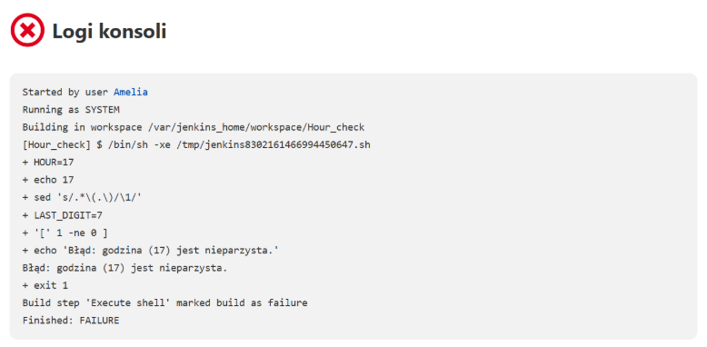
     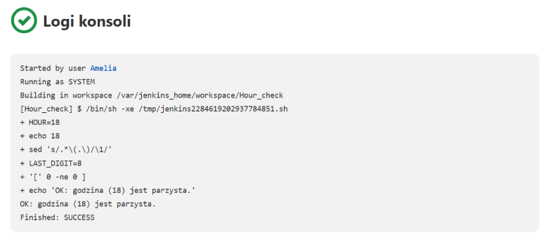
   - Projekt pobierający w projekcie obraz kontenera ubuntu:
     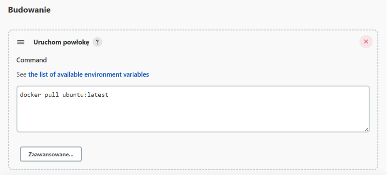
9. Tworzę podstawowy pipeline. Pipeline w Jenkinsie to zdefiniowany zestaw kroków (ang. steps), które są wykonywane automatycznie, aby zbudować, przetestować i wdrożyć aplikację.
   Dzięki pipeline'owi możesz zautomatyzować cały proces Continuous Integration / Continuous Delivery (CI/CD), czyli budowanie, testowanie i publikowanie oprogramowania. Aby przygotować pipeline, potrzebne są dwa    pliki: Jenkinsfile, który opisuje etapy procesu (np. klonowanie repozytorium, budowanie Dockera) oraz Dockerfile, który definiuje sposób stworzenia obrazu kontenera. Zadaniem pipeline jest pobranie                repozytorium przedmiotu MD02025_INO i budowa obrazu dockera, zawartego w dockerfile na mojej gałęzi. Plik Jenkinsfile dla tego zadania wygląda następująco:

!!!!!!!!!!!!!!!!!!!!!!!!!!!!!!!!!!!!!!!!!!!!!!!!!!!!!!!!!!!!!!!!!!!!!!!!!!!!!!!!!!!!!!!!!!!!!!!!!!!!!!!!!!!

   
   Poprawne działanie pipeline prezentuje poniżej w konsoli oraz w Jenkinsie:
   
   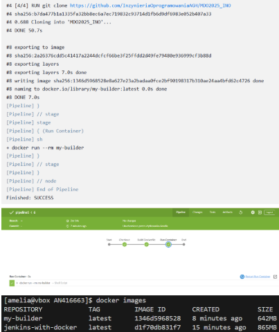
   Po ponownym uruchomieniu pipeline działa poprawnie.

## Stworzenie pipeline dla biblioteki XZ Utils
Biblioteka XZ Utils to zestaw narzędzi i bibliotek do kompresji danych, opartych na algorytmie kompresji LZMA (Lempel-Ziv-Markov chain algorithm). Upewniłam się, że licencja potwierdza możliwość swobodnego obrotu kodem na potrzeby zadania. Na początku przeprowadzam analizę planowanych kroków dla procesu CI/CD:
   - wymagania wstępne: Jenkins, Docker, Git, Autotools i CMake.
   - dla projektu wykonuje diagram aktywności w programie Visual Paraview i zamieszcam poniżej:
     
   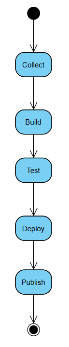
   - Tworzę również diagram wdrożeniowy, który opisuje zależności między składnikami, zasobami i artefaktami:
   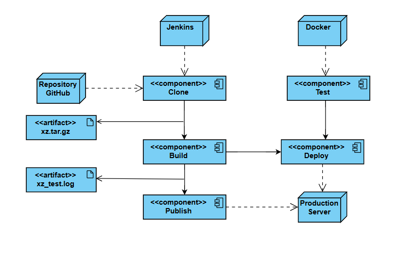
1. Zaczynam od stworzenia kontenera w którym będę tworzyła pipeline na podstawie docker-compose.yml. Do utworzenia kontenera Jenkins wykorzystano obraz bazowy jenkins/jenkins:lts. Kontener został skonfigurowany za pomocą pliku Dockerfile.jenkins
   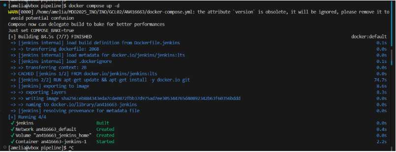
2. W Następnym kroku przygotowuję plik Jenkinsfile opisujący mój pipeline. 
```
pipeline {
    agent any

    environment {
        WORKDIR = "INO/GCL02/AN416663/pipeline"
    }

    stages {
        stage('Clone xz') {
            steps {
                dir("${WORKDIR}") {
                    sh "rm -rf xz"
                    sh "git clone https://github.com/tukaani-project/xz.git xz"
                }
            }
        }

        stage('Build & Package') {
            steps {
                dir("${WORKDIR}") {
                    script {
                        docker.build('xz-build', '-f Dockerfile.build .')
                        sh 'mkdir -p artifacts'
                        def cid = sh(script: "docker create xz-build", returnStdout: true).trim()
                        sh "docker cp ${cid}:/app/xz.tar.gz artifacts/xz-${BUILD_NUMBER}.tar.gz"
                        sh "docker rm ${cid}"
                    }
                }
            }
        }

        stage('Test') {
            steps {
                dir("${WORKDIR}") {
                    script {
                        docker.build('xz-test', '-f Dockerfile.test .')
                        sh 'mkdir -p logs'
                        def cid = sh(script: "docker create xz-test", returnStdout: true).trim()
                        sh "docker cp ${cid}:/app/logs/test_results.log logs/xz_test.log"
                        sh "docker rm ${cid}"
                    }
                }
            }
        }

        stage('Deploy') {
            steps {
                dir("${WORKDIR}") {
                    script {
                        
                        def deployImage = docker.build('xz-deploy', '-f Dockerfile.deploy .')
                        def cid = sh(script: "docker create xz-deploy", returnStdout: true).trim()

                        sh "docker cp artifacts/xz-${BUILD_NUMBER}.tar.gz ${cid}:/tmp/xz.tar.gz"
                        sh "docker cp deploy.c ${cid}:/app/deploy.c"
                        sh "docker start ${cid}"
                        sh "sleep 3"
                        sh "docker exec ${cid} tar -xzf /tmp/xz.tar.gz -C /tmp"
                        sh "docker exec ${cid} gcc /app/deploy.c -llzma -o /tmp/deploy_test"
                        sh "docker exec ${cid} /tmp/deploy_test"

                        sh "docker rm -f ${cid}"

                        sh "mkdir -p deploy"
                        sh "tar -xzf artifacts/xz-${BUILD_NUMBER}.tar.gz -C deploy"

                        writeFile file: 'deploy/Dockerfile', text: """
                        FROM debian:bullseye-slim
                        RUN apt-get update && apt-get install -y liblzma5
                        COPY . /app
                        WORKDIR /app
                        CMD ["./xz"]
                        """

                        docker.build("xz-prod-${BUILD_NUMBER}", 'deploy')
                    }
                }
            }
        }

        stage('Print') {
            steps {
                echo 'Pipeline dla xz zakończony pomyślnie.'
            }
        }
    }

    post {
        always {
            archiveArtifacts artifacts: 'INO/GCL02/AN416663/pipeline/artifacts/xz-*.tar.gz'
            archiveArtifacts artifacts: 'INO/GCL02/AN416663/pipeline/logs/xz_test.log'
        }
    }
}
```
Pliki Dockerfile.build, Dockerfile.test, Dockerfile.deploy nie były zawarte w repozytorium, lecz były stworzone na postawie wymagań projektu znajdujących się w pliku INSTALL. Pliki zostają zamieszczone w folderze
### Etap Clone xz
Etap 'Clone xz' w pipeline CI/CD jest odpowiedzialny za klonowanie repozytorium kodu źródłowego biblioteki XZ Utils z GitHub. Celem tego etapu jest zapewnienie, że najnowsza wersja kodu źródłowego biblioteki XZ Utils będzie dostępna w katalogu roboczym xz na maszynie wykonującej pipeline.
### Etap Build & Package
Etap 'Build & Package' w pipeline CI/CD dla biblioteki XZ Utils odpowiada za budowanie obrazu Docker oraz pakowanie artefaktu. W tym etapie tworzony jest obraz Docker o nazwie xz-build przy użyciu pliku Dockerfile.build, który zawiera wszystkie niezbędne zależności oraz skompilowany kod źródłowy biblioteki XZ Utils. Następnie tworzony jest kontener z obrazu xz-build. Z kontenera kopiowany jest zbudowany artefakt xz.tar.gz do lokalnego katalogu artifacts, przy czym nazwa artefaktu zawiera numer aktualnego buildu, co umożliwia wersjonowanie. Po skopiowaniu artefaktu kontener jest usuwany. Artefakt zawiera kod źródłowy biblioteki XZ Utils oraz wszelkie niezbędne pliki, które są potrzebne do uruchomienia tej biblioteki.
### Etap Test
Kontener testowy w tym etapie jest oparty na kontenerze buildowym, ponieważ wykorzystuje obraz xz-deploy do przeprowadzenia testów w tym samym środowisku, w którym aplikacja była zbudowana. Etap 'Test' ma na celu weryfikację poprawności działania aplikacji poprzez uruchomienie zautomatyzowanych testów. Pierwszym krokiem w tym etapie jest zbudowanie obrazu Docker o nazwie xz-test na podstawie pliku Dockerfile.test. Następnie tworzony jest kontener z tego obrazu. Z kontenera kopiowane są logi wyników testów, a wynikowy plik logu nazywany jest xz_test.log. Po zakończeniu testów kontener jest usuwany. Testy są wykonywane wewnątrz osobnego kontenera (kontener xz-test), który jest oparty na kontenerze buildowym. Kontener testowy jest oparty na obrazie xz-deploy, który zawiera te same zależności, co kontener buildowy, aby testy mogły być przeprowadzane w tym samym środowisku, w którym aplikacja była zbudowana. 
### Etap Deploy
Etap 'Deploy' w pipeline CI/CD odpowiada za uruchomienie i zarządzanie kontenerami w środowisku produkcyjnym. Skrypt przechodzi do katalogu roboczego i buduje obraz Docker o nazwie xz-deploy na podstawie pliku Dockerfile.deploy. Następnie tworzony jest kontener z tego obrazu, a jego identyfikator jest przechowywany w zmiennej cid. Skrypt kopiuje pliki, takie jak archiwum xz-${BUILD_NUMBER}.tar.gz oraz plik deploy.c, do kontenera, uruchamia go, a następnie rozpakowuje archiwum. Plik deploy.c jest kompilowany do programu deploy_test. Po przeprowadzeniu testu kontener jest usuwany. Archiwum jest następnie rozpakowywane w nowym katalogu deploy, w którym tworzony jest nowy plik Dockerfile, definiujący obraz oparty na debian:bullseye-slim. Obraz ten instaluje bibliotekę liblzma5 i ustawia polecenie uruchamiające aplikację. Na końcu skrypt buduje nowy obraz Docker o nazwie xz-prod-${BUILD_NUMBER}, który jest gotowy do wdrożenia w środowisku produkcyjnym.
Po wdrożeniu kontenera deploy, przeprowadzany jest test typu smoke test, który ma na celu szybkie zweryfikowanie, czy aplikacja działa poprawnie w podstawowych scenariuszach. Test polega na uruchomieniu aplikacji w kontenerze, sprawdzeniu jej dostępności oraz podstawowych funkcji. Dzięki temu możliwe jest wczesne wykrycie krytycznych błędów, które mogłyby wpłynąć na dalsze procesy wdrożeniowe. W przypadku niepowodzenia testów kontener jest usuwany, a proces wdrożenia jest przerywany.

### Opis kontenera deploy
Kontener deploy został zbudowany na bazie oficjalnego obrazu debian:bullseye. Aby spełnić wymagania projektu, do kontenera zostały doinstalowane minimalne, niezbędne zależności, takie jak kompilator GCC (gcc), biblioteka liblzma-dev oraz certyfikaty SSL (ca-certificates). Kontener został zaprojektowany specjalnie do uruchamiania aplikacji po procesie budowania w środowisku testowym.
Kontener buildowy nie nadaje się do roli kontenera deploy, ponieważ zawiera szereg dodatkowych narzędzi deweloperskich, które są używane jedynie na etapie kompilacji. Ich obecność zwiększa rozmiar obrazu, wydłuża czas uruchamiania kontenera i może stanowić potencjalne zagrożenie dla bezpieczeństwa środowiska produkcyjnego. W związku z tym, zdecydowano się na stworzenie osobnego, lekkiego kontenera deploy, który zawiera wyłącznie narzędzia niezbędne do testowego uruchomienia aplikacji.
W procesie wdrażania zbudowana aplikacja, w postaci archiwum .tar.gz, jest kopiowana do kontenera deploy, gdzie zostaje rozpakowana i przetestowana za pomocą programu deploy_test. Po pomyślnym przejściu testów, przygotowywany jest finalny obraz produkcyjny, oparty na minimalistycznym systemie debian:bullseye-slim. Ten obraz zawiera jedynie gotowy plik wykonywalny xz oraz wymagane biblioteki. Oddzielenie kontenera deploy od kontenera buildowego pozwoliło na stworzenie bardziej zoptymalizowanego, bezpiecznego i szybszego w uruchamianiu środowiska produkcyjnego.

### Artekaty
Artefakt w procesie CI/CD to skompilowany plik lub obraz, który jest wynikiem procesu budowania aplikacji. W przypadku XZ Utils, artefaktem jest archiwum .tar.gz zawierające skompilowaną aplikację i jej zależności. Wersjonowanie artefaktu jest realizowane poprzez przypisanie numeru wersji bazującego na numerze buildu Jenkinsowego. Taki numer pozwala na jednoznaczne zidentyfikowanie wersji artefaktu oraz śledzenie zmian między kolejnymi wersjami aplikacji. Wybór archiwum .tar.gz jako artefaktu w tym projekcie jest uzasadniony ze względu na jego prostotę i uniwersalność. Alternatywnie, kontener z programem może być używany w środowiskach, gdzie aplikacja ma być uruchamiana bezpośrednio w kontenerze Docker, ale nie jest to wymagane w przypadku tego projektu. Artefakt jest dostępny do pobrania jako część procesu builda w Jenkinsie. Zidentyfikowanie pochodzenia artefaktu jest możliwe dzięki zachowaniu ścisłej procedury wersjonowania i logowaniu procesu builda, co umożliwia późniejsze odnalezienie źródła i historii zmian artefaktu.
 
3. W jenkinsie tworzę pipeline i konfiguruję go w następujący sposób:
 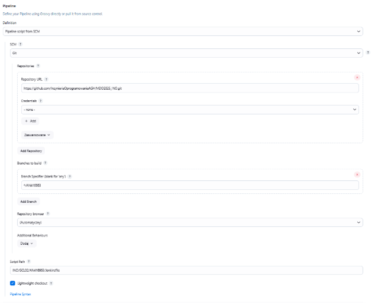
4. Powodzenie przeprowadzenia procesu CD/CI aplikacji:
   
 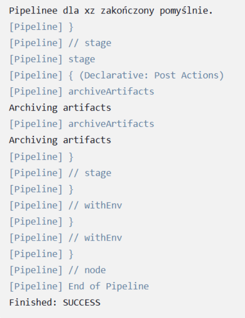
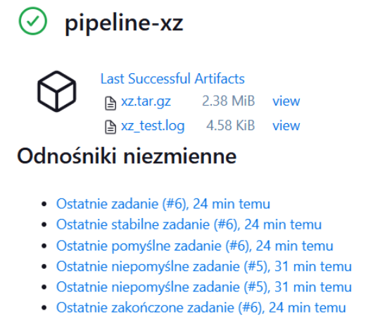
6. Potwierdzenie utworzenia artefaktów:
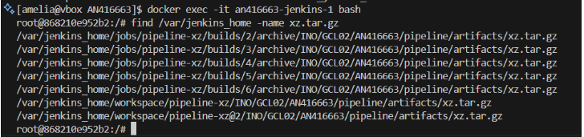
7. Skopiowanie arefaktu na hosta oraz sprawdzenie zawartości poprzez rozpakowanie:
 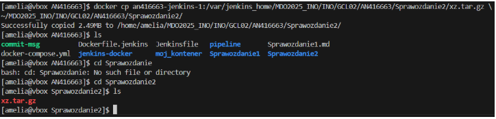
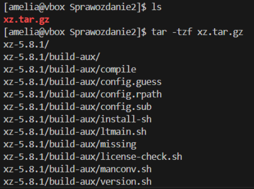

### Maintainability
W rozwiązaniu zapewniono odporność na awarię oraz możliwość ponownego użycia dzięki kontenerom Docker, które gwarantują spójne i łatwe do odtworzenia środowisko uruchomieniowe. Każdy artefakt jest wersjonowany, co umożliwia przechowywanie wielu wersji aplikacji i szybkie przywrócenie poprzedniej wersji w przypadku błędów w nowej. Logi z procesu testowania oraz artefakty są przechowywane i dostępne do analizy, co pozwala na łatwą diagnozę problemów i ich szybsze naprawienie w razie awarii.

