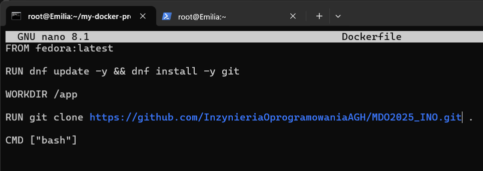
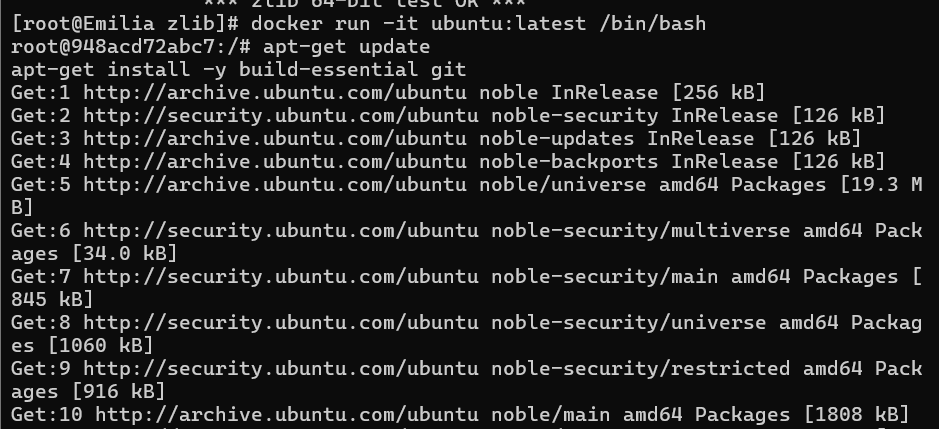
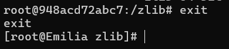
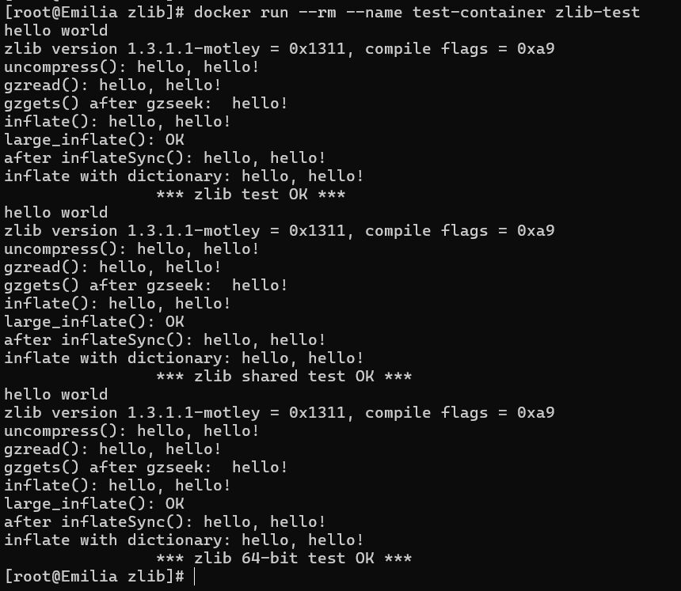
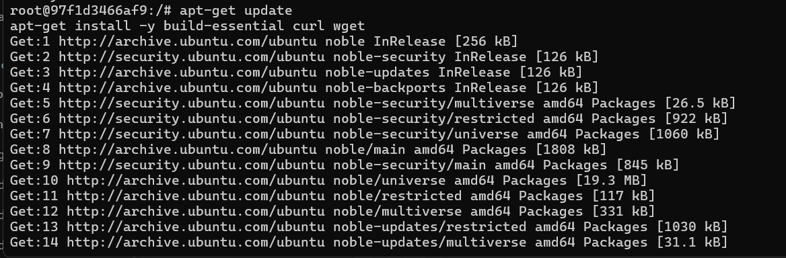
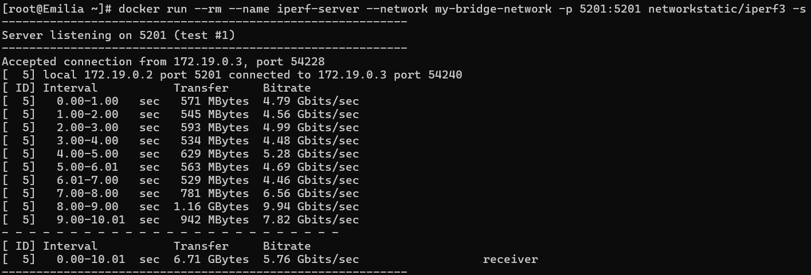

# Sprawozdanie 1

Emilia Pajdo

Inżynieria Obliczeniowa

------------------------------------------------------------------------

## Zajęcia 1

1.  Pracę nad zadaniami rozpoczęłam od instalacji systemu Fedora Server na maszynie wirtualnej. Następnie, aby połączyć się z systemem Fedora, skorzystałam z protokołu SSH, używając wiersza poleceń w systemie Windows oraz polecenia `ssh root@192.168.8.49`.

    

    Zainstalowałam klienta Git, korzystając z komendy `sudo dnf install git`.

2.  Po instalacji sklonowałam repozytorium przedmiotowe, używając HTTPS oraz Personal Access Token za pomocą polecenia `git clone https://<LOGIN>:<TOKEN>@github.com/InzynieriaOprogramowaniaAGH/MDO2025_INO.git`.

    

    Następnie wygenerowałam dwa nowe klucze SSH, inne niż RSA, z czego jeden zabezpieczony hasłem: `ssh-keygen -t ed25519 -C "pajdoemilia@gmail.com"`.

    

    Po wygenerowaniu każdego z kluczy, skopiowałam ich zawartość używając `cat ~/.ssh/id_ed25519.pub`. Dodałam klucze SSH do swojego konta GitHub.

    

3.  Upewnieniłam się, że mam dostęp do repozytorium za pomocą komendy `ssh -T git@github.com`.

    

    Następnie sklonowałam repozytorium za pomocą protokołu SSH: `git clone git@github.com:InzynieriaOprogramowaniaAGH/MDO2025_INO.git`.

    

4.  Po sklonowaniu repozytorium, przełączyłam się na gałąź main, a następnie na gałąź grupową poprzez polecenia `git checkout main git checkout GCL02`.

5.  Utworzyłam nową gałąź o nazwie zawierającej moje inicjały i numer indeksu oraz przełączyłam się na nią: `git checkout -b EP414657`.

    

6.  W katalogu grupy utworzyłam katalog o nazwie odpowiadającej moim inicjałom i numerowi indeksu: `mkdir EP414657`.

7.  Następnie utworzyłam Git hooka, który weryfikował, czy każdy commit message zaczyna się od moich inicjałów i numeru indeksu. Nadałam mu uprawnienia do wykonywania i skopiowałam go do katalogu `.git/hooks`, aby uruchamiał się przy wykonywaniu commitów: `nano check-commit-msg.sh   chmod +x check-commit-msg.sh   cp check-commit-msg.sh ../.git/hooks/commit-msg`.

    

8.  Edytowałam plik `commit-msg`, dodając poniższy skrypt:

    

    W przypadku błędnego komentarza do commita wyświetla się następujący komunikat:

    

## Zajęcia 2

1.  Na początku zajęć przeprowadziłam instalację Dockera na systemie Fedora.

    

2.  W kolejnym kroku zarejestrowałam się w Docker Hub.

3.  Pobrałam potrzebne obrazy wykorzystując `docker pull`.

    

4.  Uruchomiłam kontener z obrazu `busybox` komendą `docker run busybox echo "Hello, world!"`, w celu wypisania wewnątrz kontenera napisu.

    

    Połączyłam się z kontenerem interaktywnie używając `docker run -it busybox sh` i wywołałam numer wersji:

    

5.  Następnie uruchomiłam system w kontenerze za pomocą `docker run -it fedora bash`.

    

    Wyświetliłam PID1 w kontenerze używając komendy `cat /proc/1/status`:

    

    

    

    Wyświetliłam procesy Dockera na hoście przy wykorzystaniu `ps aux | grep docker`.

    

    Następnie zaktualizowałam pakiety poprzez `dnf update -y`.

    

6.  Stworzyłam plik `Dockerfile`.

    

    Treść wyglądała następująco:

    

    Następnie zbudowałam go: `docker build -t my-fedora-image .` i uruchomiłam `docker run -it my-fedora-image bash`.

    

    Sprawdziłam czy ściągnięte jest tam odpowiednie repozytorium poprzez komendę `ls /app`.

    

7.  Sprawdziłam uruchomione kontenery poprzez `docker ps -a`.

    

    Wyczyściłam je używając komendy `docker rm $(docker ps -aq)`.

    

    Usunęłam obrazy poprzez `docker rmi`.

    

    

## Zajęcia 3

1.  Wykonywane na zajęciach zadanie rozpczełam od znalezienia odpowiedniego oprogramowania. Wybrałam zlib - <https://github.com/madler/zlib> - biblioteke do kompresji danych z otwartym kodem żródłowym, która udostępniona jest wraz z narzędziami Makefile.

2.  Zainstalowałam wymagane narzędzia - make oraz gcc - poleceniem `sudo dnf install gcc make -y`:

    

3.  Skolonowałam repozytorium do katalogu `zlib`:

    

4.  Następnie użyłam polecenia `./configure`, które przygotowuje pliki Makefile i konfiguracje projektu:

    

5.  Zbudowałam aplikacje za pomocą `make`:

    

6.  Uruchomiłam testy jednostkowe zawarte w repozytorium aplikacji za pomocą `make test`:

    

7.  Uruchomiłam interaktywny kontener na bazie obrazu Ubuntu, aby przeprowadzić build, a następnie zainstalowałam w nim wymagane pakiety:

    

8.  Skolonowałam repozytorium aplikacji wewnątrz kontenera:

    

9.  Zbudowałam aplikacje w analogiczny sposób jak poza kontenerem, używając `./configure` i `make`:

    

    

10. Na koniec pracy w kontenerze uruchomiłam testy jednostkowe poprzez `make test`, które dały taki sam wynik jak poza kontenerem:

    

11. Wyszłam z kontenera używając `exit`:

    

12. Stworzyłam plik `Dockerfile-zlib.build`, który miał za zadanie zautomatyzować proces opisany powyzej do etapu builda. Treść `Dockerfile-zlib.build`:

    

13. Następnie stworzyłam drugi plik, `Dockerfile.test`, który bazuje na pierwszym pliku i wykonuje testy:

    

14. Zbudowałam obraz pierwszy za pomocą `docker build -f Dockerfile.build -t zlib-build .`:

    

15. W kolejnym kroku zbudowałam drugi obraz:

    

16. Uruchomiłam testy z obrazu testowego za pomocą `docker run --rm --name test-container zlib-test`:

    

17. Na koniec za pomocą poleceń `docker images` oraz `docker ps -a`, sprawdziłam poprawność działania uruchomionych wcześniej obrazów oraz kontenerów:

    

    

## Zajęcia 4

1.  Przygotowałam woluminy: wejściowy i wyjściowy. Użyłam do tego komendy `docker volume create`. Nadałam woluminom nazwy: `wolumin_wejsciowy` oraz `wolumin_wyjsciowy`.

    

    Wolumin wejściowy został stworzony by przechować dane, takie jak repozytorium aplikacji `zlib`, natomiast wolumin wyjściowy miał za zadanie przechować zbudowane pliki.

2.  Uruchomiłam kontener bazowy `Ubuntu` oraz podłączyłam do niego woluminy komendą `docker run -it kontener_bazowy -v wolumin_wejsciowy:/mnt/wejsciowy -v wolumin_wyjsciowy:/mnt/wyjsciowy ubuntu:latest bash`.

    

3.  Wewnątrz kontenera zainstalowałam wymagane narzędzia poprzez `apt-get update` oraz `apt-get install -y build-essential curl wget`.

    

4.  Następnie sklonowałam repozytorium na wolumin wejściowy. Zrobiłam to poprzez klonowanie repozytorium aplikacji `zlib` z hosta bezpośrednio do woluminu. Po zalogowaniu na swojego hosta w osobnym terminalu użyłam komendy `git clone https://github.com/madler/zlib.git /var/lib/docker/volumes/wolumin_wejsciowy/_data`.

    

    Metoda ta jest poprawna, jednak uznawana jest za niebezpieczną, ponieważ bezpośrednia edycja katalogu `var/lib/docker` może prowadzić do uszkodzenia danych, konfilktów z Dockerem - Docker nie wie o bezpośrednich zmianach w katalogu woluminów, problemów z bezpieczeństem.

5.  W kontenerze bazowym przeszłam do katalogu `mnt`, a następnie do katalogu `wejsciowy`. Użyłam tam polecenia `ls` aby wyświetlić zawartość. Tym samym sprawdziłam czy repozytorium zostało poprawnie skopiowane.

    

6.  W katalogu `wejsciowy` w kontenerze uruchomiłam proces kompilacji aplikacji `zlib`. Najpierw użyłam polecenia `./configure`.

    

    Następnie użyłam polecenia `make`.

    

7.  Skopiowałam skompilowane pliki `libz.a` oraz `zlib.h` na wolumin wyjściowy za pomocą poleceń: `cp libz.a /mnt/wyjsciowy/` oraz `cp zlib.h /mnt/wyjsciowy/`.

    

8.  Sprawdziłam zawartość `wyjsciowy` poprzez użycie w nim polecenia `ls`, aby sprawdzić czy pliki zostały poprawnie skopiowane.

    

9.  W kolejnym kroku doinstalowałam do kontenera gita używając `apt-get update && apt-get install -y git`.

    

10. Skolonowałam repoytorium `zlib` do woluminu wewnątrz kontenera za pomocą komendy `git clone https://github.com/madler/zlib.git /mnt/wejsciowy/zlib_rep`.

    

11. Sprawdziłam, używjąc `ls`, zawartość katalogu `zlib_repo`, gdzie sklonowane zostało repozytorium.

    

12. Tak jak poprzednio, uruchomiłam proces kompilacji poprzez `./configure` oraz `make`.

    

    

13. Utworzyłam w katalogu `wyjściowy` katalog `zlib_build`- `mkdir zlib_build`, w celu skopiowania tam wyników kompilacji z woluminu wejściowego.

    

14. Następnie skopiowałam tam pliki `libz.a` oraz `zlib.h`poleceniami `cp libz.a /mnt/wyjsciowy/zlib_build/` oraz `cp zlib.h /mnt/wyjsciowy/zlib_build/`.

    

15. Sprawdziłam zawartość katalogu `zlib_build` poprzez wykonanie w nim `ls`.

    

16. Pobrałam obraz iPerf za pomocą komendy `docker pull networkstatic/iperf3`.

    

17. Uruchomiłam kontener, który pełnił rolę serwera za pomocą `docker run --rm --name iperf-server -p 5201:5201 networkstatic/iperf3 -s`. Uruchamiało to serwer iPerf3 na porcie 5201.

    

18. Następnie uruchomiłam drugi kontener, który łączył się z serwerm. Uruchomienie odbywało się poprzez komendę `docker run --rm --name iperf-client networkstatic/iperf3 -c 172.17.0.1`.

    

19. Po uruchomieniu kontera-klienta, w kontenerze z serwerem pojawił się wydruk:

    

20. Poleceniem `docker network create my-bridge-network` utworzyłam własną sieć mostkową.

    

21. Uruchomiłam serwer na nowej sieci poprzez `docker run --rm --name iperf-server --network my-bridge-network -p 5201:5201 networkstatic/iperf3 -s`.

    

22. Uruchomiłam również klienta na nowej sieci, używając nazwy kontenera serwera zamiast adresu IP `docker run --name iperf-client --network my-bridge-network networkstatic/iperf3 -c iperf-server`.

    

23. Po wykonaniu kroku wyżej w kontenerze z serwerem pojawił się wydruk:

    

24. Używając iPerf3 zainstalowanego na hoście wykonałam test przepustowości za pomocą komendy `iperf3 -c 127.0.0.1`.

    

25. Wydruk kontenera z serwerem po wykonaniu testu na hoście:

    

26. Następnie przeprowadziłam test spoza hosta, z innego urządzenia w tej samej sieci. Po zainstalowaniu `iPerf` na urządzenie użyłam komendy `.\iperf3.exe -c 192.168.8.51`.

    

27. Powyższy krok dał wynik kontenera z serwerem:

    

28. Wyciągnełąm logi z kontenerów i zapisałam je w plikach `server.log` oraz `client.log` za pomocą polecenia `docker logs iperf-server > server.log` oraz `docker logs iperf-client > client.log`.

    
    
    Po analizie logów można zauważyć różnice w przepustowości, w zależności od sposobu komunikacji. Pierwszy test obejmował komunikację między dwoma kontenerami uruchomionymi w dedykowanej sieci mostkowej, w wyniku czego osiągnięto wysoką średnią przepustowość wynoszącą 5.76 Gbits/sec, co świadczy o efektywnej wymianie danych w obrębie tej sieci. Drugi test sprawdzał komunikację między kontenerem a hostem systemowym, gdzie zaobserwowano niższą przepustowość – 1.78 Gbits/sec. Trzeci test objął komunikację między kontenerem a urządzeniem spoza hosta w sieci LAN, a średnia przepustowość wyniosła 358 Mbits/sec.

29. Zainstalowałam `Jenkins` w kontenerze używając `docker pull jenkins/jenkins:lts`.

    

30. Uruchomiłam instancję Jenkinsa w kontenerze z pomocą DIND poprzez polecenie `docker run --rm -d --name jenkins --network host --privileged \   -p 8080:8080 -p 50000:50000 \   -v jenkins_home:/var/jenkins_home \   -v /var/run/docker.sock:/var/run/docker.sock \   jenkins/jenkins:lts`. Sprawdziłam czy kontener działa poprawnie za pomocą polecenia `docker ps`.

    

31. W przeglądarce wpisałam `http://192.168.8.51:8080/`, po czym ukazał się ekran logowania Jenkinsa.

    

32. Uzyskałam hasło administratora poprzez polecenie `docker exec jenkins cat /var/jenkins_home/secrets/initialAdminPassword`.

    
