# Sprawozdanie 2

Emilia Pajdo

Inżynieria Obliczeniowa

------------------------------------------------------------------------

## Zajęcia 1

1.  Wykonywanie zadań rozpoczęłam od stworzenia nowej sieci Dockerowej o nazwie `jenkins` za pomocą polecenia `docker network create jenkins`.

    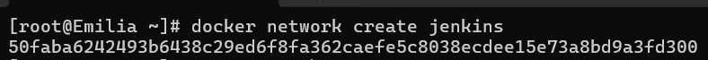

    Sieć ta pozwala na komunikacje kontenerów.

2.  Uruchomiłam kontener Docker o nazwie `jenkins-docker`, który działa w trybie Docker-in-Docker (DinD). Użyłam do tego komendy:

    ``` bash
    docker run --name jenkins-docker --rm --detach \
      --privileged --network jenkins --network-alias docker \
      --env DOCKER_TLS_CERTDIR=/certs \
      --volume jenkins-docker-certs:/certs/client \
      --volume jenkins-data:/var/jenkins_home \
      --publish 2376:2376 \
      docker:dind --storage-driver overlay2
    ```

    Dzięki opcji `--network jenkins` kontener został przypisany do utworzonej wcześniej sieci `jenkins`, opcja `--network-alias docker` ustawiła alias sieciowy dla kontenera, tak aby inne kontenery w tej samej sieci mogły odnaleźć ten kontener jako `docker`, opcja --privileged jest konieczna, aby Docker wewnątrz kontenera mógł działać poprawnie, natomiast opcja `docker:dind` określiła obraz, który ma zostać uruchomiony - w tym przypadku obraz Docker-in-Docker. Jenkins musi mieć możliwość uruchamiania poleceń docker, np. w celu budowania obrazów lub uruchamiania testów. W tym celu uruchomiony został pomocniczy kontener Docker-in-Docker (DinD), który zapewnia środowisko Dockerowe wewnątrz systemu.

    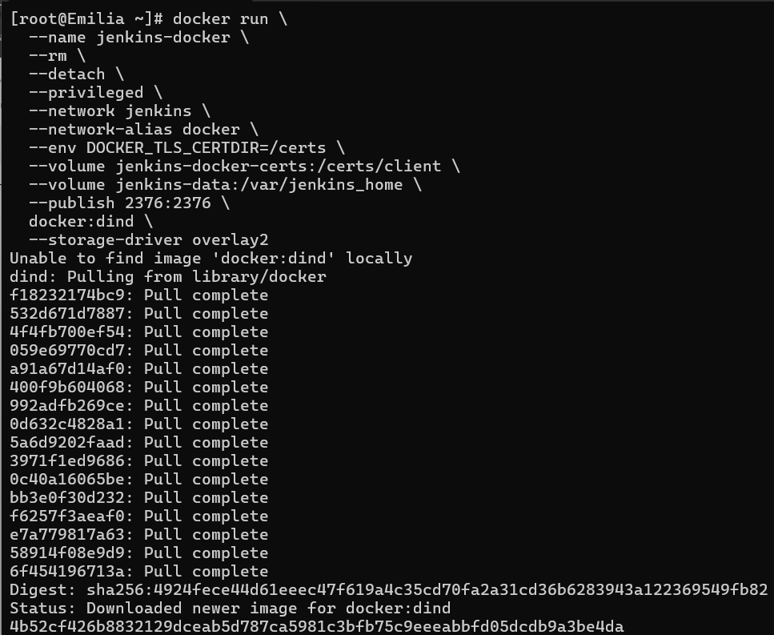

3.  Następnie za pomocą polecenia `nano Dockerfile` utworzyłam plik Dockerfile o następującej treści:

    ``` bash
    FROM jenkins/jenkins:2.492.3-jdk17
    USER root
    RUN apt-get update && apt-get install -y lsb-release ca-certificates curl && \
    install -m 0755 -d /etc/apt/keyrings && \
    curl -fsSL https://download.docker.com/linux/debian/gpg -o /etc/apt/keyrings/docker.asc && \
    chmod a+r /etc/apt/keyrings/docker.asc && \
    echo "deb [arch=$(dpkg --print-architecture) signed-by=/etc/apt/keyrings/docker.asc] \
    https://download.docker.com/linux/debian $(. /etc/os-release && echo \"$VERSION_CODENAME\") stable" \
    | tee /etc/apt/sources.list.d/docker.list > /dev/null && \
    apt-get update && apt-get install -y docker-ce-cli && \
    apt-get clean && rm -rf /var/lib/apt/lists/*
    USER jenkins
    RUN jenkins-plugin-cli --plugins "blueocean docker-workflow"
    ```

    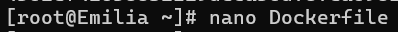

    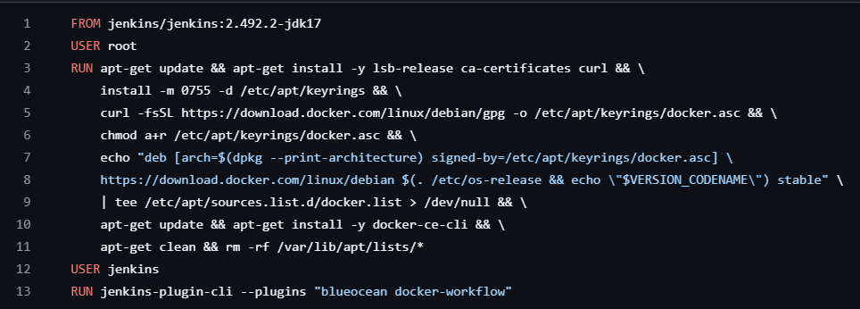

    Ten Dockerfile przygotowuje obraz Dockera oparty na Jenkins w wersji 2.492.3-jdk17(wybrałam oficjalny obraz Jenkinsa, ponieważ zapewnia stabilne i zgodne środowisko). Zmienia użytkownika na `root`, aktualizuje liste dostępnych pakietów i instaluje trzy pakiety, potrzebne aby uzyskać informacje o wersji systemu oraz zainstalować certyfikaty niezbędne do bezpiecznego pobierania plików, a także narzędzie `curl` potrzebne do pobierania plików z internetu - w tym przypadku klucza GPG z serwera `Docker`. Określone zostaje repozytorium Dockera, po którego dodaniu następuje ponowna aktualizacja listy pakietów oraz instalacja `Docker CLI`, czyli Command Line Interface, który pozwala na uruchomienie poleceń Dockera z wnętrza kontenera. Usuwane są pliki cache związane z instalacją pakietów, a także katalog z listami pakietów. Następuje zmiana użytkownika z powrotem na `jenkins`, aby kontener działał bez potrzeby uprawnień administratora. Na koniec instalowane są dwa pluginy do `Jenkinsa`: `blueocean` - plugin do zainstalowania interfejsu użytkownika, a także `docker-workflow` - plugin, który umożliwia korzystanie z Dockera w procesach CI/CD, co jest przydatne do uruchamiania kontenerów i innych operacji Dockerowych w Jenkins.

    Różnice między obrazami `jenkins/jenkins` a `blueocean`:

    Obraz `jenkins/jenkins` to podstawowy obraz Jenkinsa, zawierający jego silnik oraz środowisko uruchomieniowe, ale bez dodatkowych pluginów. `BlueOcean` to natomiast interfejs użytkownika nowej generacji, który upraszcza zarządzanie pipeline’ami i projektami. Obraz z BlueOcean można uzyskać na dwa sposoby: albo korzystając z gotowego jenkinsci/blueocean, albo – jak w tym przypadku – przygotowując własny obraz i instalując potrzebne pluginy samodzielnie.

4.  Zbudowałam obraz Dockera na podstawie Dockerfile przy użyciu komendy `docker build -t myjenkins-blueocean:2.492.3-1 .`

    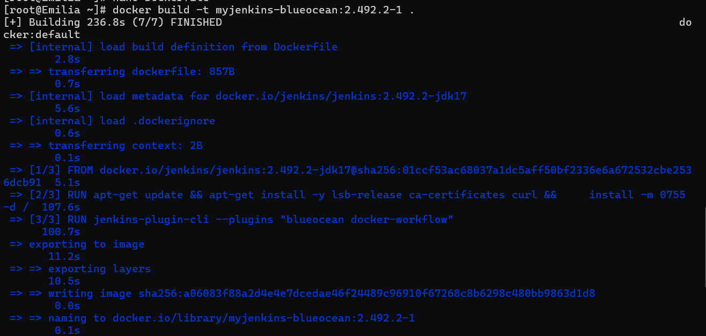

5.  Uruchomiłam kontener Jenkins oparty na własnym obrazie `myjenkins-blueocean:2.492.3-1`, który ma wbudowane pluginy i dostęp do Dockera. Użyłam do tego polecenia:

    ``` bash
    docker run --name jenkins-blueocean --restart=on-failure --detach \
     --network jenkins --env DOCKER_HOST=tcp://docker:2376 \
     --env DOCKER_CERT_PATH=/certs/client --env DOCKER_TLS_VERIFY=1 \
     --publish 8080:8080 --publish 50000:50000 \
     --volume jenkins-data:/var/jenkins_home \
     --volume jenkins-docker-certs:/certs/client:ro \
     myjenkins-blueocean:2.492.3-1
    ```

    Nadałam kontenerowi nazwę `jenkins-blueocean`. Opcja `--restart=on-failure` zapewniła, że jeśli kontener zatrzyma się z błędem, Docker spróbuje go ponownie uruchomić, natomiast opcja `-d` uruchomiła kontener w tle. `--network jenkins` dodaje kontener do wcześniej utworzonej sieci `jenkins`. Ustawiana jest zmienna środowiskowa, która mówi Jenkinsowi, żeby łączył się z Dockerem działającym pod adresem `docker:2376`. Zmienne środowiskowe (`DOCKER_HOST`, `DOCKER_CERT_PATH`, `DOCKER_TLS_VERIFY`) pozwalają Jenkinsowi komunikować się z kontenerem DinD poprzez TLS. Wolumeny zapewniają trwałość danych (`jenkins-data`) oraz dostęp do certyfikatów TLS (`jenkins-docker-certs`). `--publish 8080:8080` publikuje port 8080 kontenera na hosta, natomiast `--publish 50000:50000` publikuje port 50000, który Jenkins używa do komunikacji z agentami.

    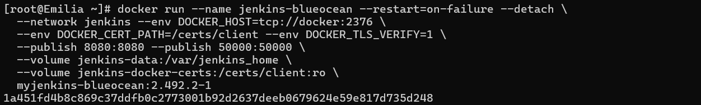

6.  Następnie przeszłam na Jenkins uzywając adresu ip Fedory oraz portu 8080. W wyszukiwarce wpisałam `http://192.168.100.40:8080`.

    Aby uzysać hasło administratora użyłam w terminalu polecenia:

    `docker exec jenkins-blueocean cat /var/jenkins_home/secrets/initialAdminPassword`

    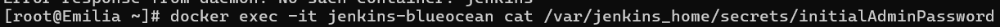

    Po poprawnym zalogowaniu i konfiguracji ukazał się ekran Jenkins:

    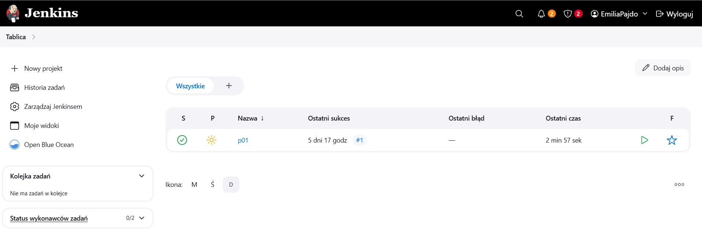

7.  Stworzyłam pierwszy projekt, który wyświetla informacje o systemie operacyjnym i jądrze poprzez polecenie `uname -a`, wyświetla zawartość katalogu poprzez `ls -l`, pokazuje nazwę użytkownika - polecenie `whoami`, podaje aktualną ścieżkę katalogu `pwd`, pobiera obraz systemu `fedora` za pomocą `docker pull`.

    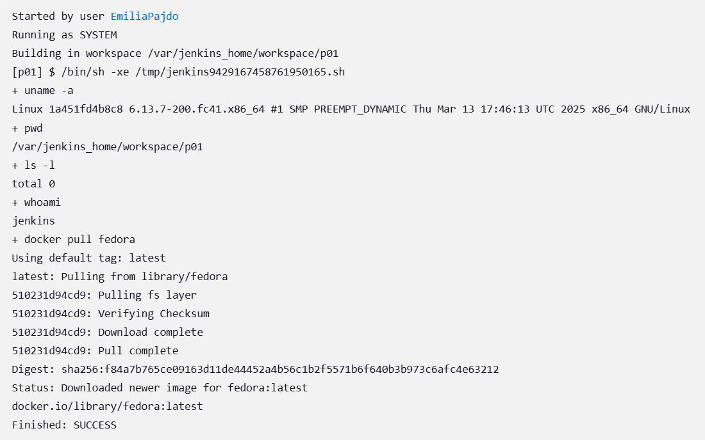

8.  Następnie utworzyłam drugi projekt Jenkins, którego zadaniem było sprawdzanie, czy aktualna godzina systemowa jest parzysta. Jeśli była nieparzysta, projekt kończył się błędem – czyli Jenkins oznaczał go jako FAILED.

    W tym celu wykorzystałam skrypt bashowy, który dodałam w konfiguracji projektu w sekcji "Execute shell":

    ``` bash
    HOUR=$(date +%H)
    if [ $((HOUR % 2)) -ne 0 ]; then
      echo "Godzina $HOUR jest nieparzysta – zwracam błąd"
      exit 1
    else
      echo "Godzina $HOUR jest parzysta – wszystko OK"
    fi
    ```

    Skrypt najpierw pobiera aktualną godzinę z systemu (`date +%H`), następnie wykonuje dzielenie modulo, aby sprawdzić, czy liczba jest parzysta. Jeśli nie – wypisuje komunikat i kończy się kodem 1, co powoduje uznanie wykonania za nieudane.

    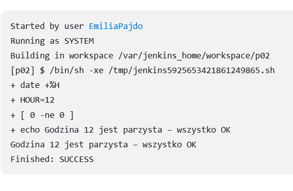

9.  Utworzyłam nowy obiekt typu `pipeline`. Wpisałam treść `pipeline'u` bezpośrednio do obiektu, treść ta wyglądała następująco:

    ``` bash
    pipeline {
    agent any

    environment {
        DOCKERFILE_PATH = 'INO/GCL02/EP414657/Sprawozdanie1/Dockerfile-zlib.build'
        IMAGE_NAME = 'mybuilder:zlib'
    }

    stages {
        stage('Checkout') {
            steps {
                git branch: 'EP414657', url: 'https://github.com/InzynieriaOprogramowaniaAGH/MDO2025_INO.git'
            }
        }

        stage('Build Docker Image') {
            steps {
                script {
                    def buildContext = env.DOCKERFILE_PATH.substring(0, env.DOCKERFILE_PATH.lastIndexOf('/'))
                    sh """
                        echo "Using context: ${buildContext}"
                        docker build -t ${IMAGE_NAME} -f ${DOCKERFILE_PATH} ${buildContext}
                    """
                }
            }
        }

        stage('List Docker Images') {
            steps {
                sh 'docker images | grep mybuilder || echo "No image found"'
            }
        }
    }
    }
    ```

    Pipeline ten definiuje proces budowy obrazu Docker `Dockerfile-zlib.build`. Pipeline działa na dowolnym agencie, czyli może być uruchomiony na jakimkolwiek dostępnym węźle Jenkins. Ustawia dwie zmienne środowiskowe: `DOCKERFILE_PATH` – ścieżka do pliku `Dockerfile-zlib.build` w repozytorium, `IMAGE_NAME` – nazwa tworzonych obrazów Dockera `mybuilder:zlib`. Na etapie `Checkout` pobiera repozytorium przedmiotowe z Githuba, gałąź o moich inicjałach i numerze indeksu `EP414657`, dzięki czemu Jenkins ma dostęp do pliku `Dockerfile`. Na etpaie `Build Docker Image` uruchomiana jest komenda `docker build` z podaną nazwą obrazu i ścieżką do Dockerfile. Na koniec sprawdzane jest czy obraz `mybuilder` został utworzony, jesli tak wyświetlany jest z listy obrazów Dockera, co widoczne jest na wydruku konsoli:

    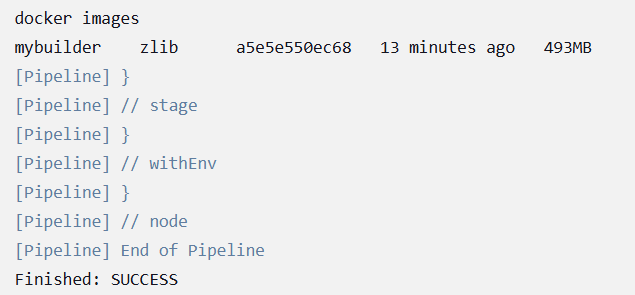

10. Zdefiniowałam pipeline oparty o kontenery, który rozszerza wcześniej stworzony pipeline o build obrazu testowego, który uruchamia testy jednostkowe aplikacji zbudowanej w poprzednim pipeline. Testy uruchamiane są w osobnym kontenerze. Wyniki testów są zapisywane w pliku `test.log`. Na koniec archiwizowane są logi jako artefakt builda.

    ``` bash
    pipeline {
    agent any

    environment {
        DOCKERFILE_PATH = 'INO/GCL02/EP414657/Sprawozdanie1/Dockerfile-zlib.build'
        IMAGE_NAME = 'mybuilder:zlib'

        TEST_DOCKERFILE_PATH = 'INO/GCL02/EP414657/Sprawozdanie1/Dockerfile-zlib.test'
        TEST_IMAGE_NAME = 'mytester:zlib'

        LOG_FILE = 'INO/GCL02/EP414657/Sprawozdanie2/test.log'
    }

    stages {
        stage('Checkout') {
            steps {
                git branch: 'EP414657', url: 'https://github.com/InzynieriaOprogramowaniaAGH/MDO2025_INO.git'
            }
        }

        stage('Build Docker Image') {
            steps {
                script {
                    def buildContext = env.DOCKERFILE_PATH.substring(0, env.DOCKERFILE_PATH.lastIndexOf('/'))
                    sh """
                        echo "Using context: ${buildContext}"
                        docker build -t ${IMAGE_NAME} -f ${DOCKERFILE_PATH} ${buildContext}
                        docker tag ${IMAGE_NAME} zlib-build
                    """
                }
            }
        }

        stage('Build Test and Run Tests') {
            steps {
                script {
                    def testContext = env.TEST_DOCKERFILE_PATH.substring(0, env.TEST_DOCKERFILE_PATH.lastIndexOf('/'))
                    sh """
                        echo "Using test context: ${testContext}"
                        docker build -t ${TEST_IMAGE_NAME} -f ${TEST_DOCKERFILE_PATH} ${testContext}
                        docker run --rm ${TEST_IMAGE_NAME} > ${LOG_FILE} 2>&1 || echo "Tests failed"
                    """
                }
            }
        }

        stage('List Docker Images') {
            steps {
                sh 'docker images | grep mybuilder || echo "No image found"'
            }
        }
        stage('Archive Logs') {
            steps {
                archiveArtifacts artifacts: "${LOG_FILE}", onlyIfSuccessful: false
            }
        }
    }
    }
    ```

    Treść pliku `test.log`:

    ```         
    hello world
    zlib version 1.3.1.1-motley = 0x1311, compile flags = 0xa9
    uncompress(): hello, hello!
    gzread(): hello, hello!
    gzgets() after gzseek:  hello!
    inflate(): hello, hello!
    large_inflate(): OK
    after inflateSync(): hello, hello!
    inflate with dictionary: hello, hello!
        *** zlib test OK ***
    hello world
    zlib version 1.3.1.1-motley = 0x1311, compile flags = 0xa9
    uncompress(): hello, hello!
    gzread(): hello, hello!
    gzgets() after gzseek:  hello!
    inflate(): hello, hello!
    large_inflate(): OK
    after inflateSync(): hello, hello!
    inflate with dictionary: hello, hello!
        *** zlib shared test OK ***
    hello world
    zlib version 1.3.1.1-motley = 0x1311, compile flags = 0xa9
    uncompress(): hello, hello!
    gzread(): hello, hello!
    gzgets() after gzseek:  hello!
    inflate(): hello, hello!
    large_inflate(): OK
    after inflateSync(): hello, hello!
    inflate with dictionary: hello, hello!
        *** zlib 64-bit test OK ***
    ```

    Różnice między podejśćiami: dedykowany DIND a CI-kontener

    DIND:

    -   pipeline w Jenkinsie może wykonywać komendy dockera, które są wykonywane na osobnym serwerze dockera w kontenerze DIND

    -   kontener Jenkins jest odseparowany od hosta, co zapewnia pełną izolację procesu buildów i testów

    -   DIND pozwala na lepszą kontrolę i bezpieczeństwo, ponieważ Docker w kontenerze nie ma dostępu do systemu plików hosta bezpośrednio

    -   wymaga uruchomienia osobnego kontenera Docker Daemon, co może zwiększać złożoność i zużycie zasobów

    CI-kontener:

    -   Jenkins używa Dockera zainstalowanego na hoście, aby bezpośrednio uruchamiać kontenery i budować obrazy

    -   mniej kontenerów do uruchomienia, więc mniej zasobów jest potrzebnych

    -   bezpośrednia komunikacja z Dockerem na hoście pozwala na szybszą budowę obrazów i uruchamianie kontenerów

    Pipeline zrealizowano w oparciu o podejście Docker-in-Docker (DIND). Jenkins został uruchomiony jako kontener (jenkins-blueocean), a osobny kontener (jenkins-docker) działa jako serwer dockera. Takie podejście umożliwia pełną izolację buildów i testów w dedykowanym środowisku kontenerowym.

11. Przeszłam do stworzenia kompletnego pipeline'u. Celem tego etapu było skonfigurowanie pełnego procesu CI/CD. Pipeline został zaprojektowany tak, aby obejmował wszytskie wymagane kroki: budowanie aplikacji w konetenerze Builder, testowanie w kontenerze Tester, wdrażanie aplikacji (Deploy) oraz przygotowanie artefaktu do dystrybucji (Publish). Pipeline został przygotowany jako plik Jenkinsfile. W celu wykorzystania go w Jenkinsie utworzyłam nowy projekt typu Pipeline, w konfiguracji projektu wybrałam opcje `Pipeline script from SCM`. Jako `SCM` ustawiłąm `Git` oraz podałam adres repozytorium na GitHubie oraz ścieżkę do pliku `Jenkinsfile`. Dzięki temu Jenkins automatycznie pobierał aktualną wersję skryptu z repozytorium przy każdym uruchomieniu zadania.

    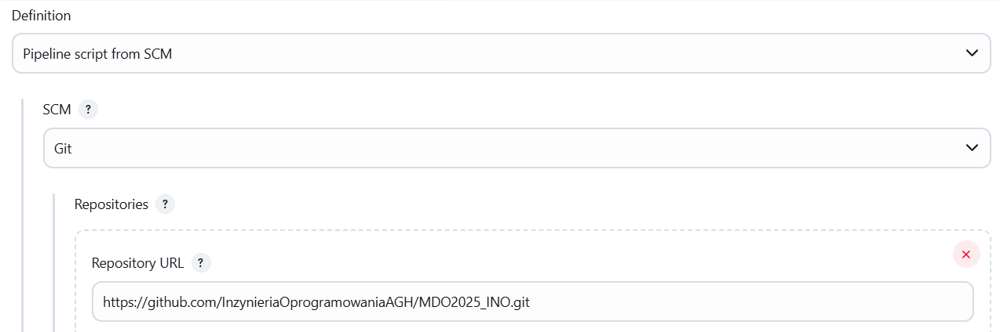
    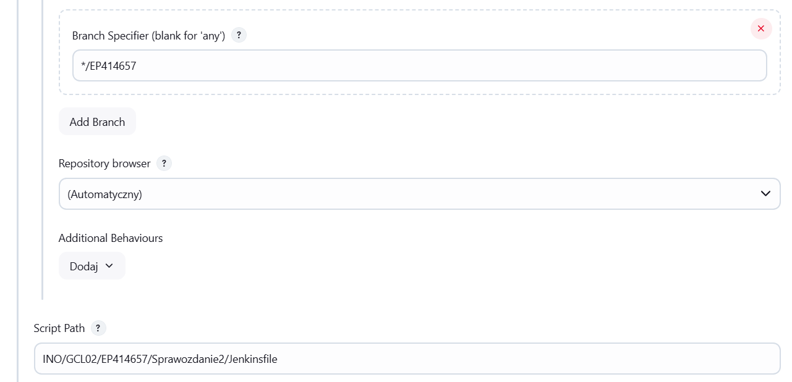

    Środowisko wykorzystane w projekcie:

    -   `Jenkins` oraz `Docker-in-Docker` (DIND) uruchomione zgodnie z instrukcją projektową

    -   `Dockerfile` wdrażające instancję `Jenkinsa` załączone w repozytorium pod ścieżką: `INO/GCL02/EP414657/Sprawozdanie1/`

    -   załączony poniżej Pipeline

    Treść Pipeline'u:

    ```         
    pipeline {
    agent any

    environment {
        DOCKERFILE_PATH = 'INO/GCL02/EP414657/Sprawozdanie1/Dockerfile-zlib.build'
        IMAGE_NAME = 'mybuilder:zlib'

        TEST_DOCKERFILE_PATH = 'INO/GCL02/EP414657/Sprawozdanie1/Dockerfile-zlib.test'
        TEST_IMAGE_NAME = 'mytester:zlib'

        LOG_FILE = 'INO/GCL02/EP414657/Sprawozdanie2/test.log'
        DEPLOY_LOG_FILE = 'INO/GCL02/EP414657/Sprawozdanie2/deploy_output.log'
        OUTPUT_DIR = 'INO/GCL02/EP414657/Sprawozdanie2'
    }

    stages {
        stage('Checkout') {
            steps {
                git branch: 'EP414657', url: 'https://github.com/InzynieriaOprogramowaniaAGH/MDO2025_INO.git'
            }
        }

        stage('Build Docker Image') {
            steps {
                script {
                    def buildContext = env.DOCKERFILE_PATH.substring(0, env.DOCKERFILE_PATH.lastIndexOf('/'))
                    sh """
                        docker build -t ${IMAGE_NAME} -f ${DOCKERFILE_PATH} ${buildContext}
                        docker tag ${IMAGE_NAME} zlib-build
                    """
                }
            }
        }

        stage('Build Test and Run Tests') {
            steps {
                script {
                    def testContext = env.TEST_DOCKERFILE_PATH.substring(0, env.TEST_DOCKERFILE_PATH.lastIndexOf('/'))
                    sh """
                        docker build -t ${TEST_IMAGE_NAME} -f ${TEST_DOCKERFILE_PATH} ${testContext}
                        docker run --rm ${TEST_IMAGE_NAME} > ${LOG_FILE} 2>&1 || echo "Tests failed"
                    """
                }
            }
        }

        stage('Deploy') {
            steps {
                script {
                    sh """
                        docker run --rm zlib-build sh -c "
                            rm -rf /app/*.o /app/*.lo /app/*.a /app/*.so /app/test /app/Makefile /app/configure /app/README /app/ChangeLog /app/faq /app/doc /app/examples /app/*.c /app/*.h /app/CMakeLists.txt /app/Makefile.in /app/*.pdf /app/*.in
                            rm -rf /app/build /app/trees /app/zlibConfig.cmake.in /app/*.sh
                        "
                    """

                    sh """
                        docker run --rm zlib-build ./example64 > ${DEPLOY_LOG_FILE} 2>&1 || echo "example64 failed"
                    """
                }
            }
        }

        stage('Publish') {
    steps {
        script {
            def version = '1.0.0'
            def taggedImage = "${IMAGE_NAME}-${version}"

            sh "docker tag ${IMAGE_NAME} ${taggedImage}"

            sh """
                mkdir -p ${OUTPUT_DIR}
                docker save ${taggedImage} -o ${OUTPUT_DIR}/zlib-runtime-${version}.tar
            """

            archiveArtifacts artifacts: "${OUTPUT_DIR}/zlib-runtime-${version}.tar", onlyIfSuccessful: true
        }
    }
    }

        stage('Archive Logs') {
            steps {
                archiveArtifacts artifacts: "${LOG_FILE}", onlyIfSuccessful: false
                archiveArtifacts artifacts: "${DEPLOY_LOG_FILE}", onlyIfSuccessful: false
            }
        }
    }
    }
    ```

    Etapy Pipeline'u:

    Pierwsze trzy etapy:

    1.  Checkout

    2.  Build Docker Image

    3.  Build Test and Run Tests

    oraz etap ostatni:

    6.  Archive Logs

    są to etapy opisane powyżej w krokach 9 i 10.

    Dalsze kroki:

    4.  Deploy

    W kroku Deploy pipeline wykonuje uruchomienie aplikacji w kontenerze bazującym na obrazie buildowym `zlib-build`, który został wcześniej utworzony na podstawie pliku `Dockerfile-zlib.build`.

    W pierwszej kolejności z obrazu `zlib-build` usuwane są zbędne pliki, takie jak pliki źródłowe, Makefile, skrypty, dokumenacje, pliki konfiguarcyjne i katalogi pomocnicze. Dzięki temu kontener zostaje "posprzątany" i nie zawiera już plików potrzebnych jedynie do kompilacji czy budowania.

    Następnie uruchomiana jest aplikacja - example64 w kontenerze `zlib-build`. Wynik działania aplikacji jest zapisywane do pliku logu `deploy_output.log`, którego treść wygląda następująco:

    ```         
    zlib version 1.3.1.1-motley = 0x1311, compile flags = 0xa9
    uncompress(): hello, hello!
    gzread(): hello, hello!
    gzgets() after gzseek:  hello!
    inflate(): hello, hello!
    large_inflate(): OK
    after inflateSync(): hello, hello!
    inflate with dictionary: hello, hello!
    ```

    Plik z logami jest archiwizowany jako artekat w kroku `Archive Logs`.

    W moim projekcie kontener buildowy i docelowy są takie same, dlatego konieczne było jego czyszczenie.

    W tym przypadku wdrożenie polega na:

    -   Usunięciu niepotrzebnych plików budowania z obrazu

    -   Zostawieniu binarnych plików wykonywalnych (runtime)

    -   Uruchomieniu aplikacji w kontenerze Docker bez dodatkowych plików źródłowych

    Zastosowałam takie kroki ponieważ:

    -   Kontener produkcyjny powinien być jak najlżejszy

    -   Usunięcie zbędnych plików zmniejsza obraz

    -   Kontener będzie wykorzystywany tylko do działania aplikacji, nie do jej ponownego budowania

    5.  Publish

    W kroku Publish pipeline tworzy wersjonowany artefakt.

    Tworzony jest tagowany obraz Docker: Obraz mybuilder:zlib zostaje oznaczony jako mybuilder:zlib-1.0.0.

    Generowany jest plik tar z tym obrazem: Przy użyciu polecenia docker save zapisuje obraz do pliku zlib-runtime-1.0.0.tar. Plik ten zawiera cały runtime potrzebny do późniejszego uruchomienia aplikacji w innym środowisku.

    Następuje archiwizacja artefaktu: Plik .tar jest dołączany jako artefakt w Jenkinsie, dzięki czemu można go pobrać bezpośrednio z wyników buildu.

    Wyniki uruchomienia Pipeline'u:

    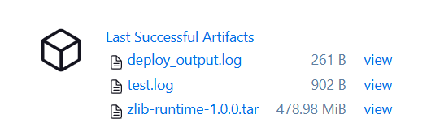
    
    Diagram aktywności, na którym bazowałam w projekcie:
    
    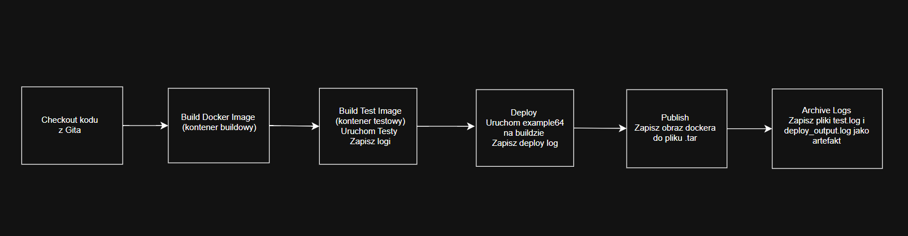
    
    Diagram wdrożeniowy:
    
    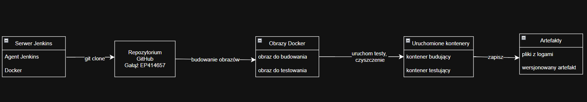
