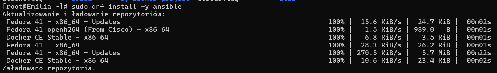

# Sprawozdanie 3

Emilia Pajdo

Inżynieria Obliczeniowa

------------------------------------------------------------------------

## Zajęcia 1

1.  Celem ćwiczenia było przygotowanie środowiska do pracy z Ansible – narzędziem do automatyzacji konfiguracji i zarządzania infrastrukturą. W ramach zadania należało:

    -   Utworzyć maszynę docelową,

    -   Skonfigurować komunikację SSH między maszynami,

    -   Zainstalować Ansible na maszynie głównej,

    -   Wykonać zdalne zadania przy pomocy playbooków,

    -   Przeprowadzić zarządzanie artefaktami z poprzednich etapów CI/CD.

2.  Wykonywanie zadań rozpoczęłam od utworzenia drugiej maszyny wirtualnej, o tym samym systemie operacyjnym co główna maszyna, na której pracuję, czyli `fedora server`.

    Zapewniłam obecność programu `tar` i serwera `OpenSSH`, nadałam maszynie hostname `ansible-target` i utworzyłam użytkownika `ansible`.
    
3.  Na głównej maszynie wirtualnej, zainstalowałam oprogramowanie Ansible.
    
    
    
    Wygenerowałam klucz SSH dla użytkownika z maszyny głównej i przesłałam go na maszynę docelową:
    
    [klucz ssh](screenshots/2.png)
    
    Test połączenia bez hasła:
    
    [polaczenie bez hasla](screenshots/3.png)
    
4.  Ustawiłam przewidywalne nazwy maszyn (hostname) na każdej maszynie oraz sprawdziłam skuteczność działania:
    
    [hostname-1](screenshots/4.png)
    [hostname-2](screenshots/5.png)
    [hostname-3](screenshots/6.png)
    [hostname-4](screenshots/7.png)
    
5. Dodałam wpisy DNS do `/etc/hosts` na maszynie głównej `orchestrator`:
  
    [DNS](screenshots/8.png)
    
6. Zweryfikowałam łączność po nazwie poprzez wykonane polecenia `ping` oraz `ssh` na maszynie głównej:

    [ping](screenshots/9.png)
    [ssh](screenshots/10.png)

7. Stworzyłam plik inwentaryzacji Ansible `inventory.ini`:
    
    [inventory.ini](screenshots/11.png)
    
8.  Sprawdziłam `ping` poprzez Ansible:
    
    [ping przez Ansible](screenshots/12.png)
    
    Operacja zakończyła się sukcesem.
    
9. Utworzyłam `playbooka` Ansible, za pomocą którego wysłałam żądanie ping do maszyny `endpoint1`:
  
    [ping przez playbook](screenshots/13.png)
    
    Uruchomiłam playbooka i otrzymałam pożądany wynik:
    
    [ping przez playbook](screenshots/14.png)
    
10. Edytowałam playbooka w taki sposób, aby dodać do niego: kopiowanie pliku `inventory.ini` na maszynę `endpoint1`, uaktualnianie pakietów systemowych, restartowanie `sshd` i `rngd`:

    [aktualizacja playbooka](screenshots/15.png)
    [aktualizacja playbooka](screenshots/16.png)
    
    Uruchomiłam playbooka, zadziałał on poprawnie:
    
    [uruchomienie playbooka](screenshots/17.png)
    
11. Wykonałam test z niedostępną maszyną, poprzez zatrzymanie `ssh` na maszynie `endpoint1`:

    [zatrzymanie ssh](screenshots/18.png)
    
    Rezultat ponownego uruchomienia playbooka na głównej maszynie:
    
    [niewykonany playbook](screenshots/19.png)
    
    Maszyna oznaczona jest jako `UNREACHABLE`. 
    
12. Następnie przeszłam do zarządzania stworzonym podczas pracy z `pipelinem` artefaktu. 

    Zaczęłam od utworzenia szkieletu roli Ansible:
    
    [szkielet roli](screenshots/20.png)
    
13. Wypełniłam plik `main.yml`, tak aby: instalował Dockera, kopiował obraz Dockera, ładował obraz Dockera z pliku tar, uruchamiał kontener na podstawie obrazu, następnie zatrzymywał i usuwał kontener:
    
    [main.yml](screenshots/21.png)
    [main.yml](screenshots/22.png)
    
    Użyłam roli w playbooku głównym `deploy.yml`:
    
    [deploy.yml](screenshots/23.png)
    
    W pliku `inventory` wpisałam:
    
    [inventory](screenshots/24.png)
    
    Ustawienie `ansible_connection=local` oznaczało, że Ansible nie będzie próbował łączyć się przez SSH, tylko będzie działał lokalnie na maszynie.
    
    Stworzyłam plik `requirements.yml`, który służył do definiowania zewnętrznych kolekcji Ansible, które należy zainstalować przed uruchomieniem playbooka.
    
    [requirements](screenshots/25.png)
    
    Następnie uruchomiłam pliki i otrzymałam wynik:
    
    [requirements](screenshots/26.png)
    
## Zajęcia 2

1. Celem zajęć było przygotowanie źródła instalacyjnego systemu Fedora w trybie nienadzorowanym, a następnie jego wykorzystanie do automatycznej instalacji systemu operacyjnego, który od razu po uruchomieniu będzie gotowy do działania jako host dla przygotowanego wcześniej oprogramowania z pipeline’u CI/CD.

2. W pierwszym kroku pobrałam obraz ISO Fedory Server.
    
    Utworzyłam nową maszynę wirtualną w VirtualBox z pustym dyskiem twardym. 
    
    Edytowałam plik `anaconda-ks.cfg` i dodałam do niego wzmianki na temat potrzebnych repozytoriów, dodałam opcję `clearpart --all`, która zapewniała, że plik odpowiedzi zawsze będzie formatować całość dysku, a także ustawiłam hostname na `fedora-netinst`.
    
    Następnie skopiowałam ten plik do swojego repozytorium przedmiotowego.
    
    [anaconda-ks](screenshots/27.png)
    
3. Przygotowałam link do surowej wersji pliku z Githuba. Podczas uruchomienia Fedory z ISO dodałam ścieżkę do pliku.

    [instalacja](screenshots/28.png)
    
    Fedora automatycznie zainstalowała się według pliku.

4. W dalszej części zadania należało rozszerzyć plik odpowiedzi o repozytoria i oprogramowanie potrzebne do uruchomienia programu, zbudowanego w ramach projketu pipeline'u. 

5. Rozpoczęłam od hostowania serwera z aplikacją zbudowaną jako artefakt. 

    W tym celu skopiowałam plik z aplikacją na maszynę i uruchomiłam lokalny serwer HTTP:
    
    [aplikacja w serwerze](screenshots/29.png)
    
    Po wpisaniu adresu w przeglądarce następuje automatyczne pobieranie, co potwierdza, że aplikacja jest dostępna na serwerze:
    
    [pobieranie](screenshots/30.png)
    
6. Przeszłam do aktualizacji pliku Kickstart, aby możliwe było pobranie obrazu aplikacji z serwera, załadowanie go do Dockera i automatyczne uruchamianie kontenera po każdym uruchomieniu systemu.

    [anaconda2](screenshots/31.png)
    [anaconda2](screenshots/32.png)
    
    Dzięki `wget` możliwe jest pobieranie pliku z serwera, `docker load` ładuje obraz do Dockera, `docker run` uruchamia kontener.
    
    `docker rm` usuwa (jeśli istnieje) działający kontener, aby uniknąć konfliktu. 
    
7. Ponownie uruchomiłam instalację Fedory podając surowy link do pliku. 
    
    [anaconda2](screenshots/33.png)
    
8. Po przeprowadzeniu instalacji sprawdziłam wersję zainstalowanego dockera (`docker --version`), sprawdziłam czy skrypt `start_zlib.sh` jest na miejscu i ma uprawnienia do wykonania, upewniłam się, że kontener działa (`docker ps`) oraz, że polecenie `systemctl status zlib-app.service` zwraca `Active`, a tym samym czy status usługi systemd, która uruchamia skrypt jest aktywny. Sprawdziłam, czy załadował się obraz Dockera poprzez `docker images`.

    [sprawdzanie dzialania](screenshots/34.png)
    
    Upewniłam się, że usługa `zlib-app.service` jest włączona do automatycznego startu:
    
    [anaconda2](screenshots/35.png)
    
    Na koniec sprawdziłam logi programu:
    
    [logi](screenshots/36.png)

## Zajęcia 3

1. Celem ćwiczeń było:

    - Zapoznanie się z Kubernetesem poprzez jego lokalną implementację (Minikube),

    - Uruchomienie klastra Kubernetes oraz wdrożenie aplikacji jako kontenera,

    - Wystawienie aplikacji przez Dashboard i port forwarding,

    - Stworzenie pliku YML do zautomatyzowanego wdrażania,

    - Skalowanie deploymentu oraz wystawienie go jako serwis.

2. Wykonywanie zadań rozpoczęłam od instalacji `Minikube` i narzędzi:
    
    [instalacja narzedzi](screenshots/37.png)
    [instalacja kubectl](screenshots/38.png)
    [instalacja minikube](screenshots/39.png)

3. Następnie uruchomiłam klaster Kubernetes:
    
    [uruchomienie minikube](screenshots/40.png)
    
    Minikube działa lokalnie, więc:

    - Komunikacja jest ograniczona do localhost
    - Dashboard jest dostępny przez tunel z port-forwardem
    - Dostęp do kube-apiserver nie wychodzi poza hosta
    
4. Według dokumentacji Minikube, minimalne wymagania to:

    - CPU: 2 rdzenie
    - RAM: 2 GB
    - Dysk: ~20GB
    - Wirtualizacja: Włączona w BIOS
    
    Problemy wynikające z wymagań sprzętowych i jak je rozwiązać:
    
    - Brak wirtualizacji -	Użycie drivera docker
    - Zbyt mało RAM	- minikube start --memory=2048 (lub więcej)
    - Docker nie działa	- sudo systemctl start docker
    
5. Sprawdziłam dostępne węzły:
    
    [nodes](screenshots/41.png)

6. Uruchomiłam przykładowy pod (kontener) - był to `nginx`, następnie sprawdziałam uruchomione pody:
    
    [uruchomienie nginx](screenshots/42.png)
    
7. Wystawiłam usługę (service), aby móc dostać się do nginx:
    
    [usluga](screenshots/43.png)
    
8. Sprawdziłam adres i port, na którym nginx jest dostępny:
    
    [port](screenshots/44.png)
    
    Zrobiłam tunel `ssh`, aby uzyskać dostęp z lokalnej maszyny do serwisku na zdalnym serwerze:
    
    [tunel](screenshots/45.png)
    
    Po wpisaniu adresu w przeglądarce, pojawiła się strona startowa nginx:
    
    [nginx](screenshots/46.png)
    
9. Wyświetliłam działające zasoby w klastrze:

    [zasoby](screenshots/47.png)

10. Ponownie użyłam tunelowania, w celu uruchomienia dashboardu Kubernetes:

     [tunelowanie](screenshots/48.png)
     [dashboard](screenshots/49.png)
     
11. Następnie stworzyłam plik konfiguracyjny dla nginx jako deployment:

    [plik deployment](screenshots/50.png)
    
12. Utworzyłam Service - aby móc wejść przez przeglądarkę:

    [plik service](screenshots/51.png)
     
13. Uruchomiłam deployment i service:

     [uruchomienie](screenshots/52.png)
    
14. Ponownie sprawdziłam status zasobów:

    [zasoby-2](screenshots/53.png)
    
    Pokazało to, że działają one według zamierzeń.
    
15. Weszłam do aplikacji przez przeglądarkę:

    [url](screenshots/54.png)
    [nginx](screenshots/55.png)

16. Sprawdziłam logi nginx:

    [logi](screenshots/56.png)
    
17. Uruchomiłam kontener w Minikube jako pod:

    [kontener jako pod](screenshots/57.png)
    [kontener jako pod](screenshots/58.png)
    
18. Sprawdziłam czy pod działa, co zostało potwierdzone poprzez wydruk:
    
    [dzialajacy pod](screenshots/59.png)

19. Wyprowadziłam port z kontenera - port-forward:

    [port-forward](screenshots/60.png)
    
20. Sprawdziłam działanie port-forward poprzez wpisanie w przeglądarce adresu ` http://localhost:8888` po czym ukazał się nginx:

    [nginx](screenshots/61.png)
    
21. W kolejnym kroku edytowałam plik `nginx-deployment.yml`, zmieniając liczbę replik na 4:

    [nginx-deployment.yml](screenshots/62.png)

22. Zastosowałam demployment:

    [zastosowanie](screenshots/63.png)
    
23. Sprawdziłam status rollout:

    [rollout](screenshots/64.png)
    
24. Wyświetliłam listę podów, aby zobaczyć czy działają nowe 4, co zostało potwierdzone:
    
    [pody 4](screenshots/65.png)
    
## Zajęcia 4

1. Celem ćwiczenia było przygotowanie i opublikowanie trzech wersji kontenera nginx:

    - dwóch poprawnych, z różnymi modyfikacjami,

    - jednej wadliwej, która celowo kończy się błędem przy uruchomieniu.

2. Przygotowałam pierwszą wersję nginx - poprawną.
    
    Plik index.html:
    
    [index1](screenshots/66.png)
    
    Plik Dockerfile dla tej wersji:
    
    [dockerfile1](screenshots/67.png)
    
    Zbudowałam obraz:
    
    [budowanie](screenshots/68.png)
    
3. Analogiczne kroki wykonałam przy przygotowywalniu drugiej poprawnej wersji nginx:

    Plik index.html:
    
    [index2](screenshots/69.png)
    
    Plik Dockerfile dla tej wersji:
    
    [dockerfile2](screenshots/70.png)
    
    Budowanie obrazu:
    
    [budowanie](screenshots/71.png)
    
4. Jako trzecią wersję przygotowałam wersję wadliwą - wersję która miała poprawnie się budować, ale być odrzucana przez klaster Kubernetes.

    Dockerfile dla tej wersji:
    
    [dockerfile3](screenshots/72.png)
    
    Budowanie obrazu wadliwego:
    
    [budowanie](screenshots/73.png)
    
5. W następnym kroku edytowałam plik `nginx-deployment.yaml` w taki sposób, aby zmieniać liczbę replik oraz wersję obrazu nginx.

    W kolejnych wersjch plik zmieniałam kolejno:
    
    - zwiększyłam liczbę replik do 8
    - zmniejszyłam liczbę replik do 1
    - zmniejszyłam liczbę replik do 0
    - zwiększyłam liczbę replik do 4
    - zastosowałam nową wersję obrazu
    - zastosowałam starszą wersję obrazu
    - zastosowałam wadliwy obraz
    
    Przykładowy plik z 8 replikami i nową wersją obrazu: 
    
    [plik](screenshots/74.png)
    
    Dla każdej z wersji przeprowadzałam wdrożenie i sprawdzałam jego wynik w dashboardzie.
    
    Wyniki dla kolejnych wdrożeń:
    
    [8](screenshots/75.png)
    [8](screenshots/75-1.png)
    [8](screenshots/75-2.png)
    [1](screenshots/76.png)
    [0](screenshots/77.png)
    [4](screenshots/78.png)
    [old](screenshots/79.png)
    [broken](screenshots/80.png)
    [plik](screenshots/81.png)
    
6. Po wykonaniu tych kroków sprawdziłam historię rolloutów:

    [historia](screenshots/82.png)
    
    Cofnęłam się do poprzedniej wersji wdrożenia:
    
    [rollout undo](screenshots/83.png)
    
    Sprawdziłam status:
    
    [rollout status](screenshots/84.png)
    
    W dashboard:
    
    [wynik](screenshots/85.png)
    
7. Nastpnie napisałam skrypt weryfikujący, czy wdrożenie zdążyło się wdrożyć przez 60 sekund.

    Treść skryptu:
    
    [skrypt](screenshots/86.png)
    
    Następnie przetestowałam czas wdrożenia przy 8 replikach:
    
    [weryfikacja](screenshots/87.png)
    
8. Przygotowałam 3 wersje wdrożeń, stosując strategie:

    - Recreate
    - Rolling Update 
    - Canary Deployment 
    
    Strategia Recreate:
    
    [recreate](screenshots/88.png)
    
    Recreate najpierw usuwa stare pody, potem tworzy nowe.
    
    Po zastosowaniu wdrożenia:
    
    [recreate](screenshots/89.png)
    
    Strategia Rolling Update:
    
    [rolling update](screenshots/90.png)
    
    Przy tej strategii: 
    
    - nie ma przerwy w działaniu
    
    - poprzez ustawienie parametrów `maxUnavailable` oraz `maxSurge` maksymalnie 2 stare pody mogą być naraz niedostępne, a 2 nowe się tworzą.
    
    Zastosowanie wdrożenia:
    
    [rolling update](screenshots/91.png)
    
    Canary Deployment (przez drugi Deployment):
    
    [canary deployment](screenshots/92.png)
    
    Drugi deployment ze stabilną wersją:
    
    [deployment stable](screenshots/93.png)
    
    Service, który łączy się z obydwoma wersjami:
    
    [service](screenshots/94.png)
    
    Po wdrożeniu:
    
    [canary i stable](screenshots/95.png)
    
    Sprawdziałam stan wdrożenia przy użyciu etykiet:
    
    [canary stan](screenshots/96.png)
    
    Serwis dla wielu replik:
    
    [serwis dla replik](screenshots/97.png)