# Sprawozdanie z laboratoriów: Pipeline, Jenkins, izolacja etapów
- Przedmiot: DevOps
- Kierunek: Inżynieria Obliczeniowa
- Autor: Filip Rak
- Data: 06/04/2025

## Przebieg Ćwiczeń
### Przygotowanie
- Utworzono instancje jenkinsa zgodnie z [instrukcją instalacyjną](https://www.jenkins.io/doc/book/installing/docker/).
  - Utworzono nową sieć dockera **Jenkins**: `docker network create jenkins`.
  - Utworzono kontener *docker-in-docker (dind)*, który pozwala na wywołanie poleeceń Dockera wewnątrz Jenkinsa: `docker run --name jenkins-docker --rm --detach \
  --privileged --network jenkins --network-alias docker \
  --env DOCKER_TLS_CERTDIR=/certs \
  --volume jenkins-docker-certs:/certs/client \
  --volume jenkins-data:/var/jenkins_home \
  --publish 2376:2376 \
  docker:dind --storage-driver overlay2`. Połączono go z siecią **Jenkins** oraz ustawiono alias **docker** w sieci.
  - Utworzono plik `Dockerfile.myjenkins-blueocean`, który tworzy niestandardowy obraz **Jenkins** oparty na wersji `jenkins/jenkins:2.492.2-jdk17`, który dodaje obsługę `Docker CLI` oraz instaluje pluginy **blueocean** i **docker-workflow**, umożliwiając uruchamianie zadań Jenkinsowych z wykorzystaniem Dockera w interfejsie **Blue Ocean**.
    ```
    ### Dockerfile.myjenkins-blueocean ###
    FROM jenkins/jenkins:2.492.2-jdk17
    USER root
    RUN apt-get update && apt-get install -y lsb-release ca-certificates curl && \
    install -m 0755 -d /etc/apt/keyrings && \
    curl -fsSL https://download.docker.com/linux/debian/gpg -o /etc/apt/keyrings/docker.asc && \
    chmod a+r /etc/apt/keyrings/docker.asc && \
    echo "deb [arch=$(dpkg --print-architecture) signed-by=/etc/apt/keyrings/docker.asc] \
    https://download.docker.com/linux/debian $(. /etc/os-release && echo \"$VERSION_CODENAME\") stable" \
    | tee /etc/apt/sources.list.d/docker.list > /dev/null && \
    apt-get update && apt-get install -y docker-ce-cli && \
    apt-get clean && rm -rf /var/lib/apt/lists/*
    USER jenkins
    RUN jenkins-plugin-cli --plugins "blueocean docker-workflow"
    ```
    Obraz utworzono poleceniem: `docker build -t myjenkins-blueocean:2.492.3-1 .`
    - *Zrzut erkanu z tworzenia kontenera `dind` i obrazu `myjenkins-blueocean:2.492.3-1`*:
    
      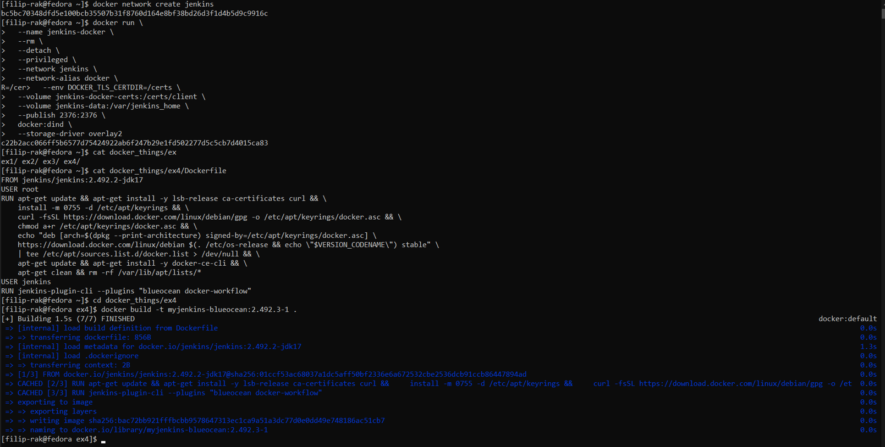
  - Uruchomiono kontener **jenkins-bluocean** poleceniem: `docker run --name jenkins-blueocean --restart=on-failure --detach \
    --network jenkins --env DOCKER_HOST=tcp://docker:2376 \
    --env DOCKER_CERT_PATH=/certs/client --env DOCKER_TLS_VERIFY=1 \
    --publish 8080:8080 --publish 50000:50000 \
    --volume jenkins-data:/var/jenkins_home \
    --volume jenkins-docker-certs:/certs/client:ro \
    myjenkins-blueocean:2.492.3-1` podłączając go do sieci i odpowiednich woluminów.
    - *Zrzut erkanu uruchomienia kontnera `jenkins-bluocean`*:
    
      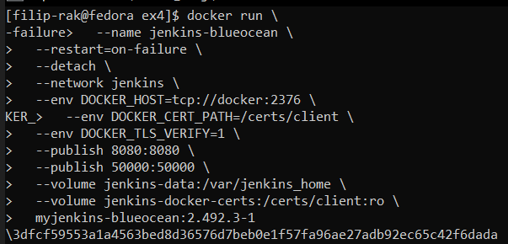
- Na hoście maszyny wirtualnej, przez przeglądarkę,  odwiedzono interfejs **Jenkinsa** pod adresem maszyny: `192.168.1.102:8080`
    - *Zrzut ekranu strony logowania*:
 
      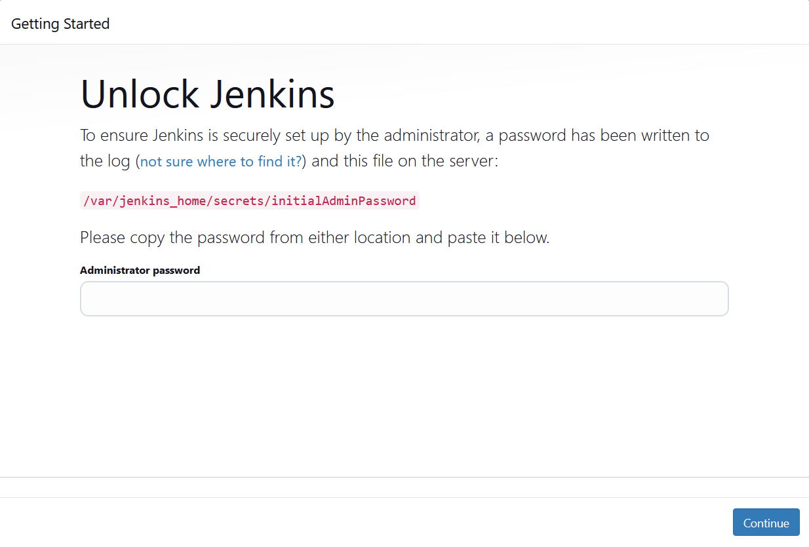
  - Hasło uzyskano z logów dockera poleceniem `docker logs jenkins-blueocean`
    - *Zrzut ekranu uzyskanego hasła jednorazowego*:
 
      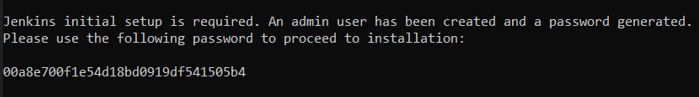

  - Utworzono konto w interfejsie **Jenkinsa** i wybrano rekomendowaną paczkę pluginów.
    - *Zrzut erkanu z instalacji pluginów:*

      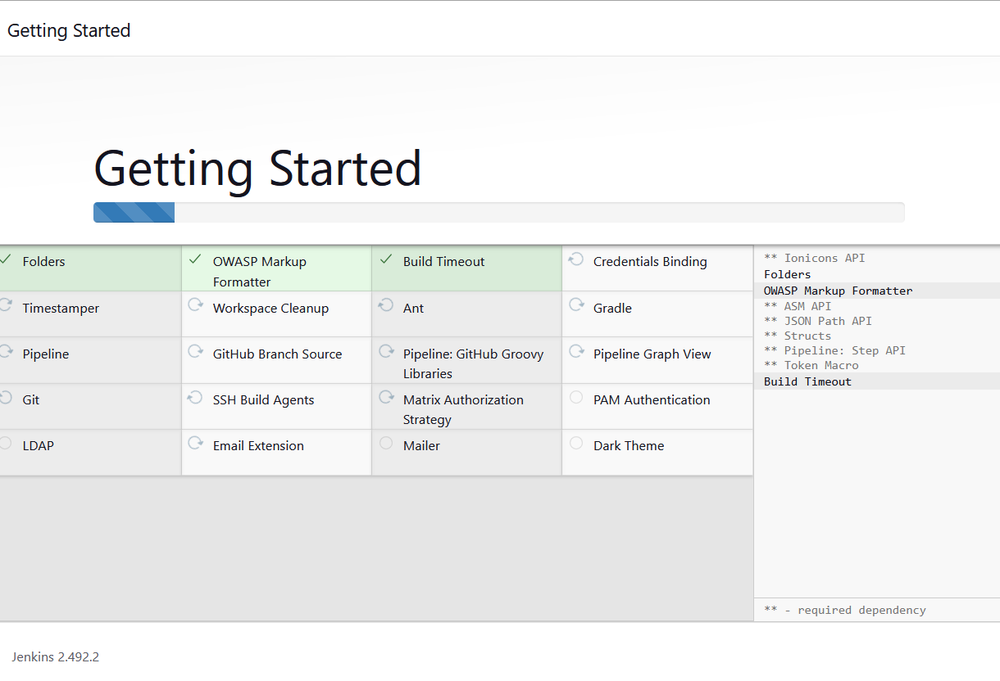
### Zadanie wstępne: uruchomienie
- Wykonanno kilka projektów testowych:
  - Utworzono projekt, który wyświetla `uname` w konsoli.
    - *Zrzut ekranu konsoli projektu*:

      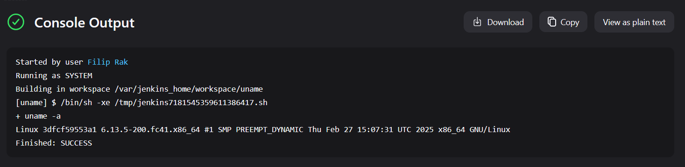
  - Utworzono projekt, który wypisuje w konsoli czy godzina jest parzysta czy nie.
      ```
      #!/bin/bash
      HOUR=$(date +%H)
      if [ $((10#$HOUR % 2)) -ne 0 ]; then
      echo "Hour is odd: $HOUR"
        exit 1
      else
        echo "Hour is even: $HOUR"
      fi
      ```
    - *Zrzut ekranu konsoli projektu z godziną*:

      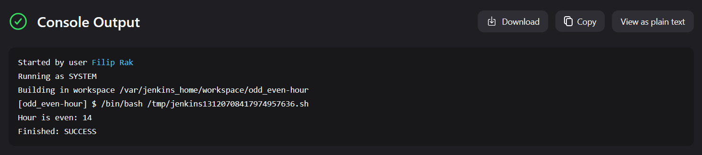
  - Utworzono projekt, który ściąga obraz ubuntu dockera, poleceniem `docker pull ubuntu`.
    - *Zrzut ekranu konsoli projektu:*

      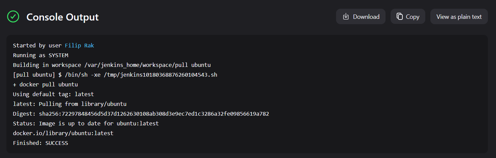
### Zadanie wstępne: obiekt typu pipeline
  - Utworzono **pileline**, którego zadaniem jest pobranie repozytorium przedmiotu `MD02025_INO` i budowa obrazu dockera, zawartego w dockerfile na własnej gałęzi: `FR417273`.
    ```
      pipeline {
        agent any
    
        stages {
            stage('Clone repo') {
                steps {
                    git branch: 'FR417273', url: 'https://github.com/InzynieriaOprogramowaniaAGH/MDO2025_INO.git'
                }
            }
    
            stage('Build Docker image') {
                steps {
                    dir ("INO/GCL02/FR417273/Sprawozdanie1/coursework/lab3")
                    {
                        script {
                            sh 'ls -la'
                            docker.build('build', '-f Dockerfile.build .')
                        }   
                    }
                }
            }
    
            stage('Print info') {
                steps {
                    echo 'Pipeline ran successfully. Docker image was built.'
                }
            }
        }
    }
    ```
    - *Zrzut ekranu potwierdzający powodzenie*:

      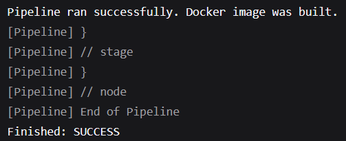
    - [Pełna treść wydruku z konsoli](coursework/MD02025_INO_console.txt)
    - Pipeline z powodzeniem udało się uruchomić ponownie
### Pipeline korzystający z kontenerów celem realizacji kroków build -> test
- Zmodyfikowano wcześniej utworzony **Pipeline**, tak aby budował rownież kontener testowy. Kontener testowy zostaje uruchomiony a logi będące wynikami jego działania zostają zapisane w postaci artefaktu.
  ```
  pipeline {
      agent any
  
      stages {
          stage('Clone repo') {
              steps {
                  git branch: 'FR417273', url: 'https://github.com/InzynieriaOprogramowaniaAGH/MDO2025_INO.git'
              }
          }
  
          stage('Build') {
              steps {
                  dir ("INO/GCL02/FR417273/Sprawozdanie1/coursework/lab3")
                  {
                      script {
                          docker.build('cj-build', '-f Dockerfile.build .')
                      }   
                  }
              }
          }
          
          stage('Test') {
              steps {
                  dir("INO/GCL02/FR417273/Sprawozdanie1/coursework/lab3") {
                      script {
                          def testImage = docker.build('cj-test', '-f Dockerfile.test .')
          
                          // Run temporary container
                          def containerId = sh(script: "docker create cj-test", returnStdout: true).trim()
                          
                          // Ensure logs dir exists
                          sh "mkdir -p logs"
          
                          // Copy logs from container to workspace
                          sh "docker cp ${containerId}:/app/cJSON/logs/test_results.log logs/test_results.log"
          
                          // Clean
                          sh "docker rm ${containerId}"
                      }
                  }
              }
          }
  
          post {
          always {
              archiveArtifacts artifacts: 'INO/GCL02/FR417273/Sprawozdanie1/coursework/lab3/logs/test_results.log', allowEmptyArchive: true
          }
      }
  }
  ```
  - *Zrzut ekranu potwierdzający utworzenie artefaktu*:

    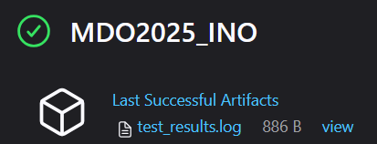
 - Porównanie podejść DIND - Kontener CI:
    - **Podejście 1: DIND (Docker-in-Docker)**:
      - Jenkins korzysta z osobnego kontenera *docker:dind*, który działa jako demon Dockera.
      - Pipeline może wykonywać `docker build`, `docker run`, `docker cp`, `docker push`, itd.
      - Umożliwia dynamiczne budowanie i uruchamianie obrazów w czasie działania pipeline’a.
      - Jest bardziej elastyczne, ale wymaga dodatkowej konfiguracji.
    - **Podejście 2: Kontener CI**:
      - Każdy etap pipeline’a działa w osobnym, gotowym kontenerze z wybranym obrazem.
      - Jenkins nie ma dostępu do docker build ani do Dockera jako takiego.
      - Prostsze w konfiguracji, ale ograniczone — nie da się dynamicznie budować nowych obrazów.
      - W projekcie zastosowano podejście DIND, ponieważ:

  - W projekcie zastosowano podejście DIND, ponieważ:
    - Obrazy są budowane dynamicznie z `Dockerfile.build` i `Dockerfile.test`
    - Pipeline kopiuje logi testów z wnętrza kontenera (`docker cp`)
    - Wymagane są możliwości Dockera, których `agent { docker }` nie zapewnia.
   
### Kompletny Pipeline CI/CD
- Utworzono kompletny pipeline realizujący cykl **CI/CD** dla bibliotecji `cJSON`.
- Pipeline dzieli się na pięć etapów:
  - **Clone**:
    - Klonowanie repozytorium przedmiotowego, w tym pliki: `Dockerfile.build`, `Dockerfile.test`, `Dockerfile.deploy` i `deploy.c`.
  - **Build**:
    - Budowa obrazu `Dockerfile.build`, zajmującego się klonowaniem repozytorium `cJSON`, kompilacją i utworzeniem pakietu instalacyjnego `.rpm`.
    - Utworzenie katalogu do przechowywania artefaktów.
    - Uruchomienie zbudowanego kontenera.
    - Skopiowanie utworzonego pakietu instalacyjnego `.rpm` i usunięcie instancji kontenera.
  - **Test**:
    - Budowa obrazu `Dockerfile.test`, zajmującego się uruchomieniem testów.
    - Utworzenie katalogu wynikowego dla logów.
    - Uruchomiienie instancji kontenera.
    - Kopia logów, usunięcie instancji kontenera.
  - **Deploy**:
    - Budowa obrazu `Dockerfile.deploy`, który instaluje `gcc` do weryfikacji działania pakietu instalacyjnego `.rpm`.
    - Uruchomienie instancji kontenera.
    - Skopiowanie pakietu instalacyjnego `.rpm` oraz źródłowego pliku testowego `deploy.c` do kontenera i instalacja pakietu.
    - Kompilacja kodu testowego i usunięcie kontenera.
  - **Print**
    - Wydrukwowanie komunikatu potwierdzającego powodzenie pipeline'u.

  - Pełna treść skryptu:
    ```
    pipeline {
        agent any
    
        environment {
            WORKDIR = "INO/GCL02/FR417273/Sprawozdanie2/coursework/pipeline"
        }
    
        stages {
            stage('Clone') {
                steps {
                    git branch: 'FR417273', url: 'https://github.com/InzynieriaOprogramowaniaAGH/MDO2025_INO.git'
                }
            }
    
            stage('Build') {
                steps {
                    dir("${WORKDIR}") {
                        script {
                            // Build building image
                            def buildImage = docker.build('cj-build', '-f Dockerfile.build .')
                            
                            // Create dir for artifacts
                            sh 'mkdir -p artifacts'
                            
                            // Run build container
                            def buildContainer = sh(script: "docker create cj-build", returnStdout: true).trim()
                            
                            // Copy artifacts & remove container
                            sh "docker cp ${buildContainer}:/app/cJSON/build/output/cjson.rpm artifacts/cjson.rpm"
                            sh "docker rm ${buildContainer}"
                        }
                    }
                }
            }
    
            stage('Test') {
                steps {
                    dir("${WORKDIR}") {
                        script {
                            // Build test container
                            def testImage = docker.build('cj-test', '-f Dockerfile.test .')
                            
                            // Create logs dir
                            sh 'mkdir -p logs'
                            
                            // Run test container
                            def testContainer = sh(script: "docker create cj-test", returnStdout: true).trim()
                            
                            // Copy test results & remove the container
                            sh "docker cp ${testContainer}:/app/cJSON/logs/test_results.log logs/test_results.log"
                            sh "docker rm ${testContainer}"
                        }
                    }
                }
            }
    
            stage('Deploy') {
                steps {
                    dir("${WORKDIR}") {
                        script {
                            // Build deploy container
                            def deployImage = docker.build('cj-deploy', '-f Dockerfile.deploy .')
    
                            // Run container
                            def deployContainer = sh(script: "docker create cj-deploy", returnStdout: true).trim()
    
                            // Copy .rpm and deploy.c into the container and install
                            sh "docker cp artifacts/cjson.rpm ${deployContainer}:/tmp/cjson.rpm"
                            sh "docker cp deploy.c ${deployContainer}:/app/deploy.c"
                            sh "docker start ${deployContainer}"
                            sh "docker exec ${deployContainer} dnf install -y /tmp/cjson.rpm"
    
                            // Compile deploy.c and verify lib's compilation
                            sh "docker exec ${deployContainer} gcc /app/deploy.c -lcjson -o /tmp/deploy_test"
                            sh "docker exec ${deployContainer} /tmp/deploy_test"
    
                            // Remove the container
                            sh "docker rm -f ${deployContainer}"
                        }
                    }
                }
            }
    
            stage('Print') {
                steps {
                    echo 'Pipeline finished succesfully.'
                }
            }
        }
    
        post {
            always {
                archiveArtifacts artifacts: "${WORKDIR}/artifacts/cjson.rpm", allowEmptyArchive: true
                archiveArtifacts artifacts: "${WORKDIR}/logs/test_results.log", allowEmptyArchive: true
            }
        }
    }

    ```
- Z powodzeniem udało się wykonać cały pipeline. [Wydruk z konsoli](coursework/cJSON_console.txt).
- *Zrzut ekranu powodzenia z uzyskanymi artefaktami*:

  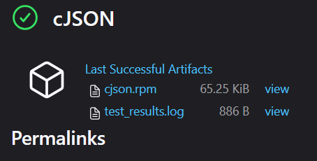
- Udało się wejść do kontenera `jenkins-blueocen` poleceniem: `docker exec -it jenkins-blueocean bash`.
- W kontenerze odnaleziono utworzony artefakt oraz odkryto jego pelną ścieżke poleceniem: `readlink -f cjson.rpm`.
  - *Zrzut erkanu ze ścieżką*:
 
    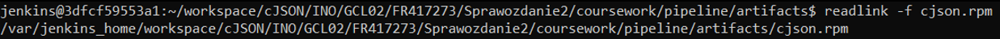
- Artefakt skopiowano na hosta poleceniem: `docker cp jenkins-blueocean:/var/jenkins_home/workspace/cJSON/INO/GCL02/FR417273/Sprawozdanie2/coursework/pipeline/artifacts/cjson.rpm .`.
- Zweryfikowano, że pakiet instalacyjny nie jest pusty.
  - *Zrzut ekranu zawartości pakietu*:

    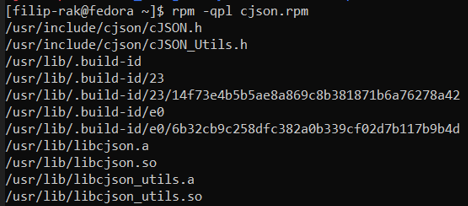
- Uzyskany artefkat `cjson.rpm` został znastępnie zapisany w repozytorium przedmiotowym: [cjson.rpm](coursework/cjson.rpm).
- Utworzono plik `Jenkinsfile`, który został wrzucony do repozytorium przedmiotowego. Jego zawartość została zmodyfikowana o usunięcie kroku **Clone**: [Jenkinsfile](coursework/pipeline/Jenkinsfile).
- Utworzono nowy **Pipeline**, który automatycznie klonuje repozytorium, odczytuje plik `Jenkinsfile` i wykonuje pozostałe kroki CI/CD.
- Z powodzeniem udało się przejść przez cały Pipeline. [Wydruk konsoli](coursework/cjson_scm_console.txt)
  - *Zrzut ekranu potwierdzający powodzenie pipeline'u*:
 
    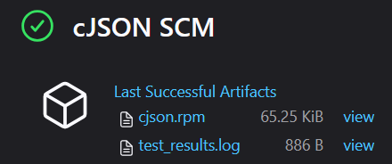
