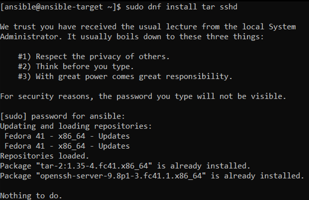
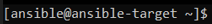
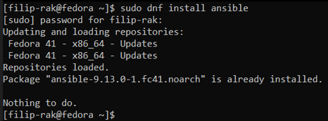
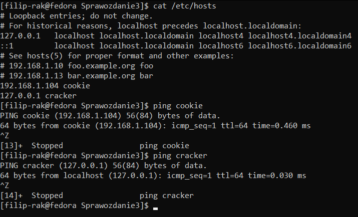
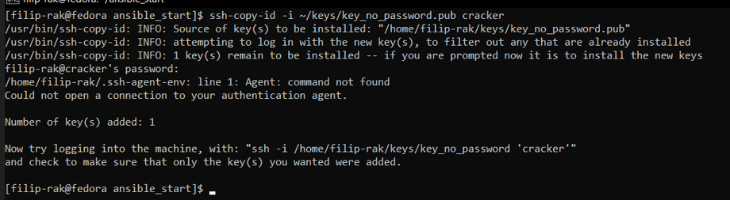
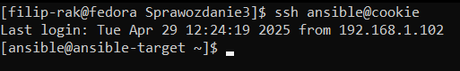
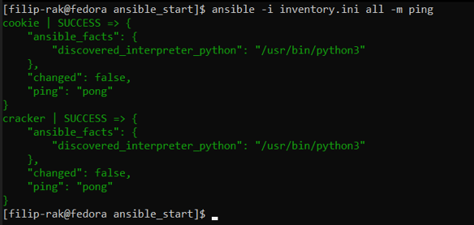
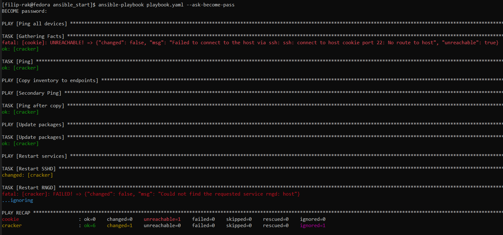
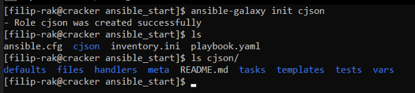
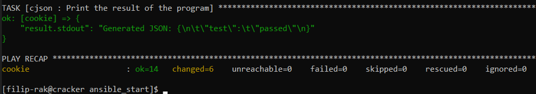

# Sprawozdanie z laboratoriów: Automatyzacja i zdalne wykonywanie poleceń za pomocą Ansible
- Przedmiot: DevOps
- Kierunek: Inżynieria Obliczeniowa
- Autor: Filip Rak
- Data: 29/04/2025

## Przebieg Ćwiczeń
### Instalacja zarządcy Ansible
- Utworzono nową maszynę wirtualną oparta na tym samym systemie co host - `Fedora 41`.
- Na nowej maszynie pobrano oprogramowanie `tar` oraz `sshd`, poleceniem `sudo dnf install tar sshd`.
    - *Zrzut ekranu instalacji*:
 
      
- Nowej maszynie ustawiono nazwę hosta: `ansible-target` oraz utworzono użytkownika `ansible`.
    - *Zrzut ekranu nazw użytkownika i hosta*:
 
      
- Na maszynie głównej pobrano oprogramowanie `ansible`, zgodnie z instruckjami z [poradnika](https://docs.ansible.com/ansible/latest/installation_guide/installation_distros.html#installing-ansible-on-fedora-linux). Wykorzystano polecenie `sudo dnf install ansible`.
  - *Zrzut ekranu instalacji*:

    
### Inwentaryzacja
- Na maszynie głównej, w pliku `/etc/hosts` zmapowano adresy `IP` obu maszyn do nazw `cracker` dla maszyny głównej i `cookie` dla nowej maszyny.
  - *Zrzut ekranu zawartości pliku i wywołania polecenia ping*:

    
- Z perspektywy maszyny głównej (`cracker`), wymieniono klucz ssh z obiema maszynami: `cookie` i `cracker`.
    - *Zrzut ekranu wymiany klucza cracker z cracker*:
 
      
- W obecnym stanie połączenie przez `SSH` nie wymaga żadnego hasła.
    - *Połączenie z cracker do cookie*:

      
- Dla zachowania spójności zmieniono nazwę hosta maszyny głównej z `fedora` na `cracker`. **Kilka następnych screenów jest jeszcze ze starą nazwą hosta**.
- Utworzono prosty plik inwentaryzacji `inventory.ini`:
    ```
    [Orchestrators]
    cracker
    
    [Endpoints]
    cookie ansible_user=ansible
    ```
- Wysłano żadanie `ping` wszystkim maszynom.
  - *Zrzut ekranu ping*:

    
### Zdalne wywoływanie procedur
- Utworzono playbook `playbook.yaml`, którego zadaniem jest:
    - Wysłanie żadania `ping` do wszystkich maszyn.
    - Kopia pliku `inventory.ini` na maszyny `Endpoints`.
    - Ponowna operacja `ping`.
    - Aktualizacja pakietów w systemie
    - Restart usług `sshd` oraz `rngd`.
    
    ```
    - name: Ping all devices
      hosts: all
      tasks:
        - name: Ping
          ansible.builtin.ping:
    
    - name: Copy inventory to endpoints
      hosts: Endpoints
      tasks:
        - name: Copy inventory.ini
          ansible.builtin.copy:
            src: ./inventory.ini
            dest: /tmp/inventory.ini
    
    - name: Secondary Ping
      hosts: all
      tasks:
        - name: Ping after copy
          ansible.builtin.ping:
    
    - name: Update packages
      hosts: all
      become: yes
      tasks:
        - name: Update packages
          ansible.builtin.dnf:
            name: "*"
            state: latest
    
    - name: Restart services
      hosts: all
      become: yes
      tasks:
        - name: Restart SSHD
          ansible.builtin.service:
            name: sshd
            state: restarted
    
        - name: Restart RNGD
          ansible.builtin.service:
            name: rngd
            state: restarted
          ignore_errors: yes
    ```
    - Niektóre z zadania wymagały użycia uprawnień administratorskich do realizacji, z tego względu użyto funkcji eskalacji uprawnień `become`, umożliwiającej tymczasowe podniesienie uprawnień użytkownika do poziomu administracyjnego `root`. Ponadto, ze względu na brak obecności usługi `rngd` na obu komputerach, zastosowano mechanizm `ignore_errors` w ostatnim zadaniu playbooka.
    - Do egzekucji zadań użyto polecenia `ansible-playbook playbook.yaml --ask-become-pass` z opcją pozwalającą na podanie hasła administracyjnego.
      - *Uzyskany wynik*:
        
        
    - Ponownie spróbowano wykonać playbook, tym razem jednak bez połączenia do maszyny `cookie`.
    - Niestety pierwsze próby okazały się zatrzymywać wykonanie playbooka na nieokreślony czas, ze względu na to utworzono podstawowy plik konfiguracyjny `ansible.cfg`, w którym ograniczono czas oczekiwania na nawiązanie połączenia `ssh` do 5 sekund.
      ```
      [defaults]
      inventory = inventory.ini
      timeout = 5
      gathering = smart
      forks = 5
        
      [ssh_connection]
       ssh_args = -o ConnectTimeout=5
      ```
  - Następnie wykonano playbook poleceniem `ansible-playbook playbook.yaml --ask-become-pass`.
    - *Uzyskany wynik*:

      
### Zarządzanie stworzonym artefaktem
- Utworzono nową role poleceniem `ansible-galaxy init cjson`:
  - *Zrzut ekranu struktury katalogów*:

    
- Przeniesiono pliki `cjson-1.0.0.rpm` oraz `cjson_test.c` do nowo powstałego katalogu `cjson/files`.
- Zmodyfikowano zawartość pliku `cjson/tasks/main.yml`. Następuje:
  - Utworzenie katalogu roboczego.
  - Kopiowanie plików `.rpm` oraz `.c`.
  - Instalacja wymaganych zależności.
  - Instalacja dockera.
  - Uruchomienia dockera.
  - Uruchomienie kontenera bazującego na systemie fedora:41.
  - Instalacja narzedzi do instalacji pakieru `rpm` i kompilacji programu.
  - Rozpakowanie pakietu `rpm`.
  - Utworzenie symbolicznego powiązania do plików biblioteki.
  - Kompilacja kodu źródłowego.
  - Uruchomienie programu.
  - Wydruk wyniku.

  *cjson/tasks/main.yml*:
  ```
    - name: Create directory /home/ansible/cjson
      become: yes
      file:
        path: /home/ansible/cjson
        state: directory
        mode: '0755'
    
    - name: Copy files to endpoint
      copy:
        src: "files/{{ item }}"
        dest: /home/ansible/cjson
      loop:
        - test_cjson.c
        - cjson-1.0.0.rpm
    
    - name: Install python3-requests
      become: yes
      dnf:
        name: python3-requests
        state: present
    
    - name: Install Docker
      become: yes
      dnf:
        name: docker
        state: present
    
    - name: Ensure Docker is started
      become: yes
      service:
        name: docker
        state: started
        enabled: true
    
    - name: Start fedora container
      community.docker.docker_container:
        name: cjson
        image: fedora:41
        state: started
        command: sleep infinity
        volumes:
          - /home/ansible/cjson:/mnt:z
    
    - name: Install gcc and tools
      community.docker.docker_container_exec:
        container: cjson
        command: dnf install -y gcc make rpm2cpio cpio
    
    - name: Unpack RPM directly to root filesystem
      community.docker.docker_container_exec:
        container: cjson
        command: bash -c "cd / && rpm2cpio /mnt/cjson-1.0.0.rpm | cpio -idmv"
    
    - name: Create symlink libcjson.so.1 → libcjson.so
      community.docker.docker_container_exec:
        container: cjson
        command: ln -sf /usr/lib/libcjson.so /usr/lib/libcjson.so.1
    
    - name: Compile source file
      community.docker.docker_container_exec:
        container: cjson
        command: gcc /mnt/test_cjson.c -o /mnt/program -lcjson
    
    - name: Run program
      community.docker.docker_container_exec:
        container: cjson
        command: bash -c "LD_LIBRARY_PATH=/usr/lib /mnt/program"
      register: result
    
    - name: Print the result of the program
      debug:
        var: result.stdout
  ```
- Utworzono nowy playbook `playbook-cjson.yaml`.
  ```
    - name: Install & Run cJSON
      hosts: Endpoints
      become: yes
      roles:
        - cjson
  ```
  
- Udało się uzyskać poprawny wynik. [Pełny wydruk](coursework/ansible_print1.txt)
  - *Poprawna kompilacja*:

    
    
