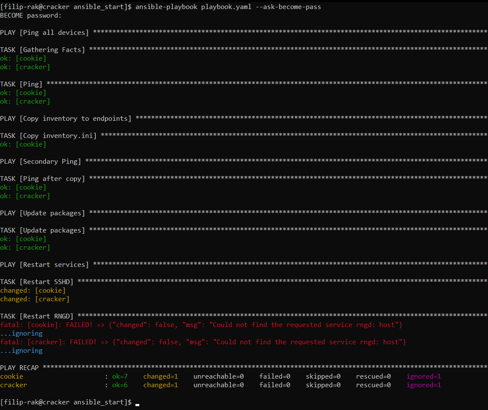

# Sprawozdanie z laboratoriów: Automatyzacja i zdalne wykonywanie poleceń za pomocą Ansible
- Przedmiot: DevOps
- Kierunek: Inżynieria Obliczeniowa
- Autor: Filip Rak
- Data: 29/04/2025

## Przebieg Ćwiczeń
### Instalacja zarządcy Ansible
- Utworzono nową maszynę wirtualną oparta na tym samym systemie co host - `Fedora 41`.
- Na nowej maszynie pobrano oprogramowanie `tar` oraz `sshd`, poleceniem `sudo dnf install tar sshd`.
    - *Zrzut ekranu instalacji*:
 
      
- Nowej maszynie ustawiono nazwę hosta: `ansible-target` oraz utworzono użytkownika `ansible`.
    - *Zrzut ekranu nazw użytkownika i hosta*:
 
      
- Na maszynie głównej pobrano oprogramowanie `ansible`, zgodnie z instruckjami z [poradnika](https://docs.ansible.com/ansible/latest/installation_guide/installation_distros.html#installing-ansible-on-fedora-linux). Wykorzystano polecenie `sudo dnf install ansible`.
  - *Zrzut ekranu instalacji*:

    
### Inwentaryzacja
- Na maszynie głównej, w pliku `/etc/hosts` zmapowano adresy `IP` obu maszyn do nazw `cracker` dla maszyny głównej i `cookie` dla nowej maszyny.
  - *Zrzut ekranu zawartości pliku i wywołania polecenia ping*:

    
- Z perspektywy maszyny głównej (`cracker`), wymieniono klucz ssh z obiema maszynami: `cookie` i `cracker`.
    - *Zrzut ekranu wymiany klucza cracker z cracker*:
 
      
- W obecnym stanie połączenie przez `SSH` nie wymaga żadnego hasła.
    - *Połączenie z cracker do cookie*:

      
- Dla zachowania spójności zmieniono nazwę hosta maszyny głównej z `fedora` na `cracker`. **Kilka następnych screenów jest jeszcze ze starą nazwą hosta**.
- Utworzono prosty plik inwentaryzacji `inventory.ini`:
    ```
    [Orchestrators]
    cracker
    
    [Endpoints]
    cookie ansible_user=ansible
    ```
- Wysłano żadanie `ping` wszystkim maszynom.
  - *Zrzut ekranu ping*:

    
### Zdalne wywoływanie procedur
- Utworzono playbook `playbook.yaml`, którego zadaniem jest:
    - Wysłanie żadania `ping` do wszystkich maszyn.
    - Kopia pliku `inventory.ini` na maszyny `Endpoints`.
    - Ponowna operacja `ping`.
    - Aktualizacja pakietów w systemie
    - Restart usług `sshd` oraz `rngd`.
    
    ```
    - name: Ping all devices
      hosts: all
      tasks:
        - name: Ping
          ansible.builtin.ping:
    
    - name: Copy inventory to endpoints
      hosts: Endpoints
      tasks:
        - name: Copy inventory.ini
          ansible.builtin.copy:
            src: ./inventory.ini
            dest: /tmp/inventory.ini
    
    - name: Secondary Ping
      hosts: all
      tasks:
        - name: Ping after copy
          ansible.builtin.ping:
    
    - name: Update packages
      hosts: all
      become: yes
      tasks:
        - name: Update packages
          ansible.builtin.dnf:
            name: "*"
            state: latest
    
    - name: Restart services
      hosts: all
      become: yes
      tasks:
        - name: Restart SSHD
          ansible.builtin.service:
            name: sshd
            state: restarted
    
        - name: Restart RNGD
          ansible.builtin.service:
            name: rngd
            state: restarted
          ignore_errors: yes
    ```
    - Niektóre z zadania wymagały użycia uprawnień administratorskich do realizacji, z tego względu użyto funkcji eskalacji uprawnień `become`, umożliwiającej tymczasowe podniesienie uprawnień użytkownika do poziomu administracyjnego `root`. Ponadto, ze względu na brak obecności usługi `rngd` na obu komputerach, zastosowano mechanizm `ignore_errors` w ostatnim zadaniu playbooka.
    - Do egzekucji zadań użyto polecenia `ansible-playbook playbook.yaml --ask-become-pass` z opcją pozwalającą na podanie hasła administracyjnego.
      - *Uzyskany wynik*:
        
        
    - Ponownie spróbowano wykonać playbook, tym razem jednak bez połączenia do maszyny `cookie`.
    - Niestety pierwsze próby okazały się zatrzymywać wykonanie playbooka na nieokreślony czas, ze względu na to utworzono podstawowy plik konfiguracyjny `ansible.cfg`, w którym ograniczono czas oczekiwania na nawiązanie połączenia `ssh` do 5 sekund.
      ```
      [defaults]
      inventory = inventory.ini
      timeout = 5
      gathering = smart
      forks = 5
        
      [ssh_connection]
       ssh_args = -o ConnectTimeout=5
      ```
  - Następnie wykonano playbook poleceniem `ansible-playbook playbook.yaml --ask-become-pass`.
    - *Uzyskany wynik*:

      
### Zarządzanie stworzonym artefaktem
- Utworzono nową role poleceniem `ansible-galaxy init cjson`:
  - *Zrzut ekranu struktury katalogów*:

    
- Przeniesiono pliki `cjson-1.0.0.rpm` oraz `cjson_test.c` do nowo powstałego katalogu `cjson/files`.
- Zmodyfikowano zawartość pliku `cjson/tasks/main.yml`. Następuje:
  - Utworzenie katalogu roboczego.
  - Kopiowanie plików `.rpm` oraz `.c`.
  - Instalacja wymaganych zależności.
  - Instalacja dockera.
  - Uruchomienia dockera.
  - Uruchomienie kontenera bazującego na systemie fedora:41.
  - Instalacja narzedzi do instalacji pakieru `rpm` i kompilacji programu.
  - Rozpakowanie pakietu `rpm`.
  - Utworzenie symbolicznego powiązania do plików biblioteki.
  - Kompilacja kodu źródłowego.
  - Uruchomienie programu.
  - Wydruk wyniku.

  *cjson/tasks/main.yml*:
  ```
    - name: Create directory /home/ansible/cjson
      become: yes
      file:
        path: /home/ansible/cjson
        state: directory
        mode: '0755'
    
    - name: Copy files to endpoint
      copy:
        src: "files/{{ item }}"
        dest: /home/ansible/cjson
      loop:
        - test_cjson.c
        - cjson-1.0.0.rpm
    
    - name: Install python3-requests
      become: yes
      dnf:
        name: python3-requests
        state: present
    
    - name: Install Docker
      become: yes
      dnf:
        name: docker
        state: present
    
    - name: Ensure Docker is started
      become: yes
      service:
        name: docker
        state: started
        enabled: true
    
    - name: Start fedora container
      community.docker.docker_container:
        name: cjson
        image: fedora:41
        state: started
        command: sleep infinity
        volumes:
          - /home/ansible/cjson:/mnt:z
    
    - name: Install gcc and tools
      community.docker.docker_container_exec:
        container: cjson
        command: dnf install -y gcc make rpm2cpio cpio
    
    - name: Unpack RPM directly to root filesystem
      community.docker.docker_container_exec:
        container: cjson
        command: bash -c "cd / && rpm2cpio /mnt/cjson-1.0.0.rpm | cpio -idmv"
    
    - name: Create symlink libcjson.so.1 → libcjson.so
      community.docker.docker_container_exec:
        container: cjson
        command: ln -sf /usr/lib/libcjson.so /usr/lib/libcjson.so.1
    
    - name: Compile source file
      community.docker.docker_container_exec:
        container: cjson
        command: gcc /mnt/test_cjson.c -o /mnt/program -lcjson
    
    - name: Run program
      community.docker.docker_container_exec:
        container: cjson
        command: bash -c "LD_LIBRARY_PATH=/usr/lib /mnt/program"
      register: result
    
    - name: Print the result of the program
      debug:
        var: result.stdout
  ```
- Utworzono nowy playbook `playbook-cjson.yaml`.
  ```
    - name: Install & Run cJSON
      hosts: Endpoints
      become: yes
      roles:
        - cjson
  ```
  
- Udało się uzyskać poprawny wynik. [Pełny wydruk](coursework/ansible_print1.txt)
  - *Poprawna kompilacja*:

    
    
### Pliki odpowiedzi dla wdrożeń nienadzorowanych
- Z systemu fedora będącego hostem skopiowano plik `anaconda-ks.cfg` znajdującego się w katalogu `root/`.
- Plik ten został zapisany na gałęzi `FR417273` w repozytorium przedmiotu.
- W celu umożliwienia automatycznej instalacji biblioteki `cJSON` poprzez wykorzystanie pliku kikstart wykonano następujące kroki.
  - Zainstalowano i uruchomiono usługę `httpd` w celu hostowania artefaktu `.rpm`.
  - Dodano wyjątek do zapory sieciowej systemu pozwalający na połączenia na porcie `80`.
  - Umieszczono artefakt w katalogu `/var/html/cjson`.
     - *Zrzut ekranu z przygotowania artefaktu*

       

  - Z oprogramowaniem `createrepo_c` utworzono repozytorium w powyższym katalogu.
    - *Zrzut ekranu tworzenia repozytroium*

      

  - Dostępność artefaktu zweryfikowano poprzez instalacje repo na drugiej maszynie wirtualnej będacej w tej samej sieci.
  - *Zrzut ekranu instalacji oraz weryfikacji plików*

    
- Wprowadzono zmiany w pliku `anaconda-ks.cfg`:
  - Dodano repozytoria internetowe fedory oraz wcześniej utworzone repozytorium `cJSON`.
  - Do instalowanych pakietów dodano pakiet `cJSON`.
  - Dodano użytkownika systemowego z widoczny hasłem.
  - Na root ustawiono hasło jawne w postaciu czystego tekstu.
  - Ustawiono hasło hosta systemu na `biscuit`
  - Zapewniono format dysku poleceniem `clearpart --all`.
  - Dodano sekcji post, w której zweryfikowano obecność zainstalowanego artefaktu.
  - Dodano restart systemu po zakończeniu instalacji.
 
  ```
    # Generated by Anaconda 41.35
    # Generated by pykickstart v3.58
    #version=DEVEL
    
    # Keyboard layouts
    keyboard --vckeymap=pl2 --xlayouts='pl','us'
    # System language
    lang en_US.UTF-8
    
    # Repositories
    url --mirrorlist=http://mirrors.fedoraproject.org/mirrorlist?repo=fedora-41&arch=x86_64
    repo --name=update --mirrorlist=http://mirrors.fedoraproject.org/mirrorlist?repo=updates-released-f41&arch=x86_64
    repo --name=cjson --baseurl=http://192.168.1.102/cjson/
    
    # Network information
    network  --bootproto=dhcp --device=enp0s3 --ipv6=auto --activate --hostname=Biscuit
    
    # Install packages
    %packages
    @core
    cjson
    %end
    
    # Run the Setup Agent on first boot
    firstboot --enable
    
    # Generated using Blivet version 3.11.0
    ignoredisk --only-use=sda
    autopart
    
    # Partition clearing information
    clearpart --all --initlabel
    
    # System timezone
    timezone Europe/Warsaw --utc
    
    # Users
    rootpw --allow-ssh abc
    user --password=abc --plaintext --groups=wheel --name=filip-rak --gecos="Filip Rak"
    
    # Display
    %post --interpreter /bin/bash
    echo "==== Confirming installation of cJSON ===="
    ls /usr/include/cjson
    ls /usr/lib/libcjson*
    echo "==== End ===="
    %end
    
    # Reboot the system
    reboot
  ```

- Wykorzystano serwis [tinyurl.com](https://tinyurl.com) w celu skrócenia adresu pliku `anaconda-ks.cfg` znajdującego się w repozytorium przedmiotu.
- W trakcie instalacji systemu fedora na nowej maszynie wirtualnej, klikając klawisz `e`, przeszliśmy do linii poleceń kernela.
- Wewnątrz skryptu dodaliśmy parametr startowy jądra `inst.ks=tinyurl.com/34uj22hp`. Wykorzystując wcześniej wygenerowany [adres](https://tinyurl.com/34uj22hp).
    - *Zrzut ekranu z modyfikacji parametrów*
 
      
  
- Klikając kombinacje klawiszy `ctrl` + `x`, przeszliśmy do instalacji systemu, która była zautomatyzowana poprzez realizacje konfiguracji z pliku.
- Po zakończeniu instalacji i ponownym uruchomieniu systemu zweryfikowano obecność pakietu oraz plików, instalowanej podczas instalacji systemu, biblioteki `cJSON`.
  - *Weryfikacja obecności pakietu*:
 
    

- Aby móc dalej zautomatyzować proces stawiania maszyny wirtualnej, w oprogramowaniu `VirtualBox`, koniecznnym było zmodyfikowanie obrazu `.iso` instalatora systemu, ze względu na to, że automatyczne wprowadzanie adresu do parametrów startowych, podczas instalacji, jest w tym oprogramowaniu praktycznie niemożliwe.
- W związku z tym podjęto następujące kroki aby zautomatyzować proces tworzenia maszyny z plikiem kickstart.
    - Rozpakowano obraz `.iso` i zmodyfikowano plik `boot/grub2/grub.cfg`.
        - Manulanie wprowadzono parametr `inst.ks=https://tinyurl.com/34uj22hp` do opcji `Install Fedora 41`.
        - Pozbyto się innych opcji instalacji / użytku.
        - Ustawiono domyślną opcje jako `set default="0"`.
        - Ustawiono `set timeout=0`, aby instalacja rozpoczynała się od razu.
        - Zmieniono label na "Fedora-KS"
        - *Zawarość pliku*:
          ```
            set default="0"
            
            function load_video {
              insmod all_video
            }
            
            load_video
            set gfxpayload=keep
            insmod gzio
            insmod part_gpt
            insmod ext2
            insmod chain
            
            set timeout=0
            ### END /etc/grub.d/00_header ###
            
            search --no-floppy --set=root -l 'Fedora-KS'
            
            ### BEGIN /etc/grub.d/10_linux ###
            menuentry 'Install Fedora 41' --class fedora --class gnu-linux --class gnu --class os {
            	linux /images/pxeboot/vmlinuz inst.stage2=hd:LABEL=Fedora-E-dvd-x86_64-41 inst.ks=https://tinyurl.com/34uj22hp quiet
            	initrd /images/pxeboot/initrd.img
            }
          ```
    - Utworzono folder współdzielony pomiędzy maszyną wirtualną Fedora (cracker) a hostem Windows 10.
    - Pozowlono w ten sposób systemowi Fedora na no ponowne utworzenie bootowalnego `.iso` ze zmodyfikowanym konfigiem `gtub.cfg`.
        - Potrzebnym było zapotrzenie się w oprogramowanie `xorriso`, uzyskane przez `sudo dnf install xorriso`.
        - Następnie wykorzystując polecenie: `xorriso -as mkisofs -o ~/Fedora-Kickstart.iso -J -R -V "FedoraKS" .` utworzono nowy obraz `.iso`.
        - Następnie zauważono, że mozna było tak właściwie utworzyć obraz od razu w katalogu współdzielonym pomiędzy systemami, następnie przeniesiono do tego katalogu obraz.
        - *Zrzut ekranu z budowania obrazu na systemie Fedora*:
     
          

    - Następnie na hoście (Windows) napisano skrypt instalacyjny (Powershell Script), którego zadaniem było utworzenie maszyny z nowo utworzonego obrazu:
      ```
        # Vars
        $vmName     = "fedora-auto"
        $isoPath    = "D:\System ISOs\kickstart\burned\Fedora-Kickstart.iso"
        $diskFolder = "C:\Users\Filip\VirtualBox VMs\$vmName"
        $diskPath   = "$diskFolder\$vmName.vdi"
        $VBoxManage = "C:\Program Files\Oracle\VirtualBox\VBoxManage.exe"
        $memory     = 2048
        $cpus       = 1
        
        # Create VM
        & $VBoxManage createvm --name $vmName --ostype Fedora_64 --register
        
        # Config VM
        & $VBoxManage modifyvm $vmName --memory $memory --cpus $cpus --boot1 dvd --firmware efi
        
        # Create Disk
        New-Item -ItemType Directory -Path $diskFolder -Force | Out-Null
        & $VBoxManage createhd --filename "$diskPath" --size 2000
        
        # Add controllers
        & $VBoxManage storagectl $vmName --name "SATA Controller" --add sata --controller IntelAhci
        & $VBoxManage storageattach $vmName --storagectl "SATA Controller" --port 0 --device 0 --type hdd --medium "$diskPath"
        
        & $VBoxManage storagectl $vmName --name "IDE Controller" --add ide
        & $VBoxManage storageattach $vmName --storagectl "IDE Controller" --port 0 --device 0 --type dvddrive --medium "$isoPath"
        
        # Start VM
        & $VBoxManage startvm $vmName --type gui
      ```
      - Skrypt uruchomiono prawym przyciskiem myszy, opcją `run with powershell`.
      - *Zrzut ekranu uruchomienia skryptu*:

        

      - Po uruchomieniu skrypt wykonał następujące czynności:
          - Utworzył nową maszynę.
          - Sonfigurował podstawowe ustawienia: CPU, pamięc itd.
          - Utworzył dysk do zapisu danych.
          - Utworzył kontolery `IDE` oraz `SATA` i prydzielił im plik `.iso` oraz `.vdi`.
          - Następnie uruchomił maszynę.

       - W okienku `Oracle VirtualBox Manager` w międzyczasie pojawiło się nowe wejście, reprezentujące utworzoną maszynę.
         - *Zrzut ekranu z okienka*:
        
           

       - Bootloader następnie przeszedł do automatycznego wykonywania wskazanego pliku kickstart.
         - *Zrzut ekranu instalacji*:
           
          
