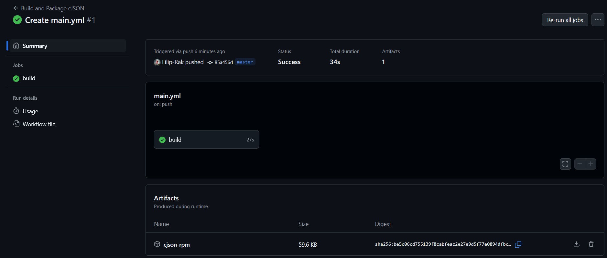

# Sprawozdanie z laboratoriów 13 -> Shift-left: GitHub Actions
- Przedmiot: DevOps
- Kierunek: Inżynieria Obliczeniowa
- Autor: Filip Rak
- Data: 29/05/2025

## Zapoznanie z koncepcją GitHub Actions
GitHub Actions to wbudowany w platformę GitHub system automatyzacji pozwalający na definiowanie tzw. *workflowów* - czyli sekwencji zadań wykonywanych automatycznie w odpowiedzi na określone zdarzenia w repozytorium (np. push, pull request, wydanie tagu itp.).
Workflowy definiowane są za pomocą plików YAML, umieszczanych w katalogu `.github/workflows/` i zawierają m.in.:
- warunek uruchomienia (`on: push`, `on: pull_request`, itd.),
- wybór systemu operacyjnego (`runs-on: ubuntu-latest`),
- zestaw kroków (`steps:`), takich jak checkout kodu, budowanie projektu, testowanie, publikacja artefaktów.

GitHub Actions wspiera wiele języków i ekosystemów (Python, C/C++, Rust, Node.js, Java, itp.) oraz umożliwia integrację z narzędziami zewnętrznymi - co pozwala na jego zastosowanie w ramach ciągłej integracji (CI) i ciągłego wdrażania (CD).

## Fork repozytorium
Utworzono fork repozytorium biblioteki [cJSON](https://github.com/DaveGamble/cJSON).


Z forka usunięto zawartość katalogu `.github/workflows/`


Wewnątrz repozytorium, na witrynie github, w zakładce `Actions`, utworzono nową akcje, opcją **set up a workflow yourself**.


Zdefiniowano następujący plik `main.yml`.
```
name: Build and Package cJSON

on:
  push:
    branches: [ "master" ]
  pull_request:
    branches: [ "master" ]
  workflow_dispatch:

jobs:
  build:
    runs-on: ubuntu-latest

    steps:
    - name: Checkout repo
      uses: actions/checkout@v4

    - name: Install dependencies
      run: |
        sudo apt-get update
        sudo apt-get install -y make gcc rpm
        sudo gem install --no-document fpm

    - name: Build
      run: make

    - name: Test
      run: |
        make test

    - name: Create install structure
      run: |
        mkdir -p /tmp/cjson-install/usr/include/cjson
        mkdir -p /tmp/cjson-install/usr/lib
        cp cJSON.h cJSON_Utils.h /tmp/cjson-install/usr/include/cjson
        cp libcjson*.so libcjson*.a /tmp/cjson-install/usr/lib

    - name: Build RPM package
      run: |
        fpm -s dir -t rpm -n cjson -v 1.0 -C /tmp/cjson-install .

    - name: Upload RPM artifact
      uses: actions/upload-artifact@v4
      with:
        name: cjson-rpm
        path: "*.rpm"
```

Powyższy plik definiuje nastęoującą akcje:
- Warunki uruchomienia:
  - push do gałęzi `master` lub
  - pull request do gałęzi `master` lub
  - manualne uruchomienie z interfejsu GitHub.
- Job build:
    - Uruchomiony na maszynie Ubuntu.
      ```
      build:
        runs-on: ubuntu-latest
      ```
      - Kroki:
        - Checkout repozytorium:
          ```
          - name: Checkout repo
            uses: actions/checkout@v4
          ```
        - Instalacja zależności:
          ```
          - name: Install dependencies
            run: |
              sudo apt-get update
              sudo apt-get install -y make gcc rpm
              sudo gem install --no-document fpm
          ```
        - Kompilacja kodu:
          ```
          - name: Build
            run: make
          ```
        - Testowanie:
          ```
          - name: Test
            run: |
              make test
          ```
        - Tworzenie struktury instalacyjnej:
          ```
          - name: Create install structure
            run: |
              mkdir -p /tmp/cjson-install/usr/include/cjson
              mkdir -p /tmp/cjson-install/usr/lib
              cp cJSON.h cJSON_Utils.h /tmp/cjson-install/usr/include/cjson
              cp libcjson*.so libcjson*.a /tmp/cjson-install/usr/lib
          ``` 
        - Tworzenie pakietu `.rpm`:
          ```
          - name: Build RPM package
            run: |
              fpm -s dir -t rpm -n cjson -v 1.0 -C /tmp/cjson-install .
          ```
        - Wysyłanie artefaktu:
          ```
          - name: Upload RPM artifact
            uses: actions/upload-artifact@v4
            with:
              name: cjson-rpm
              path: "*.rpm"
          ```

Utworzony plik zacommitowano co wywołało jego uruchomienie:


oraz utworzyło artefakt:


## Pobranie i test artefaktu
Utworzono nowy **Personal Acces Token**


Zainstalowano oficjalną usługę **Github CLI**, `gh` i przeprowadzono autentyfikacje za pomocą tokenu.


Pobrano i zainstalowano pakiet poprzez użycie poleceń: `gh run download 15331720525 --repo Filip-Rak/cJSON` i `sudo rpm -i cjson-rpm/cjson-1.0-1.x86_64.rpm`.


Przeprowadzono weryfikacje działania z plikiem testowym `deploy.c`:
```
#include <stdio.h>
#include <cjson/cJSON.h>

int main() {
    const char *json = "{\"name\":\"Github Actions\",\"type\":\"CI\"}";
    cJSON *root = cJSON_Parse(json);

    if (root == NULL) {
        printf("Parse error\n");
        return 1;
    }

    cJSON *name = cJSON_GetObjectItemCaseSensitive(root, "name");
    if (cJSON_IsString(name) && (name->valuestring != NULL)) {
        printf("Parsed name: %s\n", name->valuestring);
    }

    cJSON_Delete(root);
    return 0;
}
```

Kod źródłowy skompilowano i uruchomiono potwierdzając poprawne działanie biblioteki:


