Sprawozdanie z laboratoriów: SSH, GIT, Docker, Dockerfiles
Przedmiot: DevOps
Kierunek: Inżynieria Obliczeniowa
Autor: Filip Rak
Data: 10/03/2025

## Przebieg Ćwiczeń
### Pierwsze zajęcia (SSH, GIT):
- Na wirtualnej maszynie VirtualBox zainstalowana została dystrybucja systemu Linux, Fedora. 
- Na konto użytkonika zalogowano się przez SSH w programie PowerShell systemu Windows. 
- Na witrynie GitHub utworzono Personal Acces Token oraz wykorzystano go do sklonowania repozytorium.  
- Utworzone zostały dwa klucze SSH, nie będace typu RSA, z czego jeden z nich został zabezpieczony hasłem. Użyto polecenia: ```ssh-keygen -t ed25519 -C "ADRES-EMAIL.com"``` 
- Do SHH dodano utworzony klucz, poleceniem `ssh-add ./key_no_password` 
- Klucz publiczny został skopiowany z pliku o rozszerzeniu `.pub` i przekazany witrynie GitHub. 
- Autentyifkacja została potwierdzona poleceniem `ssh -T git@github.com` 
- Repozytorium zostało sklonowane poleceniem `git clone` 
- Utworzono nową gałąź kombinacją poleceń `git checkout GCL02` `git checkout -d FR417273`. Wewnątrz tej gałęzi utworozno katalog `mkdir FR417273`.
- Wewnątrz katalogu `.git/hooks` utworzono plik `commit-msg`, którego zadaniem jest weryfikacja i wymuszenie aby każdy przyszły commit zaczynał się inicjałami oraz numerem indeksu. Kopia pliku została przeniesiona do katalogu użytkownika. 
```#!/bin/sh
# Verify if commit message starts with the correct initials
string="[FR417273]"
if ! grep -q "^$string" "$1"; then
  echo "FAILED. Start commit message with $string."
  exit 1
fi
```

### Drugie zajęcia (Docker, Dockerfiles):
- Zainstalowano oprogramowanie Docker, na systemie Fedora, poprzez polecenie: `sudo dnf install -y docker`.
- Zarejestrowano się w witrynie `hub.docker.com`. .
- Pobrano obrazy: `hello-world`, `busybox`, `ubuntu`, `fedora`, `mysql`. Wykorzystano polecenie `docker pull [obraz]`. 
- Uruchomiono kontener z obrazu busybox, podłaczono się do niego interkatywnie i wywołano numer wersji systemu. 
- Uruchomiono kontener z obrazu systemu Ubuntu. Wyświetlono procesy w kontenerze w tym PID1: bash. Wyświetlono procesy dockera na hoście. [Zrzut ekranu pracy z obrazem ubutnu](media/m13_ubuntu.png)
- Ponownie uruchomiono kontener z obrazu ubuntu i wywołano aktualizacje pakietów poleceniami `apt update && apt upgrade -y` . 
- Utworzono własny plik Dockerfile bazujący na systemie fedora. Na tym obrazie zainstalowany zostaje git oraz skopiowane repozytorium przedmiotu. Poniżej znajduje się zawartość pliku Dockerfile
```
# Use fedora's image
FROM fedora:39

# Install git
RUN dnf update -y && dnf install -y git

# Set working directory
WORKDIR /repo

# Clone the repository
RUN git clone https://github.com/InzynieriaOprogramowaniaAGH/MDO2025_INO

# Set default command
CMD ["bash"]
```
- Obraz utworzono poleceniem: `docker build -t custom_image .`. Zweryfikowano następnie czy sklonowanie repozytorium udało się, poprzez otworzenie obrazu w trybie interaktywnym i weryfikacje manulaną. .
- Pokazanie działających kontenerów i usunięcie ich: 
- Usunięcie wszysktich obrazów dockera poleceniem: `docker rmi $(docker images -q)` 
- Utworzony plik Dockerfile został dodany do katalogu Sprawozdanie1 wewnątrz repozytorium na gałęzi `FR417273`.

### Trzecie zajęcia (Docker, Dockerfiles):
- Sklonowano repozytorium oprogramowania o otwartej licencji, [cJSON](https://github.com/DaveGamble/cJSON), zawierające działający Makefile, który ma zdefiniowany zestaw testów.
- Kompilacja odbyła się poleceniem `make`, zaś uruchomienie testó poleceniem `make test`. 
- Kolejnym zadaniem było powtórzenie tego procesu, tym razem w kontenerze. Uruchomiono kontener na podstawie obrazu ubuntu, w trybie interkatywnym, poleceniem `docker run -it --rm ubuntu bash`
- Następnie na uruchomionym kontenerze zainstalowane wszelkie zależności wymagane do dalszej pracy: git, make, gcc. Polecenie: `aptg-get update && apt-get install -y git make gcc`
- Repozytoriumn ponownie sklonowano, tym razem w ramach kontenera, poleceniem `git clone https://github.com/DaveGamble/cJSON.git` 
- Kolejnym zadaniem było utworzenie dwóch plików Dockerfile, których zadaniami będą kompilacja oraz uruchamiane testów, gdzie pierwszy obraz przygotowuje środowisko oraz kompiluje oprogramowanie a drugi obraz przeprowadza testy. W tym celu utworzono dwa pliki `Dockerfile.build` oraz `Dockerfile.test`. Ponizej znajdują się ich zawartości.

```
#### Dockerfile.build ####
FROM ubuntu:22.04
WORKDIR /app
RUN apt update
RUN apt-get -y install git make gcc
RUN git clone https://github.com/DaveGamble/cJSON.git
WORKDIR /app/cJSON
RUN make
CMD ["/bin/bash"]
```

```
#### Dockerfile.test ####
FROM cj-build
WORKDIR /app/cJSON
RUN mkdir logs && make test > logs/test_results.log
CMD ["/bin/bash"]
```
- Pliki zostały skompilowane jeden po drugim poleceniami `docker build -t cj-build -f Dockerfile.build .` oraz `docker build -t cj-test dockerfile.test .` 
- W celu werfyikacji poprawności uruchomiony został kontener na bazie obrazu do testowania `cj-test`, w trybie interaktywnym. Manulanie została zweryfikowana obecność pliku tekstowego z wydrukiem testu. 
- Docker Compose służy do definiowania i zarządzania wielokontenerowymi aplikacjami, umożliwiając ich łatwe uruchamianie, konfigurację i współpracę w jednym środowisku poprzez deklaratywny plik docker-compose.yml. W ramach kolejnego zadania utworzono taki plik oraz go zbudowano.
```
#### docker-compose.yml ####
services:
  cj-build:
    build:
      context: .
      dockerfile: Dockerfile.build
    container_name: cj-build

  cj-test:
    build:
      context: .
      dockerfile: Dockerfile.test
    container_name: cj-test
    depends_on:
      - cj-build
```
- Budowanie odbyło się poleceniem `docker-compose up --build`. 
- To, czy dany program nadaje się do wdrażania i publikowania jako kontener, zależy od kilku czynników. Jeśli aplikacja opiera się na interakcji z użytkownikiem i środowiskiem, w którym działa, jej uruchomienie w kontenerze wymagałoby znacznego dodatkowego wysiłku, aby zapewnić pełną funkcjonalność (np. obsługę sterowników, dostęp do plików oraz urządzeń peryferyjnych hosta). Kontenery są idealnym rozwiązaniem dla aplikacji działających w tle, które nie wymagają bezpośredniej interakcji z użytkownikiem, takich jak serwery czy backendy. Ze względu na ograniczoną obsługę sterowników oraz brak natywnej współpracy z hostem i urządzeniami peryferyjnymi, aplikacje użytkowe, które z tych funkcji korzystają, nie powinny być umieszczane w kontenerach – z wyjątkiem sytuacji, w których konieczne jest testowanie działania aplikacji w różnych środowiskach.
- W przypadku cJSON wdrażanie jako kontener nie ma żadnego sensu, ponieważ jest to biblioteka, która powinna być instalowana w systemie lub dołączana jako zależność w projekcie C. Jedynym uzasadnionym zastosowaniem kontenera w tym przypadku jest testowanie biblioteki w różnych środowiskach.
- Jeśli program miałby zostać opublikowany w kontenerze, powinien zostać oczyszczony z pozostałości kompilacyjnych, aby zmniejszyć zużycie pamięci i przestrzeni dyskowej oraz uniknąć zbędnych plików, które nie są potrzebne w środowisku produkcyjnym. W takim przypadku dedykowany Dockerfile do procesu "deploy-and-publish" jest jak najbardziej uzasadniony. Pozwala on na automatyczne czyszczenie obrazu z niepotrzebnych plików kompilacyjnych, co zmniejsza jego rozmiar i optymalizuje wdrażanie nowych wersji oprogramowania. Oddzielenie builda od wdrożenia ułatwia również zarządzanie cyklem życia aplikacji i zapewnia lepszą kontrolę nad jej zależnościami.
- Jeśli program wymaga głębszej integracji z systemem użytkownika, powinien być dystrybuowany w formie pakietu, np. `.dll` (dla Windows) lub `.jar` (dla wieloplatformowych aplikacji Java). Nie wszystkie z tych formatów są kompatybilne z każdym systemem, co stanowi pewną wadę i jednocześnie podkreśla jedną z zalet kontenerów – ich niezależność od systemu operacyjnego.
- Finalny pakiet może zostać wygenerowany przy użyciu dedykowanego kontenera, ale nie jest to konieczne – w zależności od projektu, format taki może być tworzony również w tradycyjnym środowisku builda.
- Sposób wdrożenia oprogramowania zależy od jego specyfiki i docelowego systemu. Aplikacje użytkowe najlepiej dystrybuować jako pakiety (`.deb`, `.rpm`), zapewniając łatwą instalację. Biblioteki (np. `cJSON`) powinny być dostarczane w formie `.so` lub `.dll` i pakietów systemowych, umożliwiając prostą integrację z kodem. Backendy i mikrousługi często wdraża się w kontenerach Docker, co zapewnia niezależność od systemu i łatwe skalowanie.

### Czwarte zajęcia (Dodatkowa terminologia w konteneryzacji, instancja Jenkins):
- Przygotowano woluminy wejściowy i wyjściowy poleceniem `docker volume create [nazwa]`. 
- Uruchomiono nowy kontener bazujący na ubuntu połączono do niego utworzone woluminy poleceniem `docker run -it --name volume-test -v input:/mnt/input -v output:/mnt/output ubuntu`
- Zainstalowano wymagania wstępne do kompilacji cJSON (`make`, `gcc`) poleceniami `apt-get update && apt-get install gcc make -y` 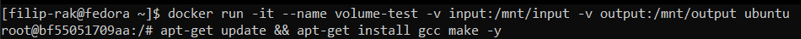
- Zweryfikowano obecność zamontowanych katalogów 
- Na hoście odnaleziono lokalizacje woluminu wejściowego (`docker volume inspect`) i skolonowano do niego repozytorium `cJSON` 
- W kontenerze udało się potwierdzić obecność sklonowanego repozytorium 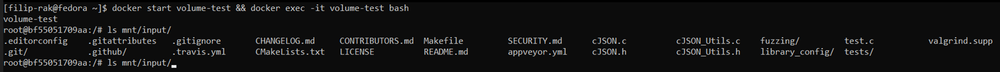
- Poleceniem `cp -r` skopiowano repozytorium do katalogu wewnętrznego kontenera i zbudowano poleceniem `make`.
- Skopilowanie pliki bibliotek i nagłówkowe skopiowano do katalogu wyjściowego. 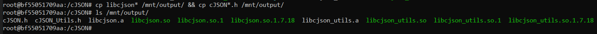
- Obecność wyniku zweryfikowano na hoście. 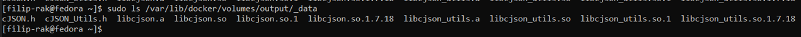
- Zastosowane podejście moze być probelmatyczne ponieważ narusza model izolacji Dockera, wprowadza problemy z przenośnością bezpieczeństwem i uprawnieniami oraz nie nadaje się do automatyzacji. Zamiast tego lepiej użyć dedykowanego kontenera, który montuje wolumin i wykonuje git clone w przewidywalny i bezpieczny sposób.
- Ponowiono operacje, tym razem klonując (przez git) repozytorium wewnątrz kontenera i zapisując je w woluminie wejściowym 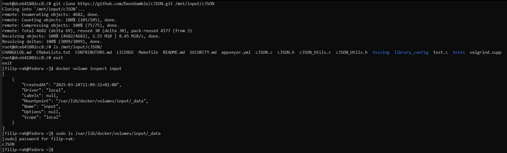
- Powodzenie działania potwierdza możliwość wymiany plików pomiędzy dwoma kontenerami za pomocą woluminów. 
- Utworzony lik `Dockerfile`, którego zadaniem było zautomatyzowanie budowania aplikacji poprzez skopiowanie jej z udostępnionego woluminu, zbudowanie i zwrócenie wynikó pracy w woluminie wyjściowym. Wykorzystano typ montowania bind i utworzono nowe katalogi dla woluminów, nie znajdujące się w katalogach dockera. 
```
FROM ubuntu:22.04

RUN apt update && apt install -y gcc make

WORKDIR /cJSON

RUN --mount=type=bind,source=./input,target=/mnt/input \
    --mount=type=bind,source=./output,target=/mnt/output,rw \
    cp -r /mnt/input/cJSON/* . && \
    make && \
    cp lib*.so* /mnt/output && \
    cp cJSON*.h /mnt/output
```
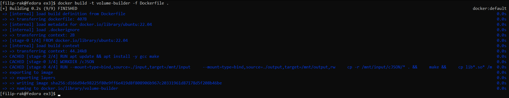
- `RUN --mount` w docker build pozwala tymczasowo zamontować katalogi z hosta (np. wejściowe repozytorium i katalog wyjściowy), co pozwala na szybkie wykonanie builda. Jednak dane zapisane w czasie buildu do zamontowanego katalogu nie są trwałe – po zakończeniu buildu nie trafiają one na hosta. Dlatego choć teoretycznie można wykonać całą operację (klonowanie, build, zapis) w docker build, to w praktyce lepiej użyć docker run jeśli chcemy trwale przenieść efekty buildu do katalogu hosta.
- Uruchomiono nowy kontener w tle, zainstalowano usługę `iperf3` i uczyniono go serwerem `docker run -d --name iperf-server ubuntu sh -c "apt update && apt install -y iperf3 && iperf3 -s"` 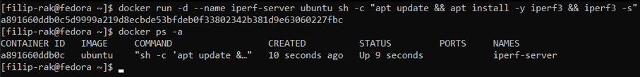
- Na hoście odnaleziono adres IP utworzonego serwera poleceniem `docker inspect -f '{{range .NetworkSettings.Networks}}{{.IPAddress}}{{end}}' iperf-server` 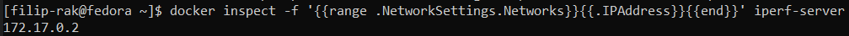
- Uruchomiono nowy kontener, zainstalowano usługę `iperf3` i połączono się z serwerem poprzez uzyskany adres. 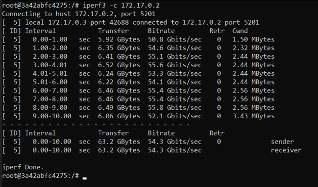
- Do następnych zadań utworzono, prosty, pomocniczy plik `Dockerfiles.iperf`, który instaluje usługę `iperf3`.
```
FROM ubuntu:22.04
RUN apt update && apt install -y iperf3 -y
```
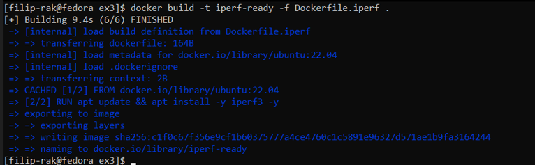
- Utworzono sieć mostkowaną iperf-net poleceniem `docker network create --driver bridge iperf-net`
- Po raz kolejny utworzono kontenery serwera i klienta, tym razem wewnątrz zdefiniowanej sieci. Ponadto wykorzystano utworzony obraz z zainstalowanym `iperf3`.
- Ułożenie obu kontenerów w jednej sieci pozwoliło na połączenie się poprzez wykorzystanie nazwy, bez potrzeby odnajdowywania adresu IP.

- Z serwerem połączono się również z samego hosta. 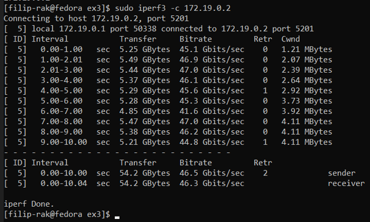
- Następnie połączono się z serwerem przez kolejny kontener, tym razem zapisując wynik w woluminie wyjściowym, który został odczytany na hoście poleceniem `cat`. 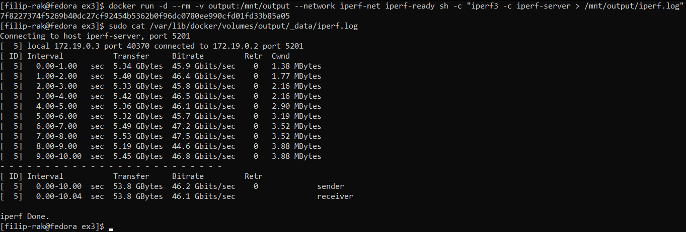
- Z powodzeniem udało się nawiązać połączenie z serwerem z innej maszyny wirtualnej. Wymagane było otworzenie portu używanego przez usługę `iperf3`, co zostało osiągniętę podczas uruachmiania kontenera i użycia opcji `-p`. Pełne polecenie: `docker run -d --name iperf-server --network iperf-net -p 5201:5201 iperf-ready sh -c "iperf3 -s"` 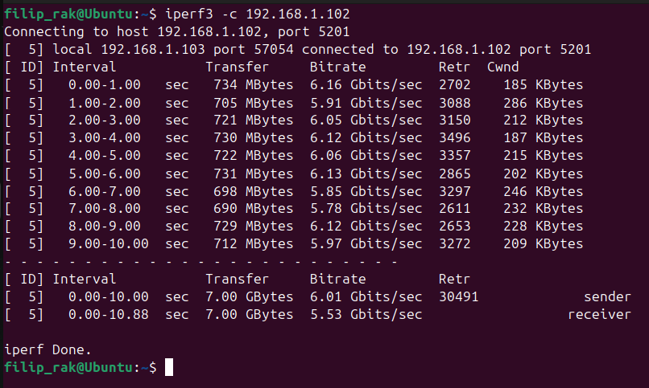
- Utworzono nową sieć `docker network create jenkins-net`.
- Uruchomiono kontener jenkins-dind, zadaniem którego jest udostępnienie środowiska Docker, z którego kontener z Jenkinsem może korzystać do budowania, uruchamiania i zarządzania innymi kontenerami w ramach zadań CI/CD.
- Uruchomiono kontener jenkins z oficjalnego obrazu `jenkins/jenkins:lts`, podłączony do wcześniej utworzonej sieci `jenkins-net`. Kontener wystawia porty `8080` (interfejs webowy) oraz `50000` (dla agentów Jenkins). Dane konfiguracyjne Jenkinsa są przechowywane w woluminie `jenkins_home`, zamontowanym pod `/var/jenkins_home` w kontenerze.
- Udało się dostać do ekranu logowania na hoście maszyny wirtualnej. 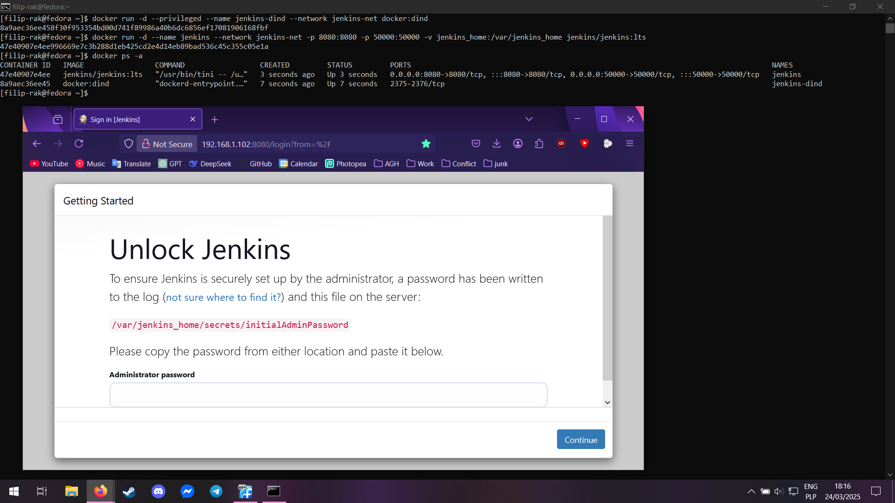
