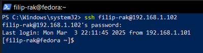
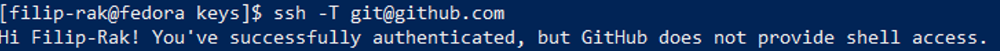

# Sprawozdanie z laboratoriów: SSH, GIT, Docker, Dockerfiles
Przedmiot: DevOps
Kierunek: Inżynieria Obliczeniowa
Autor: Filip Rak
Data: 10/03/2025

## Przebieg Ćwiczeń
### Pierwsze zajęcia (SSH, GIT):
- Na wirtualnej maszynie VirtualBox zainstalowana została dystrybucja systemu Linux, Fedora. 
- Na konto użytkonika zalogowano się przez SSH w programie PowerShell systemu Windows. 
- Na witrynie GitHub utworzono Personal Acces Token oraz wykorzystano go do sklonowania repozytorium.  
- Utworzone zostały dwa klucze SSH, nie będace typu RSA, z czego jeden z nich został zabezpieczony hasłem. Użyto polecenia: ```ssh-keygen -t ed25519 -C "ADRES-EMAIL.com"``` 
- Do SHH dodano utworzony klucz, poleceniem `ssh-add ./key_no_password` 
- Klucz publiczny został skopiowany z pliku o rozszerzeniu `.pub` i przekazany witrynie GitHub. 
- Autentyifkacja została potwierdzona poleceniem `ssh -T git@github.com` 
- Repozytorium zostało sklonowane poleceniem `git clone` 
- Utworzono nową gałąź kombinacją poleceń `git checkout GCL02` `git checkout -d FR417273`. Wewnątrz tej gałęzi utworozno katalog `mkdir FR417273`.
- Wewnątrz katalogu `.git/hooks` utworzono plik `commit-msg`, którego zadaniem jest weryfikacja i wymuszenie aby każdy przyszły commit zaczynał się inicjałami oraz numerem indeksu. Kopia pliku została przeniesiona do katalogu użytkownika. 
```#!/bin/sh
# Verify if commit message starts with the correct initials
string="[FR417273]"
if ! grep -q "^$string" "$1"; then
  echo "FAILED. Start commit message with $string."
  exit 1
fi
```

### Drugie zajęcia (Docker, Dockerfiles):
- Zainstalowano oprogramowanie Docker, na systemie Fedora, poprzez polecenie: `sudo dnf install -y docker`.
- Zarejestrowano się w witrynie `hub.docker.com`. .
- Pobrano obrazy: `hello-world`, `busybox`, `ubuntu`, `fedora`, `mysql`. Wykorzystano polecenie `docker pull [obraz]`. 
- Uruchomiono kontener z obrazu busybox, podłaczono się do niego interkatywnie i wywołano numer wersji systemu. 
- Uruchomiono kontener z obrazu systemu Ubuntu. Wyświetlono procesy w kontenerze w tym PID1: bash. Wyświetlono procesy dockera na hoście. [Zrzut ekranu pracy z obrazem ubutnu](media/m13_ubuntu.png)
- Ponownie uruchomiono kontener z obrazu ubuntu i wywołano aktualizacje pakietów poleceniami `apt update && apt upgrade -y` . 
- Utworzono własny plik Dockerfile bazujący na systemie fedora. Na tym obrazie zainstalowany zostaje git oraz skopiowane repozytorium przedmiotu. Poniżej znajduje się zawartość pliku Dockerfile
```
# Use fedora's image
FROM fedora:39

# Install git
RUN dnf update -y && dnf install -y git

# Set working directory
WORKDIR /repo

# Clone the repository
RUN git clone https://github.com/InzynieriaOprogramowaniaAGH/MDO2025_INO

# Set default command
CMD ["bash"]
```
- Obraz utworzono poleceniem: `docker build -t custom_image .`. Zweryfikowano następnie czy sklonowanie repozytorium udało się, poprzez otworzenie obrazu w trybie interaktywnym i weryfikacje manulaną. .
- Pokazanie działających kontenerów i usunięcie ich: 
- Usunięcie wszysktich obrazów dockera poleceniem: `docker rmi $(docker images -q)` 
- Utworzony plik Dockerfile został dodany do katalogu Sprawozdanie1 wewnątrz repozytorium na gałęzi `FR417273`.

### Trzecie zajęcia (Docker, Dockerfiles):
- Sklonowano repozytorium oprogramowania o otwartej licencji, [cJSON](https://github.com/DaveGamble/cJSON), zawierające działający Makefile, który ma zdefiniowany zestaw testów.
- Kompilacja odbyła się poleceniem `make`, zaś uruchomienie testó poleceniem `make test`. 
- Kolejnym zadaniem było powtórzenie tego procesu, tym razem w kontenerze. Uruchomiono kontener na podstawie obrazu ubuntu, w trybie interkatywnym, poleceniem `docker run -it --rm ubuntu bash`
- Następnie na uruchomionym kontenerze zainstalowane wszelkie zależności wymagane do dalszej pracy: git, make, gcc. Polecenie: `aptg-get update && apt-get install -y git make gcc`
- Repozytoriumn ponownie sklonowano, tym razem w ramach kontenera, poleceniem `git clone https://github.com/DaveGamble/cJSON.git` 
- Kolejnym zadaniem było utworzenie dwóch plików Dockerfile, których zadaniami będą kompilacja oraz uruchamiane testów, gdzie pierwszy obraz przygotowuje środowisko oraz kompiluje oprogramowanie a drugi obraz przeprowadza testy. W tym celu utworzono dwa pliki `Dockerfile.build` oraz `Dockerfile.test`. Ponizej znajdują się ich zawartości.

```
#### Dockerfile.build ####
FROM ubuntu:22.04
WORKDIR /app
RUN apt update
RUN apt-get -y install git make gcc
RUN git clone https://github.com/DaveGamble/cJSON.git
WORKDIR /app/cJSON
RUN make
CMD ["/bin/bash"]
```

```
#### Dockerfile.test ####
FROM cj-build
WORKDIR /app/cJSON
RUN mkdir logs && make test > logs/test_results.log
CMD ["/bin/bash"]
```
- Pliki zostały skompilowane jeden po drugim poleceniami `docker build -t cj-build -f Dockerfile.build .` oraz `docker build -t cj-test dockerfile.test .` 
- W celu werfyikacji poprawności uruchomiony został kontener na bazie obrazu do testowania `cj-test`, w trybie interaktywnym. Manulanie została zweryfikowana obecność pliku tekstowego z wydrukiem testu. 
