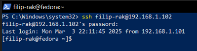
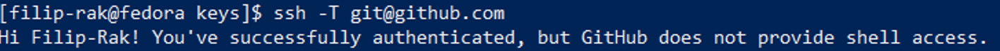
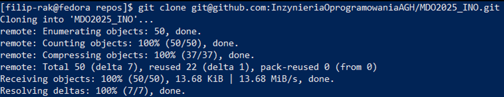
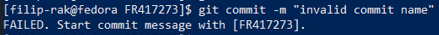

# Sprawozdanie z laboratoriów: SSH, GIT, Docker, Dockerfiles
Przedmiot: DevOps
Kierunek: Inżynieria Obliczeniowa
Autor: Filip Rak
Data: 10/03/2025

## Przebieg Ćwiczeń
### Pierwsze zajęcia:
- Na wirtualnej maszynie VirtualBox zainstalowana została dystrybucja systemu Linux, Fedora. 
- Na konto użytkonika zalogowano się przez SSH w programie PowerShell systemu Windows. 
- Utworzone zostały dwa klucze SSH, nie będace typu RSA, z czego jeden z nich został zabezpieczony hasłem. Użyto polecenia: ```ssh-keygen -t ed25519 -C "ADRES-EMAIL.com"``` 
- Do SHH dodano utworzony klucz, poleceniem ```ssh-add ./key_no_password``` 
- Klucz publiczny został skopiowany z pliku o rozszerzeniu `.pub` i przekazany witrynie GitHub. 
- Autentyifkacja zostałą potweirdzona poleceniem `ssh -T git@github.com` 
- Repozytorium zostało sklonowane poleceniem `git clone` 
- Utworzono nową gałąź kombinacją poleceń `git checkout GCL02` `git checkout -d FR417273`. Wewnątrz tej gałęzi utworozno katalog `mkdir FR417273`.
- Wewnątrz katalogu `.git/hooks` utworzono plik `commit-msg`, którego zadaniem jest weryfikacja i wymuszenie aby każdy przyszły commit zaczynał się inicjałami oraz numerem indeksu. Kopia pliku została przeniesiona do katalogu użytkownika. 
```#!/bin/sh
# Verify if commit message starts with the correct initials
string="[FR417273]"
if ! grep -q "^$string" "$1"; then
  echo "FAILED. Start commit message with $string."
  exit 1
fi
```
