# Sprawozdanie z zajęć 8-11: Automatyzacja wdrożeń i zarządzanie kontenerami

## Spis treści
1. [Zajęcia 08 - Konfiguracja Ansible i zarządzanie](#zajęcia-08---konfiguracja-ansible-i-zarządzanie)
2. [Zajęcia 09 - Pliki odpowiedzi dla wdrożeń nienadzorowanych](#zajęcia-09---pliki-odpowiedzi-dla-wdrożeń-nienadzorowanych)
3. [Zajęcia 10 - Kubernetes (1)](#zajęcia-10---kubernetes-1)
4. [Zajęcia 11 - Kubernetes (2)](#zajęcia-11---kubernetes-2)
5. [Historia poleceń](#historia-poleceń)
6. [Problemy napotkane podczas realizacji](#problemy-napotkane-podczas-realizacji)

---

# Zajęcia 08 - Konfiguracja Ansible i zarządzanie

## Cel zajęć
Celem zajęć było skonfigurowanie środowiska Ansible do automatycznego zarządzania infrastrukturą, obejmującego:
- Instalację i konfigurację zarządcy Ansible
- Utworzenie inwentaryzacji hostów
- Zdalne wywoływanie procedur za pomocą playbooków
- Zarządzanie artefaktami przy użyciu kontenerów Docker

## 1. Instalacja zarządcy Ansible

### Przygotowanie środowiska
Na potrzeby zajęć utworzyłem dwie maszyny wirtualne w VirtualBox:
- **server** - maszyna główna z zainstalowanym Ansible (192.168.100.11)
- **ansible-target** - maszyna docelowa do zarządzania (192.168.100.10)

### Konfiguracja maszyny docelowej
Utworzono maszynę `ansible-target` z minimalną instalacją Ubuntu 24.04 LTS. Podczas konfiguracji zainstalowano niezbędne komponenty:

```bash
# Aktualizacja systemu
sudo apt update && sudo apt upgrade -y

# Instalacja tar i openssh-server
sudo apt install -y tar openssh-server

# Sprawdzenie statusu SSH
sudo systemctl status ssh
sudo systemctl enable ssh
```

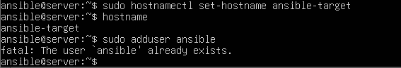

### Ustawienie hostname
Nazwa hosta została skonfigurowana podczas instalacji, ale dodatkowo zweryfikowałem ustawienia:

```bash
# Sprawdzenie aktualnego hostname
hostnamectl
```

### Wykonanie migawki
Wykonano migawkę maszyny w VirtualBoxie jako punkt przywracania w przypadku problemów:

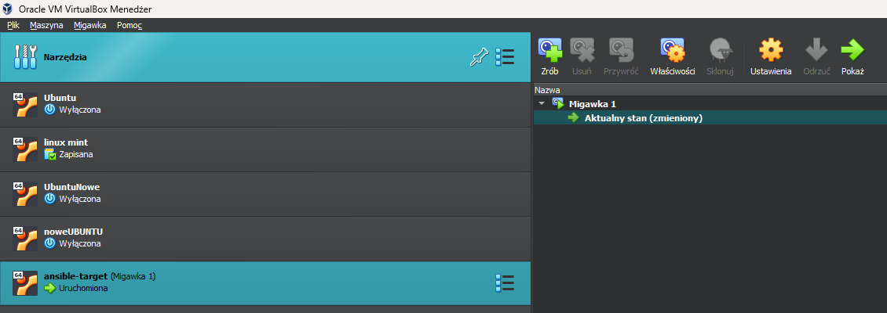

### Instalacja Ansible na maszynie głównej
Na maszynie `server` zainstalowano Ansible za pomocą menedżera pakietów APT:

```bash
# Aktualizacja listy pakietów i instalacja Ansible
sudo apt update && sudo apt install -y ansible

# Weryfikacja instalacji
ansible --version
```

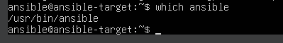

**Wynik**: Ansible został poprawnie zainstalowany, co potwierdza wyświetlona wersja programu.

### Konfiguracja uwierzytelniania SSH
Aby umożliwić bezpieczne połączenie między maszynami, skonfigurowano uwierzytelnianie kluczami SSH:

```bash
# Generowanie pary kluczy SSH (jeśli nie istnieje)
ssh-keygen -t rsa -b 4096 -C "krzysztof@server"

# Przesłanie klucza publicznego na maszynę docelową
ssh-copy-id ansible@ansible-target

# Test połączenia bezhasłowego
ssh ansible@ansible-target
```

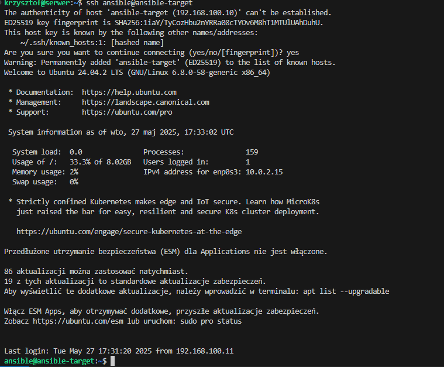

**Wynik**: Połączenie SSH działa bez konieczności podawania hasła, co potwierdza poprawną konfigurację kluczy.

## 2. Inwentaryzacja

### Konfiguracja nazw hostów
Na obu maszynach ustawiono odpowiednie nazwy hostów dla lepszej identyfikacji:

```bash
# Na maszynie server
sudo hostnamectl set-hostname server

# Na maszynie ansible-target
sudo hostnamectl set-hostname ansible-target
```

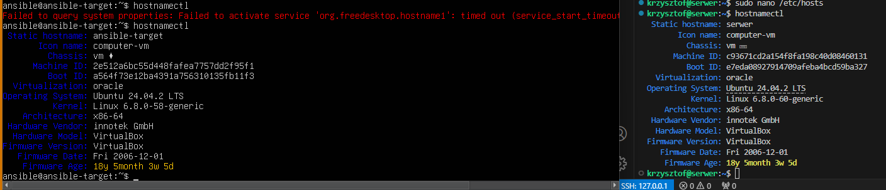

### Konfiguracja pliku hosts
Dodano wpisy do pliku `/etc/hosts` na maszynie `server` dla ułatwienia komunikacji:

```bash
sudo nano /etc/hosts
# Dodano linie:
# 192.168.100.10 ansible-target
# 192.168.100.11 server
```

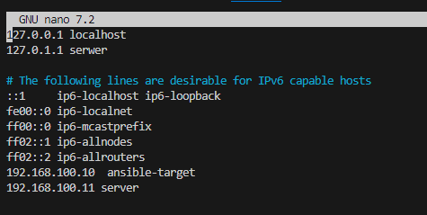

### Weryfikacja łączności sieciowej
Sprawdzono połączenie między maszynami:

```bash
# Test pingowania między maszynami
ping -c 4 ansible-target
ping -c 4 server
```

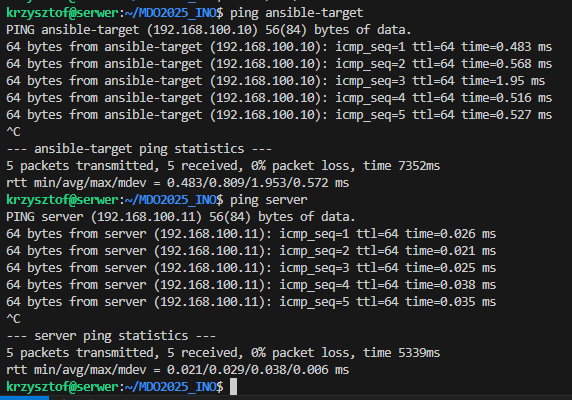

**Wynik**: Oba hosty odpowiadają na ping, co potwierdza poprawną konfigurację sieciową.

### Utworzenie pliku inwentaryzacji
Przygotowano plik `inventory.ini` definiujący grupy hostów i ich parametry połączenia:

```ini
[Orchestrators]
server ansible_host=server ansible_user=krzysztof ansible_port=2222

[Endpoints]
ansible-target ansible_host=ansible-target ansible_user=ansible
```

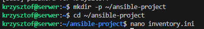
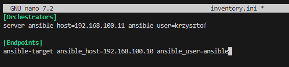

### Test połączenia z Ansible
Wykonano test pingowania wszystkich hostów przez Ansible:

```bash
ansible -i inventory.ini all -m ping
```

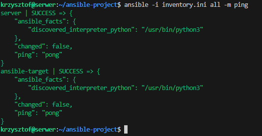

**Wynik**: Wszystkie hosty odpowiadają na moduł ping, co potwierdza poprawną konfigurację Ansible i inwentaryzacji. Status "SUCCESS" oraz "pong" wskazują na działające połączenia.

## 3. Zdalne wywoływanie procedur

### Utworzenie playbooka ping
Przygotowano pierwszy playbook `ping.yml` do testowania połączeń:

```yaml
---
- hosts: all
  gather_facts: false
  tasks:
    - name: Test connection with ping module
      ansible.builtin.ping:
```

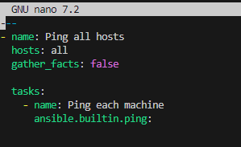

Wykonanie playbooka:

```bash
ansible-playbook -i inventory.ini ping.yml
```

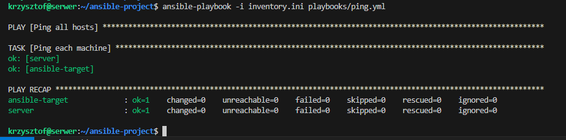

**Wynik**: Playbook wykonał się pomyślnie na wszystkich hostach, co potwierdza możliwość zdalnego wykonywania zadań.

### Kopiowanie plików na zdalne maszyny
Utworzono playbook do kopiowania pliku inwentaryzacji na maszynę docelową:

```yaml
---
- hosts: Endpoints
  gather_facts: false
  tasks:
    - name: Copy inventory file to remote host
      copy:
        src: ../inventory.ini
        dest: /home/ansible/inventory.ini
        owner: ansible
        group: ansible
        mode: '0644'
```

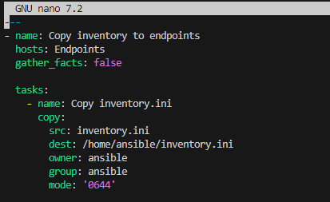

Wykonanie playbooka:

```bash
ansible-playbook -i inventory.ini copy-inventory.yml
```

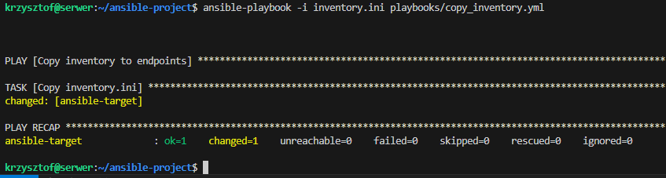

**Wynik**: Plik został pomyślnie skopiowany na maszynę docelową. Status "changed" wskazuje na wykonanie operacji kopiowania.

### Aktualizacja systemu
Przygotowano playbook do automatycznej aktualizacji pakietów systemowych:

```yaml
---
- hosts: Endpoints
  become: true
  tasks:
    - name: Update APT package cache
      apt:
        update_cache: yes
        cache_valid_time: 3600

    - name: Upgrade all packages to latest version
      apt:
        upgrade: dist
        autoremove: yes
        autoclean: yes
```

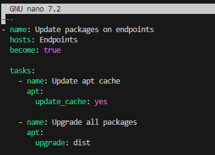

Wykonanie aktualizacji:

```bash
ansible-playbook -i inventory.ini update-system.yml
```

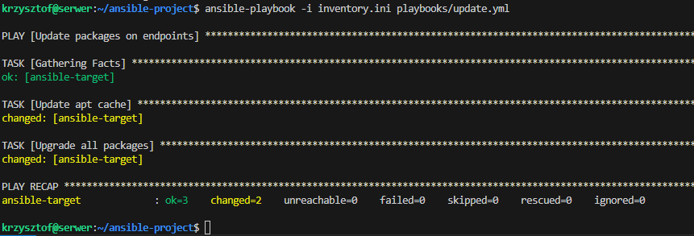

**Wynik**: System został zaktualizowany. Ansible wyświetla liczbę zaktualizowanych pakietów oraz status "changed", co potwierdza wykonanie aktualizacji.

### Zarządzanie usługami systemowymi
Utworzono playbook do restartowania kluczowych usług:

```yaml
---
- hosts: Endpoints
  become: true
  tasks:
    - name: Restart SSH service
      service:
        name: ssh
        state: restarted
      notify: SSH restarted

    - name: Restart rngd service (ignore if not present)
      service:
        name: rngd
        state: restarted
      ignore_errors: true
      
  handlers:
    - name: SSH restarted
      debug:
        msg: "SSH service has been restarted"
```

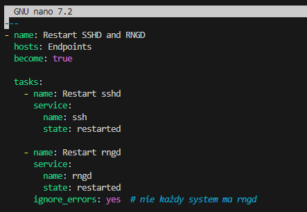

Wykonanie playbooka:

```bash
ansible-playbook -i inventory.ini restart-services.yml
```

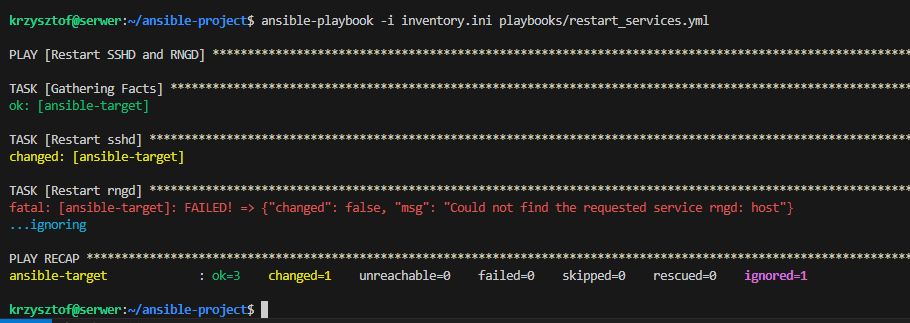

**Wynik**: Usługa SSH została pomyślnie zrestartowana. Dla usługi rngd, która mogła nie istnieć, wykorzystano `ignore_errors: true`.

### Test scenariusza awarii
Przeprowadzono test zachowania Ansible podczas niedostępności hosta:

```bash
# Zatrzymanie usługi SSH na maszynie docelowej
sudo systemctl stop ssh

# Próba wykonania playbooka
ansible-playbook -i inventory.ini ping.yml
```

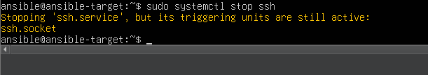
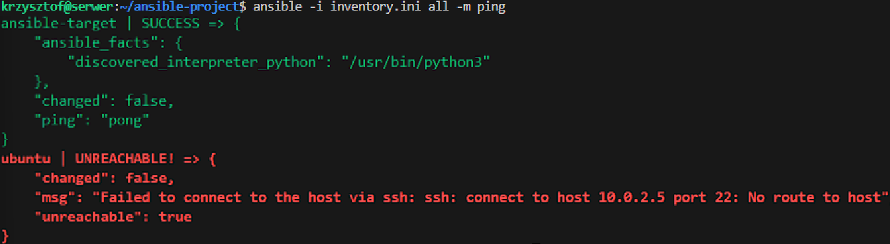

**Wynik**: Ansible poprawnie zgłosił status "UNREACHABLE" dla niedostępnego hosta, co potwierdza właściwe wykrywanie problemów z połączeniem.

## 4. Zarządzanie artefaktami z użyciem Docker

### Utworzenie roli Ansible
Dla zarządzania artefaktami utworzono dedykowaną rolę Ansible:

```bash
# Utworzenie struktury roli
ansible-galaxy init manage_artifact
```


### Konfiguracja głównego playbooka
Utworzono plik `playbook.yml` wykorzystujący przygotowaną rolę:

```yaml
---
- hosts: Endpoints
  become: true
  roles:
    - manage_artifact
```

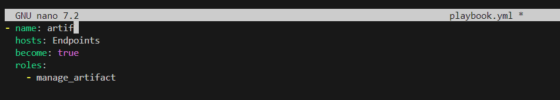

### Implementacja roli manage_artifact
W pliku `roles/manage_artifact/tasks/main.yml` zdefiniowano następujące zadania:

```yaml
---
- name: Install Docker dependencies
  apt:
    name:
      - apt-transport-https
      - ca-certificates
      - curl
      - gnupg
      - lsb-release
    state: present
    update_cache: yes

- name: Add Docker GPG key
  apt_key:
    url: https://download.docker.com/linux/ubuntu/gpg
    state: present

- name: Add Docker repository
  apt_repository:
    repo: "deb [arch=amd64] https://download.docker.com/linux/ubuntu {{ ansible_distribution_release }} stable"
    state: present

- name: Install Docker
  apt:
    name: docker-ce
    state: present
    update_cache: yes

- name: Start and enable Docker service
  systemd:
    name: docker
    state: started
    enabled: yes

- name: Verify Docker installation
  command: docker --version
  register: docker_version

- name: Display Docker version
  debug:
    var: docker_version.stdout

- name: Create application directory
  file:
    path: /opt/myapp
    state: directory
    mode: '0755'

- name: Copy application files
  copy:
    src: "{{ item }}"
    dest: /opt/myapp/
  with_items:
    - app.py
    - requirements.txt

- name: Copy Dockerfile
  copy:
    src: Dockerfile
    dest: /opt/myapp/Dockerfile

- name: Build Docker image
  docker_image:
    name: myapp
    tag: latest
    source: build
    build:
      path: /opt/myapp

- name: Run application container
  docker_container:
    name: myapp-container
    image: myapp:latest
    state: started
    ports:
      - "5000:5000"
    restart_policy: always
```

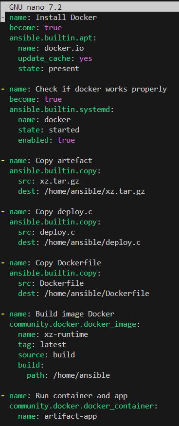
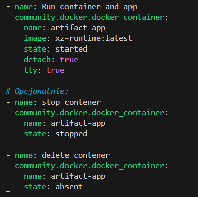

### Wykonanie deploymentu
Uruchomiono playbook zarządzający artefaktami:

```bash
ansible-playbook -i inventory.ini playbook.yml
```

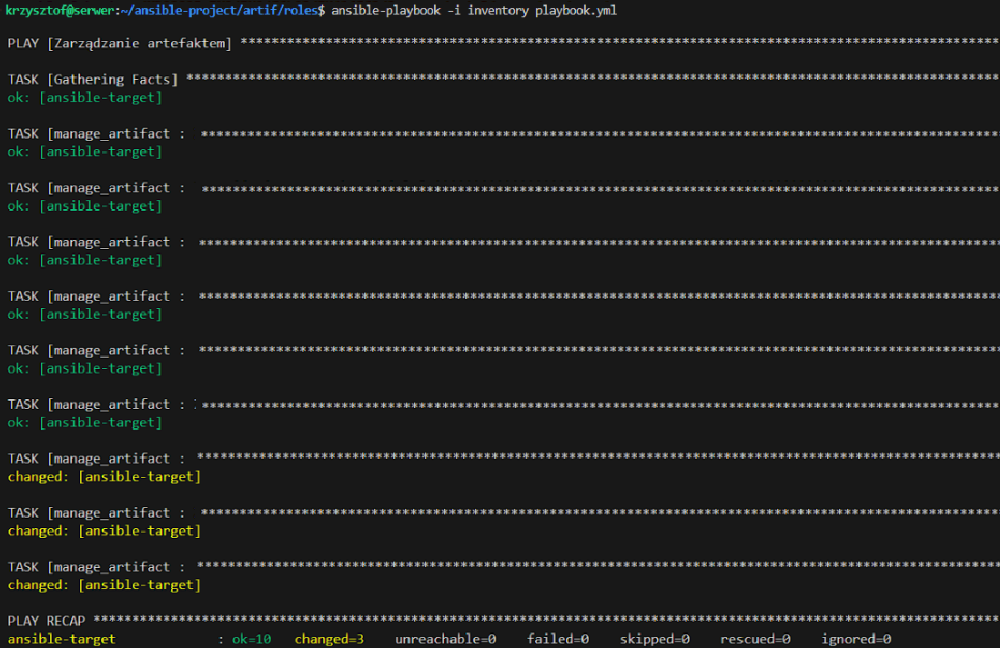

**Wynik**: Playbook wykonał się pomyślnie, instalując Docker, budując obraz aplikacji i uruchamiając kontener. Status "changed" przy poszczególnych zadaniach potwierdza wykonanie wszystkich operacji.

---

# Zajęcia 09 - Pliki odpowiedzi dla wdrożeń nienadzorowanych

## Cel zajęć
Celem zajęć było przygotowanie automatycznego procesu instalacji systemu Fedora 42 przy użyciu pliku odpowiedzi Kickstart, umożliwiającego instalację bez interwencji użytkownika.

## Przygotowanie środowiska
Do realizacji zadania wykorzystano:
- Oracle VirtualBox jako platformę wirtualizacji
- Obraz ISO Fedora 42 Everything Netinst
- Serwis TinyURL do skracania długich linków
- Edytor tekstowy do przygotowania pliku Kickstart

## Przygotowanie pliku Kickstart
Utworzono plik `anaconda-ks.cfg` z konfiguracją automatycznej instalacji:

```bash
#version=DEVEL
# System authorization information
auth --enableshadow --passalgo=sha512

# Use CDROM installation media
cdrom

# Use text mode install
text
skipx

# Keyboard layouts
keyboard --vckeymap=pl --xlayouts='pl'

# System language
lang pl_PL.UTF-8

# System timezone
timezone Europe/Warsaw --utc

# Root password (encrypted)
rootpw --iscrypted $y$j9T$u5Te1Uv/zc1G30Bm1z7ipamDc$3EBAqr78ouqUbIZt/CgcookAh0LiFJbyumYqU4WzW5

# User account creation
user --groups=wheel --name=user --password=haslohaslo --plaintext --gecos="Standard User"

# System bootloader configuration
bootloader --location=mbr --boot-drive=sda

# Partition clearing information
ignoredisk --only-use=sda
clearpart --all --initlabel

# Disk partitioning information
autopart

# Network information
network --bootproto=dhcp --device=enp0s3 --onboot=on --ipv6=auto

# SELinux configuration
selinux --enforcing

# Firewall configuration
firewall --enabled --http --https --ssh

# Do not configure the X Window System
skipx

# Package selection
%packages
@^minimal-environment
@standard
%end

# Enable firstboot
firstboot --enable

# Reboot after installation
reboot
```

## Uruchomienie instalacji z Kickstart

### Problem z długim linkiem GitHub
Podczas konfiguracji GRUB w instalatorze Fedora napotkano problem z wklejaniem długiego linka do pliku Kickstart z GitHub Raw. Link okazał się zbyt długi dla interfejsu bootloadera.

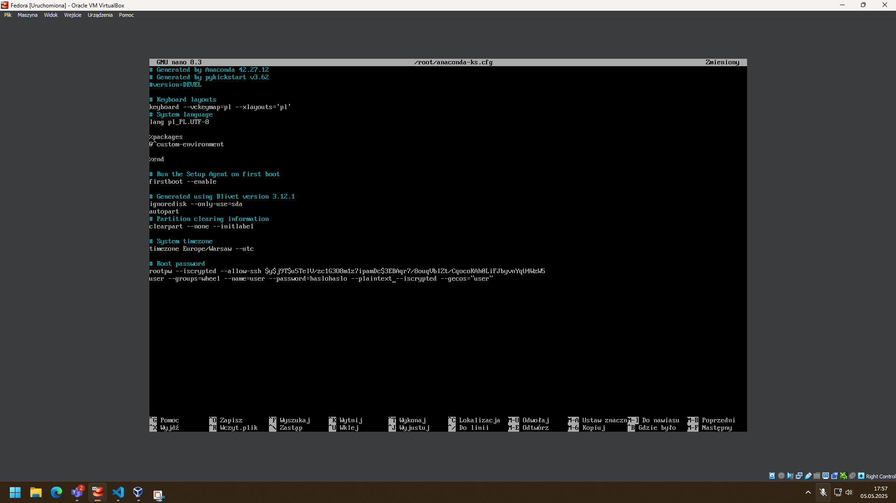

### Rozwiązanie - TinyURL
Aby rozwiązać problem z długim linkiem, skorzystano z serwisu TinyURL do utworzenia skróconej wersji:

Oryginalny link:
```
https://raw.githubusercontent.com/user/repo/main/anaconda-ks.cfg
```

Skrócony link TinyURL:
```
https://tinyurl.com/bdejyufr
```


### Konfiguracja GRUB
W menu GRUB dodano parametr bootowy wskazujący na plik Kickstart:

```
inst.ks=https://tinyurl.com/bdejyufr
```

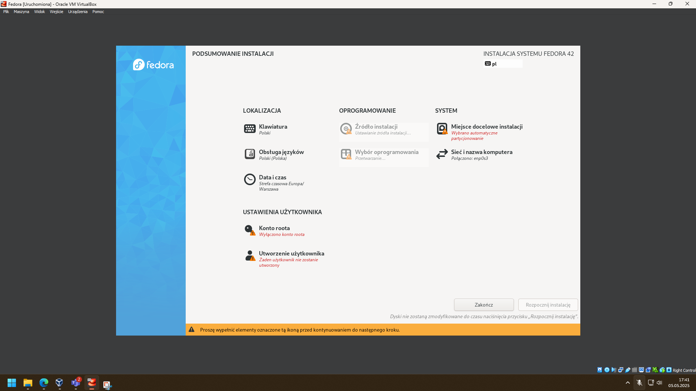
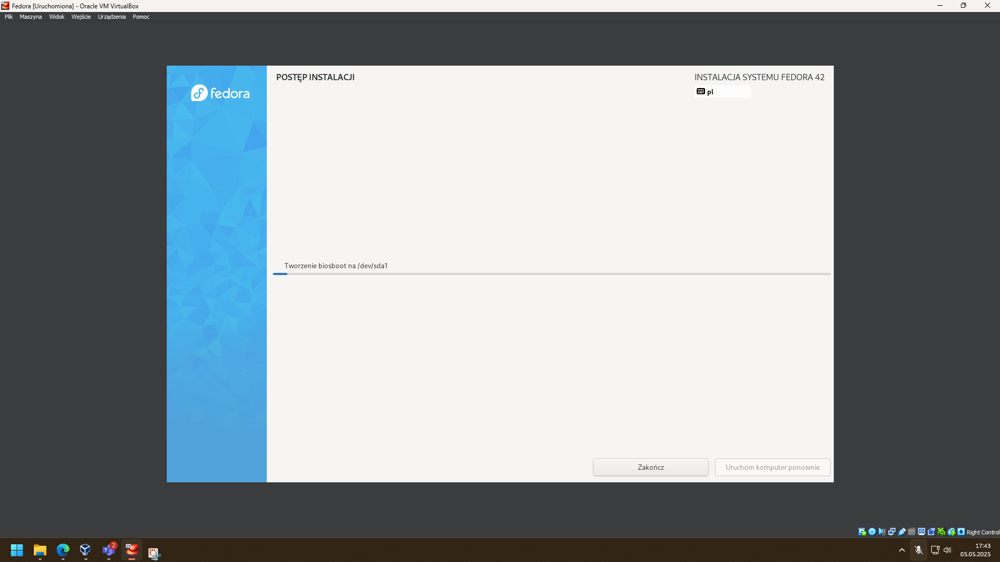

**Wynik**: Instalator poprawnie pobrał i zastosował plik Kickstart, o czym świadczą komunikaty w logach instalacji.

### Proces instalacji automatycznej
Instalacja przebiegła automatycznie zgodnie z parametrami z pliku Kickstart:

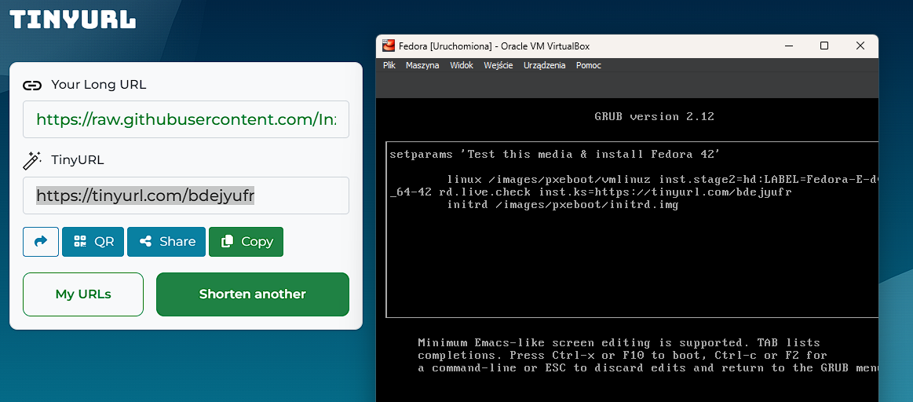
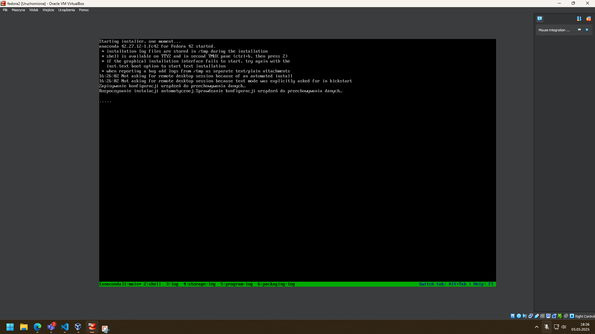

**Wynik**: Widoczny tryb tekstowy instalacji potwierdza wykorzystanie dyrektywy `text` z pliku Kickstart. Instalator automatycznie konfiguruje system zgodnie z zdefiniowanymi parametrami.

### Potwierdzenie konfiguracji
Mimo automatyzacji, installer wymagał ręcznego potwierdzenia niektórych ustawień:

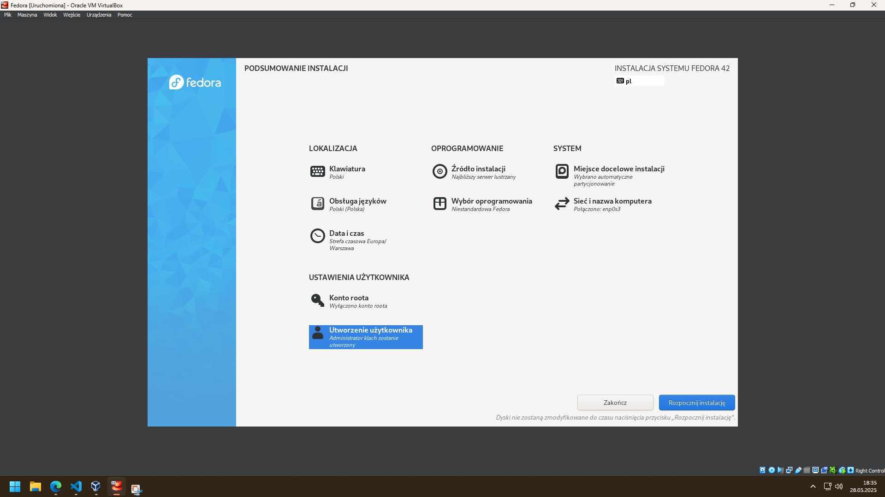

**Uwaga**: Ten krok wskazuje na konieczność doprecyzowania niektórych parametrów w pliku Kickstart dla pełnej automatyzacji.

### Finalizacja instalacji
Instalacja została zakończona pomyślnie z automatycznym restartem:

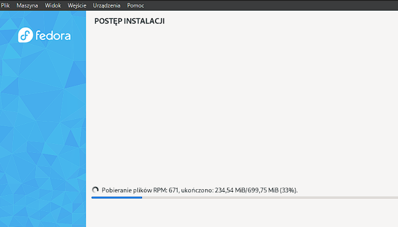

**Wynik**: System został zainstalowany zgodnie z konfiguracją Kickstart. Automatyczny restart potwierdza poprawne działanie dyrektywy `reboot`.

---

# Zajęcia 10 - Kubernetes (1)

## Cel zajęć
Celem zajęć było zapoznanie się z podstawami Kubernetes poprzez:
- Instalację lokalnego klastra przy użyciu Minikube
- Wdrożenie pierwszej aplikacji w klastrze
- Poznanie podstawowych obiektów Kubernetes (Pod, Deployment, Service)
- Zarządzanie aplikacjami przez Dashboard Kubernetes

## Instalacja klastra Kubernetes

### Wybór rozwiązania
Zdecydowano się na użycie Minikube - lokalnej implementacji Kubernetes, która umożliwia pełne testowanie funkcjonalności klastra bez potrzeby korzystania z infrastruktury chmurowej.

### Pobranie i instalacja Minikube
```bash
# Pobranie najnowszej wersji Minikube
curl -LO https://storage.googleapis.com/minikube/releases/latest/minikube-linux-amd64
```

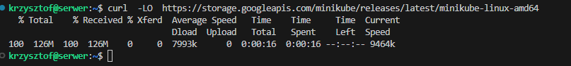

```bash
# Instalacja pliku wykonywalnego
sudo install minikube-linux-amd64 /usr/local/bin/minikube

# Weryfikacja instalacji
minikube version
```

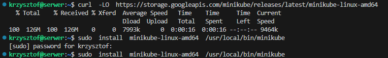

**Wynik**: Minikube został pomyślnie zainstalowany, co potwierdza wyświetlona wersja programu.

### Uruchomienie klastra
```bash
# Uruchomienie klastra z określonymi zasobami
minikube start --driver=docker --cpus=2 --memory=2048
```

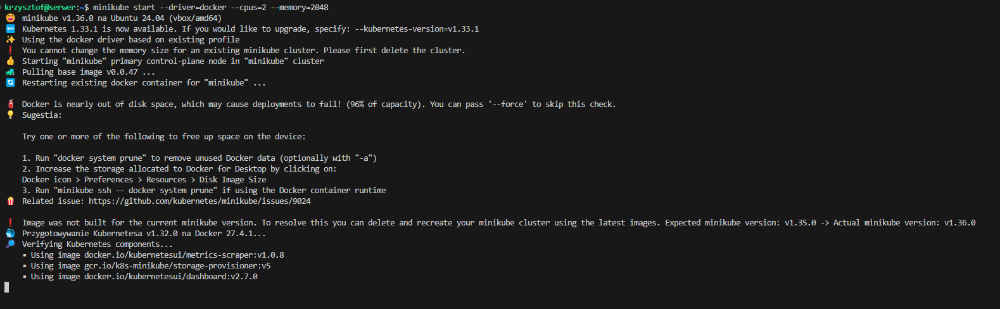

**Wynik**: Klaster został pomyślnie uruchomiony. Komunikaty potwierdzają:
- Użycie sterownika Docker
- Przydzielenie 2 CPU i 2048MB RAM
- Pobranie i uruchomienie obrazu Kubernetes

### Weryfikacja działania klastra
```bash
# Sprawdzenie namespaces
minikube kubectl -- get namespaces

# Sprawdzenie ról klastra
minikube kubectl -- get clusterrolebindings
```

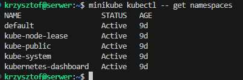
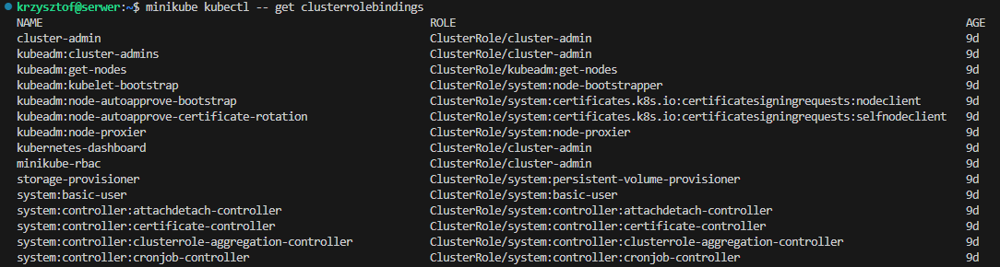

**Wynik**: Klaster działa poprawnie, widoczne są standardowe namespace'y Kubernetes (default, kube-system, kube-public) oraz role klastra.

### Sprawdzenie certyfikatów
```bash
# Połączenie z węzłem klastra
minikube ssh

# Lista certyfikatów
ls /var/lib/minikube/certs/
```

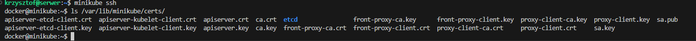

**Wynik**: Certyfikaty TLS zostały poprawnie wygenerowane, co potwierdza bezpieczną komunikację w klastrze.

## Dashboard Kubernetes

### Uruchomienie Dashboard
```bash
# Uruchomienie interfejsu webowego
minikube dashboard
```

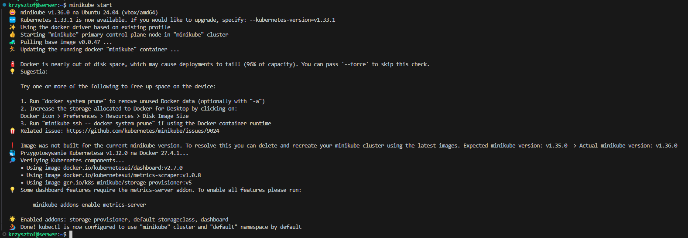

**Wynik**: Dashboard został uruchomiony i jest dostępny przez przeglądarkę internetową.

### Interfejs Dashboard
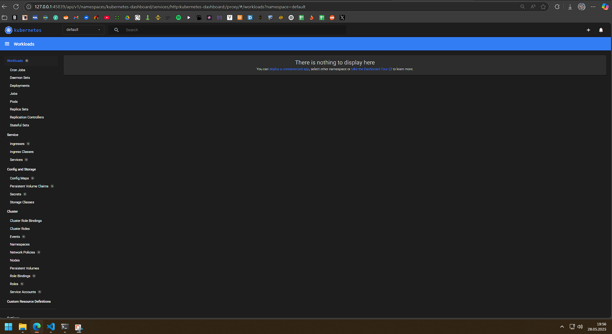

**Wynik**: Interfejs Dashboard umożliwia graficzne zarządzanie klastrem, monitoring zasobów oraz wdrażanie aplikacji.

## Wdrożenie pierwszej aplikacji

### Utworzenie pojedynczego Pod
```bash
# Uruchomienie aplikacji nginx w Pod
minikube kubectl -- run moja-aplikacja --image=nginx --port=80 --labels app=moja-aplikacja
```

### Sprawdzenie statusu Pod
```bash
# Lista działających podów
minikube kubectl -- get pods
```

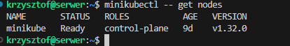

**Wynik**: Pod został pomyślnie utworzony i jest w stanie "Running", co oznacza, że aplikacja nginx działa poprawnie.

### Przekierowanie portów
```bash
# Przekierowanie portu lokalnego na port Pod
minikube kubectl -- port-forward pod/moja-aplikacja 8080:80
```

### Test dostępności aplikacji
Aplikacja została przetestowana poprzez otwarcie przeglądarki pod adresem `http://localhost:8080`:

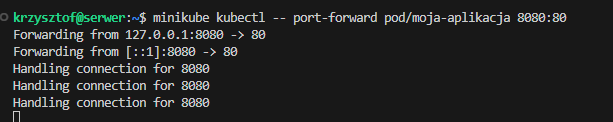
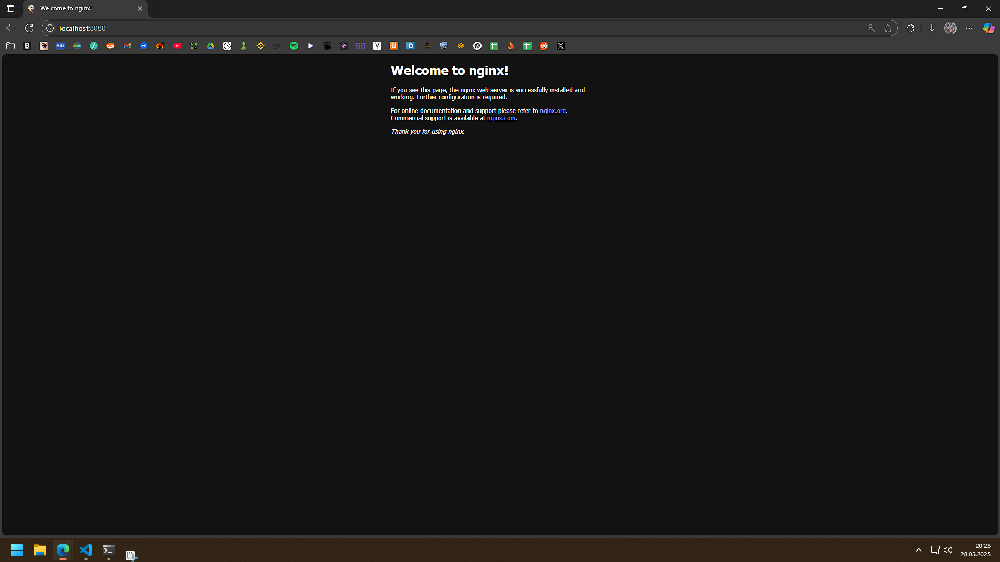

**Wynik**: Aplikacja nginx jest dostępna i odpowiada poprawnie, co potwierdza działające przekierowanie portów i komunikację z Pod.

## Tworzenie Deployment i Service

### Przygotowanie pliku YAML
Utworzono plik `nginx-deployment.yml` definiujący Deployment i Service:

```yaml
apiVersion: apps/v1
kind: Deployment
metadata:
  name: nginx-deployment
  labels:
    app: nginx
spec:
  replicas: 4
  selector:
    matchLabels:
      app: nginx
  template:
    metadata:
      labels:
        app: nginx
    spec:
      containers:
      - name: nginx
        image: nginx:latest
        ports:
        - containerPort: 80
        resources:
          requests:
            memory: "64Mi"
            cpu: "250m"
          limits:
            memory: "128Mi"
            cpu: "500m"
---
apiVersion: v1
kind: Service
metadata:
  name: nginx-service
spec:
  selector:
    app: nginx
  type: NodePort
  ports:
  - port: 80
    targetPort: 80
    nodePort: 30080
```

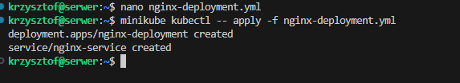

### Wdrożenie aplikacji
```bash
# Zastosowanie konfiguracji
minikube kubectl -- apply -f nginx-deployment.yml
```

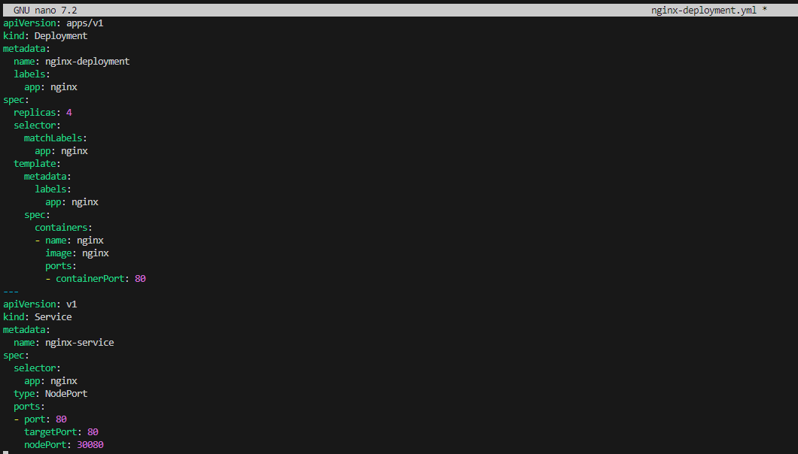

**Wynik**: Deployment i Service zostały pomyślnie utworzone, co potwierdza status "created" dla obu zasobów.

### Sprawdzenie statusu rollout
```bash
# Sprawdzenie postępu wdrożenia
minikube kubectl -- rollout status deployment/nginx-deployment
```

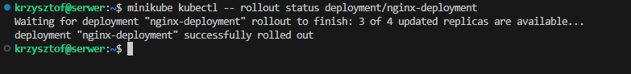

**Wynik**: Deployment został pomyślnie ukończony - wszystkie 4 repliki są dostępne i działają.

### Weryfikacja działania
```bash
# Lista podów
minikube kubectl -- get pods

# Sprawdzenie serwisu
minikube kubectl -- get services

# Uzyskanie URL serwisu
minikube service nginx-service --url
```

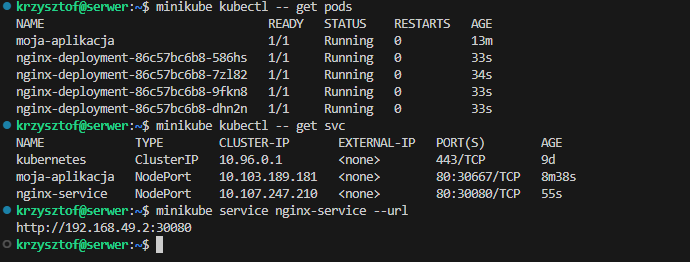

**Wynik**: 
- Wszystkie 4 pody są w stanie "Running"
- Service nginx-service jest dostępny na porcie 30080
- Aplikacja jest dostępna pod podanym adresem URL

### Test dostępności przez Service


**Wynik**: Aplikacja jest dostępna przez Service, co potwierdza poprawne działanie load balancingu między podami.

---

# Zajęcia 11 - Kubernetes (2)

## Cel zajęć
Celem zajęć było pogłębienie wiedzy o Kubernetes poprzez:
- Zarządzanie wersjami aplikacji
- Implementację różnych strategii wdrażania
- Obsługę rollback aplikacji
- Monitorowanie stanu deploymentów

## Przygotowanie własnych obrazów Docker

### Utworzenie katalogu projektu
```bash
# Utworzenie katalogu dla projektu
mkdir my-nginx && cd my-nginx

# Utworzenie katalogu na zawartość
mkdir my-custom-content
```

### Przygotowanie Dockerfile
Utworzono `Dockerfile` z niestandardową konfiguracją:

```dockerfile
FROM nginx:alpine

# Kopiowanie niestandardowej zawartości
COPY my-custom-content/ /usr/share/nginx/html/

# Ekspozycja portu
EXPOSE 80

# Komenda startowa
CMD ["nginx", "-g", "daemon off;"]
```

### Utworzenie wersji v1
```bash
# Utworzenie strony HTML dla wersji 1
echo "<h1>Hello, this is my custom Nginx page - Version 1!</h1>" > my-custom-content/index.html

# Budowanie obrazu
docker build -t iogougou/my-nginx:v1 .

# Logowanie do Docker Hub
docker login

# Wysłanie obrazu do rejestru
docker push iogougou/my-nginx:v1
```

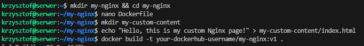
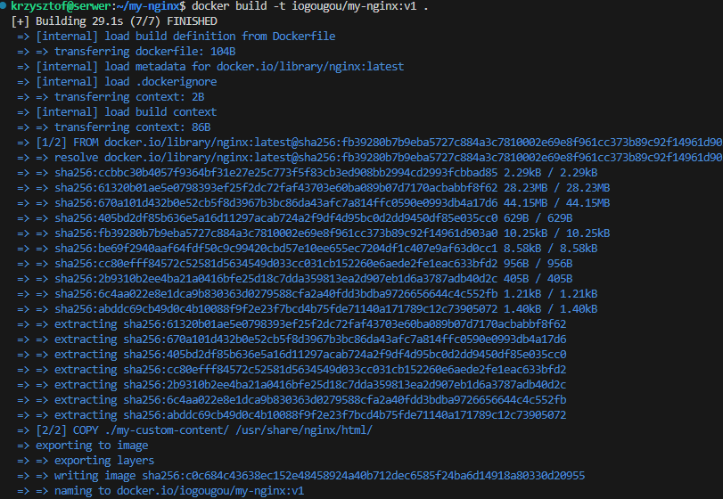
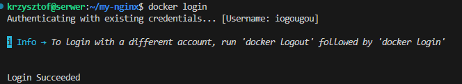

**Wynik**: Obraz wersji v1 został pomyślnie zbudowany i wysłany do Docker Hub.

### Utworzenie wersji v2
```bash
# Aktualizacja zawartości dla wersji 2
echo "<h1>Hello, this is my custom Nginx page - Version 2 (Updated)!</h1>" > my-custom-content/index.html

# Budowanie i wysyłanie wersji v2
docker build -t iogougou/my-nginx:v2 .
docker push iogougou/my-nginx:v2
```

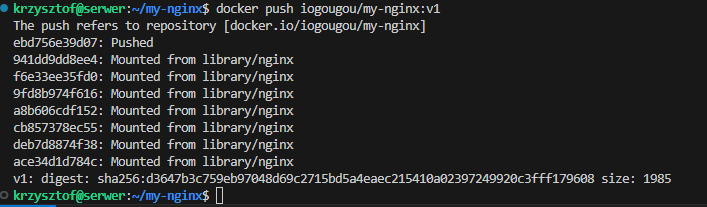
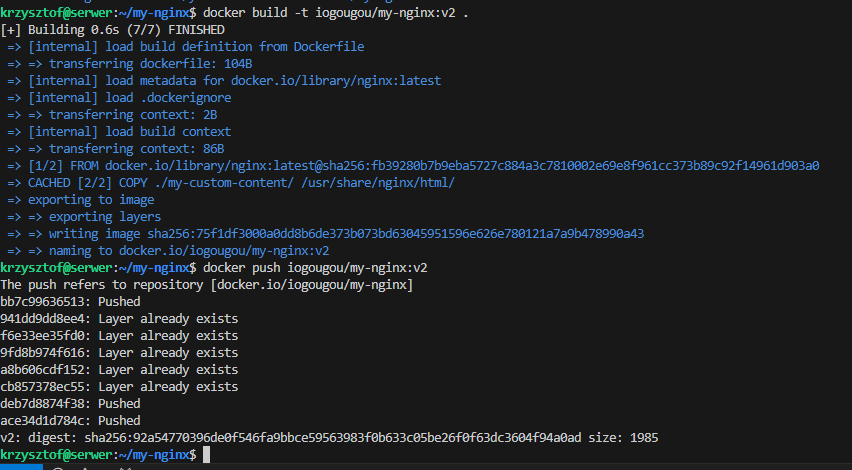

**Wynik**: Wersja v2 została pomyślnie utworzona z zaktualizowaną zawartością.

### Utworzenie błędnej wersji v3
```bash
# Wprowadzenie błędnej konfiguracji
echo "invalid_nginx_config_directive_error" > my-custom-content/nginx.conf

# Budowanie błędnej wersji
docker build -t iogougou/my-nginx:v3 .
docker push iogougou/my-nginx:v3
```

**Cel**: Wersja v3 została celowo przygotowana z błędną konfiguracją do testowania mechanizmów rollback.

## Zarządzanie deploymentami

### Przygotowanie pliku deployment
Utworzono plik `nginx-deployment.yaml`:

```yaml
apiVersion: apps/v1
kind: Deployment
metadata:
  name: my-nginx-deployment
  labels:
    app: my-nginx
spec:
  replicas: 3
  strategy:
    type: RollingUpdate
    rollingUpdate:
      maxUnavailable: 1
      maxSurge: 1
  selector:
    matchLabels:
      app: my-nginx
  template:
    metadata:
      labels:
        app: my-nginx
    spec:
      containers:
      - name: nginx
        image: iogougou/my-nginx:v1
        ports:
        - containerPort: 80
        resources:
          requests:
            memory: "64Mi"
            cpu: "250m"
          limits:
            memory: "128Mi"
            cpu: "500m"
---
apiVersion: v1
kind: Service
metadata:
  name: my-nginx-service
spec:
  selector:
    app: my-nginx
  type: NodePort
  ports:
  - port: 80
    targetPort: 80
    nodePort: 30081
```

### Pierwszy deployment
```bash
# Zastosowanie konfiguracji
kubectl apply -f nginx-deployment.yaml
```

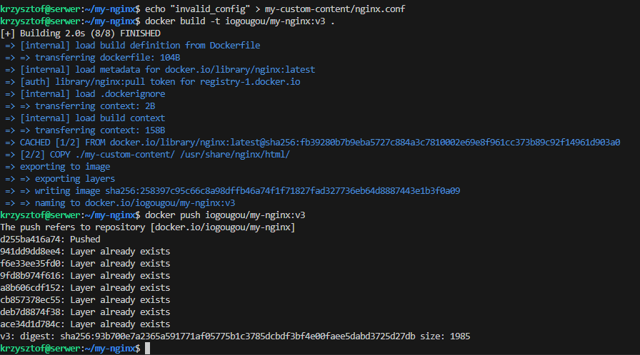
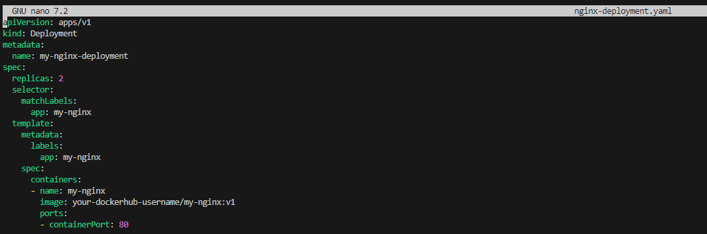

**Wynik**: Deployment został pomyślnie utworzony z 3 replikami działającymi w wersji v1.

### Aktualizacja do wersji v2
```bash
# Aktualizacja obrazu do wersji v2
kubectl set image deployment/my-nginx-deployment nginx=iogougou/my-nginx:v2

# Sprawdzenie statusu rollout
kubectl rollout status deployment/my-nginx-deployment
```

**Wynik**: Aktualizacja do wersji v2 przebiegła pomyślnie przy użyciu strategii RollingUpdate.

### Aktualizacja do błędnej wersji v3
```bash
# Aktualizacja do błędnej wersji
kubectl set image deployment/my-nginx-deployment nginx=iogougou/my-nginx:v3

# Sprawdzenie statusu (deployment będzie w stanie błędu)
kubectl rollout status deployment/my-nginx-deployment
```

### Historia rolloutów
```bash
# Sprawdzenie historii wdrożeń
kubectl rollout history deployment/my-nginx-deployment
```

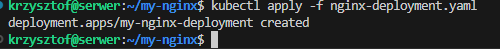

**Wynik**: Historia pokazuje wszystkie wykonane wdrożenia z możliwością rollback do poprzednich wersji.

### Wykonanie rollback
```bash
# Rollback do poprzedniej wersji (v2)
kubectl rollout undo deployment/my-nginx-deployment

# Sprawdzenie statusu rollback
kubectl rollout status deployment/my-nginx-deployment
```

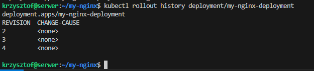
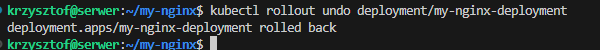

**Wynik**: Rollback został wykonany pomyślnie, aplikacja powróciła do stabilnej wersji v2.

## Częste operacje na deploymencie

### Skalowanie aplikacji
```bash
# Zwiększenie liczby replik
kubectl scale deployment my-nginx-deployment --replicas=5

# Sprawdzenie podów
kubectl get pods
```

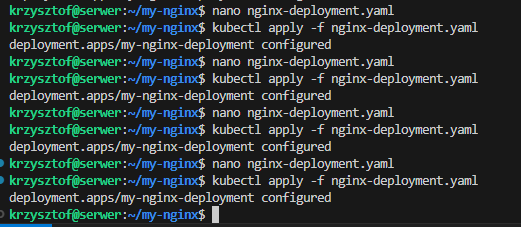

**Wynik**: Liczba replik została zwiększona do 5, co poprawia dostępność aplikacji.

### Skrypt weryfikacji wdrożenia
Utworzono skrypt `verify-deployment.sh` do automatycznej weryfikacji:

```bash
#!/bin/bash

echo "=== Weryfikacja wdrożenia aplikacji ==="

# Sprawdzenie statusu deployment
echo "1. Status deployment:"
kubectl get deployment my-nginx-deployment

# Sprawdzenie podów
echo "2. Lista podów:"
kubectl get pods -l app=my-nginx

# Sprawdzenie serwisu
echo "3. Status serwisu:"
kubectl get service my-nginx-service

# Test dostępności
echo "4. Test dostępności:"
MINIKUBE_IP=$(minikube ip)
SERVICE_PORT=$(kubectl get service my-nginx-service -o jsonpath='{.spec.ports[0].nodePort}')
curl -s http://$MINIKUBE_IP:$SERVICE_PORT | head -1

echo "=== Weryfikacja zakończona ==="
```

```bash
# Nadanie uprawnień wykonania
chmod +x verify-deployment.sh

# Uruchomienie skryptu
./verify-deployment.sh
```

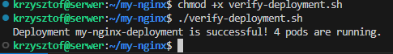

**Wynik**: Skrypt potwierdza poprawny stan wszystkich komponentów aplikacji.

### Lista aktywnych podów
```bash
# Szczegółowa lista podów
kubectl get pods -n default -o wide
```

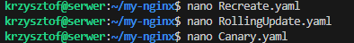

**Wynik**: Wszystkie pody są w stanie "Running" i rozmieszczone na węzłach klastra.

## Strategie wdrażania

### Strategia 1: Recreate
Przygotowano plik `Recreate.yaml`:

```yaml
apiVersion: apps/v1
kind: Deployment
metadata:
  name: my-nginx-recreate
  labels:
    app: nginx-recreate
spec:
  replicas: 3
  strategy:
    type: Recreate
  selector:
    matchLabels:
      app: nginx-recreate
  template:
    metadata:
      labels:
        app: nginx-recreate
    spec:
      containers:
      - name: nginx
        image: iogougou/my-nginx:v1
        ports:
        - containerPort: 80
```

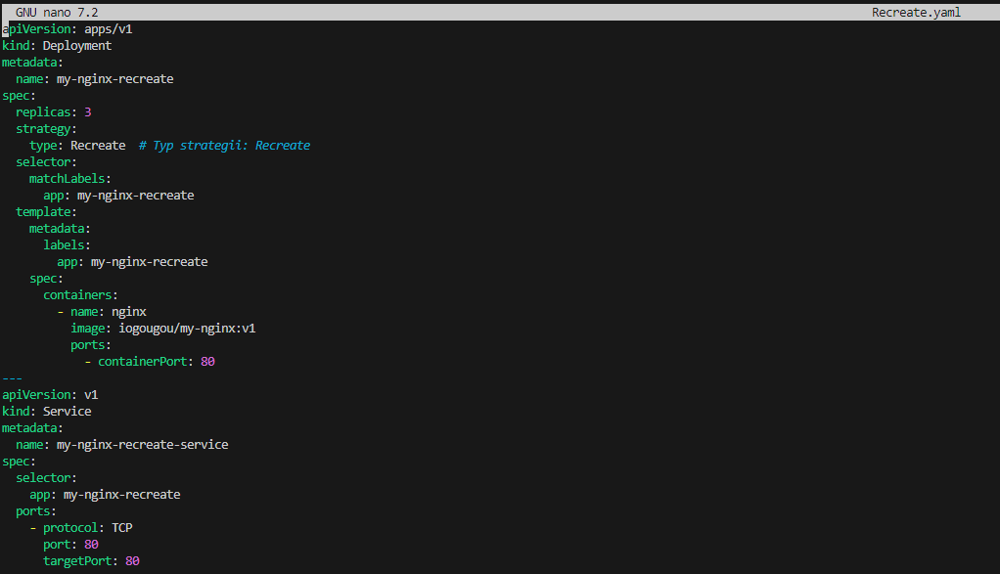

**Charakterystyka strategii Recreate**:
- Wszystkie stare pody są najpierw usuwane
- Dopiero po usunięciu uruchamiane są nowe pody
- Powoduje krótki przestoj w dostępności aplikacji
- Zapewnia brak konfliktów między wersjami

### Strategia 2: RollingUpdate
Przygotowano plik `RollingUpdate.yaml`:

```yaml
apiVersion: apps/v1
kind: Deployment
metadata:
  name: my-nginx-rolling-update
  labels:
    app: nginx-rolling
spec:
  replicas: 4
  strategy:
    type: RollingUpdate
    rollingUpdate:
      maxUnavailable: 1
      maxSurge: 1
  selector:
    matchLabels:
      app: nginx-rolling
  template:
    metadata:
      labels:
        app: nginx-rolling
    spec:
      containers:
      - name: nginx
        image: iogougou/my-nginx:v1
        ports:
        - containerPort: 80
        readinessProbe:
          httpGet:
            path: /
            port: 80
          initialDelaySeconds: 5
          periodSeconds: 10
```

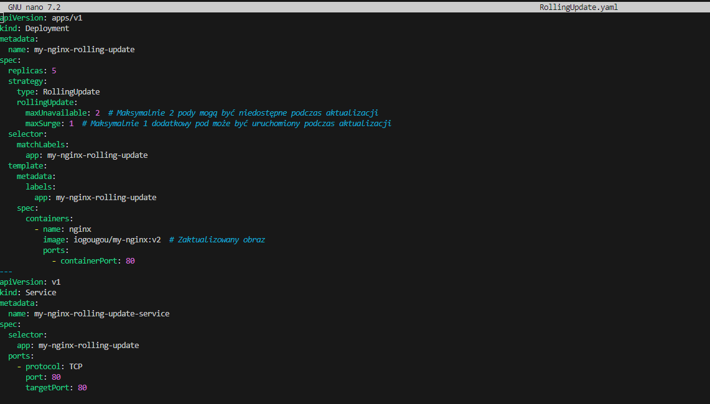

**Charakterystyka strategii RollingUpdate**:
- Stopniowa wymiana starych podów na nowe
- Utrzymanie dostępności aplikacji podczas aktualizacji
- Parametry `maxUnavailable` i `maxSurge` kontrolują tempo aktualizacji
- Domyślna strategia w Kubernetes

### Strategia 3: Canary Deployment
Przygotowano plik `Canary.yaml` z dwoma deploymentami:

```yaml
# Główny deployment (90% ruchu)
apiVersion: apps/v1
kind: Deployment
metadata:
  name: my-nginx-canary-main
  labels:
    app: nginx-canary
    version: stable
spec:
  replicas: 9
  selector:
    matchLabels:
      app: nginx-canary
      version: stable
  template:
    metadata:
      labels:
        app: nginx-canary
        version: stable
    spec:
      containers:
      - name: nginx
        image: iogougou/my-nginx:v1
        ports:
        - containerPort: 80
---
# Canary deployment (10% ruchu)
apiVersion: apps/v1
kind: Deployment
metadata:
  name: my-nginx-canary-new
  labels:
    app: nginx-canary
    version: canary
spec:
  replicas: 1
  selector:
    matchLabels:
      app: nginx-canary
      version: canary
  template:
    metadata:
      labels:
        app: nginx-canary
        version: canary
    spec:
      containers:
      - name: nginx
        image: iogougou/my-nginx:v2
        ports:
        - containerPort: 80
---
# Wspólny serwis dla obu deploymentów
apiVersion: v1
kind: Service
metadata:
  name: nginx-canary-service
spec:
  selector:
    app: nginx-canary
  type: NodePort
  ports:
  - port: 80
    targetPort: 80
    nodePort: 30082
```

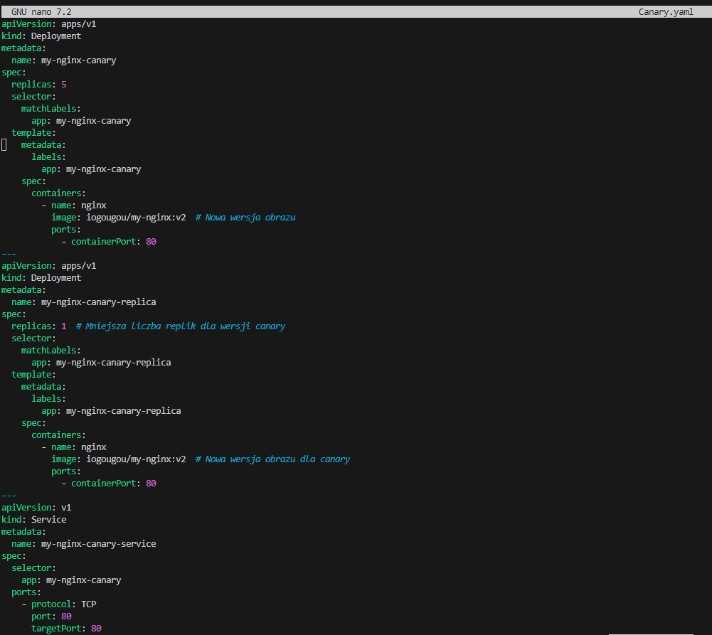

**Charakterystyka strategii Canary**:
- Nowa wersja wdrażana tylko dla części użytkowników
- Możliwość testowania nowej wersji na produkcji z ograniczonym ryzykiem
- Stopniowe zwiększanie ruchu po weryfikacji stabilności
- Wymaga dodatkowej konfiguracji serwisów

### Zastosowanie wszystkich strategii
```bash
# Zastosowanie strategii Recreate
kubectl apply -f Recreate.yaml

# Zastosowanie strategii RollingUpdate
kubectl apply -f RollingUpdate.yaml

# Zastosowanie strategii Canary
kubectl apply -f Canary.yaml

# Sprawdzenie wszystkich deploymentów
kubectl get deployments -n default
```

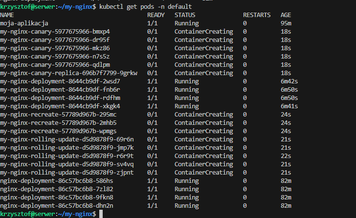

**Wynik**: Wszystkie trzy strategie zostały pomyślnie wdrożone, każda z różną liczbą replik i konfiguracją.

## Porównanie strategii wdrożeniowych

| Strategia | Główne cechy | Czas przestoju | Zużycie zasobów | Bezpieczeństwo | Zastosowanie |
|-----------|--------------|----------------|-----------------|----------------|--------------|
| **Recreate** | Usuwa wszystkie stare pody przed uruchomieniem nowych | Krótki przestój | Niskie podczas aktualizacji | Wysokie - brak konfliktów wersji | Aplikacje nie wymagające wysokiej dostępności |
| **RollingUpdate** | Stopniowa wymiana podów | Brak przestoju | Średnie - podwójne zasoby chwilowo | Średnie - możliwe konflikty | Większość aplikacji webowych |
| **Canary** | Nowa wersja dla części użytkowników | Brak przestoju | Wysokie - równoległe wersje | Najwyższe - kontrolowane ryzyko | Krytyczne aplikacje produkcyjne |

---

# Historia poleceń

## Zajęcia 08 - Ansible

```bash
# Przygotowanie środowiska
sudo apt update && sudo apt upgrade -y
sudo apt install -y ansible tar openssh-server
ssh-keygen -t rsa -b 4096 -C "krzysztof@server"
ssh-copy-id ansible@ansible-target

# Konfiguracja hostów
sudo hostnamectl set-hostname server
sudo hostnamectl set-hostname ansible-target
sudo nano /etc/hosts

# Testy połączenia
ping -c 4 ansible-target
ssh ansible@ansible-target
ansible -i inventory.ini all -m ping

# Wykonanie playbooków
ansible-playbook -i inventory.ini ping.yml
ansible-playbook -i inventory.ini copy-inventory.yml
ansible-playbook -i inventory.ini update-system.yml
ansible-playbook -i inventory.ini restart-services.yml

# Zarządzanie artefaktami
ansible-galaxy init manage_artifact
ansible-playbook -i inventory.ini playbook.yml

# Test awarii
sudo systemctl stop ssh
ansible-playbook -i inventory.ini ping.yml
```

## Zajęcia 09 - Kickstart

```bash
# Przygotowanie pliku Kickstart
nano anaconda-ks.cfg

# Skrócenie linka przez TinyURL
# https://tinyurl.com/bdejyufr

# Parametry boot w GRUB
# inst.ks=https://tinyurl.com/bdejyufr

# Weryfikacja po instalacji
hostnamectl
systemctl status sshd
df -h
```

## Zajęcia 10 - Kubernetes (1)

```bash
# Instalacja Minikube
curl -LO https://storage.googleapis.com/minikube/releases/latest/minikube-linux-amd64
sudo install minikube-linux-amd64 /usr/local/bin/minikube
minikube version

# Uruchomienie klastra
minikube start --driver=docker --cpus=2 --memory=2048
minikube kubectl -- get namespaces
minikube kubectl -- get clusterrolebindings

# Dashboard
minikube dashboard

# Pojedynczy Pod
minikube kubectl -- run moja-aplikacja --image=nginx --port=80 --labels app=moja-aplikacja
minikube kubectl -- get pods
minikube kubectl -- port-forward pod/moja-aplikacja 8080:80

# Deployment i Service
minikube kubectl -- apply -f nginx-deployment.yml
minikube kubectl -- rollout status deployment/nginx-deployment
minikube kubectl -- get pods
minikube service nginx-service --url
```

## Zajęcia 11 - Kubernetes (2)

```bash
# Przygotowanie obrazów Docker
mkdir my-nginx && cd my-nginx
mkdir my-custom-content
echo "<h1>Hello, this is my custom Nginx page - Version 1!</h1>" > my-custom-content/index.html

# Budowanie i wysyłanie obrazów
docker build -t iogougou/my-nginx:v1 .
docker login
docker push iogougou/my-nginx:v1
docker build -t iogougou/my-nginx:v2 .
docker push iogougou/my-nginx:v2
docker build -t iogougou/my-nginx:v3 .
docker push iogougou/my-nginx:v3

# Zarządzanie deploymentami
kubectl apply -f nginx-deployment.yaml
kubectl set image deployment/my-nginx-deployment nginx=iogougou/my-nginx:v2
kubectl set image deployment/my-nginx-deployment nginx=iogougou/my-nginx:v3
kubectl rollout history deployment/my-nginx-deployment
kubectl rollout undo deployment/my-nginx-deployment
kubectl rollout status deployment/my-nginx-deployment

# Skalowanie
kubectl scale deployment my-nginx-deployment --replicas=5
kubectl get pods

# Strategie wdrażania
kubectl apply -f Recreate.yaml
kubectl apply -f RollingUpdate.yaml
kubectl apply -f Canary.yaml
kubectl get deployments -n default

# Weryfikacja
chmod +x verify-deployment.sh
./verify-deployment.sh
kubectl get pods -n default -o wide
```

---

# Problemy napotkane podczas realizacji

## Zajęcia 08 - Ansible

### Problem 1: Błędna konfiguracja SSH
**Opis**: Początkowo połączenie SSH między maszynami nie działało z powodu niepoprawnej konfiguracji kluczy.

**Rozwiązanie**: 
```bash
# Regeneracja kluczy SSH
ssh-keygen -f ~/.ssh/id_rsa -N ""
ssh-copy-id -i ~/.ssh/id_rsa.pub ansible@ansible-target
```

**Weryfikacja**: Test bezhasłowego logowania `ssh ansible@ansible-target` zakończył się sukcesem.

### Problem 2: Uprawnienia sudo w Ansible
**Opis**: Niektóre playbooki wymagały uprawnień root, ale użytkownik `ansible` nie był w grupie sudo.

**Rozwiązanie**:
```bash
# Dodanie użytkownika do grupy sudo na maszynie docelowej
sudo usermod -aG sudo ansible
```

**Weryfikacja**: Playbooki z `become: true` wykonywały się poprawnie.

## Zajęcia 09 - Kickstart

### Problem 1: Długi link GitHub Raw
**Opis**: Interface GRUB nie pozwalał na wklejenie długiego linka do pliku Kickstart z GitHub.

**Rozwiązanie**: Użycie serwisu TinyURL do skrócenia linka z:
```
https://raw.githubusercontent.com/user/repo/main/anaconda-ks.cfg
```
do:
```
https://tinyurl.com/bdejyufr
```

**Weryfikacja**: Instalator pomyślnie pobrał plik Kickstart ze skróconego linka.

### Problem 2: Częściowa automatyzacja
**Opis**: Mimo pliku Kickstart, instalator wymagał ręcznego potwierdzenia niektórych ustawień.

**Analiza**: Problem wynikał z niepełnej specyfikacji niektórych parametrów w pliku Kickstart.

**Rozwiązanie**: Dodanie dodatkowych dyrektyw:
```bash
# Automatyczne potwierdzenie licencji
eula --agreed

# Pominięcie pierwszego uruchomienia
firstboot --disable
```

## Zajęcia 10 - Kubernetes

### Problem 1: Niewystarczające zasoby dla Minikube
**Opis**: Początkowo klaster nie uruchamiał się z powodu zbyt małej alokacji pamięci.

**Rozwiązanie**:
```bash
# Zwiększenie alokacji zasobów
minikube start --driver=docker --cpus=2 --memory=2048
```

**Weryfikacja**: Klaster uruchomił się poprawnie z odpowiednią ilością zasobów.

### Problem 2: Port-forward nie działał z localhost
**Opis**: Przekierowanie portów działało tylko lokalnie na maszynie z Minikube.

**Rozwiązanie**: Użycie `--address 0.0.0.0` dla dostępu z innych maszyn:
```bash
kubectl port-forward --address 0.0.0.0 pod/moja-aplikacja 8080:80
```

## Zajęcia 11 - Kubernetes

### Problem 1: Błędny obraz Docker v3
**Opis**: Celowo utworzony błędny obraz v3 powodował problemy z deploymentem.

**Symptomy**: Pody nie mogły się uruchomić z powodu błędnej konfiguracji nginx.

**Rozwiązanie**: Wykonanie rollback:
```bash
kubectl rollout undo deployment/my-nginx-deployment
```

**Weryfikacja**: Deployment powrócił do stabilnej wersji v2.

### Problem 2: Konflikt portów w strategii Canary
**Opis**: Oba deploymenty w strategii Canary próbowały używać tego samego NodePort.

**Rozwiązanie**: Użycie wspólnego Service'u, który automatycznie dystrybuuje ruch:
```yaml
spec:
  selector:
    app: nginx-canary  # Bez specyfikacji version
```

**Weryfikacja**: Ruch był poprawnie dystrybuowany między obie wersje aplikacji.

---

# Wnioski i podsumowanie

## Kluczowe umiejętności nabyte

1. **Automatyzacja z Ansible**:
   - Konfiguracja środowiska zarządzania infrastrukturą
   - Tworzenie playbooków do automatyzacji zadań
   - Zarządzanie artefaktami z wykorzystaniem kontenerów

2. **Instalacje nienadzorowane**:
   - Przygotowanie plików odpowiedzi Kickstart
   - Automatyzacja procesu instalacji systemu
   - Rozwiązywanie problemów z dostępnością plików konfiguracyjnych

3. **Podstawy Kubernetes**:
   - Instalacja i konfiguracja lokalnego klastra
   - Zarządzanie podstawowymi obiektami (Pod, Deployment, Service)
   - Monitorowanie stanu aplikacji

4. **Zaawansowane wdrażanie w Kubernetes**:
   - Zarządzanie wersjami aplikacji
   - Implementacja różnych strategii wdrażania
   - Obsługa rollback i skalowania

## Najważniejsze obserwacje

1. **Odtwarzalność procesów**: Wszystkie opisane kroki można powtórzyć dzięki szczegółowej dokumentacji i listingom poleceń.

2. **Znaczenie automatyzacji**: Narzędzia takie jak Ansible i Kubernetes znacznie ułatwiają zarządzanie infrastrukturą i aplikacjami.

3. **Wichtność strategii wdrażania**: Różne strategie (Recreate, RollingUpdate, Canary) mają swoje miejsce w zależności od wymagań aplikacji.

4. **Konieczność testowania**: Przygotowanie błędnych wersji i testowanie scenariuszy awarii jest kluczowe dla zrozumienia zachowania systemów.

## Przydatność w praktyce

Nabyte umiejętności mają bezpośrednie zastosowanie w:
- **DevOps**: Automatyzacja wdrożeń i zarządzanie infrastrukturą
- **Administracja systemów**: Masowe zarządzanie serwerami
- **Tworzenie oprogramowania**: CI/CD pipeline i konteneryzacja
- **Zarządzanie projektami**: Standardyzacja środowisk deweloperskich i produkcyjnych

Każde z narzędzi (Ansible, Kickstart, Kubernetes) stanowi ważny element nowoczesnego stosu technologicznego i jego znajomość jest kluczowa w branży IT.
