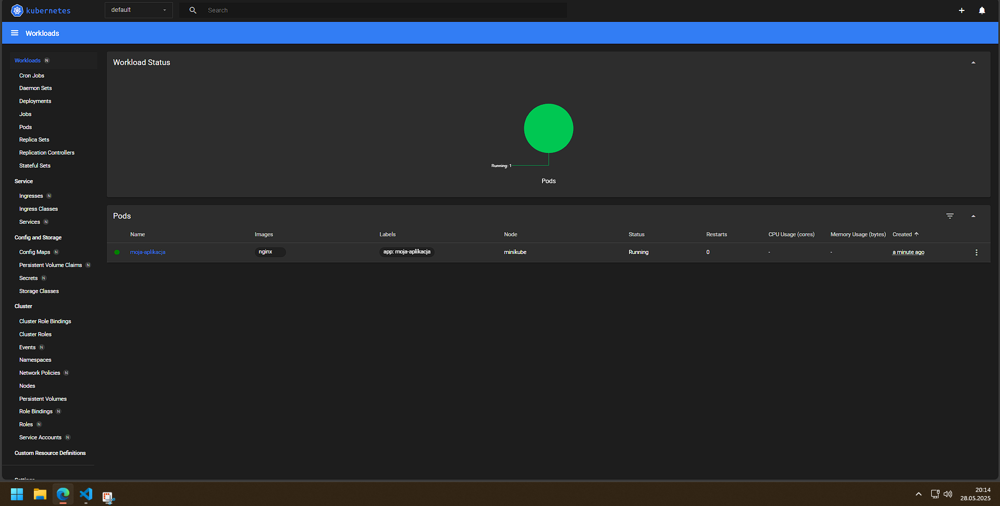

# 🧰 Sprawozdanie z konfiguracji Ansible i zarządzania artefaktem (Docker)

## 📦 1. Instalacja zarządcy Ansible

### 🌵 Utworzenie drugiej maszyny wirtualnej
Utworzono maszynę `ansible-target` z minimalnym zestawem oprogramowania, co ograniczyło zbędne usługi i poprawiło wydajność.

### 🌵 Taki sam system operacyjny jak maszyna główna
Obie maszyny działają na systemie Ubuntu 24.04 LTS, co ułatwia zarządzanie i eliminuje problemy kompatybilności.

### 🌵 Instalacja `tar` i `sshd`
Zainstalowano `tar` i `openssh-server`, aby umożliwić obsługę archiwów i dostęp przez SSH.

### 🌵 Nadanie hostname `ansible-target`
Nazwa hosta została ustawiona już podczas instalacji systemu ale jeszcze się upewniłem.


### 🌵 Wykonanie migawki maszyny
Zrobiono migawkę w VirtualBoxie, co pozwala wrócić do stanu początkowego w razie problemów.


### 🌵 Instalacja Ansible na głównej maszynie
Na `server` zainstalowano Ansible za pomocą APT:
```bash
sudo apt update && sudo apt install -y ansible
```


### 🌵 Wymiana kluczy SSH
Na `server` wygenerowano parę kluczy SSH i przesłano je do `ansible@ansible-target`:
```bash
ssh-keygen
ssh-copy-id ansible@ansible-target
```


---

## 🗂️ 2. Inwentaryzacja

### 🌵 Ustawienie nazw hostów
Ustawiono `hostnamectl` na obu maszynach:
```bash
hostnamectl set-hostname server
hostnamectl set-hostname ansible-target
```


### 🌵 Dodanie wpisów do /etc/hosts
Na maszynie `server` wpisano:
```
192.168.100.10 ansible-target
192.168.100.11 server
```


### 🌵 Weryfikacja łączności
Sprawdzono połączenie:
```bash
ping ansible-target
ping server
```


### 🌵 Stworzenie pliku inwentaryzacji
Plik `inventory.ini`:
```ini
[Orchestrators]
server ansible_host=server ansible_user=krzysztof ansible_port=2222

[Endpoints]
ansible-target ansible_host=ansible-target ansible_user=ansible
```


### 🌵 Wysłanie ping przez Ansible
```bash
ansible -i inventory.ini all -m ping
```


### 🌵 Użyto dwóch maszyn wirtualnych
Projekt został przeprowadzony z wykorzystaniem dwóch maszyn: `server` i `ansible-target`.

### 🌵 Ponowna wymiana kluczy ssh-copy-id
Upewniono się, że użytkownik `ansible` ma poprawnie dodany klucz publiczny.

### 🌵 Weryfikacja bezhasłowego logowania
SSH działało bez potrzeby wpisywania hasła.


---

## ⚙️ 3. Zdalne wywoływanie procedur

### 🌵 Pingowanie z playbooka
Utworzono `ping.yml`:
```yaml
- hosts: all
  gather_facts: false
  tasks:
    - name: Ping
      ansible.builtin.ping:
```


### 🌵 Skopiowanie pliku inwentaryzacji na zdalną maszynę
```yaml
- hosts: Endpoints
  gather_facts: false
  tasks:
    - name: Copy inventory
      copy:
        src: ../inventory.ini
        dest: /home/ansible/inventory.ini
```


### 🌵 Porównanie wyników
Po skopiowaniu inventory na `ansible-target` uruchomiono test pingowy zdalnie — wynik był identyczny jak z `server`.

### 🌵 Aktualizacja systemu
```yaml
- hosts: Endpoints
  become: true
  tasks:
    - name: Update APT
      apt:
        update_cache: yes

    - name: Upgrade packages
      apt:
        upgrade: dist
```


### 🌵 Restart usług sshd i rngd
```yaml
- hosts: Endpoints
  become: true
  tasks:
    - name: Restart sshd
      service:
        name: ssh
        state: restarted

    - name: Restart rngd
      service:
        name: rngd
        state: restarted
      ignore_errors: true
```


### 🌵 Test awarii (SSH down, interfejs down)
Wyłączono `sshd` i kartę sieciową. Ansible zgłosił `UNREACHABLE` — zgodnie z oczekiwaniami.

---

## 🐳 4. Zarządzanie artefaktem (kontener)

### 🌵 Budowa i uruchomienie kontenera
W playbooku użyto obrazu `nginx:alpine`, który został uruchomiony na porcie 8080.

### 🌵 Pobranie z Docker Hub
Ansible pobrał oficjalny obraz `nginx:alpine` bez potrzeby budowania lokalnego obrazu.

### 🌵 Instalacja Dockera przez Ansible
Rola `deploy_container` automatycznie instalowała Dockera przez APT.

### 🌵 Weryfikacja działania aplikacji
Sprawdzono dostępność strony pod `http://localhost:8080` za pomocą modułu `uri`.

### 🌵 Usunięcie kontenera
Na koniec, kontener `hello-app` został usunięty z maszyny docelowej przez Ansible.

---

## ✅ 5. Podsumowanie

- 🖥️ Środowisko składa się z dwóch maszyn wirtualnych
- 🔐 Zrealizowano logowanie bez hasła
- 📂 Plik inwentaryzacji z grupami: `Orchestrators` i `Endpoints`
- ⚙️ Stworzono playbooki do pingu, kopiowania, aktualizacji, restartu usług
- 🐳 Wdrożono i przetestowano kontener aplikacji z Docker Hub
- 📦 Rolę stworzono przy użyciu `ansible-galaxy`

_____________________________________________________________________________________________________________________________________________________________________________________________________________________________________________________________________________
_____________________________________________________________________________________________________________________________________________________________________________________________________________________________________________________________________________
_____________________________________________________________________________________________________________________________________________________________________________________________________________________________________________________________________________
_____________________________________________________________________________________________________________________________________________________________________________________________________________________________________________________________________________
_____________________________________________________________________________________________________________________________________________________________________________________________________________________________________________________________________________


# 📝 Sprawozdanie: Pliki odpowiedzi dla wdrożeń nienadzorowanych

## 🎯 Zagadnienie

Zadanie dotyczyło przygotowania automatycznego źródła instalacyjnego systemu Fedora 42 — przydatnego w środowiskach testowych, serwerowych lub IoT. Instalacja miała odbywać się w pełni automatycznie, dzięki zastosowaniu pliku odpowiedzi Kickstart.

---

## 🎯 Cel zadania

- Utworzenie pliku odpowiedzi `kickstart` do instalacji systemu.
- Zainstalowanie systemu Fedora 42 na maszynie wirtualnej w trybie nienadzorowanym.
- Upewnienie się, że system uruchamia się w pełni skonfigurowany i gotowy do hostowania aplikacji.

---

## 📦 Środowisko i narzędzia

- Oracle VirtualBox
- Obraz ISO Fedora 42 Everything Netinst
- Plik `anaconda-ks.cfg` z repozytorium GitHub
- Edytor nano, przeglądarka, TinyURL

---

## 🪜 Kroki realizacji

### 1. Uruchomienie instalatora z ISO

Na początku uruchomiłem maszynę wirtualną z obrazem instalacyjnym Fedora 42 w trybie “Test this media & install Fedora 42”.

📷 


---

### 2. Problem z długim linkiem i użycie TinyURL

Podczas konfiguracji GRUB okazało się, że nie mogę wkleić długiego linku z GitHub Raw z plikiem Kickstart. W związku z tym postanowiłem użyć serwisu [TinyURL](https://tinyurl.com) do skrócenia odnośnika.

```
#version=DEVEL
text
skipx
cdrom

keyboard --vckeymap=pl --xlayouts='pl'
lang pl_PL.UTF-8
timezone Europe/Warsaw --utc

rootpw --iscrypted --allow-ssh $y$j9T$u5Te1Uv/zc1G30Bm1z7ipamDc$3EBAqr78ouqUbIZt/CgcookAh0LiFJbyumYqU4WzW5
user --groups=wheel --name=user --password=haslohaslo --plaintext --iscrypted --gecos="user"

ignoredisk --only-use=sda
clearpart --all --initlabel
autopart

firstboot --enable

%packages
@^custom-environment
%end

reboot
```


Link do pliku Kickstart:
```
https://tinyurl.com/bdejyufr
```

---

### 3. Uruchomienie instalacji z pliku Kickstart

Instalator wykrył plik Kickstart i rozpoczął instalację automatyczną. W logach widać było, że używany jest tryb tekstowy, co potwierdza wykorzystanie `inst.ks`.


---

### 4. Wejście do Anaconda GUI

Choć instalacja była automatyczna, pojawiło się okno z podsumowaniem konfiguracji. Musiałem ręcznie potwierdzić konfigurację użytkownika i konta root.


---

### 5. Postęp instalacji

Następnie instalacja postępowała dalej, tworząc partycję rozruchową i systemową.


---


____________________________________________________________________________________________________________________________________________________________________________________________________________________
____________________________________________________________________________________________________________________________________________________________________________________________________________________
____________________________________________________________________________________________________________________________________________________________________________________________________________________
____________________________________________________________________________________________________________________________________________________________________________________________________________________
____________________________________________________________________________________________________________________________________________________________________________________________________________________


  

## Wdrażanie na zarządzalne kontenery: Kubernetes

  

### Instalacja klastra Kubernetes

Pierwszym zadaniem było zainstalowanie implementacji stosu `k8s` na maszynie wirtualnej. W naszym przypadku jest to `minikube`, czyli lekkie, lokalne środowisko do uruchamiania klastra Kubernetes na jednej maszynie.

  

Instalacja `minikube` w postaci paczki `RPM` dla architektury `x86-64`odbyła się poleceniami:


  

Instalator pobrany został z oficjalnego, certyfikowanego źródła dystrybucji, co minimalizuje ryzyko użycia złośliwego oprogramowania.

  

Dodatkowo zainstalowałem narzędzie `conntrack`. Jest to narzędzie użytkowe i biblioteka jądra Linuksa do śledzenia stanu połączeń sieciowych, używane przez Kubernetes do kontrolowania routingu i przekierowywania pakietów między `podami` i `service'ami`.


  

Następnie zaopatrzyłem się w polecenie `kubectl` w wariancie `minikube` za pomocą aliasu:

``` bash

alias  kubectl="minikube kubectl --"

```

  

Po zainstalowaniu wymaganych zależności, uruchomiłem Kubernetes:


  

Operacja zakończyła się sukcesem:


  

Rekomendowane zasoby dla `minicube` to co najmniej 2 rdzenie procesora, 2GB wolnej pamięci oraz 20GB wolnej przestrzeni na dysku. Moja maszyna wirtualna spełniała te wymagania, lecz w celu zwiększenia wydajności (mimo wystarczających zasobów maszyna wirtualna dosyć wolno działała) dołożyłem trochę pamięci RAM, co rozwiązało problem.

  

Następnie uruchomiłem graficzny interfejs użytkownika dla klastra Kubernetes (Dashboard). Pozwala ono łatwo przeglądać i zarządzać zasobami k8s.

  

Dashboard uruchomiłem poleceniem:


  

Następnie po automatycznym przekierowaniu portu w VS Code wyświetliłem go w oknie domyślnej przeglądarki:


  

### Analiza posiadanego kontenera

Z racji, iż efektem mojego `pipeline`'u był obraz zawierający oprogramowanie `Redis` opublikowany na DockerHubie, mogłem go użyć podczas tych laboratoriów. Upewniłem się tylko, że kontener pracuje po uruchomieniu (a nie natychmiast kończy pracę).


  

### Uruchamianie oprogramowania

Celem zadania było uruchomienie kontenera z aplikacją (w moim przypadku `Redisa` z projektu `pipeline`) na stosie k8s.


  

w wyniku tego polecenia utworzony został `pod`, czyli podstawowa jednostka uruchomieniowa (najprostszy, najmniejszy element, który można wdrożyć i zarządzać nim w klastrze)

  

Działanie poda można było zauważyć na powyższym zrzucie ekranu po wykonaniu polecenia:

``` bash

kubectl  get  pods

```

oraz poprzez Dashboard:


  

Następnie przekierowałem port, aby móc połączyć się z kontenerem:


  

W drugim terminalu spróbowałem nawiązać połączenie - najprotszym sposobem, czyli poleceniem `ping` za pomocą `redis-cli`:


  

Uzyskałem odpowiedź `PONG`, co oznacza, że próba nawiązania połączenia zakończyła się sukcesem.

  

### Przekucie wdrożenia manualnego w plik wdrożenia

Celem tego zadania było zapisanie wdrożenia wybranej aplikacji w pliku wdrożenia (pliku YML).

  

Pracę rozpocząłem od utworzenia pliku wdrożenia: [redis-deployment.yaml](./Lab10/redis-deployment.yaml)

```yaml

apiVersion: apps/v1

kind: Deployment

metadata:

name: redis-app

spec:

replicas: 4

selector:

matchLabels:

app: redis-app

template:

metadata:

labels:

app: redis-app

spec:

containers:

- name: redis-container

image: tomaszek03/redis-app

ports:

- containerPort: 6379

```

  

Następnie przy pomocy pliku utworzyłem nowy deployment:


  

Deployment zawiera 4 repliki. Wiele replik zwiększa odporność aplikacji — w przypadku awarii jednej z nich, aplikacja pozostaje dostępna dzięki pozostałym. Dodatkowymi zaletami replik są skalowalność oraz równoważenie obciążenia (load balancing). W sytuacji wzmożonego ruchu lub większej liczby użytkowników można zwiększyć liczbę replik, aby rozproszyć obciążenie i zapewnić płynne działanie systemu. Ruch użytkowników jest kierowany do różnych podów, co zmniejsza ryzyko przeciążenia pojedynczej instancji aplikacji.

  

Sprawdziłem stan wdrożenia poniższym poleceniem:


  

Informacja `deployment redis-app successfully rolled out` oznacza, że deployment Redis-a zakończył się sukcesem.

  

Aby aplikacja działała z zewnątrz, należało wyeksponować port:


  

Użyte polecenie tworzy zasób typu `Service` i eksponuje port `6379` kontenera. Ustawiłem typ NodePort, co umożliwia dostęp do aplikacji spoza klastra Kubernetes.

  

Następnie, tak jak poprzednio, przekierowałem port do serwisu:


  

Efekt poprawności działania ponownie zweryfikowałem wykonując `ping` w oddzielnym terminalu:


  

Utworzony deployment można rownież monitorować za pomocą Dashboardu:


  

* utworzone wdrożenia


  

* utworzone pody:


____________________________________________________________________________________________________________________________________________________________________________________________________________________
____________________________________________________________________________________________________________________________________________________________________________________________________________________
____________________________________________________________________________________________________________________________________________________________________________________________________________________
____________________________________________________________________________________________________________________________________________________________________________________________________________________
____________________________________________________________________________________________________________________________________________________________________________________________________________________


# Zajęcia 10 – Kubernetes (1)

## Wdrażanie na zarządzalne kontenery: Kubernetes

### Instalacja klastra Kubernetes

Na potrzeby zajęć zdecydowałem się skorzystać z `minikube`, czyli lekkiej implementacji Kubernetes do środowisk lokalnych. Dzięki niej mogę przeprowadzić pełną konfigurację klastra, testy oraz wdrożenia bez potrzeby korzystania z chmury.

#### Pobranie Minikube

Na początku pobrałem najnowszą wersję Minikube:
```
curl -LO https://storage.googleapis.com/minikube/releases/latest/minikube-linux-amd64
```


#### Instalacja binarki

Następnie zainstalowałem plik wykonywalny w katalogu `/usr/local/bin`:
```
sudo install minikube-linux-amd64 /usr/local/bin/minikube
```


#### Uruchomienie klastra

Uruchomiłem Minikube z wykorzystaniem sterownika Docker oraz zadeklarowaniem zasobów:
```
minikube start --driver=docker --cpus=2 --memory=2048
```


### Weryfikacja działania klastra

Sprawdziłem namespace'y oraz role:
```
minikube kubectl -- get namespaces
minikube kubectl -- get clusterrolebindings
```


Dla pewności zajrzałem do certyfikatów:
```
minikube ssh
ls /var/lib/minikube/certs/
```


---

## Dashboard Kubernetes

Dashboard uruchomiłem za pomocą:
```
minikube dashboard
```


Z poziomu przeglądarki uzyskałem dostęp do interfejsu:


---

## Uruchamianie aplikacji – pojedynczy Pod

Postanowiłem przetestować wdrożenie kontenera z aplikacją nginx:
```
minikube kubectl -- run moja-aplikacja --image=nginx --port=80 --labels app=moja-aplikacja
```


Sprawdziłem jego status:
```
minikube kubectl -- get pods
```

Następnie przekierowałem port:
```
minikube kubectl -- port-forward pod/moja-aplikacja 8080:80
```

Z przeglądarki na moim Windowsie odwiedziłem `http://localhost:8080`:


Komunikacja działa poprawnie, strona Nginxa się załadowała.

---

## Tworzenie pliku YAML dla Deploymentu

Przekształciłem powyższe wdrożenie w pełnoprawny `Deployment` i `Service`:

```yaml
apiVersion: apps/v1
kind: Deployment
metadata:
  name: nginx-deployment
  labels:
    app: nginx
spec:
  replicas: 4
  selector:
    matchLabels:
      app: nginx
  template:
    metadata:
      labels:
        app: nginx
    spec:
      containers:
      - name: nginx
        image: nginx
        ports:
        - containerPort: 80
---
apiVersion: v1
kind: Service
metadata:
  name: nginx-service
spec:
  selector:
    app: nginx
  type: NodePort
  ports:
  - port: 80
    targetPort: 80
    nodePort: 30080
```

Plik zapisałem jako `nginx-deployment.yml`.


Wdrożenie wykonałem komendą:
```
minikube kubectl -- apply -f nginx-deployment.yml
```


---

## Sprawdzanie rollout i działania aplikacji

Status rollout:
```
minikube kubectl -- rollout status deployment/nginx-deployment
```


Sprawdziłem działające Pody:
```
minikube kubectl -- get pods
```

Sprawdziłem dostępność serwisu:
```
minikube service nginx-service --url
```



Z przeglądarki odwiedziłem podany adres IP i port:


---

## Wnioski

Podczas realizacji zadania przeszedłem przez cały proces: od instalacji klastra Kubernetes w środowisku lokalnym, przez jego konfigurację, aż po przygotowanie i uruchomienie aplikacji w formie Poda oraz Deploymentu. Sprawdziłem działanie Dashboardu, przekierowanie portów oraz komunikację z aplikacją. Wdrożenie Nginxa z czterema replikami oraz jego wystawienie przez `NodePort` pozwoliło mi zrealizować pełny cykl wdrożeniowy zgodny z praktykami DevOps.
