# Kacper Mazur, 415588 - Inzynieria Obliczeniowa, GCL02
## Laboratorium 5 - Pipeline, Jenkins, izolacja etapów

### Wprowadzenie:

W ramach tego zadania uruchomiłem poprzednio uruchomione kontenery z DinD oraz Jenkins Blueocean i przeszedłem do realizacji ćwiczenia
### 1️⃣ Zadania wstępne:
 - uname:

Stworzyłem podstawowy projekt na tablicy Jenkinsowej zawierający następujący kod :

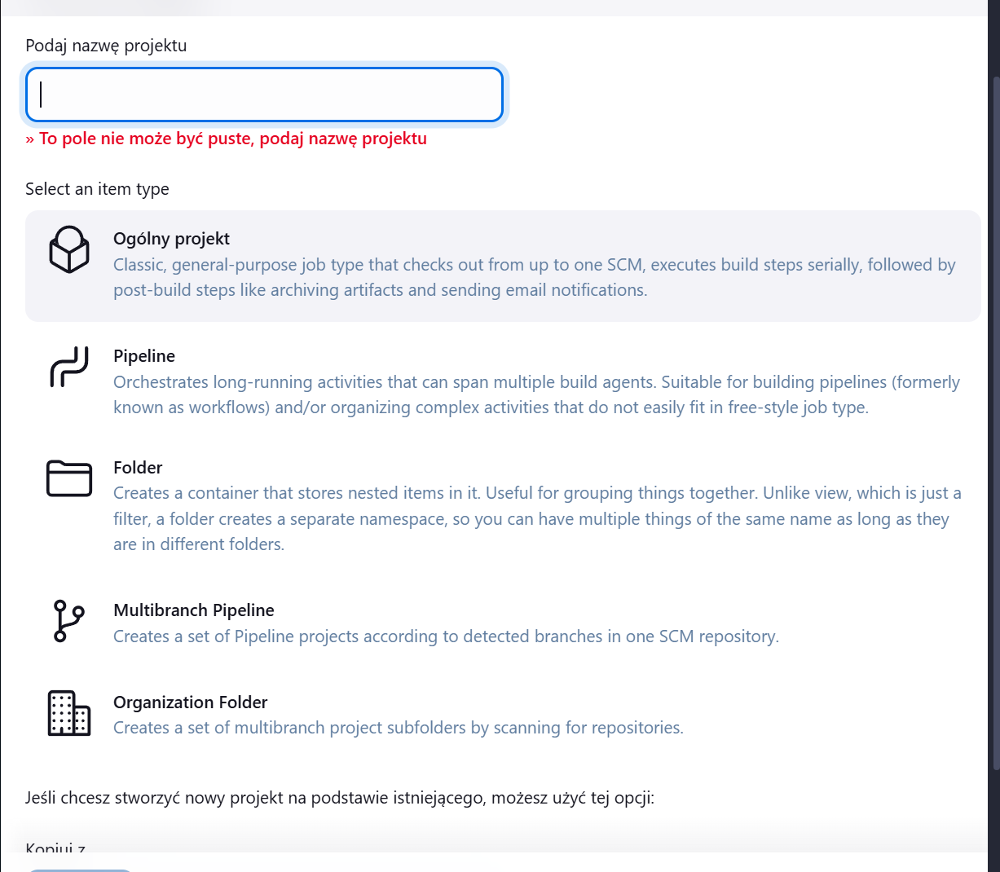

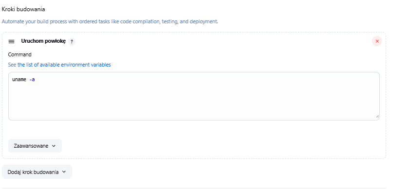

Po wykonaniu się zadania Jenkins w konsoli uzyskujemy:

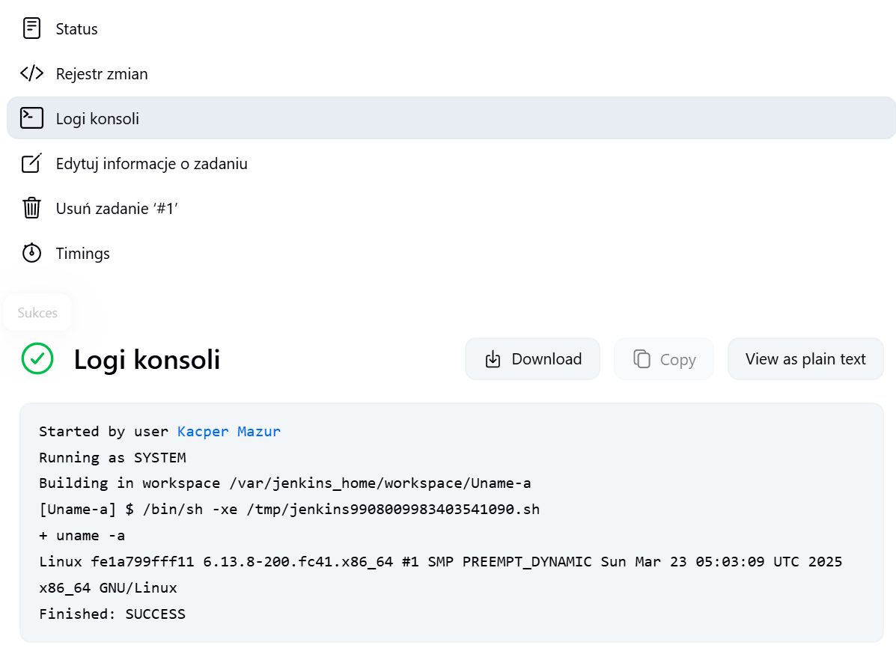

 - Parzystość godziny:

Podobnie jak w poprzednim zadaniu tworzymy ogólny projekt ale tym razem wpisujemy poniższy kod:

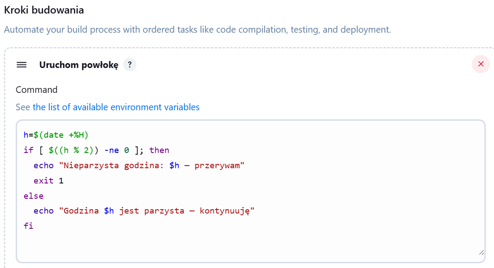

Kiedy uruchomimy go o parzystej godzinie otrzymujemy informacje o sukcesie:

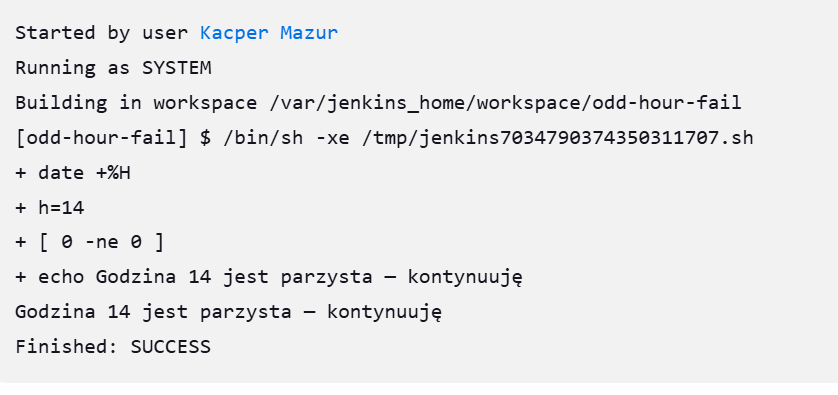

Kiedy uruchomimy go o nieparzystej godzinie otrzymujemy informacje o porażce:

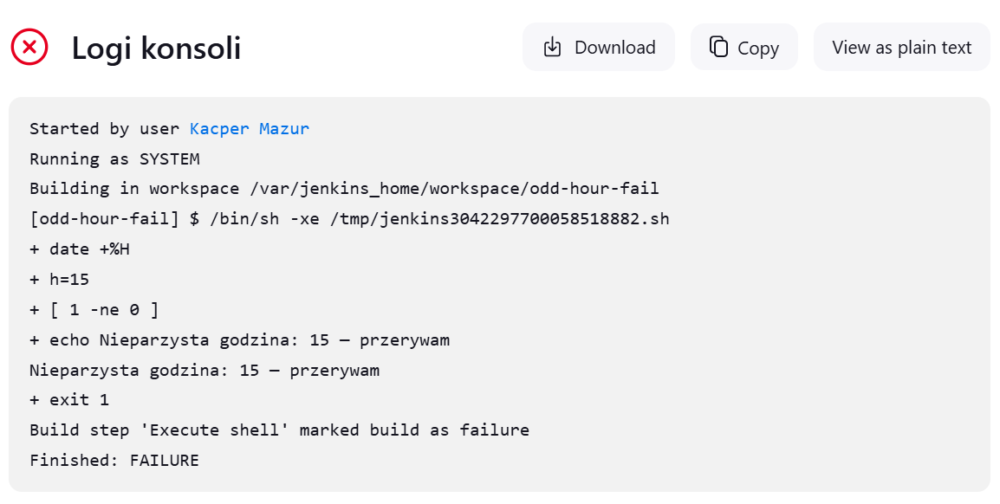

 - docker pull ubuntu:

Ponownie tworzymy ogólny projekt, ale tym razem wpisujemy następujący kod:

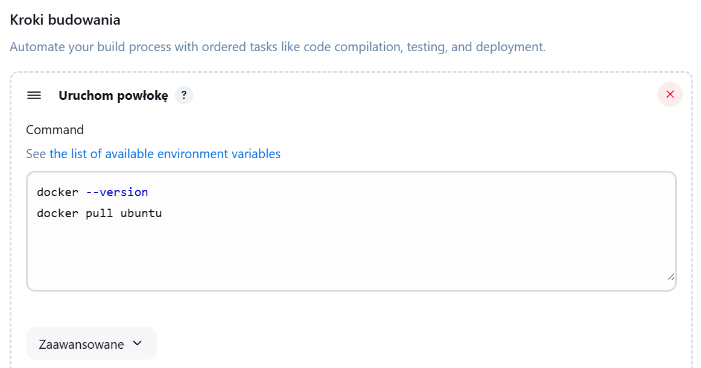

W logach konsoli otrzymamy:

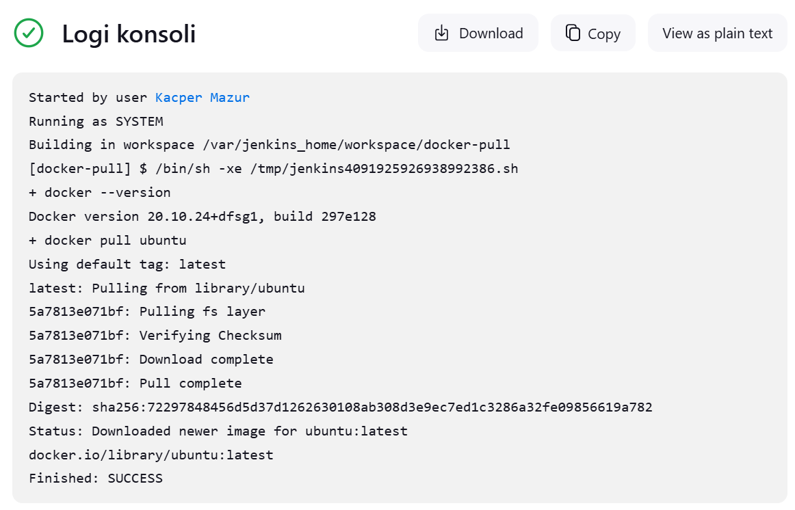

### 2️⃣ Zadanie wstępne: obiekt typu pipeline

Na początku tworzymy obiekt typu pipeline (zamiast wybierać ogólny projekt wybieramy pipeline) po czym przechodzimy na sam dół strony - pojawia się tam okno do wpisania kodu pipeline. Wpisałem poniższy kod:


```bash
pipeline{
    agent any
    stages {
        stage('Clone repo') {
            steps {
                git branch: 'KM415588', url: 'https://github.com/InzynieriaOprogramowaniaAGH/MDO2025_INO.git'
            }
        }

        stage('Build Docker image') {
            steps {
                dir ("INO/GCL02/KM415588/Sprawozdanie_2/")
                {
                    script {
                        sh 'ls -la'
                        docker.build('chalk-build', '-f dockerfile.chalkbuild .')
                    }   
                }
            }
        }
    }
}
```

Następnie uruchamiamy standardowe zadanie. W konsoli otrzymuję całość tekstu z [chalkpipe_builde.txt](./chalkpipe_builder.txt), ale najważneijsze są linijki następujące po buildzie mówiące nam, iż przebiegł poprawnie (wprost sugeruje to że inne kroki musiały przebiec poprawnie). Przeanalizujmy więc kod pipeline:

- agent any - sugeruje, iż proces ma wykonać jakakolwiek dostępna maszyna.
- stages{} - jest sekcją kroków, które będzie wykonywał pipeline - ich kolejność i stan wykonania możemy zobaczyć w sekcji Zadanie->Pipeline Overview:

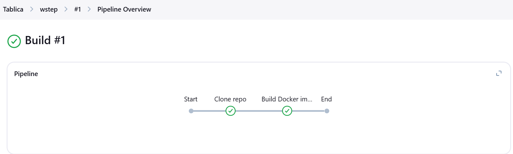

- stage(nazwa){} - definiuje etap o nazwie nazwa do wykonania - jak podglądniemy w [chalkpipe_builde.txt](./chalkpipe_builder.txt) w konsoli wypisywana jest zawsze nazwa etapu, który będzie zaczynany.

- dir(folder) - przekierowywuje działanie jenkinsa do danego folder

- steps{} - tu piszemy wszytskie komendy, które chcemy, żeby jenkins wykonał - możemy standardowo przy wykorzystaniu sh lub dedykowanymi funkcjami, jak np. docker.build()

### 3️⃣ Własny projekt:

Celem jest zaimplementowanie pipeline'u tworzącego gotowe artefakty dla użytkownika - w przypadku aplikacji np. gotowe skompilowane pliki, w przypadku biblioteki tylko konieczne do działania pliki, logi ... .

W moim przypadku projektem jest biblioteka [chalk-pipe](https://github.com/LitoMore/chalk-pipe) służąca do wypisywania tekstu z programów .js w większej ilości formatów. W tym celu w artefaktach zwracać będę zredukowaną do minimum zbuildowaną bibliotekę oraz logi testów. Oprócz dedykowanego testu jednostkowego (npm test) uruchomię własny plik example.js, którego wynik uruchomienia przekieruje do pliku smoke_test.log. Na początku zgodnie z poleceniem zabrałem się za utworzenie odpowiednich diagramów UML:

- diagram aktywności:

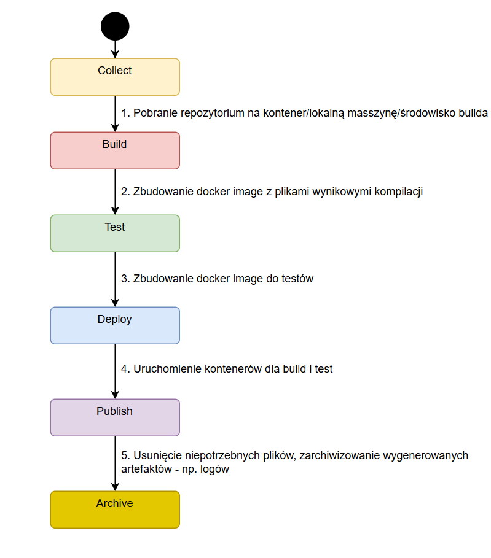

- diagram relacji:

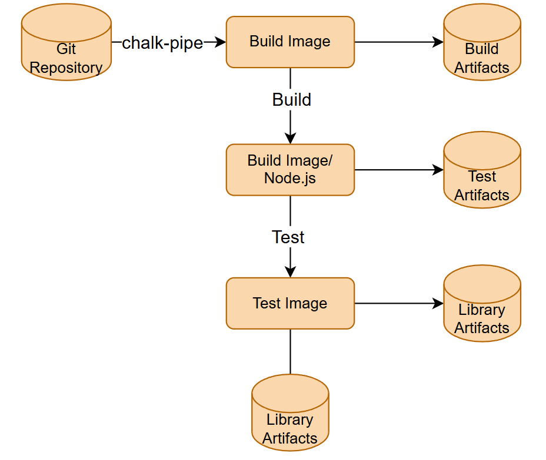

- deployment diagram:

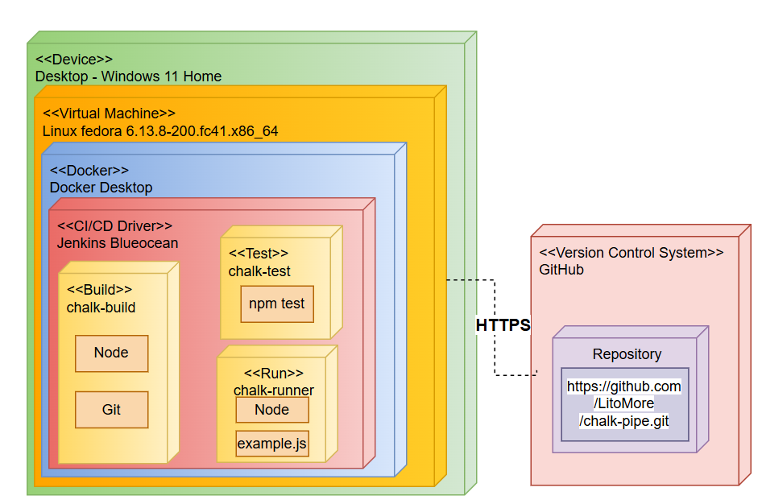

W kolejnym kroku skopiowałem do folderu Sprawozdanie_2 [dockerfile.chalkbuild](./dockerfile.chalkbuild) oraz [dockerfile.chalktest](./dockerfile.chalktest) (dlatego pomine ich cytowanie tutaj). Dodatkowo utowrzyłem pliki:

- dockerfile.runner:

```Dockerfile
FROM chalk-build

WORKDIR /chalk-pipe

# Czyścimy wszystko, zostawiamy tylko bibliotekę i zależności
RUN rm -rf \
    .git \
    .github \
    .gitignore \
    .nprmc \
    LICENSE \
    README.md \
    tsconfig.json \
    screenshot.png \
    coverage \
    test \
    source \
    package-lock.json


COPY example.js .
RUN node example.js > smoke_test_output.log || true
CMD ["cat", "smoke_test_output.log"]
```

- example.js 
```JavaScript
import chalkPipe from 'chalk-pipe';

console.log(chalkPipe('cyan')('Działa!'));
console.log(chalkPipe('bold.red')('To jest na czerwono i pogrubione!'));
```

Po testach w konsoli widać że program działa - w pliku .log pojawi się tylko napis jeśli wszystko się uda ale przez to, że nie da się zmieniać formatu tekstu będzie on w zwykłym formacie.

Implementowałem po kolei każdy ze stageów:

- Test

```bash
stage('Test Docker image') {
            steps {
                dir ("INO/GCL02/KM415588/Sprawozdanie_2/")
                {
                    script {
                        def testImage = docker.build('chalk-test', '-f dockerfile.chalktest .')
                        def containerId = sh(script: "docker run -d chalk-test", returnStdout: true).trim()
                        sh "mkdir -p logs"
                        sh "docker cp ${containerId}:/chalk-pipe/test_output.log logs/test_output.log"
                        sh "docker rm ${containerId}"
                    }  
                }
            }
        }
```

- Smoke test i runner:

```bash
stage('Run Docker image') {
            steps {
                dir ("INO/GCL02/KM415588/Sprawozdanie_2/")
                {
                    script {
                        def runImage = docker.build('chalk-run', '-f dockerfile.runner .')
                        def containerId = sh(script: "docker run -d chalk-run", returnStdout: true).trim()
                        sh "mkdir -p logs"
                        sh "mkdir -p lib"
                        sh "docker cp ${containerId}:/chalk-pipe/smoke_test_output.log logs/smoke_test_output.log"
                        sh "docker cp ${containerId}:/chalk-pipe lib/"
                        sh "docker rm ${containerId}"
                    }  
                }
            }
        }
```

- Post artefaktów i sprawdzanie powodzenia:

```bash
post {
        success {
            echo "📦 Archiwizacja artefaktów"
    
            dir ("INO/GCL02/KM415588/Sprawozdanie_2/") {
                script {
                    sh '''
                    mkdir -p result
                    cp logs/test_output.log result/ || true
                    cp logs/smoke_test_output.log result/ || true
                    cp -r lib/ result/ || true
    
                    tar -czf artifact_result.tar.gz -C result .
    
                    '''
                }
            }
    
            archiveArtifacts artifacts: 'INO/GCL02/KM415588/Sprawozdanie_2/artifact_result.tar.gz', fingerprint: true
    
            // Sprzątanie kontenerów
            sh '''
            docker container stop $(docker ps -aq) || true
            docker container rm $(docker ps -aq) || true
            '''
            echo '✅ Pipeline zakończony sukcesem – artefakt tar gotowy.'
        }
        failure{
            echo '❌ Pipeline nie powiódł się – sprawdź logi.'
        }
    }
```

Kompletny [Jenkinsfile](./Jenkinsfile) został załączony w repozytorium.

Analiza wszystkich etapów:

1. Clone

- W pierwszym etapie pipeline klonuje repozytorium przedmiotowe MDO2025_INO z gałęzi KM415588.

- Klonowanie zapewnia świeże źródła kodu, dzięki czemu pipeline działa zawsze na aktualnej wersji aplikacji.

- Weryfikacja zawartości repozytorium następuje przez ls -la.

2. Build

    Proces budowania rozpoczyna się wewnątrz kontenera Docker bazującego na oficjalnym obrazie Node.js (node:current).

    W kroku Build:

    - Instalowane są zależności (npm install).

    - Kompilowana jest aplikacja (npm run build).

    - Budowany jest dedykowany obraz chalk-build, który stanowi środowisko zawierające wszystkie zależności buildowe.

3. Test

    Następnie budowany jest kontener chalk-test bazujący na chalk-build.

   - W kontenerze uruchamiane są testy jednostkowe (npm test).

   - Wynik testów jest przechwytywany do pliku test_output.log.

   - Logi z testów są przechowywane i archiwizowane jako artefakt pipeline.

4. Deploy (Smoke Test)

    W kroku Deploy budowany jest kontener chalk-run:

    - Oczyszczana jest struktura projektu do niezbędnych plików (distribution/, plik example.js).

    - Uruchamiany jest test integracyjny typu smoke test, wykonujący example.js na bibliotece.

    - Wynik działania smoke testu jest zapisywany do pliku smoke_test_output.log.

5. Publish

    Ostatecznie przygotowywany jest artefakt:

    - Tworzony jest katalog result/.

    - Kopiowane są logi testów oraz smoke testu oraz zbudowana biblioteka.

    - Wszystko jest pakowane do pliku artifact_result.tar.gz.

    Artefakt ten jest publikowany w Jenkinsie i gotowy do pobrania jako rezultat pipeline.


Po utworzeniu nowego projektu pipeline i wpisaniu kodu jenkinsfile uruchamiam zadanie - poniżej zdjecia dowodzące powodzeniu przeprowadzonego zadania:

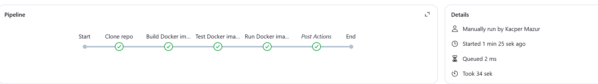

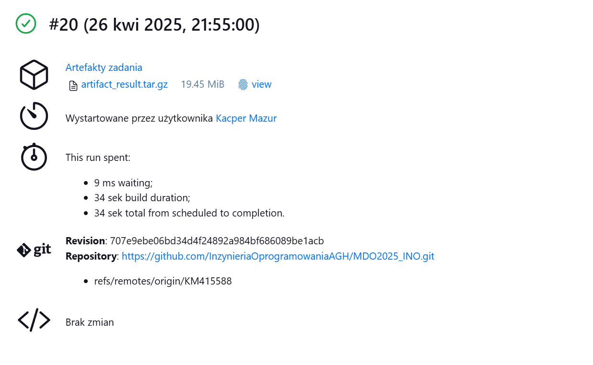

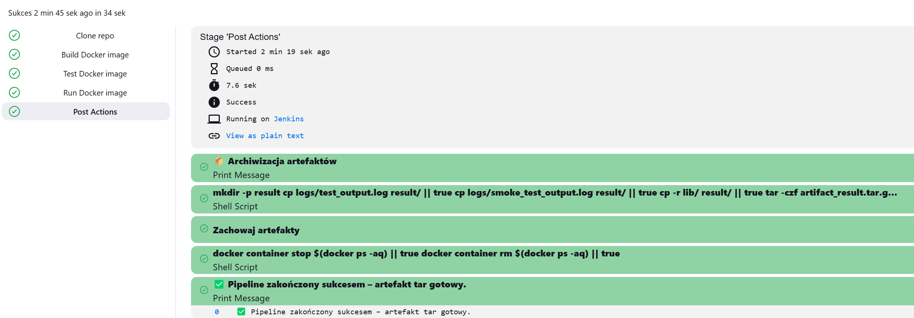

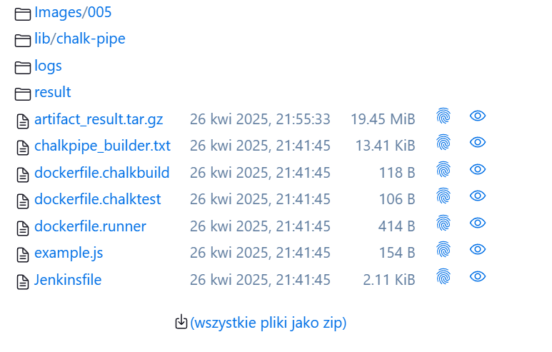

Możemy też odwoływać się do już napisnego pliku Jenkinsfile na repozytorium wybierając w projekcie pipelinie opcje pipeline script from scm:

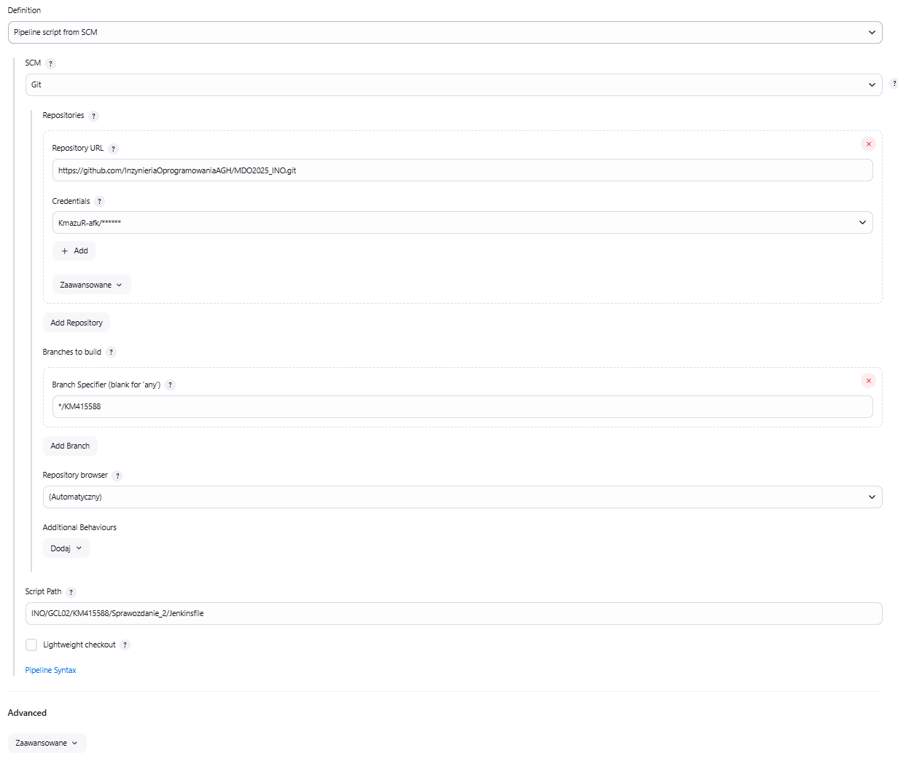


