# Kacper Mazur, 415588 - Inzynieria Obliczeniowa, GCL02
## Laboratorium 8 - Automatyzacja i zdalne wykonywanie poleceń za pomocą Ansible
### 1️⃣ Instalacja zarządcy Ansible:

Działania zaczynam od utworzenia nowej maszyny wirtualnej w Hyper-V. Insatluje na niej system fedora 41-1.4 (tzn ten sam system co na maszynie głównej) oraz konieczne pakiety - tar oraz ssh.

```bash
sudo dnf -y install tar openssh-server
```

Następnie sprawdzamy status usługi ssh (jeśli nie uruchomiona to uruchamiamy) oraz adres ip maszyny:

```bash
systemctl status sshd
#uruchomienie ssh
systemctl enable sshd
ip a
```

Wydruk w moim przypadku był następujący - widać, iż usługa uruchomiona:

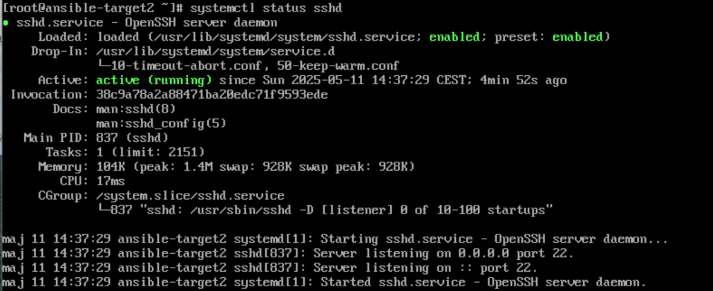

Na maszynie głównej wykonujemy instalacje ansible oraz generujemy nowy klucz ssh (najlepiej ustawić bez hasła):

```bash
sudo dnf -y install ansible
#przykładowe polecenie generacji klucza
ssh-keygen -t ed25519 -C "ansible@fedora-master"
```

Następnie wymieniamy klucz publiczny z maszyną podrzedną (target):

```bash
ssh-copy-id ansible@ansible-target
#jeśli nie pdoziała to odwołujemy sie wcześniej zapisanym adresem ip maszyny target
ssh-copy-id ansible@192.168._._
```

W wyniku otrzymuje:

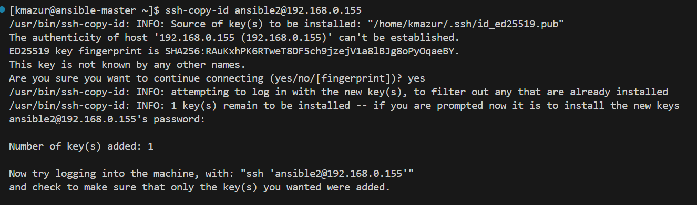

Następnie łączymy się protokołem ssh z target-em - pierwsze połączenie może wymagać podania hasła, ale kolejne już nie.

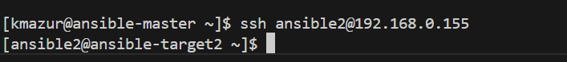

Tożsamo tworzę druga maszynę wirtualną, którą nazywam ansible-target2 - **UWAGA** jeśli zapomnieliśmy podczas instalacji zmienić nazwę maszyny na inną możemy to wykoną w konsoli:

```bash
sudo hostnamectl set-hostname ansible-target2
```

### 2️⃣ Inwentaryzacja

Po zapewnieniu, iż każda z maszyn ma nadaną swoją nazwę - w moim przypadku master ma nazwe ansible-master, a pozostałe maszyny to ansible-target oraz ansible-target2, piszemy plik inwentaryzacjyny określajacy role w komunikacji przy wykorzystaniu ansible-playbook:

```ini
[orchestrators]
ansible-master ansible_host=ansible-master ansible_connection=local
[endpoints]
ansible-target ansible_host=ansible-target ansible_user=ansible ansible_become=true
ansible-target2 ansible_host=192.168.0.155 ansible_user=ansible2 ansible_become=true
```

przy ansible.host mozemy zarówno użyte nazwy, jak i adresy ip maszyn - w wypadku ansible-master można użyć jeszcze adres localhost (127.0.0.1), **ale jest to ryzykowne przedsięwzięcie, ponieważ każda maszyna ma ten sam adres localhost**. Kolejnym krokiem jest wysłanie żądania ping na wszytskie maszyny - wykonujemy to poniższym poleceniem:

```bash
ansible -i inventory.ini -m ping
```

W wyniku otrzymamy:

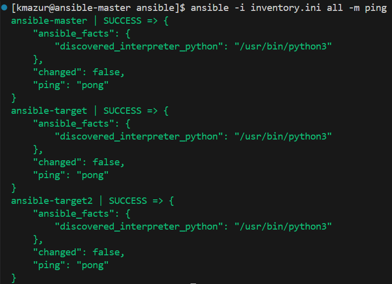

Jak widzimy wszystkie maszyny zwróciły success.

### Zdalne wywoływanie procedur

Najpierw napiszemy, krótki playbook .yml w celu wykonania pingu na wszytskie maszyny:

```yml
- name: Ping all machines
  hosts: all
  tasks:
    - name: Ping test
      ansible.builtin.ping:
```

Przeanalizujmy po kolei co sie w takim pliku dzieje:
- name: Ping all machines
 jest nagłówekiem playbooka, który będzie wyświetlany w konsoli podczas uruchamiania

- hosts: all - to specjalna grupa, która oznacza: wszystkie hosty z inventory. Możemy tu podać też inne grupy, np. Endpoints, Orchestrators, lub pojedynczy host.

- tasks: - rozpoczyna sekcję z listą zadań do wykonania (lista - name: i modułów).
 - name: Ping test  
 ansible.builtin.ping: - sekcja opisująca działanie zadania. Pierwsze to nazwa zadania, która wypisze sie w konsoli, natomiast drugie to komenda w nasztm wypadku jest to standardowy ping maszyn.

W wyniku działania polecenia 
```bash 
ansible-playbook -i inventory.ini ping.yml
```
otrzymamy:

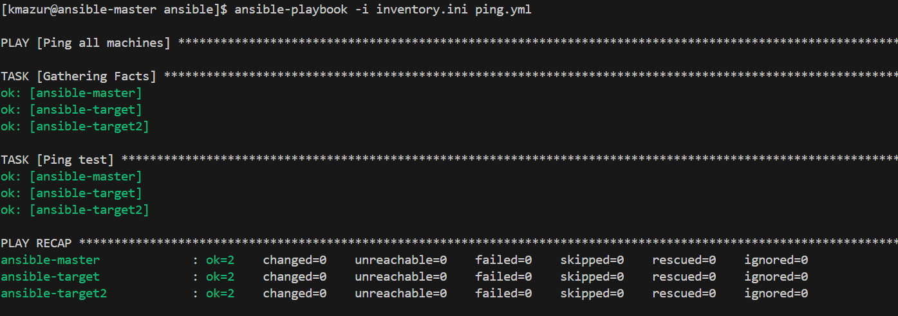

Kolejny playbook będzie kopiował na maszyny target plik inventory.ini z maszyny master, aktualizował pobrane pakiety oraz resetował usługi sshd i rngd:

```yml
- name: Zarządzanie maszynami końcowymi
  hosts: endpoints
  gather_facts: false
  become: true #uzyskiwanie uprawnień root
  tasks:
    - name: Ping test
      ansible.builtin.ping:
    - name: Skopiuj inventory.ini na hosta
      copy:
        src: inventory.ini
        dest: /home/{{ ansible_user }}/inventory.ini
        mode: '0644'
    - name: Aktualizuj pakiety systemowe
      package:
        name: "*"
        state: latest
      ignore_errors: yes
    - name: Restart sshd
      service:
        name: sshd
        state: restarted
      ignore_errors: yes
    - name: Restart rngd
      service:
        name: rngd
        state: restarted
      ignore_errors: yes
```

Jak widzimy w sekcji all zmieniamy teraz cele komunikacyjne na endpoints - oznacza to, że ansible wywoła swoje działanie wyłącznie na endpointach (w moim przypadku ansible-target i ansible-target2). Przeanalizujmy dalsze części:

| **Zadanie**                           | **Znaczenie**                                                                                                                                                           |
| ------------------------------------- | ----------------------------------------------------------------------------------------------------------------------------------------------------------------------- |
| `copy:` <br> `src: inventory.ini`<br>`dest: /home/{{ansible_user}}/inventory.ini` <br> `mode: 0644` | kopiuje plik `inventory.ini` z maszyny master na endpointy do katalogów domowych; plik jest dostępny do odczytu przez wszystkich, modyfikowalny tylko przez właściciela przypisywanie dostępu tożsamo jak w chmod |
| `package:` <br>`name:"*"`<br>`state: latest`     | aktualizuje **wszystkie pakiety systemowe** do najnowszych wersji dostępnych w repozytoriach; pełny update systemu                                                      |
| `service:`<br> `name: sshd`<br>`state: restarted` | restartuje usługę **sshd** (serwer SSH), np. po zmianach konfiguracji; zapewnia, że logowanie zdalne działa zgodnie z aktualnymi ustawieniami                           |
| `service:`<br> `name: rngd`<br>`state: restarted` | restartuje usługę **rngd**, która dba o źródło entropii systemowej; szczególnie ważna na maszynach wirtualnych, gdzie brakuje losowości                                 |

Wywołujemy tożsamo do poprzedniego playbooka:

```bash
ansible-playbook -i inventory.ini ping_and_manage.yml
```

W wyniku:

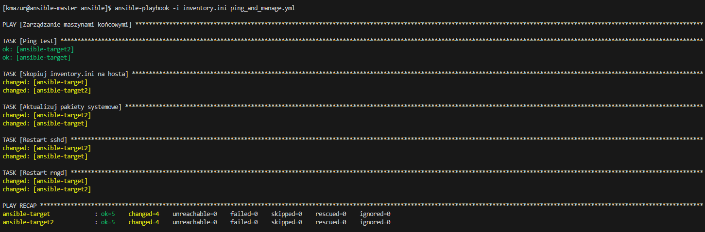

Następnie na obu mawszynach wirtualnych sprawdzamy poleceniem ls czy pojawił się on:

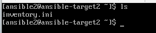

Wykonujemy jeszcze raz playbook:

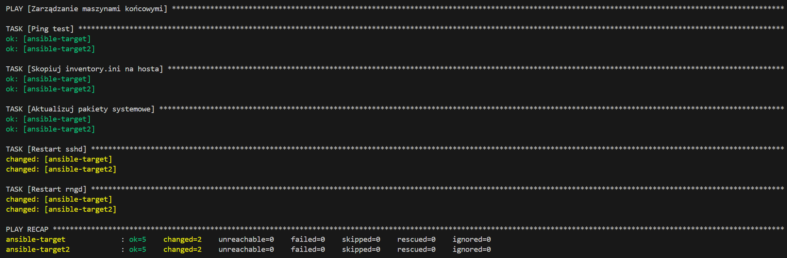

Widzimy różnice między oboma wywołaniami — za pierwszym razem wystąpiły aż 4 operacje oznaczone jako `changed`, natomiast za drugim tylko 2. Ansible najpierw sprawdza, czy operacje muszą zostać wykonane (np. plik .ini już istnieje, a pakiety systemowe są zaktualizowane do najnowszych wersji), dlatego nie wykonuje ich ponownie.

Spróbujmy jeszcze przeprowadzić komunikacje z niedostępną maszyną - zasymulować to możemy na kilka sposobów:

- wyłączenie usługi ssh:
```bash
systemctl stop sshd
```  

- odłączenie karty sieciowej maszyny:  
w ustawieniach maszyny w Hyper-V przechodzimy do sekcji `Karta sieciowa` po czym sekcji `Przełącznik wirtualny` wybieramy opcje `Brak połączenia`

- wyłączenie maszyny:  
na logikę nie możemy się połączyć z maszyna, która nie działa.

Następnie możemy wywołać dowolny z playbooków - ja wywołałem ten tylko z ping-iem

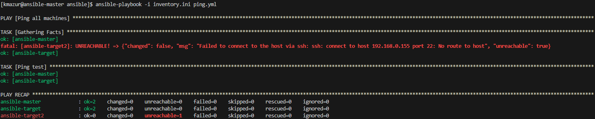

### 3️⃣ Zarządzanie stworzonym artefaktem

Wynikiem mojego pipeline-u na Jenkinsie jest plik .tar zawierający logi, przykładowy plik .js na ktorym możemy uruchomić testy oraz pliki konieczne do działania biblioteki chalk-pipe. Dlatego mój playbook zarządzający artefaktem będzie na endpointy pobierał artefakt z ostatniego udanego pipeline-u, rozpakowywał go i uruchamiał plik example.js - dodatkowo będzie wydruki przekierowywał do plików logów, ale również wyswietlał w konsoli master. Poniżej napisany przeze mnie plik deploy_collect.yml:

```yml
- name: Deploy aplikacji z artefaktu .tar.gz z Jenkinsa
  hosts: endpoints
  become: true
  vars: #zmienne używane w playbook-u
    artifact_url: "http://192.168.0.139:8080/job/Done_Pipe_Chalk/lastSuccessfulBuild/artifact/INO/GCL02/KM415588/Sprawozdanie_2/artifact_result.tar.gz"
    deploy_dir: /home/{{ ansible_user }}/artifact/chalk-pipe
  tasks:
    - name: Upewnij się, że katalog docelowy istnieje
      file:
        path: "{{ deploy_dir }}"
        state: directory
        mode: '0755'
    - name: Pobierz artefakt z Jenkinsa
      get_url:
        url: "{{ artifact_url }}"
        dest: "/tmp/artifact_result.tar.gz"
        mode: '0644'
    - name: Rozpakuj artefakt
      unarchive:
        src: "/tmp/artifact_result.tar.gz"
        dest: "{{ deploy_dir }}"
        remote_src: yes

    - name: Uruchom aplikację (przykładowy plik example.js)
      shell: "node {{ deploy_dir }}/lib/chalk-pipe/example.js > /tmp/app_output.log 2>&1 &"
      args:
        chdir: "{{ deploy_dir }}"
      async: 15
      poll: 0
    - name: Poczekaj chwilę na wygenerowanie logu
      wait_for:
        path: /tmp/app_output.log
        state: present
        timeout: 10
    - name: Odczytaj log działania aplikacji
      shell: cat /tmp/app_output.log
      register: app_output
      changed_when: false
    - name: Wyświetl wynik działania aplikacji
      debug:
        var: app_output.stdout_lines
    - name: Wyświetl zawartość katalogu
      command: ls -l {{ deploy_dir }}
      register: ls_output
    - name: Pokaż zawartość
      debug:
        var: ls_output.stdout_lines
```

| **Zadanie (skrót YAML)** | **Opis działania** |
|---------------------------|--------------------|
| `file:`<br>`path:{{ deploy_dir }}, state=directory, mode='0755'` | Tworzy katalog docelowy dla aplikacji, jeśli nie istnieje. Ustawia uprawnienia `rwxr-xr-x`. |
| `get_url:`<br>`url={{ artifact_url }}, dest=/tmp/artifact_result.tar.gz` | Pobiera artefakt `.tar.gz` z Jenkinsa na zdalną maszynę do katalogu `/tmp`. Ustawia uprawnienia na `rw-r--r--`. |
| `unarchive:`<br>`src=/tmp/artifact_result.tar.gz, dest={{ deploy_dir }}` | Rozpakowuje pobrany artefakt do wcześniej utworzonego katalogu. `remote_src: yes` oznacza, że plik znajduje się już na maszynie docelowej. |
| `shell:`<br>`node {{ deploy_dir }}/lib/chalk-pipe/example.js > /tmp/app_output.log &`<br>`async: 15, poll: 0` | Uruchamia aplikację w tle. Wyjście przekierowywane jest do pliku `/tmp/app_output.log`. Dzięki `async` i `poll: 0` Ansible kontynuuje działanie bez oczekiwania na zakończenie zadania. |
| `wait_for:`<br>`path=/tmp/app_output.log, state=present, timeout=10` | Czeka maksymalnie 10 sekund, aż plik logu aplikacji zostanie utworzony. Zapobiega próbie jego odczytu, gdy jeszcze nie istnieje. |
| `shell:`<br>`cat /tmp/app_output.log`<br>`register: app_output, changed_when: false` | Odczytuje zawartość pliku logu i zapisuje ją do zmiennej `app_output`. Flaga `changed_when: false` informuje, że zadanie nie zmienia stanu systemu. |
| `debug:`<br>`var: app_output.stdout_lines` | Wyświetla zawartość logu aplikacji linia po linii (dokładnie to zapisanej zmiennej app_output). Pozwala zweryfikować, czy aplikacja działa poprawnie. |
| `command:`<br>`ls -l {{ deploy_dir }}`<br>`register: ls_output` | Wykonuje listowanie plików w katalogu aplikacji i zapisuje wynik do zmiennej `ls_output`. |
| `debug:`<br>`var: ls_output.stdout_lines` | Wyświetla zawartość katalogu aplikacji – pliki i ich uprawnienia. Umożliwia weryfikację struktury wdrożenia. |

Wynik uruchomienia:

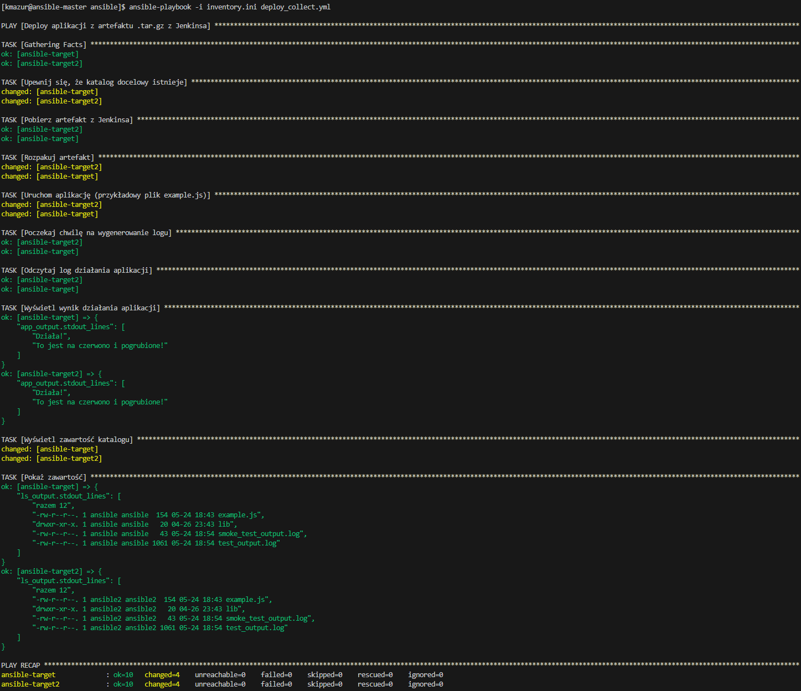

Jak widzimy wszystko przechodzi prawidłowo. jeśli przejdizmey do wybranego z endpointów i uruchomimy plik example.js (`node example.js`) otrzymamy:


## Laboratorium 9 - Pliki odpowiedzi dla wdrożeń nienadzorowanych

Na początku należy dostać się do pliku konfiguracyjnego wygenerowanego przez system podczas instalacji. Można to wykonać na dowolnej maszynie - ja wybrałem do tego moją główną maszynę. Plik anaconda_ks.cfg znajduje się w katalogu root, do którego nie możemy wejść, ale przy użyciu sudo lub zalogowaniu na root możemy wyświetlać pliki które się tam znajdują. Możemy więc wykonać przykładowe polecenie:

```bash
sudo less /root/anaconda_ks.cfg
```

Wyświetli się nam poniższy plik (w repo origina_ks.cfg):

```cfg
# Generated by Anaconda 41.35
# Generated by pykickstart v3.58
#version=DEVEL

# Keyboard layouts
keyboard --vckeymap=us --xlayouts='us'
# System language
lang pl_PL.UTF-8

%packages
@^custom-environment

%end

# Run the Setup Agent on first boot
firstboot --enable
# Do not configure the X Window System
skipx

# Generated using Blivet version 3.11.0
ignoredisk --only-use=sda
# System bootloader configuration
bootloader --location=mbr --boot-drive=sda
autopart
# Partition clearing information
clearpart --all --initlabel --drives=sda

# System timezone
timezone Europe/Warsaw --utc

# Root password
rootpw --iscrypted $y$j9T$D/mD9mTlViOdMffZYKfWmAxA$H.FZzHKGrLqqbG116VQ59Ui48i7gKwsrCprV8L9DzF9
user --groups=wheel --name=kmazur --password=$y$j9T$ig8mzamRlSafku6bcoOJDbYc$VKfk57IziXfdvbkVOga5auS4bPL2BeZlbHryzFTJAm3 --iscrypted --gecos="Kacper Mazur"
```

Pochylmy się najpierw nad każdą z sekcji:

| **Sekcja**                                   | **Opis**                                                                                                                                                            |
| -------------------------------------------- | ------------------------------------------------------------------------------------------------------------------------------------------------------------------- |
| `# Generated by Anaconda...`                 | Informacja, że plik został wygenerowany automatycznie przez instalator graficzny (Anaconda).                                                                        |
| `keyboard --vckeymap=us --xlayouts='us'`     | Ustawia układ klawiatury: fizyczny (`vckeymap`) i graficzny (`xlayouts`) – w tym przypadku: **US**.                                                                 |
| `lang pl_PL.UTF-8`                           | Język systemu: **polski (pl\_PL)** z kodowaniem UTF-8.                                                                                                              |
| `%packages` / `%end`                         | Lista grup i pakietów do zainstalowania. Tu: grupa środowiskowa `@^custom-environment`, czyli niestandardowe środowisko bazowe.                                     |
| `firstboot --enable`                         | Włącza „firstboot” – kreator ustawień, który uruchomi się po pierwszym starcie systemu (chyba że go później wyłączysz).                                             |
| `skipx`                                      | Pomija instalację systemu graficznego X11 (czyli system bez GUI – tryb tekstowy).                                                                                   |
| `ignoredisk --only-use=sda`                  | Instalator ma ignorować wszystkie inne dyski oprócz `/dev/sda`.                                                                                                     |
| `bootloader --location=mbr --boot-drive=sda` | Instalacja bootloadera GRUB w głównym rekordzie rozruchowym dysku `/dev/sda`.                                                                                       |
| `autopart`                                   | Automatyczne partycjonowanie – bez ręcznego ustawiania partycji.                                                                                                    |
| `clearpart --all --initlabel --drives=sda`   | Usuwa wszystkie istniejące partycje na `/dev/sda`, tworzy nową etykietę partycji (ostrzeżenie: **czyści cały dysk**!).                                              |
| `timezone Europe/Warsaw --utc`               | Ustawia strefę czasową: **Warszawa (UTC)**.                                                                                                                         |
| `rootpw --iscrypted ...`                     | Hasło root w postaci zaszyfrowanej (`--iscrypted`).                                                                                                                 |
| `user --groups=wheel --name=kmazur ...`      | Tworzy użytkownika `kmazur`, dodaje go do grupy `wheel` (czyli umożliwia `sudo`), ustawia jego hasło (również zaszyfrowane) oraz pełną nazwę użytkownika (`gecos`). |

Możemy teraz po przesłaniu tego plika na repo i zapisaniu linku do pliku raw, możemy uruchomić instalacje, a kiedy włącza nam się ekran GRUB klikamy klawisz e i dopisujemy `inst.ks=link_do_pliku_raw` - przykładowo:

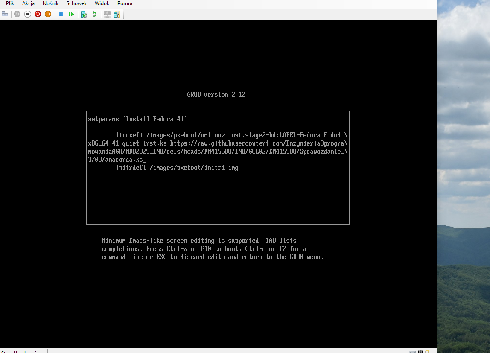

Po uruchomieniu instalacji klikając `CTRL+X` włącza się instalator ale i tak musimy przejść przez okno graficzne instalacji, a po wykonaniu się instalacji musimy kliknąć na końcu przycisk `reboot`. Możemy jednak dopisać do pliku .cfg komendy, które spowodują uruchomienie terminala instalacji (a nie okna graficznego) oraz komende powodującą automatyczny `reboot`.

```cfg
...
version=...
text #dopisek uruchamiający terminal

...
...

reboot #komenda resetu po instalacji
```

Przez `...` rozumiem już znajdujązy się tam kod do którego dopisuję tylko te dwie linijki. Po ponownym uruchomieniu instalacji nie uruchomi się okno graficzne, a po zainstalowaniu systemu wykona się automtyczne ponowne uruchomienie. Kolejnym zadaniem jest dostanie się do artefaktu pipeline-u i uruchomienie aplikacji - w tym celu posłużymy się sekcją `%post`. Dodatkowo musimy zadbać aby aplikacja uruchamiała się w dowolny sposób po uruchomieniu systemu. Najpierw skupmy się jakie pakiety są konieczne w przypadku mojego pipeline-u:

- tar - do rozpakowania artefaktu
- wget - do pobrania artefaktu
- nodejs - do uruchomienia przykładowego programu example.js

Dołączamy je w sekcji `%packages` - prezentować się będzie ona następująco:

```cfg
%packages
@^custom-environment
wget
tar
nodejs
%end
```

Dalej w sekcji `%post` musimy napisać logike koniecznego działania. Po kolei musimy wykonać następujące czynności:

- utworzenie folderu w ścieżce `/usr/local/bin/`, do którego rozpakujemy nasz artefakt
- pobranie artefaktu przy użyciu `wget`
- rozpakowanie artefaktu i nadanie odpowiednich praw użytkownikom
- zapewnienie uruchomienie w dowolny sposób usługi - po analizie stwierdziłem, iż stworzę mojego ezmaple.js serwis, który będzie się raz uruchamiał przy uruchomieniu, ale nie będzie nic robił (możemy zbadać czy podziałało poleceniem `systemctl status`) ale dodatkowo wpiszę do pliku `.bash_profile` aby przy zalogowaniu się do systemu wypisywało się w programie działanie example.js.

Majac plan działania możemy przystąpić do pisania sekcji `%post`:

```cfg
%post --log=/var/log/ks-post.log
echo ">>> Rozpoczynam pobieranie artefaktu z Jenkinsa..."
# Katalog docelowy
mkdir -p /usr/local/bin/chalk-pipe
# Pobierz artefakt (ostatni build)
wget -O /tmp/artifact_result.tar.gz "http://192.168.0.139:8080/job/Done_Pipe_Chalk/lastSuccessfulBuild/artifact/INO/GCL02/KM415588/Sprawozdanie_2/artifact_result.tar.gz"
# Rozpakuj do katalogu
tar -xzf /tmp/artifact_result.tar.gz -C /usr/local/bin/chalk-pipe
# Prawa wykonania
chmod +x /usr/local/bin/chalk-pipe/lib/chalk-pipe/example.js
# Utwórz plik jednostki systemd
cat <<EOF > /etc/systemd/system/chalk-pipe.service
[Unit]
Description=Start chalk-pipe example.js
After=network.target
[Service]
Type=oneshot
ExecStart=/usr/bin/node /usr/local/bin/chalk-pipe/lib/chalk-pipe/example.js
WorkingDirectory=/usr/local/bin/chalk-pipe/lib/chalk-pipe
RemainAfterExit=yes
StandardOutput=journal
StandardError=journal
[Install]
WantedBy=multi-user.target
EOF
cat <<'EOF' >> /home/kmazur/.bash_profile
echo ""
echo ">>> Uruchamiam chalk-pipe (example.js):"
echo "----------------------------------------"
node /usr/local/bin/chalk-pipe/lib/chalk-pipe/example.js
echo ">>> Zakończono działanie example.js"
echo ""
EOF
chown kmazur:kmazur /home/kmazur/.bash_profile
systemctl enable chalk-pipe.service
echo ">>> Instalacja zakończona."
%end
```

Analizując każdą z sekcji:

| **Kod (skrót)** | **Opis działania** |
|------------------|--------------------|
| `%post --log=/var/log/ks-post.log` | Rozpoczyna sekcję postinstalacyjną. Wszystkie wyjścia i błędy z tego bloku zostaną zapisane do logu `/var/log/ks-post.log`. |
| `echo ">>> Rozpoczynam pobieranie artefaktu z Jenkinsa..."` | Komunikat informacyjny – sygnalizuje rozpoczęcie pobierania aplikacji. |
| `mkdir -p /usr/local/bin/chalk-pipe` | Tworzy katalog docelowy, do którego zostanie rozpakowany artefakt. Flaga `-p` sprawia, że nie wystąpi błąd, jeśli katalog już istnieje. |
| `wget -O /tmp/artifact_result.tar.gz "http://..."` | Pobiera artefakt `.tar.gz` z ostatniego udanego buildu Jenkinsa i zapisuje go tymczasowo jako `/tmp/artifact_result.tar.gz`. |
| `tar -xzf /tmp/artifact_result.tar.gz -C /usr/local/bin/chalk-pipe` | Rozpakowuje archiwum `.tar.gz` do katalogu `/usr/local/bin/chalk-pipe`. Flagi `xzf` oznaczają: wypakuj, gzip, plik. |
| `chmod +x ...example.js` | Nadaje plikowi `example.js` prawo do uruchamiania (execute), aby Node.js mógł go wykonać. |
| `cat <<EOF > /etc/systemd/system/chalk-pipe.service`<br>(...) | Tworzy plik jednostki systemd do uruchamiania aplikacji `example.js` jako usługi. Usługa będzie typu `oneshot`, czyli wykona się jednorazowo i zakończy. |
| `WorkingDirectory=...` | Określa katalog roboczy dla procesu – ma znaczenie dla względnych ścieżek wewnątrz aplikacji. |
| `RemainAfterExit=yes` | Pozwala, by usługa pozostała w stanie „active (exited)” po zakończeniu działania – nie jest oznaczana jako „dead”. |
| `cat <<'EOF' >> /home/kmazur/.bash_profile`<br>(...) | Dodaje do `.bash_profile` użytkownika `kmazur` kod, który automatycznie uruchamia aplikację po zalogowaniu (i wypisuje jej wynik na ekran). |
| `chown kmazur:kmazur /home/kmazur/.bash_profile` | Zapewnia, że użytkownik `kmazur` ma pełne prawa do pliku `.bash_profile`, aby mógł go wykonać po zalogowaniu. |
| `systemctl enable chalk-pipe.service` | Rejestruje usługę `chalk-pipe` do automatycznego uruchomienia przy starcie systemu. |
| `echo ">>> Instalacja zakończona."` | Końcowy komunikat potwierdzający zakończenie działania `%post`. |
| `%end` | Kończy sekcję `%post` – obowiązkowa składnia w pliku Kickstart. |

Po zakończonej instalacji i zrebootowaniu systemu loguje się na użytkownika kmazur i otrzymuje następujący wydruk:

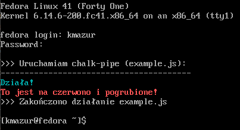

Po wpisaniu komendy `systemctl status chalk-pipe.service` otrzymuje:

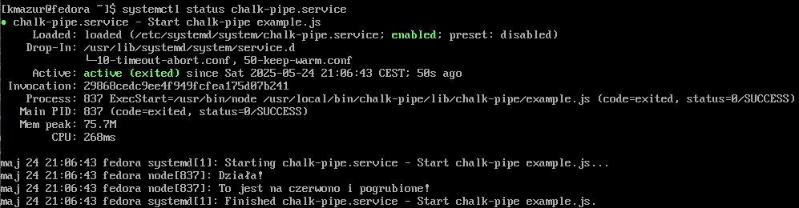

Przechodząc do folderu `/usr/local/bin/chalk-pipe...` i wykonaniu `node example.js` otrzymuje:


## Laboratorium 10 - Wdrażanie na zarządzalne kontenery: Kubernetes (1)

### 1️⃣ Pobranie i przygotowanie minikube
Na początku zajęć pobieramy `minikube`:

```bash
curl -LO https://storage.googleapis.com/minikube/releases/latest/minikube-linux-amd64
sudo install minikube-linux-amd64 /usr/local/bin/minikube
```

Dalej dodałem alias do pliku `~./bashrc` aby ułatwić korzystanie z kubectl:

```bash
echo 'alias kubectl="minikube kubectl --"' >> ~/.bashrc
source ~/.bashrc
```

Następnie wywołuje:

```bash
minikube start
```

Jeśli wyskakuje error, iż nie może dostać się do dockera należy dodać użytkownika do grupy docker jeśli wcześniej nie było to zrobione:

```bash
#najpierw spradźmy czy jest
groups $USER_NAME
#jeśli nie ma go w grupie dockerowej to:
sudo usermod -aG docker $USER_NAME
#dla zrestartowania i wprowadzenia zmian można otworzyć nowe okno terminala bądź
newgrp docker
```

Następnie uruchamiamy jeszcze raz minikube i powinniśmy otrzymać:

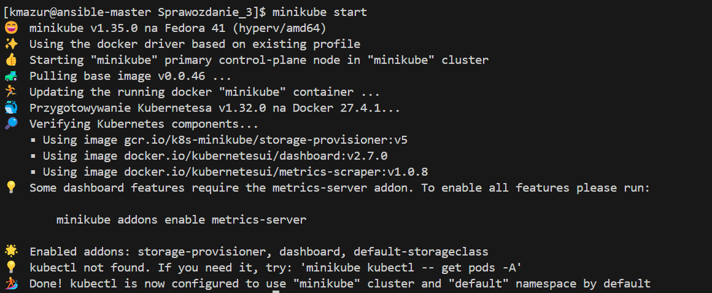

Dalej przetestujmy działanie aliasu kubectl:

```bash
kubectl get po -A
```

Jeśli zwróci poniższy error:

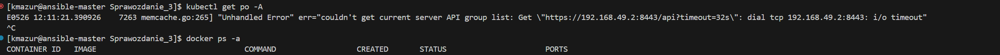

Musimy ustawić kontekst kubectl na minikube poleceniem:

```bash
kubectl config use-context minikube
```

Przetestujmy jeszcze raz i powinniśmy dostać:

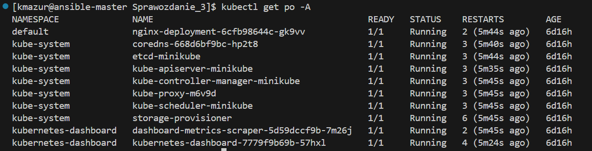

Przejdźmy teraz do minikube dashboard poleceniem:

```bash
minikube dashboard
```

Jeśli nie przeniesie nas bezpośrednio należy wprowadzić link w error - przykładowo w moim wypadku `http://127.0.0.1:35743/api/v1/namespaces/kubernetes-dashboard/services/http:kubernetes-dashboard:/proxy/` wyświetli nam się następująca strona:

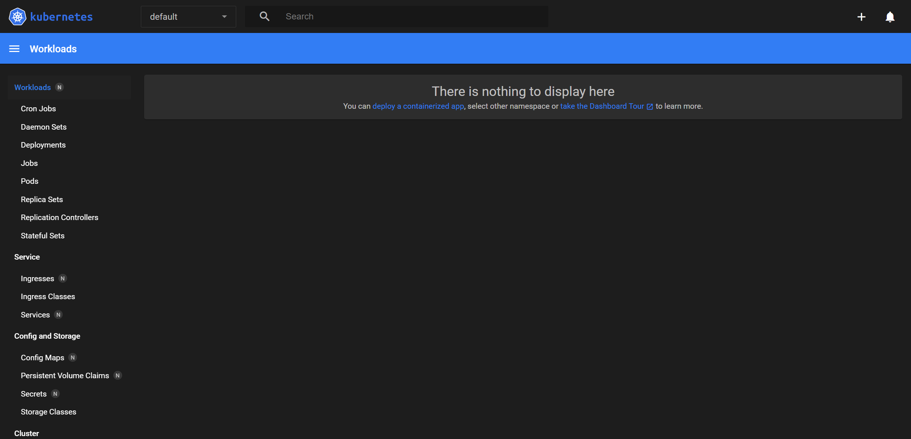

### 2️⃣ Wdrożenie

Te część zadania realiozwać będę dla obrazu nginx - biblioteka chalk-pipe nie nadaje się do wystawiania serwisu http. Zacznijmy od modyfikacji nginx - w tym celu napisze plik html wyświetlający jakiś komunikat:

```html
<!-- index.html -->
<!DOCTYPE html>
<html>
  <head><title>NGINX zmodyfikowany</title></head>
  <body><h1>Witaj w moim kontenerze NGINX!</h1></body>
</html>
```

Następnie w celu zautymatyzowania tworzenia się dockerowego obrazu napisze krutki Dockerfile kopiujący zawartość pliku `index.html` do nginx:

```dockerfile
FROM nginx:latest
COPY index.html /usr/share/nginx/html/index.html
```

Obraz musimy zbudować w dockerze minikube, ponieważ korzysta on ze swojej wirtualnej maszyny i swojego dockera a nie z lokalnych odpowiedników. 

```bash
eval $(minikube docker-env)
docker build -t custom-nginx .
```

Wdrożenie podzielimy na dwa rodzaje:

- ręczne:

**Należy zadbać o uruchomienie minikube i znajdowanie się w jego środowisku** po czym możemy przejść do uruchomienia pojedyńczego poda z naszym obrazem nginx:  
```bash
kubectl run moja-nginxka-pod --image=custom-nginx --port=80 --labels app=moja-nginxka
```  
Następnie sprawdzimy czy pod się utworzył możemy to wykonać poleceniem:

```bash
kubectl get pods
```

Bądź w minikube dashboard:

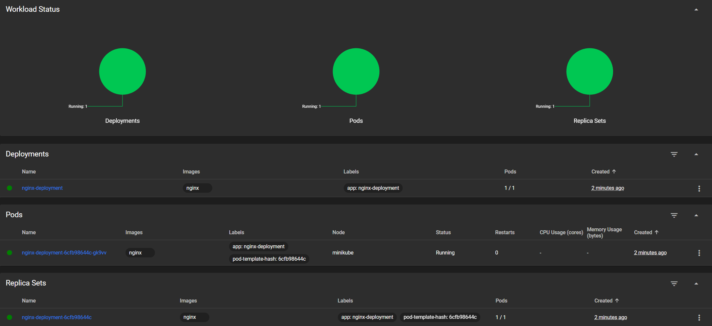

Możemy wyświetlić jak wygląda nasza strona forwardując port dla naszego poda - przykładowo:

```bash
kubectl port-forward pods/moja-nginxka-pod 8080:80
```

Po przejściu pod adres `localhost:8081` moim przypadku pojawia się następująca strona:


- automatycznie

Piszemy plik deploymentu `.yaml` :

```yaml
apiVersion: apps/v1
kind: Deployment
metadata:
  name: nginx-custom
spec:
  replicas: 1
  selector:
    matchLabels:
      app: nginx-custom
  template:
    metadata:
      labels:
        app: nginx-custom
    spec:
      containers:
      - name: nginx-custom
        image: custom-nginx
        ports:
        - containerPort: 80
        resources: {}
```

Następnie możemy uruchomić wdrożenie:

```bash
kubectl apply -f nginx-deployment.yaml
```

Po sprawdzeniu statusu rollout-u:

```bash
kubectl rollout status deployment/nginx-custom
```

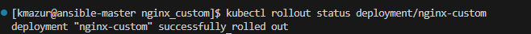

Jak widzimy status jest pozytywny (za mały deployment żeby można było zaobserować zmiany), to samo zaobserwujemy w dashboardzie:

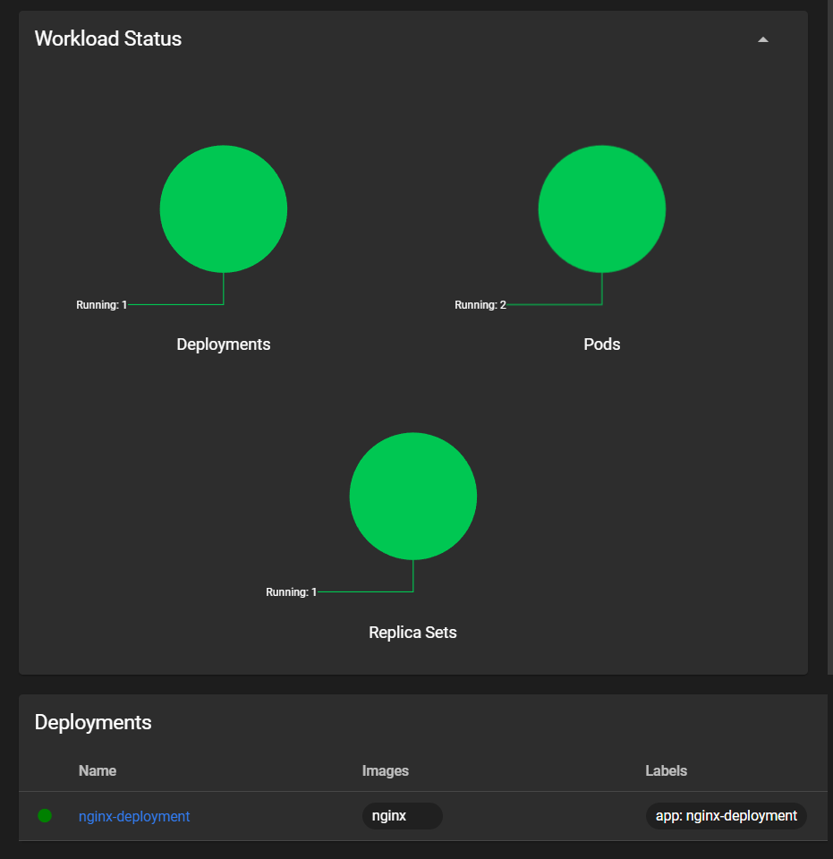

Jak widzimy powstał nowy pod (1 ponieważ w sekcji replicas w pliku `nginx-deployment.yaml` jest tak podane). Dalej eksponujemy deployment jako serwis:

```bash
kubectl expose deployment nginx-custom --type=ClusterIP --port=80 --target-port=80
```

Po sprawdzeniu komendą:

```bash
kubectl get svc
```

Otrzymamy listę serwisów. W dalszym kroku musimy sforwardować port, ale tym razem możemy bezpośrednio do serwisu a nie do poda:

```bash
kubectl port-forward service/nginx-deployment 8080:80
```

Po wejściu pod adres `localhost:8081` otrzymujemy ten sam wynik co wcześniej.

## Labolatorium 11 - Wdrażanie na zarządzalne kontenery: Kubernetes (2)

### 1️⃣ Przygotowanie nowego obrazu

Celem tego zadania jest eksperymentowanie z wprowadzaniem zmian w deployment. Jednym z tych eksperymentów jest przełączannie się między różnymi wersjami jednego obrazu. W tym celu musimy dopisać dwa nowe obrazy:

- działający - taki sam jak utworzony na poprzednich zajęciach, ale drukujący co innego -
przykładowe pliki `.html` oraz `Dockerfile`:

```html
<!-- index.html -->
<!DOCTYPE html>
<html>
  <head><title>NGINX zmodyfikowany</title></head>
  <body><h1>Witaj w moim kontenerze NGINX WERSJAAAA 2!</h1></body>
</html>
```
```dockerfile
FROM nginx:latest
COPY index.html /usr/share/nginx/html/index.html
```

- zepsuty - zwracający error:

```dockerfile
FROM node:18
CMD ["node", "-e", "process.exit(1)"]
```

Następnie zbuduje wszystkie trzy obrazy i wypchne je na Docker Hub:

```bash
# v1
cd nginx_custom
docker build -t kacpermazur/nginx-custom:v1 .
docker push kacpermazur/nginx-custom:v1

# v2
cd ../nginx-2
docker build -t kacpermazur/nginx-custom:v2 .
docker push kacpermazur/nginx-custom:v2

# broken
cd ../broken
docker build -t kacpermazur/nginx-custom:broken .
docker push kacpermazur/nginx-custom:broken
```

Po wejsciu na Docker Hub:

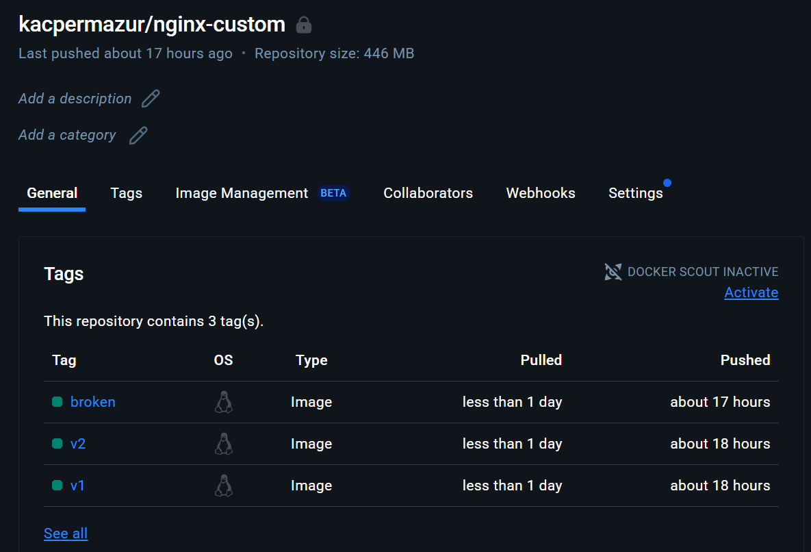

### 2️⃣ Zmiany w deploymencie:

Plik `nginx-deployment.yaml` zmieniam na następujący:

```yaml
apiVersion: apps/v1
kind: Deployment
metadata:
  name: nginx-custom
spec:
  replicas: 4
  selector:
    matchLabels:
      app: nginx-custom
  template:
    metadata:
      labels:
        app: nginx-custom
    spec:
      containers:
      - name: nginx-custom
        image: kacpermazur/nginx-custom:v1
        ports:
        - containerPort: 80
        resources: {}

        readinessProbe:
            httpGet:
              path: /
              port: 80
            initialDelaySeconds: 3
            periodSeconds: 5
```

Oprócz zmian nazw i ilości podów dodaje sekcje `readinessProbe`, zgodnie z którą kuberenetes będzie wykonywał zapytanie `Get` na port 80 po 3 sekundach i będzie wykonywał powtażające się zapytanie co 5 sekund. Powoduje to, iż juz kuberentes będzie potrafił wykryć błędny obraz i zatrzymać jego deployment. Nasępnie taki deployment uruchamiamy już znanym poleceniem:

```bash
kubectl apply -f nginx-deployment.yaml
```
#### Zmiana ilości podów:

Jednym z sposobów na to jest zmiana w pliku wdrożenia w sekcji replicas i każdorazwoe wykonywanie `kubectl apply`. Moim zdaniem o wiele przyjemniejsza jest funkcja:

```bash
kubectl scale deployment nginx-custom --replicas=x
```
Gdzie za x wstawiamy dowolną liczbę. Po kolei w naszym ćwiczeniu wykonuje eksperymenty dla 8 podów:

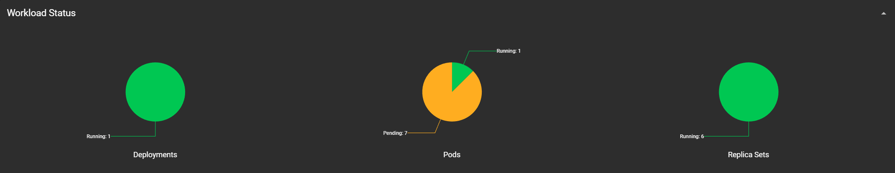

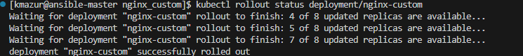

Dla 0 podów

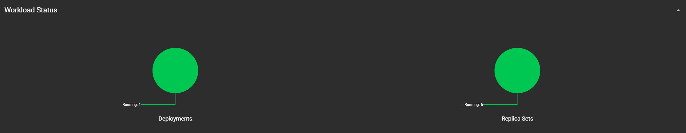

Dla 1:

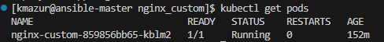

Udało mi sie złapać jescze wdrażające sie pody dla 8. Dla zmiany scali pody zawsze znikają i pojawiają sie nowe w liczbie x. Na końcu wracamy do liczby podów = 4.

#### Wersja obrazu:

Z obrazami możemy postępować tak samo jak z podami - albo możemy zmieniać plik wdrożenia, albo używać konkretnej komendy:

```bash
kubectl set image deployment/nginx-custom nginx-custom=kacpermazur/nginx-custom:VERS --record
```

Gdzie w VERS wprowadzamy wybraną przez nas nazwe obrazu. I tak dla pierwszego obrazu mamy takie same wyniki jak podczas poprzednich labolatoriów, natomiast dla dwóch pozostałych (**PAMIĘTAĆ O `kubectl port-forward`**):


Po zmiany obrazu na broken obserwujemy ciekawe zjawisko - po wywołaniu funkcji `kubectl rollout status`:

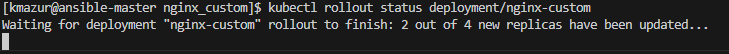

I trwa on nieskonczenie długo (do przerwania `CTRL+C`). Po wejsciu do dashboardu natomiast:

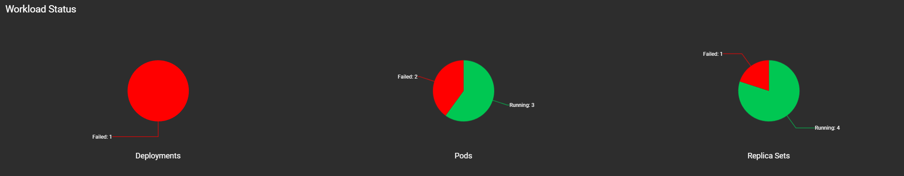

W celu cofnięcia do poprzedniej wersji możemy wykonać:

```bash
kubectl rollout undo deployment/nginx-custom
```

Wtedy kuberenets wraca nam do poprzedniego rolloutu możliwe jest również wyświetlenie historii rolloutów w konsoli (w dashboardzie zjechanie w dół)

```bash
kubectl rollout history deployment/nginx-custom
```

Przykładowo:

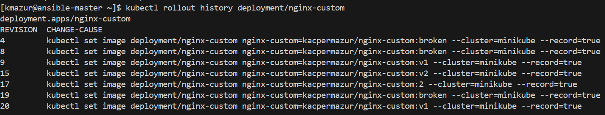

Znając id rollout do którego chcemy się cofnąć możemy również wykonać:

```bash
kubectl rollout undo deployment/nginx-custom --to-revision=2
```

Jak widzimy w historii nie zapisały się polecenia donoszące się do zmiany ilości podów - wynika to z braku flagi `--record` na końcu.

### 3️⃣ Kontrola wdrożenia:

Celem jest napisanie skryptu sprawdzającego czy wdrożenie zdąży się wdrożyć w 60 sekund:

```bash
#!/bin/bash
DEPLOYMENT="nginx-custom"
TIMEOUT=60
INTERVAL=5

echo "Sprawdzanie rollout'u dla \"$DEPLOYMENT\"..."

for ((i=0; i<TIMEOUT; i+=INTERVAL)); do
  STATUS=$(minikube kubectl -- rollout status deployment/$DEPLOYMENT --timeout=5s 2>&1)

  echo "$STATUS" | grep -q "successfully rolled out"
  if [ $? -eq 0 ]; then
    echo "✅ Rollout zakończony sukcesem."
    exit 0
  fi

  echo "Czekam dalej... ($i/${TIMEOUT}s)"
  sleep $INTERVAL
done

echo "❌ Rollout NIE zakończył się w czasie $TIMEOUT sekund."
exit 1
```

Następnie uruchamiamy rollout z ogromną liczbą podów (np 200) i uruchamiamy skrypt check_rollout.sh:

```bash
kubectl scale deployment nginx-custom --replicas=200 --record
bash check_rollout.sh 
```

Po wcześniejszych próbach wiem, że ta liczba dla mojego systemu jest wystarczająca abu deployment sie nie wykonał i/lub trwał więcej niż 60 s. W wyniku działania skryptu otrzymuje:

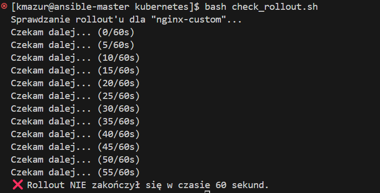

Zmieniamy ilość podów na mniejszą i uruchamiamy jeszcze raz. Tym Razem otrzymuje:

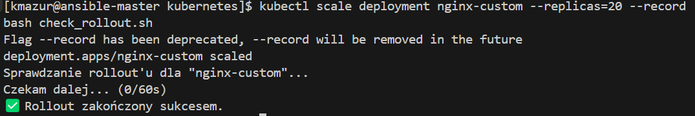

### 4️⃣ Strategie wdrożenia:

W świecie Kubernetes, strategia wdrożenia to sposób, w jaki nowa wersja aplikacji jest wprowadzana do środowiska produkcyjnego, czyli jak system zastępuje działające już pody nowymi, bez (lub z minimalnym) zakłóceniem działania całej aplikacji.

Strategia wdrożenia określa:

- czy najpierw usunąć stare pody, a potem włączyć nowe,

- czy robić to stopniowo, jeden po drugim,

- czy testować nową wersję tylko na małej części ruchu.

#### Główne strategie wdrożeń:

<hr>
<h2 align="center">───────────────<strong>Recreate</strong>───────────────</h2>
<hr>

Strategia Recreate jest najprostszą i najbardziej bezpośrednią metodą wdrożenia nowej wersji aplikacji. Polega na tym, że Kubernetes najpierw usuwa wszystkie działające pody, a dopiero potem uruchamia nowe zaktualizowane instancje. Choć ta metoda jest szybka i łatwa do zrozumienia, ma jedną istotną wadę: prowadzi do chwilowego przestoju w działaniu usługi, co może być niedopuszczalne w systemach o wysokiej dostępności. W celu jej przetestowania napisałem poniższy plik wdrożenia:

```yaml
apiVersion: apps/v1
kind: Deployment
metadata:
  name: nginx-custom
  labels:
    app: nginx-custom
    version: v1
spec:
  strategy:
    type: Recreate
  replicas: 10
  selector:
    matchLabels:
      app: nginx-custom
      tier: frontend
  template:
    metadata:
      labels:
        app: nginx-custom
        tier: frontend
    spec:
      containers:
      - name: nginx-custom
        image: kacpermazur/nginx-custom:v1
        ports:
        - containerPort: 80
        resources: {}
        readinessProbe:
          httpGet:
            path: /
            port: 80
          initialDelaySeconds: 3
          periodSeconds: 5
```

Po czym standardowo zastosowałem poniższą komendę:

```bash
kubectl apply -f nginx-custom-recreate.yaml
```

Może wystąpić błąd mówiący, iż aplikacja nginx-custom już istnieje - deployment stworzony w poprzednim zadaniu. Wtedy albo należy zmienić nazwę aplikacji w etykiecie `app:` w pliku `nginx-custom-recreate.yaml` albo usunąć stary deployment i uruchomić nowy:

```bash
kubectl delete deployment/nginx-custom
kubectl apply -f nginx-custom-recreate.yaml
```

Po utworzeniu nowego deploymentu widzimy, iż pody tworzą się standardowo:

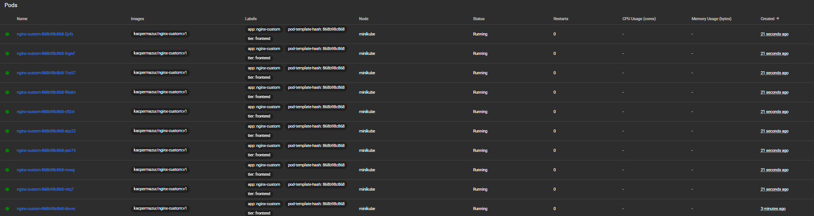

Na zdjęciu jeden pod jest dużo starszy - wynika to z początkowego uruchomienia przeze mnie deploymentu z 1 podem i potem rescallingu do 10 - wtedy strategia recreate nie działa, bo nie ma po co (stare pody mają dobre oprogramowanie, więc wystarczy dodać nowe). Następnie zmieniłem obraz kontenera na `v2`:

```bash
kubectl set image deployment/nginx-custom nginx-custom=kacpermazur/nginx-custom:v2 --record
```

Po czym zaobserwowałem poniższy wynik w dashboardzie:

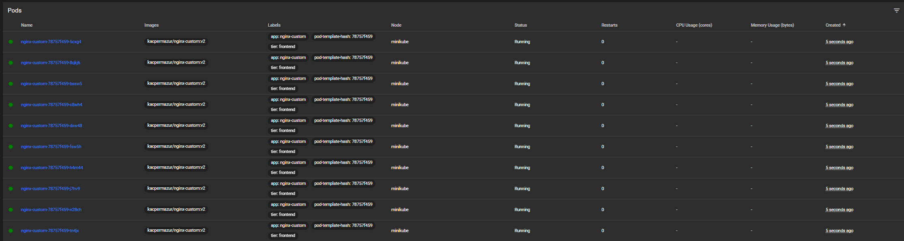

Jak widizmy wszystkie stare pody zostały usunięte i powstały nowe - wskazuje na to krótki czas created (kilka sekund, a nie jak na poprzednim kilkanaście i jeden pod 3 minutowy).


<hr>
<h2 align="center">───────────────<strong>Rolling Update</strong>───────────────</h2>
<hr>

Rolling Update to domyślna strategia w Kubernetesie i najbardziej zalecana w większości przypadków. W tym podejściu nowe pody są uruchamiane stopniowo, podczas gdy stare są po kolei usuwane, aż cały klaster przejdzie na nową wersję. Zachowana jest pełna dostępność aplikacji – zawsze działa przynajmniej część instancji. Parametry takie jak `maxUnavailable` (ile podów może być chwilowo niedostępnych) i `maxSurge` (ile dodatkowych podów może być utworzonych tymczasowo) pozwalają dostosować tempo aktualizacji do potrzeb. Napisałem w celu zasymulowania działania tej strategi nowy plik `nginx-deployment-rolling.yaml`:

```yaml
apiVersion: apps/v1
kind: Deployment
metadata:
  name: nginx-custom
  labels:
    app: nginx-custom
    version: v2
spec:
  strategy:
    type: RollingUpdate
    rollingUpdate:
      maxUnavailable: 2
      maxSurge: 30%
  replicas: 10
  selector:
    matchLabels:
      app: nginx-custom
      tier: frontend
  template:
    metadata:
      labels:
        app: nginx-custom
        tier: frontend
    spec:
      containers:
      - name: nginx-custom
        image: kacpermazur/nginx-custom:v2
        ports:
        - containerPort: 80
        resources: {}
        readinessProbe:
          httpGet:
            path: /
            port: 80
          initialDelaySeconds: 3
          periodSeconds: 5
```
Zastsowałem wartość parametrów `maxUnavailable` = 2 oraz `maxSurge`=30%. Następnie postępujemy podobnie jak z strategią recreate - przebudowujemy deployment `kubectl apply -f nginx-deployment-rolling.yaml` - jeśli wystąpi błąd postępować tak samo jak w wypadku recreate. Po wprowadzeniu się wdrożenia obserwujemy poniższy stan:

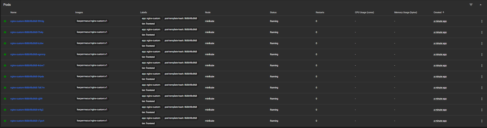

Następnie zmieniamy wersje obrazu - **Uwaga w pliku deployment jest wersja v2 więc trzeba zmienić na v1**:

```bash
kubectl set image deployment/nginx-custom nginx-custom=kacpermazur/nginx-custom:v1 --record
```

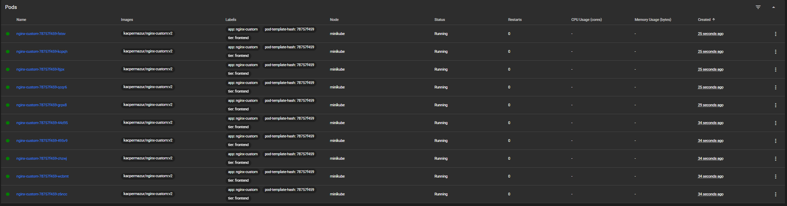

Jak widać na obrazku pody z tym samym czasem życia mieszczą się w naszych ograniczeniach - tj. `2 unactive + 30% maxSurge*10 = 5`. Nie udało mi się udokumentować zmian w czasie rzeczywistym - za szybko się zmieniały pody.

<hr>
<h2 align="center">───────────────<strong>Canary Deployment</strong>───────────────</h2>
<hr>

Canary Deployment – zaawansowana strategia, w której nowa wersja aplikacji jest wdrażana najpierw tylko na części infrastruktury – zwykle 1 z wielu podów. System monitoruje jej działanie, analizuje błędy i wydajność, a dopiero potem — jeśli wszystko działa poprawnie — rozszerza wdrożenie na pozostałe instancje. W tym celu napisałem dwie wersje plików wdrożeń - 

`nginx-stable.yaml`
```yaml
apiVersion: apps/v1
kind: Deployment
metadata:
  name: nginx-stable
spec:
  replicas: 3
  selector:
    matchLabels:
      app: nginx-custom
      version: stable
  template:
    metadata:
      labels:
        app: nginx-custom
        version: stable
    spec:
      containers:
      - name: nginx-custom
        image: kacpermazur/nginx-custom:v1
        ports:
        - containerPort: 80
```

`nginx-canary.yaml`
```yaml
apiVersion: apps/v1
kind: Deployment
metadata:
  name: nginx-canary
spec:
  replicas: 1
  selector:
    matchLabels:
      app: nginx-custom
      version: canary
  template:
    metadata:
      labels:
        app: nginx-custom
        version: canary
    spec:
      containers:
      - name: nginx-custom
        image: kacpermazur/nginx-custom:v2
        ports:
        - containerPort: 80
```

Należy dodatkowo zadbać, aby był uruchomiony serwis nginx-service z poprzedniego zadania - jeśli nie został utworzony i uruchomiony poprzednio tworzymy go `kubectl apply -f nginx-service.yaml` po utworzeniu poniższego pliku:

```yaml
apiVersion: v1
kind: Service
metadata:
  name: nginx-service
spec:
  type: NodePort
  selector:
    app: nginx-custom
  ports:
    - protocol: TCP
      port: 80
      targetPort: 80
      nodePort: 30080
```

Bedzie on obsługiwał aplikację nginx-custom i wszytskie jej pody - umożliwi to dostęp do nginx-stable i nginx-canary. Należy jej jednak uruchomić poleceniem `kubectl apply`. Po wejściu w zakłądke deployment:

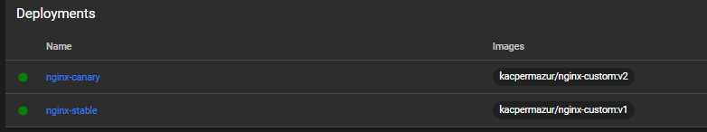

Pojawiają nam się oba deploymenty, w pods natomiast:

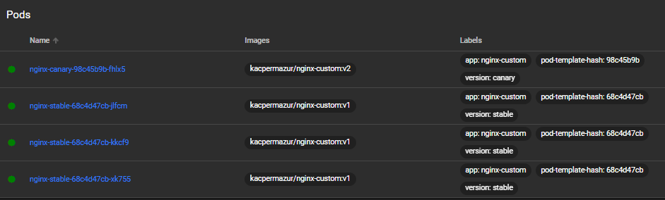

Jeśli udostępnimy port serwisowi nginx-service i wejdziemy na niego w przeglądarce możemy otrzymać zarówno jedną jak i druga wersję. Podczas symulacji możemy rescalować oba deploymenty i wtedy serwis też ma odpowiednią ilość podów jednego i drugiego deploymentu.

<hr>
<h2 align="center">───────────────<strong>Etykiety</strong>───────────────</h2>
<hr>

W powyższych zadaniach przewijało się czesto pojęcie etykiet - podstawowy mechanizm organizacji, selekcji i zarządzania zasobami w Kubernetesie. Są to pary `klucz–wartość` (key: value), które można przypisywać niemal każdemu obiektowi (Pod, Deployment, Service itd.). Dzięki etykietom możliwe jest:

- grupowanie zasobów logicznie (np. app: nginx-custom),

- rozróżnienie wersji aplikacji (np. version: v1, version: canary),

- selektywne kierowanie ruchem przez serwisy,

- śledzenie historii i strategii wdrożeń,

- filtrowanie i automatyzacja za pomocą kubectl, CI/CD, Prometheusa czy Jenkins Pipelines.

Etykiety są także kluczowe dla działania selektorów (matchLabels), które decydują, które pody należą do danego Deploymentu lub które instancje są obsługiwane przez Service.

Przykładowe użyte przeze mnie etykiety i ich wyjaśnienie:

| Klucz etykiety | Przykładowe wartości           | Opis funkcjonalny                                          |
| -------------- | ------------------------------ | ---------------------------------------------------------- |
| `app`          | `nginx-custom`                 | Identyfikator aplikacji – wspólny dla różnych wersji       |
| `version`      | `v1`, `v2`, `canary`, `stable` | Rozróżnienie wersji aplikacji – wspiera rollout i canary   |
| `strategy`     | `recreate`, `rolling`          | Informacja o strategii wdrożenia dla celów diagnostycznych |
| `tier`         | `frontend`                     | Klasyfikacja warstwy aplikacyjnej (np. frontend/backend)   |

## Użycie AI w sprawozdaniu:

- generacja szablonów tabel do sprawozdania
- kontrola poprawności napisanych plików
- sprawdzenie logiki i poprawności myślenia
- diagnostyka problemu i udostępnianie źródeł do rozwiązania ich
- wygenerowanie nagłówków w formacie `HTML` do strategi