# Sprawozdanie nr 1

## Zadanie 1:

1. Po zainstalowaniu i skonfigurowaniu systemu Fedora Server na maszynie wirtualnej połączyłem się z nim przez wiersz poleceń w systemie Windows za pomocą polecenia:
```sh
ssh root@192.168.100.38
```
 
**Interfejs systemu Fedora oraz ip z którym się połączyłem:**

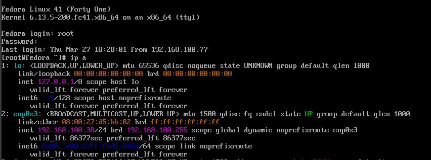

Kolejnym krokiem jest instalacja klienta Git poprzez polecenie
```sh
sudo dnf install git
```
2. Następnie sklonowałem repozytorium przez HTTPS i Personal Access Token:
```sh
git clone https://github.com/InzynieriaOprogramowaniaAGH/MDO2025_INO.git
```
3. Utworzyłem dwa klucze SSH w tym jeden zabezpieczony hasłem używając komendy:
```sh
ssh-keygen -t ed25519 -C "milosznowak25@gmail.com"
```
Dodałem utworzony klucz do SSH agent:
```sh
eval "$(ssh-agent -s)"
ssh-add ~/.ssh/id_ed25519
```
**Utworzone klucze na Github:**

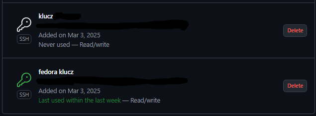

Upewniłem się że mam dostęp do repozytorium:

**Komenda ssh -T git@github.com:**

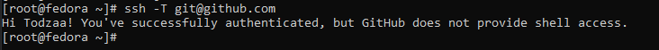

Następnie sklonowałem repozytorium za pomocą SSH:
```sh
git clone git@github.com:InzynieriaOprogramowaniaAGH/MDO2025_INO.git
```

**Repozytorium widoczne w systemie Fedora po sklonowaniu:**

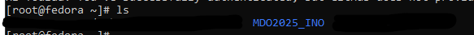

4. Kolejnym krokiem było przełączenie się na gałąź "main", a następnie na gałąź swojej grupy. Zrobiłem to kolejno poleceniami:
```sh
git checkout main
git checkout GCL02
```
Następnie utworzyłem własną gałąź:
```sh
git checkout -b MN417158
```
I upewniłem się że znajduję się na nowo utworzonej gałęzi:
```sh
git branch
```

**Aktualna gałąź:**

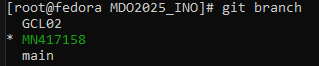

5. Pracę na nowej gałęzi rozpocząłem od utworzenia nowego katalogu o takiej samej nazwie jak moja gałąź ```sh mkdir MN417158```

6. W nim utworzyłem skrypt git hook, którego zadaniem jest sprawdzanie czy każdy mój commit zaczyna się od moich inicjałów i numeru grupy ```sh nano commit-msg.sh```

**Treść skryptu git hook:**

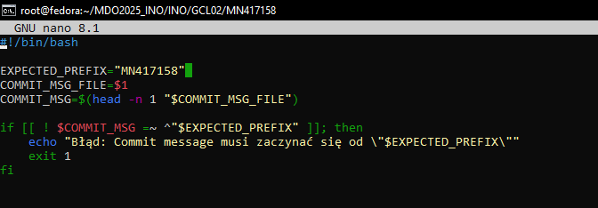

Utworzony skrypt przekopiowałem do odpowiedniego pliku z innymi skryptami .git/hook aby działał poprawnie, a następnie nadałem mu odpowiednie uprawnienia za pomocą ```sh chmod +x .git/hooks/commit-msg```

**Sprawdzenie poprawnego kopiowania i nadania skryptowi uprawnień:**

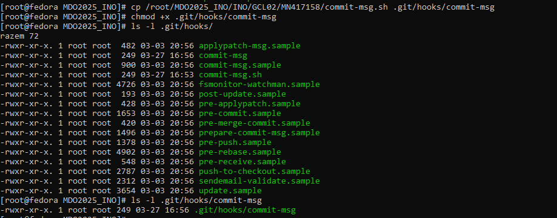

**Działanie skryptu w przypadku błędnej treści commitu:**

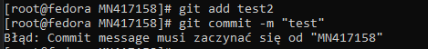

7. Ostatnim krokiem było dodanie, zacommitowanie i wysłanie wykonanych zmian na zdalne repozytorium:
```sh
git add MN417158
git commit -m "MN417158"
git push origin MN41758
```

## Zadanie 2:

1. Zainstalowałem oprogramowanie Docker na systemie Fedora za pomocą polecenia ```sh sudo dnf install -y docker```
2. Następnie zarejestrowałem się w Docker Hub:

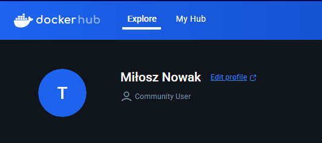

3. Kolejnym krokiem było pobranie obrazów hello-world, busybox, ubuntu, fedora oraz mysql używając ```sh docker pull```

**Wyświetlenie pobranych obrazów:**

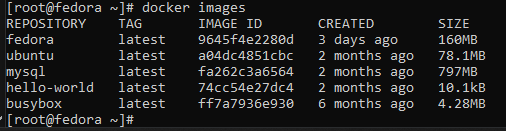

4. Następnie uruchomiłem kontener z obrazu busybox i wypisałem w nim komunikat aby pokazać efekt jego uruchomienia ```sh docker run busybox echo "Hello!"```


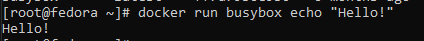  

5. Podłaczyłem sie do kontenera w sposób interaktywny i wywołałem numer wersji ```sh docker run -it busybox sh```

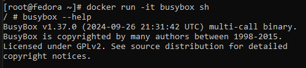

6. Uruchomiłem kontener z obrazu fedora za pomocą ```sh docker run -it fedora bash```
następnie po ```sh dnf install procps -y```

**Wyświetliłem PID1 w kontenerze, zaktualizowałem pakiety i opuściłem kontener**

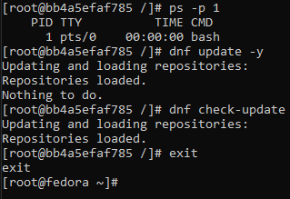

7. Utworzyłem własny Dockerfile [Plik1](files/Dockerfile) następnie za jego pomocą zbudowałem i uruchomiłem kontener na którym znajdowało się sklonowane repozytorium.

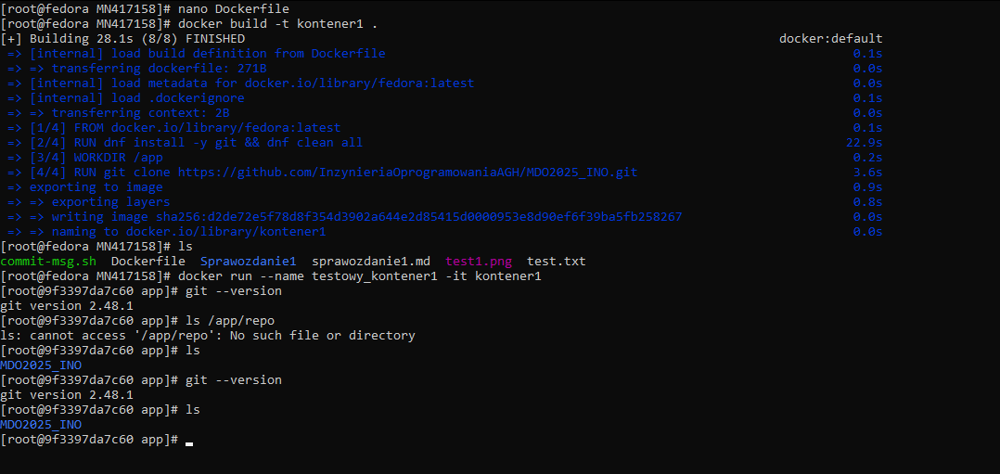

8. Wyczyściłem wszystkie uruchomione kontenery ```sh docker rm $(docker ps - aq)```

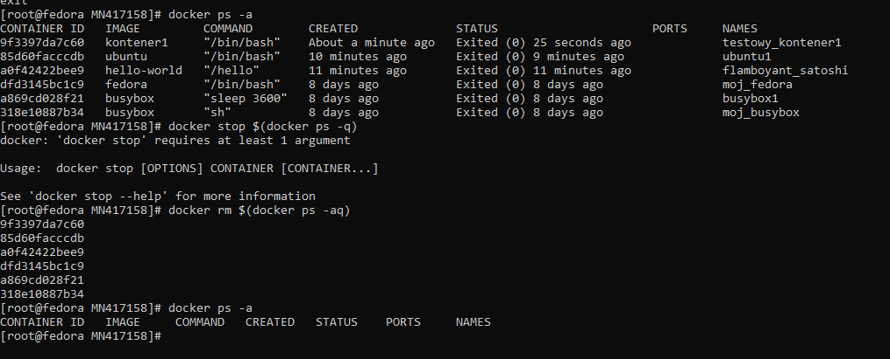

9. Wyczyśiłem wszystkie obrazy ```sh docker rmi $(docker images - q)```
 
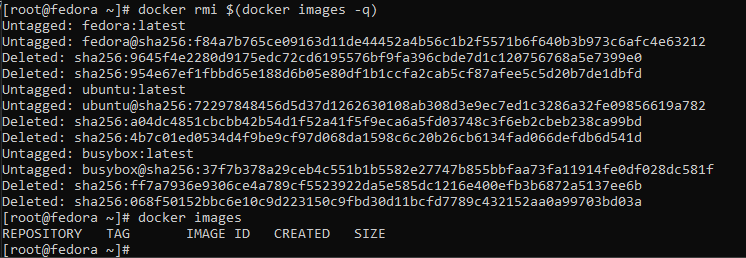

## Zadanie 3:

1. Do wykonania zadania konieczny był wybór oprogramowania dysponującego otwartą licencją oraz umożliwia zbudowanie i wykonanie testów na aplikacji. W moim przypadku wybór padł na aplikację [Chalk](https://github.com/chalk/chalk?tab=readme-ov-file) Jest to biblioteka dla Node.js która umożliwia stylizowanie tekstu za pomocą konsoli.

2. Sklonowałem repozytorium na system Fedora ```sh git clone https://github.com/chalk/chalk.git```

Następnie po wejściu do katalogu z aplikacją zbudowałem ją poprzez ```sh npm install```

Uruchomiłem testy ```sh npm test```

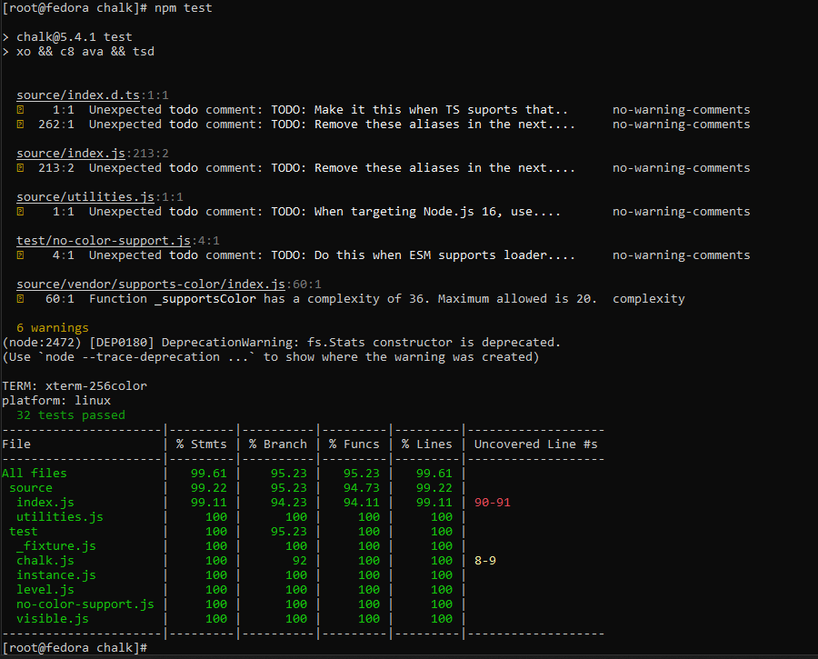

3. Ponowiłem to działanie, tym razem jednak wykonałem te kroki interaktywnie w kontenerze. Poleceniem ```sh docker run -it --rm ubuntu bash```
uruchomiłem kontener na obrazie ubuntu. Następnie pobrałem konieczne zależności ```sh apt-get update && apt-get install -y git nodejs npm```

4. Przeprowadziłem build i testy tak samo jak poza kontenerem:

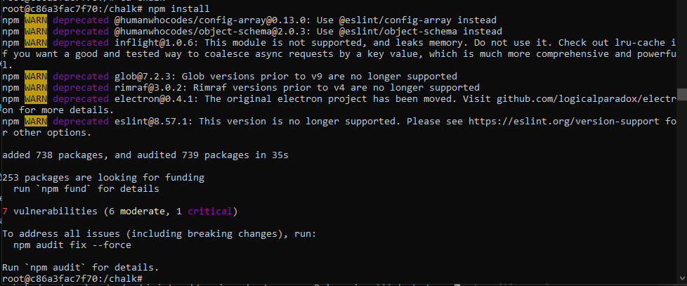

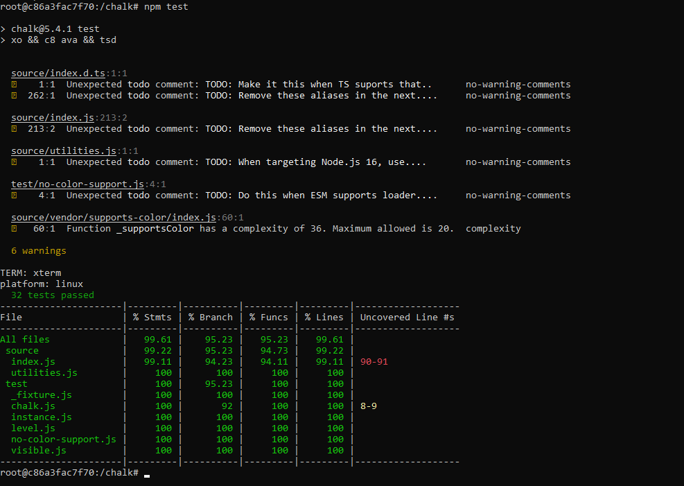

5. Ostatnim zadaniem było zautomatyzowanie poprzednich kroków poprzez stworzenie dwóch Dockerfile [Dockerfile.build](files/Dockerfilechalk.build) [Dockerfile.test](files/Dockerfilechalk.test)

6. Następnie zbudowałem obraz, który będzie odpowiadał za klonowanie repozytorium i instalację aplikacji poleceniem ```sh docker build -f Dockerfilechalk.build -t buildnode .```

Potem zbudowałem drugi, bazujący na pierwszym, obraz mający za zadanie przeprowadzić testy ```sh docker build -f Dockerfilechalk.test -t testnode .```

**Budowanie obrazu buildnode:**

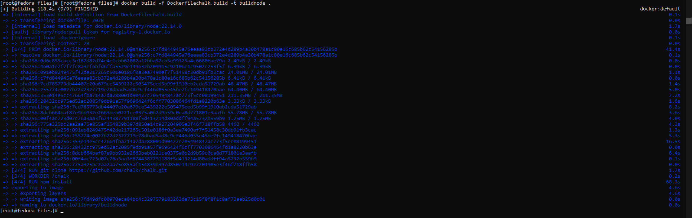

**Budowanie obrazu testnode:**

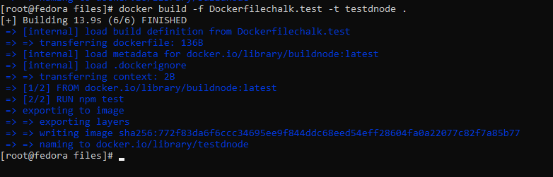

7. Uruchomiłem kontener na podstawie obrazu testnode i sprawdziłem jego poprawne działanie. Kontener jest uruchomioną instancją utworzonego wcześniej obrazu. W kontenerze pracują procesy zdefiniowane w obrazie. Testy wykonały się prawidłowo:

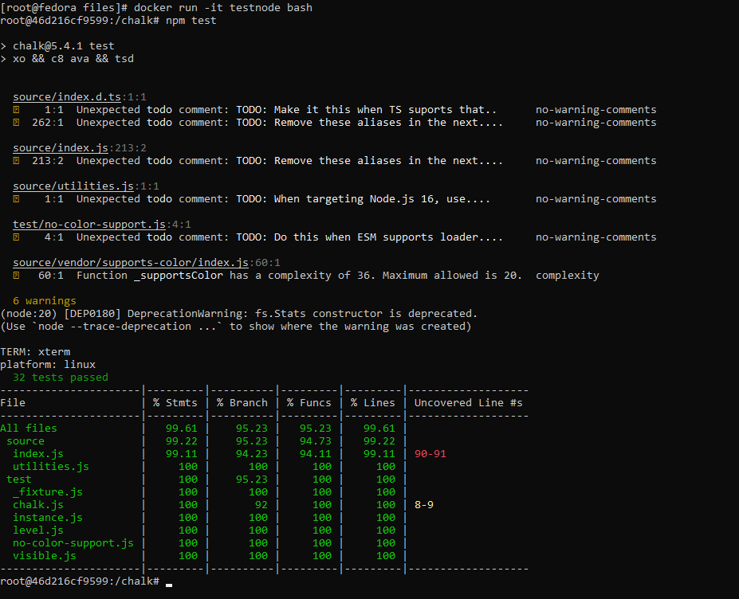

## Zadanie 4:

