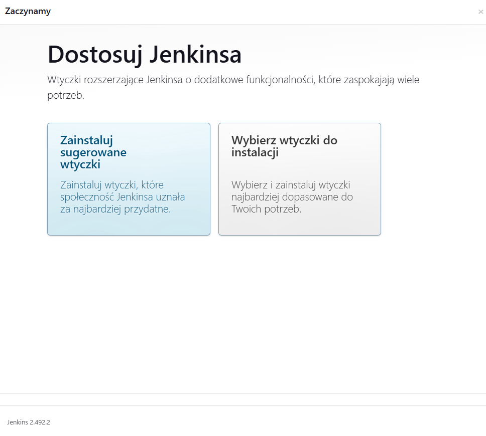

# Sprawozdanie nr 1

## Zajęcia 01:

1. Po zainstalowaniu i skonfigurowaniu systemu Fedora Server na maszynie wirtualnej połączyłem się z nim przez wiersz poleceń w systemie Windows za pomocą polecenia:
```sh
ssh root@192.168.100.38
```
 
**Interfejs systemu Fedora oraz ip z którym się połączyłem:**


Kolejnym krokiem jest instalacja klienta Git poprzez polecenie
```sh
sudo dnf install git
```
2. Następnie sklonowałem repozytorium przez HTTPS i Personal Access Token:
```sh
git clone https://github.com/InzynieriaOprogramowaniaAGH/MDO2025_INO.git
```
3. Utworzyłem dwa klucze SSH w tym jeden zabezpieczony hasłem używając komendy:
```sh
ssh-keygen -t ed25519 -C "milosznowak25@gmail.com"
```
Dodałem utworzony klucz do SSH agent:
```sh
eval "$(ssh-agent -s)"
ssh-add ~/.ssh/id_ed25519
```
**Utworzone klucze na Github:**


Upewniłem się że mam dostęp do repozytorium:

**Komenda ssh -T git@github.com:**


Następnie sklonowałem repozytorium za pomocą SSH:
```sh
git clone git@github.com:InzynieriaOprogramowaniaAGH/MDO2025_INO.git
```

**Repozytorium widoczne w systemie Fedora po sklonowaniu:**


4. Kolejnym krokiem było przełączenie się na gałąź "main", a następnie na gałąź swojej grupy. Zrobiłem to kolejno poleceniami:
```sh
git checkout main
git checkout GCL02
```
Następnie utworzyłem własną gałąź:
```sh
git checkout -b MN417158
```
I upewniłem się że znajduję się na nowo utworzonej gałęzi:
```sh
git branch
```

**Aktualna gałąź:**


5. Pracę na nowej gałęzi rozpocząłem od utworzenia nowego katalogu o takiej samej nazwie jak moja gałąź ```sh mkdir MN417158```

6. W nim utworzyłem skrypt git hook, którego zadaniem jest sprawdzanie czy każdy mój commit zaczyna się od moich inicjałów i numeru grupy ```sh nano commit-msg.sh```

**Treść skryptu git hook:**


Utworzony skrypt przekopiowałem do odpowiedniego pliku z innymi skryptami .git/hook aby działał poprawnie, a następnie nadałem mu odpowiednie uprawnienia za pomocą ```sh chmod +x .git/hooks/commit-msg```

**Sprawdzenie poprawnego kopiowania i nadania skryptowi uprawnień:**


**Działanie skryptu w przypadku błędnej treści commitu:**


7. Ostatnim krokiem było dodanie, zacommitowanie i wysłanie wykonanych zmian na zdalne repozytorium:
```sh
git add MN417158
git commit -m "MN417158"
git push origin MN41758
```

## Zajęcia 02:

1. Zainstalowałem oprogramowanie Docker na systemie Fedora za pomocą polecenia ```sh sudo dnf install -y docker```
2. Następnie zarejestrowałem się w Docker Hub:


3. Kolejnym krokiem było pobranie obrazów hello-world, busybox, ubuntu, fedora oraz mysql używając ```sh docker pull```

**Wyświetlenie pobranych obrazów:**


4. Następnie uruchomiłem kontener z obrazu busybox i wypisałem w nim komunikat aby pokazać efekt jego uruchomienia ```sh docker run busybox echo "Hello!"```


  

5. Podłaczyłem sie do kontenera w sposób interaktywny i wywołałem numer wersji ```sh docker run -it busybox sh```


6. Uruchomiłem kontener z obrazu fedora za pomocą ```sh docker run -it fedora bash```
następnie po ```sh dnf install procps -y```

**Wyświetliłem PID1 w kontenerze, zaktualizowałem pakiety i opuściłem kontener**


7. Utworzyłem własny Dockerfile [Plik1](files/Dockerfile) następnie za jego pomocą zbudowałem i uruchomiłem kontener na którym znajdowało się sklonowane repozytorium.


8. Wyczyściłem wszystkie uruchomione kontenery ```sh docker rm $(docker ps - aq)```


9. Wyczyśiłem wszystkie obrazy ```sh docker rmi $(docker images - q)```
 


## Zajęcia 03:

1. Do wykonania zadania konieczny był wybór oprogramowania dysponującego otwartą licencją oraz umożliwia zbudowanie i wykonanie testów na aplikacji. W moim przypadku wybór padł na aplikację [Chalk](https://github.com/chalk/chalk?tab=readme-ov-file) Jest to biblioteka dla Node.js która umożliwia stylizowanie tekstu za pomocą konsoli.

2. Sklonowałem repozytorium na system Fedora ```sh git clone https://github.com/chalk/chalk.git```

Następnie po wejściu do katalogu z aplikacją zbudowałem ją poprzez ```sh npm install```

Uruchomiłem testy ```sh npm test```


3. Ponowiłem to działanie, tym razem jednak wykonałem te kroki interaktywnie w kontenerze. Poleceniem ```sh docker run -it --rm ubuntu bash```
uruchomiłem kontener na obrazie ubuntu. Następnie pobrałem konieczne zależności ```sh apt-get update && apt-get install -y git nodejs npm```

4. Przeprowadziłem build i testy tak samo jak poza kontenerem:


5. Ostatnim zadaniem było zautomatyzowanie poprzednich kroków poprzez stworzenie dwóch Dockerfile [Dockerfile.build](files/Dockerfilechalk.build) [Dockerfile.test](files/Dockerfilechalk.test)

6. Następnie zbudowałem obraz, który będzie odpowiadał za klonowanie repozytorium i instalację aplikacji poleceniem ```sh docker build -f Dockerfilechalk.build -t buildnode .```

Potem zbudowałem drugi, bazujący na pierwszym, obraz mający za zadanie przeprowadzić testy ```sh docker build -f Dockerfilechalk.test -t testnode .```

**Budowanie obrazu buildnode:**


**Budowanie obrazu testnode:**


7. Uruchomiłem kontener na podstawie obrazu testnode i sprawdziłem jego poprawne działanie. Kontener jest uruchomioną instancją utworzonego wcześniej obrazu. W kontenerze pracują procesy zdefiniowane w obrazie. Testy wykonały się prawidłowo:


## Zajęcia 04:

1. Wykonywanie zadania rozpocząłem od przygotowania dwóch woluminów: wyjściowego i wejściowego
```sh docker volume create input_volume```
```sh docker volume create output_volume```


2. Następnie utworzyłem kontener ubuntu do którego podłączyłem utworzone wcześniej woluminy ```sh docker run -it --name base-cont -v input_volume:/mnt/input -v output_volume:/mnt/output ubuntu bash```


3. Na kontenerze zaktualizowałem pakiety ```sh apt update && apt upgrade -y```
oraz zainstalowałem potrzebne niezbędne zależności poza gitem ```sh apt install -y nodejs npm```

4. Kolejnym zadaniem było sklonowanie repozytorium na wolumin wejściowy. Istnieje kilka sposobów wykonania tego zadania. Można wykorzystać kontener pomocniczy, zastosować "Bind mount" z katalogiem lokalnym lub kopiowanie repozytorium z hosta na wolumin za pomocą ```sh /var/lib/docker```
Ja zdecydowałem się na ostatnią opcję pomimo zagrożeń wiążącymi się z tym rozwiązaniem jakimi są możliwe uszkodzenie kontenera i pojawienie się niespójności. Proces ten nie jest również możliwy do zautomatyzowania.
```sh
git clone https://github.com/chalk/chalk.git /var/lib/docker/volumes/input_volume/_data
```


**Sprawdzenie poprawnego sklonowania repozytorium na kontenerze**


5. Następnie zbudowałem aplikację na kontenerze ```sh npm install```

6. I skopiowałem skompilowane pliki na wolumin wyjściowy ```sh cp -r node_modules /mnt/output/```


**Weryfikacja na hoście poprawnego kopiowania plików do woluminy wyjściowego**


7. Powtórzyłem klonowanie repozytorium tym razem bezpośrednio na kontenerze. W tym celu zainstalowałem gita ```sh apt-get update && apt-get install -y git```  

```
8. Sklonowałem repozytorium na wolumin wyjściowy i tak jak poprzednio po zbudowaniu aplikacji efekty przekopiowałem na wolumin wyjściowy:


10. Wszystkie powyższe kroki można zautomatyzować w procesie budowania obrazu za pomocą docker build i pliku Dockerfile, wykorzystując flagę RUN --mount w celu dynamicznego montowania woluminów lub katalogów w trakcie budowania obrazu.

Zamiast ręcznie klonować repozytorium i kopiować pliki między woluminami, możemy użyć Dockerfile do wykonania tych działań w sposób powtarzalny i zautomatyzowany. Kluczowym elementem jest RUN --mount=type=bind lub RUN --mount=type=cache, które umożliwiają dostęp do lokalnych zasobów na czas budowy.

11. Kolejnym zadaniem było eksponowanie portu za pomocą serwera iperf

12. Utworzyłem kontener będący serwerem za pomocą polecenia ```sh docker run --name my-server -d --rm -p 5201:5201 networkstatic/iperf3 -s```

13. Następnie sprawdziłem jego ip ```sh docker inspect -f '{{range.NetworkSettings.Networks}}{{.IPAddress}}{{end}}' my-server```

14. I utworzyłem kontener-klienta którego połączyłem z serwerem ```sh docker run --rm networkstatic/iperf3 -c 172.17.0.2```

 

15. Zadanie powtórzyłem tym razem tworząc własną sieć mostową poleceniem ```sh docker network create --driver bridge my-network```

16. Następnie utworzyłem serwer na nowo stworzonej sieci ```sh docker run --name my-server --network my-network -d -p 5201:5201 networkstatic/iperf3 -s```

17. Utworzyłem również klienta i połączyłem go z serwerem na własnej sieci ```sh docker run --rm --network my-network networkstatic/iperf3 -c my-server```

**Wydruk w terminalu po połączeniu: **


18. Następnie przetestowałem połączenie na hoście ```sh iperf3 -c 172.18.0.2```


19. A następnie po pobraniu usługi iperf3 lokalnie na komputerze również połączyłem się z utworzonym serwerem poza hostem przez tą samą sieć:


**Wydruk po sprawdzeniu połączenia na serwerze:**


20. Analizując logi możemy zauważyć znaczący spadek transferu podczas połączenia spoza hostem. Logi z serwera zapisałem ```sh docker logs my-server > logs```

21. Ostatnim zadaniem była instalacja i praca w usłudze Jenkins ```sh docker pull jenkins/jenkins:lts```

22. Utworzyłem nową sieć dla kontenerów ```sh docker network create jenkins```


23. Następnie stworzyłem kontener DIND
```sh
docker run --name jenkins-dind --rm --privileged \
  --network jenkins --env DOCKER_TLS_CERTDIR="" \
  -d docker:dind
```

24. Uruchomiłem kontener Jenkins
```sh
docker run --name jenkins --rm --network jenkins \
  -p 8080:8080 -p 50000:50000 \
  -v jenkins_home:/var/jenkins_home \
  -v /var/run/docker.sock:/var/run/docker.sock \
  -d jenkins/jenkins:lts
```

**Utworzenie kontenerów, sprawdzenie ich działania i wypisanie hasła administracyjnego:**


25. Po wejściu na stronę otrzymałem następujący rezultat: ```sh http://192.168.100.38:8080/```


26. Po wpisaniu hasła administracyjnego Jenkins był gotowy do użytku ```sh docker exec jenkins cat /var/jenkins_home/secrets/initialAdminPassword```



## Korzystanie z narzędzi AI podczas wykonywania zadań

Gemini 2.0 w celu znalezienia odpowiedniego repozytorium z otwartą licencją i posiadającego testy.
ChatGPT-4 w celu znalezienia odpowiedziach na pytania, który sposób rozwiązania danego zadania jest najlepszy w miejscach gdzie była możliwość takiego wyboru. Prosiłem o argumentację i podanie potencjalnych wad i zalet danego rozwiązania.
ChatGPT-4 podczas początkowej nauki operowaniu na repozytorium GitHub. Pytania o podstawowe komendy umożliwiające pracę.
