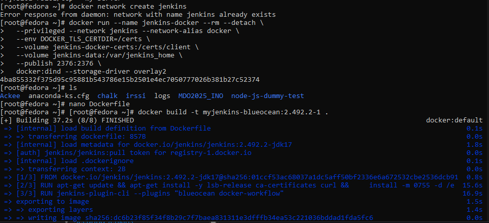
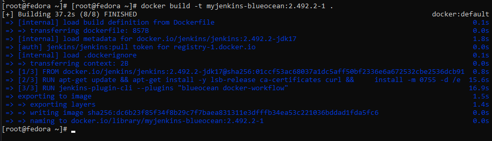
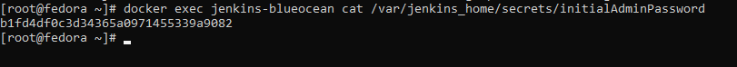
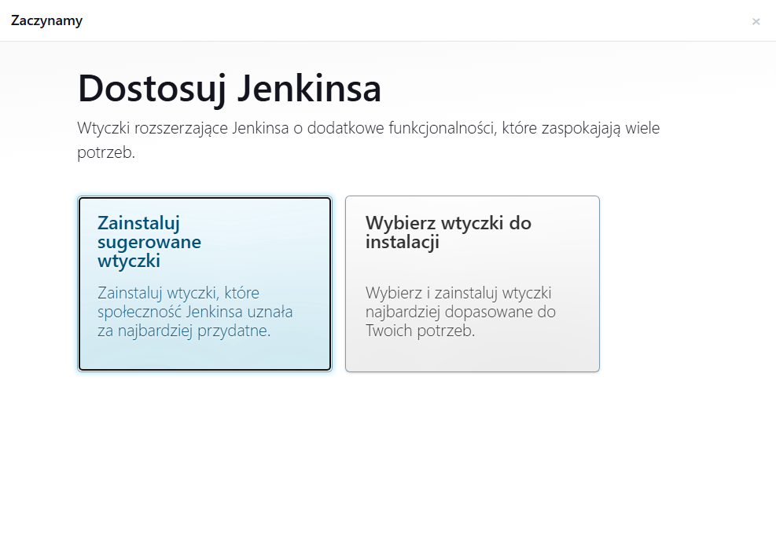
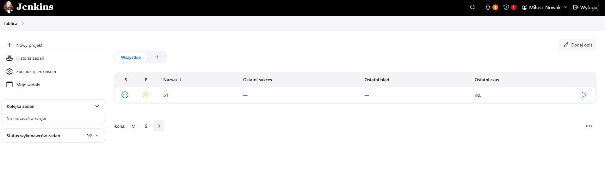
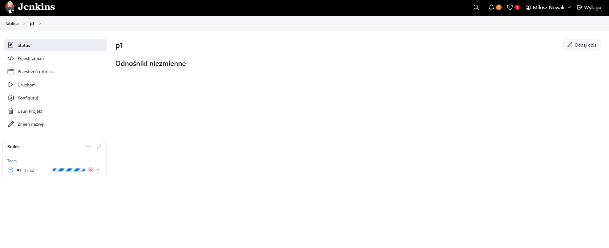
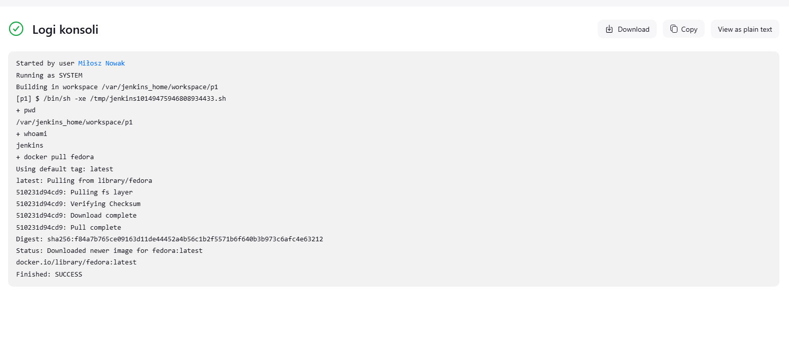
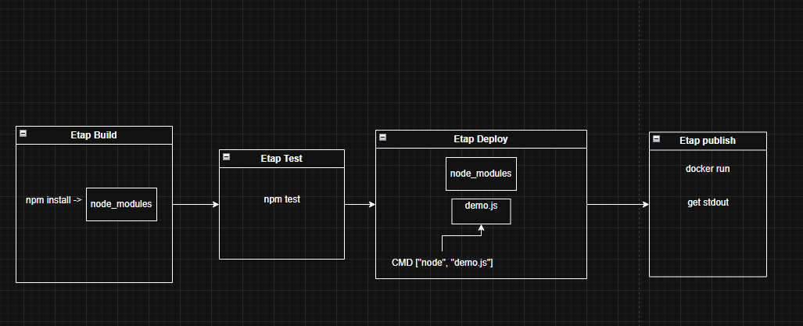

# Sprawozdanie nr 2

## Miłosz Nowak Inżynieria Obliczeniowa 18.04.2025r.

## Zajęcia 05:

1. Wykonywania zadania rozpocząłem od instalacji jenkinsa. Postępowałem zgodnie z instrukcją https://www.jenkins.io/doc/book/installing/docker/
Konieczne było utworzenie nowej sieci dockerowej, utworzenie obrazu Docker in docker, który umożliwia współpracę jenkinsa z dockerem, a następnie utworzenie i uruchomienia obrazu blueocean działającego na podstawie obrazu Jenkins. Jenkins Blueocean posiada rozszerzony interfejs, który umożliwia na łatwiejsze działanie z Githubem i pipeline'ami.

**Kolejne kroki wykonywane zgodnie z instrukcją instalacji Jenkinsa. Efekty wykonanych działań:**




2. Za pomocą polecenia ``` docker exec jenkins-blueocean cat /var/jenkins_home/secrets/initialAdminPassword```
uzyskałem hasło potrzebne do połączenia mojej maszyny wirtualnej z Jenkinsem.



3. Po wpisaniu adresu ```192.168.100.38:8080```
utworzyłem swoje konto Jenkins i pobrałem potrzebne wtyczki. Mój Jenkins jest teraz gotowy do działania.



4. Utworzyłem swój pierwszy projekt wpisując w skrypcie podstawowe polecenia takie jak
```
pwd
whoami
docker pull fedora
```
W celu sprawdzenia czy wszystko działa poprawnie



**Uruchomienie projektu:**



**Wydruk ukazujący że projekt wykonał się poprawnie: **



5. Mając poprawnie skonfigurowany i działający Jenkins mogłem przystąpić do wykonywania zadania związanego z utworzeniem pipeline'u.
Zadanie wykonuję na bibliotece graficznej [Chalk](https://github.com/chalk/chalk.git) służącej do edycji tekstu. Biblioteka ta posiada otwartą licencję i testy.

6. Celem mojego zadania było utworzenie pipeline'u, którego efektem miało być uzyskanie artefaktu będącego wydrukiem konsoli potwierdzającego poprawne działanie aplikacji.

7. Zadanie planowałem wykonywać według następującego schematu:

**Schemat UML: **



Po klonowaniu repozytorium w procesie następują kolejne etapy:

Etap Build:
Tworzony jest obraz Dockera "bldr" na podstawie pliku [Dockerfilechalk.build](files/Dockerfilechalk.build)

Etap Test:
Tworzony jest inny obraz Dockera "test" na podstawie obrazu "bldr", pliku [Dockerfilechalk.test](files/Dockerfilechalk.test)

Etap Deploy:
W kontenerze bldr kopiowany jest katalog node_modules powstały po zbudowaniu aplikacji do katalogu projektu (/output).
Tworzony jest plik [demo.s](files/demo.js), który wykorzystuje bibliotekę chalk do kolorowego wypisania tekstu w terminalu.
Budowany jest obraz deploy z pliku [Dockerfilechalk.deploy](files/Dockerfilechalk.deploy) znajdującego się w katalogu projektu. Obraz zawiera aplikację gotową do uruchomienia.

Etap Publish:
Uruchamiany jest kontener na podstawie obrazu deploy, a jego wynik wypisywany w konsoli.

## Zajęcia 06

## Zajęcia 07
## Korzystanie z narzędzi AI podczas wykonywania zadań

Gemini 2.0 w celu znalezienia odpowiedniego repozytorium z otwartą licencją i posiadającego testy.
ChatGPT-4 w celu znalezienia odpowiedziach na pytania, który sposób rozwiązania danego zadania jest najlepszy w miejsca>ChatGPT-4 podczas początkowej nauki operowaniu na repozytorium GitHub. Pytania o podstawowe komendy umożliwiające pracę.
