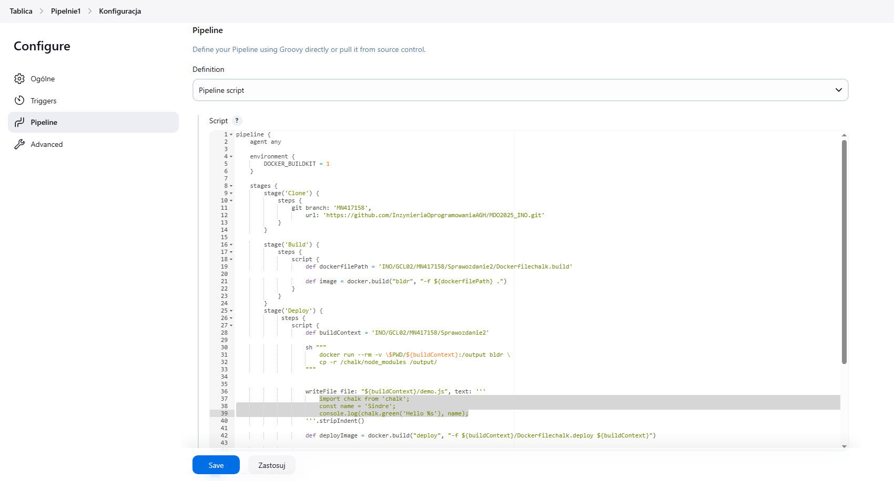
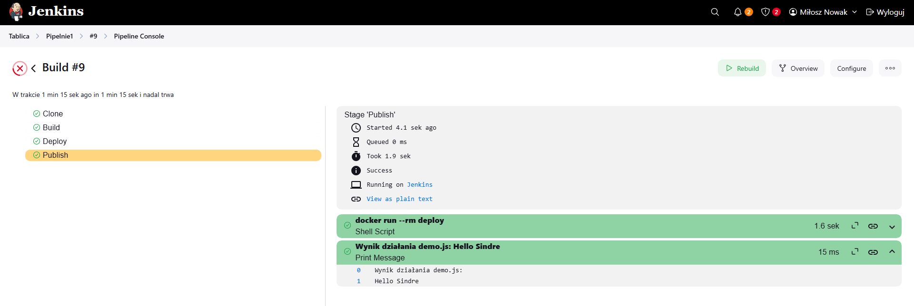
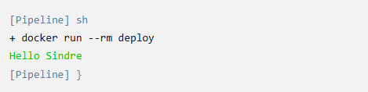
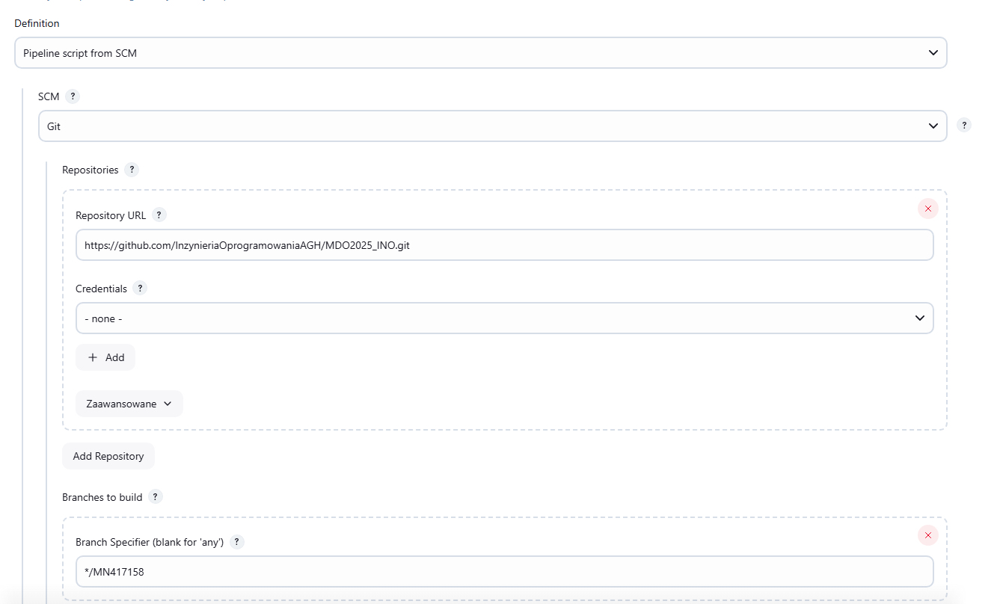
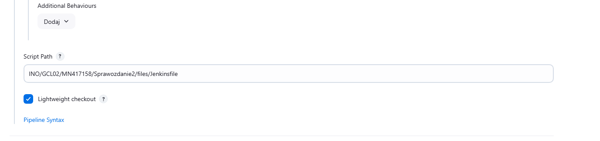

# Sprawozdanie nr 2

## Miłosz Nowak Inżynieria Obliczeniowa 18.04.2025r.

## Zajęcia 05:

1. Wykonywania zadania rozpocząłem od instalacji jenkinsa. Postępowałem zgodnie z instrukcją https://www.jenkins.io/doc/book/installing/docker/
Konieczne było utworzenie nowej sieci dockerowej, utworzenie obrazu Docker in docker, który umożliwia współpracę jenkinsa z dockerem, a następnie utworzenie i uruchomienia obrazu blueocean działającego na podstawie obrazu Jenkins. Jenkins Blueocean posiada rozszerzony interfejs, który umożliwia na łatwiejsze działanie z Githubem i pipeline'ami.

**Kolejne kroki wykonywane zgodnie z instrukcją instalacji Jenkinsa. Efekty wykonanych działań:**


2. Za pomocą polecenia ``` docker exec jenkins-blueocean cat /var/jenkins_home/secrets/initialAdminPassword```
uzyskałem hasło potrzebne do połączenia mojej maszyny wirtualnej z Jenkinsem.


3. Po wpisaniu adresu ```192.168.100.38:8080```
utworzyłem swoje konto Jenkins i pobrałem potrzebne wtyczki. Mój Jenkins jest teraz gotowy do działania.


4. Utworzyłem swój pierwszy projekt wpisując w skrypcie podstawowe polecenia takie jak
```
pwd
whoami
docker pull fedora
```
W celu sprawdzenia czy wszystko działa poprawnie


**Uruchomienie projektu:**


**Wydruk ukazujący że projekt wykonał się poprawnie:**


5. Mając poprawnie skonfigurowany i działający Jenkins mogłem przystąpić do wykonywania zadania związanego z utworzeniem pipeline'u.
Zadanie wykonuję na bibliotece graficznej [Chalk](https://github.com/chalk/chalk.git) służącej do edycji tekstu. Biblioteka ta posiada otwartą licencję i testy.

6. Celem mojego zadania było utworzenie pipeline'u, którego efektem miało być uzyskanie artefaktu będącego wydrukiem konsoli potwierdzającego poprawne działanie aplikacji.

7. Zadanie planowałem wykonywać według następującego schematu:


**Schemat UML:**


Po klonowaniu repozytorium w procesie następują kolejne etapy:

Etap Build:
Tworzony jest obraz Dockera "bldr" na podstawie pliku [Dockerfilechalk.build](files/Dockerfilechalk.build)

Etap Test:
Tworzony jest inny obraz Dockera "test" na podstawie obrazu "bldr", pliku [Dockerfilechalk.test](files/Dockerfilechalk.test)

Etap Deploy:
W kontenerze bldr kopiowany jest katalog node_modules powstały po zbudowaniu aplikacji do katalogu projektu (/output).
Tworzony jest plik [demo.js](files/demo.js), który wykorzystuje bibliotekę chalk do kolorowego wypisania tekstu w terminalu.
Budowany jest obraz deploy z pliku [Dockerfilechalk.deploy](files/Dockerfilechalk.deploy) znajdującego się w katalogu projektu. Obraz zawiera aplikację gotową do uruchomienia.

Etap Publish:
Uruchamiany jest kontener na podstawie obrazu deploy, a jego wynik wypisywany w konsoli.

## Zajęcia 06

1. Po przygotowaniu planu działania przeszedłem do jego realizaji. W tym celu utworzyłem nowy projekt typu pipeline w Jenkinsie.

2. Utworzyłem skrypt w konfiguracji pipeline'u realizującego etapy "Clone", "Build", "Deploy" oraz "Publish".

**Przygotowany skrypt realizujący zadanie:**



3. Uruchomiłem działanie projektu.

**Efekt wyświetlony w konsoli po uruchomieniu skryptu:**



4. Aby sprawdzić czy aplikacja na pewno działa poprawnie pobrałem w Jenkinsie wtyczkę AnsiColor, a w skrypcie w etapie publish dodałem ```ansiColor('xterm') {```

**Dzięki tym zmianom wydruk w konsoli Jenkinsa jest zielony, zgodnie z treścią pliku demo.js, pipeline zadziałał więc poprawnie:**



## Zajęcia 07

1. Do mojego Jenkinsfile'a dodałem wersjonowanie utworzonych kontenerów, aby ułatwić śledzenie powstałych artefaktów i unikanie nadpisywanie. Umożliwia to sprawdzenie pochodzenia artefaktu i jego unikalność przy kolejnym uruchomieniu pipeline'a. W tym celu na etapie Build dodałem
```
 			def shortCommit = sh(script: "git rev-parse --short HEAD", returnStdout: true).trim()
                        def date = sh(script: "date +%Y%m%d%H%M%S", returnStdout: true).trim()
                        env.IMAGE_VERSION = "${date}-${shortCommit}"
                        echo "Wersja obrazu: ${env.IMAGE_VERSION}"
```
Wersja jest tworzona poprzez pobranie daty uruchomienia skryptu i danych commita na którym został on uruchomiony.

2. Dodałem również do etapu Publish zapisywanie artefaktów. Jeden jest wydrukiem konsoli ukazującym działanie aplikacji, drugi posiada zapisaną wersję:
```
ansiColor('xterm') {
                sh "docker run --rm deploy > log.txt"
                }
                archiveArtifacts artifacts: 'log.txt', fingerprint: true
                writeFile file: 'version.txt', text: "IMAGE_VERSION=${env.IMAGE_VERSION}\n"
                archiveArtifacts artifacts: 'version.txt', fingerprint: true
```
3. Ostatnim krokiem była zmiana ustawień projektu aby przepis pipeline'u był dostarczany z SCM, a nie wklejony w skrypt projektu Jenkinsa.

**Zmiana definicji na "Pipeline script from SCM", dodanie adresu repozytorium, odpowiedniej gałęzi i ścieżki do Jenkinsfile**

 

4. W etapach "Build" "Test" oraz "Deploy" w odpowiednich miejscach docker.build dodałem ```--no-cache```
Dzięki temu w skuteczny i bezpieczny sposób mam pewność że pipeline przy każdym uruchomieniu działa na nowym kodzie i środowisku.

## Korzystanie z narzędzi AI podczas wykonywania zadań

Gemini 2.0 w celu znalezienia odpowiedniego repozytorium z otwartą licencją i posiadającego testy.
ChatGPT-4 w celu znalezienia odpowiedziach na pytania, który sposób rozwiązania danego zadania jest najlepszy w miejsca>ChatGPT-4 podczas początkowej nauki operowaniu na repozytorium GitHub. Pytania o podstawowe komendy umożliwiające pracę.
