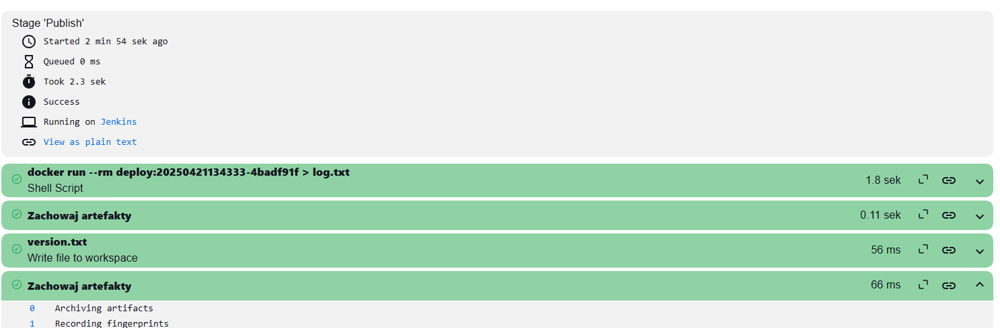

# Sprawozdanie nr 2

## Miłosz Nowak Inżynieria Obliczeniowa 18.04.2025r.

## Zajęcia 05:

1. Wykonywania zadania rozpocząłem od instalacji jenkinsa. Postępowałem zgodnie z instrukcją https://www.jenkins.io/doc/book/installing/docker/
Konieczne było utworzenie nowej sieci dockerowej, utworzenie obrazu Docker in docker, który umożliwia współpracę jenkinsa z dockerem, a następnie utworzenie i uruchomienia obrazu blueocean działającego na podstawie obrazu Jenkins. Jenkins Blueocean posiada rozszerzony interfejs, który umożliwia na łatwiejsze działanie z Githubem i pipeline'ami.

**Kolejne kroki wykonywane zgodnie z instrukcją instalacji Jenkinsa. Efekty wykonanych działań:**


2. Za pomocą polecenia ``` docker exec jenkins-blueocean cat /var/jenkins_home/secrets/initialAdminPassword```
uzyskałem hasło potrzebne do połączenia mojej maszyny wirtualnej z Jenkinsem.


3. Po wpisaniu adresu ```192.168.100.38:8080```
utworzyłem swoje konto Jenkins i pobrałem potrzebne wtyczki. Mój Jenkins jest teraz gotowy do działania.


4. Utworzyłem swój pierwszy projekt wpisując w skrypcie podstawowe polecenia takie jak
```
pwd
whoami
docker pull fedora
```
W celu sprawdzenia czy wszystko działa poprawnie


**Uruchomienie projektu:**


**Wydruk ukazujący że projekt wykonał się poprawnie:**


5. Mając poprawnie skonfigurowany i działający Jenkins mogłem przystąpić do wykonywania zadania związanego z utworzeniem pipeline'u.
Zadanie wykonuję na bibliotece graficznej [Chalk](https://github.com/chalk/chalk.git) służącej do edycji tekstu. Biblioteka ta posiada otwartą licencję i testy.

6. Celem mojego zadania było utworzenie pipeline'u, którego efektem miało być uzyskanie artefaktu będącego wydrukiem konsoli potwierdzającego poprawne działanie aplikacji.

7. Zadanie planowałem wykonywać według następującego schematu:


**Schemat UML:**


Po klonowaniu repozytorium w procesie następują kolejne etapy:

Etap Build:
Tworzony jest obraz Dockera "bldr" na podstawie pliku [Dockerfilechalk.build](files/Dockerfilechalk.build)

Etap Test:
Tworzony jest inny obraz Dockera "test" na podstawie obrazu "bldr", pliku [Dockerfilechalk.test](files/Dockerfilechalk.test)

Etap Deploy:
W kontenerze bldr kopiowany jest katalog node_modules powstały po zbudowaniu aplikacji do katalogu projektu (/output).
Tworzony jest plik [demo.js](files/demo.js), który wykorzystuje bibliotekę chalk do kolorowego wypisania tekstu w terminalu.
Budowany jest obraz deploy z pliku [Dockerfilechalk.deploy](files/Dockerfilechalk.deploy) znajdującego się w katalogu projektu. Obraz zawiera aplikację gotową do uruchomienia.

Etap Publish:
Uruchamiany jest kontener na podstawie obrazu deploy, a jego wynik wypisywany w konsoli.

## Zajęcia 06

1. Po przygotowaniu planu działania przeszedłem do jego realizaji. W tym celu utworzyłem nowy projekt typu pipeline w Jenkinsie.

2. Utworzyłem skrypt w konfiguracji pipeline'u realizującego etapy "Clone", "Build", "Deploy" oraz "Publish".

**Przygotowany skrypt realizujący zadanie:**


3. Uruchomiłem działanie projektu.

**Efekt wyświetlony w konsoli po uruchomieniu skryptu:**


4. Aby sprawdzić czy aplikacja na pewno działa poprawnie pobrałem w Jenkinsie wtyczkę AnsiColor, a w skrypcie w etapie publish dodałem ```ansiColor('xterm') {```

**Dzięki tym zmianom wydruk w konsoli Jenkinsa jest zielony, zgodnie z treścią pliku demo.js, pipeline zadziałał więc poprawnie:**


## Zajęcia 07

1. Do mojego Jenkinsfile'a dodałem wersjonowanie utworzonych kontenerów, aby ułatwić śledzenie powstałych artefaktów i unikanie nadpisywanie. Umożliwia to sprawdzenie pochodzenia artefaktu i jego unikalność przy kolejnym uruchomieniu pipeline'a.
```
environment {
        DOCKER_BUILDKIT = 1
        IMAGE_VERSION = "${new Date().format('yyyyMMddHHmmss')}-${env.GIT_COMMIT?.take(8) ?: 'dev'}"
        }
```
Wersja jest tworzona poprzez pobranie daty uruchomienia skryptu i danych commita na którym został on uruchomiony.

2. Dodałem również do etapu Publish zapisywanie artefaktów. Jeden jest wydrukiem konsoli ukazującym działanie aplikacji, drugi posiada zapisaną wersję:
```
	ansiColor('xterm') {
                sh "docker run --rm deploy:${env.IMAGE_VERSION} > log.txt"
                }
                archiveArtifacts artifacts: 'log.txt', fingerprint: true
                writeFile file: 'version.txt', text: "IMAGE_VERSION=${env.IMAGE_VERSION}\n"
                archiveArtifacts artifacts: 'version.txt', fingerprint: true
```
3. Ostatnim krokiem była zmiana ustawień projektu aby przepis pipeline'u był dostarczany z SCM, a nie wklejony w skrypt projektu Jenkinsa.

**Zmiana definicji na "Pipeline script from SCM", dodanie adresu repozytorium, odpowiedniej gałęzi i ścieżki do Jenkinsfile**

 

4. W etapach "Build" "Test" oraz "Deploy" w odpowiednich miejscach docker.build dodałem ```--no-cache```
Dzięki temu w skuteczny i bezpieczny sposób mam pewność że pipeline przy każdym uruchomieniu działa na nowym kodzie i środowisku.

5. Ostateczna wersja mojego [Jenkinsfile](files/Jenkinsfile).

## Efekty uruchomienia pipeline'u i wytłumaczenie pooszczególnych etapów

1. Pierwszy etap to "Checkout SCM". Gdzie następuje połączenie się z repozytorium i  uzyskanie ścieżki do Jenkinsfile

**Lista kolejnych poprawnie wykonanych etapów**


**Wydruk etapu Checkout SCM**


2. Drugim etapem jest "Clone", w którym następuje klonowanie repozytorium zdalne z określonego brancha.
```
stage('Clone') {
    steps {
        git branch: 'MN417158',
            url: 'https://github.com/InzynieriaOprogramowaniaAGH/MDO2025_INO.git'
    }
}
```


3. Etap "Build" odpowiedzialny jest za zbudowanie obrazu Dockera zawierającego źródła biblioteki chalk oraz wszystkie jej zależności. Proces rozpoczyna się od nadania obrazu unikalnej wersji następnie wykorzystywany jest plik [Dockerfilechalk.build](files/Dockerfilechalk.build). Tam wykonywane jest klonowanie repozytorium chalk z GitHuba, po czym wykonywana jest komenda npm install, która instaluje wszystkie zależności wymagane przez tę bibliotekę. Obraz zbudowany w tym etapie zawiera pełne środowisko Node.js z biblioteką Chalk gotową do dalszego testowania oraz wdrożenia.
```
stage('Build') {
            steps {
                script {

                        def dockerfilePath = 'INO/GCL02/MN417158/Sprawozdanie2/files/Dockerfilechalk.build'
                        def image = docker.build("bldr:${env.IMAGE_VERSION}", "--no-cache -f ${dockerfilePath} .")
                }
            }
        }
```


4. Etap "Test" Buduje obraz testowy na podstawie [Dockerfilechalk.test](files/Dockerfilechalk.test) i uruchamia testy jednostkowe z repozytorium Chalk. 
```
stage('Test') {
    steps {
        script {
            def dockerfilePath = 'INO/GCL02/MN417158/Sprawozdanie2/files/Dockerfilechalk.test'
            def testImage = docker.build("test:${env.IMAGE_VERSION}", "-f ${dockerfilePath} --build-arg IMAGE_VERSION=${env.IMAGE_VERSION} .")
        }
    }
}
```


5. W kolejnym etapie, Deploy, tworzony jest finalny obraz, który zawiera jedynie to, co jest potrzebne do uruchomienia prostego przykładu użycia biblioteki. Na początku z wcześniej zbudowanego obrazu bldr kopiowany jest katalog node_modules, zawierający wszystkie zainstalowane zależności. W tym samym katalogu zapisywany jest plik demo.js, będący prostym skryptem demonstracyjnym — importuje on bibliotekę chalk i wypisuje w konsoli kolorowy komunikat. Następnie z wykorzystaniem pliku [Dockerfilechalk.deploy](files/Dockerfilechalk.deploy) budowany jest nowy obraz. Do obrazu kopiowany jest katalog nodemodules oraz sam skrypt demo.js. Po uruchomieniu kontenera wywoływana za pomocą CMD jest komenda node demo.js, co pozwala w bezpośredni sposób sprawdzić, że biblioteka została poprawnie zainstalowana i działa zgodnie z oczekiwaniami.
```
stage('Deploy') {
             steps {
                script {
                    def buildContext = 'INO/GCL02/MN417158/Sprawozdanie2/files'

                    sh """
                        docker run --rm -v \$PWD/${buildContext}:/output bldr:${env.IMAGE_VERSION} \
                        cp -r /chalk/node_modules /output/
                    """


                    writeFile file: "${buildContext}/demo.js", text: '''
                        import chalk from 'chalk';
                        const name = 'Sindre';
                        console.log(chalk.green('Hello %s'), name);
                    '''.stripIndent()

                    def deployImage = docker.build("deploy:${env.IMAGE_VERSION}", "--no-cache -f ${buildContext}/Docker>
                }
            }
        }
```


6. Uruchamia obraz deploy i tworzy artefakty działania pipeline'u zapisując wynik działania skryptu demo.js do pliku log.txt oraz tworząc plik version.txt z wcześniej ustaloną wersją obrazu.
```
stage('Publish') {
    steps {
        ansiColor('xterm') {
            sh "docker run --rm deploy > log.txt"
        }
        archiveArtifacts artifacts: 'log.txt', fingerprint: true
        writeFile file: 'version.txt', text: "IMAGE_VERSION=${env.IMAGE_VERSION}\n"
        archiveArtifacts artifacts: 'version.txt', fingerprint: true
    }
}
```



7. Końcowym efektem pracy są dwa pliki [log.txt](files/log.txt) oraz [version.txt](files/version.txt)


8. Cały proces wydaje się być zgodny z wcześniej założonym planem działania


## Korzystanie z narzędzi AI podczas wykonywania zadań

ChatGPT-4 w celu znalezienia najprostszego sposobu do wyświetlenia kolorowego napisu w konsoli Jenkinsa oraz do stworzenia podstawowego szablonu skryptu pipeline.

