# Sprawozdanie nr 3

## Miłosz Nowak Inżynieria Obliczeniowa 29.05.2025r.

## Zajęcia 08 Ansible:

1. Wykonywanie zadania rozpocząłem od instalacji nowej wirtualnej maszyny. Była to Fedora 42 w minimalnej wersji. Zapewniłem obecność programu ```tar ```
i serwera ```sshd```
Maszynie nadałem nazwę hosta ```ansible-target``` i utworzyłem użytkownika ```ansible```
Następnie utworzyłem migawkę maszyny w oknie VirtualBoxa.
 


2. Przeprowadziłem instalację Ansible na głównej maszynie poleceniem ```sudo dnf install ansible```


3. Następnie poleceniem ```ssh-copy-id ansible@192.168.100.111```
wymieniłem klucze SSH pomiędzy użytkownikiem w głównej maszynie wirtualnej, a użytkownikiem ansible. Dzięki logowanie nie wymaga hasła.

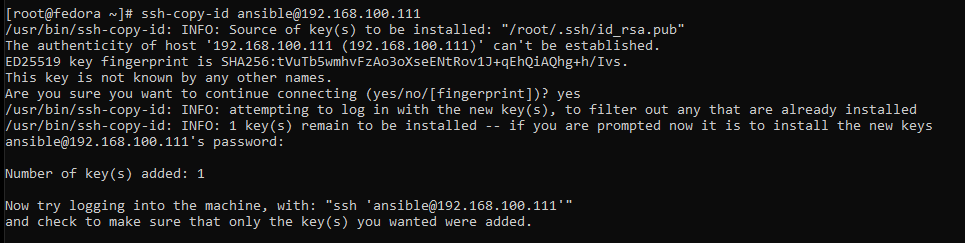

4. Kolejnym krokiem była inwertaryzacja systemów. Ustawiłem nowe nazwy maszyn poleceniami:
```sudo hostnamectl set-hostname orchestrator1```
```sudo hostnamectl set-hostname ansible-target1```
5. Ustawiłem nazwy DNS maszyn za pomocą ```sudo nano /etc/hosts```
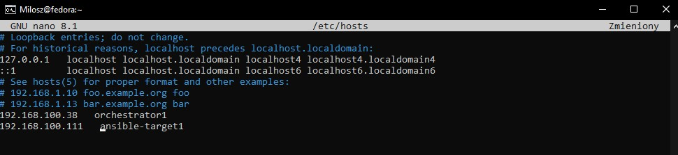

6. Zweryfikowałem połaczenie poleceniem ```ping```
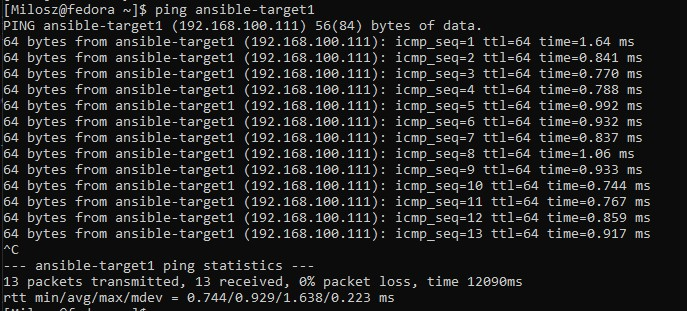

7. Utworzyłem plik inwentaryzacji ```inventory.ini```

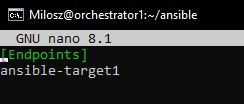

8. Ponownie przetestowałem połączenie korzystając z utworzonego pliku za pomocą polecenia ```ansible all -i inventory.ini -u ansible -m ping```
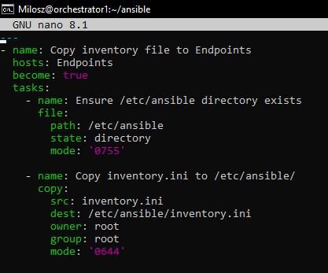
 
9. Następnie utworzyłem playbook Ansible [copy_inventory.yml](files/copy_inventory.yml)
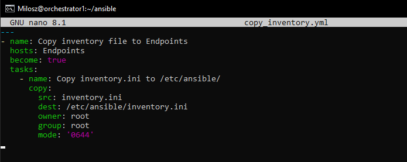
I wykonałem polecenie ```ansible-playbook -i inventory.ini -u ansible --become copy_inventory.yml```
**Wydruk ukazuje poprawne połączenie z maszyną ansible-target1, utworzenie katalogu i skopiowanie do niego pliku inwertaryzującego:**
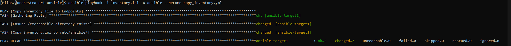

10. W celu zaktualizowania pakietów i zrestartowania usług sshd oraz rngd utworzyłem nowy playbook [update_and_restart.yml](files/update_and_restart.yml)
**Wydruk ukazuje poprawne zaktualizowanie pakietów, restart sshd oraz rngd**
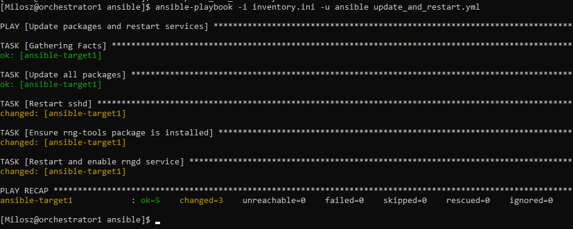

11. Ostatnim krokiem było przeprowadzenie operacji względem maszyny z wyłączonym serwerem SSH. Na maszynie docelowej poleceniem
```
sudo systemctl stop sshd
sudo systemctl disable sshd
```
Wyłączyłem SSH. Następnie na maszynie dyrygencie uruchomiłem ponownie plik inwentaryzacyjny ```ansible -i inventory.ini -u ansible -m ping ansible-target1```
**Błąd połączenia- komunikat UNREACHABLE**
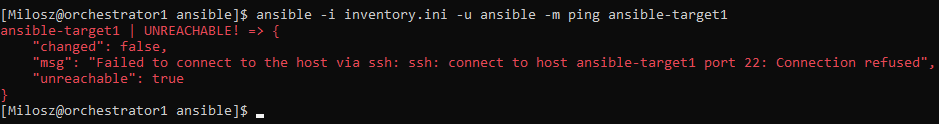

## Zajęcia 09 Kickstart:

1. Do wykonania zadanie użyłem instalatora sieciowego Netinst Everything systemu Fedora 41. Utworzyłem nową maszynę wirtualną.

2. Przed jej uruchomieniem na głównej maszynie z tym samym systemem pobrałem plik odpowiedzi ```/root/anaconda-ks.cfg```

3. Następnie edytowałem go według potrzeb. Dodałem wzmiankę o potrzebnych repozytoriach i pakietach przed informacjami o dysku.
```
url --mirrorlist=http://mirrors.fedoraproject.org/mirrorlist?repo=fedora-42&arch=x86_64
repo --name=update --mirrorlist=http://mirrors.fedoraproject.org/mirrorlist?repo=updates-released-f42&arch=x86_64
```

4. Ustawiłem formatowanie całości dysku za pomocą ```clearpart --all```
Utworzyłem nowego użytkownika i ustawiłem hostname.

5. Po wysłaniu nowego pliku na github, uruchomiłem nową maszynę wirtualną. W ekranie wyboru sposobu instalacji nacisnąłem przycisk "e" na klawiaturze. Umożliwia to wskazanie instalatorowi pkiku odpowiedzi z którego zostanie przeprowadzona instalacja nienadzorowana.
W pliku należy dopisać ```inst.ks=```
A następnie wstawić link do [Pliku odpowiedzi w wersji Raw na Github](https://raw.githubusercontent.com/InzynieriaOprogramowaniaAGH/MDO2025_INO/refs/heads/MN417158/INO/GCL02/MN417158/Sprawozdanie3/anaconda-ks.cfg)

6. Uruchomiłem instalację.

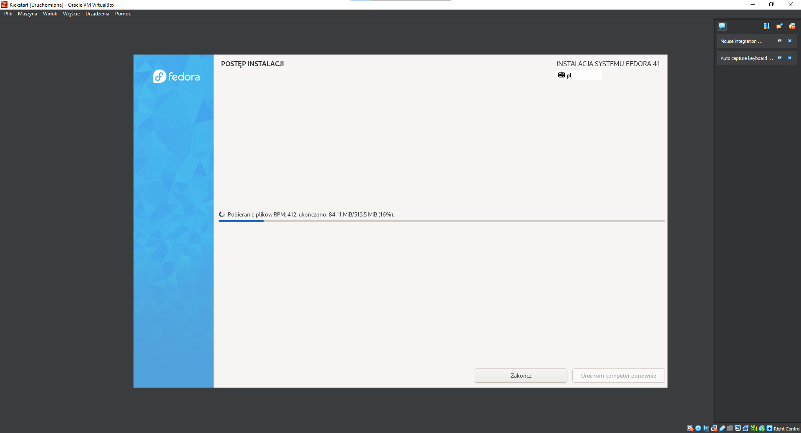

7. Po zakończeniu instalacji edytowałem plik odpowiedzi aby ustawić automatyczne uruchomienie ponowne po instalacji. Na końcu pliku dodałem polecenie ```reboot```

 
## Zajęcia 10 Kubernetes:

1. Zadanie rozpocząłem od instalacji Minikube zgodnie z instrukcją w [dokumentacji](https://minikube.sigs.k8s.io/docs/start/?arch=%2Flinux%2Fx86-64%2Fstable%2Frpm+package)
Wybrałem wariant z instalacją na system Linux i za pomocą paczki ```rpm```

2. Uruchomiłem Kubernetes poleceniem ```minikube start  --driver=docker```
Uruchomiłem również dashboard, który umożliwia łatwiejsze, za pomocą graficznego interfejsu, operowanie na podach i deploymentach ```minikube dashboard```

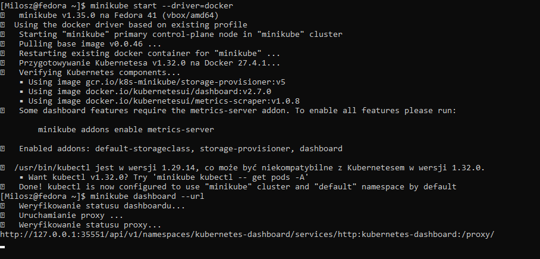

3. W nowym terminalu zalogowałem się ponownie do maszyny tworząc tunel pomiędzy lokalnym portem a adresem dashboardu utworzonego na maszynie wirtualnej. Umożliwia to uruchomienie dashboardu w przeglądarce na hoście
```ssh -L 35551:127.0.0.1:35551 Milosz@192.168.100.38```

4. Następnie uruchomiłem pod ```nginx-single```
```
minikube kubectl -- run nginx-single \
  --image=nginx \
  --port=80 \
  --labels app=nginx-single
```
5. I sprawdziłem stan podów ```minikube kubectl -- get pods```

**Wydruk ukazujące poprawne tunelowanie, uruchomienie i działanie utworzonego podu**


6. Ponownie przeprowadziłem proces tunelowania aby wyświetlić działanie ```nginx```

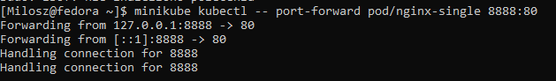
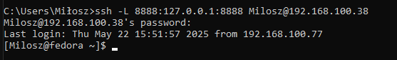

**Efekt poprawnego działania nginx**
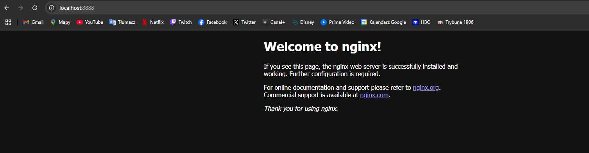

7. Utworzyłem plik ```nginx-deployment.yaml```
Odpowiada on za utworzenie pliku wdrażającego pod zawierającego kontener ```nginx```

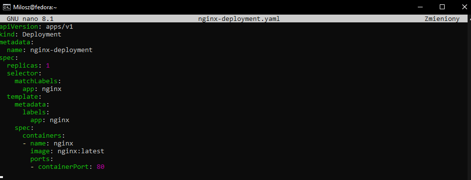

8. Następnie użyłem polecenia ```minikube kubectl -- apply -f nginx-deployment.yaml```
Aby uruchomić swój plik wdrożenia

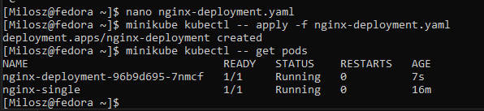

9. Kolejnym krokiem było rozszerzenie deploymentu do 4 replik. Użyłem poleceń
```
minikube kubectl -- scale deployment nginx-deployment --replicas=4
minikube kubectl -- get pods
```
Aby ukazać poprawne utworzenie 4 replik

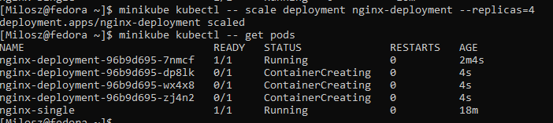

10. Wyeksponowałem wdrożenie jako serwis i przekierowałem port do serwisu

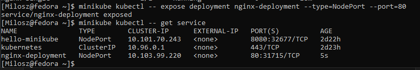

11. 
**Efekt działań w interejsie dashboardu:**
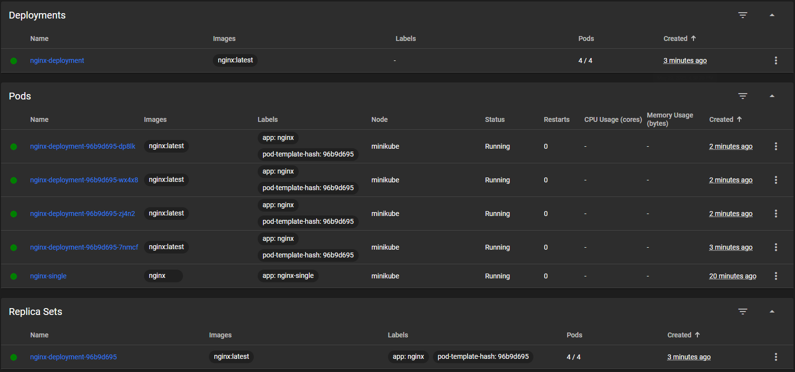

## Zajęcia 11 Kubernetes cd.:

1. Aby stworzyć własną konfigurację obrazu nginx utworzyłem pliki [index.html](files/index.html) oraz [nginx-configmap.yaml](files/nginx-configmap.yaml), które umożliwiają wyświetlenie na stronie własnego napisu zamiast tytułowej i oryginalnej strony nginx

2. Poleceniami
```
kubectl apply -f nginx-configmap.yaml
kubectl apply -f deployment.yaml
```
Utworzyłem nowy deployment

3. Po przeprowadzeniu tunelowania ```kubectl port-forward deployment/nginx-deployment 8081:80```
I w nowym terminalu:```ssh -L 8082:localhost:8081 Milosz@192.168.100.38```
Po uruchomieniu strony ```http://localhost:8082```

**Otrzymałem widok własnej wersji strony tytułowej**
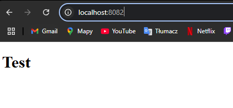

4. Kolejnym krokiem była edycja liczby replik w deploymencie. Można to zrobić na kilka sposobów:
- Pierwszym jest edycja pliku [deployment.yaml](files/deployment.yaml) i zmiana linijki ```replicas: 1```
Po jej zmianie na 8, zapisaniu pliku ponownie wczytałem plik wdrożenia ```kubectl apply -f deployment.yaml```

**Efekt w dashboard:**
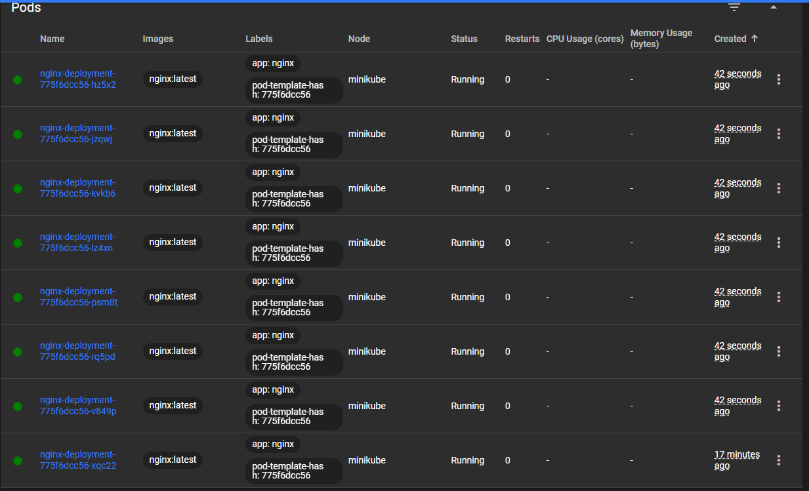

- Drugim sposobem jest po prostu wpisanie komendy ```kubectl scale deployment nginx-deployment --replicas=0```
**Efekt jest następujący. 0 podów natomiast deployment dalej działa:**
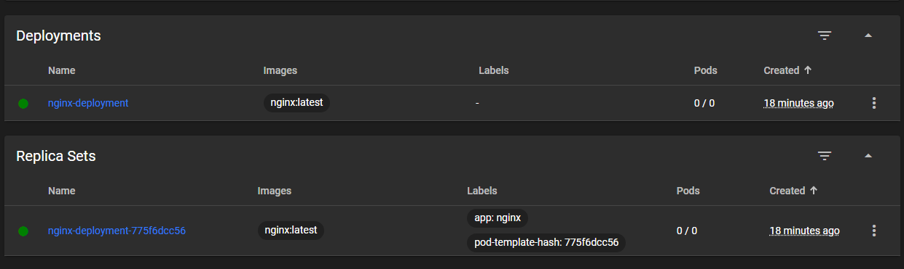

- Ostatnim sposobem jest edytowanie pliku deploymentu poprzez dashboard. Należy przejść do zakładki z deploymentami, rozwinąć menu i kliknąć ```Edit```
Następnie otrzymujemy nasz plik, w którym tak jak poprzednio zmieniamy linijkę ```replicas: 1```

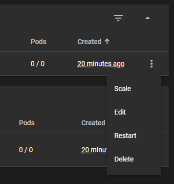
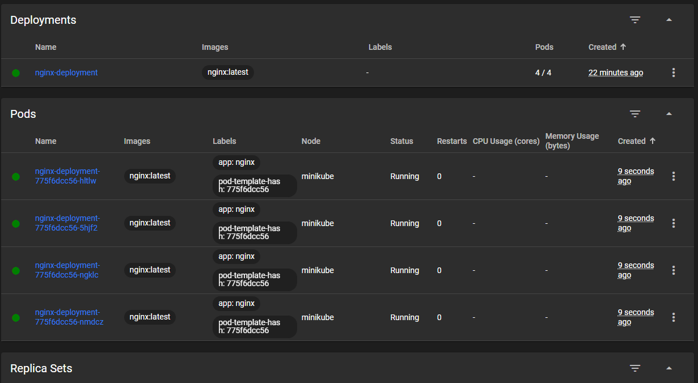

5. W celu uruchomienia innej wersji obrazu zmieniłem w deploymencie linijkę ```      containers:
      - name: nginx
        image: nginx:1.24```

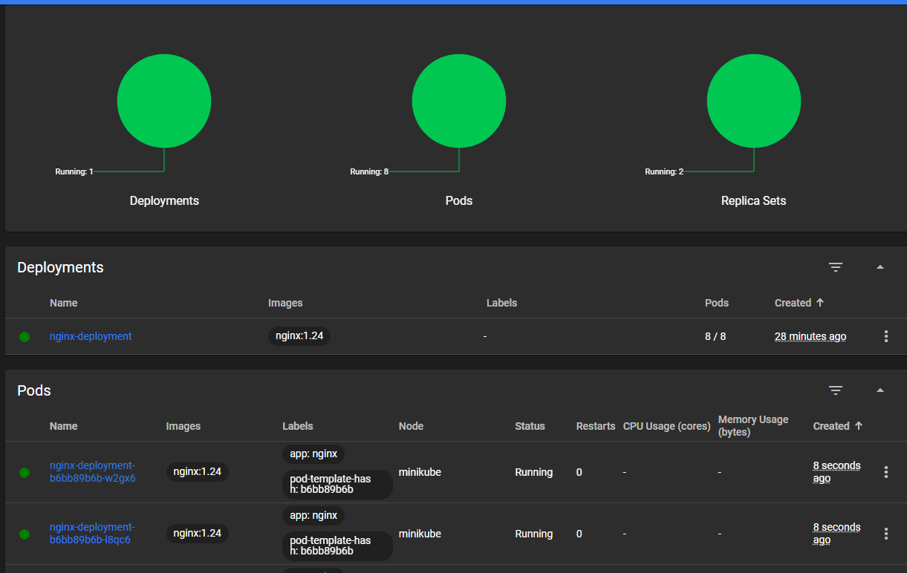
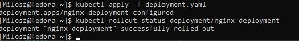

6. Następnie uruchomiłem wadliwą wersję

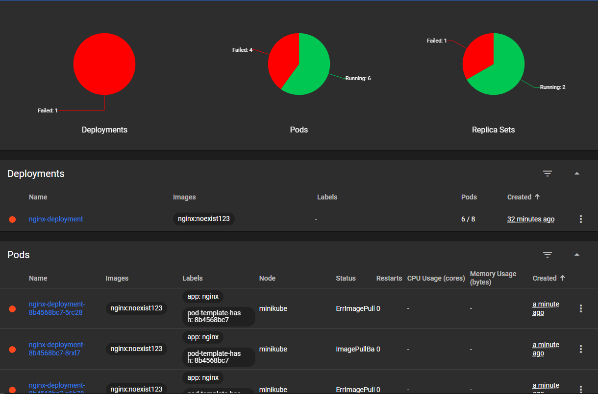
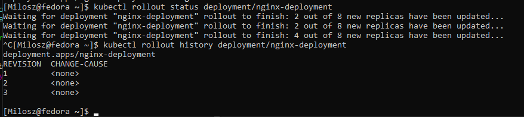

7. W celu przywrócenia pierwotnej wersji użyłem polecenia ```kubectl rollout undo deployment/nginx-deployment --to-revision=1```

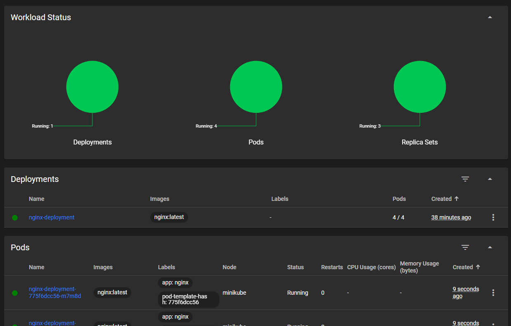
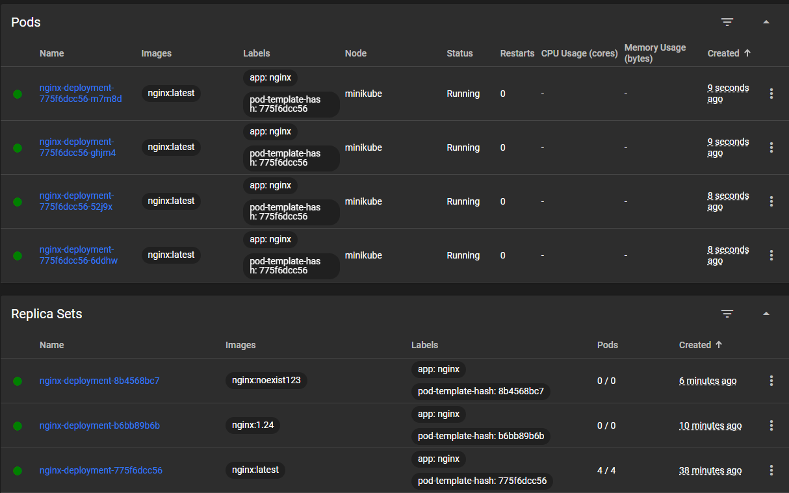
