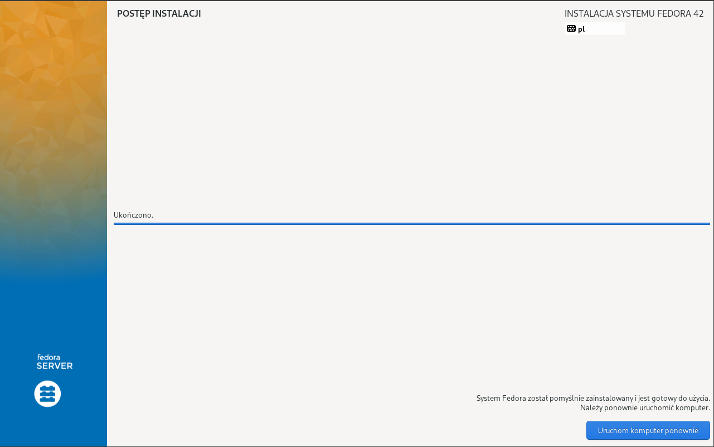
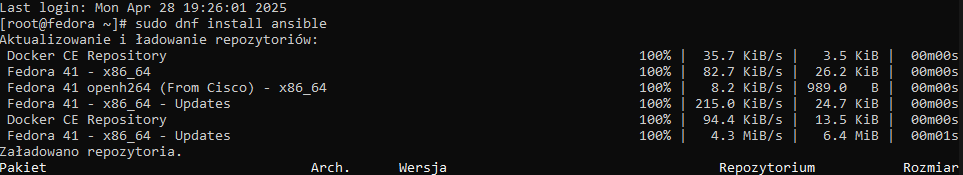

# Sprawozdanie nr 3

## Miłosz Nowak Inżynieria Obliczeniowa 29.05.2025r.

## Zajęcia 08 Ansible:

1. Wykonywania zadania rozpocząłem od instalacji jenkinsa. Postępowałem zgodnie z instrukcją https://www.jenkins.io/doc>Konieczne było utworzenie nowej sieci dockerowej, utworzenie obrazu Docker in docker, który umożliwia współpracę jenkin>
**Kolejne kroki wykonywane zgodnie z instrukcją instalacji Jenkinsa. Efekty wykonanych działań:**

## Zajęcia 09 Kickstart:

## Zajęcia 10 Kubernetes:

## Zajęcia 11 Kubernetes cd.:

## Korzystanie z narzędzi AI podczas wykonywania zadań

ChatGPT-4 w celu znalezienia najprostszego sposobu do wyświetlenia kolorowego napisu w konsoli Jenkinsa oraz do stworze>

