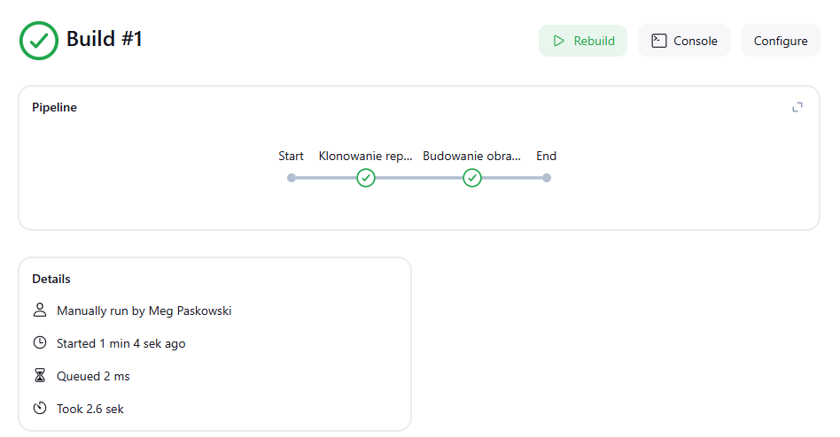
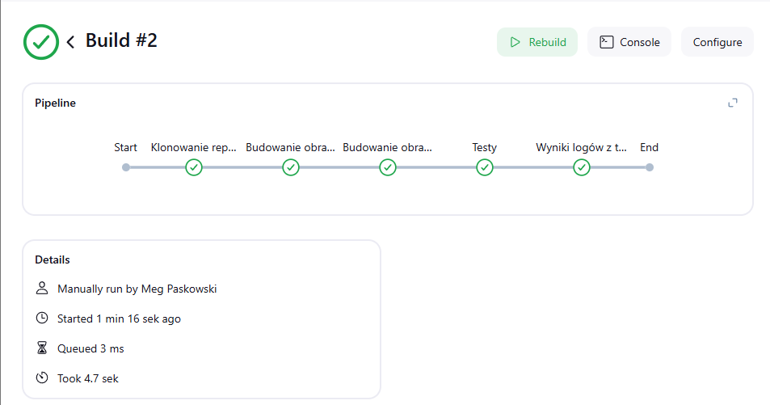
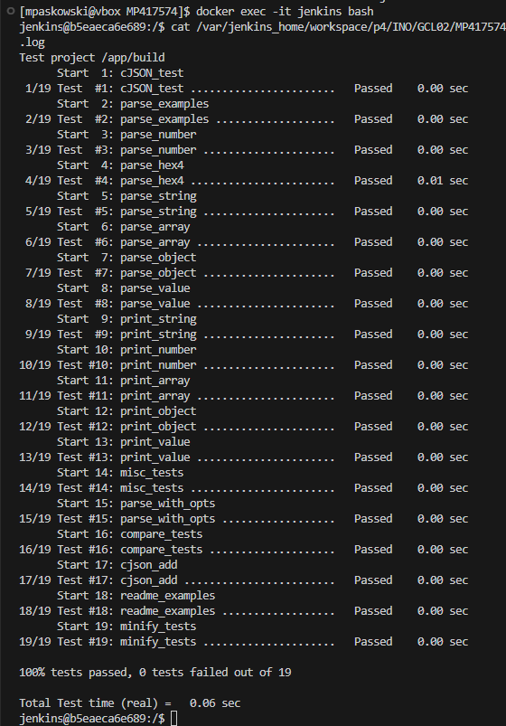
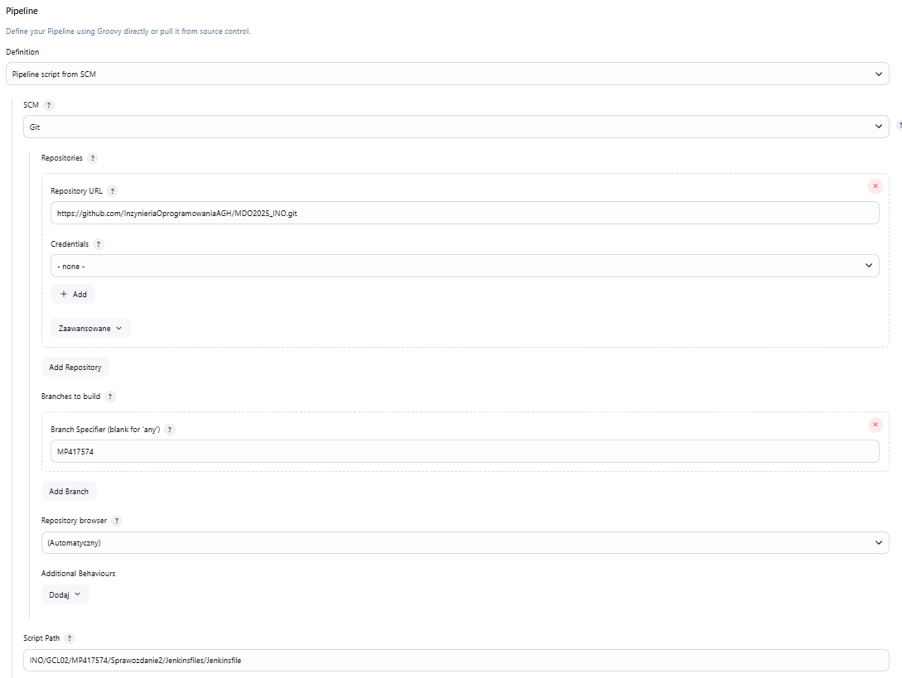
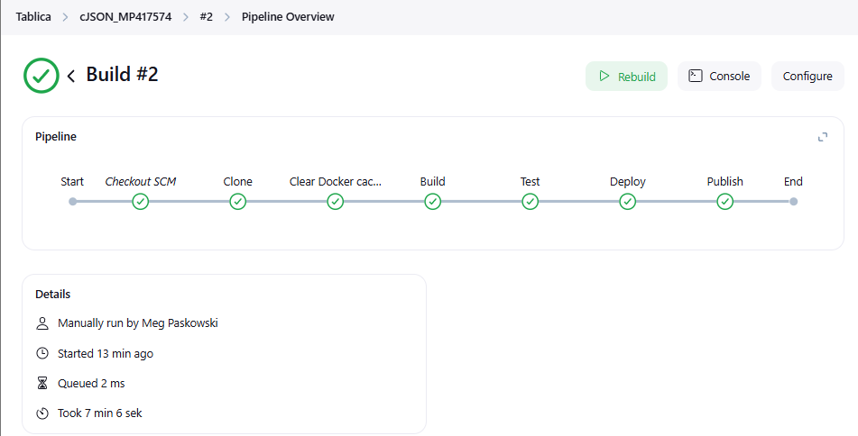
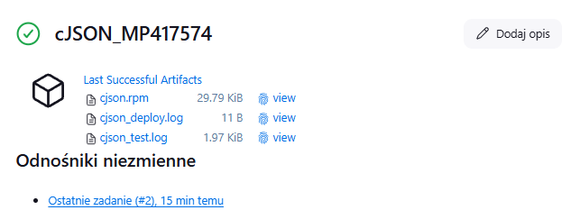

# Sprawozdanie 2
## Zajecia 5 (31.03.2025r.)
### Pipeline, Jenkins, izolacja etapów
Celem pracy było przygotowanie spersonalizowanego obrazu Dockera dla Jenkinsa z dodatkowymi narzędziami i wtyczkami niezbędnymi do tworzenia potoków CI/CD.

Instalacja Jenkinsa.
Wybrane wtyczki dla Jenkinsa:
- `docker-workflow` – integracja Dockera z potokami Jenkinsa.
- `blueocean` –  interfejs użytkownika dla Jenkinsa.
- `pipeline-utility-steps` – dodatkowe funkcje dla potoków.
Aby umożliwić Jenkinsowi komunikację z Dockerem, w kontenerze zainstalowano narzędzia Docker CLI.
Ze względów bezpieczeństwa po instalacji narzędzi zmieniono użytkownika z `root` na `jenkins`.

Utworzyłam plik `Dockerfile.jenkins`:

```bash
FROM jenkins/jenkins:lts-jdk17 #Wybór obrazu bazowego

USER root

# Instalacja Docker CLI i narzędzi
RUN apt-get update && \
    apt-get install -y \
        apt-transport-https \
        ca-certificates \
        curl \
        gnupg2 \
        software-properties-common && \
    curl -fsSL https://download.docker.com/linux/debian/gpg | gpg --dearmor -o /usr/share/keyrings/docker-archive-keyring.gpg && \
    echo "deb [arch=$(dpkg --print-architecture) signed-by=/usr/share/keyrings/docker-archive-keyring.gpg] https://download.docker.com/linux/debian $(lsb_release -cs) stable" > /etc/apt/sources.list.d/docker.list && \
    apt-get update && \
    apt-get install -y docker-ce-cli docker-compose-plugin && \
    rm -rf /var/lib/apt/lists/*

# Instalacja pluginów Jenkinsa
RUN jenkins-plugin-cli --plugins \
    docker-workflow \
    blueocean \
    pipeline-utility-steps

USER jenkins
```

Zbudowałam obraz Jenkinsa, utworzyłam sieć dla Jenkinsa i DinD oraz uruchomimłam kontenery DinD (Docker-in-Docker), Jenkinsa.

Kontener DinD zawiera:
- `--privileged` – wymagane do działania DinD.
- Wolumen `dind-data` – przechowuje dane Dockera wewnątrz DinD.
- Wyłączony `TLS (DOCKER_TLS_CERTDIR="")` – uproszczenie komunikacji (w środowisku testowym).

Kontener Jenkinsa zawiera:
- Mapowanie portów (8080 – interfejs web, 50000 – agentowie).
- Wolumen `jenkins-data` – trwałość danych konfiguracyjnych.
- Zmienną `DOCKER_HOST=tcp://docker:2375` – wskazanie na DinD.

```bash
#Zbudowanie obrazu
docker build -t my-jenkins -f Dockerfile.jenkins .

#Utworzenie sieci
docker network create jenkins-net

#Uruchomienie kontenera DinD
docker run -d \
  --name jenkins-dind \
  --network jenkins-net \
  --network-alias docker \
  --privileged \
  -v dind-data:/var/lib/docker \
  -e DOCKER_TLS_CERTDIR="" \
  docker:dind

#Uruchomienie kontenera Jenkinsa
  docker run -d \
  --name jenkins \
  --network jenkins-net \
  -p 8080:8080 \
  -p 50000:50000 \
  -v jenkins-data:/var/jenkins_home \
  -e DOCKER_HOST=tcp://docker:2375 \
  my-jenkins
```


W celu werifikacji sprawdziłam działające kontenery.
```bash
  docker ps
```


Następnie pobrałam hasło admina potrzebne do zalogowania się póżniej do Jenkinsa.

```bash
  docker exec jenkins cat /var/jenkins_home/secrets/initialAdminPassword
```


Uzyskałam hasło: 77bf97f2b9b4455d97efd5b34b176c45
Otworzyłam Jenkinsa w przeglądarce za pomocą IP `http://192.168.0.7:8080/`. Po wprowadzeniu hasła możliwa była dalsza konfiguracja (instalacja sugerowanych wtyczek, tworzenie konta administratora).


Zainstalowałam wymagane wtyczki.


Po przejściu wszytkich kroków:


#### Implementacja projektów

Po udanej konfiguracji przeszłam do stworzenia projektu.
Na tablicy wybałam opcje `Nowy projekt` oraz nadałam nazwę pierwszego projektu na `p1`.


Wybrałam `Ogólny projekt` oraz w zakładce `kroki budowania` -> `Uruchom powłokę` wpisałam `uname -a` (zwraca informacje o systemie operacyjnym).


Zapisałam oraz uruchomiłam projekt.


Utworzyłam nowy projekt `p2` tym razem wybrałam opcję `Pipeline`.Bedzie to projekt który zwraca błąd, gdy godzina jest nieparzysta. W `Pipeline script` napisałam skrypt sprawdzający.


Po odpaleniu projektu:


Kolejnym utworzonym pojektem 'p3' będzie `Pipeline`, który pobiera obraz kontenera ubuntu (stosując docker pull).

`Pipeline` to zautomatyzowany proces w Jenkinsie, który definiuje kolejne etapy (np. klonowanie repozytorium, budowanie, testowanie) potrzebne do dostarczenia i przetestowania aplikacji.


Wynik uruchomienia:


Utworzyłam `p4` obiekt typu pipeline, który:
- klonuje nasze repozytorium `https://github.com/InzynieriaOprogramowaniaAGH/MDO2025_INO`
- przechodzi na osobistą gałąź `MP417574`
- buduje obrazy z dockerfiles zdefiniowanych na poprzednich zajęciach.

```pipeline
pipeline {
    agent any

    stages {
        stage('Klonowanie repozytorium') { 
            steps {
                git branch: 'MP417574', url: 'https://github.com/InzynieriaOprogramowaniaAGH/MDO2025_INO.git'
            }
        }

        stage('Budowanie obrazu') {
            steps {
                dir("INO/GCL02/MP417574/Sprawozdanie2/Dockerfiles") {
                    script {
                        docker.build('cjson-build', '-f Dockerfile.build1 .')
                    }
                }
            }
        }
    }
}
```

Wynik uruchomienia:



[Zobacz log z budowania](JenkinsLogs/console_results_build.log)


Następnie dołączyłam do pipelina `p4`testy z pliku `Dockerfile.test` z poprzednich zajęć (tworzenie kontenera na bazie obrazu `cjson-builder-image` i uruchamienie testów).
Wyniki przeprowadzonych testów zostanął zapisane w pliku "test_result.log".

```pipeline
pipeline {
    agent any

    stages {
        stage('Klonowanie repozytorium') { 
            steps {
                git branch: 'MP417574', url: 'https://github.com/InzynieriaOprogramowaniaAGH/MDO2025_INO.git'
            }
        }

        stage('Budowanie obrazu') {
            steps {
                dir ("INO/GCL02/MP417574/Sprawozdanie2/Dockerfiles") {
                    script {
                        docker.build('cjson-build', '-f Dockerfile.build1 .')
                    }
                }
            }
        }

        stage('Budowanie obrazu testowego') {
            steps {
                dir ("INO/GCL02/MP417574/Sprawozdanie2/Dockerfiles") {
                    script {
                        docker.build('cjson-test', '-f Dockerfile.test .')
                    }
                }
            }
        }

        stage('Testy') {
            steps {
                dir ("INO/GCL02/MP417574/Sprawozdanie2/JenkinsLogs") {
                    sh """
                        docker run --rm cjson-test | tee test_result.log
                    """
                }    
            }
        }

        stage('Wyniki logów z testów') {
            steps {
                archiveArtifacts artifacts: 'INO/GCL02/MP417574/Sprawozdanie2/JenkinsLogs/artifacts/test_result.log', fingerprint: true
            }
        }
    }
}

```
Parametr `fingerprint: true` w poleceniu `archiveArtifacts` powoduje utworzenie unikalnego odcisku palca (`hasha`) dla archiwizowanego pliku. Dzięki temu Jenkins może śledzić pochodzenie danego pliku i powiązać go z konkretnym buildem lub innymi projektami.

Wynik uruchomienia po dokonanych zmianach:



Wynik działania testów jednostkowych uruchomionych w kontenerze Jenkins, zapisany do pliku test_result.log podczas wykonywania etapu Testy w pipeline. 
Wszystkie testy zakończyły się sukcesem – "19/19 zaliczonych".



[Zobacz log z testów](JenkinsLogs/test_result.log)

#### Implementacja Pipeline'u z wykorzystaniem kontenerów
Celem punktu zadania było stworzenie potoku Jenkinsa (`Pipeline`), który będzie wykorzystywał kontenery do izolacji poszczególnych etapów budowania i testowania. 

Utworzyłam plik `Jenkinsfile`definiujący pipeline w głównym katalogu repozytorium.

```groovy
pipeline {
    agent any

    stages {
        stage('Clone') { 
            steps {
                git branch: 'MP417574', url: 'https://github.com/InzynieriaOprogramowaniaAGH/MDO2025_INO.git'
            }
        }

        stage('Clear Docker cache') {
            steps {
                sh 'docker builder prune -af'
            }
        }

        stage('Build') {
            steps {
                dir("INO/GCL02/MP417574/Sprawozdanie2/Dockerfiles_p") {
                    script {
                        docker.build('cjson-build', '-f Dockerfile.build1 .')

                        sh '''
                            mkdir -p ../artifacts
                            CID=$(docker create cjson-build)
                            docker cp $CID:/app/cjson.rpm ../artifacts/
                            docker rm $CID
                        '''
                    }
                }
            }
        }

        stage('Test') {
            steps {
                dir("INO/GCL02/MP417574/Sprawozdanie2/Dockerfiles_p") {
                    script {
                        docker.build('cjson-test', '-f Dockerfile.test .')

                        sh """
                            docker run --rm cjson-test | tee ../artifacts/cjson_test.log
                        """
                    }
                }    
            }
        }

        stage('Deploy') {
            steps {
                dir("INO/GCL02/MP417574/Sprawozdanie2/Dockerfiles_p") {
                    script {
                        sh 'cp ../artifacts/cjson.rpm .'
                        docker.build("cjson-deploy", "-f Dockerfile.deploy .")

                        sh """
                            docker run --rm cjson-deploy | tee ../artifacts/cjson_deploy.log
                        """
                    }      
                }
            }
        }

        stage('Publish') {
            steps {
                archiveArtifacts artifacts: 'INO/GCL02/MP417574/Sprawozdanie2/artifacts/*.log', fingerprint: true
                archiveArtifacts artifacts: 'INO/GCL02/MP417574/Sprawozdanie2/artifacts/*.rpm', fingerprint: true
            }
        }
    }
}
```

Po utworzenie nowego pipeline o nazwie `cJSON_MP417574` wybrałam opcję 'Pipeline script from SCM` -> SCM: Git i uzupeniłam potrzebne informację.





oraz uruchomiam pipeline.
Wyniki:





[Zobacz logi - test ](JenkinsLogs/cjson_test.log)

[Zobacz logi - deploy](JenkinsLogs/cjson_deploy.log)

#### Podsumowanie

Wartianty implementacji:
1. Bezpośrednio na kontenerze CI (DOoD – Docker Outside of Docker).
W tym podejściu Jenkins nie uruchamia własnego demona Dockera, lecz korzysta z Dockera działającego bezpośrednio na hoście systemowym. Dzięki temu:
- Konfiguracja jest prostsza i szybsza w uruchomieniu.
- Nie wymaga tworzenia osobnych kontenerów z `dockerd`
- Nie ma potrzeby konfigurowania TLS ani nadawania specjalnych uprawnień.
- Zużycie zasobów jest niższe, co może być istotne na słabszych maszynach.
- Jednak Jenkins zyskuje pełen dostęp do Dockera hosta, co zmniejsza izolację i niesie ze sobą ryzyko przypadkowego usunięcia obrazów lub kontenerów systemu głównego.
- Pipeline staje się też mniej przenośny, ponieważ zależy bezpośrednio od środowiska hosta (wersje narzędzi, konfiguracja Dockera itp.).

2. Z wykorzystaniem Docker-in-Docker (DIND).
To podejście polega na uruchamianiu kontenera z demonem Dockera (docker:dind), z którym łączy się Jenkins działający również jako kontener. Dzięki temu cały proces CI/CD odbywa się w pełni kontenerowo i z zachowaniem wysokiej izolacji.
- Buildy, testy i inne działania pipeline’u są odizolowane od hosta.
- Możliwość równoległego uruchamiania wielu buildów
- Możliwe jest równoległe uruchamianie wielu środowisk testowych niezależnie od siebie.
- Środowisko pipeline’u można łatwo przenosić i odtwarzać na innych maszynach (np. w zespołach developerskich).
- Zwiększa to bezpieczeństwo — pipeline nie wpływa na system hosta.
- Jednak DIND wymaga większej złożoności konfiguracji:
     - Kontener docker:dind musi być uruchomiony z flagą `--privileged`, aby umożliwić pełne działanie demona Dockera.
     - Niezbędne może być skonfigurowanie TLS (certyfikatów) do bezpiecznej komunikacji między kontenerami.
     - Jenkins musi mieć odpowiednie pluginy umożliwiające komunikację z zewnętrznym `dockerd`.
- Dodatkowo zużycie zasobów systemowych może być wyższe niż w przypadku DOoD.


#### Dlaczego wybrałam w projekcie podejście `DIND`?

W projekcie zdecydowałam się na pto odejście, ponieważ zapewnia ono lepszą przenośność środowiska CI/CD, umożliwia jego łatwe odtworzenie na innych systemach oraz zwiększa bezpieczeństwo dzięki pełnej izolacji procesu od systemu hosta.


