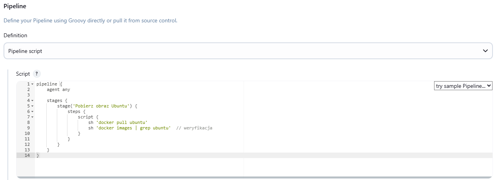

# Sprawozdanie 2
## Zajecia 5 (31.03.2025r.)
### Pipeline, Jenkins, izolacja etapów
Celem pracy było przygotowanie spersonalizowanego obrazu Dockera dla Jenkinsa z dodatkowymi narzędziami i wtyczkami niezbędnymi do tworzenia potoków CI/CD.

Instalacja Jenkinsa.
Wybrane wtyczki dla Jenkinsa:
- `docker-workflow` – integracja Dockera z potokami Jenkinsa.
- `blueocean` –  interfejs użytkownika dla Jenkinsa.
- `pipeline-utility-steps` – dodatkowe funkcje dla potoków.
Aby umożliwić Jenkinsowi komunikację z Dockerem, w kontenerze zainstalowano narzędzia Docker CLI.
Ze względów bezpieczeństwa po instalacji narzędzi zmieniono użytkownika z `root` na `jenkins`.

Utworzyłam plik `Dockerfile.jenkins`:

```bash
FROM jenkins/jenkins:lts-jdk17 #Wybór obrazu bazowego

USER root

# Instalacja Docker CLI i narzędzi
RUN apt-get update && \
    apt-get install -y \
        apt-transport-https \
        ca-certificates \
        curl \
        gnupg2 \
        software-properties-common && \
    curl -fsSL https://download.docker.com/linux/debian/gpg | gpg --dearmor -o /usr/share/keyrings/docker-archive-keyring.gpg && \
    echo "deb [arch=$(dpkg --print-architecture) signed-by=/usr/share/keyrings/docker-archive-keyring.gpg] https://download.docker.com/linux/debian $(lsb_release -cs) stable" > /etc/apt/sources.list.d/docker.list && \
    apt-get update && \
    apt-get install -y docker-ce-cli docker-compose-plugin && \
    rm -rf /var/lib/apt/lists/*

# Instalacja pluginów Jenkinsa
RUN jenkins-plugin-cli --plugins \
    docker-workflow \
    blueocean \
    pipeline-utility-steps

USER jenkins
```

Zbudowałam obraz Jenkinsa, utworzyłam sieć dla Jenkinsa i DinD oraz uruchomimłam kontenery DinD (Docker-in-Docker), Jenkinsa.

Kontener DinD zawiera:
- `--privileged` – wymagane do działania DinD.
- Wolumen `dind-data` – przechowuje dane Dockera wewnątrz DinD.
- Wyłączony `TLS (DOCKER_TLS_CERTDIR="")` – uproszczenie komunikacji (w środowisku testowym).

Kontener Jenkinsa zawiera:
- Mapowanie portów (8080 – interfejs web, 50000 – agentowie).
- Wolumen `jenkins-data` – trwałość danych konfiguracyjnych.
- Zmienną `DOCKER_HOST=tcp://docker:2375` – wskazanie na DinD.

```bash
#Zbudowanie obrazu
docker build -t my-jenkins -f Dockerfile.jenkins .

#Utworzenie sieci
docker network create jenkins-net

#Uruchomienie kontenera DinD
docker run -d \
  --name jenkins-dind \
  --network jenkins-net \
  --network-alias docker \
  --privileged \
  -v dind-data:/var/lib/docker \
  -e DOCKER_TLS_CERTDIR="" \
  docker:dind

#Uruchomienie kontenera Jenkinsa
  docker run -d \
  --name jenkins \
  --network jenkins-net \
  -p 8080:8080 \
  -p 50000:50000 \
  -v jenkins-data:/var/jenkins_home \
  -e DOCKER_HOST=tcp://docker:2375 \
  my-jenkins
```


W celu werifikacji sprawdziłam działające kontenery.
```bash
  docker ps
```


Następnie pobrałam hasło admina potrzebne do zalogowania się póżniej do Jenkinsa.

```bash
  docker exec jenkins cat /var/jenkins_home/secrets/initialAdminPassword
```


Uzyskałam hasło: 77bf97f2b9b4455d97efd5b34b176c45
Otworzyłam Jenkinsa w przeglądarce za pomocą IP `http://192.168.0.7:8080/`. Po wprowadzeniu hasła możliwa była dalsza konfiguracja (instalacja sugerowanych wtyczek, tworzenie konta administratora).


Zainstalowałam wymagane wtyczki.


Po przejściu wszytkich kroków:


#### Implementacja projektów

Po udanej konfiguracji przeszłam do stworzenia projektu.
Na tablicy wybałam opcje `Nowy projekt` oraz nadałam nazwę pierwszego projektu na `p1`.


Wybrałam `Ogólny projekt` oraz w zakładce `kroki budowania` -> `Uruchom powłokę` wpisałam `uname -a` (zwraca informacje o systemie operacyjnym).


Zapisałam oraz uruchomiłam projekt.


Utworzyłam nowy projekt `p2` tym razem wybrałam opcję `Pipeline`.Bedzie to projekt który zwraca błąd, gdy godzina jest nieparzysta. W `Pipeline script` napisałam skrypt sprawdzający.


Po odpaleniu projektu:


Kolejnym utworzonym pojektem 'p3' będzie `Pipeline`, który pobiera obraz kontenera ubuntu (stosując docker pull).



Wynik uruchomienia:


Utworzyłam `p4`, który:
- klonuje nasze repozytorium `https://github.com/InzynieriaOprogramowaniaAGH/MDO2025_INO`
- przechodzi na osobistą gałąź `MP417574`
- buduje obrazy z dockerfiles i/lub komponuje via docker-compose.


Wynik uruchomienia:


#### Implementacja Pipeline'u z wykorzystaniem kontenerów
Celem punktu zadania było stworzenie potoku Jenkinsa (`Pipeline`), który będzie wykorzystywał kontenery do izolacji poszczególnych etapów budowania i testowania. `Pipeline` powinien być zdefiniowany w pliku Jenkinsfile umieszczonym w repozytorium projektu.

Utworzyłam plik `Jenkinsfile`definiujący pipeline w głównym katalogu repozytorium.
```groovy

```

Wartianty implementacji:
1. Bezpośrednio na kontenerze CI:
- Prostsza konfiguracja
- Mniejsze zużycie zasobów
- Szybsze uruchomienie
- Mniejsza izolacja
- Potencjalne konflikty wersji narzędzi


2. Z wykorzystaniem DinD
- Pełna izolacja środowisk
- Możliwość równoległego uruchamiania wielu buildów
- Spójność z lokalnym środowiskiem developerskim
- Większa złożoność
- Wymaga kontenera `privileged`
- Większe zużycie zasobów


