# Sprawozdanie 3
## Meg Paskowski
## Grupa: 2
## Zajecia 8-11
### Automatyzacja i zdalne wykonywanie poleceń za pomocą Ansible (lab 8)

Będziemy potrzebować drugiej maszyny wirtualnej. Dla oszczędności zasobów, musi być jak najmniejsza i jak najlżejsza.

- `fedora-main` – główna maszyna (zarządca / orchestrator)
- `ansible-target` – maszyna docelowa (endpoint)

Utworzenie drugiej maszyny wirtualnej z systemem `Fedora`. Przy najmniejszym zbiorze zainstalowanego oprogramowania.

Zmaiana nazwy hosta.


Ustawienia użytkownika.


Sprawdzenie, czy na maszynie jest `tar` i `sshd`.


Utworzenie mikawki maszyny -> pełne spakowanie maszyny wirtualnej (dysk, konfiguracja) do pliku .ova (standard Open Virtualization Format). Dzięki temu jesteśmy w stanie:
- Skopiować maszynę na inny komputer,
- Udostępnić maszynę komuś innemu,
- Zachować backup na przyszłość.

Wybrałam na pasku `Maszyna` → `Narzędzia` → `Migawki` i następnie `Zrób`


Do wykonania eksportu maszyny `Plik` → `Eksportuj urządzenie wirtualne...`


Na maszynie głównej podbrałam `Ansible`.

```bash
sudo dnf install ansible -y

#Sprawdzenie
ansible --version

```


Następnie, aby zmienić klucze ssh tak, by logowanie `ssh ansible@ansible-target` nie wymagało podania hasła wykonalam następujące kroki:

Skopiowałam kod publiczny z maszyny głównej na `ansible-target`.

```bash
ssh-copy-id ansible@192.168.0.86
```

Edytowalam plik `sudo nano /etc/hosts` dodając `192.168.0.86 ansible-target`, `192.168.0.7 fedora-main` i sprawdziłam połaczenie przez ssh.

```bash
ssh ansible@ansible-target
```


Na głownej maszynie bylo należalo zmienic ustawienie `hostname` oraz dodac do pliku `/etc/hosts` → `192.168.0.7 fedora-main` i `192.168.0.86 ansible-target`.

```bash
sudo hostnamectl set-hostname fedora-main

#Edycja pliku hosts
sudo nano /etc/hosts

```
Naleźy rowniez skopiować klucz `ssh-copy-id mpaskowski@fedora-main` z maszyny głownej.


Na sam koniec zwerifikowałam `ping`.

Z maszyny `fedora-main`:


Z maszyny `ansible-target`:


Następnie utworzylam plik inwentaryzacji.
Plik inventory w Ansible to prosty plik tekstowy, który zawiera informacje o hostach, do których Ansible ma się połączyć i zarządzać nimi. W pliku inventory dodajee maszyny, które będą klasyfikowane w odpowiednich grupach, takich jak `Orchestrators` (maszyna główna) i `Endpoints` (maszyny docelowe) u mnie pod nazwą `TargetMachines`.
Zaczelam od utworzenia katalogu `ansible_1` w ktorym bedzie `inventory.ini` (`nano inventory`).

Zawartość pliku `inventory.ini`:
```
[TargetMachines]
ansible-target ansible_ssh_user=ansible 

[Orchestrators]
fedora-main ansible_ssh_user=mpaskowski 
```

W pliku `/etc/ansible/ansible.cfg ` ustawiłam ścieżkę dla pliku `inventory.ini`:

```bash
[defaults]
inventory = /home/mpaskowski/MDO2025_INO/INO/GCL02/MP417574/Sprawozdanie3/ansible_1/inventory.ini
```

Plik możemy przetestować za pomocą komendy ping.

```bash
ansible -i inventory.ini -m ping TargetMachines

ansible -i inventory.ini -m ping Orchestrators
```


#### Zdalne wywoływanie procedur
Utworzyłam katalog `` w którm znajdować się będą wszytkie playbook'i.

1. Utworzyłam plik `ping_all_machines.yml` → mająct na celu wysłanie żądania ping'u do wszystkich maszyn.
Zawartość pliku:

```yml
---
- name: Pingowanie wszystkich maszyn
  hosts: all        # Odwołanie do wszystkich maszyn z inventory
  tasks:
    - name: Wykonaj ping do wszystkich maszyn
      ansible.builtin.ping:

```

Aby uruchomić:

```bash
nsible-playbook ping_all_machines.yml -i /home/mpaskowski/MDO2025_INO/INO/GCL02/MP417574/Sprawozdanie3/ansible_1/inventory.ini
```


2. Plik `copy_inventory.yml` → który będzie kopiować plik inwentaryzacji na maszyne `Endpoints` (u mnie `TargetMachines`).

```yml
---
- name: Skopiowanie pliku inwentaryzacji na maszyny Endpoints
  hosts: TargetMachines   # Grupa maszyn, do ktrych kopiujemy pliki
  tasks:
    - name: Skopiowanie pliku inventory.ini na maszynę
      copy:
        src: /home/mpaskowski/MDO2025_INO/INO/GCL02/MP417574/Sprawozdanie3/ansible_1/inventory.ini  # Ścieżka do pliku lokalnego
        dest: /home/ansible/ # Ścieżka docelowa na maszynach z grupy Endpoints
        mode: '0644'  #Uprawnienia
```

Aby uruchomić:

```bash
ansible-playbook -i /home/mpaskowski/MDO2025_INO/INO/GCL02/MP417574/Sprawozdanie3/ansible_1/inventory.ini copy_inventory.yml
```


Po ponownym uruchomieniu:


3. Plik `upadte.yml` → dokonuje aktualizacji pakietów w systemie.
Zawartość pliku `upadte.yml`:

```yml
---
- name: Zaktualizuj pakiety w systemie
  hosts: all
  become: yes  # Wymaga podniesienia uprawnień do roota
  tasks:
    - name: Zaktualizuj wszystkie pakiety
      ansible.builtin.dnf:
        name: '*'
        state: latest

```

Aby uruchomić:

```bash
ansible-playbook -i /home/mpaskowski/MDO2025_INO/INO/GCL02/MP417574/Sprawozdanie3/ansible_1/inventory.ini update.yml --ask-become-pass
```


4. Plik `restart_services.yml` → restartuje usługi `ssh` i `rngd`.

Zawartość pliku ` restart_services.yml`:

```yml
---
- name: Zrestartuj usługi sshd i rngd
  hosts: all
  become: yes 
  tasks:
    - name: Zrestartuj usługę sshd
      ansible.builtin.systemd:
        name: sshd
        state: restarted

    - name: Zrestartuj usługę rngd
      ansible.builtin.systemd:
        name: rngd
        state: restarted

```

Aby uruchomić:

```bash
ansible-playbook -i /home/mpaskowski/MDO2025_INO/INO/GCL02/MP417574/Sprawozdanie3/ansible_1/inventory.ini restart_services.yml --ask-become-pass
```


Wszytkie te polecenia mogą zostać uwgzlędnione w jednym pliku → `all_tasks.yml`.

```bash
ansible-playbook -i /home/mpaskowski/MDO2025_INO/INO/GCL02/MP417574/Sprawozdanie3/ansible_1/inventory.ini all_tasks.yml --ask-become-pass
```


5. Przeprowadziłam operacje względem maszyny z wyłączonym serwerem SSH, odpiętą kartą sieciową.

Wyłączenie serwera SSH i odłączenie karty sieciowej ma na celu zasymulowanie sytuacji, w której maszyna jest "nieosiągalna" zdalnie. Jest to użyteczne w kontekście testowania scenariuszy awarii lub konfiguracji systemu, które wymagają interakcji z maszyną, która nie jest dostępna w normalny sposób.

Kroki które wyonaam przed uruchomieniem poprzednich zadań (na maszynie docelowej - `asimble-target`):

```bash
#Odlaczenie serwera SSH
sudo systemctl stop sshd

#Wylaczenie karty sieciowej
sudo ifconfig eth0 down
```

Następnie uruchomiam wcześniej przeprowadzone zadania.


Podczas wykonywania playbooka Ansible napotkano problem z połączeniem do maszyny ansible-target. Przyczyną błędu było wyłączenie serwera SSH na tej maszynie oraz odłączenie interfejsu sieciowego, co uniemożliwiło nawiązanie połączenia zdalnego. Aby rozwiązać ten problem, przywrócono serwis SSH do działania oraz ponownie aktywowano interfejs sieciowy, co pozwoliło na poprawne wykonanie kolejnych operacji.

#### Zarządzanie stworzonym artefaktem
Moim artefaktem w projekcie z poprzednich zajęć by kontener.
W celu zautomatyzowania procesu użyłam playbooka Ansible oraz struktury ról, utworzonej za pomocą `ansible-galaxy`.
[role](https://docs.ansible.com/ansible/latest/playbook_guide/playbooks_reuse_roles.html)


Uworzyłam nową role `cjson-role`:

```bash
ansible-galaxy init cjson-role
```


Po utworzeniu roli skopiowałam pliki `cjson.rpm` i `main.c` oraz edytowałam plik `main.yaml` tak, aby:
- przesyłał artefakty na `ansible-target`,
- instaluje Dockera oraz jego zależności,
- uruchamia kontener,
- instaluje biblioteki z pliku `.rpm`
- kompuluje program,
- uruchamia program i pobiera wynik.

Zawartość pliku `main.yaml`. Plik znajduje w folderze `cjson/tasks` w stworzonej roli `cjson-role`.

```yaml
---
# tasks file for cjson-role
- name: Create artifacts directory
  become: yes
  file:
    path: /home/ansible/cjson
    state: directory
    owner: ansible
    group: ansible
    mode: '0755'

- name: Copy artifacts to target
  copy:
    src: "{{ item }}"
    dest: /home/ansible/cjson/
    mode: '0644'
  loop:
    - files/cjson.rpm
    - files/main.c

- name: Install python3-requests
  ansible.builtin.dnf:
    name: python3-requests
    state: present

- name: Install Docker
  become: yes
  dnf:
    name: docker
    state: present
  
- name: Ensure Docker is started
  become: yes
  service:
    name: docker
    state: started
    enabled: true

- name: Add ansible to docker group
  user:
    name: ansible
    groups: docker
    append: true

- name: Start fedora container
  community.docker.docker_container:
    name: cjson
    image: fedora:41
    state: started
    command: sleep infinity
    volumes:
      - /home/ansible/cjson:/tmp:z

- name: Install gcc, cjson and tools
  community.docker.docker_container_exec:
    container: cjson
    command: dnf install -y gcc make /tmp/cjson.rpm

- name: Compile source file
  community.docker.docker_container_exec:
    container: cjson
    command: gcc -o /tmp/example /tmp/main.c -lcjson

- name: Run program
  community.docker.docker_container_exec:
    container: cjson
    command: bash -c "LD_LIBRARY_PATH=/usr/local/lib64 /tmp/example"
  register: result

- name: Print the result of the program
  debug:
    var: result.stdout
```

Uruchomienie roli przez playbook-cjson.yaml.

Zawartość pliku `playbook-cjson.yaml`:

```yaml
- name: Deploy CJSON
  hosts: ansible-target
  become: true
  roles:
    - cjson-role
```

Uruchomienie:

```bash
ansible-playbook /home/mpaskowski/MDO2025_INO/INO/GCL02/MP417574/Sprawozdanie3/ansible_playbooks/playbook-cjson.yaml -i /home/mpaskowski/MDO2025_INO/INO/GCL02/MP417574/Sprawozdanie3/ansible_1/inventory.ini --ask-become-pass
```


Inny sposób - za pomocą playbooka Ansible.


Zbudowałam playbooka Ansible, który:
1. Buduje i uruchomia kontener sekcji `Deploy` z poprzednich zajęć.
2. Pobiera z `Docker Hub` aplikację w ramach kroku `Publish`
3. Weryfikuje łączność z kontenerem
4. Zatrzymuje i usuwa kontener

Plik `project.yml`:
```yml
---
- name: Zbudowanie, uruchomienie, weryfikacja i usunięcie kontenera
  hosts: all
  become: yes
  vars_files:
    - /home/mpaskowski/MDO2025_INO/INO/GCL02/MP417574/Sprawozdanie3/ansible_playbooks/vars.yml
  tasks:

    # Krok 1: Zalogowanie do Docker Hub
    - name: Zaloguj się do Docker Hub
      docker_login:
        registry: "docker.io"
        username: "icharne2"
        password: "{{ docker_password }}"  # Przechowuj hasło w zmiennej

    # Krok 2: Pobierz obraz z Docker Hub
    - name: Pobierz obraz z Docker Hub
      docker_image:
        name: "icharne2/cjson-deploy"
        source: pull

    # Krok 3: Zbudowanie i uruchomienie kontenera
    - name: Zbuduj kontener Docker z aplikacją
      docker_container:
        name: "cjson-deploy"
        image: "icharne2/cjson-deploy"
        state: started
        restart_policy: no  # Zapobiegamy automatycznemu restartowi kontenera
        command: "sh -c './example && sleep 9999'"  # Uruchamiamy aplikację 'example' i zatrzymujemy kontener na kilka godzin

    # Krok 4: Weryfikacja, czy aplikacja działa
    - name: Sprawdzenie, czy aplikacja działa
      command: "docker exec cjson-deploy /bin/bash -c './example'"
      register: result
      failed_when: result.rc != 0  # Jeśli aplikacja zakończy się błędem, playbook się nie powiedzie

    # Krok 5: Zatrzymanie kontenera
    - name: Zatrzymanie kontenera cjson-deploy
      docker_container:
        name: "cjson-deploy"
        state: stopped

    # Krok 6: Usunięcie kontenera
    - name: Usunięcie kontenera cjson-deploy
      docker_container:
        name: "cjson-deploy"
        state: absent
```

Uruchomienie:

```bash
ansible-playbook project.yml -i /home/mpaskowski/MDO2025_INO/INO/GCL02/MP417574/Sprawozdanie3/ansible_1/inventory.ini --ask-become-pass
```


Przedstawiono sposób wykorzystania Ansible do zdalnego zarządzania systemami operacyjnymi. Wykonane działania obejmowały przygotowanie środowiska, konfigurację dostępu między maszynami, stworzenie pliku inwentaryzacji oraz realizację wybranych operacji administracyjnych za pomocą playbooków.

Zadanie pokazało, że Ansible pozwala na centralne sterowanie wieloma systemami jednocześnie, bez konieczności ręcznego logowania się na każdą maszynę. Dzięki temu możliwe było wykonanie operacji takich jak aktualizacja pakietów, kopiowanie plików czy zarządzanie kontenerami. 

### Pliki odpowiedzi dla wdrożeń nienadzorowanych - Kickstart
Do wykonania zadania skorzystałam z pliku systemu Fedora 41 z poprzenic zajęć. Jako administrator skopiowałam plik pod scieżką `/root/anaconda-ks.cfg` do folderu `Sprawozdanie3`.

Następnie zmodyfikowałam plik `anaconda-ks.cfg` dodając informację o repozytoriach oraz zmieniająć nazwę użytkownika.

Dodane roepozytoria:

```conf
url --mirrorlist=http://mirrors.fedoraproject.org/mirrorlist?repo=fedora-41&arch=x86_64
repo --name=update --mirrorlist=http://mirrors.fedoraproject.org/mirrorlist?repo=updates-released-f41&arch=x86_64
```

Plik po dokonanych zmian został przesłany na Githuba. Następnie skopiowałam link do pliku `Raw` w pliku na Githubie oraz skróciam link za pomocą [TinyURL](https://tinyurl.com/). Uzyskany link `https://tinyurl.com/3ehberxn`.

Podczas instalcji nowej maszyny, w menu statorym instalatora kliknełam `e`, aby wejść do trybu edycji poleceń GRUB. Edytowałam parametry instalacyjne.


Zapisuje zmiany `Crtl-X`.

Instalator uruchomiony w trybie graficznym:


Wszytkie informacje po poprawnym odczytaniu pliku powinny się automatycznie załadować.
Po chwili instalator przeszedł dalej.


Po zakończeniu należało ponownie urucomić system oraz odpiąć plik `iso`.


#### Rozszerzenie pliku odpowiedzi o dodatkowe opcje

W kolejnym kroku rozszerzyłam plik `anaconda-ks.cfg`, dodając:

- `reboot` — aby system automatycznie uruchomił się ponownie po zakończeniu instalacji,  
- `network --hostname=fedora.test` — aby przypisać maszynie nową nazwę hosta,  

Zaktualizowany plik ponownie umieściłam na GitHubie. Przeprowadziłam proces instalacji jeszcze raz — tym razem system samodzielnie wykonał restart po zakończeniu.

Zmieniony plik:

```
# Generated by Anaconda 41.35
# Generated by pykickstart v3.58
#version=DEVEL

# Keyboard layouts
keyboard --vckeymap=us --xlayouts='us'

# System language
lang en_US.UTF-8

# Network information
network --bootproto=dhcp --device=enp0s3 --hostname=fedora.test --ipv6=auto --activate

# Repository Added
url --mirrorlist=http://mirrors.fedoraproject.org/mirrorlist?repo=fedora-41&arch=x86_64
repo --name=update --mirrorlist=http://mirrors.fedoraproject.org/mirrorlist?repo=updates-released-f41&arch=x86_64

%packages
@^server-product-environment

%end

# Run the Setup Agent on first boot
firstboot --enable

# Generated using Blivet version 3.11.0
ignoredisk --only-use=sda

#Automatic partitioning
autopart

# Partition clearing information
clearpart --none --initlabel

# System timezone
timezone Europe/Warsaw --utc

# Root password
rootpw --iscrypted --allow-ssh $y$j9T$f42zTKc8FiEAXyECki5fEwka$TuNUxPrCp2i9fdDQZY3W7TDOMG9aGTdtVCupZdfmsJ4
user --groups=wheel --name=kickstart --password=$y$j9T$eKgdXsLTmrSEuSPjMoYgokYv$EzoYQqbicne4onhOqzWeVa420g3u.59tCdlzzVbTSb8 --iscrypted --gecos="kickstart"

reboot
```

Wynik sprawdzenie nazwy hosta po ponownej instalacji.


#### Instalacja biblioteki cjson w wykorzystaniem pliku odpowiedzi

Do wykonania zadania przebudowałam pliki służace do sorprzenia pliku `rpm` z poprzednich zajęć.
W celu udustępnienia biblioteki w formie repozytorium YUM, pobrałam serwer `Apache` i narzędzie `createrepo `.

```bash
sudo dnf install -y httpd createrepo policycoreutils-python-utils
```

Uruchomłam i włączłam HTTPD oraz otworzyłam port 80 

```bash
sudo systemctl enable --now httpd

sudo firewall-cmd --permanent --add-service=http
sudo firewall-cmd --reload
```

Następnie utworzyłam katalog `/var/www/html/cjson`.

```bash
sudo mkdir -p /var/www/html/cjson
sudo cp cjson.rpm /var/www/html/cjson/
```

Nadałam poprawny kontekst SELinux i odświeżyłam oraz wygenerowalam metadane RPM

```bash
sudo semanage fcontext -a -t httpd_sys_content_t "/var/www/html/cjson(/.*)?"
sudo restorecon -Rv /var/www/html/cjson

sudo createrepo /var/www/html/cjson
```

Sprawdzenie poprawności dzialania:

```bash
curl -I http://192.168.0.7/cjson/repodata/repomd.xml
curl -s  http://192.168.0.7/cjson/ | grep '\.rpm'
```
Sprawdzenie z przeglądarki, czy działa:


Instalacja weryfikująca poprawne pobranie artefaktu z utworzonego repozytorium `cjson`. 


Edycja pliku `anaconda-ks.cfg`:

```
# Generated by Anaconda 41.35
# Generated by pykickstart v3.58
#version=DEVEL

# Keyboard layouts
keyboard --vckeymap=us --xlayouts='us'

# System language
lang en_US.UTF-8

# Network information
network --bootproto=dhcp --device=enp0s3 --hostname=fedora.test --ipv6=auto --activate

# Repository Added
url --mirrorlist=http://mirrors.fedoraproject.org/mirrorlist?repo=fedora-41&arch=x86_64
repo --name=update --mirrorlist=http://mirrors.fedoraproject.org/mirrorlist?repo=updates-released-f41&arch=x86_64
repo --name=cjson --baseurl=http://192.168.0.7/cjson/

%packages
@core
cjson
gcc
glibc
curl
%end

# Run the Setup Agent on first boot
firstboot --enable

# Generated using Blivet version 3.11.0
ignoredisk --only-use=sda

#Automatic partitioning
autopart

# Partition clearing information
clearpart --none --initlabel

# System timezone
timezone Europe/Warsaw --utc

# Root password
rootpw --iscrypted --allow-ssh $y$j9T$f42zTKc8FiEAXyECki5fEwka$TuNUxPrCp2i9fdDQZY3W7TDOMG9aGTdtVCupZdfmsJ4
user --groups=wheel --name=kickstart --password=$y$j9T$eKgdXsLTmrSEuSPjMoYgokYv$EzoYQqbicne4onhOqzWeVa420g3u.59tCdlzzVbTSb8 --iscrypted --gecos="kickstart"

# Display result
  %post --interpreter /bin/bash
  echo "Confirming installation..."
  ls /usr/include/cjson
  ls /usr/lib/libcjson*
  %end

reboot
```

Zmiany wprowadzone do pliku:
- Potrzebne pakiety `%packages` między innymi pakiet `cJSON`,
- Repozytorium `cjson`,
- W sekcji `%post` zweryfikowano obecność artefaktu.

Sprawdzenie, czy wszytko przebiegło pomyśłnie:


W celu zautomatyzowania procesu można utworzyć bootowalny `.iso`.
Aby tego dokonać należy zmodyfikować obraz instalatora systemu.

Na sam poczatek utworzylam katalog wspoldzielony miedzy Fedora a systemem Windows.

Rozpakowanie `.iso`:

```bash
sudo dnf install -y xorriso

mkdir ~/iso-raw  
cd ~/iso-raw  
xorriso -osirrox on -indev /ścieżka/do/Fedora-41.iso -extract / .  
```

Edycja pliku `boot/grub2/grub.cfg`:

```
  set default="0"
  
  function load_video {
    insmod all_video
  }
  
  load_video
  set gfxpayload=keep
  insmod gzio
  insmod part_gpt
  insmod ext2
  insmod chain
  
  set timeout=0
  ### END /etc/grub.d/00_header ###
  
  search --no-floppy --set=root -l 'Fedora-E-dvd-x86_64-41'
  
  ### BEGIN /etc/grub.d/10_linux ###
  menuentry 'Install Fedora 41' --class fedora --class gnu-linux --class gnu --class os {
  	linux /images/pxeboot/vmlinuz inst.stage2=hd:LABEL=Fedora-E-dvd-x86_64-41 inst.ks=https://tinyurl.com/3ehberxn quiet
  	initrd /images/pxeboot/initrd.img
  }
```

Zawartość pliku: 
- dodanie plik konfiguracji poprzez adres `inst.ks=https://tinyurl.com/3ehberxn`,
- Domyślna opcja - `set default="0"`,
- Aby instalacja rozpoczeła się od razu `set timeout=0`,
- Zmiana etykiety na `Fedora-KickStart`

Uruchomienie w katalogu `~/iso-raw`:

```bah
cd ~/iso-raw
xorriso -as mkisofs \
  -o /media/sf_ShareISO/Fedora-Kickstart.iso \
  -J -R -V "Fedora-Kickstart" \
  .
```


Skryp Powershell Script na systemie Windows - utworzenie maszyny z nowo utworzonego obrazu.

```bash
  $vmName     = "Fedora-instalation"
  $isoPath    = "C:\Users\Meg Paskowski\Desktop\ShareISO\Fedora-Kickstart.iso"
  $diskFolder = "C:\Users\Meg Paskowski\VirtualBox VMs\$vmName"
  $diskPath   = "$diskFolder\$vmName.vdi"
  $VBoxManage = "C:\Program Files\Oracle\VirtualBox\VBoxManage.exe"
  $memory     = 3048
  $cpus       = 2
  
  & $VBoxManage createvm --name $vmName --ostype Fedora_64 --register
  
  & $VBoxManage modifyvm $vmName --memory $memory --cpus $cpus --boot1 dvd --firmware efi
  
  New-Item -ItemType Directory -Path $diskFolder -Force | Out-Null
  & $VBoxManage createhd --filename "$diskPath" --size 2048
  
  & $VBoxManage storagectl $vmName --name "SATA Controller" --add sata --controller IntelAhci
  & $VBoxManage storageattach $vmName --storagectl "SATA Controller" --port 0 --device 0 --type hdd --medium "$diskPath"
  
  & $VBoxManage storagectl $vmName --name "IDE Controller" --add ide
  & $VBoxManage storageattach $vmName --storagectl "IDE Controller" --port 0 --device 0 --type dvddrive --medium "$isoPath"
  
  & $VBoxManage startvm $vmName --type gui
```

Odpalenie skrypu:


Skrypt utworzył maszyne o podanej nazwie, dysk, kontrolery, podtsawowe ustawienie CPU, pamięci i uruchomił maszynę.

Automatyczna instalacja:


### Wdrażanie na zarządzalne kontenery
#### Instalacja Kubernetes 

Sprzęt i wirtualizacja:

- **CPU / RAM**: minimalnie 2 CPU i 2 GiB RAM (zalecane 4 CPU i 4 GiB),
- **Wirtualizacja**: włączona w BIOS/UEFI (Intel VT-x lub AMD-V),
- **Hypervisor**: zainstalowany VirtualBox, KVM2 (libvirt) lub Docker.

Dzięki temu maszyna (fizyczna lub wirtualna) będzie w stanie uruchomić klaster Kubernetes lokalnie, bez konieczności dostępu do zewnętrznego środowiska chmurowego.

Instalacja Minikube:

```bash
# Pobranie RPM
curl -LO https://storage.googleapis.com/minikube/releases/latest/minikube-latest.x86_64.rpm
# Instalacja za pomocą RPM
sudo rpm -Uvh minikube-latest.x86_64.rpm
#Uruchomienie klastra z 2 CPU i 2 GiB RAM (driver: Docker)
minikube start --driver=docker --cpus=2 --memory=2048
```

- `minikube start`: inicjuje lokalny klaster Kubernetes w ramach wskazanego drivera (tutaj Docker).
- Parametry `--cpus` i `--memory` gwarantują wystarczające zasoby.

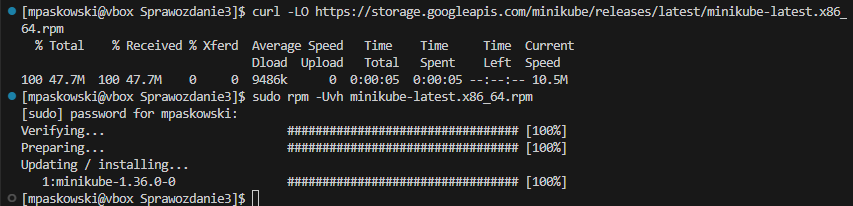

Poziom bezpieczeństwa instalacji: `minikube kubectl -- get clusterrolebindings`. Pokazuje, jakie uprawnienia klastra (role) są przypisane do których użytkowników czy serwisów.

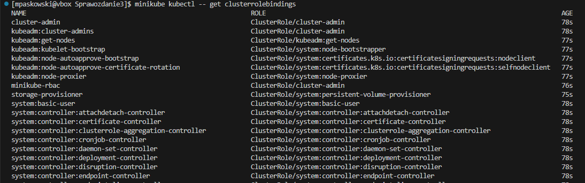

Domyślne przestrzenie nazwy do separacji zasobów w Kubernetes (np. default, kube-system, kube-public), które pozwalają na logiczną separację zasobów `minikube kubectl -- get namespaces`.

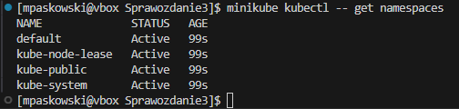

Wszystkie komponenty klastra komunikują się po bezpiecznym kanale TLS. Można to zweryfikować przez zalogowanie się do maszyny Minikube: (`minikube ssh` -> `ls /var/lib/minikube/certs/`). W katalogu certs znajdują się certyfikaty API‐servera, Kubelet, itp.

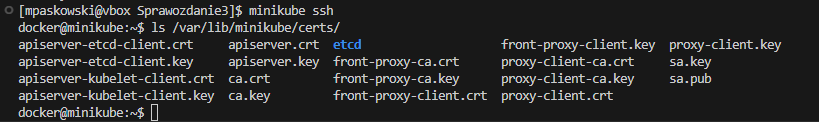

Zainstalowałam pakietu `kubectl` i stworzyłam alias `minikubectl`.

```bash
sudo dnf install -y kubectl

#Utworzenie aliasu
echo "alias minikubectl='minikube kubectl'" >> ~/.bashrc

#Załadowanie zmian
source ~/.bashrc
```

Dzięki temu zamiast pisać za każdym razem minikube kubectl możemy uzywać prostszego minikubectl.

Uruchomiłam Kubernetesa

```bash
#Otwiera webowy interfejs do monitorowania klastra.
minikube start

minikubctl --get nodes
```

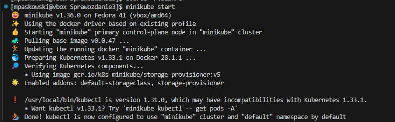

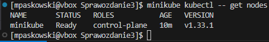

Uruchomiłam Dashboard oraz skopiowałam usyskany adres IP oraz wykonałam przekierowanie na port 8087.

```bash
minikube dashboard

ssh -L 8087:/127.0.0.1:43031 mpaskowski@192.168.0.7
```

W przeglądarce na Windows: `http://127.0.0.1:43031/api/v1/namespaces/kubernetes-dashboard/services/http:kubernetes-dashboard:/proxy/`.

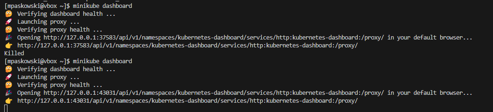


Rezultat:
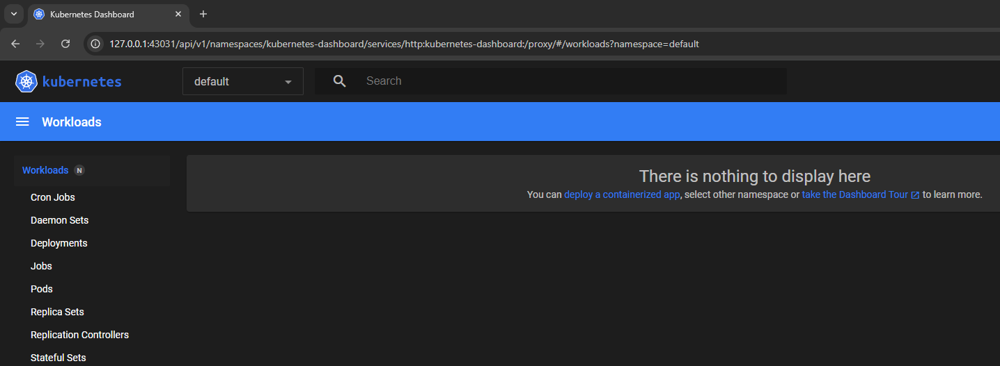

Z uwagi na korzystanie z biblioteki `cJSON` na poprzednic zajeciach, skorzystałam teraz z prostej aplikacji `app.py` w jezyku python.

Kod aplikacji:

```py
from flask import Flask
app = Flask(__name__)

@app.route("/")
def hello():
    return "<h1>Hello, Kubernetes! 🌱</h1>"

if __name__ == "__main__":
    app.run(host="0.0.0.0", port=5000)
```

Flask nasłuchuje na wszystkich interfejsach (0.0.0.0) na porcie 5000.

Dockerfile dla `app.py`:

```Dockerfile
# Gotowy obraz Pythona
FROM python:3.11-slim

# Katalog roboczy
WORKDIR /app

# Pliki z hosta do obrazu
COPY requirements.txt .
COPY app.py .

# Zależności
RUN pip install --no-cache-dir -r requirements.txt

# Port
EXPOSE 5000

# Domyślna komenda
CMD ["python", "app.py"]
```
Powyższy kod pliku `Dockerfile` buduje lekki obraz na bazie `python:3.11-slim`, kopiuje kod i instaluje zależności.

Następnie budowałam lokalnie obraz i załadowałam do Minikube.

```bash
docker build -t flask-hello .
minikube image load flask-hello
```

- `minikube image load` importuje obraz bezpośrednio do lokalnego rejestru Minikube.

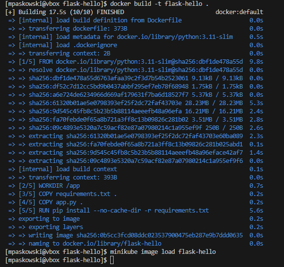

Uruchomiłam kontener w Kubernecie jako Pod:

```bash
minikube kubectl -- run flask-hello-pod \
  --image=flask-hello \
  --port=5000 \
  --image-pull-policy=Never
```

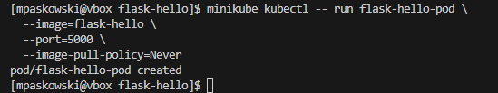

Zwerifikowałam stan Poda: `minikube kubectl -- get pods`.

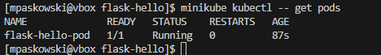

Następnie wystawiłam Pod jako Serice na porcie 5000:

```bash
minikube kubectl -- expose pod flask-hello-pod \
  --name=flask-hello-svc \
  --port=5000 \
  --target-port=5000 \
  --type=ClusterIP

  #Sprawdzenie
  minikube kubectl -- get svc
```

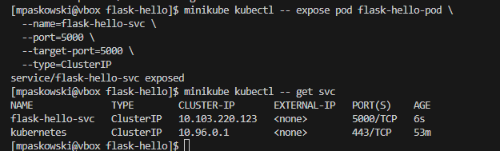

Wynik w przegladarce:

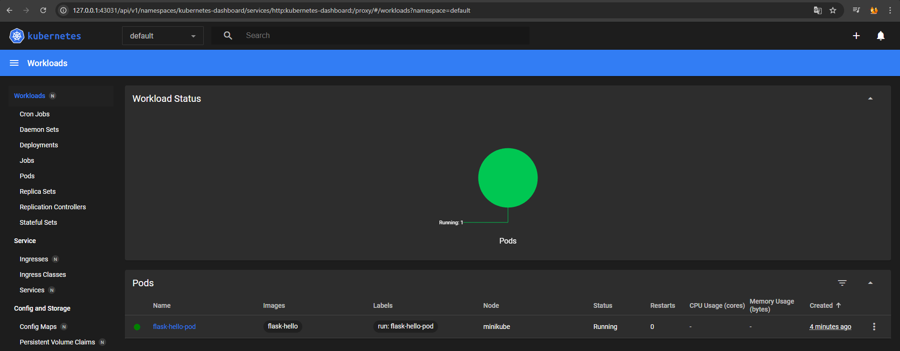

Przekierowałam port na 5080 VM:

```bash
minikube kubectl -- port-forward pod/flask-hello-pod 5080:5000
```

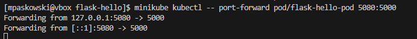

Na hoście uruchomiłam tunel SSH:

```bash
ssh -N -L 5084:127.0.0.1:5080 mpaskowski@192.168.0.7
```

Sprawdzenie poprawnosci działania:


Weryfikacja dostępu do aplikacji:


Następnie przeszłam do kroku Deploy i utworzyłam plik `flask-deploy.yaml` z czterema równoległymi instancjami aplikacji (`replicas: 4`).

```yaml
apiVersion: apps/v1
kind: Deployment
metadata:
  name: flask-hello-deployment
  labels:
    app: flask-hello
spec:
  replicas: 4
  selector:
    matchLabels:
      app: flask-hello
  template:
    metadata:
      labels:
        app: flask-hello
    spec:
      containers:
      - name: flask-hello
        image: flask-hello
        ports:
        - containerPort: 5000
        imagePullPolicy: Never
```

I zastosowałam wdrążenia `minikube kubectl -- apply -f flask-deploy.yaml`.
Sprawdzilam rollout `minikube kubectl -- rollout status deployment/flask-hello-deployment`. Deployment przechodzi przez kolejne etapy aż do `Available`.

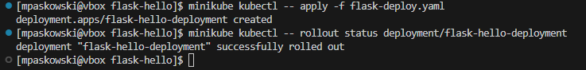

Wystawiłam Deploy jako Service:

```bash
minikube kubectl -- expose deployment flask-hello-deployment \
  --type=ClusterIP \
  --port=5000 \
  --name=flask-hello-svc-deploy
```

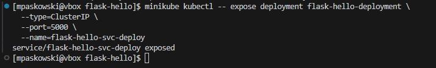

Uruchomienie i przekierowanie portu:

```bash
minikube kubectl -- port-forward service/flask-hello-svc-deploy 5081:5000
```

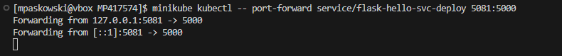

Sprawdzenie:
```bash
curl http://127.0.0.1:5081/
```


Tunel SSH do hosta `ssh -N -L 5085:127.0.0.1:5081 mpaskowski@192.168.0.7`.

Wynik:


Weryfikacja w Dashboard:

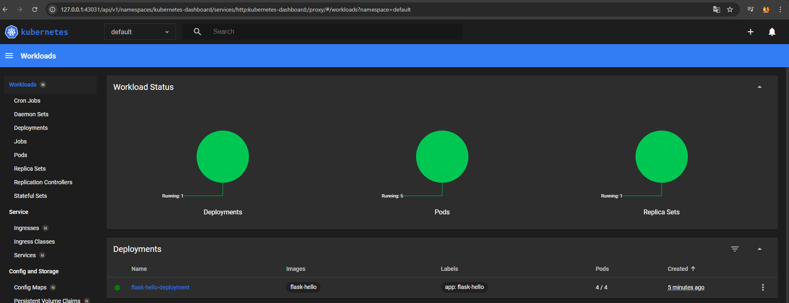

### Wdrażanie na zarządzalne kontenery: Kubernetes (2)


Budowanie obrazu docker: `docker build -t icharne2/flask-hello:v1 .`

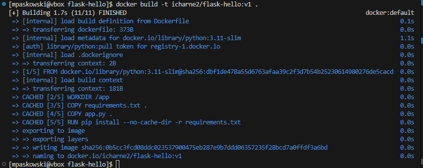

Przeslanie na Docker Hub `docker push icharne2/flask-hello:v1`

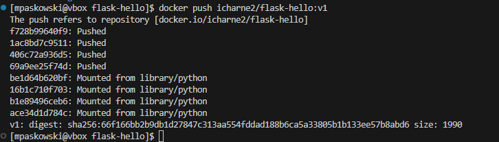

Podobne kroki wykonuje z wersja 2 i zlą wersją programu (sztucznie uszkodzona, generuje CrashLoopBackOff).

Zawartość `app.py`:

1. Dla wersji drugiej -poprawnej:

```py
from flask import Flask
app = Flask(__name__)

@app.route("/")
def hello():
    return "<h1>Hello, Kubernetes version 2! 🚀</h1>"

if __name__ == "__main__":
    app.run(host="0.0.0.0", port=5000)

```

2. Dla wersji zlej - bad:

```py
# app.py – wersja "bad" pod CrashLoopBackOff
from flask import Flask
import sys

raise RuntimeError("Intentional startup error for testing rollback")

app = Flask(__name__)

@app.route("/")
def hello():
    return "<h1>To nie powinno się uruchomić!</h1>"

if __name__ == "__main__":
    # Nigdy tu nie dojdziemy, bo wyjątek odpaliliśmy wyżej
    app.run(host="0.0.0.0", port=5000)

```

Potwierdzenie umieszczenia na `Docker Hub`:

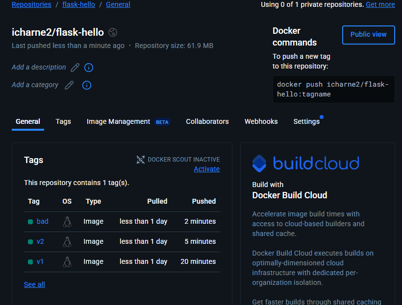

Plik `YAML` wdrążeniowy (`flask-deploy.yaml`).

```yaml
apiVersion: apps/v1
kind: Deployment
metadata:
  name: flask-hello-deployment
spec:
  replicas: 4
  selector:
    matchLabels:
      app: flask-hello
  template:
    metadata:
      labels:
        app: flask-hello
    spec:
      containers:
      - name: flask-hello
        image: icharne2/flask-hello:v1
        ports:
        - containerPort: 5000
        imagePullPolicy: Always
```

Domyślna strategia `RollingUpdate` ma parametry:

```yaml
maxUnavailable: 1
maxSurge:       1
```

Co oznacza, że `Kubernetes` -> Tworzy jedną nową replikę czeka aż będzie Ready dopiero wtedy usuwa jedną starą. 

Wdrazenie:

```bash
#Wdrążenie
minikube kubectl -- apply -f flask-deploy.yaml
minikube kubectl -- rollout status deployment/flask-hello-deployment
#Sprawdzenie pod
minikube kubectl -- get pods -l app=flask-hello
```

Sprawdzenie w `Dashboard`:


Wstawianie Deployment jako Service:

```bash
minikube kubectl -- expose deployment flask-hello-deployment \
  --name=flask-hello-svc --type=ClusterIP --port=5000 --target-port=5000
```

Przekierowanie portu:

```bash
minikube kubectl -- port-forward service/flask-hello-svc 5080:5000
```


Skalowanie replik - pozwala na dynamiczne dostosowanie liczby instancji pod obciążenie. Wykonane komendy:

```bash
# do 8 replik
minikube kubectl -- scale deployment flask-hello-deployment --replicas=8
minikube kubectl -- get pods -l app=flask-hello

#Sprawdzenie
minikube kubectl -- rollout status deployment/flask-hello-deployment
deployment "flask-hello-deployment" successfully rolled out
```

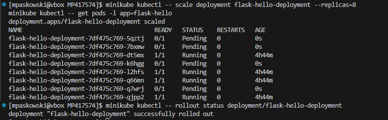
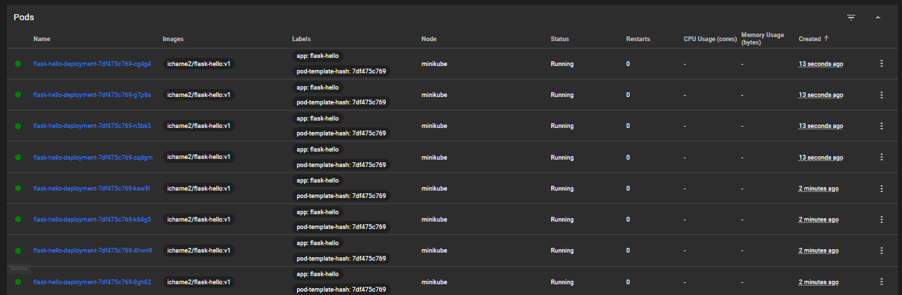

```bash
# do 1 repliki
minikube kubectl -- scale deployment flask-hello-deployment --replicas=1
minikube kubectl -- get pods -l app=flask-hello

#Sprawdzenie
minikube kubectl -- rollout status deployment/flask-hello-deployment
deployment "flask-hello-deployment" successfully rolled out
```

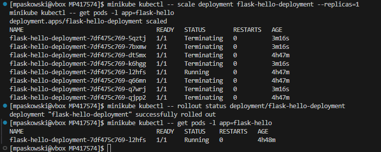
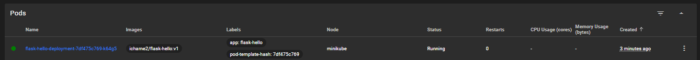

```bash
# do 0 replik
minikube kubectl -- scale deployment flask-hello-deployment --replicas=0
minikube kubectl -- get pods -l app=flask-hello

#Sprawdzenie
minikube kubectl -- get pods -l app=flask-hello
```

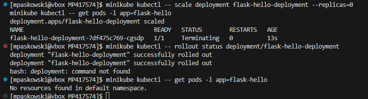
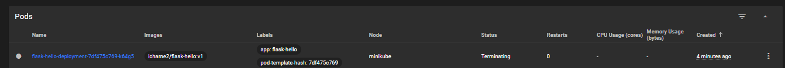

```bash
# z powrotem do 4 replik
minikube kubectl -- scale deployment flask-hello-deployment --replicas=4
minikube kubectl -- get pods -l app=flask-hello
minikube kubectl -- rollout status deployment/flask-hello-deployment

#Sprawdzenie
minikube kubectl -- get pods -l app=flask-hello
```

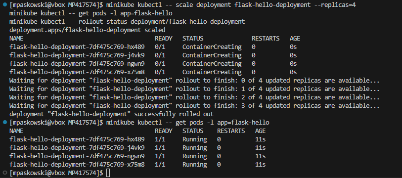
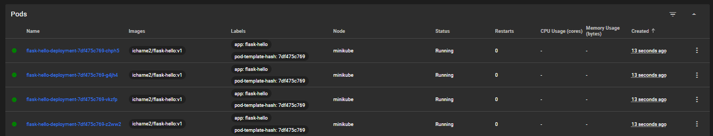

Aktualizacja obrazu (Rolling Update):
- zastępuje stopniowo stare repliki nowymi, zapewniając ciągłość działania.
- W przypadku wersji bad, nowe Pody nie przechodzą do stanu Ready → stara wersja pozostaje aktywna.

Wykonane komendy:
1. Przełączenie na wersje 2:

```bash
minikube kubectl -- set image deployment/flask-hello-deployment \
  flask-hello=icharne2/flask-hello:v2
minikube kubectl -- rollout status deployment/flask-hello-deployment
```

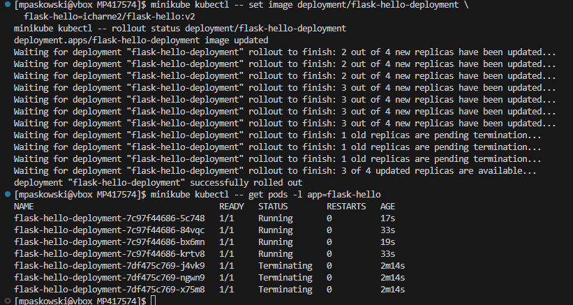


2. Cofnięcie do wersji 1:

```bash
minikube kubectl -- set image deployment/flask-hello-deployment \
  flask-hello=icharne2/flask-hello:v1
minikube kubectl -- rollout status deployment/flask-hello-deployment
```

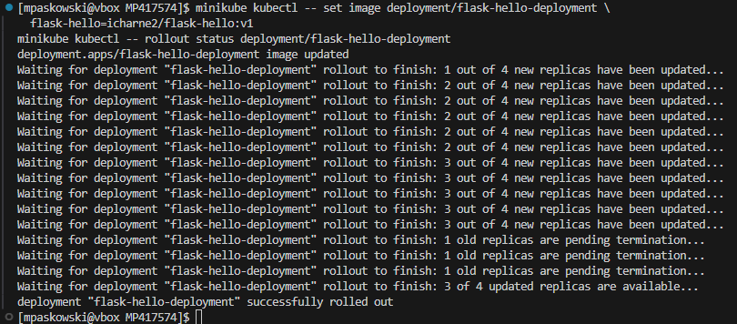
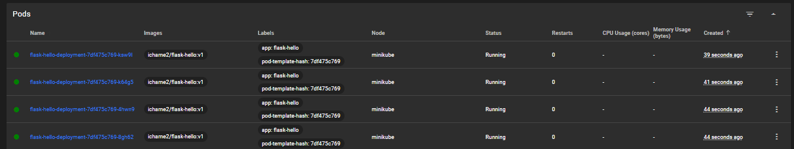

3. wersja z bledem:

```bash
minikube kubectl -- set image deployment/flask-hello-deployment \
  flask-hello=icharne2/flask-hello:bad
```

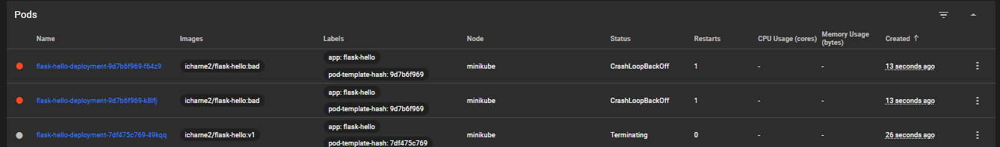

Strategia RollingUpdate dla obrazu `bad`:

W przypadku obrazu `bad` nowe Pody natychmiast padają (`CrashLoopBackOff`), więc nigdy nie osiągną stanu Ready. Kubernetes nie usuwa kolejnych starych Podów. W efekcie w Dashboardzie jest widoczne kilka Podów z `:v1` w Running oraz kilka nowych z `:bad` w `Error/` `CrashLoopBackOff` — dopóki nowe repliki nie udowodnią, że potrafią się uruchomić, stare repliki pozostają włączone.

Historia i Rollback:

```bash
#Wyświetlenie historii rewizji
minikube kubectl -- rollout history deployment/flask-hello-deployment

#szczegóły konkretnej rewizji
minikube kubectl -- rollout history deployment/flask-hello-deployment --revision=18
```

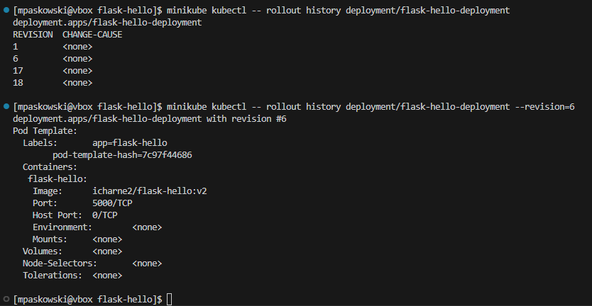

Przywracanie do konkretnej rewizji:

```bash
minikube kubectl -- rollout undo deployment/flask-hello-deployment --to-revision=6
minikube kubectl -- rollout status deployment/flask-hello-deployment
minikube kubectl -- get pods -l app=flask-hello
```


Aby ustawic opis w kolumnie `CHANGE-CAUSE` należy dodać `-- record` w komendzie `minikube kubectl -- set image deployment/flask-hello-deployment \ flask-hello=icharne2/flask-hello:v2 --record` 

Wtedy `rollout history` będzie pokazywało, jaką komendą dokonywane były zmiany.

#### Kontrola wdrążeniowa

Skrypt `wait-rollout.sh`, który w ciągu 60 s sprawdzi, czy Deployment osiągnął stan Available.

```sh
#!/usr/bin/env bash

# wait-rollout.sh
# Skrypt czeka do 60 sekund (domyślnie) na to, aż Deployment osiągnie stan Available.

DEPLOY="${1:-flask-hello-deployment}"
TIMEOUT="${2:-60}"

end=$((SECONDS + TIMEOUT))
echo "Czekam na dostępność Deploymentu '$DEPLOY' (max $TIMEOUT s)..."

while [ $SECONDS -lt $end ]; do
  status=$(kubectl get deployment "$DEPLOY" \
    -o jsonpath='{.status.conditions[?(@.type=="Available")].status}')
  if [[ "$status" == "True" ]]; then
    echo "Deployment '$DEPLOY' jest dostępny."
    exit 0
  fi
  sleep 2
done

echo "Timeout! Deployment '$DEPLOY' nie stał się dostępny w ciągu $TIMEOUT s."
exit 1
```

Nadałam prawa do wykonywalności `chmod +x wait-rollout.sh` oraz uruchomiłam skrypt `./wait-rollout.sh flask-hello-deployment 60`.

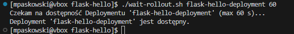


#### Strategie wdrożenia

Wersje wdrożen w pliku `yaml`:
1. `Recreate`

```yaml
apiVersion: apps/v1
kind: Deployment
metadata:
  name: flask-hello-deployment
spec:
  replicas: 4

  strategy:
    type: Recreate

  selector:
    matchLabels:
      app: flask-hello
  template:
    metadata:
      labels:
        app: flask-hello
    spec:
      containers:
      - name: flask-hello
        image: icharne2/flask-hello:v1
        ports:
        - containerPort: 5000
        imagePullPolicy: Always
```

Następnie wykonałam:

```bash
# 1. Stworzenie Deployment z Recreate
minikube kubectl -- apply -f flask-deploy-recreate.yaml

# 2. Sprawdzenie rollout
minikube kubectl -- rollout status deployment/flask-hello-deployment-recreate

# 3. Implementacja obrazu "bad"
minikube kubectl -- set image deployment/flask-hello-deployment-recreate \
  flask-hello=icharne2/flask-hello:bad

# 4. Obserwacja Podów
minikube kubectl -- get pods -l app=flask-hello
```

`Recreate`: przy tej strategii starych Pódów nie zastępuje się stopniowo — wszystkie są najpierw usuwane, a dopiero potem tworzone nowe repliki. Podczas przełączenia na obraz `bad` wszystkie 4 Pody zniknęły, a dopiero potem wpadły w `CrashLoopBackOff`. Nie było zachowania części starej wersji, co może prowadzić do całkowitej niedostępności aplikacji w czasie wdrożenia.

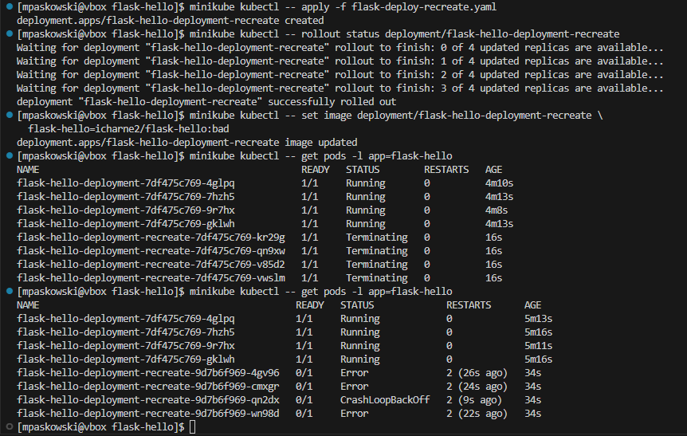

2. `Rolling Update` (z parametrami maxUnavailable > 1, maxSurge > 20%)

```yaml
apiVersion: apps/v1
kind: Deployment
metadata:
  name: flask-hello-deployment-rolling
spec:
  replicas: 4
  strategy:
    type: RollingUpdate
    rollingUpdate:
      maxSurge: 2        # do 2 dodatkowych Podów poza 4
      maxUnavailable: 2  # do 2 starych jednocześnie może być niedostępnych
  selector:
    matchLabels:
      app: flask-hello
  template:
    metadata:
      labels:
        app: flask-hello
    spec:
      containers:
      - name: flask-hello
        image: icharne2/flask-hello:v1
        ports:
        - containerPort: 5000
        imagePullPolicy: Always
```

Następnie wykonałam:

```bash
minikube kubectl -- apply -f flask-deploy-rolling.yaml
minikube kubectl -- rollout status deployment/flask-hello-deployment-rolling

# Aktualizacja na v2
minikube kubectl -- set image deployment/flask-hello-deployment-rolling \
  flask-hello=icharne2/flask-hello:v2
minikube kubectl -- rollout status deployment/flask-hello-deployment-rolling

# Obserwacja: 
minikube kubectl -- get pods -l app=flask-hello-deployment-rolling
```

`RollingUpdate` (maxSurge=2, maxUnavailable=2): pozwala na szybsze przechodzenie między wersjami, tworząc do 2 nowych repliki ponad wymagane 4 i dopuszczając do 2 niegotowych starych. To balansuje szybkość aktualizacji z minimalnym ryzykiem utraty dostępności.

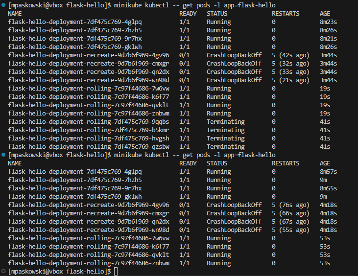

3. `Canary Deployment workload`

Stworzyłam dwa pliki `yaml`:

```yaml
apiVersion: apps/v1
kind: Deployment
metadata:
  name: flask-hello-deployment-main
spec:
  replicas: 3
  selector:
    matchLabels:
      app: flask-hello
      role: main
  template:
    metadata:
      labels:
        app: flask-hello
        role: main
    spec:
      containers:
      - name: flask-hello
        image: icharne2/flask-hello:v1
        ports:
        - containerPort: 5000
```

```yaml
apiVersion: apps/v1
kind: Deployment
metadata:
  name: flask-hello-deployment-canary
spec:
  replicas: 1
  selector:
    matchLabels:
      app: flask-hello
      role: canary
  template:
    metadata:
      labels:
        app: flask-hello
        role: canary
    spec:
      containers:
      - name: flask-hello
        image: icharne2/flask-hello:v2
        ports:
        - containerPort: 5000
```

Następnie wykonałam:

1. Dla `main`:

```bash
#Wdrążenie
minikube kubectl -- apply -f flask-deploy-main.yaml

#Weryfikacja
minikube kubectl -- get deployments
minikube kubectl -- get pods -l app=flask-hello,role=main

#Expose główny Deployment jako Service
minikube kubectl -- expose deployment flask-hello-deployment-main \
  --name=flask-hello-svc-main \
  --port=5000 \
  --target-port=5000

#Weryfikacja
minikube kubectl -- get svc flask-hello-svc-main
```

2. dla `Canary `:

```bash
#Wdrążenie
minikube kubectl -- apply -f flask-deploy-canary.yaml

#Weryfikacja
minikube kubectl -- get deployments
minikube kubectl -- get pods -l app=flask-hello,role=canary

#Expose główny Deployment jako Service
minikube kubectl -- expose deployment flask-hello-deployment-canary \
  --name=flask-hello-svc-canary \
  --port=5000 \
  --target-port=5000

#Weryfikacja
minikube kubectl -- get svc flask-hello-svc-canary
```

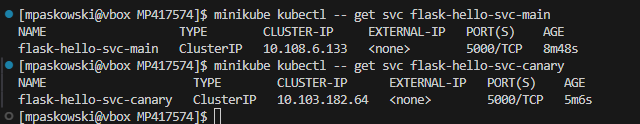

Oraz wykonałam przekierowanie portu:

```bash
# – główny:
minikube kubectl -- port-forward service/flask-hello-svc-main 5081:5000

# – canary:
minikube kubectl -- port-forward service/flask-hello-svc-canary 8090:5000
```


Utworzyłam dwa oddzielne `Deploymenty` z etykietami `role=main` (3 repliki v1) i `role=canary` (1 replika v2), oraz odpowiednie usługi (`flask-hello-svc-main` i `flask-hello-svc-canary`). `Canary` działał na osobnym porcie `8090`, dzięki port-forwardingowi mogliśmy równolegle testować nową wersję (v2) na jednej replice, bez żadnego wpływu na stabilny ruch produkcyjny na porcie `5081` (v1) `main`.

Etykieta `role` pozwoliła precyzyjnie wyodrębnić dwa typy Deploymentów, a dzięki osobnym Service’om mogłam skierować ruch do głównego i canary niezależnie. To rozwiązanie zapewnia bezpieczne testy nowej wersji, a w razie wykrycia problemów – szybki rollback bez przerywania działania produkcji.


Podsumowanie:
| Strategia         | Zasada działania                                                                                                                                      | Ryzyko przerwy w działaniu                          |
| ----------------- | ----------------------------------------------------------------------------------------------------------------------------------------------------- | --------------------------------------------------- |
| **Recreate**      | Usunięcie wszystkich starych Podów przed tworzeniem nowych.                                                                                           | Wysokie – aplikacja nie dostępna podczas wdrożenia. |
| **RollingUpdate** | Domyślnie `maxUnavailable:1`, `maxSurge:1` – stopniowa wymiana pojedynczych Podów. Można dostosować `maxUnavailable` i `maxSurge` na szybszą wymianę. | Niskie – ciągłość zachowana.                        |
| **Canary**        | Równoległe utworzenie małej grupy nowych Podów (np. 1 replika) obok stabilnej głównej floty (np. 3 repliki). Umożliwia testy na części ruchu.         | Minimalne – nowe wersje testowane na małej próbce.  |


#### Wykorzystanie AI do wykonania zadań
