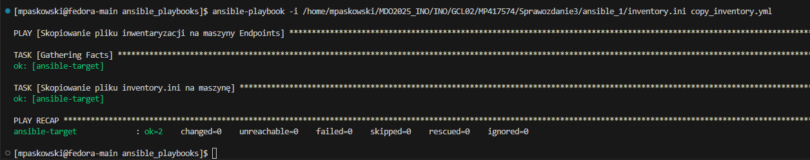

# Sprawozdanie 3
## Meg Paskowski
## Grupa: 2
## Zajecia 8-12
### Automatyzacja i zdalne wykonywanie poleceń za pomocą Ansible (lab 8)

Będziemy potrzebować drugiej maszyny wirtualnej. Dla oszczędności zasobów, musi być jak najmniejsza i jak najlżejsza.

- `fedora-main` – główna maszyna (zarządca / orchestrator)
- `ansible-target` – maszyna docelowa (endpoint)

Utworzenie drugiej maszyny wirtualnej z systemem `Fedora`. Przy najmniejszym zbiorze zainstalowanego oprogramowania.

Zmaiana nazwy hosta.


Ustawienia użytkownika.


Sprawdzenie, czy na maszynie jest `tar` i `sshd`.


Utworzenie mikawki maszyny -> pełne spakowanie maszyny wirtualnej (dysk, konfiguracja) do pliku .ova (standard Open Virtualization Format). Dzięki temu jesteśmy w stanie:
- Skopiować maszynę na inny komputer,
- Udostępnić maszynę komuś innemu,
- Zachować backup na przyszłość.

Wybrałam na pasku `Maszyna` → `Narzędzia` → `Migawki` i następnie `Zrób`


Do wykonania eksportu maszyny `Plik` → `Eksportuj urządzenie wirtualne...`


Na maszynie głównej podbrałam `Ansible`.

```bash
sudo dnf install ansible -y

#Sprawdzenie
ansible --version

```


Następnie, aby zmienić klucze ssh tak, by logowanie `ssh ansible@ansible-target` nie wymagało podania hasła wykonalam następujące kroki:

Skopiowałam kod publiczny z maszyny głównej na `ansible-target`.

```bash
ssh-copy-id ansible@192.168.0.86
```

Edytowalam plik `sudo nano /etc/hosts` dodając `192.168.0.86 ansible-target`, `192.168.0.7 fedora-main` i sprawdziłam połaczenie przez ssh.

```bash
ssh ansible@ansible-target
```


Na głownej maszynie bylo należalo zmienic ustawienie `hostname` oraz dodac do pliku `/etc/hosts` → `192.168.0.7 fedora-main` i `192.168.0.86 ansible-target`.

```bash
sudo hostnamectl set-hostname fedora-main

#Edycja pliku hosts
sudo nano /etc/hosts

```
Naleźy rowniez skopiować klucz `ssh-copy-id mpaskowski@fedora-main` z maszyny głownej.


Na sam koniec zwerifikowałam `ping`.

Z maszyny `fedora-main`:


Z maszyny `ansible-target`:


Następnie utworzylam plik inwentaryzacji.
Plik inventory w Ansible to prosty plik tekstowy, który zawiera informacje o hostach, do których Ansible ma się połączyć i zarządzać nimi. W pliku inventory dodajee maszyny, które będą klasyfikowane w odpowiednich grupach, takich jak `Orchestrators` (maszyna główna) i `Endpoints` (maszyny docelowe) u mnie pod nazwą `TargetMachines`.
Zaczelam od utworzenia katalogu `ansible_1` w ktorym bedzie `inventory.ini` (`nano inventory`).

Zawartość pliku `inventory.ini`:
```
[TargetMachines]
ansible-target ansible_ssh_user=ansible 

[Orchestrators]
fedora-main ansible_ssh_user=mpaskowski 
```

W pliku `/etc/ansible/ansible.cfg ` ustawiłam ścieżkę dla pliku `inventory.ini`:

```bash
[defaults]
inventory = /home/mpaskowski/MDO2025_INO/INO/GCL02/MP417574/Sprawozdanie3/ansible_1/inventory.ini
```

Plik możemy przetestować za pomocą komendy ping.

```bash
ansible -i inventory.ini -m ping TargetMachines

ansible -i inventory.ini -m ping Orchestrators
```


#### Zdalne wywoływanie procedur
Utworzyłam katalog `` w którm znajdować się będą wszytkie playbook'i.

1. Utworzyłam plik `ping_all_machines.yml` → mająct na celu wysłanie żądania ping'u do wszystkich maszyn.
Zawartość pliku:

```yml
---
- name: Pingowanie wszystkich maszyn
  hosts: all        # Odwołanie do wszystkich maszyn z inventory
  tasks:
    - name: Wykonaj ping do wszystkich maszyn
      ansible.builtin.ping:

```

Aby uruchomić:

```bash
nsible-playbook ping_all_machines.yml -i /home/mpaskowski/MDO2025_INO/INO/GCL02/MP417574/Sprawozdanie3/ansible_1/inventory.ini
```


2. Plik `copy_inventory.yml` → który będzie kopiować plik inwentaryzacji na maszyne `Endpoints` (u mnie `TargetMachines`).

```yml
---
- name: Skopiowanie pliku inwentaryzacji na maszyny Endpoints
  hosts: TargetMachines   # Grupa maszyn, do ktrych kopiujemy pliki
  tasks:
    - name: Skopiowanie pliku inventory.ini na maszynę
      copy:
        src: /home/mpaskowski/MDO2025_INO/INO/GCL02/MP417574/Sprawozdanie3/ansible_1/inventory.ini  # Ścieżka do pliku lokalnego
        dest: /home/ansible/ # Ścieżka docelowa na maszynach z grupy Endpoints
        mode: '0644'  #Uprawnienia
```

Aby uruchomić:

```bash
ansible-playbook -i /home/mpaskowski/MDO2025_INO/INO/GCL02/MP417574/Sprawozdanie3/ansible_1/inventory.ini copy_inventory.yml
```


Po ponownym uruchomieniu:



3. Plik `upadte.yml` → dokonuje aktualizacji pakietów w systemie.
Zawartość pliku `upadte.yml`:

```yml
---
- name: Zaktualizuj pakiety w systemie
  hosts: all
  become: yes  # Wymaga podniesienia uprawnień do roota
  tasks:
    - name: Zaktualizuj wszystkie pakiety
      ansible.builtin.dnf:
        name: '*'
        state: latest

```

Aby uruchomić:

```bash
ansible-playbook -i /home/mpaskowski/MDO2025_INO/INO/GCL02/MP417574/Sprawozdanie3/ansible_1/inventory.ini update.yml --ask-become-pass
```


4. Plik `restart_services.yml` → restartuje usługi `ssh` i `rngd`.

Zawartość pliku ` restart_services.yml`:

```yml
---
- name: Zrestartuj usługi sshd i rngd
  hosts: all
  become: yes 
  tasks:
    - name: Zrestartuj usługę sshd
      ansible.builtin.systemd:
        name: sshd
        state: restarted

    - name: Zrestartuj usługę rngd
      ansible.builtin.systemd:
        name: rngd
        state: restarted

```

Aby uruchomić:

```bash
ansible-playbook -i /home/mpaskowski/MDO2025_INO/INO/GCL02/MP417574/Sprawozdanie3/ansible_1/inventory.ini restart_services.yml --ask-become-pass
```


Wszytkie te polecenia mogą zostać uwgzlędnione w jednym pliku → `all_tasks.yml`.

```bash
ansible-playbook -i /home/mpaskowski/MDO2025_INO/INO/GCL02/MP417574/Sprawozdanie3/ansible_1/inventory.ini all_tasks.yml --ask-become-pass
```


5. Przeprowadziłam operacje względem maszyny z wyłączonym serwerem SSH, odpiętą kartą sieciową.

Wyłączenie serwera SSH i odłączenie karty sieciowej ma na celu zasymulowanie sytuacji, w której maszyna jest "nieosiągalna" zdalnie. Jest to użyteczne w kontekście testowania scenariuszy awarii lub konfiguracji systemu, które wymagają interakcji z maszyną, która nie jest dostępna w normalny sposób.

Kroki które wyonaam przed uruchomieniem poprzednich zadań (na maszynie docelowej - `asimble-target`):

```bash
#Odlaczenie serwera SSH
sudo systemctl stop sshd

#Wylaczenie karty sieciowej
sudo ifconfig eth0 down
```

Następnie uruchomiam wcześniej przeprowadzone zadania.


Podczas wykonywania playbooka Ansible napotkano problem z połączeniem do maszyny ansible-target. Przyczyną błędu było wyłączenie serwera SSH na tej maszynie oraz odłączenie interfejsu sieciowego, co uniemożliwiło nawiązanie połączenia zdalnego. Aby rozwiązać ten problem, przywrócono serwis SSH do działania oraz ponownie aktywowano interfejs sieciowy, co pozwoliło na poprawne wykonanie kolejnych operacji.

#### Zarządzanie stworzonym artefaktem
Moim artefaktem w projekcie z poprzednich zajęć by kontener.

Zbudowałam playbooka Ansible, który:
1. Buduje i uruchomia kontener sekcji `Deploy` z poprzednich zajęć.
2. Pobiera z `Docker Hub` aplikację w ramach kroku `Publish`
3. Weryfikuje łączność z kontenerem
4. Zatrzymuje i usuwa kontener

Plik `project.yml`:
```yml
---
- name: Zbudowanie, uruchomienie, weryfikacja i usunięcie kontenera
  hosts: all
  become: yes
  vars_files:
    - /home/mpaskowski/MDO2025_INO/INO/GCL02/MP417574/Sprawozdanie3/ansible_playbooks/vars.yml
  tasks:

    # Krok 1: Zalogowanie do Docker Hub
    - name: Zaloguj się do Docker Hub
      docker_login:
        registry: "docker.io"
        username: "icharne2"
        password: "{{ docker_password }}"  # Przechowuj hasło w zmiennej

    # Krok 2: Pobierz obraz z Docker Hub
    - name: Pobierz obraz z Docker Hub
      docker_image:
        name: "icharne2/cjson-deploy"
        source: pull

    # Krok 3: Zbudowanie i uruchomienie kontenera
    - name: Zbuduj kontener Docker z aplikacją
      docker_container:
        name: "cjson-deploy"
        image: "icharne2/cjson-deploy"
        state: started
        restart_policy: no  # Zapobiegamy automatycznemu restartowi kontenera
        command: "sh -c './example && sleep 9999'"  # Uruchamiamy aplikację 'example' i zatrzymujemy kontener na kilka godzin

    # Krok 4: Weryfikacja, czy aplikacja działa
    - name: Sprawdzenie, czy aplikacja działa
      command: "docker exec cjson-deploy /bin/bash -c './example'"
      register: result
      failed_when: result.rc != 0  # Jeśli aplikacja zakończy się błędem, playbook się nie powiedzie

    # Krok 5: Zatrzymanie kontenera
    - name: Zatrzymanie kontenera cjson-deploy
      docker_container:
        name: "cjson-deploy"
        state: stopped

    # Krok 6: Usunięcie kontenera
    - name: Usunięcie kontenera cjson-deploy
      docker_container:
        name: "cjson-deploy"
        state: absent
```

Uruchomienie:

```bash
ansible-playbook project.yml -i /home/mpaskowski/MDO2025_INO/INO/GCL02/MP417574/Sprawozdanie3/ansible_1/inventory.ini --ask-become-pass
```


W sprawozdaniu przedstawiono sposób wykorzystania Ansible do zdalnego zarządzania systemami operacyjnymi. Wykonane działania obejmowały przygotowanie środowiska, konfigurację dostępu między maszynami, stworzenie pliku inwentaryzacji oraz realizację wybranych operacji administracyjnych za pomocą playbooków.

Zadanie pokazało, że Ansible pozwala na centralne sterowanie wieloma systemami jednocześnie, bez konieczności ręcznego logowania się na każdą maszynę. Dzięki temu możliwe było wykonanie operacji takich jak aktualizacja pakietów, kopiowanie plików czy zarządzanie kontenerami. 

### 


