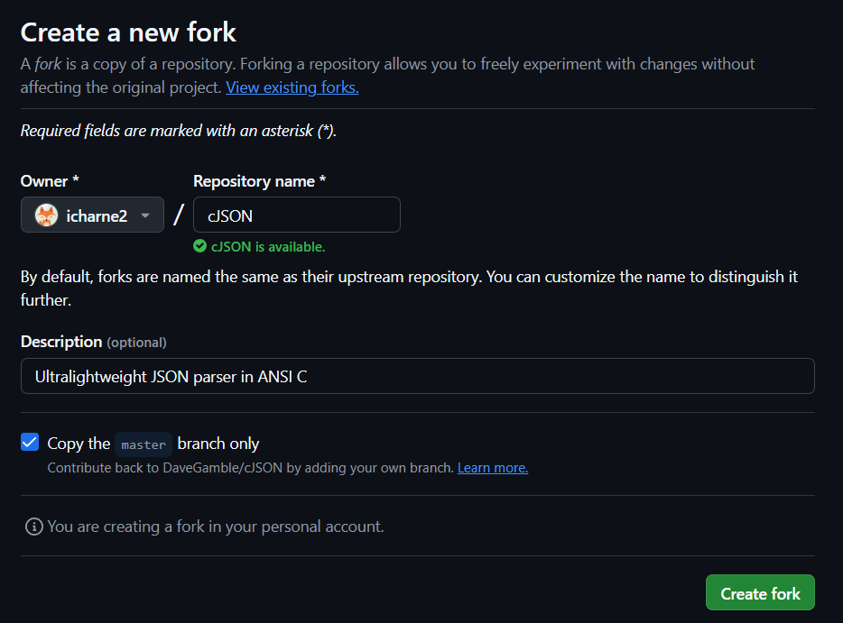
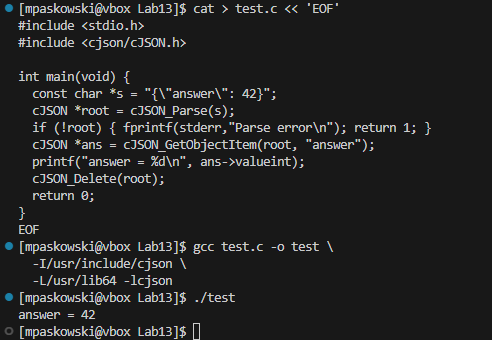

# Sprawozdanie 4
## Meg Paskowski
## Grupa: 2
## Zajecia 13
### Shift-left: GitHub Actions

Na sam początek sklonowałam repozytorium 
[cJSON](https://github.com/DaveGamble/cJSON) na swój profil github. 




Sklonowałam też je lokalnie:

```bash
git clone https://github.com/icharne2/cJSON.git
cd cJSON
```

Utworzyłam galąź `ino_dev`:

```bash
git checkout -b ino_dev
```


Oraz usunełam istniejące wcześniej workflowy:

```bash
rm -rf .github/workflows/*

git add .github/workflows
git commit -m "Remove default workflows"
```


Stworzyłam nowy workflow: `.github/workflows/build.yml` po wczesniejszym skopiowaniu dockerfile z poprzednich zajęć do katalogu `docker`.


```bash
name: Build, package and test cJSON

on:
  push:
    branches: [ "ino_dev" ]
  pull_request:
    branches: [ "ino_dev" ]
  workflow_dispatch:

jobs:
  build-and-test:
    runs-on: ubuntu-latest

    steps:
      # checkout
      - name: Checkout repo
        uses: actions/checkout@v3

      # builduje obraz, który w /tmp/install tworzy RPM i w CMD kopiuje je do /out
      - name: Build RPM image
        run: |
          docker build \
            -f docker/Dockerfile.build1 \
            -t cjson-builder-image \
            docker/

      # urucha builder z volume, aby CMD skopiowało RPM do artifacts
      - name: Extract RPM artifact
        run: |
          mkdir -p artifacts
          docker run --rm \
            -v $PWD/artifacts:/out \
            cjson-builder-image

      # upload RPM
      - name: Upload RPM
        uses: actions/upload-artifact@v4
        with:
          name: cjson-rpm
          path: artifacts/*.rpm

      # buduje i odpala kontener deployowy – ma skopiować RPM, skompilować example i je odpalić
      - name: Build deploy image
        run: |
          docker build \
            -f docker/Dockerfile.deploy \
            -t cjson-deploy-image \
            docker/

      - name: Run example in deploy container
        run: |
          docker run --rm cjson-deploy-image

      # buduje i uruchamia testy przez Dockerfile.test
      - name: Build test image
        run: |
          docker build \
            -f docker/Dockerfile.test \
            -t cjson-test-image \
            docker/

      - name: Run tests
        run: |
          docker run --rm cjson-test-image

```
Plik [build.yml](https://github.com/icharne2/cJSON/blob/ino_dev/.github/workflows/build.yml), który:
- `trigger:` push / pull_request / ręczne uruchomienie na gałęzi `ino_dev`
- buduje RPM w kontenerze na podstawie `docker/Dockerfile.build1`
- wyciąga gotowy pakiet przy pomocy docker run -v …:/out (korzystając z CMls /mntD z Dockerfile.build1)
- uploaduje go jako artifact
- buduje i uruchamia kontener deployowy (Dockerfile.deploy)
- buduje i uruchamia kontener testowy (`Dockerfile.test`)

Commit i push:

```bash
git add .github/workflows/build.yml 
git commit -m "Shift-left: full Docker-based build, RPM packaging, deploy & tests"  
git push origin ino_dev
```


#### Sprawdzenie dzialania

Do wczesniej utworzonego folderu wspoldzielonego dodałam podbrany plik `rpm` nastepnie zainstalowałam go na Fedorze.


Utworzyłam prosty plik testowy:

```bash
cat > test.c << 'EOF'
#include <stdio.h>
#include <cjson/cJSON.h>

int main(void) {
  const char *s = "{\"answer\": 42}";
  cJSON *root = cJSON_Parse(s);
  if (!root) { fprintf(stderr,"Parse error\n"); return 1; }
  cJSON *ans = cJSON_GetObjectItem(root, "answer");
  printf("answer = %d\n", ans->valueint);
  cJSON_Delete(root);
  return 0;
}
EOF
```

Oraz skompilowałam z użyciem zainstalowanej biblioteki:

```bash
gcc test.c -o test \
  -I/usr/include/cjson \
  -L/usr/lib64 -lcjson
```

Na sam koniec uruchomiłam:

```bash
./test
```

Rezulatat:




#### Podsumowanie
**GitHub Actions** to wbudowany w GitHub mechanizm automatyzacji procesów CI/CD, który pozwala na zaplanowanie, uruchamianie i monitorowanie kolejnych kroków budowania, testowania i publikowania oprogramowania bez opuszczania platformy. Workflow definiuje się w plikach YAML umieszczonych w repozytorium, co gwarantuje wersjonowanie i pełną przejrzystość procesu. Dzięki triggerom („push”, „pull_request”, „workflow_dispatch”) każde wprowadzenie zmiany natychmiast uruchamia ustalone etapy: pobranie kodu, kompilację w określonym środowisku (np. w kontenerze Fedora), wykonanie testów, a na koniec utworzenie i zapisanie artefaktów (np. paczek RPM).

Proces jest w pełni powtarzalny, ponieważ runner (lub kontener Docker) zapewnia zawsze taki sam stos narzędzi i bibliotek. W efekcie błędy kompilacji czy testów są wykrywane na etapie `pre-merge`, co znacznie zmniejsza ryzyko pojawienia się awarii w dalszych fazach rozwoju lub na produkcji. Automatyczne publikowanie artefaktów ułatwia późniejsze dystrybuowanie i instalowanie gotowych bibliotek bez konieczności manualnego transferu plików. Dodatkowo bogate repozytorium gotowych akcji (lintery, skanery bezpieczeństwa, deployment) pozwala w prosty sposób rozbudować pipeline o kolejne kontrole jakości i zabezpieczenia, zgodnie z ideą „przesunięcia w lewo” (`shift-left`) kluczowych weryfikacji.

**shift-left** -> Praktyka przesuwania kluczowych weryfikacji (kompilacja, testy, analiza bezpieczeństwa) jak najbliżej początku cyklu rozwoju oprogramowania, aby błędy wykrywać wcześniej, obniżyć koszty naprawy i zwiększyć stabilność projektu.