# Sprawozdanie 1 
## Lab 1 - Wprowadzenie, Git, Gałęzie, SSH
### 1. Instalacja klijenta Git i obsługa kluczy SSH
Po intsalacji systemu Fedora i konfiguracji, sprawdziłam adres IP mojego serwera i wykorzystując Visual Studio Code, połączyłam się przez SSH, zainstalowałam git:
```bash
sudo dnf install git
```
Sprawdziłam poprawność instalacji:
```bash
git --version
```
### 2. Utworzenie dwóch kluczy SSH
Pierwszy klucz generuje bez zabezpieczenia:
```bash
ssh-keygen -t ecdsa -b 521 -C "p.szlachta20@gmail.com"
```
W drugim wpisuje hasło:
```bash
ssh-keygen -t ed25519 -C "p.szlachta20@gmail.com"
```
### 3. Konfiguracja kluczy SSH jako metodę dostępu do GitHuba:
Dodałam je do Github (Settings -> SSH and GPG keeys -> new SSH key)
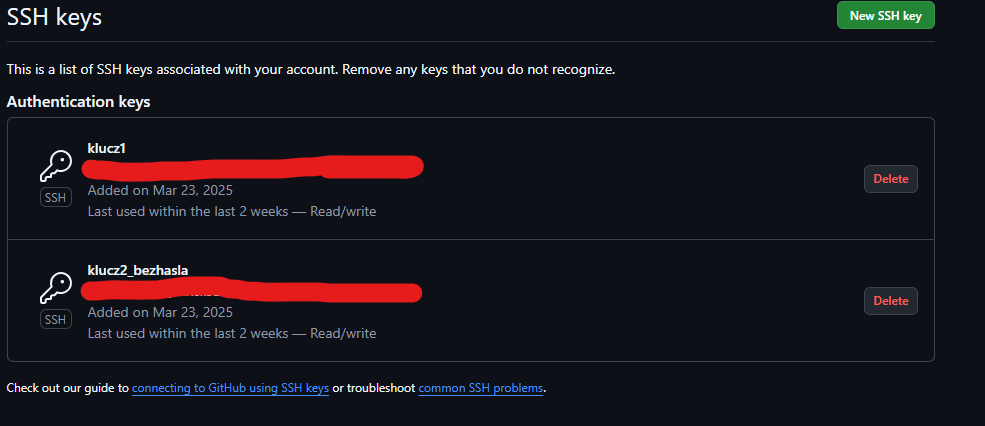

### 4. Klonowanie repozytorium
Poleceniem:
```bash
git clone git@github.com:InzynieriaOprogramowaniaAGH/MDO2025_INO.git
```
### 5. Przełącz się na gałąź main, a potem na gałąź swojej grupy (pilnuj gałęzi i katalogu!):
Przełaczam się na gałąź main:
```bash
git checkout mian
```
### 6. Utwórz gałąź o nazwie "inicjały & nr indeksu" 
Poleceniem:
```bash
git checckout -b PS417478
```
### 7. W katalogu właściwym dla grupy utwórz nowy katalog, także o nazwie "inicjały & nr indeksu"
W moim przypadku moja ścieżka wygląda następująco: pszlachta@localhost:~/MDO2025_INO/INO/GCL02
W tym folderze tworzę swój katalog poleceniem:
```bash
mkdir PS417478
```
### 8. Napisz Git hooka - skrypt weryfikujący, że każdy Twój "commit message" zaczyna się od "twoje inicjały & nr indexu".
Tworzę folder Sprawozdanie1, a w nim plik `commit-msg` który wygląda następująco:
```bash
#!/bin/bash
COMMIT_MSG_FILE=$1
COMMIT_MSG=$(head -n 1 "$COMMIT_MSG_FILE")

if [[ ! "$COMMIT_MSG" =~ ^PS417478 ]]; then
    echo "❌ Błąd: Commit message musi zaczynać się od 'PS417478'"
    exit 1
fi
exit 0
```
Dodaje uprawnienia do uruchamiania:
```bash
chmod +x .git/hooks/commit-msg
```
### 9. Wysyłanie zmian do repozytorium:
Przełączenie się na moją gałąź:
```bash
git checkout PS417478
```
Dodanie plików do repozytorium:
```bash
git add .
```
Utworzenie commita:
```bash
git commit -m "PS417478: Dodanie zmian"
```
Wypchanie zmian:
```bash
git push origin PS417478
```
(Niestety ćwiczenie 1 nie zawiera screenów z terminala ze względu na to, że zapomniałam je zrobić)


---
## Lab 2 - Git, Docker
### 1. Instalacja Dockera 
```bash
sudo dnf install -y dnf-plugins-core
sudo dnf install -y docker
sudo systemctl start docker
sudo systemctl enable docker
```
Sprawdzenie instalacji:
```bash
docker --version
```
### 2. Rejestracja w Docker i logowanie 
Po zarejestrowaniu się na stronie Docker Hub zalogowałam się na fedorze:
```bash
docker login
```
### 3. Pobranie obrazów hello-world, busybox, fedora, mysql
Poleceniami:
```bash
sudo docker pull hello-world
sudo docker pull busybox
sudo docker pull fedora
sudo docker pull mysql
```
Sprawdzenie:
```bash
sudo docker images
```
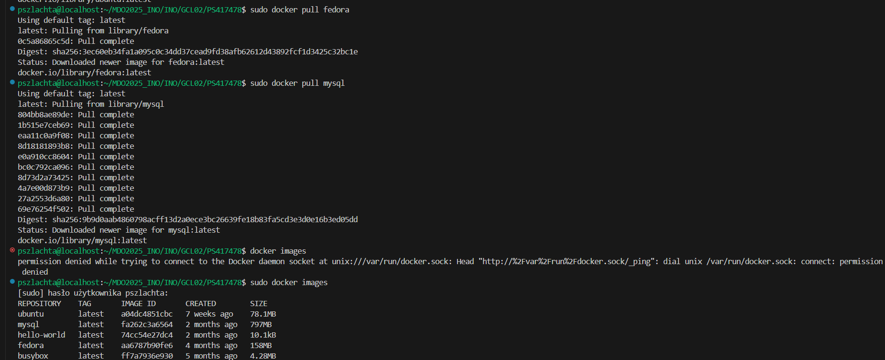

### 4. Uruchomienie kontenerów
```bash
sudo docker run -it busybox sh
```
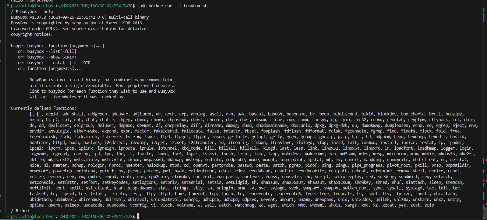
Wyjście `exit`

Poleceniem sprawdzam że istnieje:
```bash
sudo docker ps -a
```
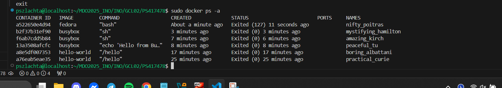

### 5. Tworzenie własnego Dockerfile
Poleceniem:
```bash
nano Dockerfile
```
Mój dockerfile wygląda następująco:
```bash
FROM fedora:latest

RUN dnf update -y && dnf install -y git && dnf clean all

WORKDIR /app
RUN git clone https://github.com/InzynieriaOprogramowaniaAGH/MDO2025_INO.git

CMD ["/bin/bash"]
```
Buduje obraz:
```bash
sudo docker built -t my-fedora-image .
```
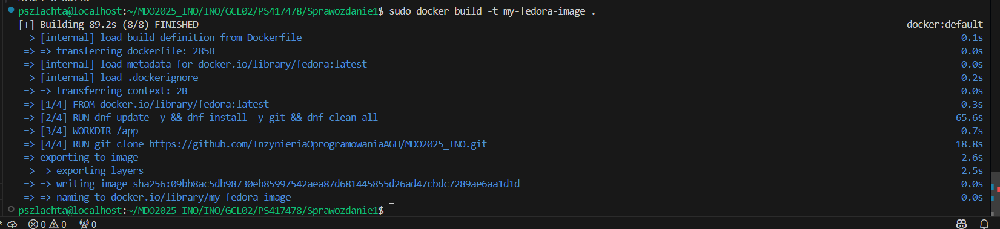

Nastepnie poleceniami jak wyżej sprawdzam liste kontenerów, zatrzymuje je i usuwam:
```bash
sudo docker ps -a
sudo docker image prune -a -f
```
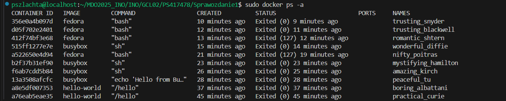
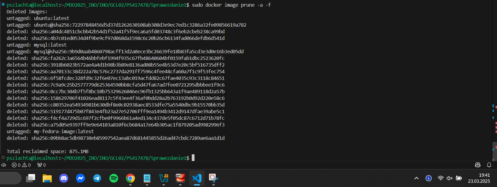

### 6. Dodanie utworzonych plików:
```bash
git add .
git commit -m "PS417478: docker"
git push origin PS417478
```

--- 
## Lab 3 - Dockerfiles, kontener jako definicja etapu
### 1. Wybór oprogramowania
Oprogramowanie cJSON [link](https://github.com/DaveGamble/cJSON):
dysponuje otwartą licencją, ma Makefile, make, make test.

### 2. Instalacja, budowanie i testowanie
Poleceniami:
```bash
git clone https://github.com/DaveGamble/cJSON.git
```
w folderze cJSON, stworzyłam folder `build`, a w środku niego:
```bash
cmake ..
```
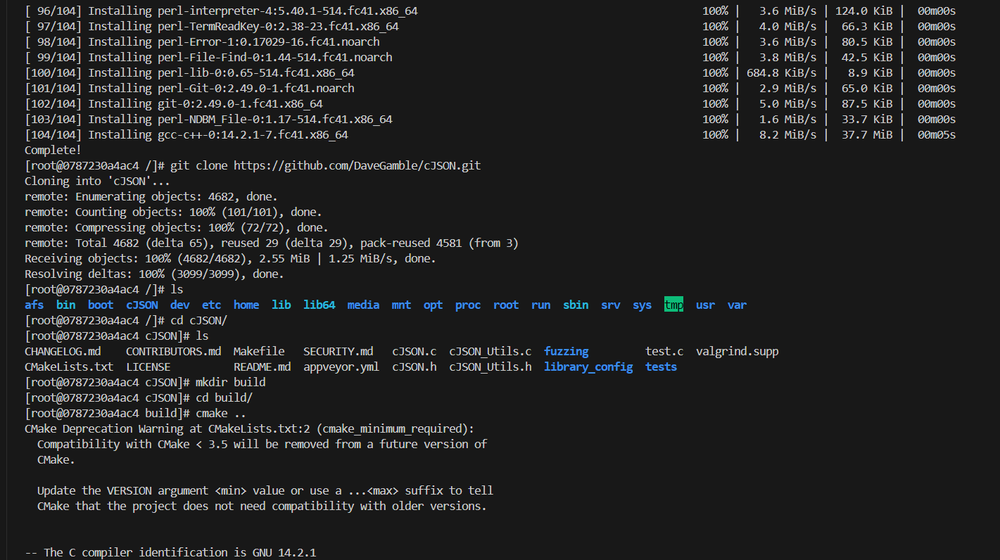
Następnie po kolei zbudowałam i testowałam:
```bash
make
ctests
exit
```
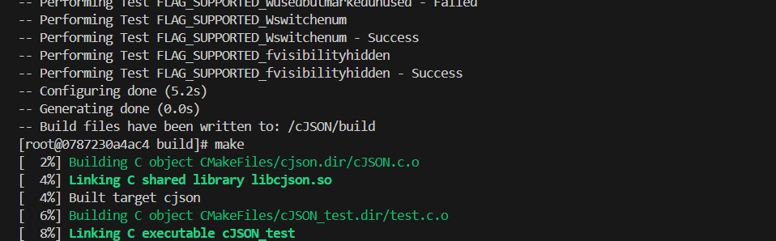
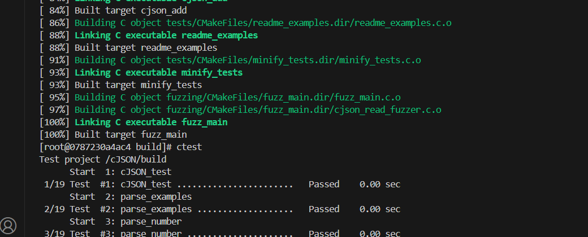
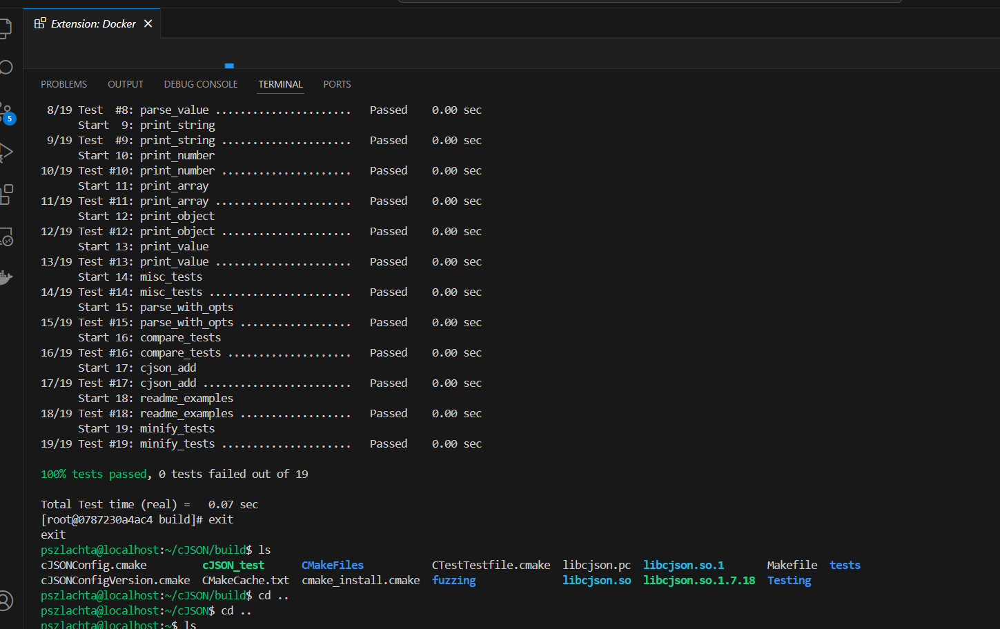

### 3. Dockerfile.build i Dockerfile.test
Tworze plik o nazwie `Dockerfile.build`, który wygląda następująco:
```bash
FROM fedora:latest

RUN dnf update -y && dnf install -y git cmake gcc gcc-c++ make

WORKDIR /app
RUN git clone https://github.com/DaveGamble/cJSON.git .
RUN mkdir build && cd build && cmake .. && make
```

Tworze plik o nazwie `Dockerfile.test`, który wygląda następująco:
```bash
FROM cjson-build

WORKDIR /app/build
CMD ["ctest"]
```

buduje obrazy i uruchamiam testy odpowiednio po kolei:
```bash
docker build -t cjson-build -f Dockerfile.build .
docker build -t cjson-test -f Dockerfile.test .
docker run -it cjson-test
```
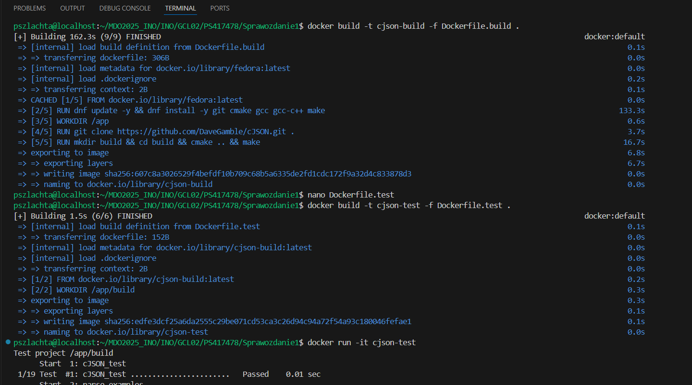
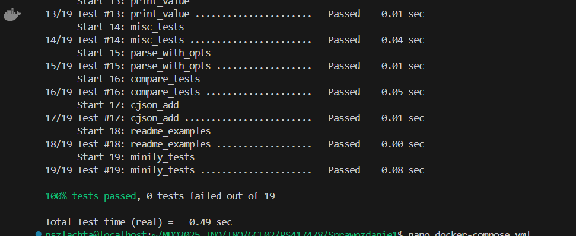

### 4. Docker Compose
Połączone polecenia, dzieki którym nie potrzebuje uruchamiać każdego konterera ręcznie.

Tworze plik o nazwie `docker-compose.yml`, który wygląda następująco:
```bash
version: '3'
services:
  build:
    build:
      context: .
      dockerfile: Dockerfile.build
  test:
    build:
      context: .
      dockerfile: Dockerfile.test
    depends_on:
      - build
```
Następnie zbudowałam:
```bash 
docker-compose up --build
```
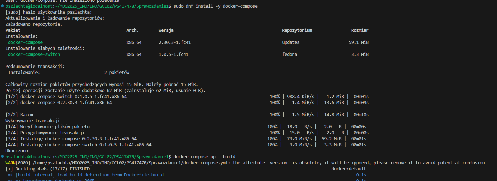
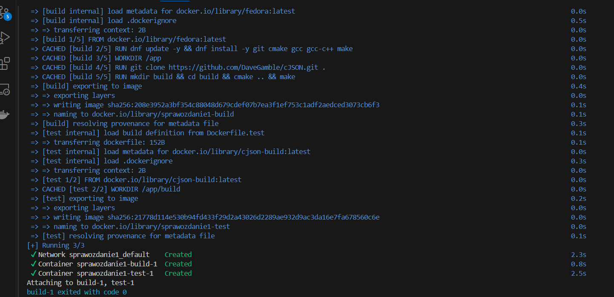
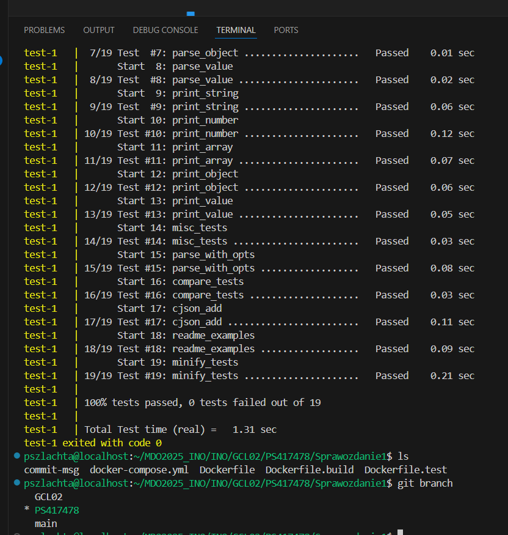

### 5. Dodanie utworzonych plików:
```bash
git add .
git commit -m "PS417478: dockerfile"
git push origin PS417478
```
### 6. Dyskusja
Program nie nadaje się do publikowania jako kontener, ponieważ głównym celem jest kompilacja i testowanie, a nie dystrybucja jako kontener.
W procesie budowania generowane są np. biblioteki oraz pliki nagłówkowe. Gotowe artefakty mogą być zapakowane w np. .tar.gz.
Jeśli kontener jest przeznaczony do publikacji, należy go oczyścić aby zostały jedynie pliki wynikowe (biblioteki czy nagłowki).
Najlepiej jakby deploy-and-publish miał osobny plik dockerfile do gotowych artefaktów.
Formaty JAR/DEB/RPM są przydatne do pakowania bibliotek w linuxie.
Można użyć osobnego kontenera do pakowania artefaktów. Fpm może pomóc w automatycznym generowaniu pakietów .deb i .rpm., w które warto pakowac program.

--- 
## Lab 4 - Dodatkowa terminologia w konteneryzacji, instancja Jenkins

### 1. Zachowywanie stanu
Tworzenie woluminów:
```bash
docker volume create v_in
docker volume create v_out
```
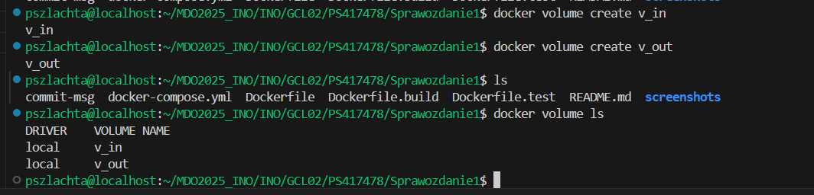

Uruchomienie kontenera (opcja `-v` umożliwia ustawić gdzie dane woluminu będą się znajdować):
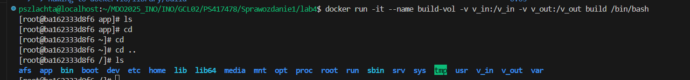

Klonowanie repozytorium na wolumin z hosta:
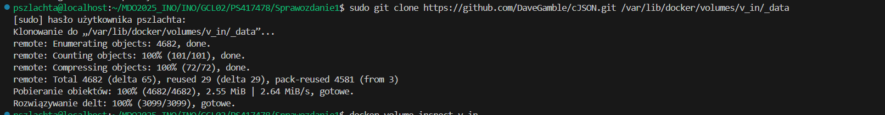
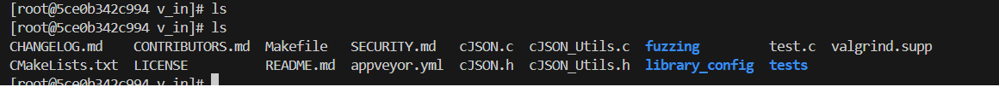

Budowanie wewnatrz kontenera:
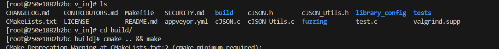
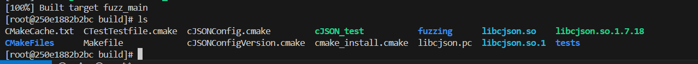

Na wolumin wyjściowy przesłałam utworzony plik cJSON_test poleceniem `cp cJSON_test /mnt/v_out`
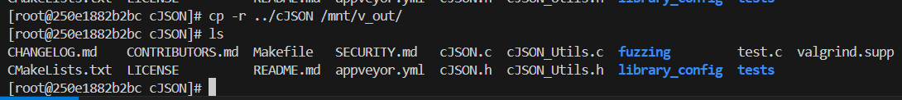
Następnie zrobiłam klonowanie w kontenerze i od razu skopiowałam folder pobranego repozytorium na wolumin wyjściowy:
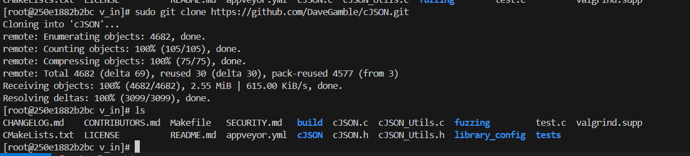

Sprawdzenie poprawności przeniesienia folderów:
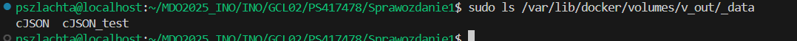

### 2. Eksponowanie portu
Utworzyłam i Uruchomiłam kontener z serwerem iperf3-server. 
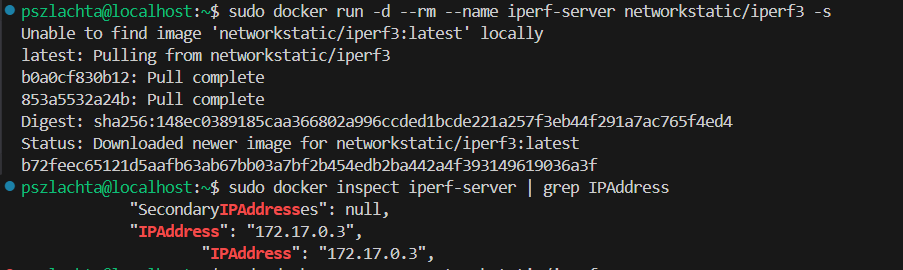
Sprawdziłam adres IP kontenera i uruchomiłam kolejny raz - podając ten adres.
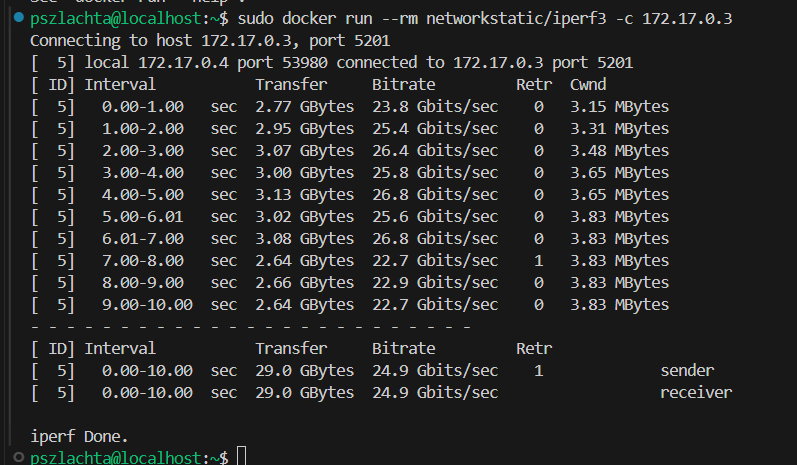

Utworzyłam sieć mostkowaną (brak konieczności korzystania z adresów IP) poleceniem:
```bash
sudo docker network create iperf-net-test
```
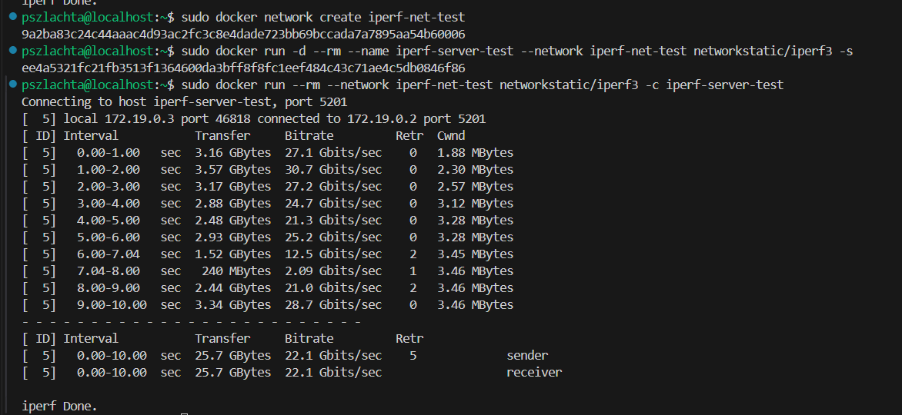

Połączenie do serwera spoza hosta:
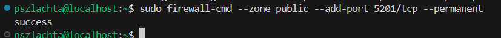

### 3. Instancja Jenkins
Poleceniem tworze siec i kontener jenkins:
```bash
sudo docker network create jenkins
```
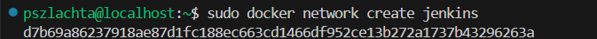
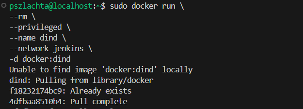
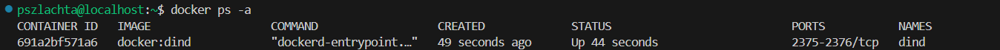
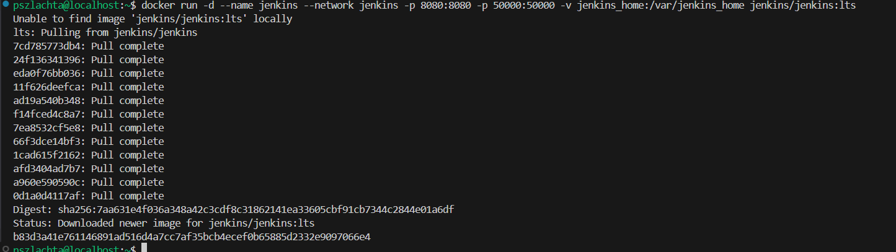

Po wpisaniu adresu hosta w przeglądarkę trafiam na stronę:
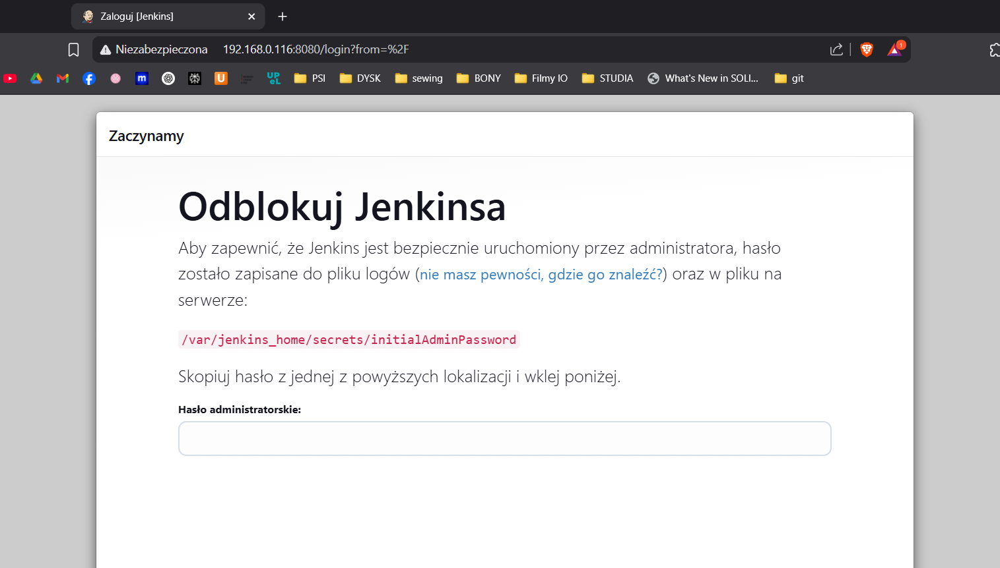

Po wprowadzeniu wymaganego hasła z plików przeszłam instalację i tworzenie konta Jenkins instalując odpowiednie wtyczki:
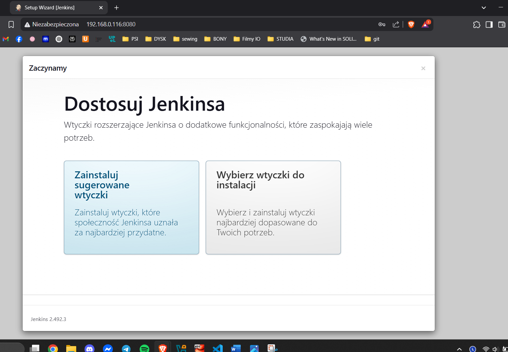