# Sprawozdanie 2 
## Lab 5-7
### 1.  Instalacja Jenkins
Utworzyłam plik dockerfile.jenkins:
Wtyczki: Docker-workflow – integracja Dockera z potokami Jenkinsa. Blueocean – interfejs użytkownika dla Jenkinsa. Pipeline-utility-steps – dodatkowe funkcje dla potoków. Aby umożliwić Jenkinsowi komunikację z Dockerem, w kontenerze zainstalowałam narzędzia Docker CLI. Ze względów bezpieczeństwa po instalacji narzędzi zmieniłam użytkownika z root na jenkins.
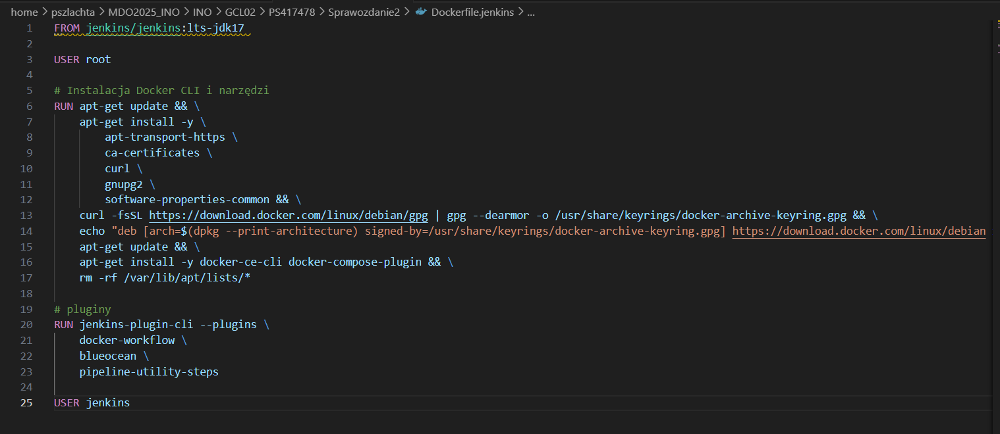
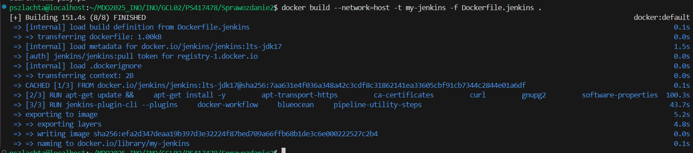


Utworzyłam sieć mostkowana jenkins-net
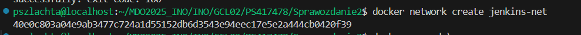


Następnie pobrałam i uruchomiłam kontenery docker dind i jenkinsa i sprawdziłam działające kontenery:
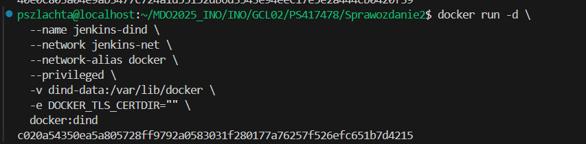
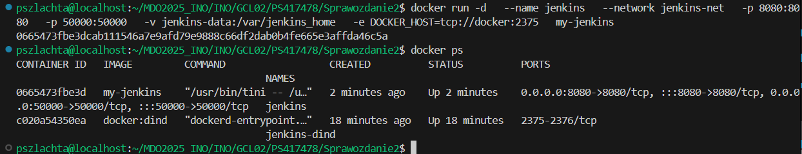
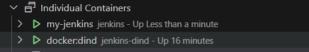

Po wejsciu na stroję Jenkinsa za pomocą IP: `http://192.168.116.7:8080/`. Uzyskałam hasło, które wprowadziłam na stronie poleceniem:
```bash
docker exec jenkins cat /var/jenkins_home/secrets/initialAdminPassword
```
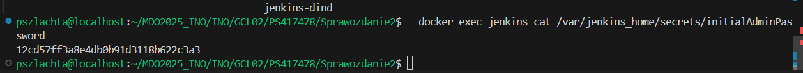
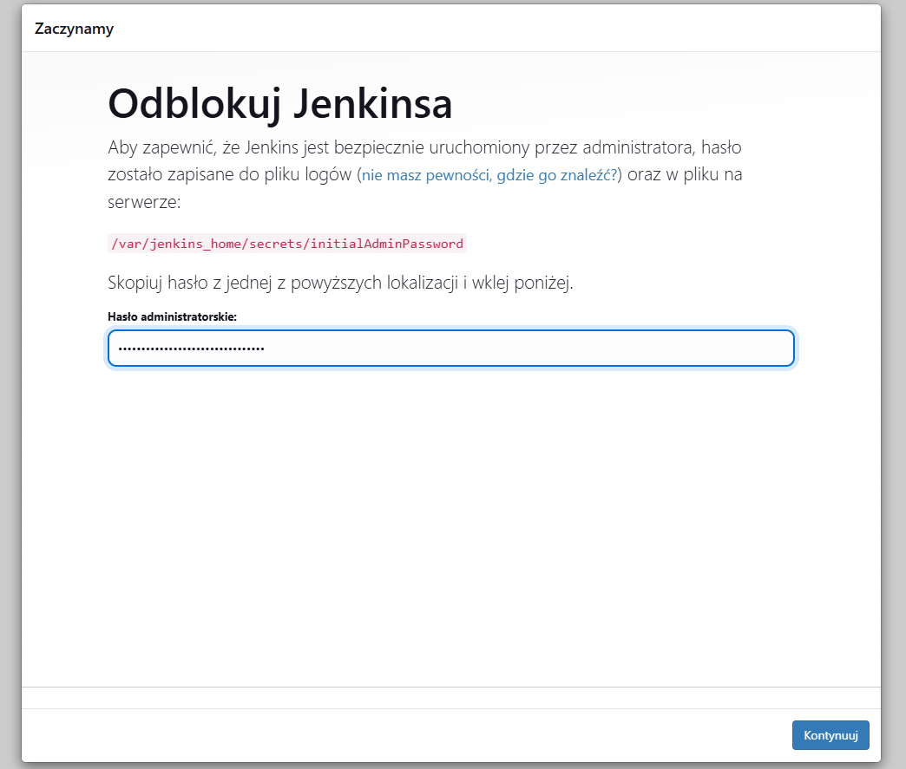


Następnie prześledziłam wszytskie kroki logowania i instalacji:
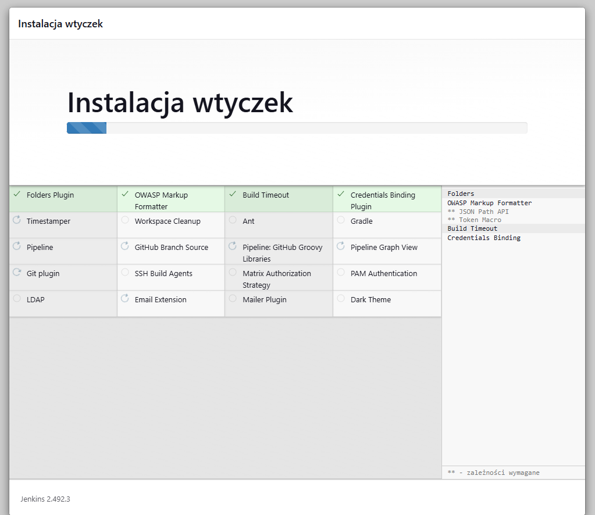
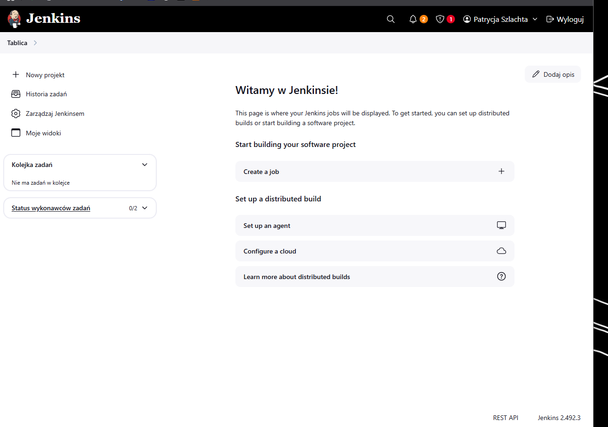


Utworzyłam nowy projekt (ogólny projekt) i w `kroki budowania` -> `Uruchom powłokę` zwróciłam informacje o systemie operacyjnym poleceniem `uname -a`:
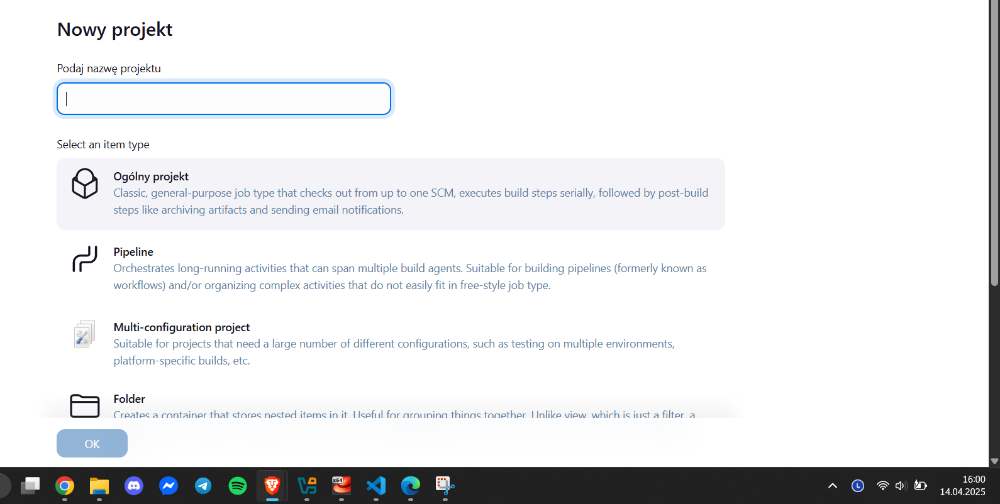
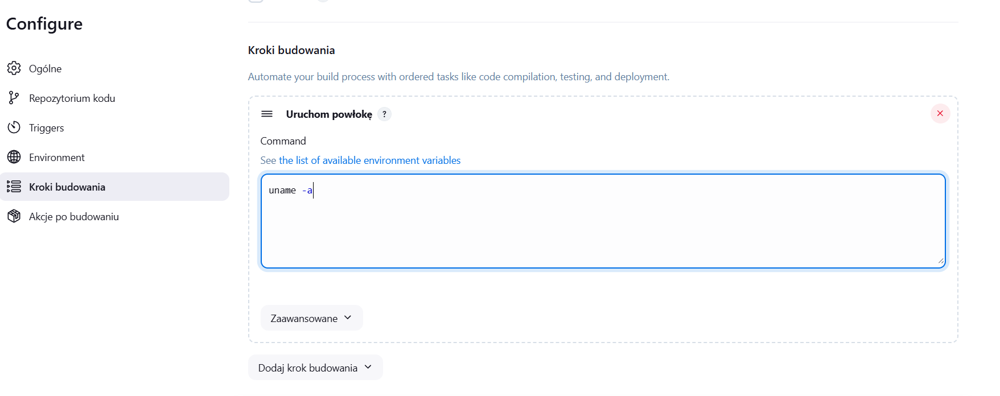


Po uruchomieniu i poprawnym wykonaniu się zadania logi z konsoli:
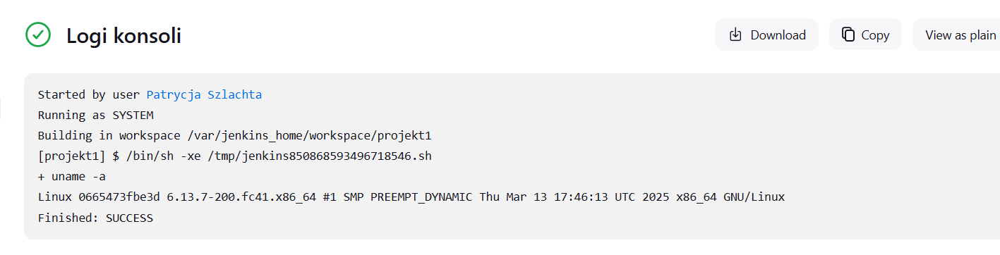


Następnie utworzyłam nowy projekt `projekt2` poprzez wyranie opcji `pipeline` i wprowadziłam kod, który wyrzuca błąd, kiedy godzina jest nieparzysta:
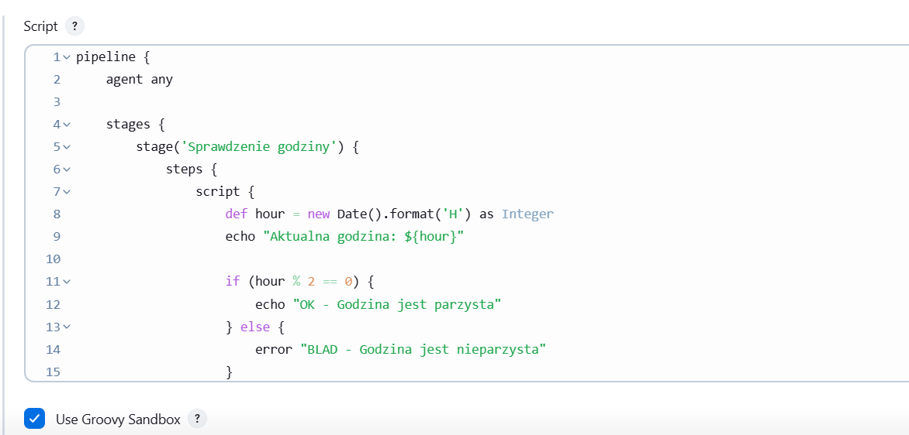
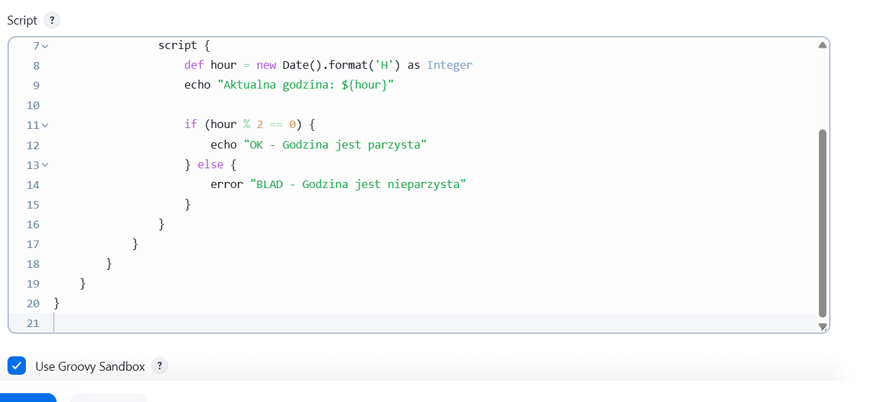
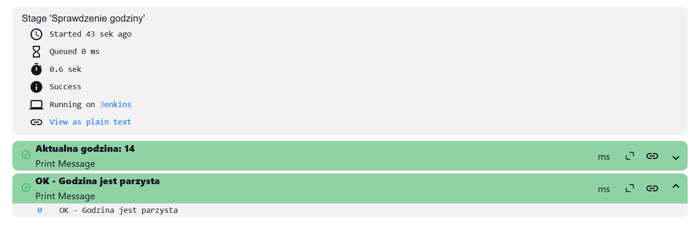
logi:
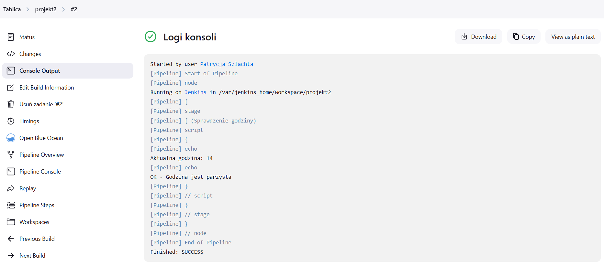


Następnie utworzyłam nowy projekt 3 poprzez wyranie opcji `pipeline` i wprowadziłam kod, który pobiera w projekcie obraz kontenera ubuntu (stosując docker pull):
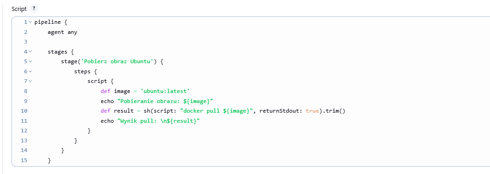
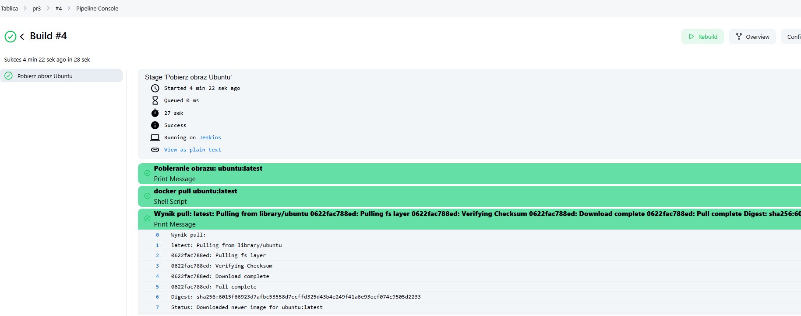
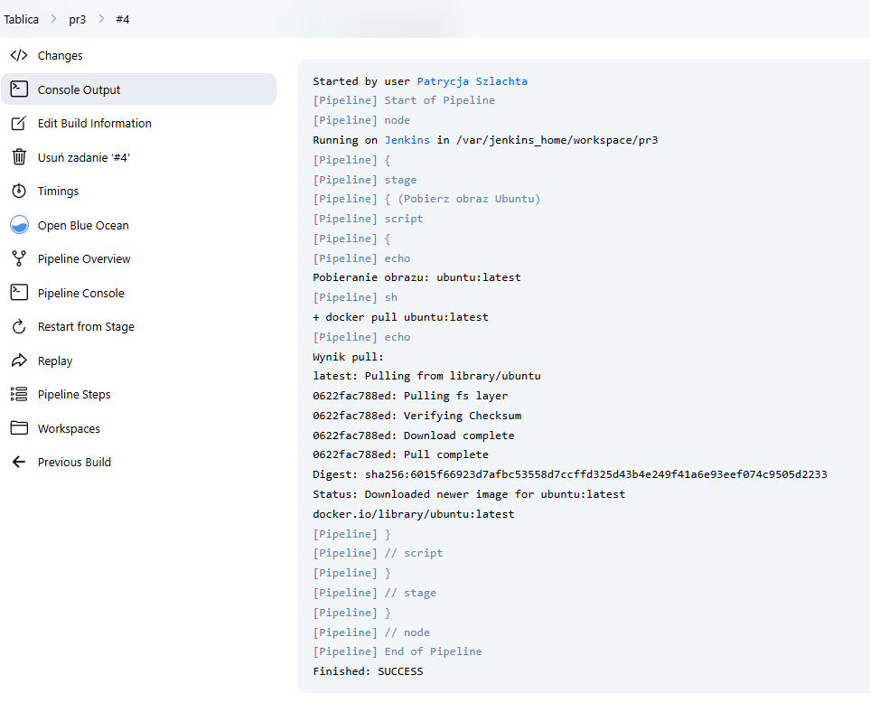
Całe logi z projektu 3 znajdują się w pliku [logi3](screenshots2/logi3.txt)


Kolejnym krokiem było utworzenie projektu `projekt4` znowu poprzez wybranie `pipeline`. 
Kod zawiera:
1) Klon repozytorium MDO2025_INO i wykonuje checkout na mój branch `PS417478`,
2) Budowanie obrazu dockera `Dockerfile.build`,
3) Budowanie obrazu testowego `Dockerfile.test`,
4) Uruchomienie testów
5) publikacja logów z testów

Pliki Dockerfile, skopiowałam z poprzednich zajęc, natomiast poleceniem `fingerprint` pozwalam Jenkinsowi śledzić między różnymi etapami, przepływ danego pliku.
```bash
pipeline {
    agent any

    stages {
        stage('Klonowanie repozytorium') { 
            steps {
                git branch: 'PS417478', url: 'https://github.com/InzynieriaOprogramowaniaAGH/MDO2025_INO.git'
            }
        }

        stage('Budowanie obrazu buildera') {
            steps {
                dir ("INO/GCL02/PS417478/Sprawozdanie2")
                {
                    script {
                        docker.build('cjson-builder-image', '-f Dockerfile.build .')
                    }
                }
            }
        }

        stage('Budowanie obrazu testowego') {
            steps {
                dir ("INO/GCL02/PS417478/Sprawozdanie2")
                {
                    script {
                        docker.build('cjson-test-image', '-f Dockerfile.test .')
                    }
                }
            }
        }

        stage('Testy') {
            steps {
                dir ("INO/GCL02/PS417478/Sprawozdanie2")
                {
                    sh "mkdir -p artifacts"

                    sh """
                        docker run --rm cjson-test-image | tee artifacts/test.log
                    """
                }    
            }
        }

        stage('Publikacja logów z testów') {
            steps {
                archiveArtifacts artifacts: 'INO/GCL02/PS417478/Sprawozdanie2/artifacts/test.log', fingerprint: true
            }
        }
    }
}
```
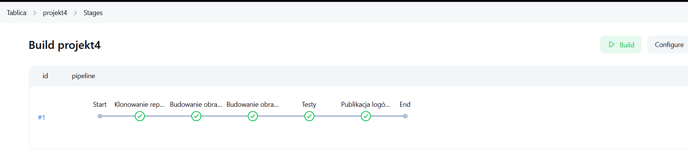
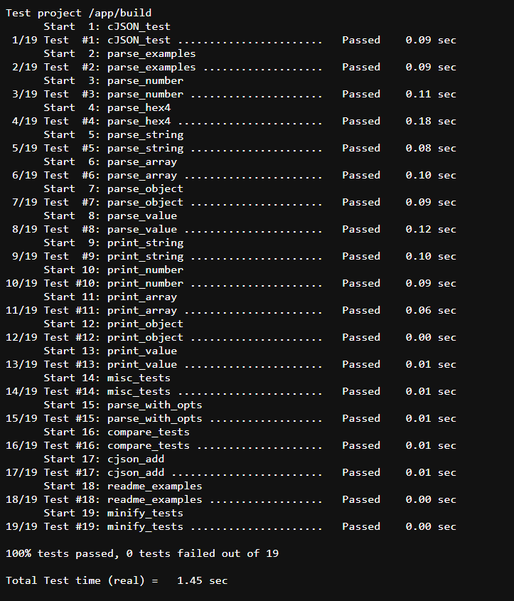
Całe logi z projektu 4 znajdują się w pliku [logi4](screenshots2/logi4.txt)


Następnym zadaniem było utworzyć pełny pipeline z etapami: Clone, Clear Docker Cache, build, test, deploy, oraz publish za pomocą kontenera. 
Do tego stworzyłam plik Jenkinsfile, który wygląda nastepując

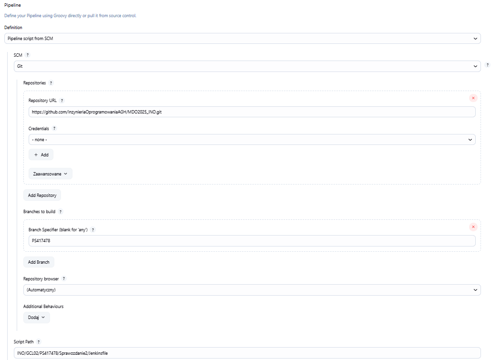