# Sprawozdanie 3 
## Lab 8-11
### Automatyzacja i zdalne wykonywanie poleceń za pomocą Ansible
Utworzyłam nową - drugą maszynę fedora dokładnie na takich samych ustawieniach jak dotychczasowa fedora główna. Urzytkownik - ansible, hostname - ansible-target. Reszta instalacji klasycznie, bez zmian.


Na maszynie zainstalowałam i sprawdziłam czy jest tar i sshd:


NAstępnie wykonałam migawkę nowej maszyny: (maszyna - narzędzia - migawki):


Zainstalowałam ansible na głównenj maszynie:


Sprawdziłam ip mojej nowej maszyny:


Po to aby w pliku /etc/hosts móc je wpisac w celu umożliwienia między nimi komunikacji: 


Skopiowałam klucz publiczny z maszyny głównej na drugą maszynę ansible-target.


Nastepnie sprawdziłam ping, czy maszyny sa połączone


Należało stworzyć plik inwentaryzacji inventory.ini, który u mnie wygląda nastepująco:


Plik odpaliłam polecenim:


Wszytskie pliki utworzyłam w katalogu ansible, dla przejszystości plików.
Nastepnie tworzyłam Playbooki. Pierwszy `playbook.yaml` stworzyłam do pingowania maszyn i uruchomiłam poleceniem: (na końcu każdego polecenia urzywałam -K aby podawać hasło przed rozpoczęciem działania pliku)


Kolejnym Playbookiem `playbook-endpoints.yml` kopiowałam plik `inventory.ini` na drugą maszynę ansible-target:


Następnym `playbook-aktualizacja.yml` Aktualizowałam pakiety w systemie:


Zaś `playbook-restart.yml` restartował usługii sshd i rngd: 


Na koniec połączyłam wszytskie powyższe playbooki w jeden `playbook-wszytsko.yml`:
```bash
---
- name: Wszytskie polecenia 
  hosts: all
  become: yes 
  tasks:
   - name: Ping maszyn
     ansible.builtin.ping:

   - name: Print message
     ansible.builtin.debug:
       msg: Ping wykonany

   - name: Skopiowanie pliku inventory.ini na maszynę
     copy:
       src: /home/pszlachta/MDO2025_INO/INO/GCL02/PS417478/Sprawozdanie3/ansible/inventory.ini
       dest: /home/ansible/ 
       mode: '0644'

   - name: Zaktualizuj pakiety w systemie
     ansible.builtin.dnf:
       name: '*'
       state: latest

   - name: Zrestartuj usługi sshd
     ansible.builtin.systemd:
       name: sshd
       state: restarted

   - name: Zrestartuj usługi rngd
     ansible.builtin.systemd:
       name: rngd
       state: restarted

```


NAstępnym krokiem było sprawdzenie jak działa główny playbook po wyłączeniu serwera ssh i z odpiętą kartą sieciową. Po odpaleniu wyników, znowu te opcje włączyłam (dwie ostatnie linijki):


Jak widac prawidłowo "nie zadziałały" polecenia na drugiej maszynie

Dalszym krokiem było utworzenie struktury roli do moich plików - moim artefaktem w projecie z poprzednich zajęć jest kontener. Utworzyłam cjson-role poleceniem:


Następnie skopiowałam swoje pliki `main.c`, `cjson.rpm`, oraz edytowałam plik `main.yaml` z folderu /cjson/tasks, aby wyglądał następująco:
```bash
---
# tasks file for cjson-role
- name: Create artifacts directory
  become: yes
  file:
    path: /home/ansible/cjson
    state: directory
    owner: ansible
    group: ansible
    mode: '0755'

- name: Copy artifacts to target
  copy:
    src: "{{ item }}"
    dest: /home/ansible/cjson/
    mode: '0644'
  loop:
    - files/cjson.rpm
    - files/main.c

- name: Install python3-requests
  ansible.builtin.dnf:
    name: python3-requests
    state: present

- name: Install Docker
  become: yes
  dnf:
    name: docker
    state: present
  
- name: Ensure Docker is started
  become: yes
  service:
    name: docker
    state: started
    enabled: true

- name: Add ansible to docker group
  user:
    name: ansible
    groups: docker
    append: true

- name: Start fedora container
  community.docker.docker_container:
    name: cjson
    image: fedora:41
    state: started
    command: sleep infinity
    volumes:
      - /home/ansible/cjson:/tmp:z

- name: Install gcc, cjson and tools
  community.docker.docker_container_exec:
    container: cjson
    command: dnf install -y gcc make /tmp/cjson.rpm

- name: Compile source file
  community.docker.docker_container_exec:
    container: cjson
    command: gcc -o /tmp/example /tmp/main.c -lcjson

- name: Run program
  community.docker.docker_container_exec:
    container: cjson
    command: bash -c "LD_LIBRARY_PATH=/usr/local/lib64 /tmp/example"
  register: result

- name: Print the result of the program
  debug:
    var: result.stdout
```
Plik ten: przesyła artefakty na ansible-target, następnie instaluje Dockera oraz jego zależności. Uruchamia kontener i instaluje biblioteki z pliku .rpm, kompuluje program, oraz uruchamia program i pobiera wynik.
Do tego utworzyłam playbooka `playbook-cjson.yaml`, aby móc poprawnie uruchomić program:
```bash
- name: Deploy CJSON in container
  hosts: ansible-target
  become: true
  roles:
    - cjson-role
```


### Pliki odpowiedzi dla wdrożeń nienadzorowanych, Kickstart
Skopiowałam plik `anaconda-ks.cfg` z katalogów `/root/anaconda-ks.cfg` będąc zalogowanym na roota, do mojego folderu i zmodyfikowałam plik o informacje o repozytoriach:
```bash
url --mirrorlist=http://mirrors.fedoraproject.org/mirrorlist?repo=fedora-41&arch=x86_64
repo --name=update --mirrorlist=http://mirrors.fedoraproject.org/mirrorlist?repo=updates-released-f41&arch=x86_64
```
I tak prezentowała sie jego pierwsza wersja:
```bash
# Generated by Anaconda 41.35
# Generated by pykickstart v3.58
#version=DEVEL

# Keyboard layouts
keyboard --vckeymap=pl --xlayouts='us'

# System language
lang pl_PL.UTF-8

# Network information
network  --bootproto=dhcp --device=enp0s3 --ipv6=auto --activate

url --mirrorlist=http://mirrors.fedoraproject.org/mirrorlist?repo=fedora-41&arch=x86_64
repo --name=update --mirrorlist=http://mirrors.fedoraproject.org/mirrorlist?repo=updates-released-f41&arch=x86_64

%packages
@^server-product-environment

%end

# Run the Setup Agent on first boot
firstboot --enable

# Generated using Blivet version 3.11.0
ignoredisk --only-use=sda

# Partition clearing information
clearpart --none

# Disk partitioning information
part biosboot --fstype="biosboot" --ondisk=sda --size=1
part /boot --fstype="ext4" --ondisk=sda --size=1024
part pv.159 --fstype="lvmpv" --ondisk=sda --size=35837
volgroup fedora_fedora --pesize=4096 pv.159
logvol / --fstype="ext4" --grow --maxsize=71680 --size=1024 --name=root --vgname=fedora_fedora

# System timezone
timezone Europe/Warsaw --utc

# Root password
rootpw --iscrypted --allow-ssh $y$j9T$Rhf9kzHvUIZ8UJjMO7KWcFK/$wgNSSmMVVbLjDFMcU0FE2e87XnrhesmYthffQ4lwLDB
user --groups=wheel --name=kickstart --password=$y$j9T$S/AE0fBf8NSsvdDyhRlhFAic$v8aU2VnylH0Y.CO6MHh.tTkrKcnxCTMTZQHGCZvMlt2 --iscrypted --gecos="kickstart"
```
Wypchnełam ten plik na github. Za pomocą jego linka, którego uwcześniej skróciłam za pomocą serwisu TinyURL dla ułtwienia przepisania go, utworzyłam nową maszynę. Mój wklejony link pliku `raw` wyglądał nastepująco:
```bash
https://tinyurl.com/pszlachtaaa
```
W menu startowym instalatora, po kliknięciu `e` należało go wpisać komendą:
```bash
inst.ks=https://tinyurl.com/pszlachtaaa
```


Po chwili, ukazał się klasyczny instalator w formie graficznej, z niektórymi wygaszonymi polami ze względu na to, że wartości te zostały już określone w pliku, który tam przesyłałam:


Po restrarcie - uwaga należało odpiąć plik startowy ISO w virtualboxie - zalogowałam się loginem z pliku i hasłem jak z oryginalnej maszyny:

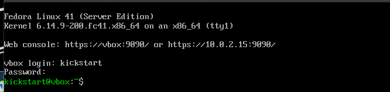

Następnie edytowałam plik `anaconda-ks.cfg` tak, aby system automatycznie uruchomił się ponownie po instalacji `(reboot)`, nadać maszynie nazwę hosta `(network --hostname=newfedora)`, automatycznie utworzyć nowe partycje `(autopart)`, oraz aby usunąć wszystkie partycje przed instalacją (do clearpart --all, należało dodać `--initlabel`):

```bash
# Generated by Anaconda 41.35
# Generated by pykickstart v3.58
#version=DEVEL

# Keyboard layouts
keyboard --vckeymap=pl --xlayouts='us'

# System language
lang pl_PL.UTF-8

# Network information
network --hostname=newfedora

url --mirrorlist=http://mirrors.fedoraproject.org/mirrorlist?repo=fedora-41&arch=x86_64
repo --name=update --mirrorlist=http://mirrors.fedoraproject.org/mirrorlist?repo=updates-released-f41&arch=x86_64

%packages
@^server-product-environment

%end

# Run the Setup Agent on first boot
firstboot --enable

# Generated using Blivet version 3.11.0
ignoredisk --only-use=sda

#Automatic partitioning
autopart

# Partition clearing information
clearpart --none --initlabel

# System timezone
timezone Europe/Warsaw --utc

# Root password
rootpw --iscrypted --allow-ssh $y$j9T$Rhf9kzHvUIZ8UJjMO7KWcFK/$wgNSSmMVVbLjDFMcU0FE2e87XnrhesmYthffQ4lwLDB
user --groups=wheel --name=kickstart --password=$y$j9T$S/AE0fBf8NSsvdDyhRlhFAic$v8aU2VnylH0Y.CO6MHh.tTkrKcnxCTMTZQHGCZvMlt2 --iscrypted --gecos="kickstart"

reboot
```
Po czym znowu wypchnełam plik na githuba i przeprowadziłam ponowną instalacje. Rezultat:

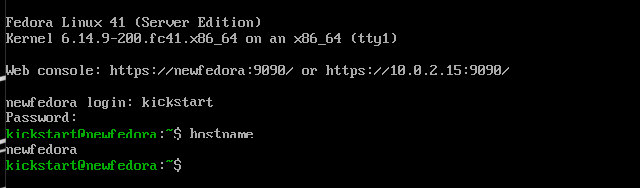

#### Instalacja biblioteki cjson
Aby udostępnic bibliotekę w formie repo YUM należało pobrać serwer Apache i Createrepo:

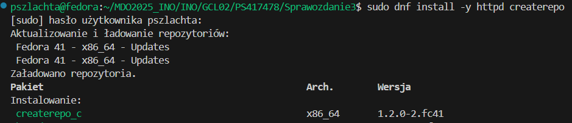

Potrzebne były reguły firewalla aby móc otworzyć dostęp HTTP:

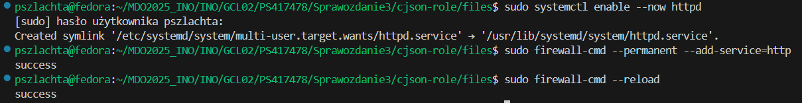

Następnie poleceniami, utworzyłam katalog  i nadałam kontekst SELinux, oraz odświeżyłam i wygenerowałam metadane RPM:
```bash
sudo mkdir -p /var/www/html/cjson
sudo cp cjson.rpm /var/www/html/cjson/
```

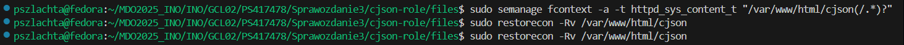
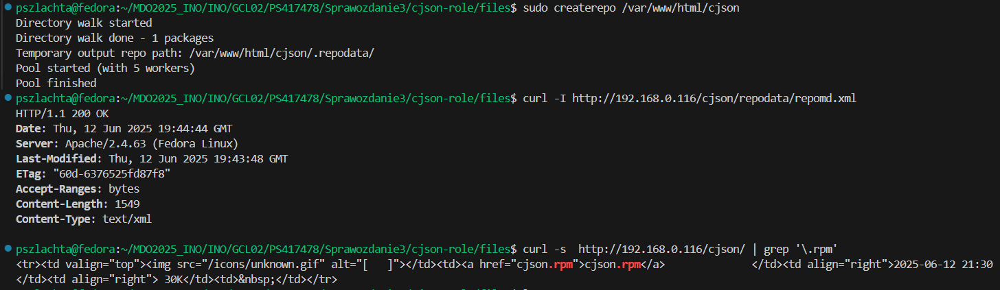

W przeglądarce:

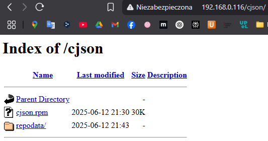

Na koniec edytowałam plik `anaconda-ks.cfg`. Dodałam swoje repo, pakiety do zainstalowania `%packages`, oraz sekcję `%post` do weryfikacji obecności artefaktu: 

```bash
# Generated by Anaconda 41.35
# Generated by pykickstart v3.58
#version=DEVEL

# Keyboard layouts
keyboard --vckeymap=pl --xlayouts='us'

# System language
lang pl_PL.UTF-8

# Network information
network --hostname=newfedora

url --mirrorlist=http://mirrors.fedoraproject.org/mirrorlist?repo=fedora-41&arch=x86_64
repo --name=update --mirrorlist=http://mirrors.fedoraproject.org/mirrorlist?repo=updates-released-f41&arch=x86_64
repo --name=myrepo --baseurl=http://192.168.0.116/cjson/

%packages
@core
cjson
gcc
glibc
curl
%end

# Run the Setup Agent on first boot
firstboot --enable

# Generated using Blivet version 3.11.0
ignoredisk --only-use=sda

#Automatic partitioning
autopart

# Partition clearing information
clearpart --none --initlabel

# System timezone
timezone Europe/Warsaw --utc

# Root password
rootpw --iscrypted --allow-ssh $y$j9T$Rhf9kzHvUIZ8UJjMO7KWcFK/$wgNSSmMVVbLjDFMcU0FE2e87XnrhesmYthffQ4lwLDB
user --groups=wheel --name=kickstart --password=$y$j9T$S/AE0fBf8NSsvdDyhRlhFAic$v8aU2VnylH0Y.CO6MHh.tTkrKcnxCTMTZQHGCZvMlt2 --iscrypted --gecos="kickstart"

%post --interpreter /bin/bash
echo "Potwierdzenie instalacji"
ls /usr/include/cjson
ls /usr/lib/libcjson*
%end

reboot
```

Ponownie wypchnełam plik i przeprowadziłam instalacje, sprawdziłam poprawność plików:

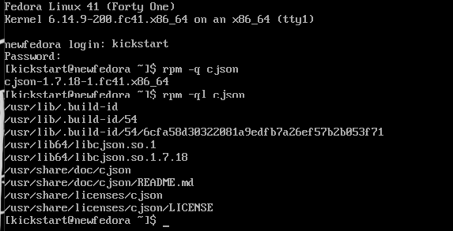


### Wdrażanie na zarządzalne kontenery: Kubernetes (1)

Instalacje minikube zaczęłam od pobrania:
```bash 
curl -LO https://storage.googleapis.com/minikube/releases/latest/minikube-latest.x86_64.rpm
```
A następnie:
```bash
sudo rpm -Uvh minikube-latest.x86_64.rpm
```

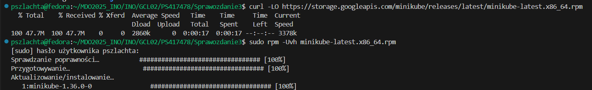

Nie było żadnych błędów poprawnosci. Następnie pobrałam:
```bash
curl -LO "https://dl.k8s.io/release/$(curl -L -s https://dl.k8s.io/release/stable.txt)/bin/linux/amd64/kubectl"
```
Oraz plik kontrolny:
```bash
curl -LO "https://dl.k8s.io/release/$(curl -L -s https://dl.k8s.io/release/stable.txt)/bin/linux/amd64/kubectl.sha256"
```
Sprawdziłam jego poprawność, a nastepnie zainstalowałam kubectl

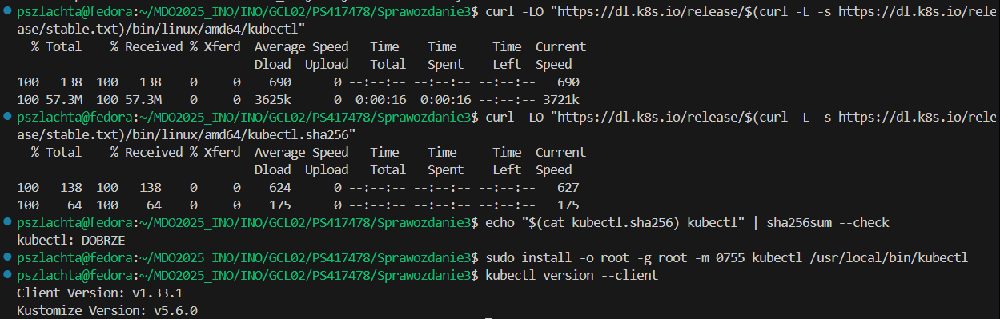

Polecenie do uruchomienia klastra Kubernetes:

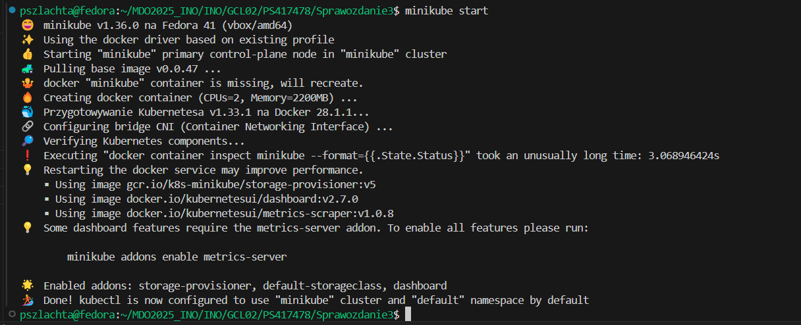

Minikube uruchomił się w kontenerze docker:

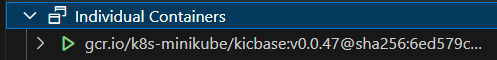

Uruchomiłam dashboard

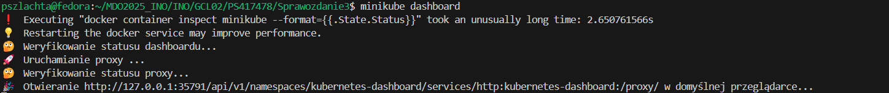

Następnie uruchomiłam w przeglądarce link, który dostałam w terminalu:

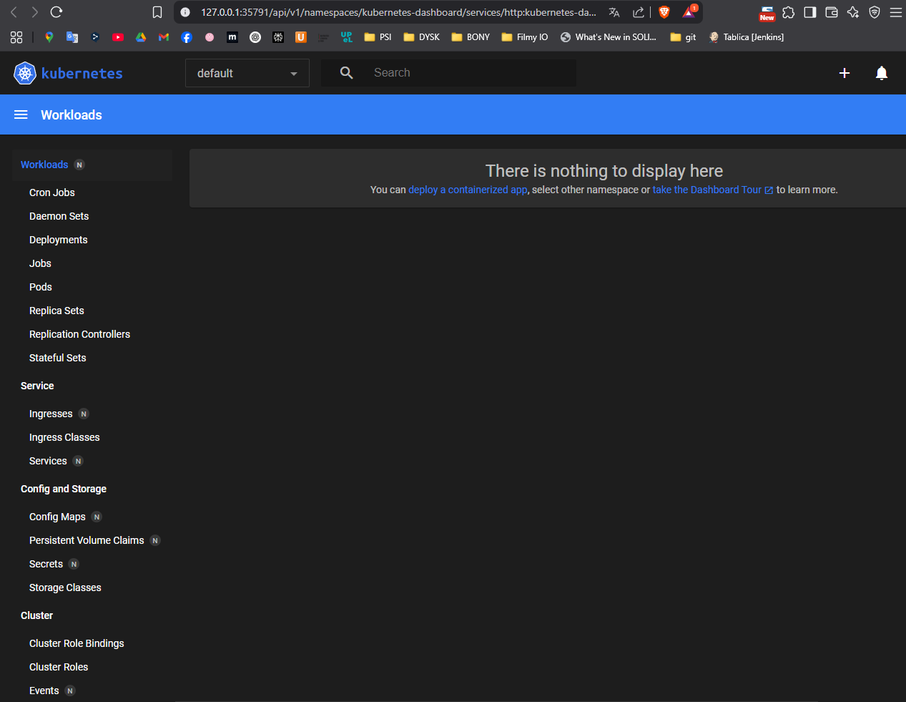

Na potrzeby mojego zadania aplikacji nginx z dorzuconą własną konfiguracją, utworzyłam dockerfile:
```bash
FROM nginx:alpine
COPY nginx.conf /etc/nginx/nginx.conf
```

Oraz plik nginx.conf
```bash
events {}

http {
    server {
        listen 80;
        location / {
            return 200 'Hello!!!\n';
        }
    }
}
```

Zbudowałam obraz, dla sprawdzenia poprawności działania uruchomiłam lokalnie przekierowaniem portu 8080:

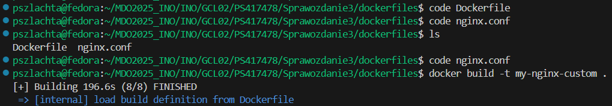
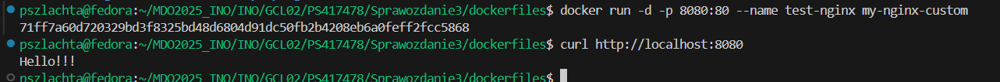

Następnie chcąc przygotować obraz wdrożenia w środkowisku Kubernetes, potrzebowałam umieścić go w dockerhub. Nadałam tag, i przesłałam, oraz sprawdziłam dla potwierdzenia na przeglądarce:

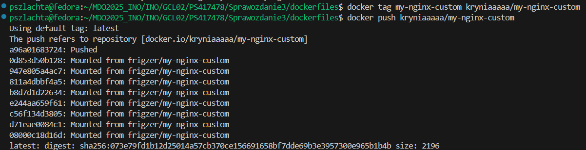
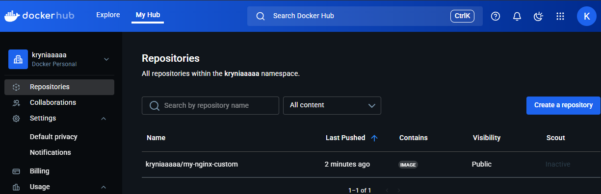

Nastepnie chcąc wykonać deployment należało użyć poleceń. Utworzyłam obiekt service typu LoadBalancer, dla możliwego dostępu do aplikacji na porcie 80:

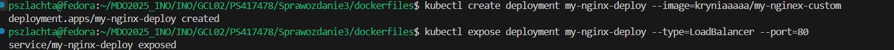

W Kubernetes pojawił sie deployment, sprawdziłam działanie poda:

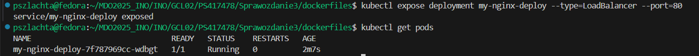
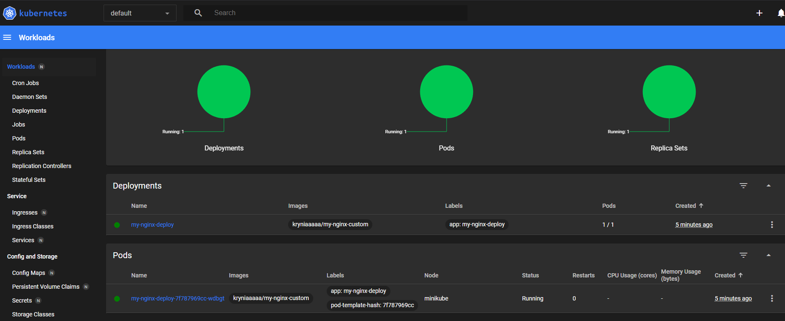

Sprawdziłam port. Z racji iż nie mogłam sobie poradzić z formą "kubectl port-forward pod/my-nginx-deploy-7f787969cc-wdbgt 8080:80", zrobiłam to inaczej: Pobieram zawartość strony interntowej uruchomionej na localhost i wyświetlam go:

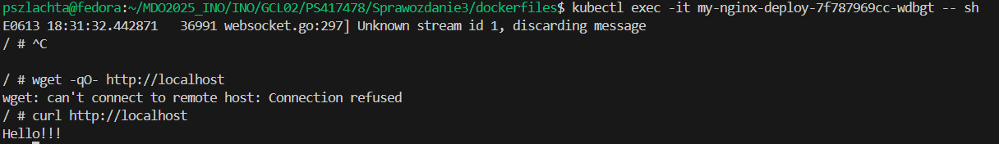

Utworzyłam plik `nginx-deployment.yaml`, na podstawie dokumentacji z deploymentów w Kubernetes:
```bash
apiVersion: apps/v1
kind: Deployment
metadata:
  name: nginx-deployment
  labels:
    app: nginx
spec:
  replicas: 4
  selector:
    matchLabels:
      app: nginx
  template:
    metadata:
      labels:
        app: nginx
    spec:
      containers:
      - name: nginx
        image: nginx:latest
        ports:
        - containerPort: 80
```
Wdrożyłamzasoby w klastrze i sprawdziłam stan wdrożenia:

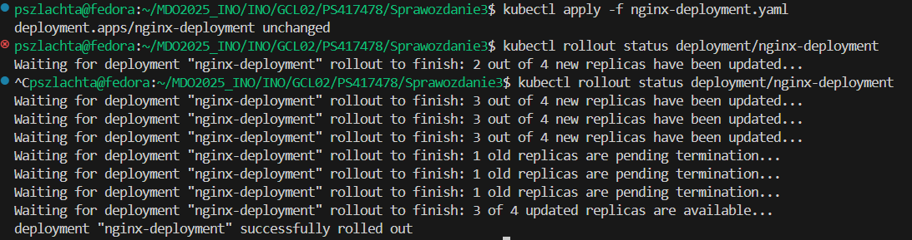
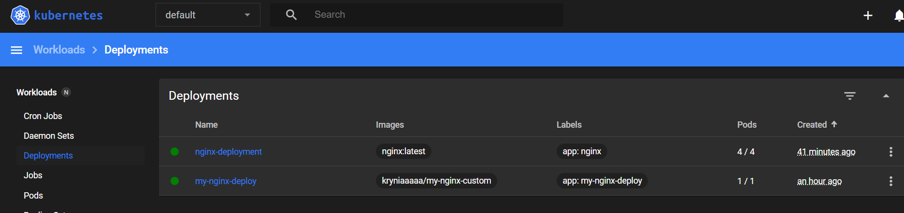

NAstepnie utworzyłam plik `nginx-service.yaml`, podobnie jak poprzedmio. 
Dla poprawnego połączenia usługi z podami zastosowałam app: nginx:
```bash
apiVersion: v1
kind: Service
metadata:
  name: nginx-service
  labels:
    app: nginx
spec:
  type: LoadBalancer
  selector:
    app: nginx
  ports:
  - port: 80
    targetPort: 80
    nodePort: 30080
```
Do wdrożenia podobnie jak poprzednio polecenia:

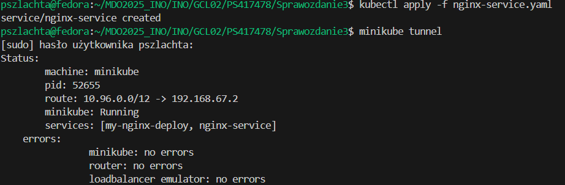
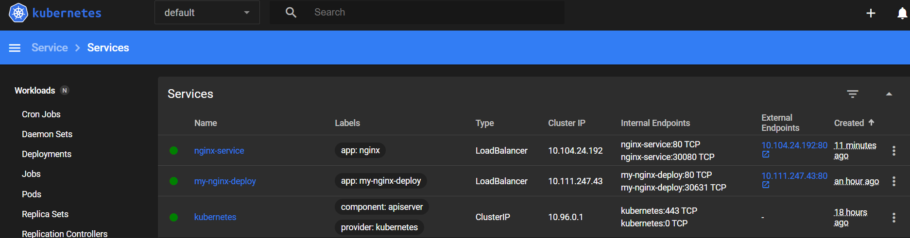

Na koniec przekierowałam port 8080 do 80 aby móc ją wyświetlić w przeglądarce:

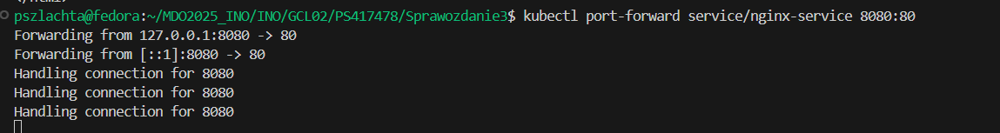
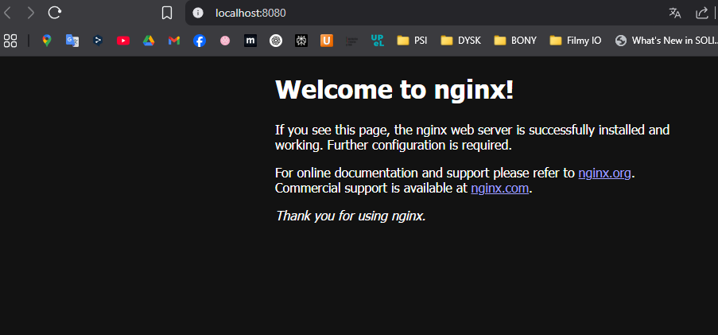


### Wdrażanie na zarządzalne kontenery: Kubernetes (2)

Kontynuując poprzednie labolatoria, utworzyłam kolejne pliki dockerfile:

`Dockerfile1`:
```bash
FROM nginx:alpine
```

`Dockerfile2`:
```bash
FROM nginx:alpine
COPY nginx.conf /etc/nginx/nginx.conf
```

`Dockerfile3`:
```bash
FROM alpine
CMD ["false"]
```
1 - bazowy obraz, 2 - obraz z moją konfiguracja z poprzednich zajęć, 3 - obraz kończący działanie natychmiast(błąd)
Zbudowałam je i dodałam do dockerhuba:

```bash
docker build -t kryniaaaaa/my-nginx1 -f Dockerfile1 .
docker push kryniaaaaa/my-nginx1

docker build -t kryniaaaaa/my-nginx2 -f Dockerfile2 .
docker push kryniaaaaa/my-nginx2

docker build -t kryniaaaaa/my-nginx3 -f Dockerfile3 .
docker push kryniaaaaa/my-nginx3
```
W Docker Hub:

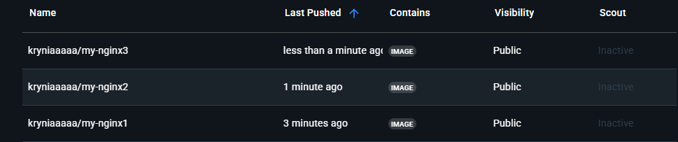

Zmiany w deploymencie - Odpowiednio zmieniałam sekcję "replicas:" w pliku `nginx-deployment.yaml` na różne wartości odpoweidnio według wariantu. Wszytskie zmiany zatwierdzałam poleceniem `kubectl apply -f nginx-deployment.yaml`:
Przy każdej zmianie tworzenie/usuwanie (w zależności od wariantu) podów, było rozkłądane w czasie - chwilę trwało, stąd na niektórych zrzutach, niepełna wersja.

8:

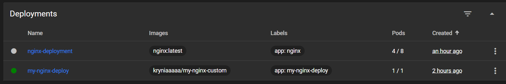

1:

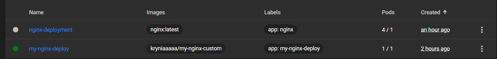

0:

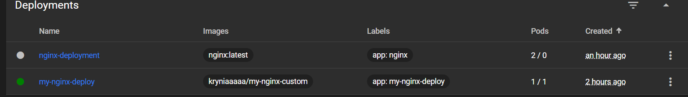

znowu 4:

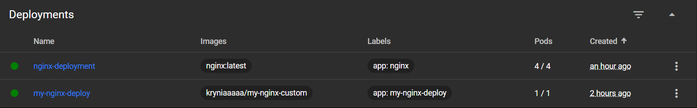

Następnie zmieniłam wersje obrazu na inne warianty w tym miejscu:
drugi:

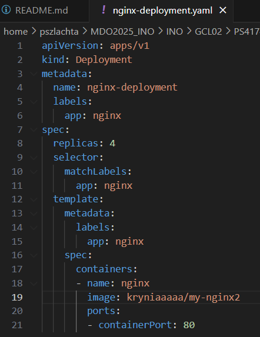
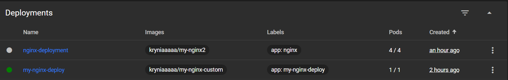

trzeci - deploy nie zadziałał - pody nie przechodziły running i operacja była zaznaczona na czerwono

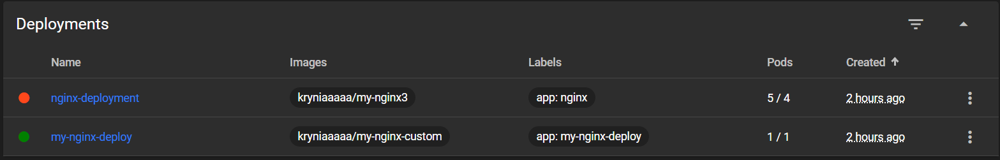

Przywracanie poprzednich wersji wdrożeń poleceniem:
`kubectl rollout undo deployment my-nginx-deploy`
Przywrócone wersje:

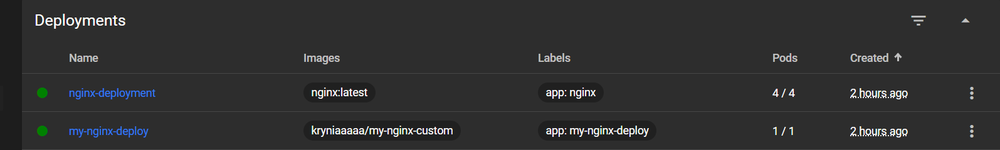

Skrypt weryfikujący czy wdrożenie "zdążyło" się wdrożyć (60 sekund):
```bash
#!/bin/bash

DEPLOYMENT_NAME="my-nginx-deploy"
NAMESPACE="default"
TIMEOUT=60

echo "Czy wdrozenie \"$DEPLOYMENT_NAME\" się zrobi?"

kubectl rollout status deployment/"$DEPLOYMENT_NAME" --namespace="$NAMESPACE" --timeout=${TIMEOUT}s

if [ $? -eq 0 ]; then
    echo "TAK!"
else
    echo "Nie, przekroczono $TIMEOUT sekund."
    exit 1
fi
```

Dla poprawnej wersji:

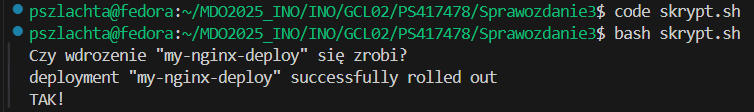

Dla błędnej:

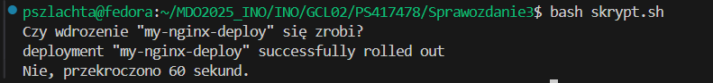

Strategie wdrożeń:
`Recreate`- najpierw usuwa wszystkie stare pody z aktualnego wdrożenia, a dopiero później uruchamia nowe z nową wersją obrazu.

`Rolling Update (z parametrami maxUnavailable > 1, maxSurge > 20%)`- wymienia pody stopniowo, po kolei – jednocześnie usuwa stare i uruchamia nowe, zachowując działającą aplikację podczas całego procesu. Parametry oznaczają np. maxUnavailable=2 – maksymalnie 2 pody mogą być niedostępne w czasie aktualizacji. MaxSurge: 25% – może być uruchomionych do 25% więcej podów niż początkowo, by przyspieszyć wdrożenie bez przerywania działania usługi.

`Canary Deployment workload`- Wdraża nową wersję aplikacji tylko dla niewielkiej części np. 1 z 4 replik.


--- 
Do pomocy korzystałam ze sztucznej inteligencji takej jak Chat GPT, DeepSeak, oraz Perplexity.ai, każdorazowo starając się weryfikować informacje w róznych źródłach. AI pomogło mi w niektórych momentach ze zrozumieniem poszczególnych zagadnień, czy też przy pisaniu niektórych plików, ale przede wszystkim w rozwiązywaniu problemów, na które już nie miałam sama pomysłu.