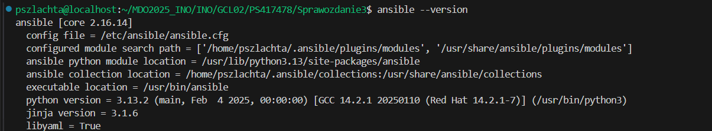
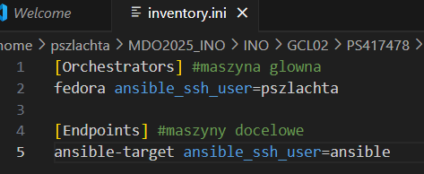
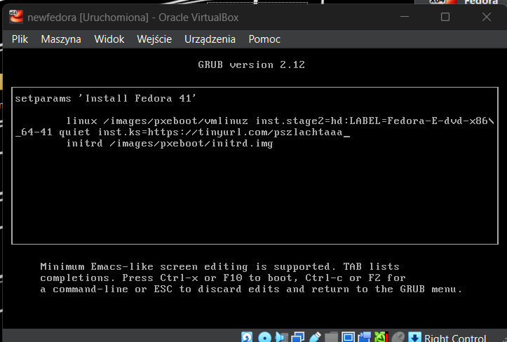

# Sprawozdanie 3 
## Lab 8-11
### Automatyzacja i zdalne wykonywanie poleceń za pomocą Ansible
Utworzyłam nową - drugą maszynę fedora dokładnie na takich samych ustawieniach jak dotychczasowa fedora główna. Urzytkownik - ansible, hostname - ansible-target. Reszta instalacji klasycznie, bez zmian.


Na maszynie zainstalowałam i sprawdziłam czy jest tar i sshd:


NAstępnie wykonałam migawkę nowej maszyny: (maszyna - narzędzia - migawki):


Zainstalowałam ansible na głównenj maszynie:



Sprawdziłam ip mojej nowej maszyny:


Po to aby w pliku /etc/hosts móc je wpisac w celu umożliwienia między nimi komunikacji: 


Skopiowałam klucz publiczny z maszyny głównej na drugą maszynę ansible-target.


Nastepnie sprawdziłam ping, czy maszyny sa połączone


Należało stworzyć plik inwentaryzacji inventory.ini, który u mnie wygląda nastepująco:


Plik odpaliłam polecenim:


Wszytskie pliki utworzyłam w katalogu ansible, dla przejszystości plików.
Nastepnie tworzyłam Playbooki. Pierwszy `playbook.yaml` stworzyłam do pingowania maszyn i uruchomiłam poleceniem: (na końcu każdego polecenia urzywałam -K aby podawać hasło przed rozpoczęciem działania pliku)


Kolejnym Playbookiem `playbook-endpoints.yml` kopiowałam plik `inventory.ini` na drugą maszynę ansible-target:


Następnym `playbook-aktualizacja.yml` Aktualizowałam pakiety w systemie:


Zaś `playbook-restart.yml` restartował usługii sshd i rngd: 


Na koniec połączyłam wszytskie powyższe playbooki w jeden `playbook-wszytsko.yml`:
```bash
---
- name: Wszytskie polecenia 
  hosts: all
  become: yes 
  tasks:
   - name: Ping maszyn
     ansible.builtin.ping:

   - name: Print message
     ansible.builtin.debug:
       msg: Ping wykonany

   - name: Skopiowanie pliku inventory.ini na maszynę
     copy:
       src: /home/pszlachta/MDO2025_INO/INO/GCL02/PS417478/Sprawozdanie3/ansible/inventory.ini
       dest: /home/ansible/ 
       mode: '0644'

   - name: Zaktualizuj pakiety w systemie
     ansible.builtin.dnf:
       name: '*'
       state: latest

   - name: Zrestartuj usługi sshd
     ansible.builtin.systemd:
       name: sshd
       state: restarted

   - name: Zrestartuj usługi rngd
     ansible.builtin.systemd:
       name: rngd
       state: restarted

```


NAstępnym krokiem było sprawdzenie jak działa główny playbook po wyłączeniu serwera ssh i z odpiętą kartą sieciową. Po odpaleniu wyników, znowu te opcje włączyłam (dwie ostatnie linijki):


Jak widac prawidłowo "nie zadziałały" polecenia na drugiej maszynie

Dalszym krokiem było utworzenie struktury roli do moich plików - moim artefaktem w projecie z poprzednich zajęć jest kontener. Utworzyłam cjson-role poleceniem:


Następnie skopiowałam swoje pliki `main.c`, `cjson.rpm`, oraz edytowałam plik `main.yaml` z folderu /cjson/tasks, aby wyglądał następująco:
```bash
---
# tasks file for cjson-role
- name: Create artifacts directory
  become: yes
  file:
    path: /home/ansible/cjson
    state: directory
    owner: ansible
    group: ansible
    mode: '0755'

- name: Copy artifacts to target
  copy:
    src: "{{ item }}"
    dest: /home/ansible/cjson/
    mode: '0644'
  loop:
    - files/cjson.rpm
    - files/main.c

- name: Install python3-requests
  ansible.builtin.dnf:
    name: python3-requests
    state: present

- name: Install Docker
  become: yes
  dnf:
    name: docker
    state: present
  
- name: Ensure Docker is started
  become: yes
  service:
    name: docker
    state: started
    enabled: true

- name: Add ansible to docker group
  user:
    name: ansible
    groups: docker
    append: true

- name: Start fedora container
  community.docker.docker_container:
    name: cjson
    image: fedora:41
    state: started
    command: sleep infinity
    volumes:
      - /home/ansible/cjson:/tmp:z

- name: Install gcc, cjson and tools
  community.docker.docker_container_exec:
    container: cjson
    command: dnf install -y gcc make /tmp/cjson.rpm

- name: Compile source file
  community.docker.docker_container_exec:
    container: cjson
    command: gcc -o /tmp/example /tmp/main.c -lcjson

- name: Run program
  community.docker.docker_container_exec:
    container: cjson
    command: bash -c "LD_LIBRARY_PATH=/usr/local/lib64 /tmp/example"
  register: result

- name: Print the result of the program
  debug:
    var: result.stdout
```
Plik ten: przesyła artefakty na ansible-target, następnie instaluje Dockera oraz jego zależności. Uruchamia kontener i instaluje biblioteki z pliku .rpm, kompuluje program, oraz uruchamia program i pobiera wynik.
Do tego utworzyłam playbooka `playbook-cjson.yaml`, aby móc poprawnie uruchomić program:
```bash
- name: Deploy CJSON in container
  hosts: ansible-target
  become: true
  roles:
    - cjson-role
```


### Pliki odpowiedzi dla wdrożeń nienadzorowanych, Kickstart
Skopiowałam plik `anaconda-ks.cfg` z katalogów `/root/anaconda-ks.cfg` będąc zalogowanym na roota, do mojego folderu i zmodyfikowałam plik o informacje o repozytoriach:
```bash
url --mirrorlist=http://mirrors.fedoraproject.org/mirrorlist?repo=fedora-41&arch=x86_64
repo --name=update --mirrorlist=http://mirrors.fedoraproject.org/mirrorlist?repo=updates-released-f41&arch=x86_64
```
I tak prezentowała sie jego pierwsza wersja:
```bash
# Generated by Anaconda 41.35
# Generated by pykickstart v3.58
#version=DEVEL

# Keyboard layouts
keyboard --vckeymap=pl --xlayouts='us'

# System language
lang pl_PL.UTF-8

# Network information
network  --bootproto=dhcp --device=enp0s3 --ipv6=auto --activate

url --mirrorlist=http://mirrors.fedoraproject.org/mirrorlist?repo=fedora-41&arch=x86_64
repo --name=update --mirrorlist=http://mirrors.fedoraproject.org/mirrorlist?repo=updates-released-f41&arch=x86_64

%packages
@^server-product-environment

%end

# Run the Setup Agent on first boot
firstboot --enable

# Generated using Blivet version 3.11.0
ignoredisk --only-use=sda

# Partition clearing information
clearpart --none

# Disk partitioning information
part biosboot --fstype="biosboot" --ondisk=sda --size=1
part /boot --fstype="ext4" --ondisk=sda --size=1024
part pv.159 --fstype="lvmpv" --ondisk=sda --size=35837
volgroup fedora_fedora --pesize=4096 pv.159
logvol / --fstype="ext4" --grow --maxsize=71680 --size=1024 --name=root --vgname=fedora_fedora

# System timezone
timezone Europe/Warsaw --utc

# Root password
rootpw --iscrypted --allow-ssh $y$j9T$Rhf9kzHvUIZ8UJjMO7KWcFK/$wgNSSmMVVbLjDFMcU0FE2e87XnrhesmYthffQ4lwLDB
user --groups=wheel --name=kickstart --password=$y$j9T$S/AE0fBf8NSsvdDyhRlhFAic$v8aU2VnylH0Y.CO6MHh.tTkrKcnxCTMTZQHGCZvMlt2 --iscrypted --gecos="kickstart"
```
Wypchnełam ten plik na github. Za pomocą jego linka, którego uwcześniej skróciłam za pomocą serwisu TinyURL dla ułtwienia przepisania go, utworzyłam nową maszynę. Mój wklejony link pliku `raw` wyglądał nastepująco:
```bash
https://tinyurl.com/pszlachtaaa
```
W menu startowym instalatora, po kliknięciu `e` należało go wpisać komendą:
```bash
inst.ks=https://tinyurl.com/pszlachtaaa
```


Po chwili, ukazał się klsyczniklasyczny instalator w formie graficznej, z niektórymi wygaszonymi polami ze względu na to, że wartości te zostały już określone w pliku, który tam przesyłaliśmy:


