## Setup Środowiska
Początkowo pobrałem program virtual box oraz plik obrazu dysku ubuntuServer.
Początkowo, aby nawiązać połączenie ze swojego natywnego systemu do vmki oraz vice-versa  należało ustawić port forwarding dla vmki na porcie 22
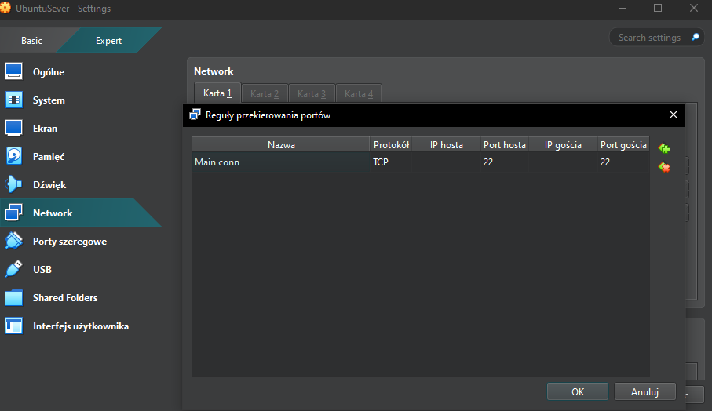

Następnym krokiem było skonfigurowanie gita i ssh, początkowo zainstalowane przez

    sudo apt install git

    sudo apt install ssh

oraz dodanie personal access tokena w ustawieniach githuba. Utworzyłem również klucze ssh za pomocą

    ssh-keygen -t ed25519 -C "radoslaw02brania@gmail.com"

dodałem ten klucz do githuba wklejając zawartość utworzonego przez powyższą komende pliku .pub do swoich kluczy ssh w ustawieniach githuba a następnie dodałem identity do ssh agenta za pomocą 

    ssh-add ~/.ssh/id_ed25519

A końcowo nawiązałem połączenie z githubem za pomocą

    ssh -T git@guthub.com

który pomyślnie rozpoznał mnie jako użytkownika RadoslawBrania

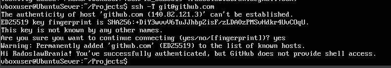

Następnie sklonowałem repo za pomocą git clone

    git@github.com:InzynieriaOprogramowaniaAGH/MDO2025_INO

oraz utworzyłem branch RB410504 za pomocą

    git switch -c RB410504 

gdzie -c tworzy branch jeśli ten nie istnieje

Pozostało jedynie utworzenie git hooka. Aby to zrobić, należało w folderze ze sklonowanym repo przejść do .git/hooks i utworzyć plik commit-msg oraz nadać mu uprawnienia do wykonania.

    #!/bin/bash
    COMMIT_MSG_FILE=$1
    PREFIX="RB410504"

    COMMIT_MSG=$(head -n 1 "$COMMIT_MSG_FILE")

    if [[ ! "$COMMIT_MSG" =~ ^RB410504 ]]; then
      echo "err, comm msg should start with '$PREFIX'"
      exit 1
    fi

# Git , docker

Zainstalowałem na swoim systemie wersje snap dockera. Początkowo nie zauważyłem innego sposobu instalacji, po wykonaniu już zadań kiedy się zorientowałem spróbowałem przejść na wersję z repo. Podczas prób zainstalowania nie sandboxowej wersji setup jego repo odmawiał współpracy, pomimo wielu prób nie udało się go naprawić, a z racji, że VMka pomimo włączenia dwustronnego clipboarda nie chciała wklejać tekstu skopiowanego na głównym systemie oraz, iż wykonałem już większośc pracy na wersji snap, dla zdrowia psychicznego przystałem na wersję snap.

Screen błędu przy instalacji:

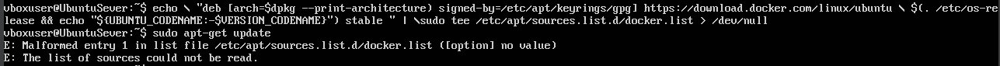

Następnie pobrałem obrazy hello-world, busybox, ubuntu oraz mysql za pomocą 

    docker run nazwa_kontenera

Wewnątrz kontenera widzimy jego procesy:

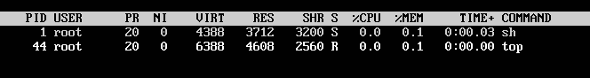

Poza kontenerem widoczne są procesy w kontenerze (wchodziłem do kontenerów za pomocą bin/bash i nie wyłączałem ich, widzimy proces bash, który pozostał odpalony):

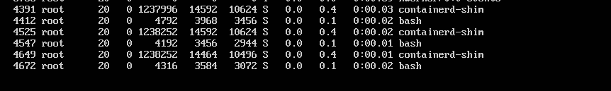

Następnie utworzyłem dockerfile nazwany Dockerfile.ubio (do wglądu w plikach) i utworzyłem obraz z zainstalowanym gitem. 

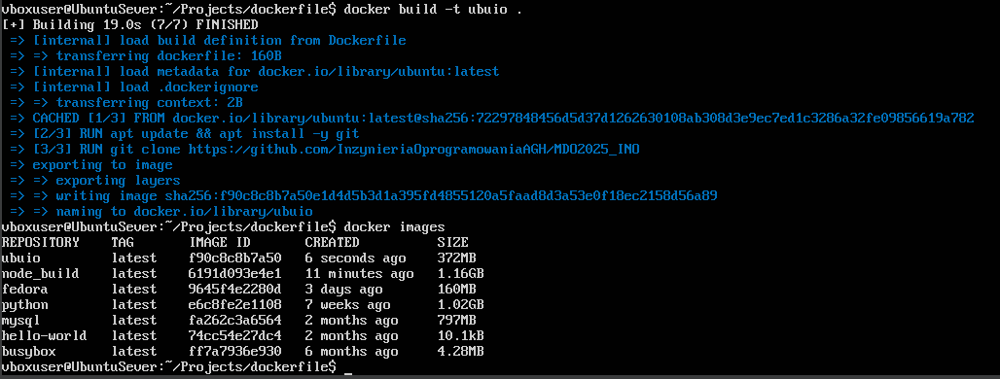

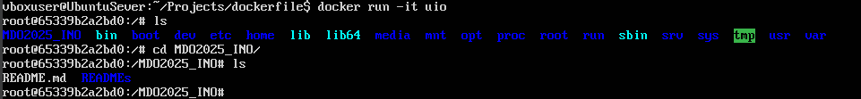

Następnie usunąłem włączone procesy za pomocą 

    docker rm -f $(docker ps -aq)

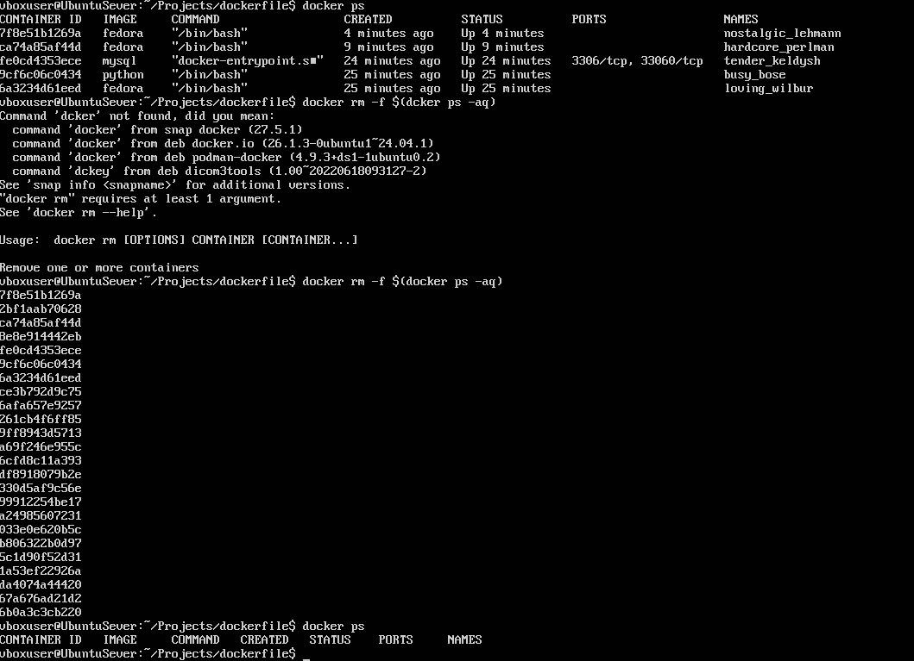

a końcowo usunąłem wszystkie zainstalowane obrazy za pomocą 

    docker image prune -a

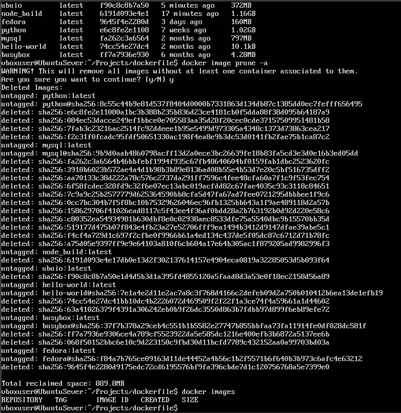

# Dockerfiles, Zajęcia 3

Wykonałem zadanie z lab3 dla irssi oraz nodejs-dummy-test. Oba te dockerfile znajdują się pod sensownymi nazwami na moim branchu (.nodebld,.nodetst,irssi...) , ale jako, że proces ich tworzenia jest z grubsza ten sam jak dla innego repo które muszę zaimplementować opiszę jedynie tworzenie jego.

Znalazłem repo bazujące na node z testami i buildem: https://github.com/kriasoft/node-starter-kit/blob/main/README.md

Utworzyłem dockerfile bazujący na node, który klonuje to repo, przechodzi do workdira i odpala yarn install oraz yarn build. Pojawił się tu jednak pewien problem, ponieważ yarn install zwracał bład. Po wejściu do kontenera node ze sklonowanym repo błąd ten się powtarzał. Okazało się, że należało zaktualizować yarna do najnowszej wersji, ponieważ obraz node ma ją nieaktualną. Dlatego właśnie w dockerfile przed uruchomieniem yarn install robimy yarn set version latest. Wtedy po wejściu do tak utworzonego kontenera z bin/bash po zrobieniu yarn run pomyślnie odpala nam się API (bo projekt to API starter kit). Możemy również odpalić testy kodu oraz testy jednostkowe.

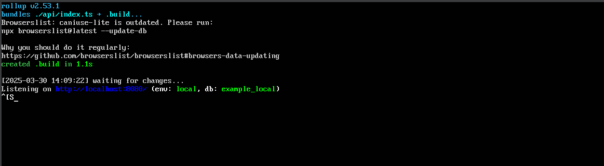

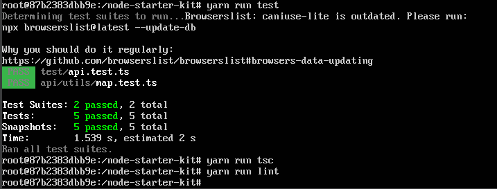

Następnie utworzyłem również obraz, który bazuje na tym obrazie i odpala na początku testy kodu i jednostkowe.

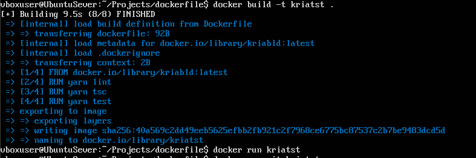

Warto zauważyć, że docker build tworzy jednynie obraz na podstawie którego budowany jest potem kontener po użyciu run.

# Woluminy, pamięć

Utworzyłem woluminy VolIn oraz VolOut , docelowo przenosząc repo z in do out. 
W celu osiągnięciu tego podpiąłem do obrazu 2 voluminy - jeden lokalny, ze sklonowanym repo, a drugi to nasz VolOut, do którego skopiowałem pliki z inputu. Jak widać na załączonym screenie.
Do zbindowania voluminów w ten sposób użyłem następującego polecenia:

    docker run -it --name baseconn --mount type=bind,source=/home/vboxuser/Projects/   irssi,target=/mnt/input --mount type=volume,source=OutVol,target=/mnt/out irsiblank

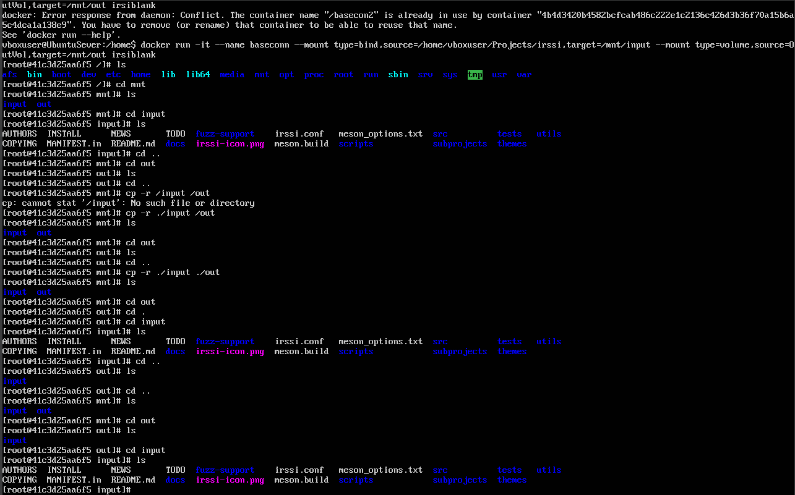

Następnie chciałem połączyć ze sobą 2 kontenery. W celu dokonania tego uruchomiłem je za pomocą 
 
    docker run -it --name NAZWA --network bridge ubuntu
   
zainstalowałem na nich iperfa, jeden kontener ustawiłem jako server (iperf3 -s), wziąłem jego ip za pomocą

    docker inspect -f '{{range .NetworkSettings.Networks}}{{.IPAddress}}{{end}}' NAZWA
     
Po czym wszedłem do drugiego i połączyłem się ze zwróconym ip 172.17.0.15 za pomocą iperf3 -c , otrzymując rezultat sugerujący, że połączenie się udało:

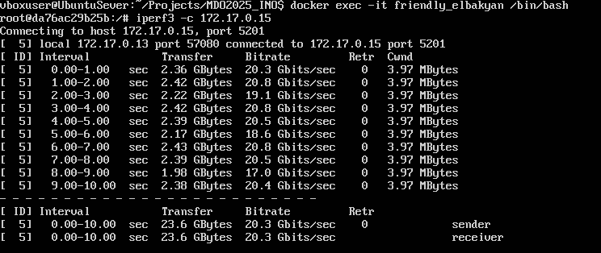

Dalej używałem już gotowego obrazu iperf3.
Utworzyłem nową sieć w dockerze za pomocą

    docker network create --driver bridge my_net 

A następnie uruchomiłem iperfa jako server w tej sieci używając

    docker run -dit --name iperf-server --network my_net networkstatic/iperf3 -s

po czym wywołałem ten server po nazwie za pomocą:

    docker run -it --network my_net networkstatic/iperf3 -c iperf-server

Ponownie otrzymując odpowiedź:

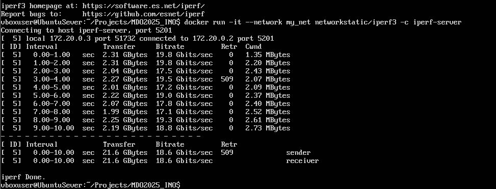

Jak widać osiągamy bardzo szybkie prędkości, bo blisko 20 Gbits/s . 

# Instalacja jenkins

Przeprowadziłem instalację wg. instrukcji z oficjalnej strony jenkinsa.

Stworzyłem sieć, uruchomiłem kontener itd... 
Napotkałem jednak jedną trudność - moja vmka, jako, że jest to ubuntu server, nie ma żadnego gui, które wydaje się być potrzebne przy skonfigurowaniu jenkinsa. Udało mi się to ominąć jednym sposobem - Połączyłem się do vmki przez ssh i wyeskponowałem port 8080,
na którym stoi jenkins. 

    ssh -L 8080:localhost:8080 vboxuser@127.0.0.1

Dzięki temu udało mi się zalogować initial hasłem, które wyciągnąłem za pomocą

    sudo docker exec jenkins-blueocean cat /var/jenkins_home/secrets/initialAdminPassword

A końcowo bez problemów zainstalowałem pluginy oraz utworzyłem konto admina na jenkinsie.

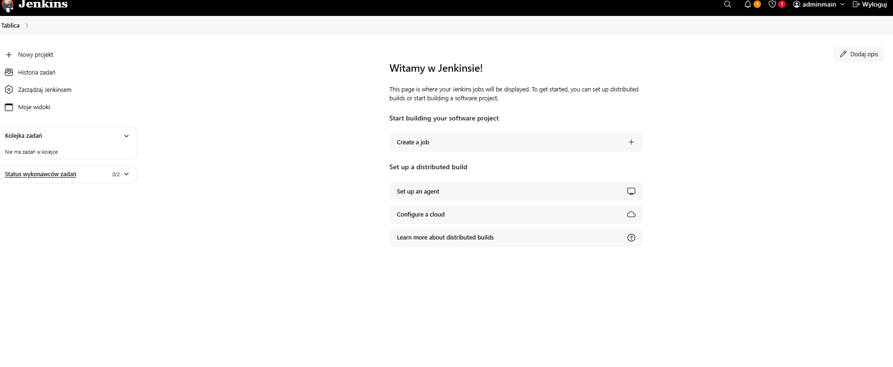