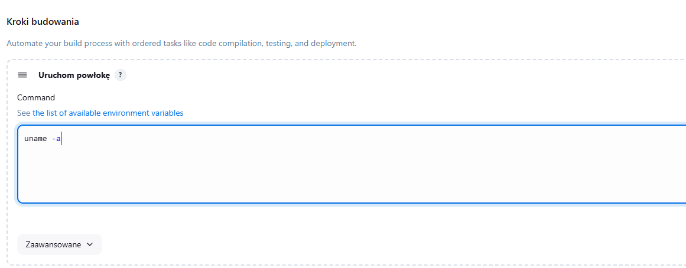
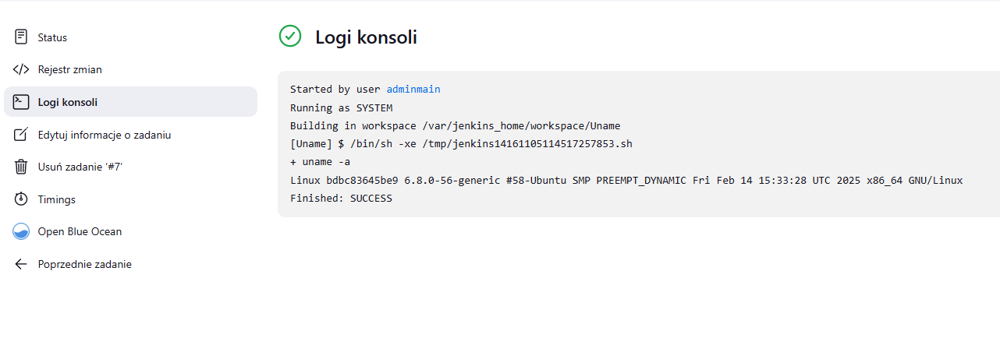
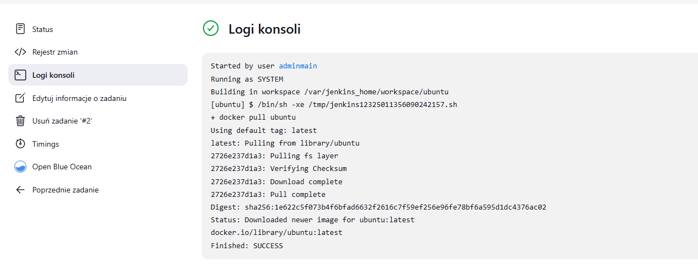
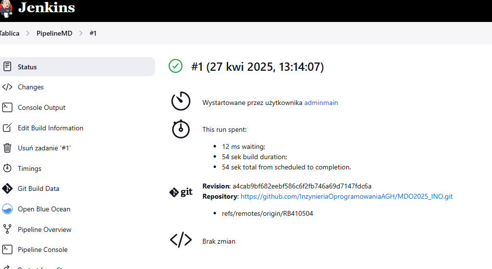
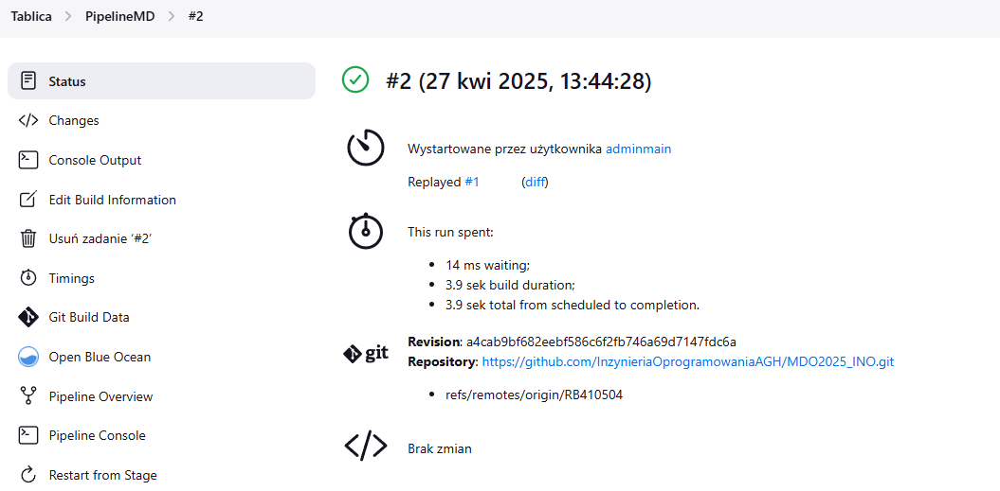
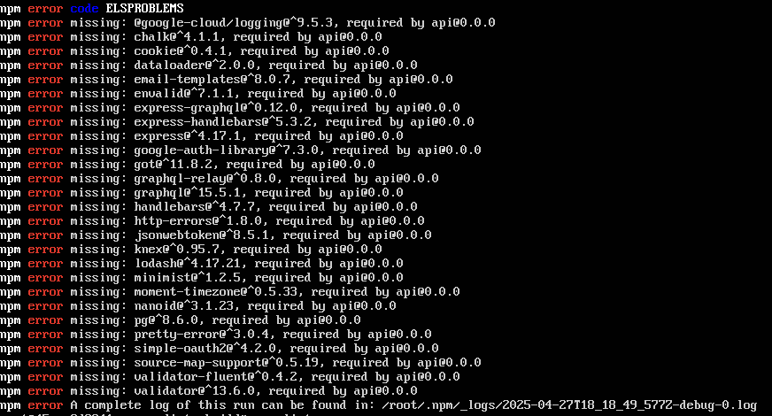
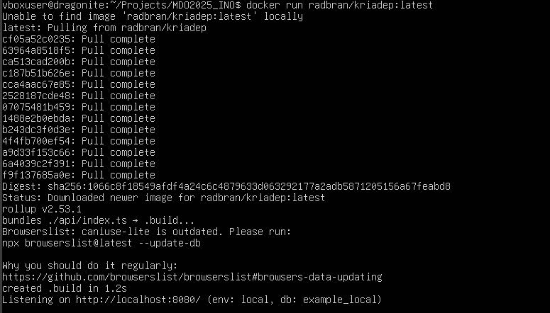

# Pipeline, jenkins, izolacja etapów

Instalacja jenkins blueocean, który rozszerza gui jenkinsa i poprawia user experience została opisana w poprzednim sprawozdaniu.

## Utworzenie projketu uname

W panelu jenkins utworzyłem nowe zadanie, wybrałem ogólny projekt, a następnie w zakładce configure w kroku build dodałem shell command, gdzie wpisałem uname -a

Następnie w celu wykonania drugiego kroku powróciłem do konfiguracji i zmieniłem uname -a na: 

    #!/bin/bash
    HOUR=$(date +%H)
	if [ $((10#$HOUR % 2)) -ne 0 ]; then
	  echo "❌ Godzina $HOUR jest nieparzysta, build failed."
	  exit 1
	else
	  echo "✅ Godzina $HOUR jest parzysta, build OK."
	fi
	
Należy użyć tutaj bin/bash ponieważ domyślnie jesteśmy w sh, które nie rozumie niektórych składni przez co zwraca błąd. Alternatywnie możemy użyć 

    bash -c 'KOD DO WYKONANIA W BASH'

Następnie próbując wykonać docker pull ubuntu natknąłem się na następujący błąd:

Docker nie mógł połączyć się z serwerem. Po dłuższym dochodzeniu okazało się, iż kontener z dind się wyłączył, przez co połączenie nie mogło zostać nawiązane. Ponowne uruchomienie dind wg. instrukcji z instalacji blue-ocean z poprzednich zajęć rozwiązało problem i jenkins pomyślnie wykonał docker pull ubuntu.

## Pipeline

Pipeline to ciąg instrukcji, który automatyzuje proces instalacji oprogramowania. 

W jenkins utworzyłem projekt typu pipeline, a następnie zbudowałem skrypt pipelinu:

	pipeline {
    agent any

    stages {
        stage('Clone') { 
            steps {
                git branch: 'RB410504', url: 'https://github.com/InzynieriaOprogramowaniaAGH/MDO2025_INO.git'
            }
        }

	        stage('Build') {
	            steps {
	                dir ("INO/Gr01/RB410504/Sprawozdanie1")
	                {
	                    script {
	                        docker.build('node-from-jenkins', '-f Dockerfile.nodebld .')
	                    }
	                }
	            }
	        }
	    }
    }
    
Składa się on z dwóch etapów: Klonowania oraz buildu. 
Etap klonowania to nic innego niż sklonowanie naszego repo z zajęć i przełączenie się na mojego brancha. Podczas etapu budowania wchodzę do swojego folderu, gdzie znajduje się mój dockerfile do buildu i uruchamiam go za pomocą docker.build('Name','Params').
Instalacja przechodzi pomyślnie, zajmuje prawie minutę, co wynika z konieczności pobrania całego repo, zainstalowania zależności itd. Rebuild zaś wykonał się zaledwie w 4 sekundy - prawdopodobnie dlatego, że nie musiał pobierać kodu z repo, gdyż miał aktualny, tak samo jak wszystkie zależności potrzebne do buildu.

Mój zaplanowany proces wyglądał następująco:  

Pierwsze kilka kroków jest już zawartę powyżej, dodałem równiez jeszcze krok clean:

	docker builder prune -af 
	
aby nie pracować na cacheowanej wersji. 

Następnie:

Do deployu użyję kontenera buildowego z pełnym node. Nasz projekt jest odpalany przez yarn rollup, który tworzy nam .build, jednak uruchomienie go nadal wymaga wielu zależności:

yarn odpowiada za instalowanie tych zależności, przez co końcowo obraz node-slim kończy się tego samego rozmiaru jak zwykły node

Z tego powodu nie ma sensu tworzenie innego kontenera na deploy.

EDIT: Poprzednie notki o kontenerze deployowym są trafne, dlatego chcę je zachować zamiast usuwać jednak natrafiłem na pewne spostrzeżenie - Chcę, aby domyślny entrypoint to był start, aby samo uruchomienie detached kontenera pozwalało nam używać aplikacji bez wchodzenia do kontenera czy wiedzenia co uruchomić. Z tego powodu mój deployowy kontener to po prostu kontener na podstawie buildowego z entrypointem. 

Kod deploy:

	stage('Deploy'){
	            steps {
	                dir ("INO/Gr01/RB410504/Sprawozdanie2")
	                {
	                    script {
	                          def buildTag = env.BUILD_NUMBER
	                        def containerName = "KriadepVer_${buildTag}"
	                        def build = docker.build('radbran/kriadep:latest', '-f Dockerfile.kriadep .')
	                        def container = docker.image('radbran/kriadep:latest').run("--name ${containerName} -P")
	                        def portOutput = sh(
	                        script: "docker port ${containerName} 8080",
	                        returnStdout: true).trim()
	                        def hostPort = portOutput.split(":")[-1]
	                        echo "Kontener działa pod hostowym portem: ${hostPort}"
	                        env.HOST_PORT = hostPort
	                    }
	                }
	            }
	        }

W tym kroku dotarłem do pewnej rozbieżności z moim oryginalnym UMLem. Podczas deploya buduje i uruchamiam deployowy kontener na podstawie mojego buildowego, ale wypadałoby sprawdzić czy da się do takiego kontenera połączyć. I tu pojawiły się problemy:    

Po pierwsze alokowałem statycznie port za pomocą -p 8181:8080, przez co przy ponownym buildzie port był już zajęty i nie dało się go użyć. Z tego powodu przeszedłem na dynamiczną alokacje portu za pomocą -P , tylko wtedy trzeba go wyciągnąc za pomocą docker port name 8080 i zapisać do zmiennej środowiskowej, aby potem przy teśce połączenia móc do niego dotrzeć.
Druga rzecz, która sprawiła mi spore problemy - w środku jenkinsa połączenie do tak stworzonych kontenerów nie odbywa się za pomocą localhost  tylko sieci jenkinsa, w moim przypadku jenkins-docker.

	 stage('Check Server Availability') {
	            steps {
	                retry(20){
	                    script {
	                            def serverUrl = "http://jenkins-docker:${env.HOST_PORT}"
	                            def response = sh(script: """
	                                curl -s -o /dev/null -w "%{http_code}" ${serverUrl}
	                            """, returnStdout: true).trim()
	                            
                            writeFile file: 'test-conn.log', text: response
                            
                            if (response == '200') {
                                echo "Server is available (HTTP 200)"
                            } else {
                                error "Server returned error code: ${response}"
                            }
                    }
                }
            }
        }

Podczas testu połączenia łączę sę właśnie w ten sposób, przycinam response do 200 i próbuje 20 razy, jeśli nie uda się połaczyć to zwracam error.

Ostatnimi realizowanymi krokami w pipeline to publish i archiwizacja logów oraz wylogowanie.
	
	 stage('Publish'){
	            steps{
	                script{
	                    sh 'echo $DOCKERHUB_CREDENTIALS_PSW | docker login -u $DOCKERHUB_CREDENTIALS_USR --password-stdin'
	                    sh 'docker push radbran/kriadep:latest'
	                    }
	                }
	            }
	            
	        
    }
    post {
        always {
            sh 'docker logout'
            archiveArtifacts artifacts: 'test-conn.log', allowEmptyArchive: true
        }
    }
    

Tutaj warto zauważyć:  
Na początku skryptu zapisałem sobie credentialsy do docker-huba dodane w opcjach jenkinsa.

	environment{
	DOCKERHUB_CREDENTIALS=credentials('rb-dhb')
	}

A następnie zalogowałem się, zrobiłem pusha z odpowiednio nazwanym obrazem w formacie:  

username/repo:wersja

po czym się wylogowałem i w always zaarchiwzowałem artefakty, które do tej pory nie były zaarchiwizowane. 

Końcowo po udanej publikacji sprawdziłem czy rzeczywiście mój opublikowany obraz działa i za pomocą

	docker run radbran/kriadep:latest
	
Uruchomiłem ten obraz i otrzymałem tym samym pracujący serwer, tak jak oczekiwałem. 

Oraz w sensowniejszym detached modzie, w jakim chcemy, aby on pracował, dodatkowo dorzuciłem sobie port na jakim chce z nim rozmawiać za pomocą -p:

	docker run -d -p 8081:8080 radbran/kriadep:latest
	
I pomyślnie nawiązałem z nim połączenie:

