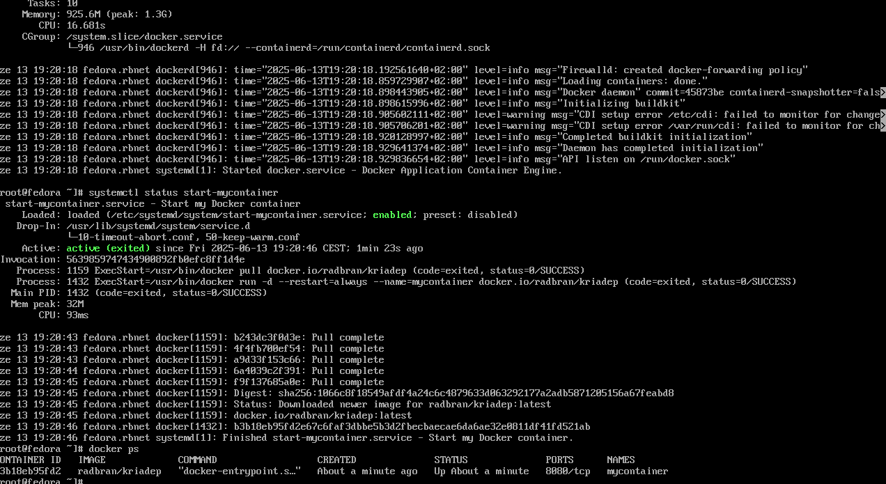
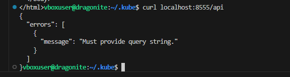
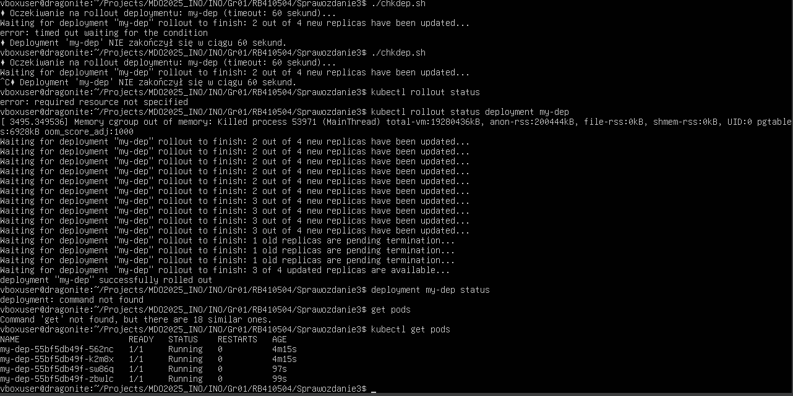

# Ansible

Pierwszym krokiem wykonania ansible było utworzenie drugiej vmki i połączenie się z nią przez ssh oraz wymiana kluczy, aby można było przystąpić do dalszej pracy. 
Pojawił się tu jednak pewien problem z połączeniem - Obie maszyny miały ten sam adres IP co powodowało problemy oraz nie rozpoznawały się po nazwach. Aby rozwiąać ten problem utworzyłem osobną sieć NAT do której połączyłem obie vmki dzięki czemu udało się nawiązać połączenie. Następnie użyłem ssh-copy-id, aby skopiować klucz z targetu ansible  dzięki czemu udało nawiązać sie połączenie bez hasła:

Następnie w /etc/hosts dopisałem ip, które zostało przydzielone maszynie ansible i nazwę dzięki czemu można się teraz połączyć z nią za pomocą user@Ansible 

Następnie, aby dokonać połączenia z pomocą Ansible utworzyłem plik inwentaryzacji, gdzie wpisałems główną maszynę jako orchesratora i target maszynę jako endpoint, dzięki czemu za pomocą ansible all -m ping mogłem połaczyć się z maszynami.
Początkowo pojawił się jednak problem, mianowicie na mojej maszynie ansible pracuje na użytkowniu ansible, jednak główna maszyna używa użytkownika vboxuser przez co nie jest w stanie się połączyć automatycznie, bez określenia użytkownika za pomocą -u. W tym celu wymagana jest modyfikacja pliku inwentaryzacji i określenie endpointu jako ansible@Ansible , specyfikując użytkownika, a nie tylko domenę.

Następnie utworzyłem playbook, gdzie stworzyłem dwie procedury, jedna dla hosts: all, która wykonuje ping, a druga , która wykonuje się tylko dla endpointów. Jak widać wszystko wykonało się pomyślnie, a copy wykazało zmianę plików na maszynie endpoint, zgodnie z oczekiwaniami.
Playbook uruchomiony został komendą    
     
     ansible-playbook -i inv playbook.yaml

Rozszerzenie playbooka o update/reset usług okazał się problematyczny. Uruchomienie tych komend wymaga uprawnień roota, których nie chcemy nadawać użytkownikowi ansible, więc potrzebne jest nam inne rozwiązanie. Uruchamiam tę metodę za pomocą instrukcji become, która pozwoli nadać nam uprawnienia sudo oraz na maszynie targetowanej w /etc/sudoers dopisuje użytkownika ansible jako nopasswd. 
to pozwala nam na zaktualizowanie i zresetowanie usług. Jak widać kopiownie plików zostało juz oznaczone jako ok, a nie changed, ponieważ są one identyczne.

Error jest spowodowany tym, że nie ma paczki rngd na maszynie docelowej oraz sudo apt insall nie znajduje takiej paczki, więc jestem zmuszony pominąć ten krok. (ew można dodać ignore_errors)

Wyłączenie usługi ssh za pomocą stop i disable spodowowało, że pozostał aktywny socket, dzięki czemu ansible nadal funkcjonował (nie jestem pewien, czy taka była intencja polecenia), jednak po wyłączeniu karty sieciowej zacząłem otrzymywać błąd połączenia, jednocześnie zgodnie z tym czego bym się spodziewał, przez co nie jestem pewien jaki był cel wykonania tej operacji?

### Zarządzanie stworzonym artefaktem

Utworzyłem role node-starter-kit , gdzie w tasks/main.yaml będę definiował zadania do wykonania podczas jej uruchomienia.
Kolejno instaluje tam klucz gpg, potrzebne dependancies, repo dockera, docker engine. Następnie upewniam się, że usługa docker działa, dodaje ansible do użytkowników grupy docker, ściągam swój obraz i go uruchamiam. Następnie czekam, aż

    uri:
    	url: "http://ansible:{{host_port}}"

Zwróci kod 200. Jeśli tak to dowiedliśmy, że poprawnie nawiązano połączenie i można zatrzymać i usunąc kontener na maszynie docelowej.
W celu wykonania tej roli tworzę sobie playbooka, który uruchamia role, wybiera sobie hostów Endpoints , nadaje uprawnienia sudo do zainstalowania potrzebnych depów, definiuje zmienne jak host_port itd i wywołuje 

     roles:
     	- node-starter-kit
 

# Kickstart
Pobrałem system fedora 41 i zainstalowałem go. Następnie skopiowałem plik anaconda-ks i wrzuciłem go na githuba. Dokonałem w nim zmian, wrzuciłem url i repo z poleceń, zmieniając wersje z 38 na 41. Za pomocą

	network --hostname=fedora.rbnet

zmieniłem nazwę sieci oraz dodałem na końcu reboot,aby nie wymagane było kliknięcie guzika uruchom ponownie na końcu. Następnie przeprowadziłem kolejną instalację systemu robiąc kickstart utworzonym plikiem:

Dzięki czemu system sam przeprowadził całą instalacje bez konieczności żadnej ingerencji użytkownika. 
Następnie celem było zainstalowanie dockera i postawienia kontenera, który tworzyłem jako wynik pipeline jenkinsa. W tym celu dokonałem edycji kickstarta. Zainstalowałem docker za pomocą 
     
     curl -fsSL https://get.docker.com | sh

Nasepnie uruchomiłem jego serwis po czym chciałem dokonać pulla i uruchomić kontener. Jednak tutaj pojawia sę problem, podczas instalacji dockera nie działa docker daemon przez co nie zrobimy pulla/ nie uruchomimy kontenera. Obszedłem to w następujący sposób:  
Utworzyłem serwis, który uruchamia się jednorazowo (oneshot) kiedy docker.service będzie online, czyli po starcie systemu. Dzięki temu po uruchomieniu systemu obraz sam się pobiera i kontener uruchamia. 

# Kubernetes

Początkowo za pomocą

     curl -LO https://github.com/kubernetes/minikube/releases/latest/download/minikube-linux-amd64 
     sudo install minikube-linux-amd64 /usr/local/bin/minikube && rm minikube-linux-amd64

Pobrałem minikube oraz pomyślnie uruchomiłem.
Instalacja nie wymagała żadnych zmian uprawnień ani polityk, połączenia nawiązywane do pobrania były zabezpieczone protokołem https, więc jedynym potencjanym zagrożeniem jest sam kod źródłowy minicube.

Zaopatrzyłem się również w kubectl pobierając je ze pomocą

     curl -LO "https://dl.k8s.io/release/$(curl -L -s https://dl.k8s.io/release/stable.txt)/bin/linux/amd64/kubectl"

oraz zainstalowałem dzięki czemu można używać go w każdym folderze w systemie, nie tylko tam gdzie został pobrany
     
      sudo install -o root -g root -m 0755 kubectl /usr/local/bin/kubectl
      
Wymagania systemowe wg dokumentacji to:

2 CPUs or more
2GB of free memory
20GB of free disk space
Internet connection
Container or virtual machine manager, such as: Docker, QEMU, Hyperkit, Hyper-V, KVM, Parallels, Podman, VirtualBox, or VMware Fusion/Workstation

Moja maszyna ma przydzielone 4cpu, 4 gb ram oraz 50 gb miejsca oraz posiadam docker i połączenie internetowe. Jedynym potencjalnym bottleneckiem jest ram, jeśli inne aplikacje będą go znacząco obciążać, ale na mojej maszynie obecnie nie występuje takie zagrożenie.

Następnie dokonałem połączenia przez vscode do swojej vmki i za pomocą

     minikube dashboard

Uruchomiłem dashboard

Następne prace będę dokonywał z kontenerową aplikacją node-starter-kit, której używałem do tej pory.
Uruchomiłem poda za pomocą:

     kubectl run pod1 --image=docker.io/radbran/kriadep --port=8080
I za pomocą dashboardu i kubectl get pods można zobaczyć, że pod rzeczywiście działa

Następnie w celu nawiązania połączenia z podem wyeksponowałem port 8080 i ustawiłem port forwarding tak, żeby port 8083 z localhosta prowadził do 8080 gdzie nasłuchuje nasza baza danych. 

Pomimo błędu wykazaliśmy, że dotarliśmy do bazy danych, ponieważ poprosiła ona o query stringa.

### Tworzenie deploymentu

Aby nie pisać pliku yaml od zera utworzyłem deployment a następnie wyeksportowałem go za pomocą

    kubectl get deployment my-dep -o yaml > export.yaml

I na tym pliku rozpocząłem dalszą pracę. Dopisałem w nim jedynie port 8080 dla kontenera oraz możliwa jest w nim zmiana ilości replik, jednak można tego również dokonać za pomocą scale

Ustawiłem ilośc podów w deploymencie na 2, ponieważ przy 4 dostawałem czasem wiadomości o zabitych procesach i pomimo tego, że pody nadal działały był problem z połączeniem się z nimi.
Po zastosowaniu deploymentu, który przebiegł pomyślnie i utworzył 2 repliki

zrobiłem

    kubectl expose deployment/my-dep --port=8080

a nastepnie zrobiłem port forward

     kubectl port-forward service/my-dep 8555:8080
     
Dzięki czemu na porcie 8555 udało mi się połączyć z serisem deploymentu, czyli jednym z podów:

## Kubernetes 2

Początkowo przygotowałem 3 wersje obrazu deploymentu, z czego jedną końcącą się dyrektywą exit 1.

Po dłuższej zabawie ze zwiększaniem miejsca dla vmki i jej dockera udało mi się utworzyć deployment, który miał 8 replik:

Następnie przeskalowałem wdrożenie do 1 repliki po czym ponownie za pomocą

    kubectl apply -f export2.yaml

Dokonałem wdrożenia i utworzyłem skrypt, który oczekuje 60 sekund na wykonanie rolloutu.
Wszystko przebiegło pomyślnie, udało się nawet złapać moment, kiedy wszystkie pody poza jednym zostają wyłączane:

Następnie zmieniłem wdrożenie na 0 replik, który również ukończył się w zadane 60 sekund:

I zgodnie z oczekiwaniami na dashboardzie nadal widzimy deployment i replica set, jednak nie mamy żadnych podów.

Następnie przywróciłem deployment do stanu, gdzie miał on 4 repliki, skrypt złapał moment, w którym deployment jeszcze nie dokończył rolloutu , tylko ukończył 3/4 repliki.

i zgodnie z oczekiwaniami uzyskaliśmy 4 nowo utworzone pody:

Następnie zmieniłem wersję obrazu w deploymencie i tutaj rollout wykonał się zdecydowanie wolniej, poprzednie były praktycznie natychmiastowe jednak tutaj czas oczekiwania to było około 30-40 sekund:

Potem z ciekawości przywróciłem poprzednią wersję (nowa była trochę prostsza) i tutaj sytuacja znów się powtórzyła - rollout był bardzo długi, nie ukończył się nawet w zadane 60 sekund, tylko 3 minuty. Wydaje mi się, że natrafiłem tutaj na ciekawy przypadek -  po utworzeniu 2 podów zabrakło pamięci, więc kernel zabił jakiś proces żeby zwolnić to miejsce, a minikube i tak czekał i końcowo zakończył ten deployment, co spowodowało, że  2 pody utworzyły się w tym samym momencie a 2 kiedy pamięć została zwolniona

Niestety w tym momencie spróbowałem zrobić resize partycji dysku żeby rozszerzyć miejsce i pozbyć się problemu, przez co moja vmka już się nie bootuje i nie potrafię tego naprawić, a z racji, że nasze zajęcia już się kończą nie widzę sensu w dalszej próbie naprawy tej vmki / powtarzania wszystkiego odnowa, więc niestety tutaj zakończę sprawozdanie.