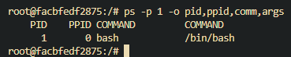
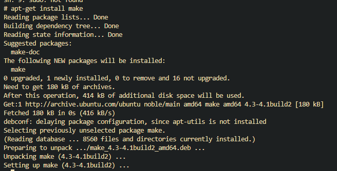
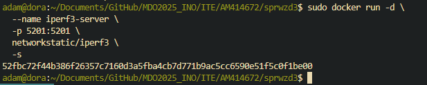

##Zajęcia 1

#1
#Instalacja git
Instalujemy git'a komentą 
sudo yum install/ apt-get install/ pacman -S (w zależności od dystrybucji linuxa) git

Opcjonolnie możemy dodać flage -y, tak aby automatycznie potwierdzić instalację.

Dobrą praktyką jest także ustawienie naszych danych. Robimy to przy pomocy komend:

git config --global user.name "imie" - ustawi globalnie imie osoby korzystającej z git'a na danej maszynie

git config --global user.email "mail" - ustawi globalnie mail osoby korzystającej z git'a na danej maszynie

Powyższe komendy zakładają, że będziemy korzystać z 1 konta na komputerze. W przeciwnym wybadku należy zmienić flagę global, na inną dającą pożadany efekt.

#2
#Klonowanie repozytorium przy użyciu https
Klonowanie repozytorium odbywa się w następujący sposób.

#3
#Tworzenie kluczy SSH
Klucz SSH tworzymy poprzez wpisanie pokazanej niżej komendy w której specyfikujemy typ klucza, oraz mail dla którego ma zostać wygenerowany. Następnie podajemy nazwę i lokację klucza, a finalnie mamy opcję dodania hasła.

Drugi klucz dodajemy adekwatnie, jednak przy zapytaniu o hasło klikamy enter.

#Konfiguracja klucza SSH, jako dostęp do GitHub'a

Wpisujemy komendę 

ssh-add lokacja_klucza/klucz

Utworzony zostanie plik klucz.pub, którego zawartość należy skopiować, a nasepnie udać się na stronę GitHub.com, a następnie kliknąć ikonę proflu i wybrać opcję Settings.

Następnie wybieramy zakładkę SSH and GPG keys

Teraz w zakładce SSH keys wybieramy New SSH key

Teraz należy podać wybraną naze klucza, oraz wkleić klucz z wyższego punktu.

#Klonowanie repozytorium przy użyciu SSH

Wykonujemy podaną niżej komendę.

#4
#Przełączanie gałęzi

Po wejściu do repozytrium wyświtlamy gałęzie komendą

git branch -a

Flaga -a wyświetla wszystkie gałęzie, nie tylko dostępne lokalnie.

Aby przełączyć gałąż wykonujemy 

git checkout -b nazwagałęzi zdalnagałąź

Tworzenie własnej gałęzi odbywa się w podobny sposób

#6
#Tworzenie katalogu

Katalog tworzymy komendą

mkdir nazwaKatalogu

#Tworzenie git-hook'a

Tworzymy plik o nazwie commit-msg z poniższą treścią.

#umieszczanie git-hook'a w odpowiednim katalogu.

Aby git hook działał należy go umieścić w .git/hooks zaczynając od root'a repozytorium, a także dodać uprawnienia do wykonywania pliku.

#Pushowanie do zdalnego repozytorium

Aby dodać brancha do zdalenego repozytorium należy wykonac następującją komendę

git push --set-upstream miejsce_odgałężenia gałąź

#Test commit-msg

Ponieżej zamieszczono źle, oraz poprawnie zformułowane message dla commita.

##Zajęcia 2

#1#
Aby zainstalować korzystamy z wybranego manager'a pakietów (yum, apt, dnf, etc), oraz słowem docker, np. 

sudo yum install docker 

#2#
Dokonujemy rejestracji na stronie DockerHub.com. Po operacji powinniśmy zobaczyć taki obraz

#3#
Pobieramy obrazy w następujący sposób.

#4#
Odpalamy i sprawdzamy wersje busybox w następujący sposób.

#5#
#Załączanie dockera#
Odpalamy kontener w następujący sposób.

#Sprawdzanie procesów
Aby sprawdzić aktualne procesy, uzywamy komendy top w następujący sposób.

Z kolei PID1 pokazujemy komendą podaną ponizej.

#Aktualizowanie pakietów#
Aby zaktualizować pakiety wykonujemy następujące polecenie w terminalu.

#Wychodzenie#
Aby wyjść uzywamy komendy exit.

#6#
Tworzymy Dockerfile.

Następnie budujemy kontener.

Odpalamy w trybie interaktywnym, oraz sprawdzamy czy repozytorium jest sklonowane.

Upewniamy się, e git jest pobrany.

#7#
Aby wylistować kontenery, naley wywołać podaną nizej komendę.

Usuwanie kontenerów odbywa się w następujący sposób.

#8#
Aby usunąć obrazy, nalezy wykonać ponizsą komendę.

#9#
Plik Dockerfile znajduje się w podfolderze lab2.

##Zajęcia 3

#0#
Repozytorium, które wybrałem to sds (simple dynamic string) do języka C.

Po pobraniu kompilujemy repozytorium w następujący sposób.

Następnie uruchamiamy testy.

#1#
Tworzymy Docerfile.

Buildujemy kontener.

Instalujemy potrzebne dependencies.

Po sklonowaniu repozytorium odpalamy make.

A następnie testy.

#2#
Tworzymy 2 pliki Dockerfile.

Następnie je budujemy. Na początku nalezly zbudować plik tworzący kontener.

#3#
Aby zweryfikować, czy build przebiegł pomyślnie wchodzimy w kontener i odpalamy testy.

#extra#
Aby uprościć wszystko do 1 pliku, uywamy Docker compose w następujący sposób.

Tworzymy plik yml.

W środku powinna znaleźć się następująca zawartość.

Composujemy plik yml, co w tym wypadku automatycznie odpali take testy.

##Zajęcia 4

#1#
Tworzymy woluminy w następujący sposób.

Klonujemy repozytorium na wolumin wejściowy.

Teraz tworzymy dockerfile bez git'a, ale z wymaganymi dependencjami.

Następnie naley zbudować container.

Odpalamy container z podpiętymi woluminami.

Po uzyciu make kopiujemy zawartość woluminu wejściowego na wolumin wyjściowy, oraz container.

Ponawiamy kroki, jednak tym razem klonujemy repozytorium wewnątrz kontenera, następnie wykonujemy make i kopiujemy zawartość.

#2#

Pobieramy obraz iperf3.

Odpalamy server i sprawdzamy jego ip.

Łączymy się z serwerem.

Teraz nalęzy stworzyć sieć mostkową.

Następnie nalezy dokonać połączenia mostkowego.

Aby połączyć się z kontenerem spoza kontenera, najpierw tworzymy server.

Teraz łączymy się po localhost'ie.

Kolejnympoleceniem jest zapisać logi połączenia. Zaczynamy od stwrzenia odpowiednich woluminów.

Teraz odpalamy połączenie z przekierowaniem wyników do woluminów.

Wyświetlamy zawartość logów.

#3#
Tworzymy sieć dla jenkins'a.

#[neting](lab4/creating_network_for_jenkins.png)

Odpalamy Server, wraz z dind.

Sprawdzamy hasło jenkinsa.

Upewniamy się, ze server pracuje.

Teraz w vs Code frwardujemy port, aby móc wyświetlić stronę na naszym komputerze.

Odpalamy stronę jenkins'a przez localhost i logujemy się hasłem z powyszego punktu.

