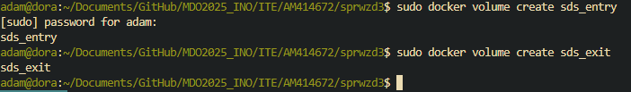
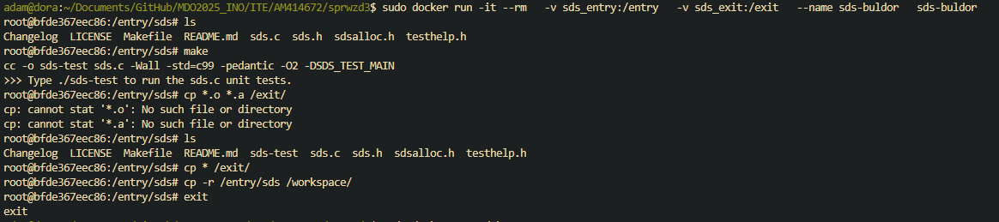
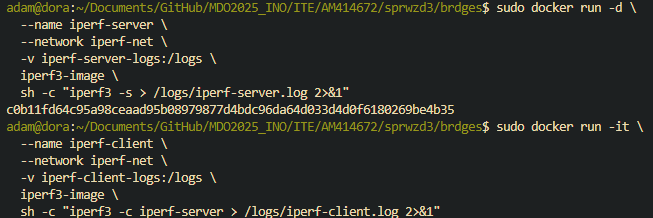
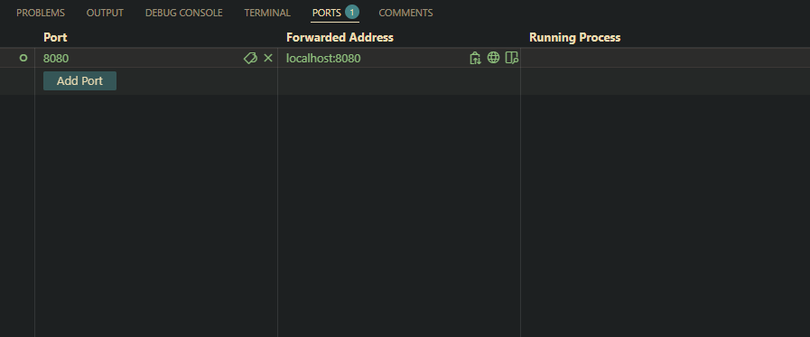
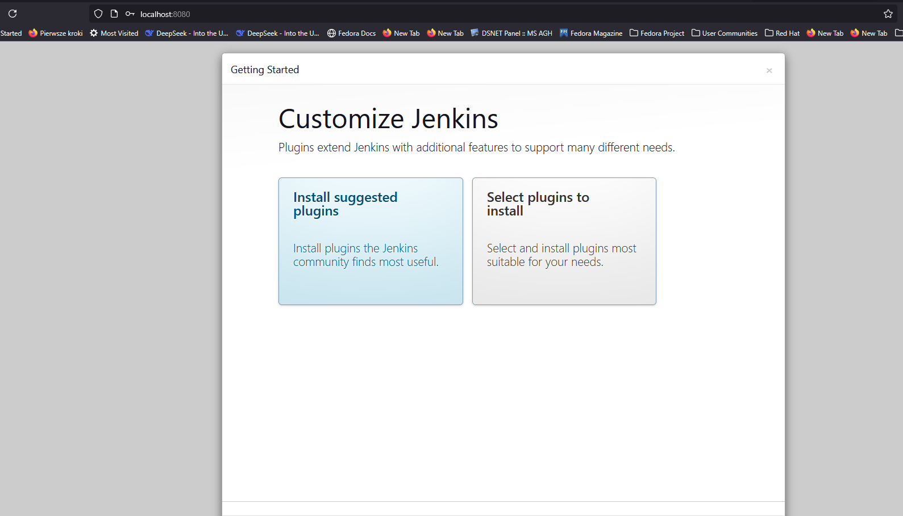

## Zajecia 4

# Woluminy

Tworzymy plik Dockerfile.

Budujemy kontener.

Tworzymy wolumin wejściowy i wyjściowy.

Kopiujemy repozytorium na wolumin wejściowy.

Odpalamy wolumin z podłączonymi woluminami wejściowym i wyjściowym, oraz sprawdzamy, czy repozytorium zostało poprawnie sklonowane.

Następnie budujemy nasz projekt.

Po zbudowaniu projektu, kopiujemy pliki na wolumin wyjściowy.

Kopiujemy pliki także na kontener.

W drugiej wersji nie kopiujemy repozytorium zewnętrznie, lecz wewnątrz naszego kontenera.

# iperf3

Pobieramy obraz iperf3 w dockerze.

Włączamy serwer iperf3 w Dockerze.

Zapisujemy adres IP naszego serwera w zmiennej, aby móc mieć do niego łatwy dostęp, oraz sprawdzamy, czy został poprawnie zapisany.

Łączymy się kontenerem z naszym serwerem podając mu jako IP naszą zmienną.

Następnie zatrzymujemy nasz serwer.

# iperf3 bridge

Tworzymy sieć którą wykorzystamy jako nasz bridge.

Tworzymy nasz kontener, oraz odpalamy naszą sieć.

Włączamy test naszej sieci.

# zapisywanie wyników testówa na woluminach

Tworzymy woluminy dla serwera i klienta.

Testujemy naszą sieć, oraz zapisujemy wyniki w odpowiednich woluminach.

Sprawdzamy zapisy w naszych woluminach.

# łączenie się z komputerem

Tworzymy serwer z którym będziemy się łączyć.

Instalujemy iperf3 na naszej maszynie.

Aby połączyć się z serwerem wystarczy użyć adresu localhost.

# Jenkins

Tworzymy sieć dla naszego serwera Jenkins.

Odpalamy serwer Jenkins wraz z opcją dind

Wyciągamy hasło do Jenkins'a.

Upewniamy się, że kontener pracuje poprawnie.

W ustawieniach VSCode forward'ujemy port 8080, tak aby można było odpalić Jenkins'a spoza maszyny wirtualnej.

Logujemy się na Jenkins'a przy użyciu wyciągniętego wcześniej hasła.

## lab 5

Tworzymy sieć dla Jenkins'a.

Odpalamy nasz serwer Jenkins.

Tworzymy plik Dockerfile dla Jenkins'a z dodatkiem blueocean

Budujemy kontener.

Odpalamy serwer Jenkins z dodatkiem blueocean.

Forward'ujemy port 8080.

Wchodzimy na localhost:8080, gdzie pojawi się ekran logowania Jenkins.

Aby znaleźć hasło do Jenkins'a sprawdzamy logi.

Logujemy się na naszej stronie, oraz wykonujemy inicjalizację.

Po udanej 