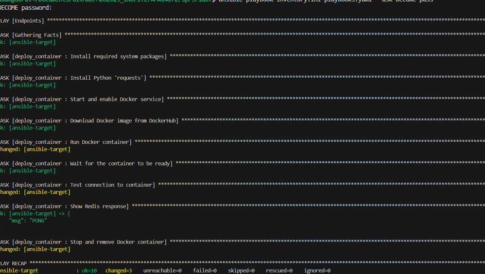
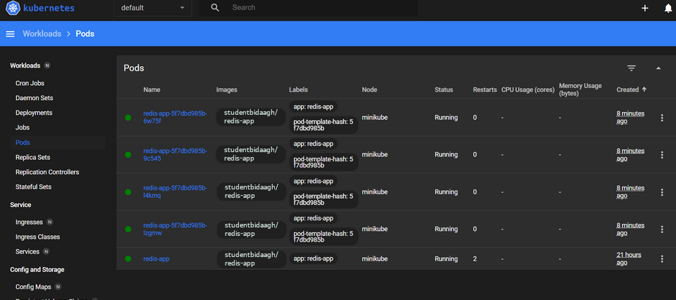

## Zajęcia 7

# Ansible instalacja

Tworzymy nową maszynę wirtualną, w tym wypadku także system Fedora 41.

Nadajemy nazwę komputera.

Następnie nadajemy nazwę i hasło użytkownika.

Następnie logujemy się na zainstalowany system.

Instalujemy tar, oraz upewniamy się czy serwer ssh jest zainstalowany.

Następnie należy stworzyć checkpoint naszej maszyny.

Na głównej maszynie instalujemy ansible.

Upewniamy sie czy instalacja przebiegła pomyślnie.

Opcjonalnym krokiem jest dodanie serwera i klienta do urządzeń zaufanych w ssh.

Sprawdzamy połączenie.

Dla lepszej widoczności ustawiamy nazwy obydwu maszyn.

Kolejnym opcjonalnym krokiem jest ustawienie aliasów dla adresów IP, co będzie działało tak samo jak serwer DNS.

Testujemy nowy sposób łączenia się.

W kolejnym kroku używamy pliku inventory.ini do sprawdzenia połączenia z maszynami w ten sposób.

Kolejną częścią zadania jest utworzenie pliku playbook1.yaml, odpowiedzialnego za wykonanie ping na maszynach, wysłanie na nie poprzedni plik, wykonanie na wszystkich systemach aktualizacji, oraz restart sshd i rngd.

Sprawdzamy poprawność pliku.

Aby sprawdzić zachowanie się maszyny w wypadku problemu, wyłączamy serwer ssh na 2 maszynie.

Sprawdzamy zachowanie się ansible.

Tworzymy kolejy plik playbook. Jego zadaniem jest zbudowanie, oraz uruchomienie kontenera z DockerHub, a także połączenie się z nim.

Testujemy działanie pliku.

## Zajęcia 8

Nasz plik anaconda-ks.cfg po umieszczeniu w wybranym miejscu na dysku należy przypisać do naszego konta.

Następnie należy zmodyfikować plik, np. formatowanie całego dysku, zmiana hostname, etc.

Nastepnie tworzymy maszynę, jednak podczas instalacji należy wybrać opcję modyfikacji parametrów jądra. Należy skonfigurowac parametr inst.ks={położenie pliku}.

Następnie dokonujemy standardowej instalacji.

Po dokonanej instalacji ukaże się nam system operacyjny.

Kolejna część zadania polegała na rozszerzeniu możliwości pliku o automatyczne zainstalowanie repozytoriów niezbędnych do uruchomienia pipeline. Całość znajduje się 2 pliku anaconda-ks-2.cfg.

Po uruchomieniu pliku sprawdzamy czy został utwożony kontener z pipeline.

## Zajęcia 9

Na początku instalujemy minikube.

Przydatnym narzędziem jest conntrack ułatwiające użytkowanie sieci z minikube.

Następnie odpalamy minikube.

Sprawdzamy wynik odpalenia programu.

Kolejnym krokiem jest odpalenie internetowego dashboardu programu i połączenie się z nim poprzez przeglądarke.

Odpalamy następnie naszą aplikację w dockerze.

Sprawzamy czy działa poprzez przeglądarkę.

Aby połączyć się z kontenerem, należy przekierować port.

Następnie sprawdzamy połączenie.

Kolejnym krokiem jest utworzenie deploymentu, przy pomocy pliku redis-deployment.yaml

Sprawdzamy status rollout'u aplikacji.

Następnie eksportujemy port aplikacji w celu korzystanie z niej z zewnątrz.

Kolejnym krokiem jest przekierowanie aplikacji na odpowiedni port.

Następnie sprawdzamy połączenie po raz kolejny.

Te kroki można również zaobserwować na interfejsie przeglądarkowym.

Deplyments utworzone po wykonaniu tych kroków.

POdy po wykonaniu tych kroków.

Kolejnym podpunktem było wytworzenie błędu, w tym celu należy zmodyfikować dockerfile podstawowy, a następnie go zbudować, oraz wyłać go na DockerHub.

Nastepnie sprawdzamy DockerHub, aby upewnić się, że wszystko przebiegło pomyślnie.

Nastepnym krokiem jest zmienienie ilości replik w deploymencie.

W kolejnym kroku zmieniliśmy wersję programu z 1.0.30, na 1.0.29.

Po zmianie możemy zaobserwować zmianę na witrynie internetowej.

Sposobem na zaobserwowanie historii deploymentu jest poniższa komenda.

W kolejnym kroku należało sprawdzić wadliwy deploy programu.

Jak możemy zaobserwować próby wdrażania wadliwej wersji kończą się niepowodzeniem.

Sprawdzamy nasze pody, jak można zaobserwować wadliwa wersja deploy'a zwraca błąd.

Aby naprawić deploy wracamy do poprzedniej wersji programu następującą komendą.

Po ponownym sprawdzeniu strony widzimy, iż działa na dawnnej wersji.

Aby uzyskać informację o konkretnym deploy'u możemy użyć następującej funkcji.

W kolejnym kroku tworzymy plik check-deploy.sh, który sprawdza, czy deploy udał się w przeciągu 60 sekund.
Uruchamiamy go w następujący sposób.

Ostatnią częscią zadania jest wdrożenie wersji programu w różniący się od siebie sposób.
W tym celu tworzymy kolejny plik yaml, noszący nazwę redis-app-canary.yaml.

Następnie deploy'ujemy go w nasepujący sposób.

Powstałe deploy'e możemy sprawdzić w przeglądarce.

