# Sprawozdanie 1

## Lab 1

Zainstalowałem klienta Git i obsługę kluczy SSH.  
Sklonowałem repozytorium przedmiotu za pomocą HTTPS i personal access token:

```bash
git clone git@github.com:InzynieriaOprogramowaniaAGH/MDO2025_INO.git
```

Następnie stworzyłem 2 klucze SSH, inne niż RSA i jeden z nich zabezpieczyłem hasłem:

```bash
ssh-keygen
```

Weryfikacja dostępu do repozytorium jako uczestnik i klonowanie przy użyciu klucza SSH:  
Wygenerowano klucz SSH typu **ed25519** zabezpieczony hasłem. Otrzymałem 2 klucze (prywatny i publiczny), zapisane w folderze `.ssh`:

```bash
ssh-keygen -t ed25519 -C "igorkita2003@gmail.com"
```

Następnie dodałem klucz do GitHuba:  
`Settings > SSH and GPG keys > New SSH key`


Repozytorium zostało ponownie sklonowane z użyciem SSH:

```bash
git clone git@github.com:InzynieriaOprogramowaniaAGH/MDO2025_INO.git
```

Skonfigurowałem również 2FA:


---

### Git Hook - commit message

Stworzyłem katalog ze swoimi inicjałami i numerem indeksu oraz napisałem hooka sprawdzającego poprawność commit message:

```python
#!/usr/bin/python
import sys

with open(sys.argv[1], 'r') as file:
    commit_msg = file.read().strip()

is_correct_msg = commit_msg.startswith("IK414819")

if not is_correct_msg:
    print("incorrect commit message")
    sys.exit(1)

sys.exit(0)
```

---

## Lab 2

Zaktualizowałem system Fedora.  
Zarejestrowałem się w Docker Hub i zainstalowałem Dockera.  
Pobrałem obrazy: `hello-world`, `busybox`, `fedora`, `mysql`:

```bash
sudo docker run <nazwa_obrazu>
```

Uruchomiłem kontener z obrazem **busybox** w trybie interaktywnym i wyświetliłem wersję:


Uruchomiłem system Fedora w kontenerze:


Zainstalowałem `ps` i wykonałem `ps aux`:


Wyświetliłem proces P1D1:


---

### Budowanie obrazu z Dockerfile

Stworzyłem plik `Dockerfile`, który:

- aktualizuje system
- instaluje Git
- klonuje repozytorium

Użyłem polecenia:

```bash
docker build -t my_image .
```

  


Uruchomiłem kontener:

```bash
sudo docker run --name my_image -it my_image /bin/bash
```

Repozytorium zostało poprawnie pobrane.  
Następnie uruchomiłem i wyczyściłem kontenery:

  
  


Oczyściłem obrazy:


---

## Lab 3

Wybrałem oprogramowanie **irssi** napisane w C.

1. Skonowałem repozytorium do folderu `irssi`
2. Zainstalowałem zależności
3. Wykonałem build
4. Uruchomiłem testy jednostkowe

  
  


---

### Build w kontenerze

Uruchomiłem kontener Ubuntu:

```bash
docker run -it ubuntu /bin/bash
```

Zainstalowałem zależności:

```bash
apt update
apt install -y gcc make git pkg-config libtool libssl-dev libncurses-dev perl perl-modules
apt install -y cmake
apt install -y libglib2.0-dev
```

Sklonowałem repozytorium w kontenerze:


Zainstalowałem `meson` oraz `ninja`:


Uruchomiłem testy jednostkowe:


---

### Dockerfile

Stworzyłem dwa pliki:

1. **Dockerfile.build** – wykonuje build
2. **Dockerfile.test** – wykonuje testy (bez builda)

Zbudowałem obrazy:

  
  


---

## Lab 4

### Woluminy

Stworzyłem woluminy:

```bash
docker volume create irssi_input
docker volume create irssi_output
```

Sklonowałem repozytorium na wolumin wejściowy:

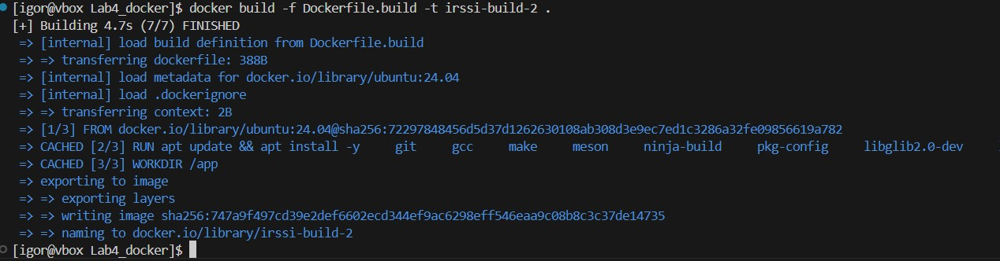  
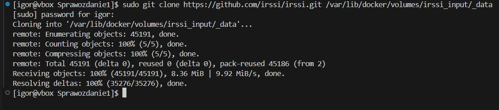

Uruchomiłem build w kontenerze:

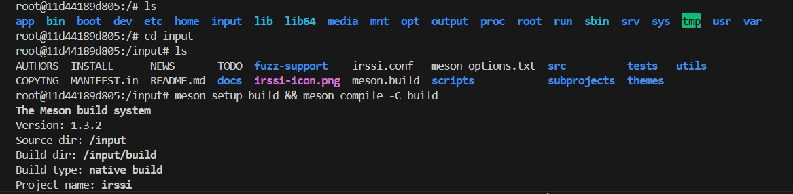  
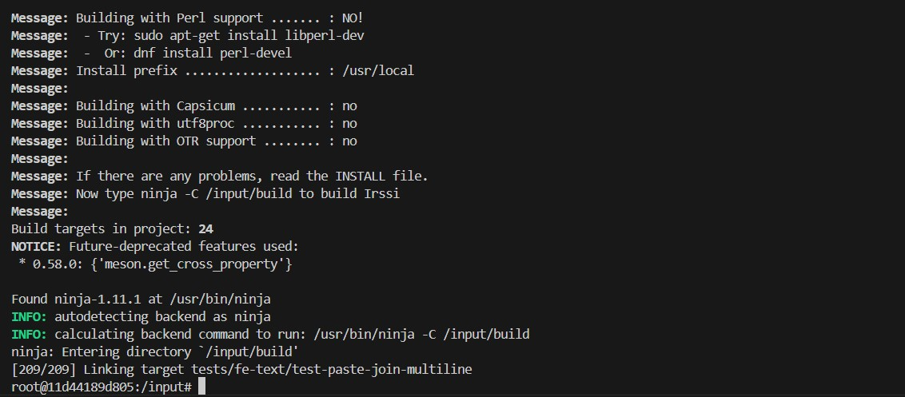

Przeniosłem build na wolumin wyjściowy:

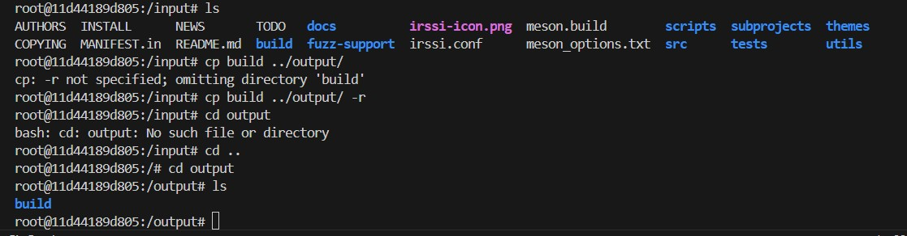

Można to zautomatyzować w `Dockerfile` przy użyciu:

```bash
RUN --mount=type=volume ...
```

---

### iperf

Uruchomiłem serwer **iperf** w kontenerze:

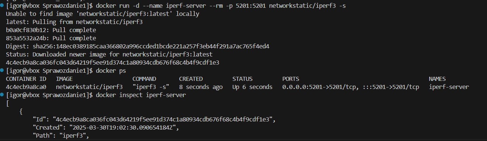

Uruchomiłem klienta i przetestowałem przepustowość (~30 Gbit/s):

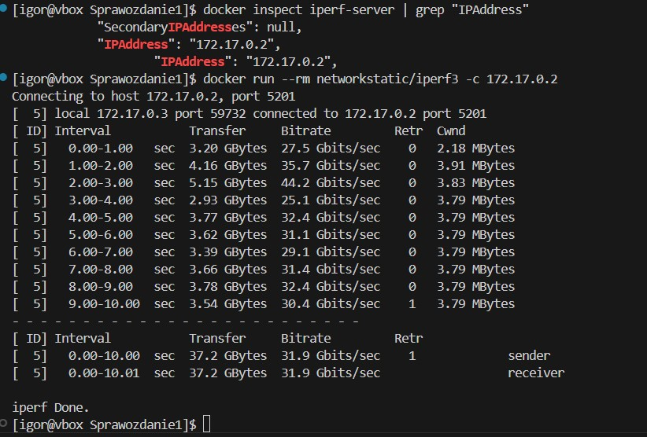

Podłączyłem kontener do własnej sieci mostkowej (~25 Gbit/s):

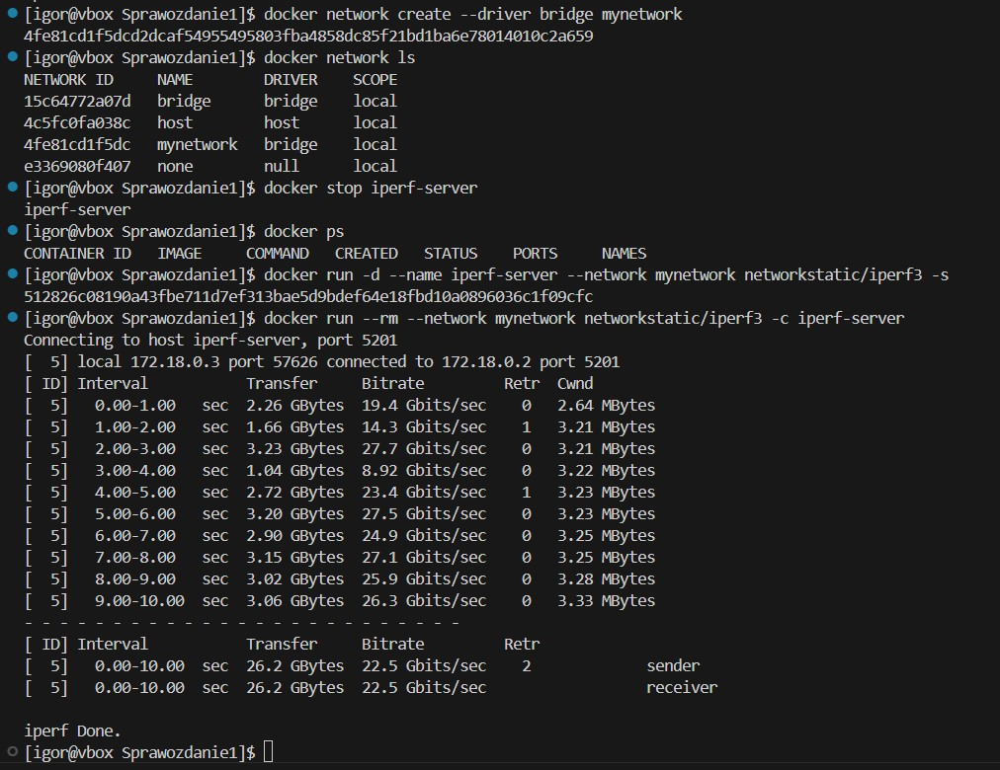

Na Fedorze przepustowość była niższa:

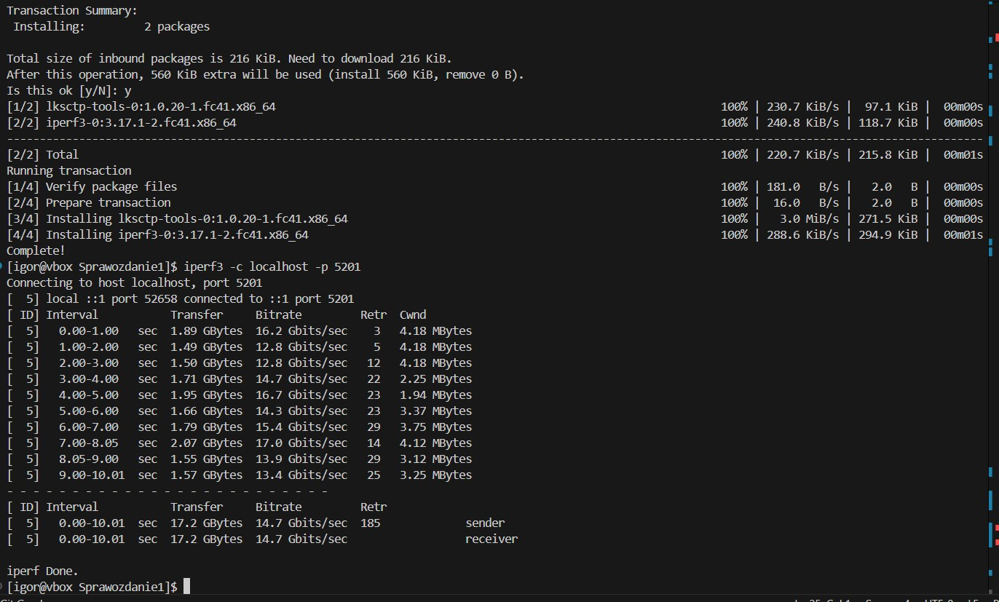

Z Windowsa połączyłem się przez SSH:

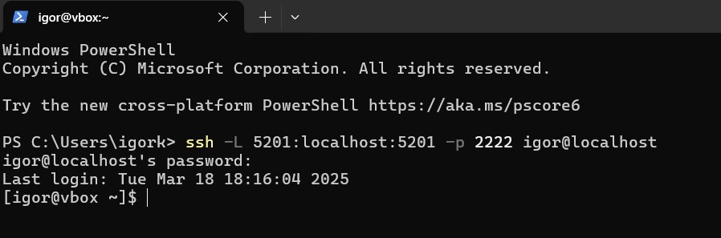  
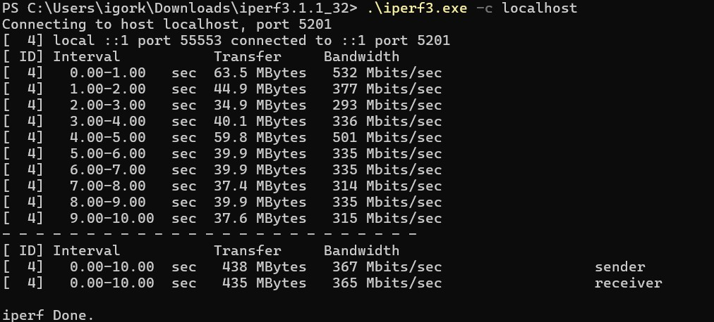

---

### Jenkins

Zainstalowałem instancję Jenkins z DIND.  
Zainicjalizowałem interfejs i przeszłem przez konfigurację:

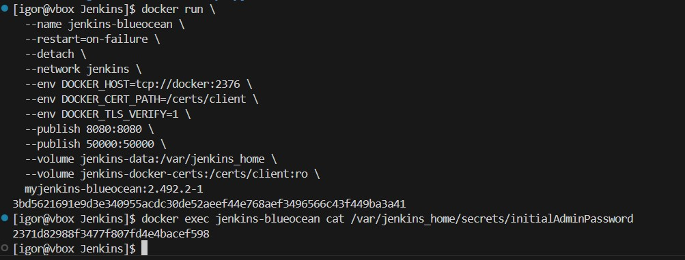  
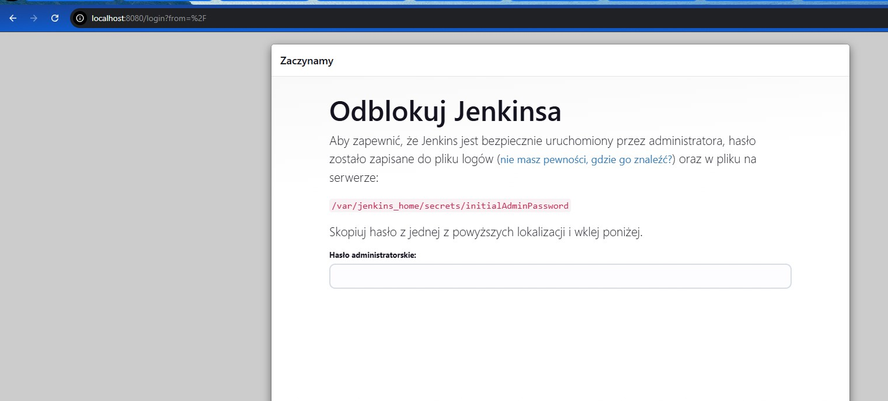  
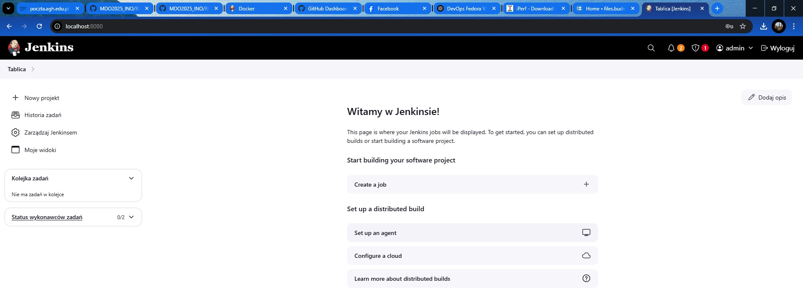