Sprawozdanie 1

Lab 1

Zainstalowałem klienta git i obsługę kluczy SSH
Sklonowałem repozytorium przedmiotu za pomocą HTTPS i personal access token. Wygenerowanie i zapisanie nowego tokenu:
    git clone git@github.com:InzynieriaOprogramowaniaAGH/MDO2025_INO.git
 Następnie stworzyłem 2 klucze SSH, inne niż RSA i jeden z nich zabezpieczyłem hasłem. 
    ssh-keygen

Weryfikacja dostępu do repozytorium jako uczestnik i klonowanie przy użyciu klucza SSH
W koljenym kroku wygenerowano klucz SSH o typie ed25519 zabezpieczony hasłem. Otrzymałem 2 klucze; prywatny i publiczny które zostały zapisane w folderze ssh.
8  ssh-keygen -t ed25519 -C "igorkita2003@gmail.com". 
 Potem skopiowano ten klucz i w githubie wybrano opcje Settings>SSH and GPG keys> New SSH key. Wklejono skopiowany klucz i zapisano.
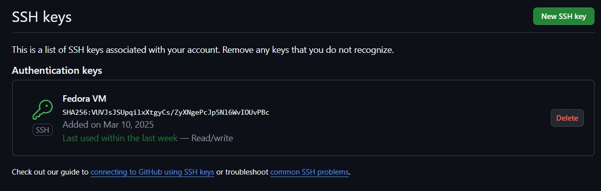


Skonfigurowałem klucz SSH, aby mieć dostęp do GitHuba, sklonowałem repozytorium z wykorzystaniem protokołu SSH za pomocą polecenia:
git clone git@github.com:InzynieriaOprogramowaniaAGH/MDO2025_INO.git
Dzięki temu po poprawnym uwierzytelnieniu repozytorium zostało pobrane lokalnie.
Następnie skonfigurowałem 2FA:
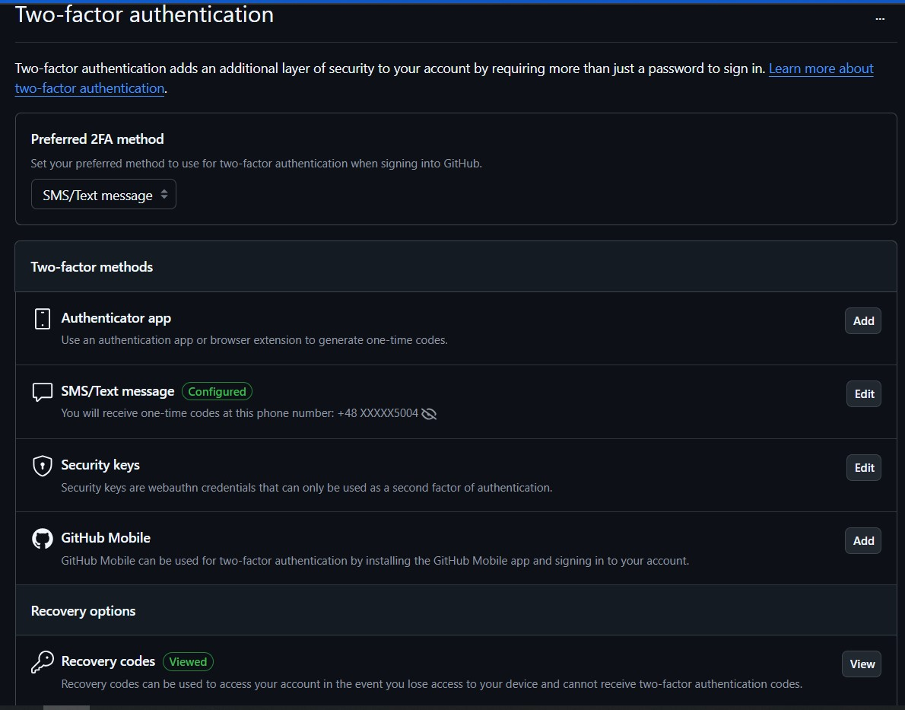

Git Hook - commit -msg:
Ostatnim krokiem było stworzenie katalogu ze swoimi inicjałami i numerem indeksu oraz napisanie git hooka weryfikującego, że każdy "commit message" zaczyna się od "inicjały & nr indexu" (w moim wypadku to "IK414819"). Treść tego skryptu znajduje się poniżej.
    
   ```python 
   #!/usr/bin/python
import sys

with open(sys.argv[1],'r') as file:
    commit_msg = file.read().strip()

is_correct_msg = commit_msg.startswith("IK414819")

if not is_correct_msg:
    print("incorrect commit message")
    sys.exit(1)

sys.exit(0)
```


Lab 2 

Zaaktualizowałem system Fefora, następnie zarejestrowałem się w usłudze Docker Hub, zainstalowałem w swoim środowisku Dockera i pobrałem następujące obrazy: hello-world, busybox, fedora oraz mysql, używając do tego polecenia: sudo docker run "odpowiednia nazwa". 
W kolejnym kroku uruchomiono kontener z obrazem busybox w trybie interaktywnym i wyświetlono informację o wersji

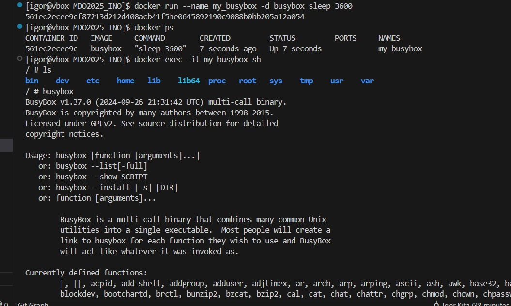

Następnie uruchomiłem system w kontenerze (czyli w moim przypadku kontener z obrazu Fedora).
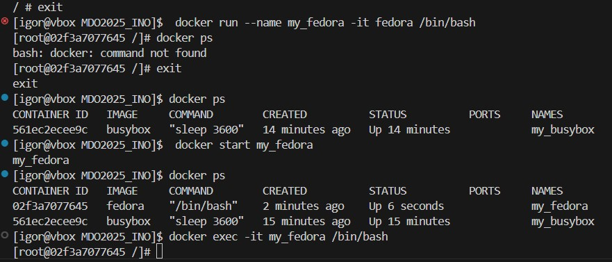

 Doinstalowałem w systemie ps, żeby wykonać ps aux. 
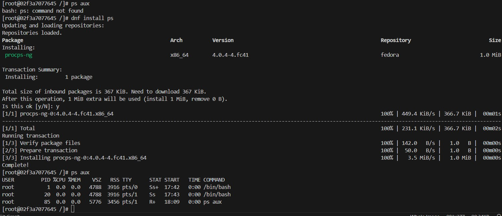

 Następnie wyświetliłem proces P1D1:

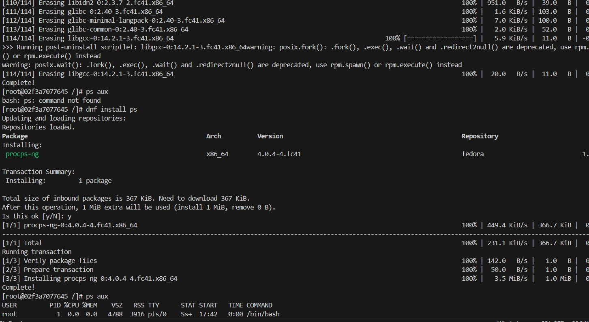

Zaktualizowałem pakiety i przeszedłem do dalszej części poleceń

Budowanie własnego obrazu Dockerfile
Kontener zbudowałem przy użyciu pliku Dockerfile, który aktualizuje system i instaluje Git za pomocą menedżera pakietów dnf. W pliku Dockerfile użyłem poleceń (dnf -y upgrade && dnf -y install git, git clone "nasze repozytorium"). Plik ten umieściłem również w folderze Sprawozdanie1 zgodnie z wymaganiami. Następnie budowałem obraz na podstawie instrukcji zawartych w pliku Dockerfile poleceniem docker build -t my_image

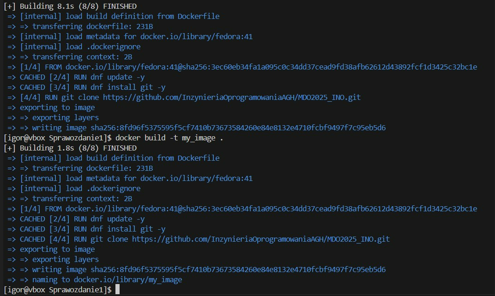

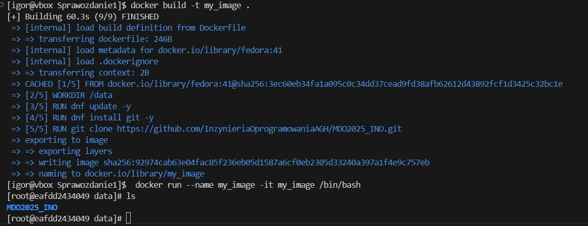
Uruchomiłem kontener w trybie interaktywnym poleceniem :
sudo docker run -- name my_image -it my_image /bin/bash
Na powyższym zdjęciu widzimy, że nasze repozytorium zostało pobrane, zatem krok został zrealizowany poprawnie.

Następnie uruchomiłem kontenery i je wyczyściłem.

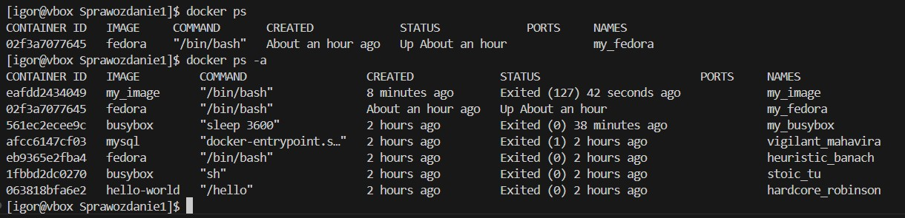

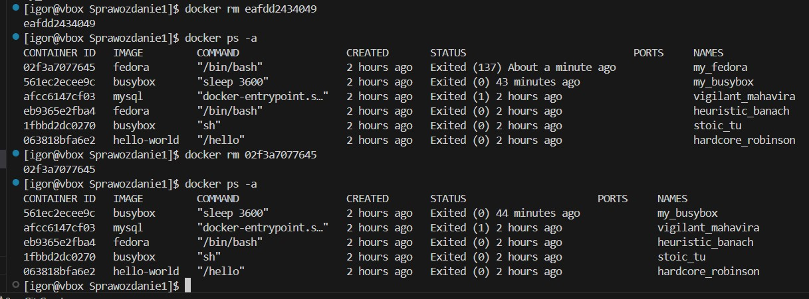
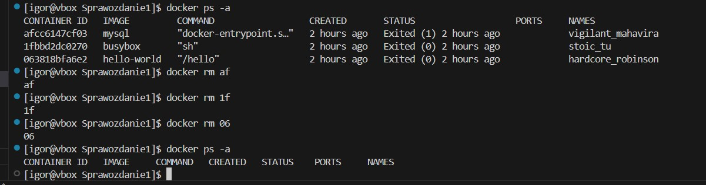

W kolejnym kroku wyczyściłem obrazy

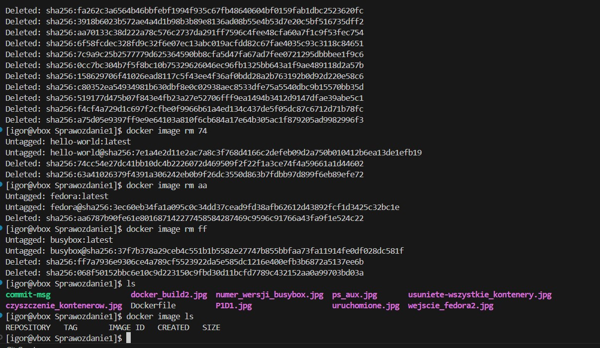


Lab 3

Na te zajęcia wybrałem oprogramowanie irssi napisane w języku C. Na początku skolnowałem repozytorium do folderu który nazwałem irssi. Zainstalowałem potrzebne Dependencies , przeprowadziłem build i uruchomiłem testu jednostkowe dołączone do repozytorium.

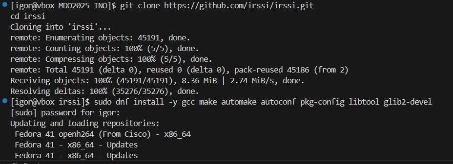

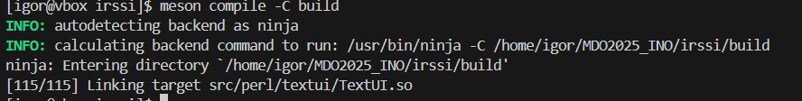

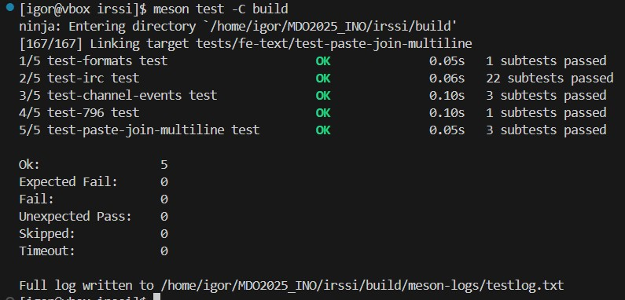

Po wykonaniu tych kroków przeszedłem do przeprowadzenia buildu w kontenerze. Wybrałem kontener Ubuntu dla aplikacji w C i wykonałem kroki bulid oraz test w kontenerze.

Uruchomiłem kontener poleceniem docker run -it ubuntu /bin/bash. 
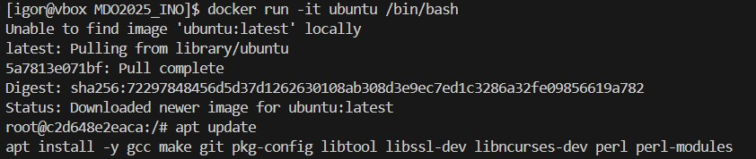

Następnie zainstalowałem wymgane zaelżności do zbudowania aplikacji w C, takie jak kompilator C git, make i inne biblioteki. Skorzystałem w tym przypadku z poleceń:

apt update
apt install -y gcc make git pkg-config libtool libssl-dev libncurses-dev perl perl-modules
apt install -y cmake
apt install -y libglib2.0-dev


Następnie sklonowałem repozytorium w kontenerze:

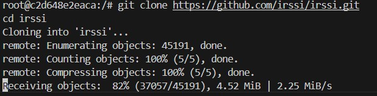

Po sklonowaniu rozpocząłem konfigurowanie środowiska i uruchomiłem build. Zainstalowałem meson oraz ninja w kontenerze:

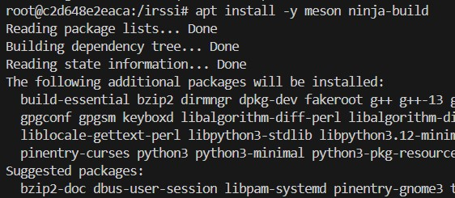

Następnie uruchomiłem testy jednostkowe:

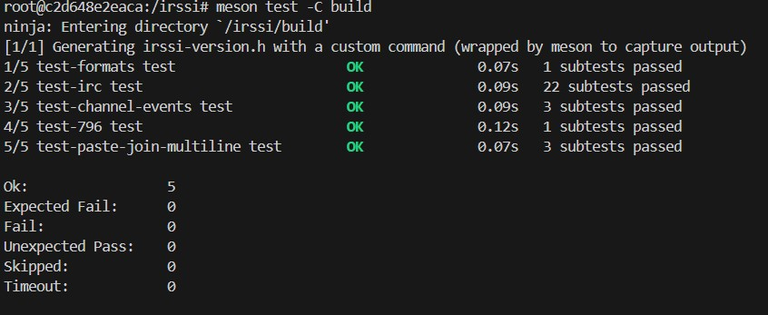

Wszystkie testy wyszły poprawnie.

Po wykonaniu poprzednich operacji przeszedłem do stworzenia 2 plików typu Dockerfile, których zadaniem było automatyzowanie wykonanych przeze mnie powyżej z uwzględnieniem wymagań:
Kontener pierwszy ma przeprowadzać wszystkie kroki aż do builda
Kontener drugi ma bazować na pierwszym i wykonywać testy (lecz nie robić builda!)

W tym celu stworzyłem te pliki Dockerfile, które umieściłem w osobnym folderze irssi-docker. Na ich podstawie najpierw zbudowałem obraz z pierwszego Dockerfila, następnie zdudowałem obraz testowy a na końcu uruchomiłem kontener testowy:

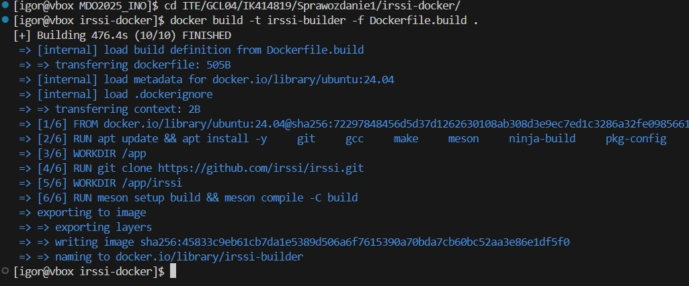

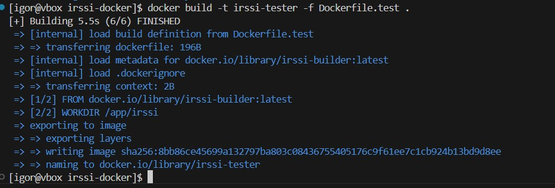

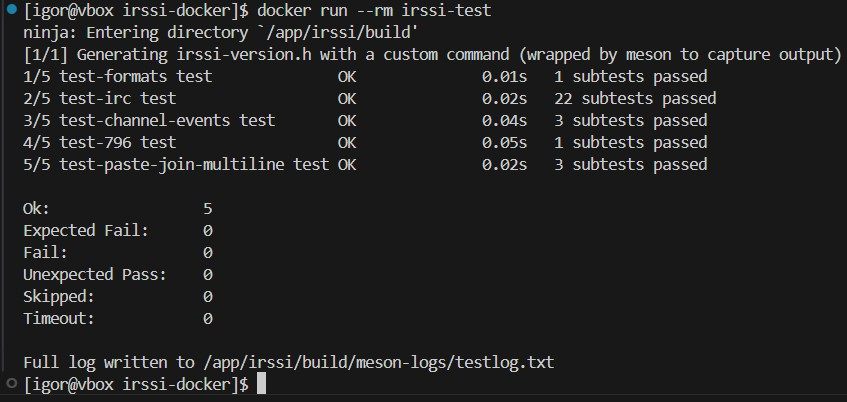

Kontener pracuje poprawnie wszystkie testy dały wynik pozytywny. Dockerfile.biuld buduje irssi, natomiast Dockerfile.test uruchamia testy lecz nie robi builda.

Obraz Dockera jest statycznym plikiem, który zawiera wszystkie zależności i instrukcje niezbędne do uruchomienia aplikacji. Po utworzeniu obrazu na podstawie Dockerfile, staje się on gotowy do użycia w kontenerze. Kontener to uruchomiona instancja obrazu, która działa na systemie operacyjnym hosta i może wykonywać zdefiniowane w obrazie zadania, takie jak uruchamianie aplikacji, kompilowanie kodu czy przeprowadzanie testów. W przypadku mojej aplikacji irssi, kontener utworzony z obrazu irssi-test uruchamia testy jednostkowe aplikacji, a po ich zakończeniu kontener jest usuwany.