# Sprawozdanie 2

## Laboratorium 5

W czasie tej części zajęć początkowo zająłem się sprawdzeniem, czy stworzone przeze mnie kontenery budujący oraz testujący działają poprawnie.

Zapoznałem się z instrukcją instalacji **Jenkinsa**. Następnie uruchomiłem obraz Dockera, który eksponuje środowisko zagnieżdżone, oraz skonfigurowałem Jenkinsa na porcie **localhost:8080**.

**Uruchomienie Jenkinsa:**

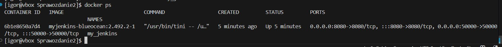

Po instalacji uruchomiłem **Jenkins BlueOcean**:

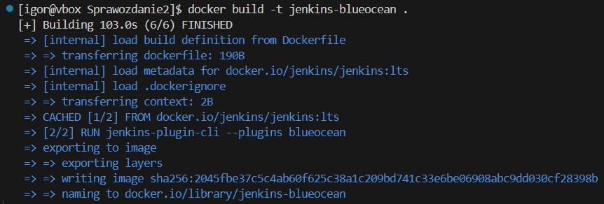

Zalogowałem się oraz skonfigurowałem Jenkinsa zgodnie z zaleceniami:

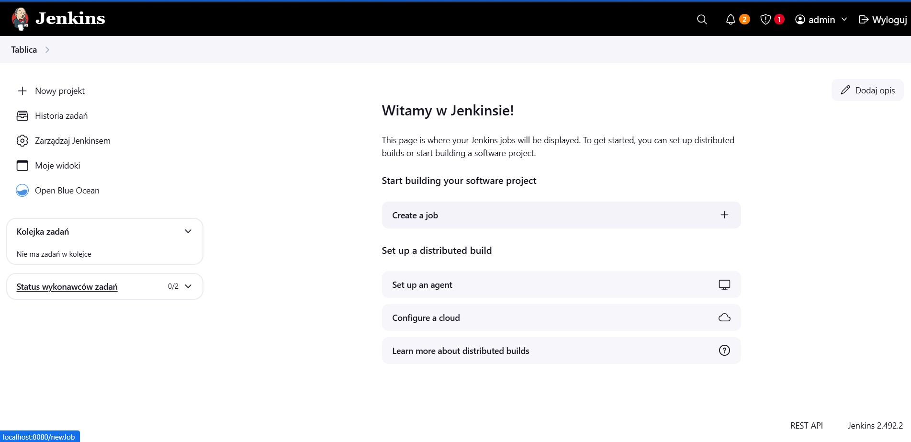

Kolejnym krokiem była konfiguracja archiwizacji logów oraz zabezpieczenia środowiska poprzez wykorzystanie wolumenu Dockera:

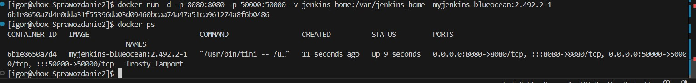

---

### Tworzenie wstępnych projektów

W dalszym etapie dokonałem konfiguracji oraz uruchomienia kilku wstępnych projektów w Jenkinsie:

1. **Projekt wyświetlający wynik komendy `uname -a`**:

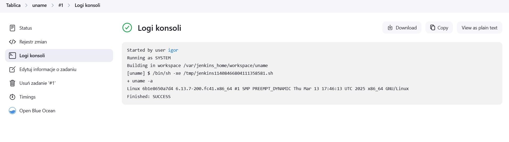

2. **Projekt, który zwraca błąd, jeśli aktualna godzina jest nieparzysta**. W tym celu wykorzystałem prosty skrypt `skrypt.sh`:

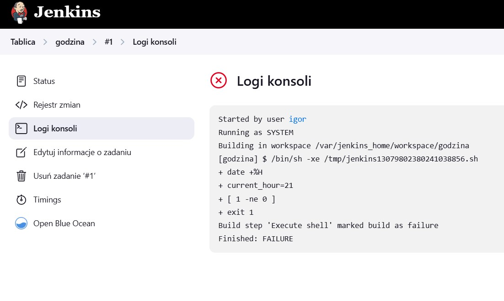

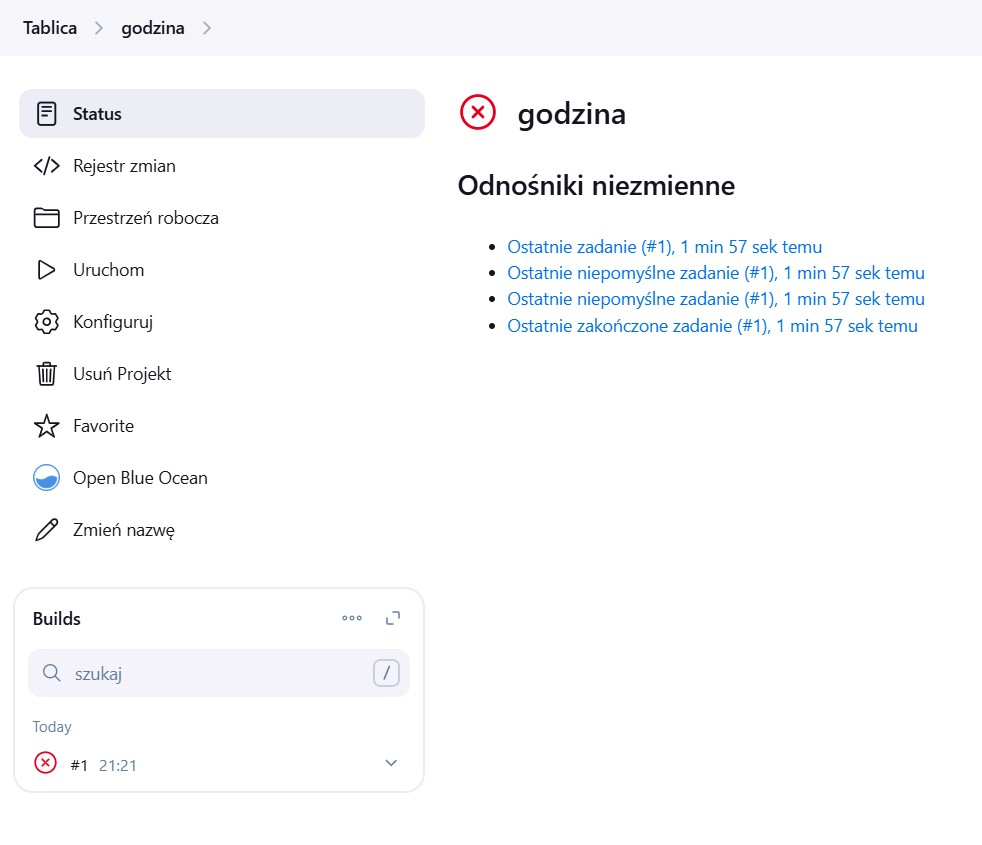

3. **Projekt pobierający obraz Ubuntu** przy użyciu `docker pull`. Aby to umożliwić, skonfigurowałem odpowiednio środowisko z użyciem **Docker-in-Docker (dind)**:

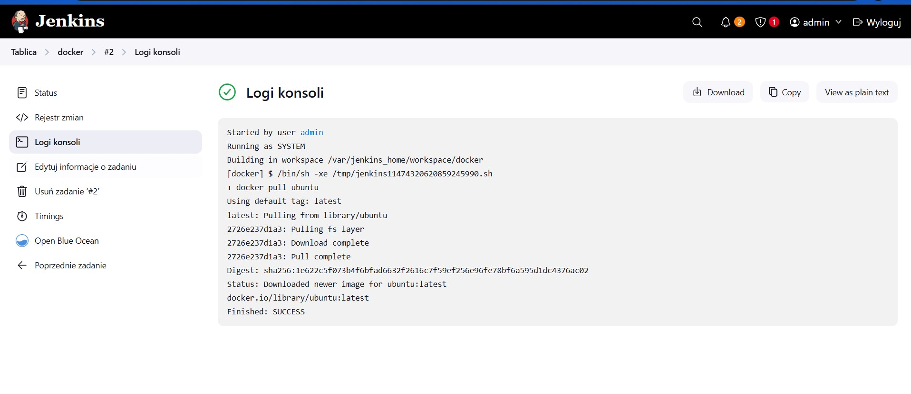

---

### Tworzenie projektu typu Pipeline

W kolejnym etapie utworzyłem projekt typu **pipeline**.

- Sklonowałem repozytorium przedmiotowe,
- zbudowałem nowy plik **Dockerfile**,
- uruchomiłem pipeline dwukrotnie, aby sprawdzić poprawność działania.

**Pierwsze uruchomienie pipeline:**

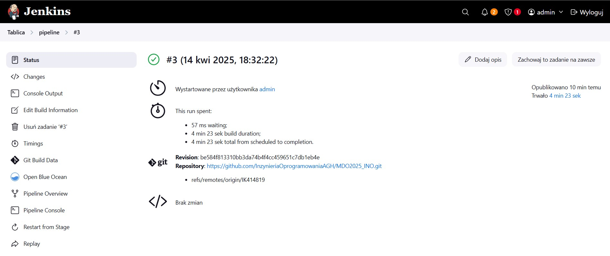

**Wynik działania pipeline:**

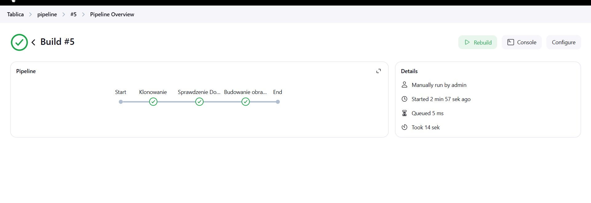

---

## Laboratoria 6 i 7

Podczas kolejnych zajęć moim celem było:

- wybranie projektu (aplikacji),
- wykonanie pełnego cyklu: **commit → clone → build → test → deploy → publish**.

Wybrałem aplikację **irssi**, z którą miałem już wcześniejsze doświadczenie podczas poprzednich zajęć. Tym razem jednak wykorzystałem ją do zupełnie innego celu.

Wszystkie pliki potrzebne do realizacji pipeline (`Dockerfile`, `Jenkinsfile`) umieściłem w specjalnym folderze **irssi_pipeline**.

Fragment planu projektu przedstawiony w **PlantUML**:

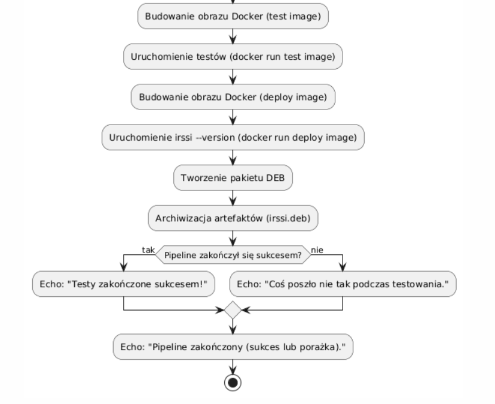

---

### Realizacja poszczególnych etapów projektu

Niektóre kroki, szczególnie **deploy**, były początkowo problematyczne. Starałem się jednak postępować zgodnie z instrukcjami i schematami przedstawionymi przez prowadzącego.

Ostatecznie udało mi się poprawnie zrealizować wszystkie wymagane etapy:

**Początek deploy:**

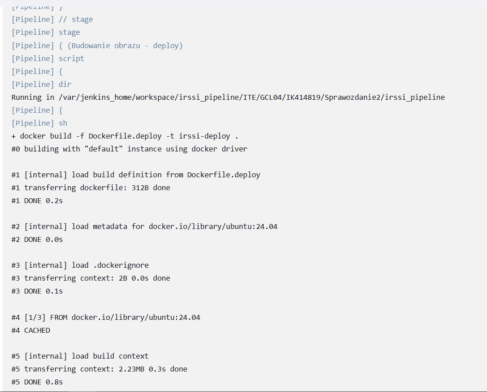

**Uruchomienie procesu deploy:**

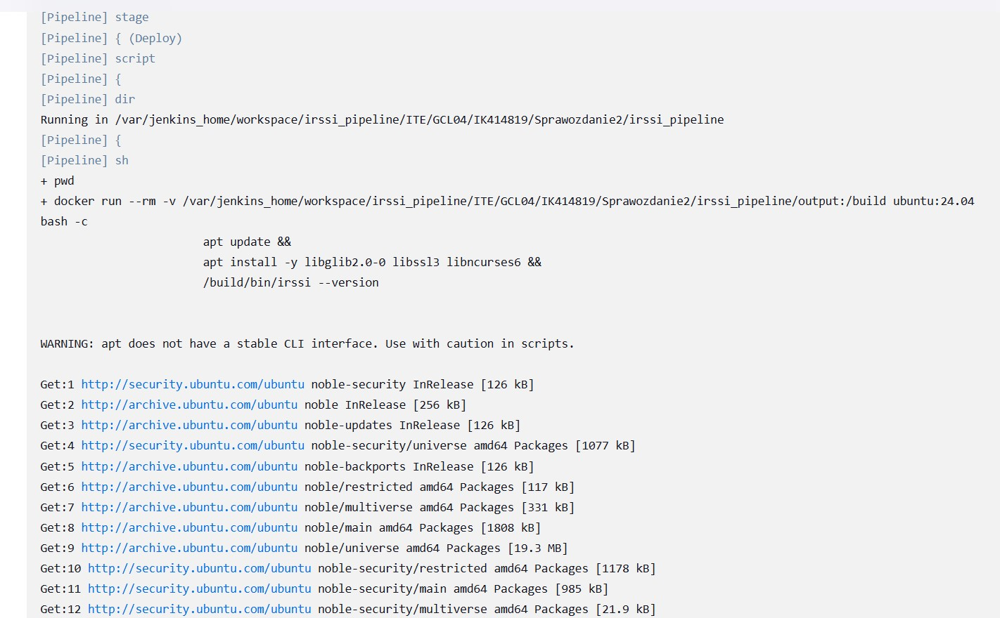

**Publikacja artefaktów:**

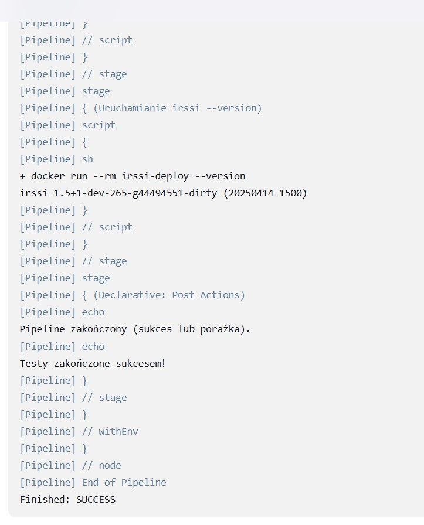

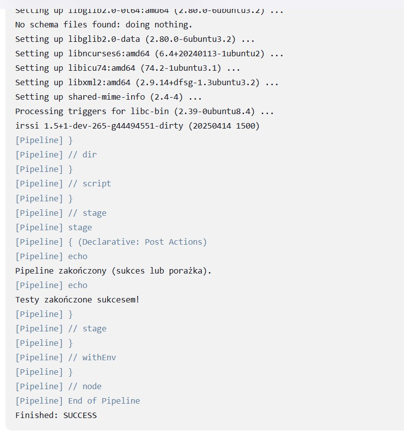

**Uzyskanie artefaktu i paczki `.deb`:**

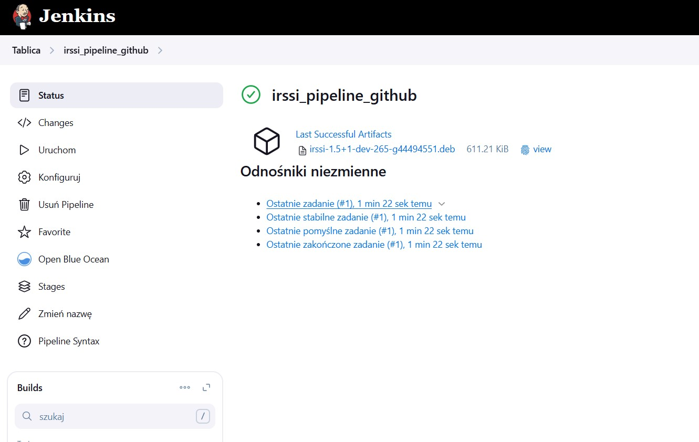

---

Dodatkowo do sprawozdania dołączyłem pobrany z Jenkinsa plik **console output** (#1.txt), dokumentujący poprawne wykonanie wszystkich etapów.

---

## Moje wnioski i spostrzeżenia

- Instalacja i podstawowa konfiguracja Jenkinsa w kontenerze Docker wymagała szczególnej uwagi, zwłaszcza przy eksponowaniu portów i zarządzaniu wolumenami.
- Projekt typu pipeline w Jenkinsie znacznie ułatwia automatyzację procesów, jednak konfiguracja środowiska (np. Docker-in-Docker) może być źródłem wielu potencjalnych problemów.
- Zrealizowanie pełnego cyklu (commit, clone, build, test, deploy, publish) umożliwiło mi zrozumienie, jak ważna jest automatyzacja procesów CI/CD w nowoczesnym rozwoju oprogramowania.
- Umiejętność przygotowania własnych plików Dockerfile oraz Jenkinsfile od podstaw pozwala lepiej zrozumieć zasady działania pipeline’ów i zwiększa elastyczność w pracy z różnymi projektami.
- Dzięki temu doświadczeniu zyskałem większą pewność w pracy z kontenerami oraz narzędziami typu Jenkins, co z pewnością wykorzystam w przyszłych projektach.

---

