# Sprawozdanie 3

## Lab 8 – Ansible

Ansible
 Celem tej części laboratorium było dla mnie: Automatyzacja i zdalne wykonywanie poleceń za pomocą Ansible
 Aby dokonać instalacji Ansible, utworzyłem nową "drugą" maszyne wirtualną z jak najmniejszym zbiorem zainstalowanego oprogramowania. Zastosowałem na niej ten sam system operacyjny, co mam na mojej głównej maszynie , czyli Fedorę. Zapewniłem ta również obacność wymaganych programów, tak, abym mógł w pełni zrealizować pozostałeme etapy. Nową maszynę zgodznie z zaleceniem prowadzącego  nazwałem "ansible-target". Nastepnie utowrzyłem użytkownika ansible. Wykonałem mogawkę maszyny. Na mojej głównej maszynie wirtualnej zainstalowałem oprogrmowanie Ansible z repozytorium dystrybucji. Dokonałem wymiany kluczy SSH między użytkownikiem w głównej maszynie a użytkownikiem ansible z nowej tak by logowanie ssh ansible@ansible-target mie wymagało podania hasła. W kolejnym kroku dokonałem inwentaryzacji systemów. Stworzyłem pliki inventory.ini oraz później playbook1.yaml.

Odpalenie przez SSH

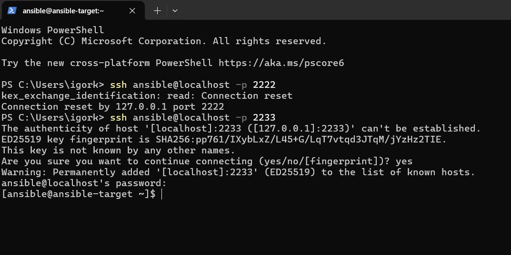

Próba połączenia SSH z maszyną ansible-target z poziomu Windows PowerShell.
Pierwsze podejście przez port 2222 kończy się niepowodzeniem (połączenie resetowane). Druga próba na porcie 2233 powiodła się – użytkownik potwierdził odcisk klucza SSH, a następnie zalogował się jako ansible@localhost. Potwierdziłem w ten sposób, że porty SSH mogą być mapowane różnie w zależności od konfiguracji maszyn wirtualnych i NAT/Port Forwarding w VirtualBoxie.

Briged Network

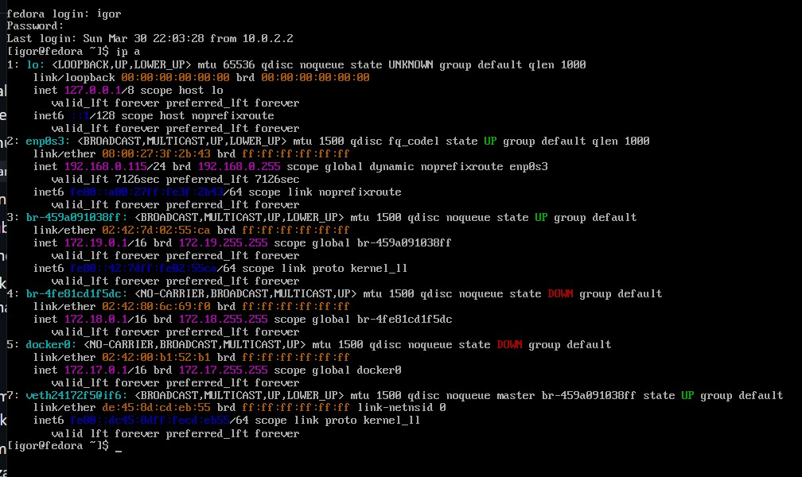

Zrzut ekranu przedstawia wynik polecenia ip a na maszynie z systemem Fedora.
Widać tutaj listę interfejsów sieciowych, z których aktywne są m.in. emp0s3 (z przypisanym adresem IP 192.168.0.115) oraz most br-459a091038ff używany przez Dockera (172.19.0.1). Interfejsy br-4f8c1d15dc, docker0 i veth są również widoczne, co świadczy to o działaniu kontenerów i sieci mostkowej (bridge) w środowisku DevOps.

Następnie za pomocą playbooka wykonałem ping do wszystkich maszyn:

Działający ping

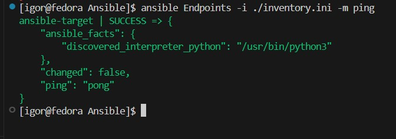

Playbook1

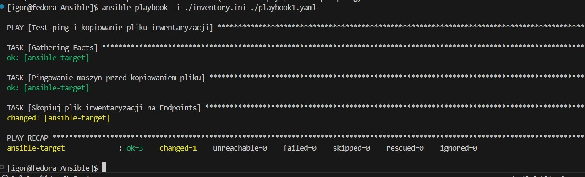

**Opis:**
Uruchomiono prosty playbook Ansible, który testuję połączenie (ping) z hostem oraz kopiuje plik inwentaryzacji. Wszystkie zadania zakończyłem sukcesem, przy czym kopiowanie pliku spowodowało zmianę na zdalnym hoście (changed=1).

Playbook2

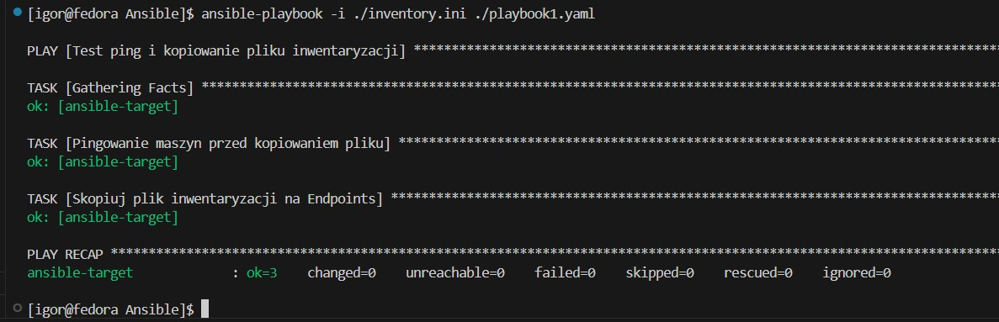

**Opis:**
Ponowne uruchomienie tego samego playbooka — tym razem changed=0, co oznaczało, że plik inwentaryzacji nie został ponownie nadpisany, ponieważ nie zaszły żadne zmiany. To dowód na działanie idempotencji w Ansible.

Playbook3

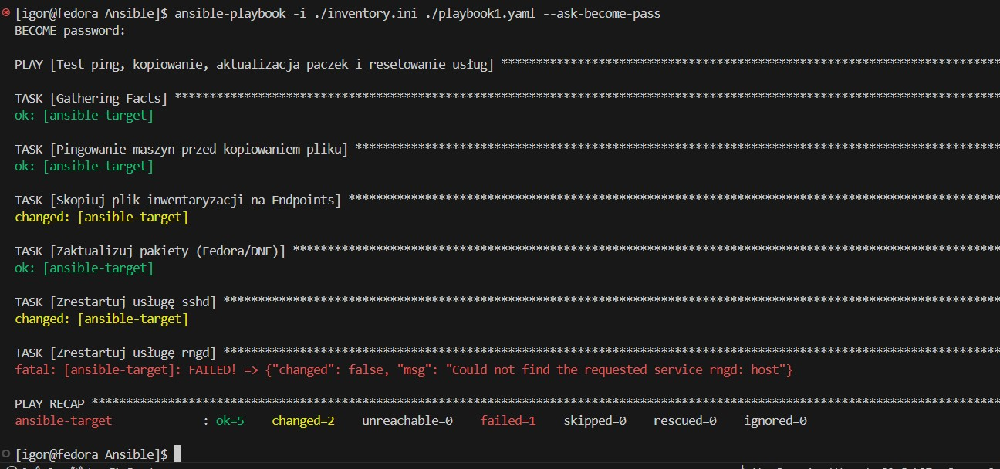

**Opis:**
Uruchomiono rozszerzony playbook zawierający dodatkowe zadania: aktualizacja pakietów oraz restart usług sshd i rngd. Restart sshd powiódł się, ale restart rngd zakończyłem błędem — usługa rngd nie została znaleziona na docelowym systemie (FAILED).

Playbook4

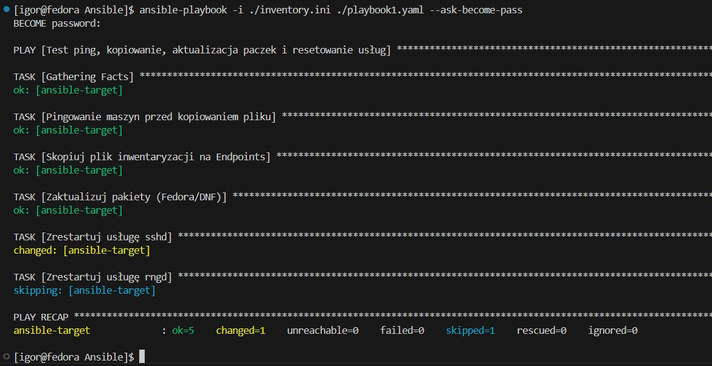

**Opis:**
Ten sam playbook co wcześniej, lecz tym razem zastosowano warunek pomijający restart rngd, gdy usługa nie istnieje. Dzięki temu wszystkie zadania wykonały się poprawnie, a rngd zostało oznaczone jako skipped.

Playbook5

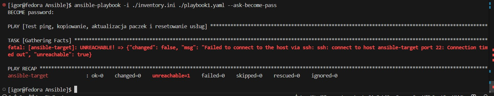

**Opis:**
Playbook nie mógł nawiązać połączenia z hostem docelowym przez SSH — błąd Connection timed out. To oznaczało, że host ansible-target był niedostępny (np. maszyna wirtualna mogła być wyłączona lub miała zablokowany port 22).

## Lab 9 – Instalacja nienadzorowana (Kickstart)

Cel : Pliki odpowiedzi dla wdrożeń nienadzorowanych

Aby móc skopiować odpowiedni link musiałem stworzyć nową kolejną maszynę wirtualną na którą pobierałem plik odpoweiedzi anaconda. Dodałem zmiany w tym pliku, jednakże nie udało mi się ostatecznie uruchomić, nie udało mi się przeprowadzić całej instalacji nienadzorowanej, przez co nie mogłem uruchomić maszyny z płyty ISO. 

Anaconda

[anaconda](anaconda-ks.cfg)

Zrzut ekranu przedstawia zmodyfikowane wpisy GRUB-a w maszynie wirtualnej VirtualBox, przygotowane do automatycznej (nienadzorowanej) instalacji Fedory 41.
Użyto pliku odpowiedzi (anaconda-ks.cfg), który jest udostępniany przez HTTP z lokalnego serwera (adres: http://192.168.56.1:8000/anaconda-ks.cfg). Instalator wykorzystuje obraz jądra (vmlinuz) oraz initrd (initrd.img) z katalogu /images/pxeboot/, a dodatkowo pomija sprawdzanie nośnika (rd.live.check quiet).

To ustawienie umożliwia automatyczną instalację systemu zgodnie z wcześniej przygotowaną konfiguracją w pliku Kickstart.

## Lab 10 i 11 – Kubernetes

Celem zajęć było Wdrażanie na zarządzalne kontenery: Kubernetes

W tym celu zainstalowałem klastrę Kubernetes. Zaopatrzyłem się w  implementację stosu k8s minikube. Przeszedłem do realizacji zadań, kolejno zapewniłemjąc bezpieczeństwo instalacji. Uruchomiłem Kubernetesa a następnie Dashboard. Zapoznałem się również z funkcjami Kubernetesa. Zdefiniowałem w swoim projekcie krok Deploy. W tym celu przygotowałem odpowiedni Dockerfile. W ramach tego sprawozdania w celu ułatwienia sobie pracy, zamieniłem swój poprzedni projekt (irssi) na tzw. obraz gotowiec , czyli aplikację nginx. Następnie wykazałem,iż wybrana aplikacja pracuje jako kontener.

### Początkowe etapy

Uruchomienie Minikube

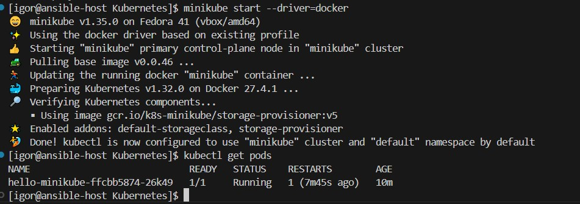

Minikube Dashboard

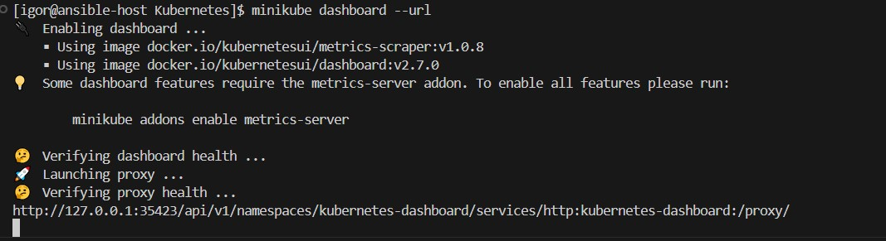

Workloads

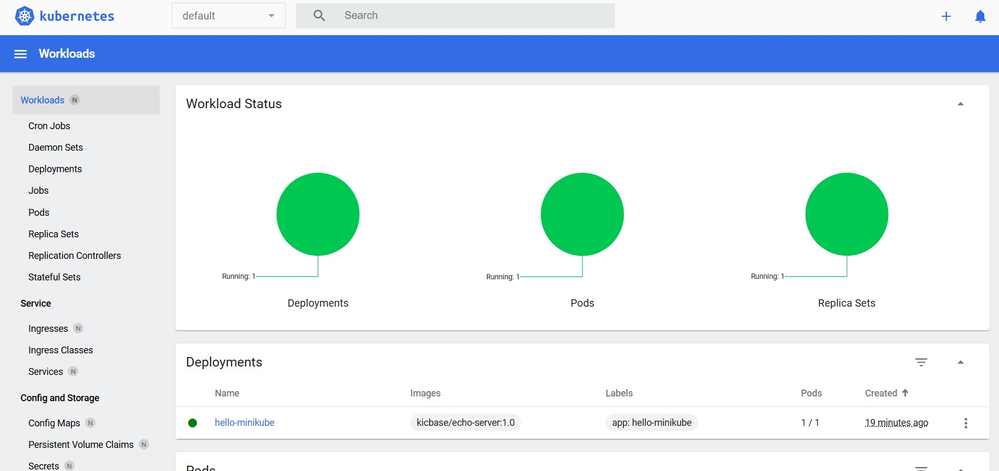

Addons Metrics

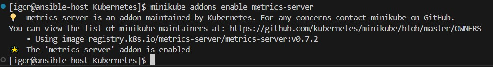

Nginx Deploy
Uruchomiłem depoly. Na załączonym poniżej screenie widać, że działa poprawnie

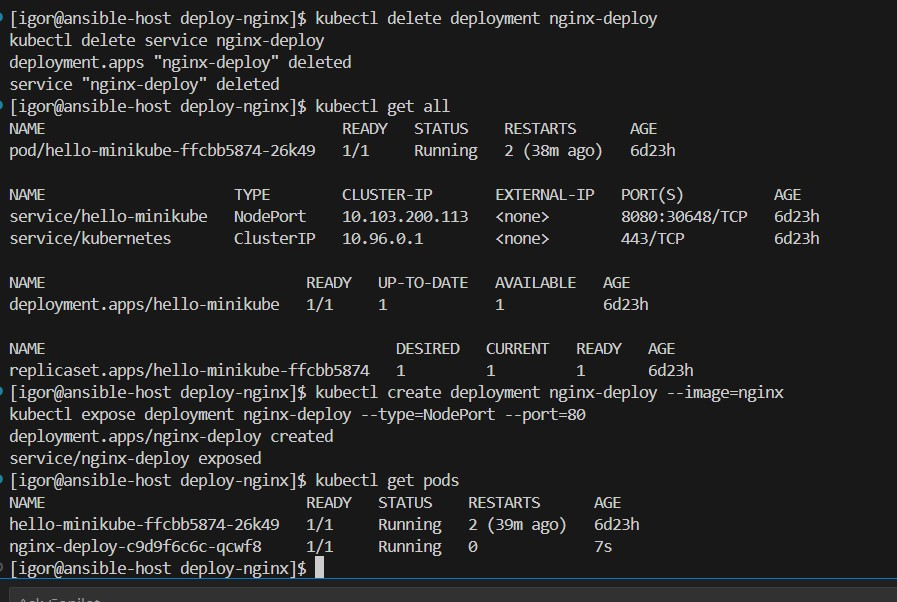

Przedstawia proces usunięcia starego deploymentu nginx-deploy, a następnie jego ponownego utworzenia oraz wystawienia usługi (kubectl expose) typu NodePort.
Polecenie kubectl get pods potwierdziłem, że pod nginx-deploy zostałem utworzony i działa. Cała operacja jest częścią ćwiczenia z zarządzania deploymentami i usługami w Kubernetesie.

Hello run

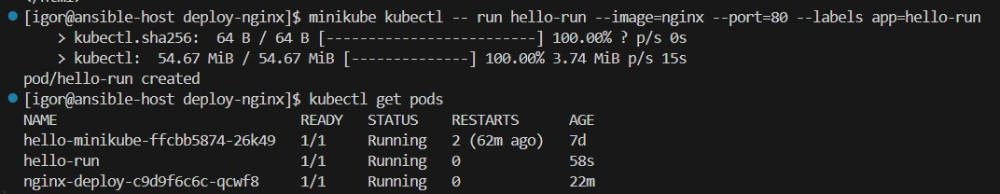

Uruchomienie nowego poda hello-run w środowisku Minikube z obrazem nginx, nasłuchującego na porcie 80 i oznaczonego etykietą app=hello-run.
Po utworzeniu poda, polecenie kubectl get pods potwierdziłem, że nowy pod działa poprawnie (STATUS: Running). W systemie aktywne są również inne pody: hello-minikube oraz wcześniejszy nginx-deploy.

Welcome to Nginx 

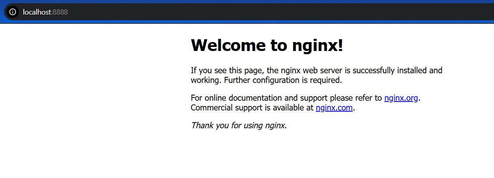

Nginx Service

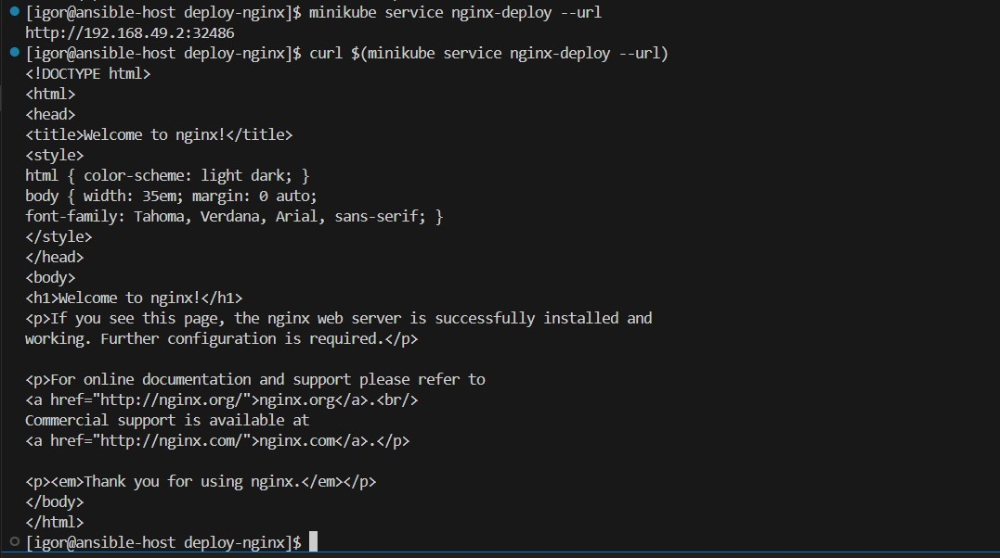

Zrzut ekranu pokazuje, że po wystawieniu serwisu nginx-deploy, zostałem on uruchomiony i przypisano mu adres URL (minikube service nginx-deploy --url).
Użycie curl do pobrania zawartości tego URL-a potwierdziłem, że serwer nginx działa poprawnie – wyświetla się domyślna strona powitalna Nginx w formacie HTML.

Błędy

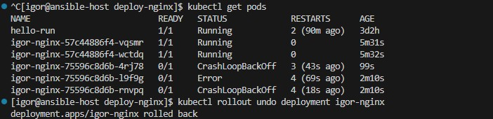

Zrzut ekranu przedstawia wynik polecenia kubectl get pods, gdzie widoczne są błędy w działaniu kilku podów powiązanych z deploymentem igor-nginx.
Występują statusy CrashLoopBackOff oraz Error, które świadczą o błędach aplikacji lub obrazu kontenera.
Na końcu wykonałem polecenie kubectl rollout undo deployment igor-nginx, które cofa deployment do poprzedniej, stabilnej wersji.

Wersja 1

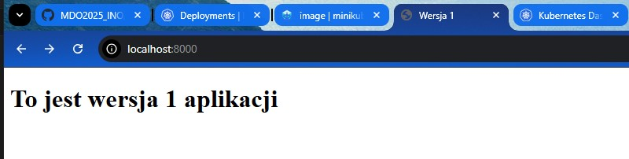

Przeglądarka internetowa wyświetla stronę działającą lokalnie na porcie 8000.
Treść strony to: "To jest wersja 1 aplikacji", co oznaczało, że uruchomiona jest pierwsza wersja aplikacji (np. po cofnięciu rolloutu lub przed aktualizacją wersji obrazu).

Wersja 2

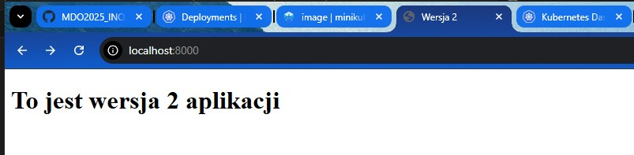

Zrzut pokazuje widok w przeglądarce z treścią: "To jest wersja 2 aplikacji", co oznaczało, że aplikacja zostałema zaktualizowana do nowej wersji.
Użyłem kubectl set image , co umożliwiło przetestowanie wersji 2 aplikacji w Kubernetesie.

Rollout wersja 1

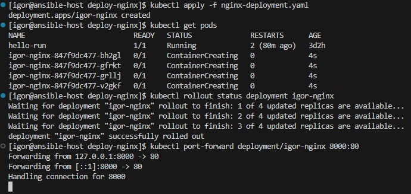

Zrzut ekranu pokazuje proces wdrożenia aplikacji do klastra Kubernetes przy użyciu pliku nginx-deployment.yaml.
Polecenie kubectl apply -f nginx-deployment.yaml tworzy deployment igor-nginx, a następnie kubectl get pods pokazuje, że pody są w trakcie tworzenia (ContainerCreating).
Kolejne polecenie kubectl rollout status deployment igor-nginx monitoruje proces wdrażania — widziałem komunikaty postępu wdrażania replik aż do momentu sukcesu.
Na końcu wykonałem tunelowanie portu 8000 lokalnie do portu kontenera (kubectl port-forward), co pozwala na lokalne testowanie aplikacji webowej (np. w przeglądarce).

Rollout wersja 2

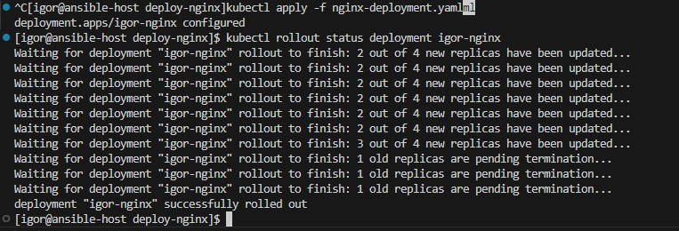

To była kontynuacja z poprzedniego etapu — ponownie zastosowano plik nginx-deployment.yaml, prawdopodobnie zaktualizowaną wersją aplikacji (np. inny obraz Dockera).
kubectl apply aktualizuje deployment, a kubectl rollout status pokazuje szczegółowy proces wymiany starych replik na nowe (new replicas updated, old replicas pending termination).
Na końcu widziałem, że rollout zakończyłem sukcesem i aplikacja została pomyślnie zaktualizowana do nowej wersji.

0 replik oraz 4 repliki

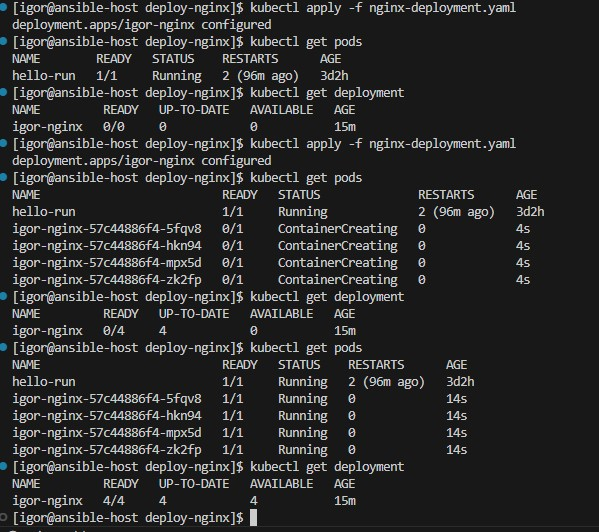

Początkowe wdrożenie aplikacji igor-nginx za pomocą pliku nginx-deployment.yaml.
Widzimy kolejne uruchomienia kubectl apply i kubectl get pods, które pokazują, że początkowo deployment nie posiada dostępnych replik (0/4), a następnie wszystkie 4 pody uruchamiają się poprawnie.
To potwierdziłem skuteczne wdrożenie i działanie aplikacji.

6 replik i 1 replika

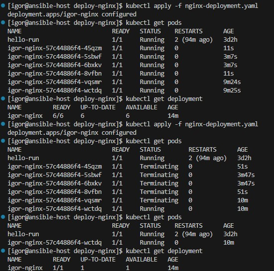

Zrzut prezentuje sytuację, w której deployment igor-nginx miał 6 działających replik (starszych), po czym ponownie zastosowano kubectl apply.
Widzimy, że stare pody zaczynają przechodzić w stan Terminating, a nowe zaczynają się uruchamiać. Jest to przykład wymiany replik podczas aktualizacji aplikacji bez przerwy w działaniu.

Strategie canary oraz recreate

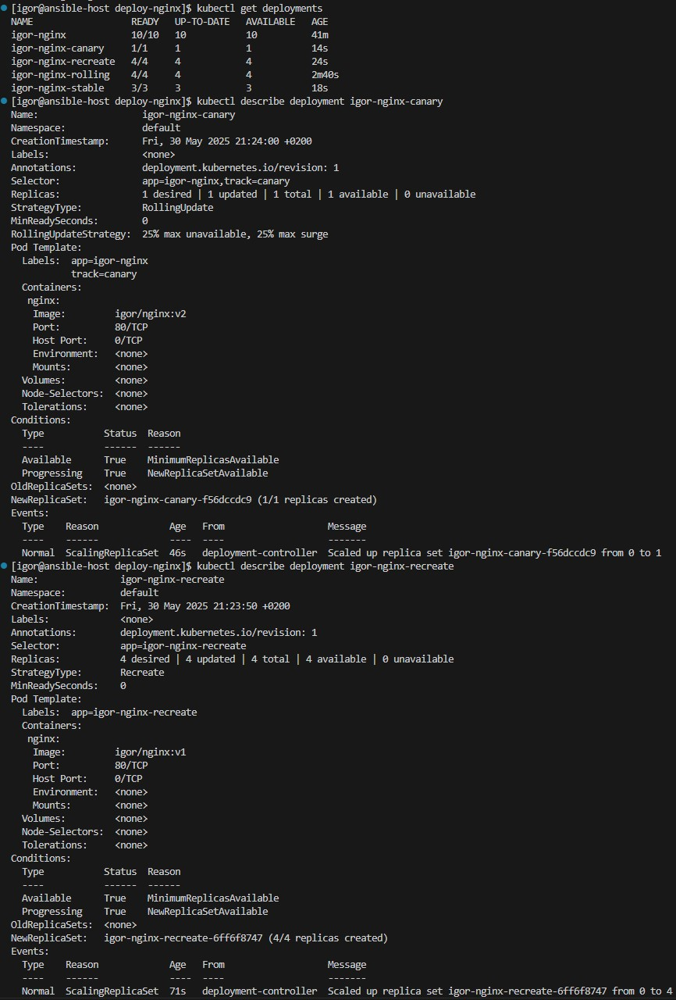

Ten zrzut zawiera dane z dwóch deploymentów:

igor-nginx-canary – używa strategii RollingUpdate, ale z etykietą track=canary, co sugeruje, że jest to wdrożenie typu canary (czyli uruchamiana jest tylko 1 nowa replika aplikacji do testów, obok istniejącej wersji).
Kontener używa obrazu igor/nginx:v2, czyli nowszej wersji.

igor-nginx-recreate – wdrożenie z pełną strategią Recreate, gdzie wszystkie stare pody są usuwane zanim zostaną uruchomione nowe.
Tutaj kontener korzysta z obrazu igor/nginx:v1, a cały zestaw 4 replik jest wymieniany jednocześnie.

Strategie rolling oraz stable

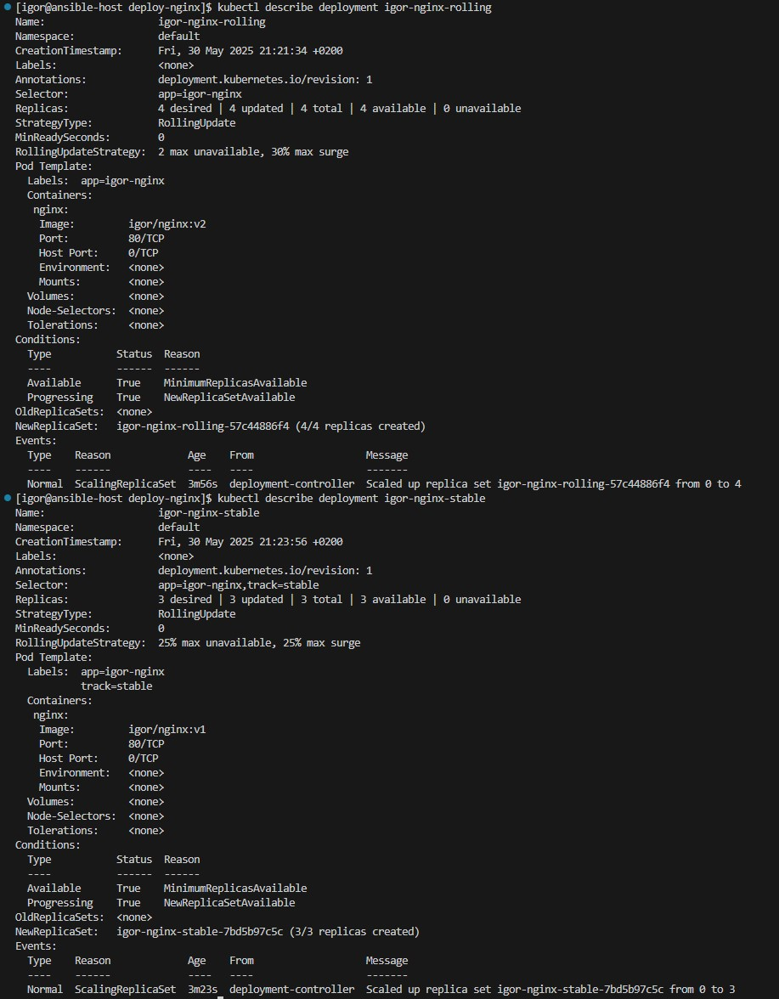

Ten zrzut również przedstawia dwa deploymenty:

igor-nginx-rolling – klasyczne wdrożenie ze strategią RollingUpdate, z ograniczeniem 2 podów maksymalnie niedostępnych i 30% nadmiarowych podczas aktualizacji.
Nowa wersja aplikacji (v2) wdrażana stopniowo — najpierw tworzona jest jedna replika, następnie kolejne, a stare są usuwane.

igor-nginx-stable – również RollingUpdate, ale tym razem z etykietą track=stable i z 3 nowymi replikami (obraz igor/nginx:v1).
Strategia bardzo zbliżona do rolling, ale etykieta wskazuje na stabilne, zatwierdzone wydanie.

Ponownie welcome to Nginx

Przeglądarka internetowa wyświetla domyślną stronę powitalną serwera Nginx na porcie 8888.
To oznaczało, że aplikacja webowa zostałema pomyślnie wdrożona i wystawiona przez Kubernetes (np. poprzez port-forward lub NodePort) i działa bez błędów.
Strona zawiera klasyczny komunikat "Welcome to nginx!", co potwierdziłem prawidłowe działanie kontenera.

Wyświetlenie wszystkich podów

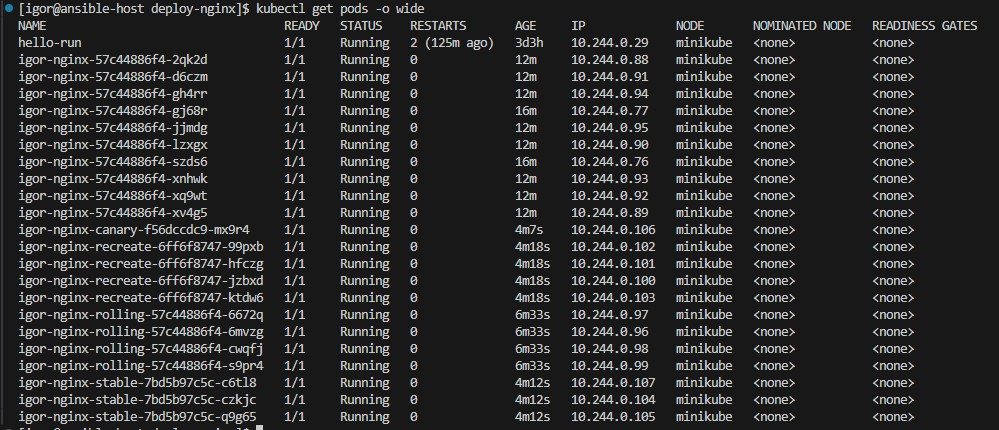

Zrzut ekranu przedstawia pełne zestawienie aktywnych podów w klastrze Kubernetes, wyświetlone z użyciem opcji kubectl get pods -o wide.
Widać wiele podów uruchomionych z różnych deploymentów (igor-nginx, igor-nginx-canary, igor-nginx-recreate, rolling, stable), każdy z unikalnym IP wewnętrznym w sieci klastra (10.244.x.x).
Kolumna NODE potwierdza, że wszystkie pody działają na tym samym hoście (minikube).

 Krótkie podsumowanie tej części

W trakcie ćwiczenia zrealizowałem kompleksowy proces zarządzania aplikacjami w środowisku Kubernetes. Używając narzędzia Minikube i poleceń kubectl, utworzyłem i testowano różne deploymenty aplikacji webowej opartej o serwer Nginx. Wdrożenia obejmowały zarówno pojedyncze pody (komenda kubectl run), jak i pełne deploymenty z wykorzystaniem plików YAML.
Dodatkowo wykorzystałem Ansible do automatyzacji podstawowych zadań administracyjnych – m.in. kopiowania plików, aktualizacji pakietów i restartowania usług. Wdrożenia były testowane za pomocą curl i przez przeglądarkę internetową, co potwierdziło ich poprawne działanie.

