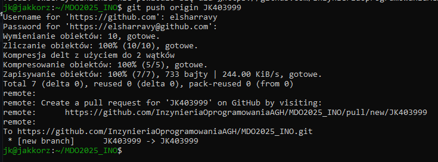
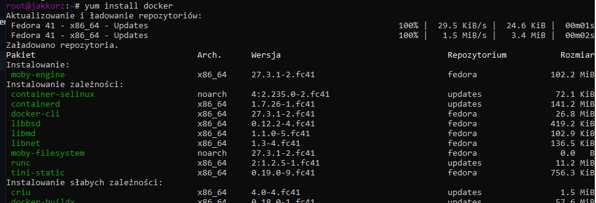

# Sprawozdanie 1

---

## Laboratorium 1

---

#### 1. Zainstaluj klienta Git i obsługę kluczy SSH

(Wszystkie kroki wykonano na systemie Fedora)  
(Po najechaniu na obraz wyświetla się tooltip z opisem)  
Najpierw zainstalowano klienta git, korzystając z polecenia: **yum install git -y**  
Obsługa kluczy SSH była już zainstalowana ponieważ podczas instalacji wybrano wersję Server Edition systemu  

#### 2. Sklonuj repozytorium przedmiotowe za pomocą HTTPS i personal access token

Aby sklonować repo za pomocą HTTPS użyto polecenia: **git clone https://github.com/InzynieriaOprogramowaniaAGH/MDO2025_INO.git** 

  

Z kolei aby sklonować repo za pomocą personal access token, najpierw wygenerowano PAT w ustawieniach githuba.  

  

#### 3. Upewnij się w kwestii dostępu do repozytorium jako uczestnik i sklonuj je za pomocą utworzonego klucza SSH, zapoznaj się dokumentacją.

  

* Utwórz dwa klucze SSH, inne niż RSA, w tym co najmniej jeden zabezpieczony hasłem 

  

* Skonfiguruj klucz SSH jako metodę dostępu do GitHuba  

  

* Sklonuj repozytorium z wykorzystaniem protokołu SSH  

  

* Skonfiguruj 2FA  

  

#### 4. Przełącz się na gałąź main, a potem na gałąź swojej grupy (pilnuj gałęzi i katalogu!)

Przełączać się między gałęziami można za pomocą polecenia git checkout  

#### 5. Utwórz gałąź o nazwie "inicjały & nr indeksu" np. KD232144. Miej na uwadze, że odgałęziasz się od brancha grupy!

  

#### 6. Rozpocznij pracę na nowej gałęzi

* W katalogu właściwym dla grupy utwórz nowy katalog, także o nazwie "inicjały & nr indeksu" np. KD232144  
Można osiągnąć to poleceniem **mkdir**
* Napisz Git hooka - skrypt weryfikujący, że każdy Twój "commit message" zaczyna się od "twoje inicjały & nr indexu". (Przykładowe githook'i są w .git/hooks.)  
* Dodaj ten skrypt do stworzonego wcześniej katalogu.  

  

*Skopiuj go we właściwe miejsce, tak by uruchamiał się za każdym razem kiedy robisz commita.  

Aby hook działał został stworzony w lokalizacji .git/hooks/ o nazwie commit-msg  
Należało też nadać mu uprawnienia do uruchamiania:  

  

* Umieść treść githooka w sprawozdaniu.  

**#!/usr/bin/bash**
**commit_msg_file=$1**
**#cat $commit_msg_file**
**count=$(grep -c '^JK403999' "$commit_msg_file")**
**#echo $count**
**if [ "$count" -eq 0 ]; then**
        **echo >&2 Commit musi zaczynac sie od inicjałów i numeru albumu**
        **exit 1**
**fi**

* W katalogu dodaj plik ze sprawozdaniem  
* Dodaj zrzuty ekranu (jako inline)  

Powyższy hook, sprawi że tylko commit zaczynający się od "JK403999" będzie mógł zostać dodany  

  

* Wyślij zmiany do zdalnego źródła  

  

* Spróbuj wciągnąć swoją gałąź do gałęzi grupowej  

  

* Zaktualizuj sprawozdanie i zrzuty o ten krok i wyślij aktualizację do zdalnego źródła (na swojej gałęzi)  

---

## Laboratorium 2

---

1. Zainstaluj Docker w systemie linuksowym
   - użyj repozytorium dystrybucji, jeżeli to możliwe (zamiast Community Edition)

          

   - rozważ niestosowanie rozwiązania Snap (w Ubuntu)

3. Zarejestruj się w [Docker Hub](https://hub.docker.com/) i zapoznaj z sugerowanymi obrazami

  

4. Pobierz obrazy `hello-world`, `busybox`, `ubuntu` lub `fedora`, `mysql`

Obrazy dockera można pobrać poleceniem: **docker pull <nazwa_obrazu>**

  

5. Uruchom kontener z obrazu `busybox`
   - Pokaż efekt uruchomienia kontenera

          
        
        Gdy po prostu uruchomimy busyboxa włączy się on, sprawdzi że nie podaliśmy żadnej dodatkowej komendy, a następnie wyłączy

   - Podłącz się do kontenera **interaktywnie** i wywołaj numer wersji

          

6. Uruchom "system w kontenerze" (czyli kontener z obrazu `fedora` lub `ubuntu`)
   - Zaprezentuj `PID1` w kontenerze i procesy dockera na hoście

          

          

   - Zaktualizuj pakiety

          

   - Wyjdź
   
7. Stwórz własnoręcznie, zbuduj i uruchom prosty plik `Dockerfile` bazujący na wybranym systemie i sklonuj nasze repo.
   - Kieruj się [dobrymi praktykami](https://docs.docker.com/develop/develop-images/dockerfile_best-practices/)

          

   - Upewnij się że obraz będzie miał `git`-a
   - Uruchom w trybie interaktywnym i zweryfikuj że jest tam ściągnięte nasze repozytorium

        

8. Pokaż uruchomione ( != "działające" ) kontenery, wyczyść je.

       

9. Wyczyść obrazy

       

10. Dodaj stworzone pliki `Dockefile` do folderu swojego `Sprawozdanie1` w repozytorium.